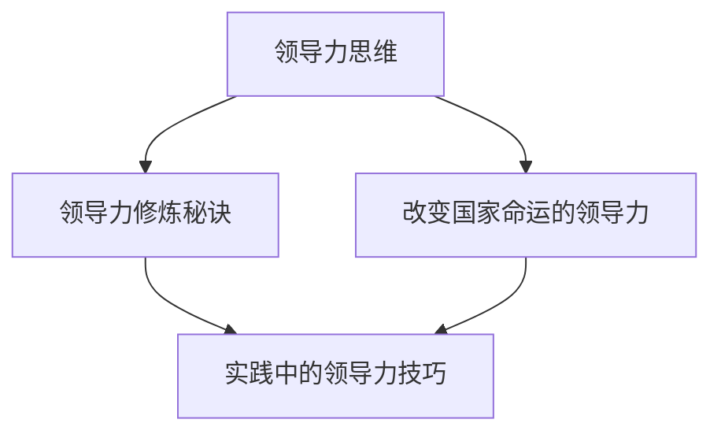

                 


### 思考步骤

#### 第一步：确定文章的核心主题

首先，我们需要确定文章的核心主题。在这个例子中，我们已经确定了主题为《领导力思维：改变国家命运的领导力修炼秘诀》。这个主题涵盖了领导力思维的基础知识、核心算法原理、数学模型、项目实战等多个方面。

#### 第二步：梳理核心概念和联系

接下来，我们需要梳理核心概念及其之间的联系。核心概念包括领导力思维、领导力修炼秘诀、改变国家命运的领导力。我们将使用Mermaid流程图来展示这些概念之间的关系。



#### 第三步：阐述核心算法原理

在核心算法原理部分，我们将介绍领导力思维中的一个重要概念——情境意识。我们将使用伪代码来详细阐述情境意识的原理。

```pseudo
function情境意识(环境，团队，目标) {
    环境数据 = 获取环境信息()
    团队数据 = 获取团队信息()
    目标数据 = 获取目标信息()

    情境 = 环境数据 + 团队数据 + 目标数据
    领导决策 = 分析情境并制定决策()

    返回领导决策
}
```

#### 第四步：讲解数学模型和公式

在数学模型和公式部分，我们将讨论SWOT分析。使用LaTeX格式给出公式，并进行详细讲解和举例说明。

$$
\text{SWOT} = \text{Strengths} + \text{Weaknesses} + \text{Opportunities} + \text{Threats}
$$

举例：一个企业的SWOT分析如下：

- **优势**：技术领先、市场份额大。
- **劣势**：资金不足、研发能力有限。
- **机会**：行业快速发展、新兴市场。
- **威胁**：竞争对手强大、政策变化。

#### 第五步：设计项目实战

在项目实战部分，我们将设计一个实际项目案例——如何领导一个初创企业。项目实战将包括环境分析、团队建设、目标设定、决策制定和执行与监控等步骤。

**环境分析**：

- **优势**：技术创新、市场潜力大。
- **劣势**：资金有限、市场份额小。
- **机会**：行业增长迅速、潜在合作伙伴。
- **威胁**：竞争激烈、法规风险。

**团队建设**：

- **核心成员**：技术专家、市场营销专家、财务专家。
- **角色分配**：技术专家负责研发，市场营销专家负责市场推广，财务专家负责财务管理。

**目标设定**：

- **短期目标**：在六个月内实现产品上市。
- **长期目标**：在三年内成为行业领导者。

**决策制定**：

- **研发策略**：加大研发投入，提高产品质量。
- **市场策略**：通过与潜在合作伙伴合作，扩大市场影响力。

**执行与监控**：

- **执行计划**：制定详细的时间表和任务分配。
- **监控机制**：定期评估项目进度和团队表现，及时调整策略。

#### 第六步：总结和最佳实践

最后，我们将总结文章的核心内容，并提供一些最佳实践、注意事项和拓展阅读建议，以帮助读者更好地理解和应用领导力思维。

---

通过以上思考步骤，我们可以确保文章内容逻辑清晰、结构紧凑，同时包含丰富的专业知识和实际应用案例。接下来，我们将根据这些思考步骤，撰写出高质量的技术博客文章。

