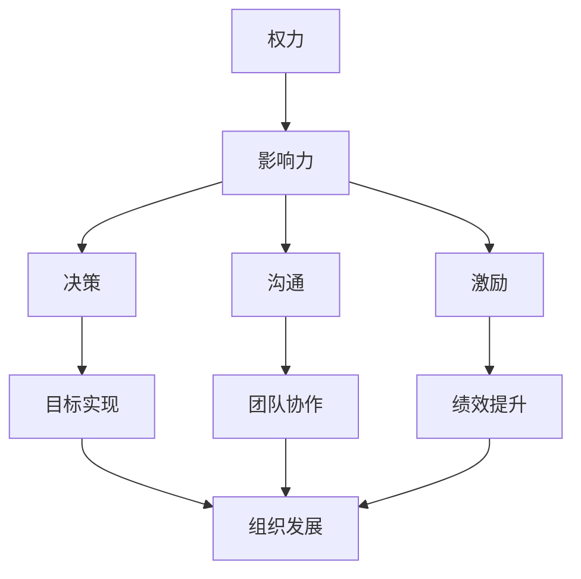

                 

### 文章标题：领导力思维：改变国家格局的领导力修炼秘诀

#### 关键词：领导力思维，国家格局，领导力模型，领导力实践，领导力修炼，领导力案例

#### 摘要：
本文深入探讨了领导力思维对于改变国家格局的重要性，系统分析了领导力模型、实践方法、修炼技巧以及领导力案例，旨在为读者提供全面且实用的领导力提升策略。通过文章的阅读，读者将能够理解领导力的本质、掌握领导力理论，并学会如何在实际情境中运用这些知识来提升个人和国家层面的领导力。

---

## 核心概念与联系

领导力是一种能够激励和引导他人共同实现目标的能力。其核心概念包括权力、影响力、决策、沟通、激励等。这些概念相互联系，共同构成了领导力的理论基础。为了更好地理解这些概念，我们可以通过以下Mermaid流程图来展示它们之间的关系：

在这个流程图中，权力和影响力是领导力的基础，通过有效的决策、沟通和激励，可以促进团队协作和绩效提升，最终实现组织发展。这些核心概念相互交织，构成了领导力思维的基本框架。

### 领导力与管理的区别

领导力和管理是两个密切相关但又有所不同的概念。管理侧重于规划、组织、协调和控制资源，以确保组织目标的实现。而领导力则更注重激发和引导团队成员的潜力，以实现共同愿景。

#### 经典定义与区别

- **管理**：是指通过计划、组织、领导和控制等手段，有效地利用资源，达成组织目标的过程。
- **领导力**：是指通过激励、启发和影响他人，实现共同目标的能力。

从定义上看，管理更多是关于“做正确的事情”，而领导力则是关于“正确地做事情”。

#### 领导力与管理的联系

虽然领导力和管理有区别，但两者在实际应用中密不可分。领导力为管理提供了方向和动力，而管理则为领导力提供了实现目标的平台和资源。在实际工作中，优秀的领导者通常也需要具备良好的管理能力。

### 领导力与影响力的关系

领导力与影响力是相互促进的。领导力是影响力的核心，而影响力则是领导力发挥作用的途径。一个有效的领导者不仅要有强大的领导力，还需要能够通过自己的行为和决策来影响他人。

#### 影响力的来源

- **知识**：领导者拥有丰富的知识和经验，能够为团队提供指导和支持。
- **信任**：团队成员对领导者的信任和尊重，使得领导者的影响力更加强大。
- **情感**：领导者能够与团队成员建立深厚的情感联系，激发他们的热情和动力。

#### 领导力与影响力的互动

领导力通过影响力和影响力通过领导力的互动，共同推动组织的发展。领导者的目标是通过有效的领导力，激发团队成员的潜力，实现共同的目标。

### 领导力与情商的互动

情商是指个体识别、理解和管理自己情绪的能力，以及识别、理解和影响他人情绪的能力。情商在领导力中起着至关重要的作用。

#### 情商对领导力的影响

- **情绪管理**：领导者能够有效地管理自己的情绪，避免情绪波动对团队决策和行为的影响。
- **人际沟通**：领导者能够更好地理解他人情绪，提高沟通效果，促进团队协作。
- **决策能力**：领导者能够基于情绪信息做出更明智的决策，减少决策风险。

#### 情商与领导力的互动

情商与领导力相辅相成，共同提升。一个高情商的领导者能够更好地理解和管理自己和他人的情绪，从而提高领导效果。

### 领导力思维的重要性

领导力思维是一种系统性的思考方式，它不仅包括对领导力概念的理解，还包括对领导力应用场景的分析和解决策略的制定。领导力思维的重要性体现在以下几个方面：

#### 指导领导行为

领导力思维帮助领导者明确目标、制定策略、优化决策，从而更有效地指导领导行为。

#### 解决复杂问题

领导力思维提供了一种系统化的方法，帮助领导者分析和解决复杂问题，提高领导力。

#### 促进组织发展

领导力思维能够帮助领导者识别和培养人才，优化组织结构，推动组织发展。

### 领导力思维的核心要素

领导力思维的核心要素包括目标设定、战略规划、决策分析、团队协作和变革管理。这些要素相互关联，共同构成了领导力思维的框架。

#### 目标设定

目标设定是领导力思维的首要任务，领导者需要明确组织的愿景和使命，并将其转化为具体的目标。

#### 战略规划

战略规划是目标设定的延伸，领导者需要根据目标制定长期的战略规划，确保组织发展方向的一致性。

#### 决策分析

决策分析是领导力思维的核心，领导者需要基于数据和分析做出明智的决策。

#### 团队协作

团队协作是领导力思维的保障，领导者需要建立有效的团队协作机制，激发团队的潜力。

#### 变革管理

变革管理是领导力思维的挑战，领导者需要面对变革的阻力，推动组织的变革和发展。

---

通过上述分析，我们可以看到领导力思维在领导行为、问题解决和组织发展中的关键作用。在接下来的章节中，我们将深入探讨领导力模型与理论、领导力实践方法、领导力修炼技巧以及领导力案例分析，帮助读者全面理解和提升领导力。

