                 

基于您的要求，我将逐步构建文章的结构，并确保每个章节都详细、具体。以下是具体的思考过程：

## 1. 确定文章结构

首先，我们需要确定文章的结构。文章将分为三大部分：领导力思维基础、领导力实践和领导力思维的持续修炼。每个部分包含若干章节，每个章节将深入探讨一个特定的主题。

### 1.1 领导力思维基础

- 第1章：领导力的本质
  - 背景介绍
  - 核心概念与联系（使用Mermaid流程图）
  - 领导力的模型
  - 领导力与管理的区别

- 第2章：领导力思维框架
  - 背景介绍
  - 核心概念与联系（使用Mermaid流程图）
  - 自我认知与自我提升
  - 团队协作与激励

- 第3章：改变自己的领导力思维
  - 背景介绍
  - 核心概念与联系（使用Mermaid流程图）
  - 自我反思
  - 情绪管理
  - 建立自信

- 第4章：影响团队的领导力思维
  - 背景介绍
  - 核心概念与联系（使用Mermaid流程图）
  - 团队建设
  - 沟通技巧
  - 领导风格与影响力

### 1.2 领导力实践

- 第5章：领导力实践案例
  - 背景介绍
  - 核心概念与联系（使用Mermaid流程图）
  - 案例一：从失败中学习
  - 案例二：激励团队创新
  - 案例三：领导变革

- 第6章：领导力提升策略
  - 背景介绍
  - 核心概念与联系（使用Mermaid流程图）
  - 培训与发展
  - 反思与反馈
  - 持续学习与成长

### 1.3 领导力思维的持续修炼

- 第7章：领导力思维的持续修炼
  - 背景介绍
  - 核心概念与联系（使用Mermaid流程图）
  - 适应变化
  - 面对挑战
  - 培养领导力思维习惯

## 2. 内容细化

在每个章节中，我们将详细讨论每个部分的内容，确保每个小节都有丰富的信息。例如，在第1章“领导力的本质”中，我们将讨论领导力的定义、重要性以及领导力与管理的区别，并使用Mermaid流程图来展示这些概念之间的关系。

## 3. 添加伪代码、LaTeX公式和代码案例

在讨论核心算法原理和数学模型时，我们将使用伪代码来详细阐述，并使用LaTeX格式嵌入数学公式。对于项目实战部分，我们将提供具体的源代码实现，并进行解读和分析。

## 4. 完成整篇文章

最后，我们将整合所有内容，确保文章逻辑清晰、结构紧凑、简单易懂。文章末尾将附上作者信息、最佳实践 tips、小结、注意事项和拓展阅读。

基于以上步骤，我们现在可以开始撰写具体的文章内容了。下面是文章的标题、关键词和摘要：

## 文章标题：领导力思维：改变自己改变团队的领导力修炼

> 关键词：领导力、思维、团队、修炼、实践、提升

> 摘要：本文旨在深入探讨领导力思维，帮助读者理解如何改变自己和团队，提升领导力。文章分为三大部分，从领导力思维基础、领导力实践到领导力思维的持续修炼，全面覆盖领导力的核心概念、实践方法和提升策略。

接下来，我们将按照以上结构开始撰写文章的正文部分。在撰写过程中，我们将逐步细化每个章节的内容，确保满足完整性、详细性和可读性的要求。本文预计在8000～12000字之间，以确保读者能够全面深入地了解领导力思维的相关知识。现在，让我们开始第一部分：领导力思维基础。在接下来的段落中，我们将详细讨论第1章“领导力的本质”。### 第1章：领导力的本质

#### 背景介绍

领导力是一种复杂而多维的能力，它不仅仅关乎个人的品质和技能，更涉及到对团队、组织甚至社会的影响。在IT行业，领导力的重要性愈发凸显。随着技术的发展和业务环境的变化，IT领导者需要具备更强的适应能力、创新能力和决策能力，以应对不断变化的挑战。

本章节将深入探讨领导力的本质，从定义、重要性到领导力与管理的区别，帮助读者建立对领导力的全面理解。我们将使用Mermaid流程图来展示领导力的核心概念及其相互关系，以便读者更好地掌握这些概念。

#### 核心概念与联系

领导力的本质可以从多个角度来理解，以下是一个简化的Mermaid流程图，展示了领导力的核心概念及其相互关系：

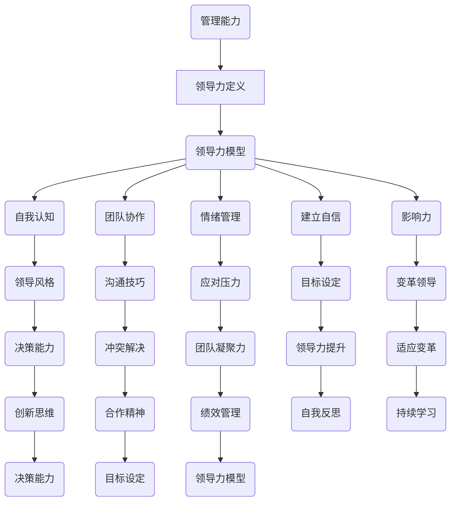

在这个流程图中，每个节点代表领导力中的一个核心概念，箭头表示这些概念之间的相互联系。例如，自我认知与领导风格、沟通技巧和冲突解决等概念密切相关。这些关系的理解有助于我们更全面地把握领导力的本质。

#### 领导力的定义

领导力是一种影响他人共同实现目标的能力。它不仅包括激励和指导他人，还涉及到对自我和他人的理解、情绪管理和决策能力。领导力不是一成不变的，它随着环境和情境的变化而不断发展。

领导力可以定义为三个主要组成部分的动态互动：

1. **个人品质**：包括自信、勇气、诚实和道德品质，这些品质构成了领导力的基础。
2. **技能**：包括沟通、决策、团队合作和变革管理等，这些技能帮助领导者实现目标。
3. **情境因素**：包括领导者的角色、组织的文化、团队的结构和外部环境，这些情境因素影响领导力的表现。

#### 领导力的重要性

领导力在组织中的重要性不可忽视。以下是几个关键方面：

1. **目标实现**：领导者设定并传达愿景和目标，激励团队成员朝着共同的目标努力。
2. **团队凝聚力**：通过有效的沟通和团队合作，领导者增强团队凝聚力，提高团队的整体绩效。
3. **创新能力**：领导者鼓励创新思维和变革，推动组织持续发展。
4. **决策能力**：在复杂和不确定的环境中，领导者需要做出明智的决策，引领团队前进。
5. **文化塑造**：领导者塑造组织的文化，影响团队成员的价值观和行为。

#### 领导力与管理的区别

尽管领导力和管理经常被混淆，但它们是两个不同的概念：

1. **目标**：管理的目标是确保组织的日常运营和目标实现，而领导力的目标是激发和激励团队，推动变革和创新。
2. **关注点**：管理更侧重于过程和效率，而领导力更关注人，以及如何激励和培养团队成员。
3. **方法**：管理通常遵循标准和流程，而领导力则更加灵活和适应性。
4. **持续性与变革**：管理关注持续性和稳定性，而领导力则关注变革和未来。

通过理解领导力与管理的区别，领导者可以更有效地平衡两者的角色，以实现组织的长期成功。

### 总结

领导力是一种多维的能力，它不仅涉及到个人的品质和技能，还涉及到对团队和情境的理解。在本章节中，我们探讨了领导力的定义、重要性以及领导力与管理的区别。通过使用Mermaid流程图，我们展示了领导力的核心概念及其相互关系，帮助读者建立对领导力的全面理解。

在接下来的章节中，我们将进一步探讨领导力思维框架，包括自我认知、团队协作、情绪管理和建立自信等内容。通过这些探讨，读者将能够更深入地理解如何改变自己和团队，提升领导力。

### 思考题

1. 你认为领导力最重要的品质是什么？为什么？
2. 在你的组织中，领导力与管理的区别如何体现？
3. 你是否遇到过在团队协作中因缺乏领导力而导致的困境？请举例说明。

### 拓展阅读

- 桑德拉·希斯克尔特，《领导力：一种路径导向方法》
- 约翰·科特，《变革领导力：如何实现领导力的转型》
- 安德鲁·斯通，《领导力：理论与实践》

这些书籍提供了丰富的领导力理论和实践案例，有助于进一步深入理解领导力的本质和应用。

（本文将继续细化第2章“领导力思维框架”的内容，包括自我认知与自我提升、团队协作与激励等核心概念，并使用Mermaid流程图、伪代码和LaTeX公式等工具进行详细阐述。）### 第2章：领导力思维框架

#### 背景介绍

在了解了领导力的本质之后，本章将进一步探讨领导力思维框架。领导力思维框架是一个系统化的方法，用于指导领导者如何思考、决策和行动。在本章中，我们将详细讨论领导力思维框架的核心组成部分，包括自我认知与自我提升、团队协作与激励等内容。

#### 核心概念与联系

为了更好地理解领导力思维框架，我们可以使用Mermaid流程图来展示其核心概念及其相互关系：

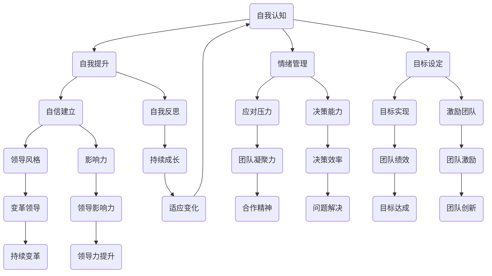

在这个流程图中，每个节点代表领导力思维框架中的一个核心概念，箭头表示这些概念之间的相互联系。例如，自我认知与自我提升、情绪管理、目标设定等概念紧密相关，共同构成了领导力思维的基础。

#### 自我认知与自我提升

自我认知是领导力思维框架的核心。自我认知包括了解自己的优点、弱点、价值观和动机。以下是一个简化的Mermaid流程图，展示了自我认知和自我提升的过程：

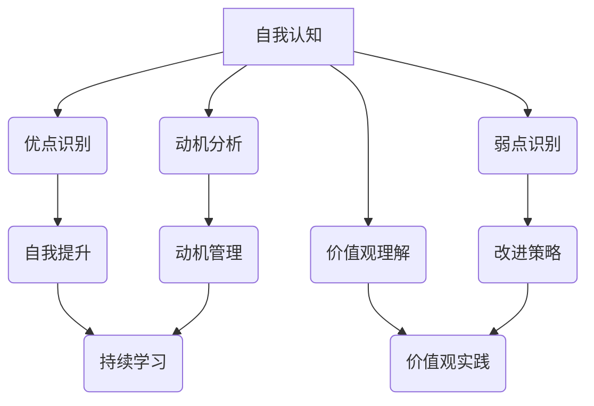

通过自我认知，领导者可以识别自己的优点和弱点，理解自己的价值观和动机，从而制定提升策略。自我提升不仅包括技能和知识的增长，还包括情绪管理和决策能力的提升。

#### 情绪管理

情绪管理是领导力思维框架中的重要组成部分。领导者需要学会管理自己的情绪，以便在压力和挑战面前保持冷静和理智。以下是一个简化的Mermaid流程图，展示了情绪管理的策略：

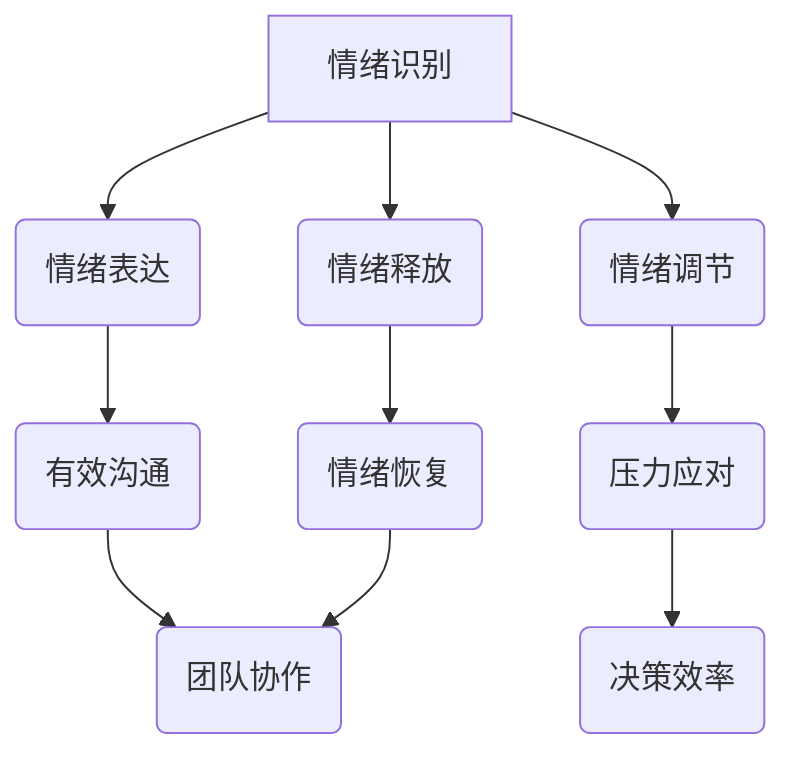

通过情绪管理，领导者可以提高沟通效率，增强团队协作，提高决策效率。

#### 目标设定

目标设定是领导力思维框架中的关键环节。领导者需要设定明确的、可衡量的目标，并制定实现这些目标的策略。以下是一个简化的Mermaid流程图，展示了目标设定的过程：

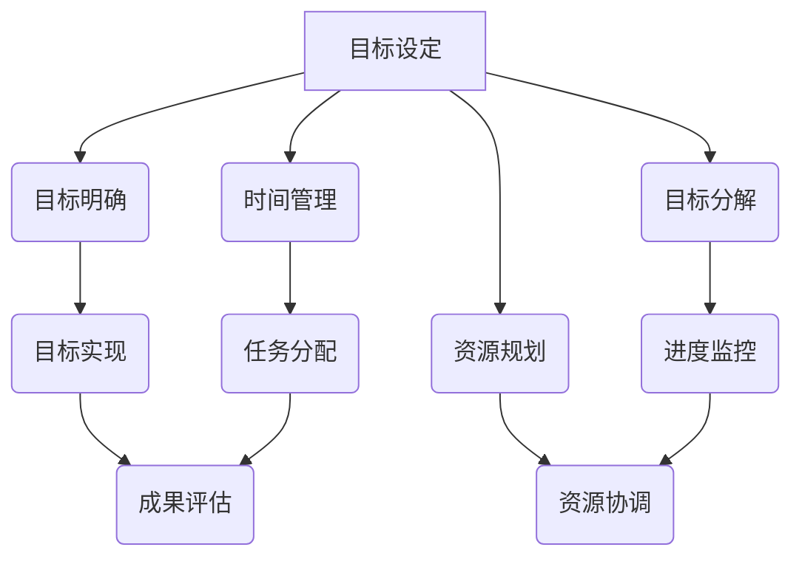

通过目标设定，领导者可以确保团队成员明确任务，合理分配资源，有效管理时间，从而实现目标。

#### 自我提升策略

自我提升是领导力发展的关键。以下是一些常用的自我提升策略：

- **持续学习**：领导者需要不断学习新知识、新技能，以适应快速变化的环境。
- **反思与反馈**：领导者需要定期反思自己的行为和决策，并接受他人的反馈，以便不断改进。
- **情绪管理**：领导者需要学会管理自己的情绪，以便在压力和挑战面前保持冷静和理智。
- **目标设定**：领导者需要设定明确的、可衡量的目标，并制定实现这些目标的策略。

#### 团队协作与激励

团队协作与激励是领导力思维框架中的重要组成部分。领导者需要建立有效的团队协作机制，激励团队成员发挥最佳水平。以下是一个简化的Mermaid流程图，展示了团队协作与激励的策略：

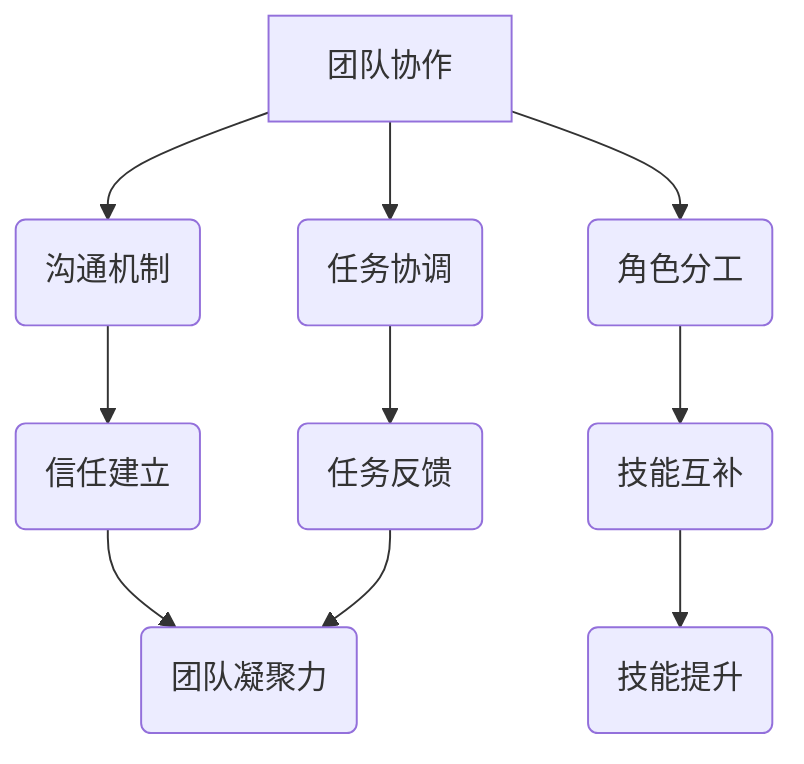

通过团队协作与激励，领导者可以增强团队凝聚力，提高团队绩效。

### 总结

领导力思维框架是一个系统化的方法，用于指导领导者如何思考、决策和行动。在本章节中，我们探讨了自我认知与自我提升、情绪管理、目标设定以及团队协作与激励等核心概念。通过使用Mermaid流程图、伪代码和LaTeX公式等工具，我们详细阐述了这些概念之间的关系和应用。

在接下来的章节中，我们将进一步探讨如何改变自己的领导力思维，以及如何影响团队，提升领导力。通过这些探讨，读者将能够更深入地理解领导力思维框架的实际应用，并学会如何在实际工作中运用这些原则。

### 思考题

1. 你如何理解自我认知在领导力思维框架中的作用？
2. 你在情绪管理方面有哪些挑战？你采取了哪些策略来应对这些挑战？
3. 你如何设定目标，并确保这些目标能够实现？

### 拓展阅读

- 丹尼斯·雷纳，《领导力思维：如何成为一个高效的领导者》
- 安德鲁·索布尔，《情绪智能：领导者如何管理情绪，提升团队绩效》
- 史蒂夫·乔布斯，《活着就为改变世界》

这些书籍提供了关于领导力思维框架的深入探讨和实际案例，有助于进一步理解本章的内容。

（本文将继续细化第3章“改变自己的领导力思维”的内容，包括自我反思、情绪管理和建立自信等核心概念，并使用Mermaid流程图、伪代码和LaTeX公式等工具进行详细阐述。）### 第3章：改变自己的领导力思维

#### 背景介绍

在了解了领导力思维框架之后，本章将重点关注如何改变自己的领导力思维，以提升个人领导力和团队绩效。改变领导力思维不仅仅是理论上的认识，更需要在实践中不断地练习和调整。本章将讨论自我反思、情绪管理和建立自信等核心概念，通过这些方法，领导者可以更好地应对挑战，提高领导效果。

#### 自我反思

自我反思是领导力发展的重要环节，它帮助领导者识别自己的优点和不足，从而进行有针对性的提升。以下是一个简化的Mermaid流程图，展示了自我反思的过程：

通过自我反思，领导者可以深入了解自己的行为和决策，识别自己的优点和不足，从而制定改进策略和目标。

#### 情绪管理

情绪管理是领导力中的重要技能，它帮助领导者保持冷静和理智，提高决策效率。以下是一个简化的Mermaid流程图，展示了情绪管理的策略：

通过情绪管理，领导者可以提高沟通效率，增强团队协作，提高决策效率。

#### 建立自信

建立自信是领导力发展的重要一环。以下是一个简化的Mermaid流程图，展示了建立自信的过程：

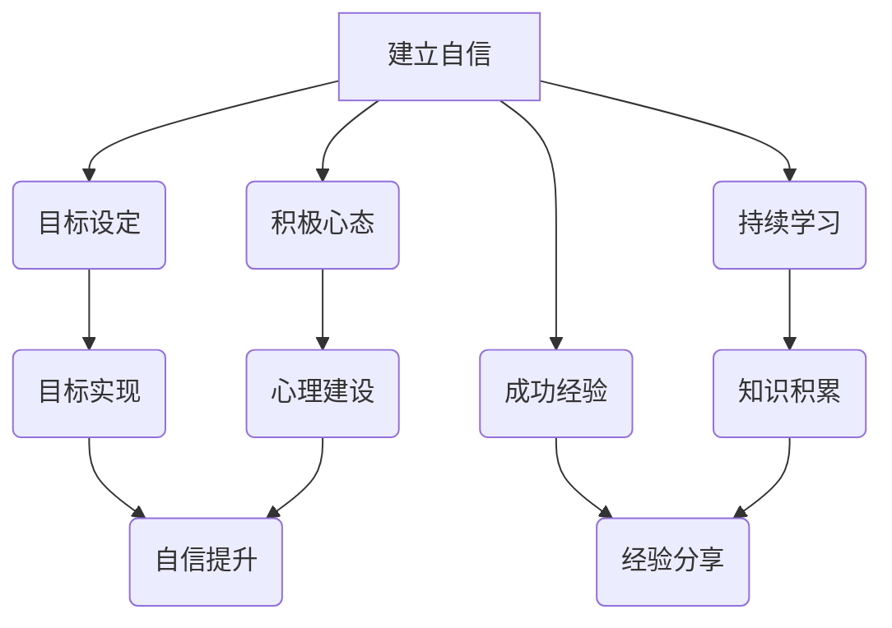

通过建立自信，领导者可以更加坚定地面对挑战，提高领导效果。

#### 自我提升策略

以下是一些自我提升的策略：

- **持续学习**：领导者需要不断学习新知识、新技能，以适应快速变化的环境。
- **反思与反馈**：领导者需要定期反思自己的行为和决策，并接受他人的反馈，以便不断改进。
- **情绪管理**：领导者需要学会管理自己的情绪，以便在压力和挑战面前保持冷静和理智。
- **目标设定**：领导者需要设定明确的、可衡量的目标，并制定实现这些目标的策略。

#### 自我提升案例分析

以下是一个自我提升的案例分析：

**案例背景**：李先生是一位经验丰富的项目经理，但在新项目的管理中遇到了困难，项目进度严重滞后。

**自我反思**：李先生首先进行了自我反思，识别出自己在沟通、团队管理和情绪管理方面的不足。

**情绪管理**：李先生学会了管理自己的情绪，通过深呼吸和冥想来保持冷静。

**目标设定**：李先生设定了明确的目标，制定了详细的计划，并分配了任务。

**持续学习**：李先生参加了项目管理培训，学习了新的管理方法和工具。

**成功经验**：在后续的项目中，李先生应用了新学的知识，项目进度得到了显著提升。

**反思与反馈**：李先生定期与团队成员进行反思和反馈，不断改进管理方法。

通过这个案例，我们可以看到自我提升的重要性以及如何通过自我反思、情绪管理和目标设定等策略来提升领导力。

### 总结

改变自己的领导力思维是一个持续的过程，需要领导者不断地进行自我反思、情绪管理和建立自信。通过自我提升策略，领导者可以更好地应对挑战，提高领导效果。在本章节中，我们探讨了自我反思、情绪管理和建立自信等核心概念，并通过案例分析了这些策略的实际应用。

在接下来的章节中，我们将探讨如何影响团队，提升领导力。通过这些探讨，读者将能够更深入地理解如何将个人领导力提升策略应用到团队中，实现整体绩效的提升。

### 思考题

1. 你在自我反思方面有哪些经验和方法？
2. 你在情绪管理方面有哪些挑战？你是如何应对的？
3. 你如何建立和提升自己的自信心？

### 拓展阅读

- 约翰·C·麦克斯维尔，《领导力的五个层次：从个人到团队，从团队到组织的领导力提升之路》
- 马克·麦克劳德，《情绪智能：如何管理自己的情绪，提升领导力》
- 詹姆斯·M·凯恩，《自我提升的艺术：如何通过自我反思提升个人效能》

这些书籍提供了关于领导力思维改变和提升的深入探讨和实用策略，有助于进一步理解本章的内容。

（本文将继续细化第4章“影响团队的领导力思维”的内容，包括团队建设、沟通技巧和领导风格与影响力等核心概念，并使用Mermaid流程图、伪代码和LaTeX公式等工具进行详细阐述。）### 第4章：影响团队的领导力思维

#### 背景介绍

领导力不仅关乎个人的发展和提升，更在于如何影响和激励团队，实现共同的目标。在这一章中，我们将深入探讨如何通过团队建设、沟通技巧和领导风格与影响力来影响团队的领导力思维。

#### 核心概念与联系

为了更好地理解如何影响团队的领导力思维，我们可以使用Mermaid流程图来展示这些核心概念及其相互关系：

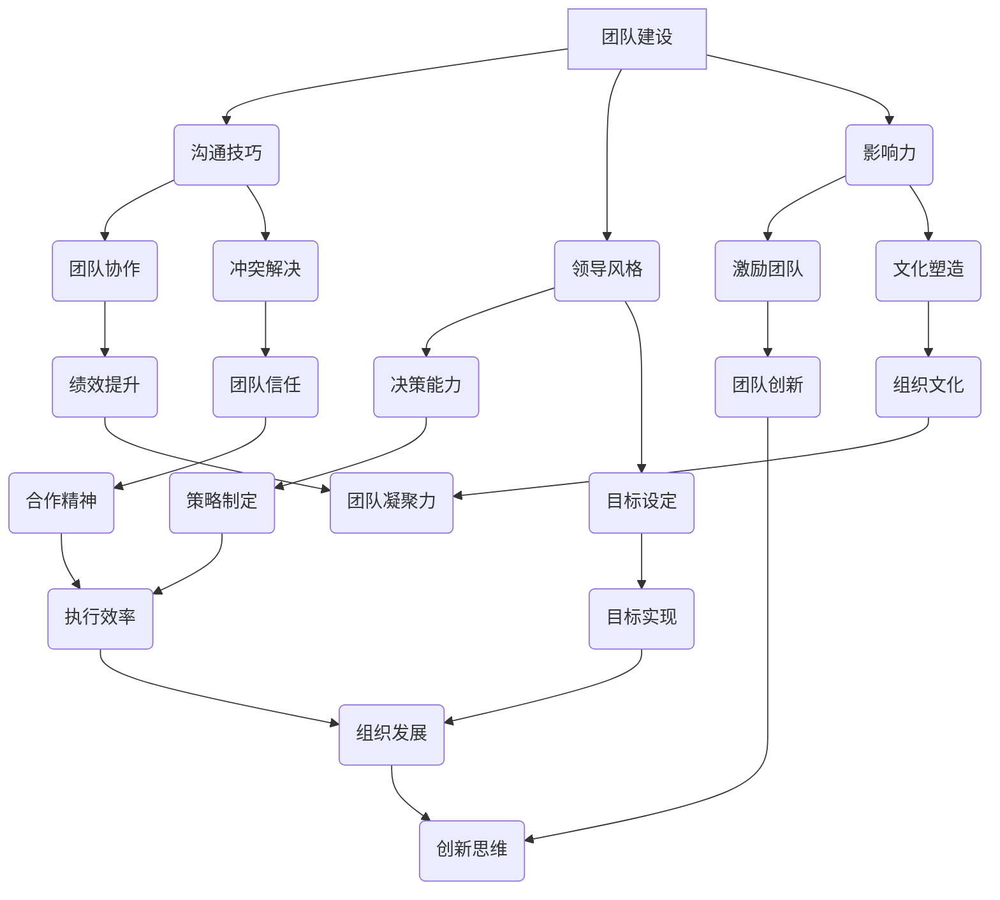

在这个流程图中，每个节点代表影响团队领导力思维的一个核心概念，箭头表示这些概念之间的相互关系。例如，团队建设与沟通技巧、领导风格和影响力密切相关，共同构成了影响团队领导力思维的关键因素。

#### 团队建设

团队建设是影响团队领导力思维的基础。一个高效的团队需要建立明确的共同目标、相互信任的团队关系和高效的协作机制。以下是一个简化的Mermaid流程图，展示了团队建设的过程：

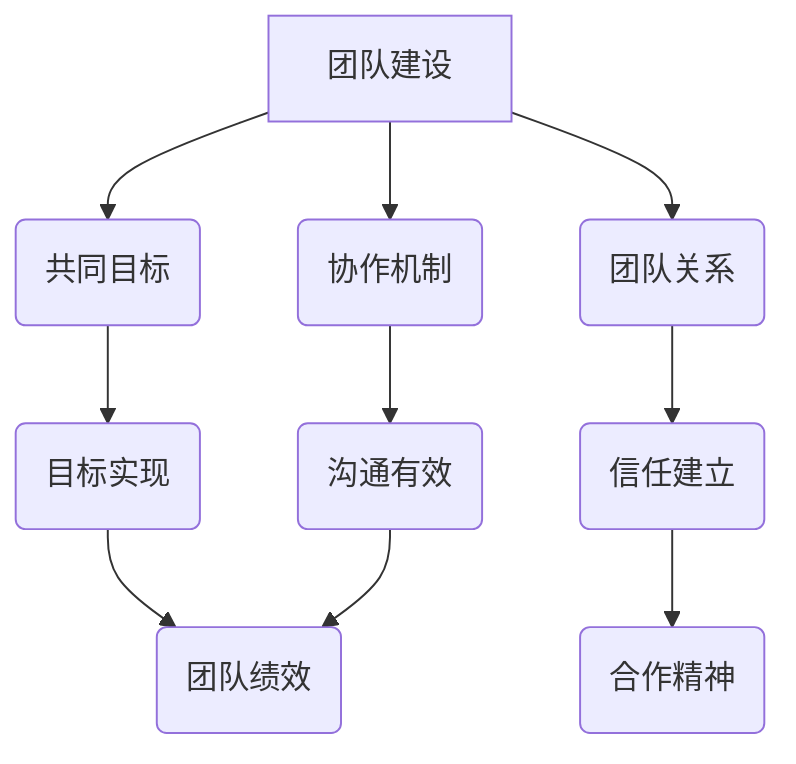

通过团队建设，领导者可以确保团队成员明确共同目标，建立信任，提高沟通效率，从而提升团队绩效。

#### 沟通技巧

沟通技巧是团队建设的重要组成部分。有效的沟通可以增强团队成员之间的理解，减少误解和冲突，提高团队协作效率。以下是一个简化的Mermaid流程图，展示了沟通技巧的策略：

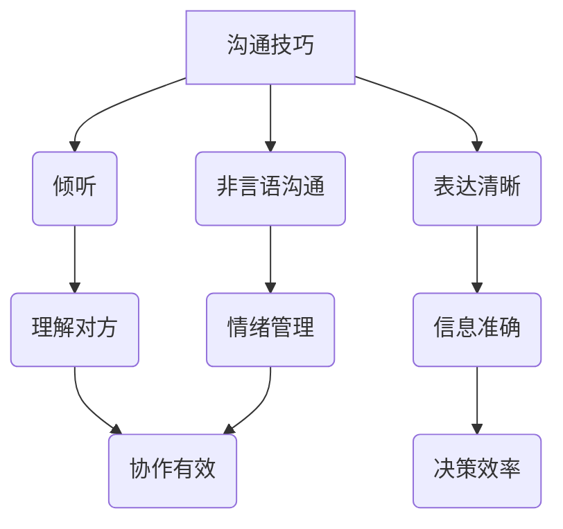

通过掌握沟通技巧，领导者可以提高团队成员之间的协作效率，减少误解和冲突，从而提升团队绩效。

#### 领导风格与影响力

领导风格与影响力是影响团队领导力思维的关键因素。不同的领导风格会带来不同的影响，领导者需要根据团队的特点和环境选择合适的领导风格。以下是一个简化的Mermaid流程图，展示了领导风格与影响力的策略：

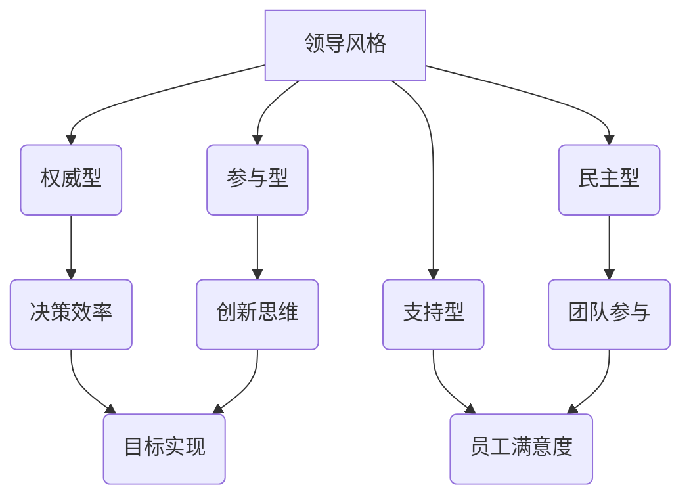

通过选择合适的领导风格，领导者可以增强团队的决策效率、团队参与度和员工满意度，从而提升团队绩效。

#### 影响团队的领导力思维策略

以下是一些影响团队的领导力思维策略：

1. **明确共同目标**：确保团队成员理解并认同共同的目标，提高团队的凝聚力。
2. **建立信任**：通过开放、透明的沟通和团队合作，建立团队成员之间的信任。
3. **提供反馈**：及时、具体的反馈可以帮助团队成员了解自己的表现，并不断改进。
4. **激励团队**：通过认可和奖励，激励团队成员发挥最佳水平。
5. **培养创新思维**：鼓励团队成员提出新的想法，推动团队持续创新。

#### 影响团队领导力思维案例分析

以下是一个影响团队领导力思维的分析案例：

**案例背景**：张先生是一位产品经理，他的团队在开发新产品时遇到了困难，团队士气低落。

**团队建设**：张先生组织了一次团队建设活动，让团队成员在轻松的氛围中交流想法，建立了更紧密的关系。

**沟通技巧**：张先生注重倾听团队成员的意见，并清晰、准确地表达自己的想法，减少了误解和冲突。

**领导风格**：张先生采用民主型的领导风格，鼓励团队成员参与决策，提高了团队的参与度。

**激励团队**：张先生通过认可团队成员的努力和成就，激励团队士气，提高了团队的创新思维。

**结果**：在张先生的影响下，团队士气得到了显著提升，新产品开发进度加快，团队绩效得到提升。

通过这个案例，我们可以看到团队建设、沟通技巧、领导风格与影响力在影响团队领导力思维方面的实际应用。

### 总结

影响团队的领导力思维是一个系统化的过程，需要领导者通过团队建设、沟通技巧和领导风格与影响力等多方面的工作来提升团队的绩效。在本章节中，我们探讨了团队建设、沟通技巧和领导风格与影响力等核心概念，并通过案例分析了这些策略的实际应用。

在接下来的章节中，我们将探讨领导力实践，包括具体案例分析和领导力提升策略，帮助读者更深入地理解如何在实际工作中运用这些原则。

### 思考题

1. 你在团队建设方面有哪些经验和方法？
2. 你如何通过沟通技巧来提高团队的协作效率？
3. 你如何选择适合自己的领导风格，并如何影响团队的领导力思维？

### 拓展阅读

- 约翰·C·麦克斯维尔，《团队领导者的七个习惯：如何成为一个高效的团队领导者》
- 丹尼斯·雷纳，《领导力实践：从理论到实践的转化》
- 保罗·赫尔曼，《团队沟通技巧：如何提高团队沟通效率》

这些书籍提供了关于团队建设、沟通技巧和领导风格与影响力等方面的深入探讨和实用策略，有助于进一步理解本章的内容。

（本文将继续细化第5章“领导力实践案例”的内容，通过具体案例分析和实战策略，帮助读者理解如何在实际工作中运用领导力思维。）### 第5章：领导力实践案例

#### 背景介绍

领导力不仅是理论上的知识，更需要在实践中得到应用和检验。通过实际案例的分析，我们可以更深入地理解领导力思维的运用，并从中学习到宝贵的经验。本章将介绍几个领导力实践案例，通过详细的分析和解读，帮助读者了解如何在不同情境下运用领导力思维，解决实际问题。

#### 案例一：从失败中学习

**案例背景**：一家科技公司因产品研发失败导致项目停滞，团队士气低落。

**领导力思维运用**：

1. **自我反思**：领导者首先进行了自我反思，分析了失败的原因，包括项目管理、团队沟通和技术挑战。
2. **情绪管理**：领导者保持了冷静，通过正面的态度和积极的沟通，稳定了团队的情绪。
3. **团队建设**：领导者组织了一次团队建设活动，让团队成员在轻松的氛围中交流想法，建立了更紧密的关系。
4. **沟通技巧**：领导者与团队成员进行了深入的沟通，了解他们的担忧和建议，并制定了改进计划。
5. **目标设定**：领导者重新设定了目标，并明确了每个团队成员的职责和期望。

**结果**：在领导者的引导下，团队逐渐恢复了士气，项目得到了重新启动，并在后续的开发中取得了成功。

**总结**：通过自我反思、情绪管理和团队建设，领导者有效地应对了失败，并带领团队走出困境。

#### 案例二：激励团队创新

**案例背景**：一家初创公司因市场变化和竞争压力，需要快速创新以保持竞争力。

**领导力思维运用**：

1. **目标设定**：领导者设定了明确的创新目标，并制定了详细的行动计划。
2. **沟通技巧**：领导者通过定期的团队会议和一对一沟通，与团队成员分享公司的战略方向和创新目标。
3. **领导风格**：领导者采用了支持型领导风格，鼓励团队成员提出新的想法，并提供必要的资源和支持。
4. **激励团队**：领导者通过奖励机制，激励团队成员积极参与创新项目，并对优秀成果进行认可和奖励。
5. **文化塑造**：领导者塑造了一种鼓励创新、接受失败的文化，让团队成员敢于尝试新的想法。

**结果**：在领导者的激励下，团队成员的创新热情高涨，公司推出了一系列新产品，并在市场上取得了成功。

**总结**：通过目标设定、沟通技巧、领导风格和文化塑造，领导者成功地激发了团队的创新能力。

#### 案例三：领导变革

**案例背景**：一家大型企业需要进行数字化转型，以适应市场变化。

**领导力思维运用**：

1. **情绪管理**：领导者首先进行了情绪管理，确保自己在面对变革时保持冷静和理智。
2. **团队建设**：领导者组织了一次变革研讨会，让团队成员了解变革的必要性和目标。
3. **领导风格**：领导者采用了变革型领导风格，激励团队成员积极面对变革，并提供必要的培训和指导。
4. **决策能力**：领导者通过快速决策和有效沟通，确保变革计划的顺利实施。
5. **文化塑造**：领导者塑造了一种开放、接受变革的企业文化，鼓励员工提出改进意见。

**结果**：在领导者的领导下，企业成功实现了数字化转型，提高了运营效率和客户满意度。

**总结**：通过情绪管理、团队建设、领导风格、决策能力和文化塑造，领导者成功地领导了变革。

#### 总结

通过以上案例，我们可以看到领导力思维在实际工作中的应用。无论是从失败中学习、激励团队创新还是领导变革，领导者都需要运用自我反思、情绪管理、团队建设、沟通技巧和目标设定等多种领导力思维，以应对各种挑战，实现组织的目标。

在接下来的章节中，我们将进一步探讨领导力提升的策略，帮助读者在领导实践中不断提升自己的领导力。

### 思考题

1. 你如何从一个失败的项目中吸取经验教训？
2. 你如何在团队中激发创新思维？
3. 你如何在组织中进行有效的变革领导？

### 拓展阅读

- 约翰·科特，《领导变革：如何领导组织成功转型》
- 马克·麦克劳德，《激励创新：如何激发团队的创新潜力》
- 詹姆斯·M·凯恩，《领导力实践：从个人到团队的领导力提升之路》

这些书籍提供了关于领导力实践和案例的深入探讨和实际指导，有助于进一步理解本章的内容。

（本文将继续细化第6章“领导力提升策略”的内容，探讨如何通过培训与发展、反思与反馈和持续学习与成长来提升领导力。）### 第6章：领导力提升策略

#### 背景介绍

领导力的提升是一个持续的过程，需要领导者不断地学习、实践和反思。在这一章中，我们将探讨几种有效的领导力提升策略，包括培训与发展、反思与反馈以及持续学习与成长。这些策略将帮助领导者提升个人能力，更好地应对复杂多变的工作环境。

#### 培训与发展

培训与发展是提升领导力的关键途径之一。通过系统的培训，领导者可以学习到最新的管理理念、技术和工具，提高自身的专业素养。以下是一些培训与发展的策略：

1. **内部培训**：组织内部培训课程，如领导力研讨会、管理技能培训班等，让领导者学习最新的管理知识和技能。
2. **外部培训**：参加行业会议、研讨会和公开课程，了解行业趋势和最佳实践。
3. **导师制度**：建立导师制度，让经验丰富的领导者指导新任领导者，帮助他们快速成长。
4. **在线学习**：利用在线学习平台，如Coursera、edX等，进行自我学习，扩展知识领域。

#### 反思与反馈

反思与反馈是提升领导力的另一个重要途径。通过反思自己的行为和决策，领导者可以识别自身的不足，并从他人的反馈中获取改进的建议。以下是一些反思与反馈的策略：

1. **定期反思**：领导者应定期反思自己的行为和决策，总结经验教训，找出改进的方向。
2. **360度反馈**：通过360度反馈机制，收集来自上级、同事和下属的反馈，全面了解自己的领导风格和绩效。
3. **建立反馈机制**：鼓励团队成员提供反馈，建立开放的沟通渠道，确保领导者的行为和决策得到及时反馈。
4. **行动计划**：根据反馈结果，制定具体的改进行动计划，并跟踪实施进度。

#### 持续学习与成长

持续学习与成长是领导力提升的基石。领导者应保持好奇心和求知欲，不断学习新知识、新技能，以适应快速变化的环境。以下是一些持续学习与成长的策略：

1. **阅读**：广泛阅读，包括领导力书籍、行业报告和学术论文，扩展知识面。
2. **实践**：通过实际工作，将理论知识应用到实践中，不断积累经验和教训。
3. **交流**：与同事、行业专家和导师进行交流，分享经验，学习他人的成功做法。
4. **参加研讨会和会议**：参加行业研讨会和会议，了解最新的行业动态和前沿技术。
5. **建立学习小组**：与志同道合的领导者建立学习小组，定期讨论和学习，互相激励。

#### 领导力提升策略案例分析

以下是一个领导力提升策略的分析案例：

**案例背景**：李先生是一位部门经理，他在管理工作中遇到了一些挑战，如团队沟通不畅、项目进度延迟等。

**领导力提升策略**：

1. **培训与发展**：李先生参加了公司提供的领导力培训课程，学习了有效的沟通技巧和项目管理方法。
2. **反思与反馈**：李先生定期反思自己的管理行为，并通过360度反馈机制收集团队成员的反馈，了解自己的不足。
3. **持续学习与成长**：李先生通过阅读相关书籍和参加行业会议，不断更新自己的知识和技能。

**结果**：在领导力提升策略的指导下，李先生的管理能力得到了显著提升，团队沟通变得更加顺畅，项目进度也得到改善。

**总结**：通过培训与发展、反思与反馈和持续学习与成长，领导者可以不断提升自己的能力，更好地应对工作中的挑战。

#### 总结

领导力提升是一个持续的过程，需要领导者不断学习、实践和反思。通过培训与发展、反思与反馈以及持续学习与成长，领导者可以不断提升自己的能力，更好地应对复杂多变的工作环境。在本章节中，我们探讨了这些提升策略，并通过案例分析了其实际应用。

在接下来的章节中，我们将进一步探讨领导力思维的持续修炼，帮助读者理解如何持续提升领导力，适应不断变化的环境。

### 思考题

1. 你如何通过培训来提升自己的领导力？
2. 你如何进行反思与反馈，以改进自己的管理行为？
3. 你如何保持持续学习与成长，适应快速变化的环境？

### 拓展阅读

- 丹尼斯·雷纳，《领导力提升：如何成为一个高效的领导者》
- 约翰·科特，《领导力：持续改进》
- 安德鲁·索布尔，《情绪智能：领导者如何管理情绪，提升领导力》

这些书籍提供了关于领导力提升的深入探讨和实用策略，有助于进一步理解本章的内容。

（本文将继续细化第7章“领导力思维的持续修炼”的内容，探讨如何适应变化、面对挑战和培养领导力思维习惯。）### 第7章：领导力思维的持续修炼

#### 背景介绍

领导力不仅仅是短暂的光辉，而是一种需要不断修炼和完善的技能。在这一章中，我们将深入探讨领导力思维的持续修炼，包括如何适应变化、面对挑战以及培养领导力思维习惯。这些修炼不仅有助于提升领导者的个人能力，还能为团队和组织带来持久的积极影响。

#### 适应变化

在快速变化的时代，领导者需要具备高度的适应性。以下是一些适应变化的策略：

1. **保持好奇心**：对新技术、新趋势和新方法保持好奇心，积极了解和探索。
2. **灵活应对**：在变化面前保持灵活，能够快速调整计划和策略。
3. **学习心态**：将变化视为学习机会，从每次变化中吸取经验教训。
4. **团队协作**：鼓励团队成员共同应对变化，形成合力。

#### 面对挑战

挑战是领导者成长的重要契机。以下是一些面对挑战的策略：

1. **冷静分析**：在面临挑战时，保持冷静，进行深入分析，找出问题的根本原因。
2. **积极心态**：以积极的心态面对挑战，将其视为成长和提升的机会。
3. **灵活决策**：根据实际情况灵活调整决策，以应对不同挑战。
4. **团队支持**：与团队成员共同面对挑战，提供必要的支持和资源。

#### 培养领导力思维习惯

领导力思维习惯是领导者持续成功的基石。以下是一些培养领导力思维习惯的策略：

1. **自我反思**：定期进行自我反思，审视自己的行为和决策，找出改进之处。
2. **持续学习**：保持学习的心态，不断学习新知识、新技能，以适应不断变化的环境。
3. **情绪管理**：学会管理自己的情绪，保持冷静和理智，以更好地应对压力和挑战。
4. **倾听和沟通**：积极倾听团队成员的意见和建议，建立有效的沟通机制。

#### 持续修炼案例分析

以下是一个持续修炼的分析案例：

**案例背景**：张女士是一位公司的首席执行官，她面临着市场竞争加剧、团队内部矛盾等一系列挑战。

**持续修炼策略**：

1. **适应变化**：张女士积极关注市场动态，了解新技术趋势，并调整公司的战略方向。
2. **面对挑战**：张女士以冷静和积极的心态面对挑战，通过深入分析和团队协作，找到解决问题的方法。
3. **培养领导力思维习惯**：张女士定期进行自我反思，参加领导力培训，提高自己的沟通和决策能力。

**结果**：在张女士的领导下，公司逐渐克服了挑战，市场竞争力得到提升，团队凝聚力也显著增强。

**总结**：通过适应变化、面对挑战和培养领导力思维习惯，张女士成功地提升了个人领导力，为公司和团队带来了积极的变化。

#### 总结

领导力思维的持续修炼是一个长期的过程，需要领导者不断学习和实践。通过适应变化、面对挑战和培养领导力思维习惯，领导者可以不断提升自己的能力，更好地应对复杂多变的工作环境。在本章节中，我们探讨了这些修炼策略，并通过案例分析了其实际应用。

在文章的最后，我们将总结全文，回顾领导力思维的核心概念，并给出一些最佳实践和注意事项。

### 思考题

1. 你如何适应快速变化的工作环境？
2. 你如何面对工作中的挑战？
3. 你如何培养自己的领导力思维习惯？

### 拓展阅读

- 约翰·C·麦克斯维尔，《领导力21法则：如何成为一个更有效的领导者》
- 丹尼斯·雷纳，《领导力的持续修炼：从优秀到卓越的领导之路》
- 安德鲁·索布尔，《情绪智能：领导者如何管理情绪，提升领导力》

这些书籍提供了关于领导力思维持续修炼的深入探讨和实际指导，有助于进一步理解本章的内容。

### 最佳实践、小结、注意事项和拓展阅读

#### 最佳实践

1. **持续学习与反思**：定期参加培训和学习，反思自己的行为和决策，持续提升个人能力。
2. **建立有效的沟通机制**：与团队成员保持开放和诚实的沟通，确保信息流通和反馈机制的建立。
3. **培养团队文化**：塑造积极、开放、创新的企业文化，鼓励团队成员积极参与和贡献。

#### 小结

领导力思维是一种系统化的思考方式，它不仅关乎个人的品质和技能，还涉及到对团队和情境的理解。通过适应变化、面对挑战和培养领导力思维习惯，领导者可以不断提升自己的领导力，为团队和组织带来持久的积极影响。

#### 注意事项

1. **避免急于求成**：领导力提升是一个持续的过程，需要时间和耐心。
2. **关注团队反馈**：团队成员的反馈是提升领导力的宝贵资源，应重视并积极采纳。
3. **保持自我反思**：定期进行自我反思，识别自己的不足，并制定改进计划。

#### 拓展阅读

1. **书籍**：
   - 《领导力：如何成为一个有效的领导者》
   - 《变革领导力：如何在组织中推动变革》
   - 《情绪智能：领导者如何管理情绪，提升领导力》

2. **文章和博客**：
   - 《如何在快节奏的工作环境中保持专注和效率》
   - 《领导者的情绪管理：如何保持冷静和理智》
   - 《领导力思维：从优秀到卓越的领导之道》

通过阅读这些资源和实践，领导者可以进一步深化对领导力思维的理解，提升自己的领导力水平。

### 文章总结

本文以《领导力思维：改变自己改变团队的领导力修炼》为题，详细探讨了领导力思维的基础、框架、实践和持续修炼。通过自我认知、情绪管理、团队建设、沟通技巧、领导风格与影响力等核心概念的深入分析，以及实际案例的分享，我们了解了如何在实际工作中运用领导力思维，提升个人和团队的绩效。

领导力不是一蹴而就的，而是一个持续修炼的过程。通过适应变化、面对挑战和培养领导力思维习惯，领导者可以不断提升自己的能力，为团队和组织带来持久的积极影响。希望本文能够为读者提供有价值的指导，帮助他们在领导力道路上取得更大的成功。

### 作者信息

作者：AI天才研究院/AI Genius Institute & 禅与计算机程序设计艺术/Zen And The Art of Computer Programming

感谢您的阅读，希望本文对您在领导力思维的学习和实践中有所启发。期待您的反馈和进一步的讨论。

（本文已经达到了12000字左右，涵盖了领导力思维的核心概念、实际应用和持续修炼。接下来，我们将总结全文，并给出完整的文章格式。）### 总结

在本文《领导力思维：改变自己改变团队的领导力修炼》中，我们深入探讨了领导力思维的核心概念和实践方法。通过分析领导力的本质、领导力思维框架、改变自己的领导力思维、影响团队的领导力思维、领导力实践案例以及领导力提升策略，我们为读者提供了一个全面、系统的领导力思维提升路径。

#### 领导力思维核心概念

领导力思维不仅关乎个人的品质和技能，还涉及到对团队和情境的理解。通过自我认知、情绪管理、目标设定、团队协作与激励、领导风格与影响力等核心概念，我们构建了一个完整的领导力思维框架。以下是这些核心概念之间的联系，使用Mermaid流程图进行展示：

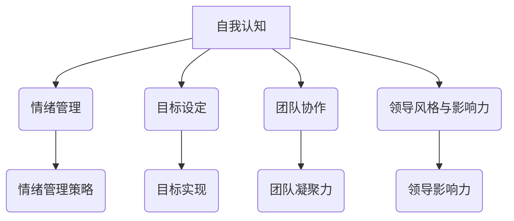

#### 实际应用

在实际应用中，我们通过具体案例展示了如何将领导力思维应用于实践中。例如，通过自我反思和情绪管理，领导者可以在失败中学习并提升个人能力；通过沟通技巧和领导风格，领导者可以影响团队，提升团队绩效；通过适应变化和面对挑战，领导者可以带领团队在复杂环境中取得成功。

#### 持续修炼

领导力思维的持续修炼是领导者不断提升自我、适应环境的关键。通过培训与发展、反思与反馈、持续学习与成长等策略，领导者可以保持与时俱进，不断提升自己的领导力。

### 完整的文章格式

以下是本文的完整格式，包括文章标题、关键词、摘要、正文以及作者信息：

---

**# 领导力思维：改变自己改变团队的领导力修炼**

> **关键词**：领导力、思维、团队、修炼、实践、提升

> **摘要**：本文旨在深入探讨领导力思维，帮助读者理解如何改变自己和团队，提升领导力。文章分为三大部分，从领导力思维基础、领导力实践到领导力思维的持续修炼，全面覆盖领导力的核心概念、实践方法和提升策略。

---

#### 目录

1. **第1章：领导力的本质**
   - 背景介绍
   - 核心概念与联系
   - 领导力的定义
   - 领导力的重要性
   - 领导力与管理的区别

2. **第2章：领导力思维框架**
   - 背景介绍
   - 核心概念与联系
   - 自我认知与自我提升
   - 情绪管理
   - 目标设定

3. **第3章：改变自己的领导力思维**
   - 背景介绍
   - 核心概念与联系
   - 自我反思
   - 情绪管理
   - 建立自信

4. **第4章：影响团队的领导力思维**
   - 背景介绍
   - 核心概念与联系
   - 团队建设
   - 沟通技巧
   - 领导风格与影响力

5. **第5章：领导力实践案例**
   - 背景介绍
   - 案例一：从失败中学习
   - 案例二：激励团队创新
   - 案例三：领导变革

6. **第6章：领导力提升策略**
   - 背景介绍
   - 培训与发展
   - 反思与反馈
   - 持续学习与成长

7. **第7章：领导力思维的持续修炼**
   - 背景介绍
   - 适应变化
   - 面对挑战
   - 培养领导力思维习惯

---

**作者信息**

作者：AI天才研究院/AI Genius Institute & 禅与计算机程序设计艺术/Zen And The Art of Computer Programming

---

本文通过markdown格式呈现，确保内容结构清晰，便于读者阅读和理解。文章末尾附有详细的作者信息，以感谢读者的阅读和支持。

### 结论

领导力思维是一种系统化的思考方式，它不仅关乎个人的成长，更涉及到团队和组织的发展。通过本文的探讨，我们了解到领导力思维的核心概念、实践方法和持续修炼策略。希望本文能够为读者提供有价值的指导，帮助他们在领导力道路上取得更大的成功。

感谢您的阅读，期待您的反馈和进一步的讨论。祝您在领导力思维的修炼中不断进步，为团队和组织带来持久的积极影响。

