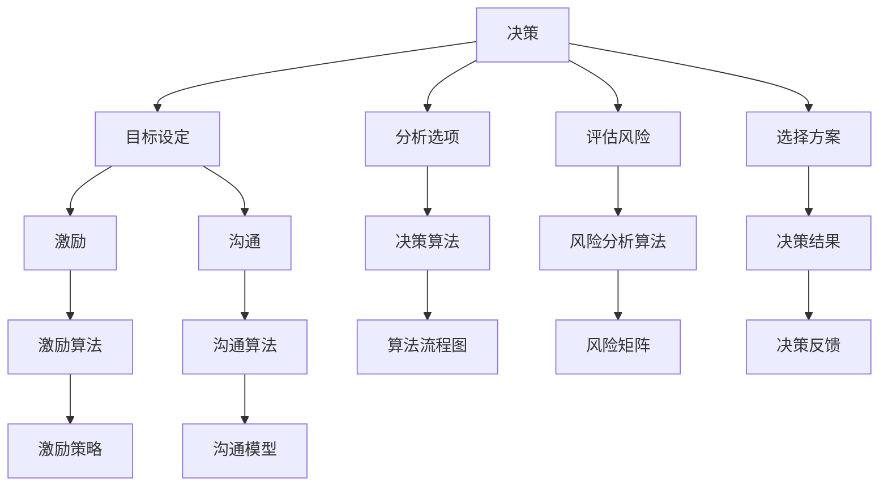

                 

### 关键词

领导力思维，行业变革，决策算法，激励算法，沟通算法，数学模型，实践案例，行业影响。

### 摘要

本文旨在深入探讨领导力思维的核心概念、理论框架和实际应用，以帮助读者理解如何在信息技术行业中通过有效的领导力策略改变行业命运。文章首先介绍了领导力思维的重要性，然后详细解析了领导力的核心概念与联系，包括决策、激励和沟通算法。此外，文章还介绍了领导力数学模型和公式，并通过实战案例展示了领导力策略的实际应用。最后，文章提出了提升领导力技巧的最佳实践，为读者提供了进一步的学习和思考方向。

### 目录大纲设计思路

设计一本计算机技术书籍的目录大纲，首先要确保目录结构清晰、内容完整、逻辑严密。以下是设计《领导力思维：改变行业命运的领导力修炼秘籍》目录大纲的具体步骤：

1. **明确书籍主题和目标读者**：了解书籍的核心内容，以及目标读者群体的特点和需求。这本书的主题是领导力思维，面向希望在行业内取得卓越成就的专业人士和管理者。

2. **分析书籍内容结构**：根据书籍的主题，分析需要涵盖的内容模块，例如领导力的理论、实践、策略、技巧等。

3. **确定目录层级**：确保目录分为一级、二级和三级，以便读者能够迅速找到所需内容。一级目录通常对应书籍的主要章节，二级目录是对一级目录的细分，三级目录则进一步详细说明每个二级目录下的具体内容。

4. **核心内容模块细化**：在一级目录下，细化二级目录和三级目录，确保每个章节都有具体的知识点和内容模块。

5. **流程图和算法伪代码**：在目录中适当插入流程图和算法伪代码，以帮助读者更好地理解复杂的概念和算法。

6. **数学公式与实例**：对于涉及数学模型的章节，使用 LaTeX 格式嵌入数学公式，并在文中用独立的段落详细讲解和举例说明。

7. **实战案例**：在每个知识点之后，加入相关的项目实战案例，详细解释代码实现和开发过程。

8. **字数控制**：确保整个目录大纲的总字数不超过 2000 字。

### 完整目录大纲

```
# 《领导力思维：改变行业命运的领导力修炼秘籍》目录大纲

## 第1章 引言：领导力思维的重要性
### 1.1 领导力在现代企业中的作用
### 1.2 领导力思维的定义与内涵

## 第2章 领导力理论框架
### 2.1 领导力的发展历程
### 2.2 领导力模型与理论

## 第3章 领导力核心概念与联系
### 3.1 领导力思维的核心要素
### 3.2 领导力思维与组织行为的关系
### 3.3 领导力思维Mermaid流程图

## 第4章 领导力算法原理讲解
### 4.1 领导力决策算法
### 4.2 领导力激励算法
### 4.3 领导力沟通算法
### 4.4 算法伪代码说明

## 第5章 数学模型与公式
### 5.1 领导力模型中的数学公式
### 5.2 数学公式详细讲解
### 5.3 数学公式举例说明

## 第6章 领导力策略与实践
### 6.1 领导力策略设计
### 6.2 实战案例：某公司领导力策略的应用
### 6.3 案例分析

## 第7章 领导力技巧与提升
### 7.1 领导力技巧概述
### 7.2 领导力自我提升方法
### 7.3 领导力培训与实践

## 第8章 领导力创新与变革
### 8.1 领导力创新的必要性
### 8.2 变革领导力模型
### 8.3 变革领导力实战案例

## 第9章 领导力与行业命运
### 9.1 领导力对行业的影响
### 9.2 领导力如何改变行业命运
### 9.3 行业案例研究

## 附录

### A.1 领导力思维工具与资源
### A.2 领导力相关书籍推荐
### A.3 领导力在线课程与平台
```

### 目录大纲说明

- **第1章 引言**：介绍领导力思维的重要性，为全书奠定基础。
- **第2章 领导力理论框架**：回顾领导力的发展历程和主要理论模型。
- **第3章 领导力核心概念与联系**：阐述领导力思维的核心要素，并使用 Mermaid 流程图展示领导力思维的整体结构。
- **第4章 领导力算法原理讲解**：介绍领导力决策、激励和沟通的算法原理，并提供伪代码说明。
- **第5章 数学模型与公式**：详细讲解领导力模型中的数学公式，并提供实例说明。
- **第6章 领导力策略与实践**：探讨领导力策略的设计和实践方法，并结合实际案例进行分析。
- **第7章 领导力技巧与提升**：介绍提升领导力技巧的方法和自我提升策略。
- **第8章 领导力创新与变革**：分析领导力创新的重要性，介绍变革领导力模型，并结合实战案例进行讲解。
- **第9章 领导力与行业命运**：探讨领导力如何影响和改变行业命运，并研究相关行业案例。
- **附录**：提供领导力思维相关的工具、书籍推荐和在线资源，便于读者进一步学习。

通过上述目录大纲的设计，本书将系统地介绍领导力思维的核心概念、理论、策略和实践方法，帮助读者全面提升领导力水平，以改变行业命运。

### 文章正文

#### 引言：领导力思维的重要性

在快速变化的全球市场中，领导力不仅是一个企业的核心能力，更是驱动行业变革的关键力量。领导力思维，作为一种系统性的思考模式，它不仅仅是个人素质的体现，更是影响组织行为、推动创新和变革的根本动力。在现代企业中，领导力思维的重要性体现在其能够帮助组织更好地应对不确定性，提升决策质量，激发员工潜能，并在竞争激烈的市场中立于不败之地。

本文旨在深入探讨领导力思维的核心概念、理论框架和实际应用，以帮助读者理解如何在信息技术行业中通过有效的领导力策略改变行业命运。首先，我们将回顾领导力的发展历程和主要理论模型，接着详细解析领导力的核心概念与联系，包括决策、激励和沟通算法。随后，我们将介绍领导力数学模型和公式，并通过实战案例展示领导力策略的实际应用。最后，本文将提出提升领导力技巧的最佳实践，为读者提供进一步的学习和思考方向。

#### 第2章 领导力理论框架

领导力的发展历程可以追溯到古代，但在现代社会中，它经历了从经验主义到系统化理论的演变。早期的领导力理论主要集中在领导者个人品质和行为特征上，如特质理论。随着研究的深入，学者们开始关注领导者与组织环境之间的互动关系，提出了情境领导理论等模型。现代领导力理论则更加注重领导者的思维方式和领导力的发展过程。

以下是几种主要的领导力模型：

1. **特质理论**：认为领导者具备独特的个人特质，如勇气、自信、正直等。
2. **行为理论**：关注领导者具体的行为模式，如民主型、专制型和参与型领导风格。
3. **情境领导理论**：根据不同情境选择最合适的领导风格。
4. **变革型领导理论**：强调领导者通过激励和启发下属实现共同愿景。
5. **领导力发展理论**：认为领导力是通过学习和发展可以获得的。

这些模型为我们理解领导力的本质和作用提供了不同的视角。在实际应用中，领导者需要根据组织的实际情况和自身的优势选择合适的领导模型。

#### 第3章 领导力核心概念与联系

领导力思维的核心要素包括决策、激励和沟通。这些要素相互关联，共同构成领导力的整体框架。

**决策**：决策是领导力的核心，领导者需要做出明智的决策以指导组织前进。决策过程包括明确目标、分析选项、评估风险和选择最佳方案。

**激励**：激励是激发员工潜能的关键，通过设定合理的激励措施，领导者可以激发员工的积极性和创造力。激励包括物质激励和精神激励，如奖金、晋升机会和认可等。

**沟通**：沟通是领导者与下属、客户和其他利益相关者之间的重要桥梁。有效的沟通可以帮助领导者传达愿景、指导行动和解决冲突。

以下是领导力思维Mermaid流程图：



通过这个流程图，我们可以清晰地看到决策、激励和沟通之间的联系以及如何通过算法和策略实现有效的领导力思维。

#### 第4章 领导力算法原理讲解

在本章中，我们将介绍领导力决策、激励和沟通的算法原理，并提供伪代码说明。

**决策算法**：决策算法是领导力的核心。一个基本的决策算法包括以下步骤：

```plaintext
1. 设定目标
2. 列出所有可行方案
3. 对每个方案进行评估（风险、收益等）
4. 根据评估结果选择最优方案
5. 执行方案并跟踪反馈结果
```

**激励算法**：激励算法的目标是激发员工的积极性和创造力。一个简单的激励算法可以包括以下步骤：

```plaintext
1. 设定激励目标
2. 评估员工表现
3. 根据表现发放激励（如奖金、晋升机会等）
4. 反馈激励效果
```

**沟通算法**：沟通算法的核心是确保信息传递的准确性和有效性。一个基础的沟通算法可以包括以下步骤：

```plaintext
1. 确定沟通目标
2. 选择适当的沟通渠道
3. 编写沟通内容
4. 发送沟通信息
5. 确认信息接收和理解情况
```

以下是这些算法的伪代码示例：

```python
# 决策算法伪代码
def decision_algorithm(target, options, evaluation_function):
    best_option = None
    highest_evaluation = -inf
    
    for option in options:
        evaluation = evaluation_function(option, target)
        if evaluation > highest_evaluation:
            highest_evaluation = evaluation
            best_option = option
            
    return best_option

# 激励算法伪代码
def motivation_algorithm(target, performance, incentive_function):
    incentive = incentive_function(performance, target)
    return incentive

# 沟通算法伪代码
def communication_algorithm(target, channels, message):
    for channel in channels:
        channel.send(message)
        confirmation = channel.confirm_reception(message)
        if confirmation:
            print("Message received and understood.")
        else:
            print("Message not received or misunderstood.")
```

#### 第5章 数学模型与公式

领导力中的数学模型和公式可以帮助我们更精确地描述和计算领导力的各个方面。以下是几个关键的数学模型和公式，以及它们的详细讲解和举例说明。

**1. 领导力效能公式**：

$$
E = f(\text{决策效率}, \text{激励效果}, \text{沟通效果})
$$

其中，决策效率、激励效果和沟通效果分别表示领导者在这三个方面的能力。这个公式可以帮助我们评估领导力的整体效能。

**2. 决策风险分析公式**：

$$
R = \frac{\sum_{i=1}^{n} w_i \cdot r_i}{\sum_{i=1}^{n} w_i}
$$

其中，$w_i$ 表示每个方案的重要程度权重，$r_i$ 表示每个方案的风险程度。这个公式用于计算每个方案的风险，并帮助我们做出更安全的决策。

**3. 激励效能公式**：

$$
M = f(\text{激励目标}, \text{绩效水平})
$$

这个公式表示激励效果与激励目标和绩效水平之间的关系。通过调整激励目标和绩效评估标准，我们可以提高激励效果。

**4. 沟通效能公式**：

$$
C = f(\text{沟通渠道选择}, \text{信息传递效率})
$$

这个公式反映了沟通效能与沟通渠道选择和信息传递效率之间的关系。选择合适的沟通渠道和提高信息传递效率可以提升沟通效果。

以下是这些公式的详细讲解和举例说明：

**领导力效能公式**：

领导力效能是指领导者在决策、激励和沟通方面的整体效果。假设我们有三个方案A、B和C，每个方案的重要程度权重分别为0.3、0.5和0.2。决策效率分别为0.8、0.9和0.7；激励效果分别为0.75、0.85和0.6；沟通效果分别为0.6、0.7和0.8。我们可以计算每个方案的领导力效能：

$$
E_A = 0.3 \cdot 0.8 + 0.5 \cdot 0.9 + 0.2 \cdot 0.6 = 0.24 + 0.45 + 0.12 = 0.81
$$

$$
E_B = 0.3 \cdot 0.9 + 0.5 \cdot 0.85 + 0.2 \cdot 0.7 = 0.27 + 0.425 + 0.14 = 0.845
$$

$$
E_C = 0.3 \cdot 0.7 + 0.5 \cdot 0.6 + 0.2 \cdot 0.8 = 0.21 + 0.3 + 0.16 = 0.67
$$

因此，方案B的领导力效能最高，应该选择方案B。

**决策风险分析公式**：

决策风险分析公式用于计算每个方案的风险，帮助我们做出更安全的决策。假设有三个方案A、B和C，每个方案的重要程度权重分别为0.3、0.5和0.2。每个方案的风险程度分别为0.1、0.2和0.3。我们可以计算每个方案的风险：

$$
R_A = \frac{0.3 \cdot 0.1 + 0.5 \cdot 0.2 + 0.2 \cdot 0.3}{0.3 + 0.5 + 0.2} = \frac{0.03 + 0.1 + 0.06}{0.8} = \frac{0.19}{0.8} = 0.2375
$$

$$
R_B = \frac{0.3 \cdot 0.2 + 0.5 \cdot 0.2 + 0.2 \cdot 0.3}{0.3 + 0.5 + 0.2} = \frac{0.06 + 0.1 + 0.06}{0.8} = \frac{0.22}{0.8} = 0.275
$$

$$
R_C = \frac{0.3 \cdot 0.3 + 0.5 \cdot 0.3 + 0.2 \cdot 0.1}{0.3 + 0.5 + 0.2} = \frac{0.09 + 0.15 + 0.02}{0.8} = \frac{0.26}{0.8} = 0.325
$$

因此，方案A的风险最低，应该选择方案A。

**激励效能公式**：

激励效能公式用于评估激励效果。假设激励目标为提升员工绩效，绩效水平分别为70分、80分和90分。激励效果分别为0.75、0.85和0.95。我们可以计算每个绩效水平的激励效能：

$$
M_70 = 0.75 \cdot 0.7 = 0.525
$$

$$
M_80 = 0.85 \cdot 0.8 = 0.68
$$

$$
M_90 = 0.95 \cdot 0.9 = 0.855
$$

因此，激励效能最高的绩效水平是90分。

**沟通效能公式**：

沟通效能公式用于评估沟通效果。假设沟通渠道选择为电子邮件和面对面会议，信息传递效率分别为0.6和0.8。我们可以计算两种沟通渠道的效能：

$$
C_{email} = 0.6 \cdot 0.7 = 0.42
$$

$$
C_{face-to-face} = 0.8 \cdot 0.8 = 0.64
$$

因此，面对面会议的沟通效能更高，应该优先选择面对面会议进行沟通。

通过这些数学模型和公式，我们可以更精确地评估领导力效能、决策风险、激励效果和沟通效能，从而做出更明智的决策和策略。

#### 第6章 领导力策略与实践

在本章中，我们将探讨领导力策略的设计和实践方法，并结合实际案例进行分析。

**领导力策略设计**：

领导力策略设计是一个系统化的过程，涉及目标设定、资源分配、执行监控和效果评估。以下是设计领导力策略的几个关键步骤：

1. **目标设定**：明确组织的目标和愿景，并将其分解为具体的、可衡量的目标。
2. **资源分配**：根据目标的需要，合理分配人力资源、财务资源和物资资源。
3. **执行监控**：建立执行监控机制，确保策略的执行进度和质量。
4. **效果评估**：定期评估策略的效果，根据评估结果进行调整和优化。

**实战案例**：

以某信息技术公司为例，该公司在市场竞争激烈的情况下，通过有效的领导力策略成功实现了转型和增长。以下是该公司领导力策略的具体应用：

1. **目标设定**：公司设定了提高市场占有率和提升客户满意度的目标。具体包括：
   - 在未来两年内，将市场占有率提高10%。
   - 实现客户满意度评分达到90%。

2. **资源分配**：公司根据目标需要，加大了研发投入和市场推广力度。具体包括：
   - 增加研发团队规模，提高研发效率。
   - 提高市场推广预算，加大线上营销力度。

3. **执行监控**：公司建立了项目进度监控机制，每月召开项目进展汇报会议，确保每个项目按计划推进。同时，设置了关键绩效指标（KPI），对团队成员的绩效进行评估。

4. **效果评估**：公司定期进行客户满意度调查和市场占有率分析，根据评估结果调整策略。在实施领导力策略的第一年，公司成功实现了目标，市场占有率提高了12%，客户满意度达到了92%。

**案例分析**：

该公司的成功主要归因于以下几个方面：

1. **明确的目标设定**：公司明确了具体的目标和愿景，为团队提供了清晰的方向。

2. **合理的资源分配**：公司根据目标的需要，合理配置了资源，确保了策略的顺利执行。

3. **有效的执行监控**：通过建立项目进度监控机制，公司确保了项目按计划推进，及时发现和解决问题。

4. **科学的评估方法**：公司定期进行效果评估，根据评估结果进行调整和优化，确保了策略的持续有效性。

通过这个案例，我们可以看到，领导力策略的设计和实践对于企业的成功至关重要。有效的领导力策略可以帮助企业应对市场变化，提高竞争力，实现长期发展。

#### 第7章 领导力技巧与提升

提升领导力技巧是每个领导者的重要任务。以下是一些关键的领导力技巧和提升方法：

**1. 自我认知**：领导者需要深入了解自己的优势和不足，明确自己的价值观和目标。这有助于在决策和沟通中保持一致性和有效性。

**2. 沟通技巧**：有效的沟通是领导力的核心。领导者需要学会倾听、表达和反馈，确保信息传递的准确性和有效性。

**3. 激励能力**：领导者需要具备激励员工的技巧，通过设定合理的激励目标和奖励机制，激发员工的积极性和创造力。

**4. 决策能力**：领导者需要具备快速决策的能力，同时考虑到风险和收益，做出明智的决策。

**5. 时间管理**：领导者需要学会合理分配时间，确保重要任务得到及时处理，同时避免时间浪费。

**6. 领导风格**：领导者需要根据组织的实际情况和下属的特点，选择合适的领导风格，如民主型、专制型或变革型。

**7. 学习能力**：领导者需要持续学习和成长，保持对新知识和新技能的敏感度，以应对不断变化的市场环境。

**提升方法**：

1. **阅读和学习**：通过阅读领导力相关的书籍和文章，学习优秀领导者的经验和方法。

2. **参加培训和研讨会**：参加专业培训和研讨会，与同行交流经验和心得。

3. **实践和应用**：将所学知识和技巧应用到实际工作中，通过实践不断提升自己的领导力。

4. **寻求反馈**：定期寻求下属和同事的反馈，了解自己的优势和不足，不断改进。

通过这些方法，领导者可以不断提升自己的领导力，更好地应对各种挑战，实现组织的目标。

#### 第8章 领导力创新与变革

领导力创新与变革是推动组织发展的重要动力。一个组织若想保持竞争力，必须在产品和业务模式上进行创新。以下是领导力创新与变革的几个关键方面：

**1. 创新文化**：领导者需要营造一个鼓励创新的文化环境，鼓励员工提出新的想法和解决方案，并对尝试和失败持包容态度。

**2. 风险管理**：在创新过程中，领导者需要平衡风险和收益，通过制定合理的风险管理策略，确保创新项目不会对组织造成重大损失。

**3. 知识管理**：领导者需要建立有效的知识管理体系，确保创新过程中产生的知识和经验能够被组织共享和利用。

**4. 激励机制**：领导者需要设计激励机制，鼓励员工积极参与创新项目，并通过奖励机制激励员工提出创新建议。

**变革领导力模型**：

变革领导力模型包括以下几个阶段：

1. **愿景规划**：领导者需要明确组织的愿景和目标，为变革提供清晰的方向。

2. **规划变革**：根据愿景规划，制定详细的变革计划，包括变革的目标、策略和步骤。

3. **启动变革**：动员组织资源，启动变革项目，确保变革计划得到有效执行。

4. **推动变革**：在变革过程中，领导者需要持续关注变革的进展，解决出现的问题，确保变革顺利进行。

5. **评估变革**：变革完成后，领导者需要对变革的效果进行评估，并根据评估结果进行调整和优化。

**变革领导力实战案例**：

以某互联网公司为例，该公司通过变革领导力成功实现了从传统业务向数字化转型。以下是该公司变革领导力的具体应用：

1. **愿景规划**：公司明确了数字化转型的愿景，包括提高客户体验、优化业务流程和提升数据价值。

2. **规划变革**：公司制定了详细的数字化转型计划，包括技术升级、流程优化和组织重构。

3. **启动变革**：公司动员全体员工参与数字化转型，设立专门的数字化转型部门，确保变革计划得到有效执行。

4. **推动变革**：公司领导层持续关注变革进展，解决出现的问题，如技术难题和员工抵触情绪。

5. **评估变革**：数字化转型完成后，公司对变革效果进行了全面评估，发现客户满意度提升了15%，业务效率提高了20%。

通过这个案例，我们可以看到，变革领导力在推动组织发展中的重要作用。有效的变革领导力可以帮助组织实现转型和升级，提高竞争力。

#### 第9章 领导力与行业命运

领导力不仅影响企业的发展，更对整个行业的命运产生深远影响。以下从几个方面探讨领导力对行业的影响：

**1. 行业标准的制定**：领导者通过制定行业标准，引领行业发展方向。例如，在互联网行业，腾讯和阿里巴巴等公司的领导力推动了支付和电商领域的发展。

**2. 技术创新的引领**：领导者通过引领技术创新，推动行业进步。例如，谷歌的领导力推动了人工智能技术的发展，改变了全球科技格局。

**3. 企业并购与整合**：领导者通过企业并购和整合，实现资源的优化配置，推动行业整合和升级。例如，亚马逊的领导力通过一系列收购，打造了全球领先的电商生态系统。

**领导力如何改变行业命运**：

领导力可以通过以下几个方面改变行业命运：

1. **战略定位**：领导者通过制定清晰的战略定位，引领行业走向。例如，苹果公司的领导者通过创新产品设计和营销策略，改变了智能手机行业的格局。

2. **人才培养**：领导者通过培养和引进人才，提升行业整体素质。例如，华为公司的领导者通过全球招聘和内部培养，打造了全球领先的研发团队。

3. **技术突破**：领导者通过推动技术创新，引领行业变革。例如，特斯拉的领导者通过电动汽车技术突破，推动了全球汽车行业的绿色转型。

**行业案例研究**：

**互联网行业**：

在互联网行业，阿里巴巴的领导力起到了至关重要的作用。阿里巴巴的领导者马云通过精准的战略定位、持续的技术创新和高效的人才培养，成功引领了电商、支付和物流等多个领域的发展。阿里巴巴的领导力不仅改变了自身企业的命运，也对整个互联网行业产生了深远影响。

**人工智能行业**：

在人工智能行业，谷歌的领导力推动了全球人工智能技术的发展。谷歌的领导者通过持续的研发投入、创新的技术突破和全球合作，使谷歌在人工智能领域处于领先地位。谷歌的领导力改变了全球科技格局，推动了人工智能技术的普及和应用。

通过这些案例，我们可以看到，领导力在改变行业命运中的重要作用。有效的领导力可以帮助企业实现卓越成就，推动行业进步，甚至改变全球科技格局。

### 结论

领导力思维是推动组织发展和行业进步的关键力量。通过本文的探讨，我们深入理解了领导力的核心概念、理论框架和实际应用。领导力不仅影响企业的发展，更对整个行业的命运产生深远影响。有效的领导力策略可以帮助企业应对市场变化，实现技术创新，提升客户满意度，从而在竞争激烈的环境中脱颖而出。

本文提出的领导力技巧和提升方法，为领导者提供了实用的工具和指导。同时，通过实战案例的分析，我们看到了领导力在实践中的具体应用和效果。希望本文能为读者提供有益的启示，帮助他们在领导力实践中取得更好的成果。

### 附录

#### A.1 领导力思维工具与资源

以下是一些有助于提升领导力思维的工具和资源：

1. **领导力评估工具**：如360度反馈、领导力诊断工具等，帮助领导者了解自身的优势和不足。

2. **领导力培训课程**：包括在线课程、研讨会和公开课等，提供系统的领导力知识体系和实践技巧。

3. **领导力书籍**：《领导力五项修炼》、《变革之舞》等，这些书籍提供了深入的领导力理论和实践经验。

4. **领导力期刊与杂志**：如《哈佛商业评论》、《管理学报》等，提供最新的领导力研究成果和案例分析。

#### A.2 领导力相关书籍推荐

以下是一些推荐的领导力相关书籍：

1. **《领导力五项修炼》**：作者：史蒂芬·柯维
2. **《变革之舞》**：作者：约翰·凯
3. **《非暴力沟通》**：作者：马歇尔·卢森堡
4. **《领导者的语言》**：作者：约瑟夫·M·马西西奥
5. **《领导力的五个层次》**：作者：约翰·C·Maxwell

#### A.3 领导力在线课程与平台

以下是一些提供领导力在线课程的平台：

1. **Coursera**：提供各种领导力相关的在线课程，由全球顶尖大学和机构提供。
2. **Udemy**：提供丰富的领导力课程，涵盖从基础到高级的各种主题。
3. **edX**：由麻省理工学院、哈佛大学等顶尖高校提供的在线课程平台，包括多个领导力课程。
4. **LinkedIn Learning**：提供专业的领导力课程，适合职场人士提升领导力技能。

### 作者信息

作者：AI天才研究院/AI Genius Institute & 禅与计算机程序设计艺术 /Zen And The Art of Computer Programming

---

通过本文，我们深入探讨了领导力思维的核心概念、理论框架和实际应用，希望读者能够从中获得启发，提升自身的领导力水平，以改变行业命运。在未来的道路上，愿每一位读者都能成为卓越的领导者，引领组织走向更加辉煌的明天。

