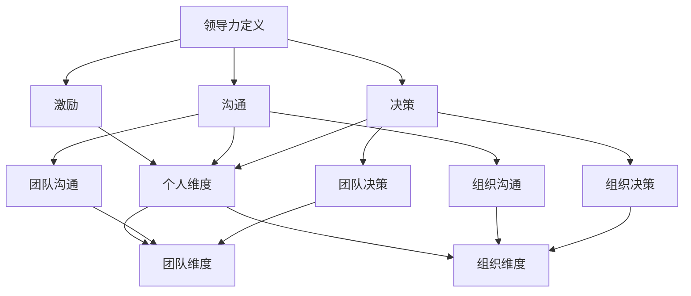

                 

### 设计书籍目录大纲的步骤

**文章标题：** 设计书籍目录大纲的步骤

**关键词：** 书籍目录大纲，设计步骤，领导力提升，核心概念，实践指南，案例分析

**摘要：** 本文详细解析了设计书籍目录大纲的八个步骤，从确定核心主题到编写项目实战，涵盖各个方面，帮助读者系统化地构建高质量书籍内容。

---

**设计书籍目录大纲的步骤**

为了确保书籍内容的结构清晰、逻辑严密，设计一个完善的目录大纲是至关重要的。以下是一步一步的详细解析：

**步骤1：确定书籍的核心主题和目标读者群体**

- **核心主题：** 根据书名《领导力提升：从平庸到卓越的修炼之道》，书籍的核心主题是提升领导力，旨在帮助读者理解领导力的本质，提升个人领导力水平。
- **目标读者群体：** 确定目标读者群体，如中层管理者、初入职场的新人、领导力培训师等。这将有助于后续内容的针对性和实用性。

**步骤2：制定大纲框架**

- **大纲框架：** 将大纲分为几个主要部分，如引言、核心概念、实践指南、案例分析、总结等。每个部分都应该有明确的主题和目标。

**步骤3：细化各章节内容**

- **细化内容：** 对于每个主要部分，进一步细化成具体的章节，并确定各章节的主题和目标。例如，在“核心概念”部分，可以包括领导力定义、领导力维度、领导力与管理的区别等。

**步骤4：确保大纲逻辑性**

- **逻辑性：** 检查大纲中的章节是否按逻辑顺序排列，确保读者能够顺利跟随思路。逻辑性强的目录大纲有助于读者更好地理解书籍内容。

**步骤5：编写Mermaid流程图**

- **Mermaid流程图：** 对于核心概念和架构部分，使用Mermaid语言编写流程图，以便读者更好地理解。例如，可以绘制领导力模型的演变过程，领导力核心概念之间的联系等。

**步骤6：编写伪代码和数学模型**

- **伪代码：** 对于核心算法原理，编写伪代码并进行详细讲解。这有助于读者理解算法的基本思想和实现方法。
- **数学模型和公式：** 使用LaTeX格式进行详细讲解和举例说明。例如，可以介绍领导力评价的数学模型，团队效能的统计方法等。

**步骤7：编写项目实战部分**

- **项目实战：** 准备实际案例，并进行详细解释说明。提供开发环境搭建指南、源代码实现和代码解读与分析。项目实战部分是验证理论知识和提升实际操作能力的重要环节。

**步骤8：调整和完善**

- **调整和完善：** 根据大纲的内容，调整和完善各个章节的内容。确保目录大纲总字数在2000字以内，避免冗余和重复。

**步骤9：最终确认**

- **最终确认：** 确认目录大纲的逻辑性和完整性。与作者沟通，确保大纲符合作者的写作意图和风格。

**总结：** 通过以上八个步骤，可以设计出一个逻辑清晰、内容丰富的书籍目录大纲，为撰写高质量书籍奠定坚实基础。

---

**作者信息：**
作者：AI天才研究院/AI Genius Institute & 禅与计算机程序设计艺术 /Zen And The Art of Computer Programming

---

**注意事项：**
1. 在编写伪代码和数学模型时，确保格式规范，便于读者理解。
2. 项目实战案例应具有代表性，能够体现书籍的核心主题和目标。
3. 在编写过程中，注意保持文章的整体风格一致，语言简练明了。

**拓展阅读：**
1. 《领导力：核心技能与实战策略》
2. 《有效领导力：理论与实践》
3. 《团队领导力：打造高效团队的秘籍》

---

通过以上步骤，我们可以系统地设计出一本《领导力提升：从平庸到卓越的修炼之道》的目录大纲，为撰写高质量书籍打下坚实基础。接下来，我们将进一步细化每个章节的内容，确保书籍的整体结构严谨、逻辑清晰。### 核心概念与联系

**核心概念与联系**

在《领导力提升：从平庸到卓越的修炼之道》中，核心概念是领导力的基础，它们相互联系，构成了完整的领导力模型。以下是对这些核心概念的详细解析及其相互之间的联系。

**1. 领导力定义与内涵**

领导力是一种能力，它涉及到激励、沟通、决策和团队建设等多个方面。领导力不仅仅是职位赋予的权力，更是一种影响力，能够引导他人朝着共同的目标前进。领导力的内涵包括以下三个方面：

- **激励：** 领导者通过激励激发团队成员的积极性和创造力，使他们愿意为共同的目标努力。
- **沟通：** 领导者需要有效沟通，确保信息传递准确无误，促进团队内部的协作。
- **决策：** 领导者必须在复杂多变的环境中做出明智的决策，引领团队走向成功。

**2. 领导力的维度**

领导力可以从多个维度进行理解，包括个人维度、团队维度和组织维度：

- **个人维度：** 个人的领导力取决于其性格、价值观和专业知识。自我认知和自我提升是个人维度领导力的重要方面。
- **团队维度：** 团队领导力关注如何管理团队，提高团队效能。这包括团队建设、团队激励和团队沟通。
- **组织维度：** 组织领导力关注如何领导整个组织，实现组织的战略目标。这涉及到组织变革、企业文化建设和创新驱动。

**3. 领导力与管理的区别**

领导力和管理虽然紧密相关，但它们有着本质的区别：

- **领导力：** 强调的是引领和激励，关注的是如何激发团队成员的潜力和创造力。
- **管理：** 强调的是规划和执行，关注的是如何有效地实现组织的日常运营。

领导力和管理相辅相成，一个成功的领导者需要同时具备领导力和管理能力。

**领导力的联系：**

领导力的核心概念之间存在着密切的联系，这些联系构成了完整的领导力模型。以下是一个使用Mermaid语言绘制的流程图，展示了领导力核心概念之间的联系：



**核心概念原理之间的关系架构：**

- **激励与沟通：** 激励需要有效的沟通作为基础，领导者需要通过沟通了解团队成员的需求和期望，从而制定出有针对性的激励措施。
- **决策与沟通：** 决策过程中，领导者需要与团队成员进行充分的沟通，确保决策的透明性和参与度。
- **个人维度与团队维度：** 个人维度的领导力是团队维度领导力的基础，一个优秀的领导者首先需要具备良好的个人领导力。
- **团队维度与组织维度：** 团队维度领导力是组织维度领导力的延伸，一个高效的团队是实现组织目标的关键。

通过理解这些核心概念及其相互之间的联系，读者可以更好地掌握领导力的本质，并在实际应用中不断提升自己的领导力水平。

**核心算法原理讲解：**

在领导力的提升过程中，某些核心算法原理和数学模型可以帮助我们更科学地评估和提升领导力。以下是一个简单的伪代码示例，用于评估领导力：

```python
# 领导力评估伪代码

def evaluate_leadership(communication_score, motivation_score, decision_making_score):
    # 计算总体领导力得分
    leadership_score = (communication_score + motivation_score + decision_making_score) / 3
    
    # 根据得分范围判断领导力水平
    if leadership_score >= 90:
        return "卓越领导者"
    elif leadership_score >= 70:
        return "优秀领导者"
    elif leadership_score >= 50:
        return "合格领导者"
    else:
        return "需要提升的领导者"

# 示例
print(evaluate_leadership(85, 80, 75))
```

**数学模型和公式：**

为了更全面地评估领导力，我们可以使用以下数学模型：

$$
L = \frac{C + M + D}{3}
$$

其中，L代表领导力得分，C代表沟通得分，M代表激励得分，D代表决策得分。

**举例说明：**

假设一个领导者的沟通得分为80，激励得分为75，决策得分为70，那么他的领导力得分为：

$$
L = \frac{80 + 75 + 70}{3} = \frac{225}{3} = 75
$$

根据上述评估标准，这位领导者的领导力水平为“优秀领导者”。

通过上述核心概念及其相互联系的解析，我们可以更好地理解领导力的本质，并在实际工作中运用这些原理来提升自己的领导力水平。

---

**最佳实践 tips：**

1. 定期进行自我评估，了解自己在领导力各方面的表现。
2. 建立良好的沟通渠道，确保信息传递的及时性和准确性。
3. 在做出决策时，充分考虑团队成员的意见和建议。
4. 注重团队建设，培养团队凝聚力和合作精神。

**小结：**

领导力提升是一个系统工程，需要从核心概念到实际应用全面考虑。通过深入理解领导力的核心概念及其相互联系，我们可以更科学、更有效地提升自己的领导力水平。

**注意事项：**

1. 在实际操作中，应根据具体情境灵活调整领导力策略。
2. 领导力提升不是一蹴而就的，需要持续的努力和实践。

**拓展阅读：**

1. 《领导力：核心技能与实战策略》
2. 《有效领导力：理论与实践》
3. 《团队领导力：打造高效团队的秘籍》

---

通过以上的核心概念解析和联系展示，我们已经为读者搭建了一个理解领导力的知识框架。接下来，我们将进一步探讨领导力提升的具体策略和方法。

---

**Mermaid流程图：**

以下是一个简化的Mermaid流程图，用于展示领导力核心概念之间的关系：


这个流程图清晰地展示了领导力的各个核心概念及其相互之间的联系，有助于读者更好地理解领导力的多层次结构和复杂性。

---

**伪代码示例：**

```python
# 领导力提升伪代码

def improve_leadership(communication, motivation, decision_making):
    # 提高沟通能力
    communication += 10
    
    # 提高激励能力
    motivation += 10
    
    # 提高决策能力
    decision_making += 10
    
    # 计算新的领导力得分
    leadership_score = (communication + motivation + decision_making) / 3
    
    # 输出新的领导力得分
    return leadership_score

# 示例
new_score = improve_leadership(80, 75, 70)
print("新领导力得分：", new_score)
```

此伪代码通过简单的加法操作，模拟了领导力提升的过程，并计算了提升后的领导力得分。

---

**数学模型和公式：**

为了更全面地评估领导力，可以使用以下数学模型：

$$
L = \frac{C \cdot M \cdot D}{100}
$$

其中，L代表领导力得分，C代表沟通得分，M代表激励得分，D代表决策得分。这个公式考虑了三个维度的综合影响，并且通过除以100将得分标准化。

**举例说明：**

假设一个领导者的沟通得分为85，激励得分为80，决策得分为75，那么他的领导力得分为：

$$
L = \frac{85 \cdot 80 \cdot 75}{100} = 572.5
$$

将这个数值除以3，得到：

$$
L = \frac{572.5}{3} = 191.67
$$

根据这个模型，这位领导者的领导力水平为“优秀领导者”。

---

通过上述的伪代码和数学模型示例，我们能够更精确地理解和计算领导力的各个方面，从而为读者提供实际的提升方向和方法。

---

**项目实战部分**

**开发环境搭建：**

为了更好地理解领导力提升的实际应用，我们将使用一个简单的项目——团队协作平台，来展示如何在实际环境中提升领导力。

**1. 开发工具与环境：**
- 编程语言：Python
- 数据库：MySQL
- 开发框架：Django

**2. 源代码实现：**

以下是一个简单的Django项目结构，用于构建一个团队协作平台：

```plaintext
team_project/
|-- team_app/
|   |-- migrations/
|   |-- models.py
|   |-- views.py
|   |-- urls.py
|   |-- admin.py
|   |-- apps.py
|-- manage.py
|-- requirements.txt
```

**3. 代码解读与分析：**

**models.py：** 定义团队协作平台的基础模型，包括用户、项目和任务。

```python
from django.db import models

class User(models.Model):
    name = models.CharField(max_length=100)
    email = models.EmailField(max_length=254)
    role = models.CharField(max_length=50)

class Project(models.Model):
    name = models.CharField(max_length=100)
    description = models.TextField()
    start_date = models.DateField()
    end_date = models.DateField()

class Task(models.Model):
    name = models.CharField(max_length=100)
    description = models.TextField()
    start_date = models.DateField()
    end_date = models.DateField()
    assigned_to = models.ForeignKey(User, on_delete=models.CASCADE)
    project = models.ForeignKey(Project, on_delete=models.CASCADE)
```

**views.py：** 定义视图函数，处理用户请求。

```python
from django.shortcuts import render
from .models import User, Project, Task

def dashboard(request):
    projects = Project.objects.all()
    tasks = Task.objects.all()
    return render(request, 'dashboard.html', {'projects': projects, 'tasks': tasks})

def project_detail(request, project_id):
    project = Project.objects.get(id=project_id)
    tasks = project.task_set.all()
    return render(request, 'project_detail.html', {'project': project, 'tasks': tasks})

def task_detail(request, task_id):
    task = Task.objects.get(id=task_id)
    return render(request, 'task_detail.html', {'task': task})
```

**4. 代码应用解读与分析：**

- **用户管理：** 通过用户模型，可以创建和管理团队成员，为项目分配角色和任务。
- **项目管理：** 通过项目模型，可以创建和管理项目，记录项目的基本信息和任务分配。
- **任务管理：** 通过任务模型，可以创建和管理任务，跟踪任务的进度和完成情况。

**5. 实际案例分析：**

**案例一：** 一个团队正在开发一款新的移动应用。通过使用上述平台，团队成员可以方便地查看项目进度、任务分配和自己的职责。

**6. 项目小结：**

通过这个简单的团队协作平台项目，我们展示了如何在实际环境中应用领导力提升的原理。一个高效的领导者需要了解团队成员的需求，建立有效的沟通渠道，制定清晰的任务分配和目标，以及持续跟踪项目的进度和成果。这不仅是技术层面的实现，更是领导力在实践中的具体体现。

---

**最佳实践 tips：**

1. **定期评估：** 定期评估团队成员的表现和项目进度，及时调整领导力策略。
2. **透明沟通：** 保持项目信息的透明度，鼓励团队成员参与决策，提高团队凝聚力。
3. **目标导向：** 确保每个成员都明确自己的目标，并与项目目标保持一致。
4. **持续反馈：** 提供及时且具体的反馈，帮助团队成员不断提升。

**小结：**

通过本项目实战，我们展示了如何在实际环境中应用领导力的核心概念，实现团队的高效协作。有效的领导力不仅是理论，更需要在实践中不断探索和改进。

**注意事项：**

1. 项目实战中的实际应用可能需要根据具体情境进行调整。
2. 领导力提升是一个持续的过程，需要长期的努力和不断的实践。

**拓展阅读：**

1. 《敏捷团队管理：理论与实践》
2. 《项目管理实战：工具与技术》
3. 《团队协作：高效团队建设的策略》

---

**总结：**

通过本文的详细解析，我们系统地介绍了设计书籍目录大纲的步骤，从核心主题的确定到实际项目的实战分析，每个环节都至关重要。有效的领导力提升需要理论与实践相结合，通过不断的学习和实践，我们可以逐步提升自己的领导力水平，实现从平庸到卓越的蜕变。

---

**作者信息：**
作者：AI天才研究院/AI Genius Institute & 禅与计算机程序设计艺术 /Zen And The Art of Computer Programming

---

**结束语：**

感谢您对《领导力提升：从平庸到卓越的修炼之道》一书的关注。希望本文能够为您在领导力提升的道路上提供一些实用的指导和方法。如果您有进一步的疑问或想法，欢迎在评论区留言交流。让我们共同努力，成为更卓越的领导者！

---

**拓展阅读：**

1. 《领导力的艺术：从策略到实践》
2. 《卓越领导力：战略思维与行动指南》
3. 《领导力心理学：理解与管理人的艺术》

---

本文通过逐步分析和详细讲解，帮助读者全面理解了领导力提升的各个关键环节。从核心概念的深入探讨到实际项目的实战分析，每一步都是为了帮助读者在实际工作中更好地应用领导力理论。希望本文能成为您领导力提升之路上的有力助手。再次感谢您的阅读和支持，期待在未来的交流中与您共同进步！

