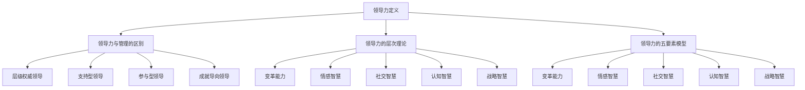
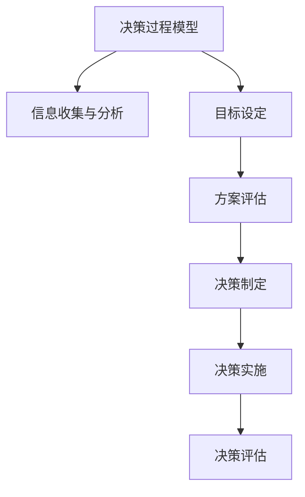

                 

### 摘要

在现代企业管理中，领导力作为组织发展的核心要素，其重要性不言而喻。本文旨在深入探讨领导力法则，提供一套系统化的领导力秘笈，以帮助领导者打造梦幻团队。我们将从领导力的基本理论、团队建设、领导风格与沟通技巧、决策能力与激励方法，以及领导力发展等多个维度进行详细分析，结合实际案例，为读者提供实用的指导。

本文结构如下：

第一部分，我们将探讨领导力的基本理论，包括核心概念与联系、领导力原理及其与组织效能的关系。

第二部分，我们将聚焦团队建设，介绍团队建设原则、团队合作技巧以及团队领导力发展。

第三部分，我们将分析领导风格与沟通技巧，探讨不同领导风格对团队的影响，以及如何进行有效沟通。

第四部分，我们将讨论决策能力与激励方法，介绍决策能力提升策略和激励理论及实践。

第五部分，我们将探讨领导力的发展路径与方法，包括领导力成长阶段、发展方法以及领导力培养。

最后，在附录部分，我们将提供领导力相关工具与资源，包括评估工具、培训资源以及实践案例。

通过本文的阅读，读者将能够系统掌握领导力的核心知识，并学会如何将其应用于实际工作，从而打造出一支高效、协同的梦幻团队。

### 领导力的基本理论

领导力，作为一种复杂且多维度的概念，在企业管理中起着至关重要的作用。要理解领导力，首先需要了解其核心概念与联系。领导力不仅仅是一种技能，更是一种艺术，它涉及到领导者与团队成员之间的互动、沟通和激励。在这一部分中，我们将探讨领导力的基本理论，包括核心概念与联系、领导力原理及其与组织效能的关系。

#### 核心概念与联系

领导力包含多个核心概念，如领导力与管理的区别、领导力的层次理论以及领导力的五要素模型。

1. **领导力与管理的区别**

   领导力与管理的区别在于其侧重点不同。管理主要侧重于协调、组织和规划，确保资源的合理分配和任务的完成。而领导力则更加关注激励、启发和愿景的塑造，引导团队成员朝着共同目标前进。例如，管理者可能会通过设定目标和监控进展来确保项目的顺利进行，而领导者则会通过激励和鼓舞来激发团队成员的潜力，促使他们超越自我，实现卓越表现。

2. **领导力的层次理论**

   领导力的层次理论由赫赛和布兰查德提出，认为领导力可以分为四个层次：层级权威领导、支持型领导、参与型领导和成就导向领导。

   - **层级权威领导**：领导者通过职位权威来指导和控制团队成员。
   - **支持型领导**：领导者注重与团队成员的沟通，关心团队成员的需求和福利。
   - **参与型领导**：领导者鼓励团队成员参与决策过程，提高团队的整体决策能力。
   - **成就导向领导**：领导者注重团队的目标和成就，激励团队成员追求卓越。

3. **领导力的五要素模型**

   领导力的五要素模型由美国管理学家史蒂芬·罗宾斯提出，包括变革能力、情感智慧、社交智慧、认知智慧和战略智慧。

   - **变革能力**：领导者具备推动组织变革的能力，能够在面对挑战和变化时保持冷静和果断。
   - **情感智慧**：领导者能够理解和管理自己的情绪，以及识别和影响他人的情绪。
   - **社交智慧**：领导者擅长建立和维护人际关系网络，促进团队协作。
   - **认知智慧**：领导者具备深刻的思考能力，能够分析和解决复杂问题。
   - **战略智慧**：领导者具备长远的眼光和战略思维，能够为组织制定明确的发展方向和目标。

#### 领导力原理

领导力原理是指领导者在实践中所遵循的基本原则和方法。以下是一些关键的领导力原理：

1. **影响领导力因素**

   影响领导力因素包括个人特质、经验和情境因素。领导者需要具备一定的个人特质，如自信、决断力、沟通能力和情感智慧。同时，领导者的经验也是影响领导力的重要因素。在特定情境下，领导者的行为和决策会受到多种因素的影响，如组织文化、团队结构和外部环境。

2. **领导行为理论**

   领导行为理论主要研究领导者在工作中的行为模式。领导行为可以表现为任务导向和行为导向。任务导向的领导者更注重任务目标的完成，而行为导向的领导者则更关注团队成员的需求和情感。不同的领导行为对团队绩效和员工满意度有不同的影响。

3. **领导风格与效能**

   领导风格是指领导者在工作中所采用的基本方式和方法。常见的领导风格包括权威型、民主型、参与型和教练型。不同的领导风格对团队绩效和组织文化有不同的影响。例如，权威型领导风格可能在短期内提高工作效率，但长期来看可能导致员工士气低落和创新能力下降。而参与型领导风格则有助于提高员工的参与感和归属感，促进团队创新和合作。

#### 领导力与组织效能

领导力对组织效能有着深远的影响。一个优秀的领导者能够通过有效的领导力实践，提升团队的凝聚力、创新能力和竞争力。

1. **领导力对组织文化的影响**

   领导力对组织文化有着重要的影响。领导者通过自身的行为和决策，塑造和传播组织文化。一个积极向上的组织文化可以增强员工的归属感和认同感，提高团队协作和创新能力。

2. **领导力与组织变革**

   在面对外部环境和内部挑战时，领导力是推动组织变革的关键因素。领导者需要具备变革能力和战略智慧，能够识别变革的必要性，制定变革计划，并动员团队成员积极参与变革过程。

3. **领导力评估模型**

   领导力评估模型是衡量领导者效能的重要工具。常见的领导力评估模型包括360度评估、领导力测评量表和领导力发展问卷。通过这些评估模型，领导者可以了解自己的优势和不足，制定个人发展计划，不断提升领导力水平。

综上所述，领导力的基本理论是构建领导力实践的基础。理解领导力的核心概念、原理及其与组织效能的关系，对于提升领导力水平和打造梦幻团队具有重要意义。在接下来的部分，我们将继续探讨团队建设、领导风格与沟通技巧等重要主题。

### 核心概念与联系：领导力的多层次架构

为了更深入地理解领导力的核心概念及其相互联系，我们需要借助Mermaid流程图来展示这些概念之间的关系架构。以下是领导力的核心概念与联系流程图：



#### 领导力定义

领导力是一种引导和激励他人以实现共同目标的能力。它不仅仅局限于管理职位，而是可以存在于各个层级和领域。领导力的核心在于影响力的传递，即领导者通过自身的行为和决策，激发团队成员的潜力，推动他们达成卓越表现。

#### 领导力与管理的区别

领导力与管理的区别在于它们的核心目标和作用方式。管理侧重于组织和协调资源，确保目标的实现；而领导力则侧重于激发和引导团队成员的内在动机，使他们在工作中能够超越自我，实现更高的绩效。

- **层级权威领导**：领导者通过职位权威来指导和控制团队成员，强调命令和服从。
- **支持型领导**：领导者关心团队成员的需求和福利，通过提供支持和鼓励来增强团队成员的信心和能力。
- **参与型领导**：领导者鼓励团队成员参与决策过程，提高团队的整体决策能力，增强团队的凝聚力和创造力。
- **成就导向领导**：领导者注重团队的目标和成就，通过设定高目标和提供激励，激发团队成员追求卓越。

#### 领导力的层次理论

领导力的层次理论将领导力划分为四个层次，每个层次都有其特定的特点和作用。

1. **层级权威领导**：这是最基本的领导层次，领导者通过职位权威来指导和控制团队成员。
2. **支持型领导**：领导者关注团队成员的需求和福利，通过提供支持和鼓励来增强团队成员的信心和能力。
3. **参与型领导**：领导者鼓励团队成员参与决策过程，提高团队的整体决策能力，增强团队的凝聚力和创造力。
4. **成就导向领导**：领导者注重团队的目标和成就，通过设定高目标和提供激励，激发团队成员追求卓越。

#### 领导力的五要素模型

领导力的五要素模型由史蒂芬·罗宾斯提出，这五个要素分别是变革能力、情感智慧、社交智慧、认知智慧和战略智慧。

- **变革能力**：领导者能够推动组织变革，适应外部环境的变化，引领组织向前发展。
- **情感智慧**：领导者能够理解和管理自己的情绪，以及识别和影响他人的情绪，建立良好的人际关系。
- **社交智慧**：领导者擅长建立和维护人际关系网络，促进团队协作和资源整合。
- **认知智慧**：领导者具备深刻的思考能力，能够分析和解决复杂问题，制定科学合理的决策。
- **战略智慧**：领导者具备长远的眼光和战略思维，能够为组织制定明确的发展方向和目标。

#### 核心概念与联系

通过上述的Mermaid流程图，我们可以清晰地看到领导力的核心概念与联系。领导力不仅包括领导者的个人特质和技能，还涉及到与团队成员的互动和影响。这些核心概念相互交织，共同构成了领导力的多层次架构，为领导者提供了系统化的指导。

在实际应用中，领导者需要根据不同情境和团队特点，灵活运用这些核心概念，以实现团队的高效协作和卓越绩效。通过不断学习和实践，领导者可以不断提升自己的领导力水平，为组织的发展贡献力量。

### 领导力原理

理解领导力原理是掌握领导艺术的关键。领导力原理不仅解释了领导行为如何影响团队和组织，还提供了实用的指导方法，帮助领导者提升领导效能。以下我们将探讨影响领导力因素、领导行为理论以及领导风格与效能。

#### 影响领导力因素

领导力是一个复杂的多维度现象，受到多种因素的影响。以下是几个关键因素：

1. **个人特质**

   领导者的个人特质在很大程度上决定了他们的领导风格和效能。一些关键的个人特质包括自信、决断力、沟通能力和情感智慧。自信的领导者能够鼓舞团队士气，决断力使他们能够在关键时刻做出明智的决策，良好的沟通能力有助于建立信任和透明度，而情感智慧则使领导者能够理解和应对团队成员的情绪。

2. **经验**

   经验是领导力的重要组成部分。领导者通过实际工作经验，不断学习和成长，积累了解决问题的能力和应对挑战的策略。经验丰富的领导者能够更好地预测和应对组织中的各种变化和挑战。

3. **情境因素**

   领导力在不同情境下会有不同的表现。情境因素包括组织文化、团队结构、外部环境等。领导者需要根据具体情境调整自己的领导风格和策略，以确保有效的领导。

#### 领导行为理论

领导行为理论主要研究领导者在工作中的行为模式及其对团队和组织的影响。以下是几种主要的领导行为理论：

1. **任务导向与行为导向**

   任务导向的领导者注重任务目标的完成，强调效率和成果。他们通常会设定明确的目标，制定详细的计划，并通过监督和反馈来确保任务的完成。行为导向的领导者则更加关注团队成员的需求和情感，致力于建立积极的工作环境，提升员工的满意度和归属感。

2. **领导连续体理论**

   领导连续体理论由赫赛和布兰查德提出，认为领导风格可以沿着一条连续体从权威型到民主型变化。权威型领导风格强调领导者的命令和控制，而民主型领导风格则鼓励团队成员参与决策过程，提高团队的整体决策能力。

3. **变革型领导**

   变革型领导理论认为，领导者通过激励和鼓舞团队成员，引导他们超越自我，实现卓越表现。变革型领导者关注团队的目标和愿景，具备强大的影响力，能够推动组织变革和创新发展。

#### 领导风格与效能

领导风格是指领导者在工作中所采用的基本方式和方法。不同的领导风格对团队绩效和组织文化有不同的影响。以下是几种常见的领导风格及其效能：

1. **权威型领导**

   权威型领导风格强调领导者的权力和决策控制。这种风格在短期内可能提高工作效率，但长期来看可能导致员工士气低落和创新能力下降。

2. **民主型领导**

   民主型领导风格鼓励团队成员参与决策过程，提高团队的凝聚力和创造力。这种风格有助于建立积极的工作环境，提升员工的满意度和归属感。

3. **参与型领导**

   参与型领导风格强调领导者与团队成员之间的互动和合作。领导者通过与团队成员共同讨论和决策，增强团队的协作和创新能力。

4. **教练型领导**

   教练型领导风格注重员工的个人发展和成长。领导者通过提供指导和支持，帮助员工克服挑战，提升技能和能力。

#### 实际案例分析

为了更好地理解领导力原理在实践中的应用，以下是一个实际案例：

某科技公司的新任CEO，李先生，采用了变革型领导风格。他首先与团队成员进行了深入的交流，了解他们的需求和期望。然后，他设定了明确的发展目标，并激励团队成员为实现这些目标而努力。李先生还建立了开放的沟通渠道，鼓励团队成员提出建议和意见。通过这些措施，公司的创新能力和员工满意度都得到了显著提升。

### 总结

领导力原理为领导者提供了系统化的指导，帮助他们更好地理解领导行为如何影响团队和组织。通过分析影响领导力的因素、掌握领导行为理论以及理解不同领导风格的效能，领导者可以制定更有效的领导策略，提升领导效能。在实际应用中，领导者需要根据具体情境和团队特点，灵活运用这些原理，以实现团队的高效协作和卓越绩效。

### 领导力与组织效能

领导力对组织效能具有深远的影响，其作用不仅体现在团队协作和员工激励上，还直接关系到组织的战略方向和长期发展。在这一部分，我们将探讨领导力对组织文化的影响、领导力与组织变革的关系以及领导力评估模型，以帮助领导者更好地理解如何通过领导力提升组织效能。

#### 领导力对组织文化的影响

组织文化是组织的灵魂，它决定了员工的行为方式、价值观和工作态度。领导力在塑造组织文化中扮演着关键角色。一个积极的组织文化可以增强员工的归属感和认同感，提高团队协作和创新力。

1. **领导者行为与组织文化**

   领导者的行为直接影响到组织文化的形成和发展。领导者通过自己的言行，向员工传递组织的核心价值观和行为规范。例如，一个注重创新和学习的领导者，会在团队中培养出积极进取、追求卓越的文化氛围。

2. **领导力与组织文化的互动**

   领导力与组织文化之间存在着相互影响和动态互动的关系。一方面，领导力通过塑造组织文化，影响员工的价值观和行为；另一方面，组织文化也会反过来影响领导者的决策和行为。例如，一个开放和包容的组织文化，能够促进领导者更加关注员工的成长和发展，从而提高领导力水平。

#### 领导力与组织变革

组织变革是组织持续发展的必然需求，而领导力在推动组织变革中发挥着至关重要的作用。一个成功的变革需要领导者具备变革能力和战略智慧，能够引领组织跨越变革的障碍，实现持续发展。

1. **变革能力的培养**

   变革能力是领导者推动组织变革的关键素质。领导者需要具备适应变化、应对挑战的能力，能够在不确定的环境中做出快速决策。具体来说，领导者需要：

   - **识别变革的必要性**：通过市场分析、竞争态势评估等方法，识别组织需要变革的关键点。
   - **制定变革计划**：明确变革的目标、策略和实施步骤，确保变革的有序推进。
   - **动员团队成员**：通过有效的沟通和激励，使团队成员认识到变革的必要性，积极参与变革过程。

2. **战略智慧的运用**

   战略智慧是领导者推动组织变革的另一重要素质。领导者需要具备长远的眼光和战略思维，能够为组织制定明确的发展方向和目标。具体来说，领导者需要：

   - **制定愿景和目标**：明确组织的长期愿景和短期目标，为变革提供方向和动力。
   - **整合资源**：通过资源整合和优化，确保变革计划的顺利实施。
   - **评估变革效果**：通过持续的评估和反馈，及时调整变革策略，确保变革目标的实现。

#### 领导力评估模型

领导力评估是衡量领导者效能的重要工具，通过评估可以了解领导者的优势和不足，制定个人发展计划，提升领导力水平。

1. **360度评估**

   360度评估是一种全面的领导力评估方法，通过收集来自上级、同事、下属以及外部专家的反馈，对领导者的行为和绩效进行全面评估。这种方法有助于领导者从多个角度了解自己的领导风格和效能，发现改进空间。

2. **领导力测评量表**

   领导力测评量表是一种标准化的评估工具，通过设定一系列领导力指标，对领导者的绩效进行量化评估。这种量表可以提供具体的分数和排名，有助于领导者了解自己在不同维度上的表现。

3. **领导力发展问卷**

   领导力发展问卷是一种个性化的评估工具，通过一系列问题，了解领导者的自我认知和实际表现，发现个人发展需求。这种方法有助于领导者制定个人发展计划，提升领导力水平。

### 实际案例分析

为了更好地理解领导力对组织效能的影响，我们来看一个实际案例。

某高科技公司由于市场环境的剧变，需要进行组织变革以保持竞争力。公司CEO张先生采用了变革型领导风格，首先明确了公司的发展愿景和目标，通过内部沟通和激励，使员工认识到变革的必要性。然后，他制定了详细的变革计划，包括组织结构调整、流程优化、员工培训等，并亲自带领团队实施变革。在变革过程中，张先生注重与员工的沟通和反馈，及时调整变革策略，最终成功地推动了公司的变革，提升了组织效能。

### 总结

领导力对组织效能有着深远的影响。通过塑造积极向上的组织文化、推动组织变革以及使用有效的领导力评估模型，领导者可以提升组织的凝聚力和创新能力，实现长期可持续发展。在实际应用中，领导者需要灵活运用各种领导力工具和方法，不断学习和实践，以提升自身的领导力水平，为组织的发展贡献力量。

### 团队建设

团队建设是领导力的重要组成部分，是构建高效团队、提升团队绩效的关键。有效的团队建设不仅能够提高团队成员的协作效率，还能促进团队创新和长期发展。以下我们将探讨团队建设原则、团队合作技巧以及团队领导力发展，以帮助领导者打造一支梦幻团队。

#### 团队建设原则

团队建设原则是构建高效团队的基础，以下是一些关键的团队建设原则：

1. **明确目标**

   明确的目标是团队前进的动力。领导者需要确保团队成员对团队的目标有清晰的理解，并确保这些目标与组织的整体战略一致。具体目标应具有可量化、可达成和时限性，以便团队成员可以明确自己的努力方向。

2. **角色分工**

   团队成员的角色和责任应明确划分。每个成员应了解自己的职责和期望，避免角色重叠和责任不清的情况。通过明确的角色分工，可以提高团队的协作效率，确保任务能够按时、高质量地完成。

3. **建立信任**

   信任是团队协作的基石。领导者需要通过建立开放的沟通渠道、鼓励团队成员分享意见和反馈，以及关注团队成员的情感需求，建立团队成员之间的信任关系。信任能够减少冲突，增强团队凝聚力。

4. **培养团队文化**

   团队文化是团队的灵魂，它决定了团队成员的行为方式和价值观。领导者需要积极塑造和传播团队文化，确保团队成员在共同价值观的引导下协作。一个积极向上的团队文化能够增强员工的归属感和认同感，提高团队的士气和创新能力。

5. **持续反馈**

   持续反馈是团队建设的重要环节。领导者需要定期与团队成员进行沟通，了解他们的工作进展和遇到的困难，提供及时的反馈和建议。通过持续反馈，可以及时纠正问题，提高团队成员的工作效率和质量。

#### 团队合作技巧

团队合作技巧是确保团队高效协作的关键，以下是一些实用的团队合作技巧：

1. **有效沟通**

   有效沟通是团队合作的基础。领导者需要确保团队成员之间的沟通是清晰、准确和及时的。具体包括：

   - **主动沟通**：鼓励团队成员主动分享信息、意见和反馈，避免信息滞后和误解。
   - **倾听**：领导者需要认真倾听团队成员的意见和需求，尊重他们的观点，建立信任和合作的基础。
   - **透明沟通**：保持团队内部的信息透明，确保团队成员了解团队的目标、进展和挑战，提高团队的协作效率。

2. **冲突管理**

   团队冲突是不可避免的，但有效的冲突管理能够将冲突转化为团队创新的动力。领导者需要掌握以下冲突管理技巧：

   - **理解冲突的本质**：识别冲突的原因，是否是因为目标不一致、沟通不畅或者资源分配不均。
   - **中立调解**：在冲突中保持中立，不偏袒任何一方，通过客观分析和建议，帮助团队成员找到解决问题的方法。
   - **建设性对话**：鼓励团队成员进行建设性的对话，通过讨论和协商，找到共同点和解决方案，避免冲突升级。

3. **协同合作**

   协同合作是团队合作的核心。领导者需要确保团队成员能够协同工作，共同完成任务。具体包括：

   - **共同目标**：确保团队成员都明确团队的目标，并围绕这些目标协作。
   - **资源共享**：鼓励团队成员分享资源和知识，提高团队的协作效率。
   - **分工协作**：合理分配任务，确保每个成员都能在擅长的领域发挥作用，提高整体效率。

4. **反馈与激励**

   反馈与激励是保持团队活力和动力的关键。领导者需要通过及时反馈和激励，鼓励团队成员持续改进和提升。具体包括：

   - **及时反馈**：对团队成员的工作进行及时评价，提供具体的反馈和建议，帮助他们改进。
   - **激励机制**：建立合理的激励机制，对表现优异的团队成员进行奖励，激发他们的工作热情和积极性。

#### 团队领导力发展

团队领导力发展是提升团队绩效和长期发展的关键。以下是一些团队领导力发展策略：

1. **领导力培训**

   领导力培训是提升团队领导力的重要手段。通过系统化的培训，领导者可以学习到最新的领导力理论和实践方法，提升自己的领导能力。培训内容可以包括领导力基础理论、领导风格、团队管理技巧、沟通与激励等。

2. **实践与反思**

   实践与反思是领导力提升的关键环节。领导者需要在实际工作中不断尝试和总结，通过反思自己的领导行为和团队表现，找到改进的方法。具体包括：

   - **行动计划**：制定明确的行动计划，确保领导力提升的目标和步骤具体可行。
   - **持续反思**：定期反思自己的领导行为和团队表现，总结成功和失败的经验，持续改进。

3. **角色扮演**

   角色扮演是一种有效的领导力发展方法。通过模拟真实的领导场景，领导者可以在安全的环境中练习和提升自己的领导能力。具体包括：

   - **角色扮演活动**：组织角色扮演活动，让领导者扮演不同的角色，体验不同的领导情境。
   - **反馈与指导**：在角色扮演过程中，提供反馈和指导，帮助领导者提升领导能力。

4. **团队建设活动**

   团队建设活动是提升团队凝聚力和协作能力的重要手段。通过多样化的团队建设活动，领导者可以增强团队的凝聚力，提升团队的协作效率。具体包括：

   - **团队拓展训练**：通过户外拓展训练，增强团队成员的信任和团队合作能力。
   - **团队协作游戏**：通过团队协作游戏，培养团队成员的协作精神和解决问题能力。

### 总结

团队建设是构建高效团队、提升团队绩效的关键。通过明确团队建设原则、掌握团队合作技巧以及发展团队领导力，领导者可以打造出一支梦幻团队，实现组织的长期发展。在实际应用中，领导者需要根据团队的特点和需求，灵活运用各种团队建设方法，不断提升团队的整体效能。

### 团队合作技巧

在构建高效团队的过程中，团队合作技巧至关重要。有效的团队合作不仅能提高工作效率，还能增强团队的凝聚力和创新力。以下，我们将详细探讨如何提高团队合作技巧，包括团队沟通策略、冲突管理以及协作工具的使用。

#### 团队沟通策略

良好的沟通是团队合作的基础。以下是一些提高团队沟通效率的策略：

1. **明确沟通目标**

   在进行团队沟通时，首先需要明确沟通的目标。每个团队成员都应该清楚地知道沟通的目的是什么，需要达成的共识是什么。这样可以避免沟通中的混乱和误解。

2. **倾听与反馈**

   倾听是沟通的重要组成部分。领导者需要鼓励团队成员在沟通时认真倾听他人的意见，理解他们的观点和需求。同时，团队成员也需要勇于表达自己的看法，并接受他人的反馈。

3. **使用明确的语言**

   使用简单、明确的语言，避免使用专业术语或模糊不清的表述。这样可以帮助团队成员更好地理解沟通内容，减少误解和歧义。

4. **多样化沟通方式**

   根据不同的沟通内容和场景，选择合适的沟通方式。例如，对于复杂的决策问题，可以通过会议或讨论来解决；对于日常信息的交流，可以使用即时通讯工具或邮件。

#### 冲突管理

冲突在团队中是不可避免的，但有效的冲突管理可以将冲突转化为团队创新的动力。以下是一些冲突管理技巧：

1. **识别冲突原因**

   冲突可能源于目标不一致、沟通不畅、资源分配不均等多方面。领导者需要首先识别冲突的原因，才能采取针对性的解决措施。

2. **中立调解**

   在处理冲突时，领导者需要保持中立，不偏袒任何一方。通过客观分析和建议，帮助团队成员找到解决问题的方法。

3. **建设性对话**

   鼓励团队成员进行建设性的对话，通过讨论和协商，找到共同点和解决方案。避免将冲突升级为争吵或对抗。

4. **制定解决方案**

   在冲突解决过程中，需要制定明确的解决方案，并确保每个团队成员都同意和遵守。这样可以避免冲突再次发生。

#### 协作工具的使用

在现代工作中，各种协作工具的使用可以显著提高团队的协作效率。以下是一些常用的协作工具：

1. **即时通讯工具**

   即时通讯工具如Slack、Microsoft Teams等，可以实时交流信息，提高沟通效率。团队成员可以通过这些工具进行实时讨论、分享文件和跟进任务。

2. **项目管理工具**

   项目管理工具如Trello、JIRA等，可以帮助团队跟踪项目进展、分配任务和监控进度。这些工具通常具有任务列表、日历视图和报告功能，方便团队成员协作。

3. **文档协作工具**

   文档协作工具如Google Docs、Microsoft Office 365等，支持多人实时编辑同一文档，提高文档协作效率。团队成员可以共享文档、实时评论和协同编辑。

4. **视频会议工具**

   视频会议工具如Zoom、Microsoft Teams等，支持远程团队进行实时会议和讨论。通过视频会议，团队成员可以面对面交流，增强团队的凝聚力和协作效果。

#### 实际案例分析

为了更好地理解团队合作技巧在实践中的应用，以下是一个实际案例：

某科技公司的研发团队在开发一款新产品时，遇到了项目进展缓慢和团队内部冲突的问题。为了提高团队协作效率，领导者采取了一系列措施：

1. **明确沟通目标**

   领导者组织了一次团队会议，明确项目的目标和预期成果，确保每个团队成员都清楚自己的任务和职责。

2. **倾听与反馈**

   领导者鼓励团队成员在会议中积极发言，倾听他们的意见和建议。同时，领导者也及时给予反馈，帮助他们解决问题。

3. **使用明确的语言**

   领导者在沟通时使用简单、明确的语言，避免使用专业术语或模糊不清的表述，确保团队成员理解沟通内容。

4. **多样化沟通方式**

   领导者不仅通过会议进行沟通，还利用即时通讯工具和邮件保持日常信息的交流。

5. **冲突管理**

   当团队内部出现冲突时，领导者通过中立调解和建设性对话，帮助团队成员找到解决问题的方法。

6. **协作工具的使用**

   领导者推荐了项目管理工具和文档协作工具，帮助团队更好地跟踪项目进展、分配任务和协同编辑文档。

通过这些措施，团队的协作效率显著提升，项目进展加快，内部冲突也得到有效解决。

### 总结

团队合作技巧在团队建设和管理中起着至关重要的作用。通过有效的沟通策略、冲突管理技巧和协作工具的使用，领导者可以打造出一支高效、协作的团队，实现团队的目标和使命。在实际应用中，领导者需要根据团队的具体情况和需求，灵活运用各种团队合作技巧，不断提升团队的协作效率和创新力。

### 团队领导力发展

团队领导力发展是提升团队整体效能和成员个人成长的关键。一个成功的团队领导者不仅需要具备卓越的领导技能，还需要不断学习和成长，以适应不断变化的环境和挑战。以下，我们将探讨团队领导力发展的策略，包括领导力提升策略、团队领导力评估与反馈以及领导力培训与实践。

#### 领导力提升策略

提升领导力是一个持续的过程，需要领导者不断地自我反思和成长。以下是一些有效的领导力提升策略：

1. **自我反思**

   自我反思是领导力提升的重要步骤。领导者需要定期花时间思考自己的领导行为、决策方式和团队表现。通过反思，领导者可以识别自己的优势和不足，找到改进的方向。

2. **阅读与研究**

   读书和研究是提升领导力的有效方法。领导者可以通过阅读领导力书籍、研究相关理论和案例，了解最新的领导力趋势和实践方法。这有助于他们拓宽视野，提升自身的领导力水平。

3. **参与培训**

   参加领导力培训是快速提升领导力的一种方式。通过培训，领导者可以学习到系统的领导力知识和技能，与其他领导者交流经验，提升自己的领导能力。

4. **寻求反馈**

   寻求反馈是领导力提升的重要环节。领导者可以定期向团队成员、上级和导师寻求反馈，了解他们在领导力方面的看法和建议。这有助于领导者发现自身的不足，并制定改进计划。

5. **实践与经验**

   实践是最好的学习方式。领导者需要在实际工作中不断尝试和应用所学到的领导力知识和技能，通过实践来提升自己的领导力。同时，领导者也需要从实践中总结经验，不断优化自己的领导方式。

#### 团队领导力评估与反馈

团队领导力评估与反馈是衡量领导者效能的重要工具，有助于领导者了解自己的表现，制定改进计划。以下是一些评估与反馈的方法：

1. **360度评估**

   360度评估是一种全面的领导力评估方法，通过收集来自上级、同事、下属以及外部专家的反馈，对领导者的行为和绩效进行全面评估。这种方法可以帮助领导者从多个角度了解自己的领导力水平，发现改进空间。

2. **领导力测评量表**

   领导力测评量表是一种标准化的评估工具，通过设定一系列领导力指标，对领导者的绩效进行量化评估。这种量表可以提供具体的分数和排名，有助于领导者了解自己在不同维度上的表现。

3. **领导力发展问卷**

   领导力发展问卷是一种个性化的评估工具，通过一系列问题，了解领导者的自我认知和实际表现，发现个人发展需求。这种方法有助于领导者制定个人发展计划，提升领导力水平。

#### 领导力培训与实践

领导力培训与实践是提升团队领导力的关键环节。以下是一些领导力培训与实践的方法：

1. **内部培训**

   内部培训是团队领导力发展的一种有效方式。通过内部培训，团队成员可以学习到最新的领导力知识和技能，提升自己的领导能力。内部培训还可以促进团队成员之间的交流和合作，增强团队的凝聚力。

2. **外部培训**

   外部培训是获取最新领导力知识和技能的一种途径。通过参加外部培训，领导者可以学习到前沿的领导力理论和方法，与其他行业领导者交流经验，拓宽视野。

3. **领导力实践**

   领导力实践是将所学知识应用到实际工作中的过程。领导者需要在实际工作中不断尝试和应用所学到的领导力知识和技能，通过实践来提升自己的领导力。同时，领导者也需要从实践中总结经验，不断优化自己的领导方式。

4. **导师制度**

   导师制度是一种有效的领导力发展方法。通过导师的指导和支持，新任领导者可以快速提升自己的领导能力，更好地适应领导岗位。导师可以帮助新任领导者识别问题、提供解决方案，并给予指导和建议。

#### 实际案例分析

为了更好地理解团队领导力发展在实践中的应用，以下是一个实际案例：

某科技公司的新任CEO李先生，意识到团队领导力发展的紧迫性。他采取了以下措施：

1. **自我反思**

   李先生定期进行自我反思，思考自己的领导行为和决策方式，发现自己在沟通和激励方面存在不足。

2. **阅读与研究**

   李先生阅读了多本领导力书籍，研究了相关领导力理论，学习到如何进行有效沟通和激励团队成员。

3. **参与培训**

   李先生参加了公司提供的领导力培训，学习了最新的领导力知识和技能。

4. **寻求反馈**

   李先生定期向团队成员、上级和外部专家寻求反馈，了解自己在领导力方面的表现和改进方向。

5. **领导力实践**

   李先生在实际工作中不断尝试和应用所学到的领导力知识和技能，通过实践来提升自己的领导力。

6. **导师制度**

   李先生聘请了一位资深导师，从导师那里获得了宝贵的指导和建议，快速提升了领导力水平。

通过这些措施，李先生成功提升了团队领导力，增强了团队的凝聚力和创新能力，为公司的发展做出了重要贡献。

### 总结

团队领导力发展是提升团队整体效能和成员个人成长的关键。通过自我反思、阅读与研究、参与培训、寻求反馈以及领导力实践，领导者可以不断提升自己的领导力水平，打造出一支高效、协作的团队。在实际应用中，领导者需要根据团队的具体情况和需求，灵活运用各种团队领导力发展策略，不断提升团队的领导力和整体绩效。

### 领导风格与沟通技巧

领导风格和沟通技巧是领导者塑造团队文化和提升团队绩效的关键因素。不同的领导风格和沟通技巧会影响团队成员的态度和行为，进而影响团队的整体表现。本文将深入探讨不同领导风格、有效沟通技巧以及情绪智力在领导力中的应用。

#### 领导风格

领导风格是指领导者在日常工作中所表现出来的行为模式和决策方式。不同的领导风格会对团队成员产生不同的影响，从而影响团队的绩效和氛围。以下是几种常见的领导风格：

1. **权威型领导**

   权威型领导风格的特点是领导者拥有高度的决策权和控制力，团队成员通常需要服从领导者的指令。这种风格在任务紧急或需要迅速决策时较为有效，但长期来看可能会抑制团队成员的创造力和自主性。

2. **民主型领导**

   民主型领导风格的特点是领导者鼓励团队成员参与决策过程，注重团队成员的意见和反馈。这种风格有助于提高团队成员的参与感和归属感，增强团队的凝聚力和创新能力。

3. **参与型领导**

   参与型领导风格的特点是领导者与团队成员建立密切的合作关系，共同参与决策和问题解决。领导者在这种风格下更关注团队成员的个人成长和发展，有助于培养团队成员的领导力。

4. **变革型领导**

   变革型领导风格的特点是领导者通过激励和鼓舞团队成员，引导他们超越自我，实现卓越表现。这种风格能够激发团队成员的内在动机，推动团队实现高绩效和持续创新。

#### 有效沟通技巧

有效沟通是领导者成功的关键之一。以下是一些有效的沟通技巧：

1. **倾听**

   倾听是沟通的重要部分。领导者需要认真倾听团队成员的意见和需求，理解他们的情感和立场。通过倾听，领导者可以建立信任，提高团队成员的参与度和满意度。

2. **清晰表达**

   领导者在沟通时需要使用清晰、简洁的语言，确保信息传递的准确性和一致性。避免使用专业术语或模糊不清的表述，以免造成误解。

3. **积极反馈**

   积极反馈可以激励团队成员，提高他们的工作动力和信心。领导者需要及时给予团队成员正面的反馈，认可他们的努力和成就。同时，也要提供具体的改进建议，帮助他们不断提升。

4. **透明沟通**

   透明沟通有助于建立团队信任，提高团队的凝聚力。领导者需要保持沟通的开放性，及时分享团队的目标、进展和挑战，让团队成员了解团队的整体情况。

5. **非言语沟通**

   非言语沟通包括肢体语言、面部表情和语调等。领导者需要注重非言语沟通的使用，通过恰当的肢体语言和语调，表达出真诚和支持，增强沟通效果。

#### 情绪智力在领导力中的应用

情绪智力是指个体识别、理解和管理自己情绪的能力，以及识别、理解和管理他人情绪的能力。情绪智力在领导力中的应用具有重要意义：

1. **自我情绪管理**

   领导者需要具备良好的自我情绪管理能力，能够识别和调节自己的情绪，保持冷静和理性。通过自我情绪管理，领导者可以避免情绪波动对决策和行为产生负面影响。

2. **理解他人情绪**

   领导者需要具备理解他人情绪的能力，能够识别团队成员的情绪状态，并根据不同情况采取相应的沟通策略。通过理解他人情绪，领导者可以更好地激励和引导团队成员。

3. **情绪沟通**

   情绪沟通是指通过恰当的情绪表达来传递信息，建立信任和合作关系。领导者需要学会在沟通中适度表达自己的情绪，同时关注团队成员的情绪反应，以达到有效的沟通效果。

4. **情绪智力培训**

   领导者可以通过情绪智力培训来提升自己的情绪智力水平。这种培训包括情绪识别、情绪调节和情绪沟通等技能的培养，有助于领导者更好地应对工作挑战和提升领导力。

### 实际案例分析

为了更好地理解领导风格和沟通技巧在实践中的应用，以下是一个实际案例：

某公司的销售团队在过去几个月的表现不尽如人意，销售业绩下降。为了改善团队状况，领导采取了以下措施：

1. **改变领导风格**

   领导者从原本的权威型领导风格转变为民主型领导风格，鼓励团队成员参与决策过程，提出建议和意见。这提高了团队成员的参与感和积极性。

2. **有效沟通**

   领导者与团队成员进行定期沟通，了解他们的工作状况和遇到的挑战。通过倾听和理解，领导者提供了具体的支持和建议，帮助团队成员解决问题。

3. **情绪智力应用**

   领导者注重情绪智力，在沟通中关注团队成员的情绪反应，通过恰当的情绪表达和反馈，建立了良好的信任关系。这有助于激发团队成员的工作热情和创新能力。

通过这些措施，团队的士气和销售业绩显著提升，团队表现出色，达到了预期的目标。

### 总结

领导风格和沟通技巧是领导者塑造团队文化和提升团队绩效的关键因素。通过了解不同领导风格、掌握有效沟通技巧和提升情绪智力，领导者可以更好地激励和引导团队成员，实现团队的高效协作和卓越表现。在实际应用中，领导者需要根据团队的具体情况和需求，灵活运用不同的领导风格和沟通技巧，不断提升自身的领导力水平。

### 决策能力与激励方法

在领导力中，决策能力和激励方法是确保团队高效运行和持续发展的关键要素。有效的决策能力能够帮助领导者迅速应对复杂局面，做出明智的决策；而合适的激励方法则能够激发团队成员的内在动力，提高团队的整体绩效。以下，我们将详细探讨决策能力的提升策略、激励理论及其应用。

#### 决策能力的提升策略

决策能力是指领导者面对问题和挑战时，能够迅速做出合理决策的能力。提升决策能力需要从以下几个方面入手：

1. **信息收集与分析**

   决策的基础是准确、全面的信息。领导者需要确保在做出决策之前，收集到充分的信息，并进行全面、深入的分析。这包括市场趋势、竞争对手信息、团队反馈等。

2. **决策过程模型**

   采用系统化的决策过程模型，可以帮助领导者更好地管理决策过程。常见的决策过程模型包括：

   - **SMART目标**：确保决策目标具体（Specific）、可衡量（Measurable）、可达成（Achievable）、相关（Relevant）和有时限（Time-bound）。
   - **SWOT分析**：通过分析优势（Strengths）、劣势（Weaknesses）、机会（Opportunities）和威胁（Threats），为决策提供全面的信息。
   - **决策树**：通过绘制决策树，列出不同决策路径及其可能的结果，帮助领导者评估不同决策方案的风险和收益。

3. **避免决策偏见**

   决策过程中，领导者容易受到各种偏见的影响，如确认偏见、代表性偏见和锚定效应等。通过认识并避免这些偏见，领导者可以做出更客观、合理的决策。

4. **快速决策**

   在某些情况下，快速决策比深思熟虑的决策更为重要。领导者需要培养在压力下快速做出决策的能力，同时确保决策的准确性和可行性。

#### 激励理论及其应用

激励是激发团队成员内在动机和积极性的过程，有效的激励方法能够提高团队的整体绩效和成员的个人满意度。以下是几种主要的激励理论及其应用：

1. **X理论和Y理论**

   - **X理论**：基于人的本恶观点，认为员工需要外部激励才能完成任务。领导者需要通过严格的管理和监控来确保员工的工作效率。
   - **Y理论**：基于人的本善观点，认为员工内在具有自我激励和自我管理的潜力。领导者应提供支持和信任，激发员工的内在动机。

2. **成就激励**

   成就激励是通过设定高挑战性目标，激发团队成员追求卓越的动力。领导者应确保目标具体、可行，并能够为团队成员提供足够的资源和支持。

3. **权力激励**

   权力激励是通过赋予团队成员更多的权力和责任，增强他们的参与感和责任感。领导者可以通过授权、分配关键任务等方式，提升团队成员的权力激励。

4. **关怀激励**

   关怀激励是通过关心团队成员的个人需求和情感，建立良好的人际关系，增强团队成员的归属感和忠诚度。领导者应关注团队成员的成长和发展，提供必要的支持和帮助。

#### 实际案例分析

为了更好地理解决策能力与激励方法在实践中的应用，以下是一个实际案例：

某科技公司面临一项重要决策：是否投入大量资源开发一款新兴市场产品。为了做出明智的决策，领导者采取了以下步骤：

1. **信息收集与分析**

   领导者收集了市场调研报告、竞争对手分析以及团队成员的建议，进行了全面的信息分析。

2. **决策过程模型**

   领导者使用了SMART目标和SWOT分析，确保决策目标具体、可行，并全面评估了产品的市场潜力和风险。

3. **避免决策偏见**

   领导者在决策过程中，注意避免确认偏见，充分考虑了不同观点和意见。

4. **快速决策**

   在充分分析的基础上，领导者迅速做出了决策，并制定了详细的实施计划。

在决策之后，领导者采取了以下激励措施：

1. **成就激励**

   领导者设定了明确的目标和奖励机制，鼓励团队成员全力以赴，追求卓越。

2. **权力激励**

   领导者赋予团队成员更多的决策权和责任，增强他们的参与感和责任感。

3. **关怀激励**

   领导者关心团队成员的个人成长和发展，提供必要的支持和帮助，建立良好的人际关系。

通过这些措施，公司成功地开发了新兴市场产品，取得了显著的市场业绩，团队士气也显著提升。

### 总结

决策能力和激励方法是领导力的重要组成部分。通过有效的决策策略和激励方法，领导者可以确保团队高效运行，实现组织目标。在实际应用中，领导者需要根据具体情况，灵活运用不同的决策策略和激励方法，不断提升自身的决策能力和激励效果，从而打造出一支高效、协作的团队。

### 领导力的发展路径

领导力的发展是一个持续的过程，涉及到多个阶段和层次。理解领导力的发展路径，对于领导者不断提升自己的领导能力，实现职业成长具有重要意义。以下，我们将探讨领导力成长阶段、发展阶段以及领导力转型策略。

#### 领导力成长阶段

领导力的成长可以分为以下几个阶段：

1. **初始阶段**

   初始阶段是领导力的起点，领导者主要依靠自己的知识和技能来解决问题和激励团队。在这个阶段，领导者需要不断学习和积累经验，提升自己的专业能力和领导技能。

2. **胜任阶段**

   在胜任阶段，领导者已经具备了一定的领导能力，能够有效地管理团队和实现目标。领导者在这个阶段需要关注团队建设、沟通技巧和决策能力等方面的提升。

3. **成熟阶段**

   成熟阶段的领导者不仅具备出色的领导能力，还具备了较高的战略思维和变革能力。他们能够站在组织的高度，制定长远的发展规划，推动组织创新和变革。

4. **卓越阶段**

   卓越阶段的领导者已经达到了领导力的顶峰，他们不仅能够引领团队实现卓越绩效，还能够对行业和社会产生深远的影响。卓越领导者具备强大的影响力，能够推动组织的持续成长和进步。

#### 领导力发展阶段

领导力的发展可以分为以下几个阶段：

1. **自我意识**

   自我意识是领导力发展的基础。领导者需要认识自己的优点和不足，了解自己的价值观、动机和行为模式。通过自我反思和反馈，领导者可以不断提升自我意识，明确自己的发展方向。

2. **知识积累**

   知识积累是领导力发展的关键。领导者需要不断学习新知识、新技能，包括领导力理论、行业知识、管理工具等。通过知识积累，领导者可以提升自己的专业能力和决策水平。

3. **技能实践**

   技能实践是将所学知识应用于实际工作中的过程。领导者需要在实践中不断尝试和总结，通过实际案例来检验和提升自己的领导能力。通过实践，领导者可以积累经验，提升自己的实战能力。

4. **反思与改进**

   反思与改进是领导力发展的持续过程。领导者需要定期对自己的领导行为和决策进行反思，识别成功和失败的原因，并提出改进措施。通过持续反思和改进，领导者可以不断提升自己的领导能力。

#### 领导力转型策略

领导力转型是指领导者从传统领导角色向现代领导角色转变的过程。以下是一些领导力转型策略：

1. **角色转变**

   领导者需要从传统的指挥和控制角色转变为激励和引导角色。领导者应更加关注团队成员的需求和成长，提供支持和指导，帮助他们实现个人和团队目标。

2. **领导风格调整**

   领导者需要根据团队特点和任务需求，灵活调整自己的领导风格。例如，在任务紧急或需要快速决策时，可以采用权威型领导风格；而在需要创新和协作时，可以采用参与型或变革型领导风格。

3. **能力提升**

   领导者需要不断提升自己的能力和素质，包括战略思维、变革能力、情感智慧等。通过参加培训、学习新知识、实践和反思，领导者可以提升自己的领导能力。

4. **团队建设**

   团队建设是领导力转型的重要一环。领导者需要建立一支高效、协作的团队，培养团队成员的领导力，提升团队的整体绩效。通过有效的团队建设，领导者可以推动组织的持续发展和进步。

### 实际案例分析

为了更好地理解领导力发展路径在实践中的应用，以下是一个实际案例：

某科技公司的高级经理李先生，意识到自己的领导能力需要进一步提升。他采取了以下措施：

1. **自我意识**

   李先生通过自我反思和360度评估，了解了自己的优点和不足，明确了个人成长目标。

2. **知识积累**

   李先生参加了多个领导力培训课程，学习了最新的领导力理论和实践方法，不断提升自己的知识储备。

3. **技能实践**

   李先生将所学知识应用到实际工作中，通过实践和反思，不断提升自己的领导能力。

4. **反思与改进**

   李先生定期对自己的领导行为和决策进行反思，识别成功和失败的原因，并提出改进措施。

5. **角色转变**

   李先生从传统的指挥和控制角色转变为激励和引导角色，更加关注团队成员的需求和成长。

6. **领导风格调整**

   李先生根据团队特点和任务需求，灵活调整自己的领导风格，采用不同的领导方式，提高团队的协作效率。

7. **能力提升**

   李先生不断提升自己的能力和素质，包括战略思维、变革能力和情感智慧等。

8. **团队建设**

   李先生重视团队建设，培养团队成员的领导力，提升团队的整体绩效。

通过这些措施，李先生成功提升了自身的领导能力，带领团队实现了卓越绩效，赢得了公司和团队成员的认可。

### 总结

领导力的发展是一个持续的过程，涉及到多个阶段和层次。通过理解领导力的发展路径，领导者可以明确自己的成长目标，不断提升自身的领导能力，实现职业成长。在实际应用中，领导者需要根据自身情况，灵活运用不同的领导力发展策略，不断提升自己的领导水平，为组织的持续发展和进步贡献力量。

### 领导力发展方法

领导力的发展不仅需要理论学习和实践积累，还需要系统的培养和不断提升。以下，我们将探讨领导力发展的系统方法，包括自我反思与实践、反馈与评估、培训与拓展等方面。

#### 自我反思与实践

自我反思与实践是领导力发展的重要基础。通过自我反思，领导者可以深入了解自己的行为、思维模式和决策过程，从而发现自身的优势和不足。以下是一些具体的自我反思和实践方法：

1. **日记反思**

   领导者可以每天或每周写日记，记录自己的工作情况、思考过程和感悟。通过日记反思，领导者可以更清晰地认识自己的行为和决策，发现需要改进的地方。

2. **问题日志**

   在领导过程中，领导者会遇到各种问题。通过记录问题日志，领导者可以分析问题的根本原因，并尝试提出解决方案。这种实践有助于领导者提升问题解决能力和决策水平。

3. **实践项目**

   领导者可以参与或发起实践项目，将理论知识应用于实际工作中。通过实践项目，领导者可以积累经验，提升自己的领导能力和实战技巧。

#### 反馈与评估

有效的反馈与评估是领导力发展的关键环节。通过反馈，领导者可以了解团队成员对自己的评价，发现自身的不足，从而制定改进计划。以下是一些反馈与评估的方法：

1. **360度评估**

   360度评估是一种全面的领导力评估方法，通过收集来自上级、同事、下属和外部专家的反馈，对领导者的行为和绩效进行全面评估。这种方法有助于领导者从多个角度了解自己的表现，发现改进空间。

2. **定期评估**

   领导者可以定期进行自我评估，反思自己的工作表现，识别成功和失败的案例，总结经验教训。这种定期评估可以帮助领导者不断优化自己的领导方式。

3. **反馈会议**

   领导者可以定期召开反馈会议，与团队成员面对面交流，了解他们的意见和建议。这种互动有助于建立良好的沟通和信任关系，促进领导力的发展。

#### 培训与拓展

培训与拓展是提升领导力的重要途径。以下是一些具体的培训与拓展方法：

1. **领导力培训课程**

   领导者可以参加各种领导力培训课程，包括公开课、研讨会和工作坊等。这些课程提供了系统的领导力知识和技能，有助于领导者提升自己的理论水平和实战能力。

2. **导师制度**

   导师制度是一种有效的领导力发展方法。通过导师的指导和支持，领导者可以快速提升自己的领导能力，获得宝贵的经验和建议。

3. **实践演练**

   领导者可以通过角色扮演、模拟演练等方式，将理论知识应用于实际情境中。这种实践演练有助于领导者提升自己的决策能力和应变能力。

4. **跨部门合作**

   领导者可以积极参与跨部门的合作项目，拓展自己的视野和经验。通过跨部门合作，领导者可以了解不同部门的工作内容和挑战，提升自己的综合管理能力。

#### 实际案例分析

为了更好地理解领导力发展方法在实践中的应用，以下是一个实际案例：

某公司的销售总监王先生，希望通过提升领导力来带领团队实现更高的业绩。他采取了以下措施：

1. **日记反思**

   王先生每天记录自己的工作情况、决策过程和反思，通过日记反思发现自己在沟通和激励方面的不足。

2. **问题日志**

   在工作中，王先生记录下遇到的问题，分析问题的根本原因，并提出解决方案。

3. **360度评估**

   王先生进行了360度评估，收集了来自上级、同事和下属的反馈，了解了自身的优点和不足。

4. **领导力培训课程**

   王先生参加了公司组织的领导力培训课程，学习了最新的领导力理论和实践方法。

5. **反馈会议**

   王先生定期召开反馈会议，与团队成员面对面交流，了解他们的意见和建议。

6. **导师制度**

   王先生聘请了一位资深导师，从导师那里获得了宝贵的指导和建议。

7. **实践演练**

   王先生通过角色扮演和模拟演练，提升了自己的决策能力和应变能力。

8. **跨部门合作**

   王先生积极参与跨部门的合作项目，拓展了自己的视野和经验。

通过这些措施，王先生成功提升了领导力，带领团队实现了更高的业绩，赢得了公司和团队成员的认可。

### 总结

领导力的发展是一个系统性的过程，需要通过自我反思、反馈与评估、培训与拓展等多种方法，不断提升自身的领导能力。在实际应用中，领导者需要根据自身情况和团队需求，灵活运用不同的领导力发展方法，持续提升自身的领导水平，为组织的持续发展和进步贡献力量。

### 领导力培养

领导力培养是组织发展和个人成长的关键环节。通过有效的领导力培养，组织可以不断提升管理水平，培养出更多优秀的领导者，从而实现长远发展。以下，我们将探讨企业内部领导力培养、外部合作培养以及知识管理与传承等方面。

#### 企业内部领导力培养

1. **领导力培训课程**

   企业内部可以通过开设领导力培训课程，帮助员工提升领导能力。这些课程可以包括领导力基础理论、领导风格、团队管理技巧等。通过系统化的培训，员工可以学习到最新的领导力知识和实践方法。

2. **导师制度**

   企业可以建立导师制度，让资深员工或外部专家作为导师，为新晋升的领导者提供指导和支持。导师可以分享自己的经验和教训，帮助新领导者快速提升领导能力。

3. **实战演练**

   通过实战演练，员工可以在实际工作中锻炼自己的领导能力。企业可以设置模拟项目或实践项目，让员工在项目中承担领导角色，从而提升他们的实战经验。

4. **领导力发展计划**

   企业可以为员工制定个性化的领导力发展计划，明确员工的成长目标和路径。通过持续的跟踪和评估，企业可以确保员工在领导力培养过程中取得实质性进步。

#### 外部合作培养

1. **外部培训与交流**

   企业可以与外部培训机构合作，为员工提供高端的领导力培训。此外，企业还可以组织员工参加行业会议、研讨会等活动，拓展视野，学习先进的管理理念。

2. **联合培养项目**

   企业可以与其他企业或机构合作，开展联合培养项目。通过资源共享和经验交流，企业可以培养出具备多方面能力的复合型领导者。

3. **国际化培养**

   通过国际化培养，企业可以派遣员工赴海外工作或学习，体验不同的文化和管理模式。这种国际化培养有助于提升员工的跨文化沟通能力和全球视野。

#### 知识管理与传承

1. **知识共享平台**

   企业可以建立知识共享平台，鼓励员工分享经验和最佳实践。通过平台，员工可以方便地获取和学习他人的经验和知识。

2. **领导力档案**

   企业可以为每位领导者建立领导力档案，记录他们的成长历程、培训经历和领导业绩。这种档案有助于企业和员工了解领导力的培养和发展路径。

3. **领导力传承计划**

   企业可以制定领导力传承计划，确保领导经验和管理知识得以传承。通过导师制度、接班人计划等方式，企业可以确保领导力的持续发展。

#### 实际案例分析

为了更好地理解领导力培养在实践中的应用，以下是一个实际案例：

某跨国公司重视领导力培养，采取了以下措施：

1. **领导力培训课程**

   公司定期为员工开设领导力培训课程，邀请行业专家和学者授课，帮助员工提升领导能力。

2. **导师制度**

   公司建立了导师制度，让资深员工或外部专家作为导师，为新晋升的领导者提供指导和支持。

3. **实战演练**

   公司设置了模拟项目，让新领导者在实际项目中锻炼自己的领导能力。

4. **领导力发展计划**

   公司为每位领导者制定了个性化的领导力发展计划，明确成长目标和路径。

5. **外部培训与交流**

   公司组织员工参加行业会议、研讨会等活动，拓展视野，学习先进的管理理念。

6. **知识共享平台**

   公司建立了知识共享平台，鼓励员工分享经验和最佳实践。

7. **领导力档案**

   公司为每位领导者建立领导力档案，记录他们的成长历程、培训经历和领导业绩。

8. **领导力传承计划**

   公司制定了领导力传承计划，确保领导经验和管理知识得以传承。

通过这些措施，公司成功培养了多位优秀的领导者，实现了公司的持续发展和壮大。

### 总结

领导力培养是组织发展和个人成长的重要环节。通过企业内部培养、外部合作培养以及知识管理与传承等多种方法，组织可以不断提升领导力水平，培养出更多优秀的领导者，为组织的长远发展奠定坚实基础。在实际应用中，组织需要根据自身情况和需求，灵活运用不同的领导力培养方法，持续提升领导力水平，实现组织的持续发展和进步。

### 附录

#### 附录 A：领导力相关工具与资源

### A.1 领导力评估工具

- **360度评估**：一种全面的领导力评估方法，通过收集来自上级、同事、下属和外部专家的反馈，对领导者的行为和绩效进行全面评估。
- **领导力测评量表**：一种标准化的评估工具，通过设定一系列领导力指标，对领导者的绩效进行量化评估。
- **领导力发展问卷**：一种个性化的评估工具，通过一系列问题，了解领导者的自我认知和实际表现，发现个人发展需求。

### A.2 领导力培训资源

- **在线课程推荐**：
  - Coursera《领导力与战略管理》
  - edX《领导力基础》
  - LinkedIn Learning《高效领导力》
- **培训机构介绍**：
  - 威尔士大学《领导力与发展中心》
  - INSEAD《领导力与创新》
  - 美国管理协会（AMA）的领导力培训
- **领导力书籍推荐**：
  - 《领导力的五个层次》作者：史蒂芬·柯维
  - 《变革之舞：领导力的变革之道》作者：约翰·凯
  - 《领导力的五大秘诀》作者：约翰·麦斯威尔

### A.3 领导力实践案例

- **国内企业领导力实践案例**：
  - 腾讯：《腾讯领导力模型》
  -阿里巴巴：阿里铁军文化
  -华为：华为领导力发展项目
- **国外企业领导力实践案例**：
  - 通用电气：《通用电气领导力发展计划》
  -谷歌：《谷歌领导力框架》
  -微软：微软领导力学院
- **领导力实践案例分析**：
  - 《苹果公司领导力案例分析》
  - 《特斯拉领导力实践》
  - 《宝洁公司领导力发展》

通过这些工具和资源，读者可以更深入地了解领导力的理论和实践，提升自身的领导能力。

### 图表与代码

#### Mermaid 流程图



#### 伪代码示例

```python
# 决策能力提升伪代码
def improve_decision_making():
    # 收集信息
    information = gather_information()
    
    # 分析信息
    analysis = analyze_information(information)
    
    # 制定决策
    decision = create_decision(analysis)
    
    # 实施决策
    implement_decision(decision)
    
    # 评估决策效果
    evaluate_decision(decision)
```

#### 数学模型与公式

$$
L = f(\theta, X)
$$

其中，$L$ 表示损失函数，$\theta$ 表示参数，$X$ 表示输入特征。

通过这些图表、伪代码和数学公式，读者可以更直观地理解文章中的关键概念和原理。

### 总结

本文通过详细探讨领导力的基本理论、团队建设、领导风格与沟通技巧、决策能力与激励方法以及领导力发展等多个方面，为读者提供了一套系统化的领导力秘笈。通过实际案例和图表的辅助，读者可以更深入地理解领导力的核心概念和实际应用。附录中的工具和资源，则为读者提供了进一步学习和实践领导力的途径。希望本文能够帮助读者在领导力的道路上不断前进，打造出高效的梦幻团队。

### 结语

在本文中，我们深入探讨了领导力的多个维度，从基本理论到具体实践，再到发展路径和培养方法，为读者提供了一套全面的领导力秘笈。通过这些内容，我们希望读者能够更好地理解领导力的重要性，掌握提升领导力的方法和策略。

领导力不仅是企业成功的关键，也是个人成长的重要驱动力。在快速变化的时代背景下，领导者需要不断学习、适应和创新，以应对不断涌现的挑战和机遇。本文所提供的方法和工具，希望能够为读者在领导力发展的道路上提供指导和支持。

最后，让我们再次回顾本文的核心观点：

1. **领导力的基本理论**：理解领导力的核心概念和原理，为领导实践奠定基础。
2. **团队建设**：通过明确目标、角色分工、建立信任、培养团队文化和持续反馈，构建高效团队。
3. **领导风格与沟通技巧**：掌握不同的领导风格和沟通技巧，提升团队凝聚力和协作效率。
4. **决策能力与激励方法**：提升决策能力，采用有效的激励理论，激发团队潜力。
5. **领导力发展**：通过自我反思、培训与实践，不断提升领导能力。
6. **领导力培养**：通过企业内部培养、外部合作和知识管理，培养更多优秀的领导者。

在未来的领导力实践中，希望读者能够灵活运用本文提供的方法和策略，不断探索和创新，打造出一支高效、协作、富有创新力的团队。同时，也欢迎读者分享自己的领导力实践经验和心得，共同进步，共同成长。

祝各位领导者在领导力的道路上越走越远，不断创造辉煌！

