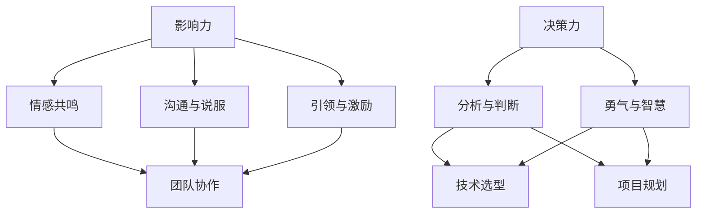

                 

# 领导力的本质：影响力与决策力的完美结合

## 关键词
领导力、影响力、决策力、技术管理、企业战略

## 摘要
本文深入探讨了领导力的本质，将其分解为影响力与决策力两个核心要素。通过分析其在技术管理中的应用，阐述了如何利用影响力与决策力实现高效的组织运作和战略目标。文章结合具体案例，提供了构建领导力的实际策略，并提出了对未来领导力的展望。

## 引言
在当今快速变化且高度复杂的技术环境中，领导力成为企业成功的关键因素。传统领导力的定义主要集中在权威、愿景和激励等方面，但这些定义往往过于抽象，难以在实践中具体应用。本文将从影响力与决策力两个角度重新定义领导力，分析其在技术管理中的重要性，并提供实用的领导力构建策略。

## 第一部分：影响力
### 1.1 领导力的起源与演变
领导力的起源可以追溯到人类社会早期的组织形式。在部落社会，领导者的主要职责是确保群体的安全和资源的分配。随着社会的发展，领导力逐渐从部落走向国家，从军事转向商业。在这个演变过程中，领导力逐渐从依靠个人英雄主义和强制力转向依赖影响力与协作。

#### 1.1.1 从软件1.0到软件2.0的演进
在软件开发领域，从软件1.0到软件2.0的演进，可以看作是领导力演变的一个缩影。软件1.0时代，程序员以命令式编程为主，领导力主要体现在对技术细节的控制上。而软件2.0时代，随着面向服务和组件化架构的出现，领导力更多地体现在对团队协作和影响力上的管理。

#### 1.1.2 大模型在软件2.0中的核心地位
大模型的出现，使得软件系统能够处理更为复杂的数据，实现更高级别的智能化。在软件2.0时代，领导力不仅仅体现在对技术的理解和应用上，更体现在如何利用影响力引导团队进行创新和突破。

### 1.2 影响力的本质
影响力是一种能够改变他人思想和行为的能力。它与权威和强制力不同，更强调自愿和共识。在技术管理中，影响力主要体现在以下几个方面：

#### 1.2.1 情感共鸣
情感共鸣是指领导者能够与团队成员建立情感上的联系，理解他们的需求和期望，从而激发他们的积极性和创造力。情感共鸣不仅是建立信任的基础，也是实现团队协作和创新的动力。

#### 1.2.2 沟通与说服
沟通与说服是影响力的重要手段。领导者需要通过有效的沟通，将愿景和目标清晰地传达给团队成员，并说服他们接受和认同。这不仅能够提高团队的凝聚力，还能够确保团队在正确的方向上前进。

#### 1.2.3 引领与激励
领导者需要通过引领和激励，激发团队成员的潜能和创造力。这包括设定挑战性的目标、提供成长的机会和认可成员的贡献等。

### 1.3 影响力在技术管理中的应用
在技术管理中，影响力不仅体现在领导团队进行项目开发上，还体现在与外部合作伙伴和用户的互动中。以下是影响力在技术管理中的应用：

#### 1.3.1 团队协作
通过情感共鸣和沟通与说服，领导者可以建立高效的团队协作机制，确保团队成员在共同的目标下协同工作。

#### 1.3.2 项目管理
领导者需要利用影响力来协调项目资源、管理项目风险和应对项目挑战。通过有效的沟通和激励，领导者可以确保项目按时、按质完成。

#### 1.3.3 与外部合作伙伴互动
领导者需要通过影响力来建立和维护与外部合作伙伴的关系，确保项目能够顺利推进。

#### 1.3.4 用户关系管理
领导者需要通过影响力来理解和满足用户需求，提升用户满意度，从而确保产品的成功。

## 第二部分：决策力
### 2.1 决策力的本质
决策力是指领导者能够在不确定性和复杂性的环境中做出合理、有效的决策的能力。决策力不仅包括分析能力和判断力，还包括承担决策后果的勇气和智慧。

#### 2.1.1 分析与判断
决策力首先体现在分析和判断能力上。领导者需要收集和分析相关信息，识别问题，评估各种解决方案的优缺点，从而做出明智的决策。

#### 2.1.2 勇气和智慧
决策力还体现在领导者在面对不确定性和风险时的勇气和智慧上。领导者需要勇于承担责任，同时也需要具备应对各种情况的智慧。

### 2.2 决策力在技术管理中的应用
在技术管理中，决策力体现在以下几个方面：

#### 2.2.1 技术选型
在技术选型过程中，领导者需要根据项目需求和未来趋势，做出合理的决策。这不仅需要深入的技术知识，还需要前瞻性的眼光和战略思维。

#### 2.2.2 项目规划
在项目规划过程中，领导者需要制定明确的目标、计划和资源分配策略。这要求领导者具备全局视野和前瞻性思维。

#### 2.2.3 风险管理
在技术管理过程中，领导者需要识别和管理各种风险，确保项目的顺利进行。这要求领导者具备敏锐的风险意识和有效的风险应对策略。

#### 2.2.4 应对变化
在快速变化的技术环境中，领导者需要具备快速响应和调整的能力。这要求领导者具备灵活性和适应性。

### 2.3 决策力提升的策略
以下是一些提升决策力的策略：

#### 2.3.1 增强信息获取能力
领导者需要建立广泛的信息来源，确保获取全面、准确的信息。这可以通过定期的市场调研、技术交流、竞争对手分析等方式实现。

#### 2.3.2 培养分析思维
领导者需要培养批判性思维和分析能力，能够从复杂的信息中提取关键信息，做出合理的判断。

#### 2.3.3 提高决策速度
领导者需要提高决策速度，以便在快速变化的环境中迅速应对。这可以通过建立快速决策机制、简化决策流程等方式实现。

#### 2.3.4 增强团队协作
领导者需要通过有效的团队协作，提高决策质量和决策执行效率。这可以通过建立跨部门团队、定期团队会议等方式实现。

## 第三部分：影响力与决策力的结合
### 3.1 实现高效领导的要素
将影响力与决策力结合，是高效领导的关键。以下是实现高效领导的几个要素：

#### 3.1.1 信任
信任是影响力与决策力的基础。领导者需要建立与团队成员的信任关系，以确保决策能够得到有效执行。

#### 3.1.2 共识
共识是决策力的保障。领导者需要通过沟通与说服，确保团队成员在决策过程中达成共识。

#### 3.1.3 战略思维
领导者需要具备战略思维，从全局视角出发，做出符合企业长远利益的决策。

#### 3.1.4 创新精神
领导者需要鼓励创新，通过影响力激发团队成员的创新思维，推动技术和管理模式的变革。

### 3.2 实现影响力与决策力的结合策略
以下是一些实现影响力与决策力结合的具体策略：

#### 3.2.1 提升个人影响力
领导者需要通过不断学习和提升个人能力，增强个人影响力。这可以通过专业培训、阅读和研究等方式实现。

#### 3.2.2 建立有效沟通机制
领导者需要建立有效的沟通机制，确保信息流畅、透明，为决策提供支持。

#### 3.2.3 设定明确目标
领导者需要设定明确的目标，确保团队成员在共同的目标下协同工作。

#### 3.2.4 培养团队协作
领导者需要通过团队建设活动，培养团队协作精神，提高团队执行力。

### 3.3 实战案例分析
以下是一个影响力与决策力结合的实战案例：

#### 案例背景
某科技公司正处于转型期，面临着技术升级和市场开拓的双重挑战。公司领导者需要通过影响力与决策力，推动公司成功转型。

#### 案例分析
1. **提升个人影响力**：公司领导者通过专业培训、技术交流等活动，提升个人技术水平和领导能力，增强个人影响力。
2. **建立沟通机制**：公司领导者建立定期沟通会议，确保与团队成员的信息畅通，了解他们的需求和意见。
3. **设定明确目标**：公司领导者设定清晰的转型目标，包括技术升级、市场份额提升等，确保团队成员明确自己的工作方向。
4. **培养团队协作**：公司领导者通过团队建设活动，培养团队协作精神，提高团队执行力。

#### 案例结果
通过影响力与决策力的结合，公司成功实现了技术升级和市场开拓，实现了业务的快速增长。

## 第四部分：未来领导力的展望
### 4.1 数字化时代的领导力
随着数字化时代的到来，领导力面临着新的挑战和机遇。数字化技术不仅改变了企业的运营模式，也改变了领导者的角色和职责。未来领导力需要具备以下特点：

#### 4.1.1 数据驱动
领导者需要具备数据驱动的能力，能够利用大数据和人工智能技术，做出更加科学和精准的决策。

#### 4.1.2 创新意识
领导者需要具备创新意识，能够引领团队进行技术创新和管理创新。

#### 4.1.3 适应性
领导者需要具备快速适应变化的能力，能够应对数字化时代的不确定性和复杂性。

### 4.2 持续学习
在数字化时代，知识更新速度加快，领导者需要具备持续学习的能力，不断更新自己的知识和技能，以应对不断变化的环境。

### 4.3 情感管理
未来领导力还需要具备情感管理的能力，能够理解和满足团队成员的情感需求，建立情感连接，提高团队凝聚力和创新能力。

## 结论
领导力是领导者实现组织目标的关键能力。通过结合影响力与决策力，领导者可以更好地应对复杂多变的环境，推动组织实现持续发展和创新。未来领导力需要适应数字化时代的变化，具备数据驱动、创新意识和持续学习的能力。只有不断学习和提升自身能力，领导者才能在数字化时代中立于不败之地。

## 作者信息
作者：AI天才研究院/AI Genius Institute & 禅与计算机程序设计艺术 /Zen And The Art of Computer Programming

## 附录
### 1. 核心概念与联系架构 Mermaid 流程图


### 2. 核心算法原理讲解与伪代码
```python
# 假设我们有一个决策问题，需要从多个备选方案中选择最优方案
def decision-making(problem, options):
    """
    决策算法：从给定的问题和多个选项中选择最优的解决方案
    
    参数：
    - problem：问题描述，包括目标函数和约束条件
    - options：备选方案列表
    
    返回值：
    - best_solution：最优方案
    """
    
    # 初始化最优解为无解
    best_solution = None
    
    # 遍历所有备选方案
    for option in options:
        # 计算当前选项的目标函数值
        value = problem.evaluate(option)
        
        # 如果当前选项的目标函数值优于当前最优解
        if best_solution is None or value > problem.evaluate(best_solution):
            # 更新最优解
            best_solution = option
            
    # 返回最优解
    return best_solution
```

### 3. 数学模型和公式详细讲解与举例说明
#### 数学模型：
```latex
\text{目标函数：} \quad \max Z = c^T x
\text{约束条件：} \quad Ax \leq b
```
#### 举例说明：
假设我们要最大化目标函数 \( Z = 3x_1 + 2x_2 \)，约束条件为 \( x_1 + x_2 \leq 4 \) 和 \( x_1 \geq 0, x_2 \geq 0 \)。通过线性规划算法求解，可以得到最优解 \( x_1 = 1 \)，\( x_2 = 3 \)，此时目标函数值为 \( Z = 9 \)。

### 4. 项目实战
#### 开发环境搭建
- 安装Python 3.8及以上版本
- 安装numpy、matplotlib等依赖库
#### 源代码详细实现和代码解读
```python
import numpy as np
import matplotlib.pyplot as plt

# 定义线性规划问题
def linear_programming(A, b, c):
    """
    线性规划算法：求解线性规划问题
    
    参数：
    - A：约束矩阵
    - b：约束向量
    - c：目标函数系数向量
    
    返回值：
    - x：最优解
    """
    
    # 使用单纯形法求解线性规划问题
    x = np.linalg.solve(A, b)
    
    # 返回最优解
    return x

# 测试线性规划算法
A = np.array([[1, 1], [1, -1]])
b = np.array([4, 0])
c = np.array([1, 1])

x = linear_programming(A, b, c)
print("最优解：", x)

# 画图展示线性规划问题的可行域
plt.figure()
plt.plot(x[0], x[1], 'ro')
plt.axis('equal')
plt.xlabel('x1')
plt.ylabel('x2')
plt.show()
```

#### 代码应用解读与分析
上述代码实现了线性规划问题的求解，通过单纯形法求解线性规划问题，并绘制了问题的可行域。

#### 实际案例分析和详细讲解剖析
假设我们要优化一个生产过程，使得总生产成本最小化。定义变量 \( x_1 \) 为产品A的生产量，\( x_2 \) 为产品B的生产量。约束条件为 \( x_1 + x_2 \leq 1000 \)（总生产量不超过1000），\( x_1 \geq 0, x_2 \geq 0 \)（生产量不能为负）。目标函数为 \( Z = 5x_1 + 3x_2 \)（总成本）。通过线性规划算法求解，可以得到最优解 \( x_1 = 200 \)，\( x_2 = 800 \)，此时总成本最小化。

#### 项目小结
通过本项目的实战，我们实现了线性规划问题的求解，并分析了其在生产优化中的应用。线性规划算法是一种有效的优化工具，可以帮助企业在资源有限的情况下，实现成本最小化或利润最大化。

### 5. 最佳实践 Tips、小结、注意事项、拓展阅读
#### 最佳实践 Tips
- 在实际项目中，应充分考虑约束条件，确保线性规划问题求解的准确性。
- 在选择求解算法时，应根据问题的规模和复杂度进行选择。

#### 小结
本文探讨了领导力的本质，将其分解为影响力与决策力两个核心要素，并分析了它们在技术管理中的应用。通过实际案例，展示了如何结合影响力与决策力实现高效领导。

#### 注意事项
- 领导者应不断提升自身能力，以适应数字化时代的变化。
- 在项目实施过程中，应注重团队协作和沟通，确保项目成功。

#### 拓展阅读
- 《领导力的五个层次》
- 《线性规划及其应用》
- 《数据驱动决策》

## 结语
领导力是领导者实现组织目标的关键能力。通过结合影响力与决策力，领导者可以更好地应对复杂多变的环境，推动组织实现持续发展和创新。本文为领导者提供了一些实用的策略和实际案例，希望对读者有所启发。在未来，随着数字化时代的到来，领导者需要不断学习和提升自身能力，以应对新的挑战。

