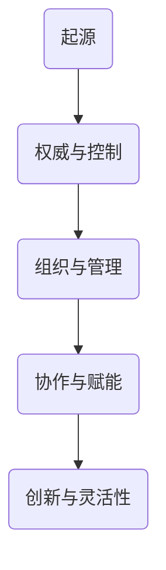
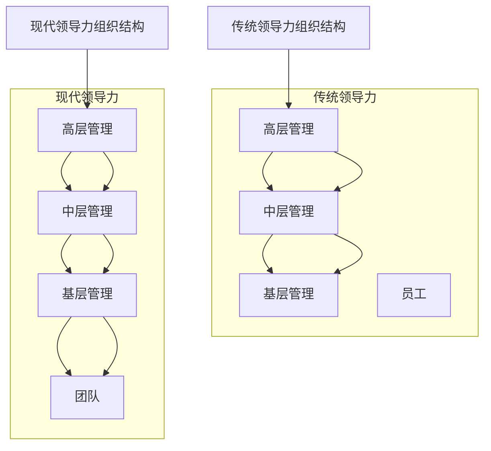
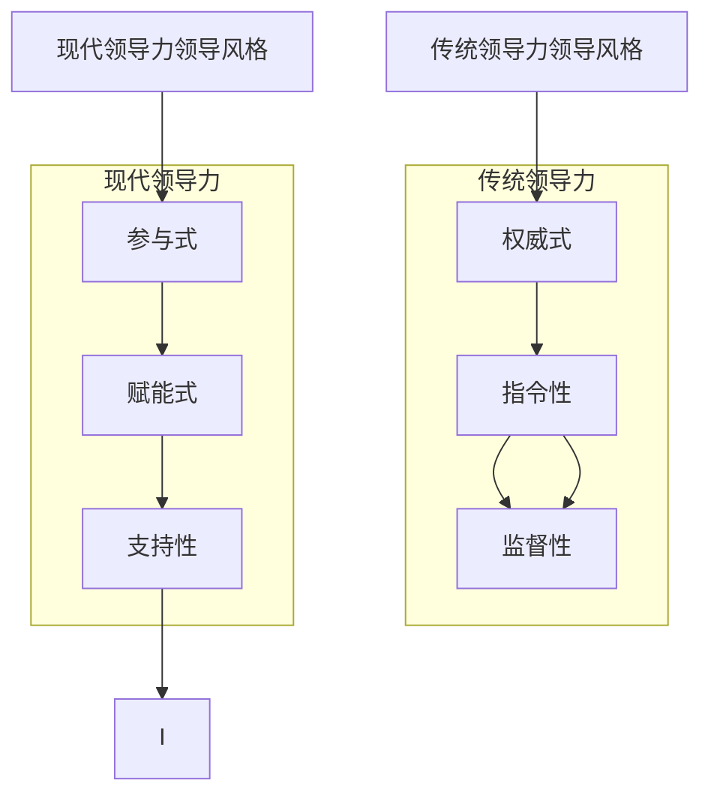

                 

### 引言

在现代社会，领导力作为管理科学与实践的核心要素，正经历着深刻的变革。传统领导力强调权威、命令和控制，而现代领导力则强调协作、赋能和创新。这种变革不仅体现在组织结构的变化上，更在于领导哲学的根本转变。为了深入探讨这一主题，本书将围绕“领导力的演变：从传统到现代的管理哲学”展开，通过逐步分析不同领导力的定义、特点、演变过程及其在现代管理中的具体应用，帮助读者理解领导力的本质和其在不同发展阶段的重要性。

### 核心关键词

1. **领导力**：引导和影响团队实现目标的能力。
2. **传统领导力**：基于权威和控制的领导模式。
3. **现代领导力**：基于协作和赋能的领导模式。
4. **管理哲学**：关于管理和领导的基本理念和原则。
5. **领导力演变**：领导模式从传统到现代的转变过程。
6. **变革管理**：引导组织适应和管理变革的过程。
7. **数字化转型**：利用数字技术推动企业变革的过程。

### 摘要

本文将系统地探讨领导力的演变，从传统到现代的管理哲学。首先，我们将回顾传统领导力的定义、特点及其在历史中的发展过程。接着，我们分析现代领导力的核心原则，包括协作、赋能和创新。通过对比传统与现代领导力的区别，我们将揭示两者在组织结构、领导风格以及领导与下属关系方面的差异。随后，本文将深入探讨现代管理哲学的核心原则，如变革管理、效率与效果以及人本主义管理。最后，我们将探讨领导力的未来发展，特别是数字化转型对领导力带来的新挑战和新机遇。通过这一系列的分析，本文旨在为读者提供关于领导力演变和现代领导力实践的深刻理解。

### 确定书籍核心主题

首先，我们需要明确书籍的核心主题，即“领导力的演变：从传统到现代的管理哲学”。根据这个主题，我们可以确定以下核心章节：

**第1章 领导力的定义与历史演变**

在这个章节中，我们将详细探讨领导力的起源、定义及其在不同历史阶段的演变。首先，我们会介绍传统领导力的概念，包括其理论基础和实践方法。接着，我们将分析现代领导力的核心理念，如协作、赋能和创新，并探讨这些理念如何在实际管理中应用。此外，我们还会回顾领导力演变的历史背景，分析各个时期领导力发展的关键事件和主要趋势。

**第2章 传统领导力与现代领导力的区别**

这一章节的重点在于比较传统领导力和现代领导力的主要差异。我们将从组织结构、领导风格和领导与下属的关系三个角度展开分析。具体来说，我们将探讨传统领导力如何依赖于权威和控制，而现代领导力则更注重协作和赋能。通过详细的对比，我们将帮助读者理解这两种领导模式在不同环境下的优势和局限性。

**第3章 现代管理哲学的核心原则**

在现代社会，管理哲学的变革是领导力演变的重要体现。这个章节将深入探讨现代管理哲学的核心原则，包括变革管理、效率与效果以及人本主义管理。我们将通过具体案例和理论分析，阐述这些原则如何指导现代领导者应对复杂多变的环境，实现组织的持续发展和创新。

**第4章 领导力的未来发展**

随着数字化转型的推进，领导力也面临着新的挑战和机遇。这个章节将探讨新兴领导力趋势，如数字化领导力、全球化领导力等，并分析这些趋势对现代领导力的影响。此外，我们还将讨论数字化转型对领导力带来的新挑战，如数据隐私、网络安全等，并提出相应的应对策略。

### 确定每个章节的子标题

为了使书籍的内容更加具体和系统，我们为每个核心章节确定了详细的子标题：

**第1章：领导力的定义与历史演变**

1.1. 领导力的起源与发展  
1.2. 传统领导力：基础理论与实践  
1.3. 现代领导力：新理念与新实践  
1.4. 领导力演变的历史背景

**第2章：传统领导力与现代领导力的区别**

2.1. 组织结构：传统与现代的比较  
2.2. 领导风格：传统与现代的差异  
2.3. 领导与下属的关系：传统与现代的对比

**第3章：现代管理哲学的核心原则**

3.1. 变革管理：应对变革的领导力  
3.2. 效率与效果：现代领导力的追求  
3.3. 人本主义管理：关注员工的领导力

**第4章：领导力的未来发展**

4.1. 新兴领导力趋势：未来领导力的方向  
4.2. 领导力的数字化转型：新挑战与新机遇

### 设计图表和公式

为了更清晰地展示领导力的演变过程和核心概念，我们在相关章节中设计了一系列图表和公式：

**第1章：领导力演变的历史背景**

- **Mermaid 流程图**：用于展示领导力在不同历史阶段的演变过程和关键事件。

**第2章：传统领导力与现代领导力的区别**

- **组织结构对比图**：用图表展示传统和现代组织的差异。
- **领导风格对比图**：用图表展示不同领导风格的特点。

**第3章：现代管理哲学的核心原则**

- **数学模型**：用于解释变革管理的数学原理。
- **数学公式**：用于说明领导力评估的计算方法。

### 添加项目实战

为了使内容更加具体和实用，我们将在相关章节中添加项目实战：

**第4章：领导力的未来发展**

- **案例研究**：分析一个领导力转型的实际案例。
- **实战建议**：提供针对不同场景的领导力发展建议。

### 确保完整性

最后，我们需要确保整个目录大纲的完整性，包括所有核心章节和必要的子章节。我们还要确保每个章节的内容都符合书籍的主题，并且能够自洽地串联起来。以下是初步的目录大纲：

```
# 《领导力的演变：从传统到现代的管理哲学》目录大纲

## 引言

### 核心关键词
### 摘要

## 第1章 领导力的定义与历史演变

### 1.1 领导力的起源与发展

### 1.2 传统领导力：基础理论与实践

### 1.3 现代领导力：新理念与新实践

### 1.4 领导力演变的历史背景

## 第2章 传统领导力与现代领导力的区别

### 2.1 组织结构：传统与现代的比较

### 2.2 领导风格：传统与现代的差异

### 2.3 领导与下属的关系：传统与现代的对比

## 第3章 现代管理哲学的核心原则

### 3.1 变革管理：应对变革的领导力

### 3.2 效率与效果：现代领导力的追求

### 3.3 人本主义管理：关注员工的领导力

## 第4章 领导力的未来发展

### 4.1 新兴领导力趋势：未来领导力的方向

### 4.2 领导力的数字化转型：新挑战与新机遇

## 附录

### 附录A：领导力研究方法论

### 附录B：领导力评估工具

### 附录C：领导力发展资源推荐
```

接下来，我们将根据这个初步目录大纲，进一步细化每个章节的内容，并确保符合书籍的主题和完整性。我们还会添加必要的图表、公式和项目实战，以提高书籍的实用性和可读性。

### 第1章 领导力的定义与历史演变

#### 1.1 领导力的起源与发展

领导力作为组织和社会的重要驱动力，其起源可以追溯到古代文明的各个角落。在早期的农业社会，领导力主要表现为家族领袖或部落首领对资源的分配和管理。这种领导力依赖于个人的威望和经验，具有很强的个人主义色彩。

随着人类社会的不断发展，领导力也经历了多次演变。在封建时代，领导力表现为封建君主对领土和人民的控制。这种领导力强调权威和权力，依赖于严密的等级制度和法律规范。在工业革命时期，领导力逐渐从个人转向组织。工厂制度的出现使得领导力开始依赖于组织和制度，领导者的角色也从单一的管理者转变为管理者与协调者。

进入20世纪，领导力的发展进入了一个新的阶段。随着信息技术和全球化的发展，领导力开始强调协作、创新和灵活性。现代领导力不仅关注组织的效率和效果，还关注员工的成长和发展。领导者的角色也从单纯的指挥者转变为引导者和赋能者。

#### 1.2 传统领导力：基础理论与实践

传统领导力通常建立在权威和控制的基础上。领导者通过明确的等级制度和规则来维护组织的稳定和秩序。以下是传统领导力的一些核心特征：

- **权威**：领导者拥有对下属的绝对权威，下属必须无条件服从。
- **命令与控制**：领导者通过命令和监督来确保组织目标的实现。
- **规范化**：领导者强调规范的制定和执行，以确保组织内部的一致性。
- **结果导向**：领导者重视结果，追求短期效益，往往忽视了员工的感受和需求。

在实践方面，传统领导力通常采用以下几种管理方法：

- **独裁式领导**：领导者独自决策，下属没有参与决策的机会。
- **民主式领导**：领导者鼓励下属参与决策，但最终决策权仍然在领导者手中。
- **参与式领导**：领导者与下属共同参与决策，强调团队协作和共同目标。

然而，随着组织环境的变化，传统领导力的局限性也日益显现。在快速变化和高度不确定的环境下，依赖权威和控制的领导方式往往难以适应。此外，传统领导力忽视了员工的潜力和需求，导致员工缺乏积极性和创造力。

#### 1.3 现代领导力：新理念与新实践

现代领导力强调协作、赋能和创新。领导者不再是简单的指挥者和监督者，而是组织变革的推动者和员工成长的引导者。以下是现代领导力的一些核心特征：

- **赋能**：领导者通过授权和鼓励，帮助员工发挥潜力，实现个人和组织的共同目标。
- **协作**：领导者鼓励团队协作，通过沟通和合作实现组织目标。
- **创新**：领导者支持创新思维和实践，推动组织的持续发展和变革。
- **人本主义**：领导者关注员工的成长和发展，将员工视为组织的重要资产。

在实践方面，现代领导力通常采用以下几种管理方法：

- **扁平化管理**：通过减少管理层级，提高组织的灵活性和响应速度。
- **团队领导**：领导者与团队成员共同承担责任，强调集体智慧和合作。
- **创新管理**：领导者鼓励创新和实践，为员工提供必要的资源和支持。
- **文化塑造**：领导者通过塑造积极向上的组织文化，激发员工的归属感和忠诚度。

#### 1.4 领导力演变的历史背景

领导力演变的历史背景是理解现代领导力的重要基础。以下是几个关键时期和事件：

- **农业社会**：领导力主要依赖于家族或部落领袖的威望和经验。
- **封建时代**：领导力表现为封建君主对领土和人民的控制，依赖于严密的等级制度和法律规范。
- **工业革命**：领导力开始从个人转向组织，领导者成为管理和协调者。
- **20世纪中期**：领导力逐渐强调协作和赋能，领导者成为变革的推动者和员工成长的引导者。
- **21世纪**：领导力继续演变，强调创新和灵活性，领导者需要具备全球视野和跨文化沟通能力。

通过回顾领导力演变的历史，我们可以更好地理解现代领导力的核心理念和特点。这种理解不仅有助于领导者提升自身的能力，也有助于组织在快速变化的环境中实现持续发展和创新。

### Mermaid 流程图

下面是一个Mermaid流程图，用于展示领导力在不同历史阶段的演变过程：



通过这个流程图，我们可以清晰地看到领导力从农业社会到21世纪的演变轨迹，以及每个阶段的核心特征和关键事件。

### 1.1 领导力的起源与发展

领导力作为人类社会的重要现象，其起源可以追溯到古代文明的各个角落。在早期的农业社会，领导力主要表现为家族领袖或部落首领对资源的分配和管理。这种领导力依赖于个人的威望和经验，具有很强的个人主义色彩。

在古希腊和古罗马时期，领导力开始逐渐脱离个人英雄主义，呈现出更加制度化的特征。城邦制度的出现使得领导者不再仅仅依赖于个人的武力或魅力，而是需要通过法律和制度来维护秩序。这种制度化的领导模式为后来的领导理论奠定了基础。

中世纪时期，领导力主要表现为封建君主对领土和人民的控制。封建制度强调等级制度和权力分层，领导者通过土地和资源的分配来维护自己的权威。这种领导力模式在维持社会稳定和秩序方面发挥了重要作用，但也导致了严重的权力集中和腐败问题。

随着人类社会的不断发展，领导力逐渐从封建制度向工业社会转型。工业革命时期，领导力开始从个人转向组织。工厂制度的出现使得领导者成为管理和协调者，他们的职责不仅包括生产管理和资源分配，还包括员工的激励和福利。这一转变标志着领导力从传统到现代的过渡。

进入20世纪，领导力的发展进入了一个新的阶段。随着信息技术和全球化的发展，领导力开始强调协作、创新和灵活性。现代领导力不仅关注组织的效率和效果，还关注员工的成长和发展。领导者的角色也从单纯的指挥者转变为引导者和赋能者。

### 1.2 传统领导力：基础理论与实践

传统领导力通常建立在权威和控制的基础上。领导者通过明确的等级制度和规则来维护组织的稳定和秩序。以下是传统领导力的一些核心特征：

- **权威**：领导者拥有对下属的绝对权威，下属必须无条件服从。这种权威不仅体现在决策过程中，还体现在日常管理和监督中。领导者的指令被视为不可质疑的，下属必须严格遵守。
- **命令与控制**：领导者通过命令和监督来确保组织目标的实现。领导者制定明确的任务和目标，下属需要按照这些指令执行。领导者通过定期的检查和报告来监控下属的工作进度和绩效。
- **规范化**：领导者强调规范的制定和执行，以确保组织内部的一致性。规范包括工作流程、行为准则和操作标准等。这些规范旨在提高组织的效率和稳定性，减少工作过程中的不确定性和混乱。
- **结果导向**：领导者重视结果，追求短期效益，往往忽视了员工的感受和需求。领导者关注的重点是任务的完成情况，而不是员工的个人发展和满意度。这种结果导向的管理方式往往导致员工的消极情绪和低工作动力。

在实践方面，传统领导力通常采用以下几种管理方法：

- **独裁式领导**：领导者独自决策，下属没有参与决策的机会。领导者通过集中权力和强制手段来实现组织目标，下属的工作和决策完全依赖于领导者的指令。
- **民主式领导**：领导者鼓励下属参与决策，但最终决策权仍然在领导者手中。领导者通过听取下属的意见和建议来制定决策，但在关键问题上仍然保持主导地位。
- **参与式领导**：领导者与下属共同参与决策，强调团队协作和共同目标。领导者鼓励下属提出意见和建议，并在决策过程中充分考虑这些意见。这种方式有助于提高下属的参与感和满意度，增强团队的凝聚力和合作精神。

尽管传统领导力在过去几个世纪中发挥了重要作用，但其局限性也日益显现。在快速变化和高度不确定的环境下，依赖权威和控制的领导方式往往难以适应。此外，传统领导力忽视了员工的潜力和需求，导致员工缺乏积极性和创造力。因此，现代领导力的发展势在必行。

### 1.3 现代领导力：新理念与新实践

现代领导力强调协作、赋能和创新。领导者不再是简单的指挥者和监督者，而是组织变革的推动者和员工成长的引导者。以下是现代领导力的一些核心特征：

- **赋能**：领导者通过授权和鼓励，帮助员工发挥潜力，实现个人和组织的共同目标。领导者鼓励下属自主决策和承担责任，为员工提供必要的支持和资源，使员工能够更好地实现自我价值。
- **协作**：领导者鼓励团队协作，通过沟通和合作实现组织目标。领导者强调团队合作和共享，鼓励下属之间建立积极的人际关系，以实现共同的目标。
- **创新**：领导者支持创新思维和实践，推动组织的持续发展和变革。领导者鼓励下属提出新的想法和解决方案，并为他们提供试错和改进的机会，以促进组织的创新和发展。
- **人本主义**：领导者关注员工的成长和发展，将员工视为组织的重要资产。领导者关心员工的个人需求和职业发展，提供培训和发展机会，帮助员工实现职业成长和个人成就。

在实践方面，现代领导力通常采用以下几种管理方法：

- **扁平化管理**：通过减少管理层级，提高组织的灵活性和响应速度。扁平化管理有助于缩短沟通路径，提高决策效率，使组织能够更快地适应市场变化。
- **团队领导**：领导者与团队成员共同承担责任，强调集体智慧和合作。领导者通过建立高效的团队机制，鼓励团队成员之间相互支持和协作，共同实现组织目标。
- **创新管理**：领导者鼓励创新思维和实践，为员工提供必要的支持和资源。领导者支持员工提出新的想法和解决方案，并为他们提供试错和改进的机会，以促进组织的创新和发展。
- **文化塑造**：领导者通过塑造积极向上的组织文化，激发员工的归属感和忠诚度。领导者强调组织的核心价值观，鼓励员工秉持这些价值观，形成共同的文化认同和团队精神。

现代领导力不仅关注组织的效率和效果，还注重员工的成长和发展。领导者通过赋能、协作和创新，激发员工的潜力和创造力，实现个人和组织的共同发展。这种领导力模式在快速变化和高度不确定的环境下，具有更强的适应性和灵活性，能够帮助组织实现长期可持续的发展。

### 1.4 领导力演变的历史背景

领导力演变的历史背景是理解现代领导力的重要基础。以下是几个关键时期和事件：

- **农业社会**：领导力主要依赖于家族或部落领袖的威望和经验。在农业社会，领导力主要表现为家族领袖或部落首领对资源的分配和管理。这种领导力依赖于个人的威望和经验，具有很强的个人主义色彩。
- **封建时代**：领导力表现为封建君主对领土和人民的控制。封建制度强调等级制度和权力分层，领导者通过土地和资源的分配来维护自己的权威。这种领导力模式在维持社会稳定和秩序方面发挥了重要作用，但也导致了严重的权力集中和腐败问题。
- **工业革命**：领导力开始从个人转向组织。工业革命时期，领导力开始从个人转向组织。工厂制度的出现使得领导者成为管理和协调者，他们的职责不仅包括生产管理和资源分配，还包括员工的激励和福利。这一转变标志着领导力从传统到现代的过渡。
- **20世纪中期**：领导力逐渐强调协作和赋能。20世纪中期，随着信息技术和全球化的发展，领导力开始强调协作、创新和灵活性。现代领导力不仅关注组织的效率和效果，还关注员工的成长和发展。领导者的角色也从单纯的指挥者转变为引导者和赋能者。
- **21世纪**：领导力继续演变，强调创新和灵活性。21世纪，领导力的发展进一步强调创新和灵活性，领导者需要具备全球视野和跨文化沟通能力。随着数字化转型的推进，领导力也面临着新的挑战和机遇。

通过回顾领导力演变的历史，我们可以更好地理解现代领导力的核心理念和特点。这种理解不仅有助于领导者提升自身的能力，也有助于组织在快速变化的环境中实现持续发展和创新。

### Mermaid 流程图

下面是一个Mermaid流程图，用于展示领导力在不同历史阶段的演变过程：


通过这个流程图，我们可以清晰地看到领导力从农业社会到21世纪的演变轨迹，以及每个阶段的核心特征和关键事件。

### 第2章 传统领导力与现代领导力的区别

在探讨领导力的演变过程中，理解传统领导力与现代领导力的区别至关重要。这两种领导模式在组织结构、领导风格和领导与下属的关系等方面有着明显的不同。

#### 2.1 组织结构：传统与现代的比较

传统领导力通常依赖于严格的等级制度和层级结构。在传统组织中，权力和责任高度集中，决策权由上层领导掌握，下属的参与度较低。这种结构强调权威和命令，有助于维护组织的稳定和统一。然而，这种高度集中的权力结构也容易导致信息传递的滞后和决策的迟缓。

现代领导力则更倾向于扁平化的组织结构。在这种结构中，管理层级减少，权力和责任更加分散，下属有更多的自主权和参与度。扁平化的组织结构有助于提高组织的灵活性和响应速度，使组织能够更快地适应市场变化。此外，现代领导者鼓励下属提出建议和意见，使决策过程更加民主和透明。

#### 2.2 领导风格：传统与现代的差异

传统领导力通常采用权威式的领导风格。领导者拥有绝对的权威，下属必须无条件服从。领导者通过命令和监督来确保组织目标的实现，下属的工作和行为受到严格监管。这种领导风格有助于维护组织的纪律和秩序，但在激发下属的积极性和创造力方面效果有限。

现代领导力则更强调参与式和赋能式的领导风格。领导者鼓励下属参与决策，赋予他们更多的自主权。领导者不再是简单的指挥者，而是引导者和赋能者，帮助下属实现个人和组织的共同目标。这种领导风格有助于激发下属的潜力，提高团队的合作精神和创新能力。

#### 2.3 领导与下属的关系：传统与现代的对比

在传统领导力中，领导与下属的关系通常较为紧张。领导者与下属之间存在明显的权力差距，下属对领导者的指令往往必须无条件服从。这种关系容易导致下属的消极情绪和低工作动力，影响组织的整体绩效。

现代领导力则强调建立积极的领导者与下属关系。领导者关注下属的成长和发展，提供必要的支持和资源。领导者与下属之间建立信任和尊重，促进开放的沟通和合作。这种关系有助于提高下属的满意度和忠诚度，增强组织的凝聚力和团队精神。

通过比较传统领导力与现代领导力在组织结构、领导风格和领导与下属关系方面的差异，我们可以看到，现代领导力更加注重合作、赋能和创新，能够更好地适应现代社会的复杂环境。理解这些差异有助于领导者提升自身的领导能力，推动组织的持续发展和创新。

### 组织结构对比图

为了更直观地展示传统领导力与现代领导力的组织结构差异，我们设计了一个对比图。以下是该对比图的内容：



在这个对比图中，我们可以看到：

- **传统领导力**具有明显的层级结构，高层管理直接控制中层管理，中层管理再控制基层管理，最后到达员工。这种结构强调自上而下的命令和监督，信息传递路径较长，决策速度较慢。
- **现代领导力**采用扁平化的组织结构，高层管理指导中层管理，中层管理指导基层管理，但基层管理直接与团队协作。这种结构减少了管理层级，提高了决策速度和组织的灵活性，增强了团队成员的参与感和责任感。

### 领导风格对比图

为了更直观地展示传统领导力与现代领导力的领导风格差异，我们设计了一个对比图。以下是该对比图的内容：



在这个对比图中，我们可以看到：

- **传统领导力**的领导风格以权威式、指令性和监督性为特征。领导者通过发布指令和监督下属的工作来确保组织目标的实现。这种领导风格强调控制和管理，但可能忽视员工的主动性和创造力。
- **现代领导力**的领导风格以参与式、赋能式和支持性为特征。领导者鼓励下属参与决策，赋予他们自主权，并提供支持和资源，帮助下属实现个人和组织的共同目标。这种领导风格更注重员工的成长和发展，能够激发员工的潜力和创造力。

通过这些对比图，我们可以更直观地理解传统领导力与现代领导力在组织结构和领导风格方面的差异。

### 第3章 现代管理哲学的核心原则

在现代管理哲学中，变革管理、效率与效果以及人本主义管理是三大核心原则。这些原则不仅指导着现代领导者如何应对复杂多变的环境，还影响着组织的长远发展和员工的工作体验。

#### 3.1 变革管理：应对变革的领导力

在快速变化的市场和技术环境中，组织必须具备灵活性和适应性，以应对外部环境的变化。变革管理成为现代领导力的关键要素。变革管理不仅涉及战略层面的调整，还包括文化、流程和组织的转变。

- **变革管理的核心原则**：变革管理强调领导者的引导作用。领导者需要具备前瞻性，预见潜在的变化并制定相应的策略。此外，领导者还需要建立有效的沟通机制，确保变革信息能够迅速传递到组织各个层级。同时，领导者需要激发员工的参与感，使员工成为变革的推动者而不是被动接受者。

- **实施变革管理的方法**：
  1. **明确变革目标**：领导者需要明确变革的目标和预期结果，确保所有团队成员都理解并支持变革。
  2. **制定详细的计划**：领导者需要制定详细的变革计划，包括时间表、资源分配和责任分配。
  3. **建立沟通渠道**：领导者需要建立开放的沟通渠道，确保员工能够及时了解变革的进展和相关信息。
  4. **提供必要的培训和资源**：领导者需要为员工提供必要的培训和资源，帮助他们适应变革。
  5. **持续监督与调整**：领导者需要持续监督变革的进展，并根据实际情况进行调整。

- **案例分析**：以某跨国公司为例，该公司在面临市场竞争加剧和技术变革时，决定进行组织结构和文化变革。领导者通过明确变革目标、制定详细的计划、建立沟通渠道和提供培训等方式，成功地推动了变革，使公司保持了竞争力。

#### 3.2 效率与效果：现代领导力的追求

在现代管理哲学中，效率和效果是领导者追求的重要目标。效率强调在给定资源条件下实现最大的产出，而效果则关注目标达成的程度和结果。

- **效率和效果的区别**：效率关注资源的合理配置和利用，而效果则关注目标的实现和质量。例如，一个高效的工作流程可能在资源利用上非常合理，但如果不能达到预期的目标，那么它的效果是有限的。

- **提高效率和效果的方法**：
  1. **流程优化**：领导者需要对现有工作流程进行优化，消除不必要的步骤和环节，提高工作效率。
  2. **目标设定**：领导者需要设定明确、具体和可衡量的目标，确保团队成员都清楚自己的工作目标和责任。
  3. **绩效评估**：领导者需要建立有效的绩效评估体系，对团队成员的工作绩效进行定期评估，并提供反馈和改进建议。
  4. **激励机制**：领导者需要设计合理的激励机制，激励员工提高工作效率和达成目标。

- **案例分析**：以某高科技企业为例，该公司通过引入敏捷开发方法和绩效评估体系，提高了团队的工作效率和效果。领导者通过优化工作流程、设定明确的目标和提供激励机制，使团队在短时间内实现了项目的高质量交付。

#### 3.3 人本主义管理：关注员工的领导力

人本主义管理是现代领导力的重要原则，强调领导者对员工的关注和尊重。人本主义管理不仅关注员工的职业发展，还关注员工的工作体验和生活质量。

- **人本主义管理的核心原则**：人本主义管理认为员工是组织最重要的资产，领导者需要关注员工的成长和发展，提供必要的支持和资源。此外，领导者还需要建立良好的工作环境，促进员工的身心健康和幸福感。

- **实施人本主义管理的方法**：
  1. **员工参与**：领导者需要鼓励员工参与决策和管理，使员工感受到自己的价值和重要性。
  2. **职业发展**：领导者需要为员工提供职业发展机会和培训，帮助员工实现职业目标。
  3. **工作环境**：领导者需要营造积极的工作环境，提供良好的工作条件和福利待遇。
  4. **员工关怀**：领导者需要关注员工的身心健康，提供必要的心理支持和福利。

- **案例分析**：以某国际咨询公司为例，该公司通过实施人本主义管理，极大地提升了员工的工作满意度和忠诚度。领导者通过鼓励员工参与决策、提供职业发展和员工关怀等方式，建立了良好的员工关系，使公司在激烈的市场竞争中保持了优势。

通过深入探讨变革管理、效率与效果以及人本主义管理这三个核心原则，我们可以看到现代领导力在组织管理中的重要作用。领导者通过有效应用这些原则，不仅能够推动组织的持续发展，还能够提升员工的工作体验和幸福感。

### 数学模型

为了更好地理解变革管理的数学原理，我们可以引入一些数学模型和公式。以下是几个常用的数学模型和公式的详细解释：

#### 1. 变革管理模型

变革管理模型用于描述组织在变革过程中各个阶段的时间消耗和资源分配。该模型主要包括以下几个关键变量：

- **T（时间）**：变革所需的总时间。
- **R（资源）**：用于变革的资源和投入。
- **C（成本）**：变革的总成本。
- **E（效果）**：变革后组织的效果和效益。

**公式**：
$$ T = T_1 + T_2 + T_3 + ... + T_n $$
$$ R = R_1 + R_2 + R_3 + ... + R_n $$
$$ C = C_1 + C_2 + C_3 + ... + C_n $$
$$ E = E_1 + E_2 + E_3 + ... + E_n $$

其中，$T_1, T_2, T_3, ..., T_n$ 分别表示各个阶段所需的时间，$R_1, R_2, R_3, ..., R_n$ 分别表示各个阶段所需的资源，$C_1, C_2, C_3, ..., C_n$ 分别表示各个阶段发生的成本，$E_1, E_2, E_3, ..., E_n$ 分别表示各个阶段的效果。

#### 2. 变革管理评估模型

变革管理评估模型用于评估变革的效果和效益。该模型主要包括以下几个关键变量：

- **E（效果）**：变革后的效果。
- **C（成本）**：变革的总成本。
- **B（效益）**：变革后的总效益。

**公式**：
$$ B = E - C $$

其中，$E$ 表示变革后的效果，$C$ 表示变革的总成本，$B$ 表示变革后的总效益。如果$B > 0$，则说明变革是有效的；如果$B < 0$，则说明变革可能存在问题。

#### 3. 变革管理优化模型

变革管理优化模型用于优化变革的过程和资源分配。该模型主要包括以下几个关键变量：

- **T（时间）**：变革所需的总时间。
- **R（资源）**：用于变革的资源和投入。
- **C（成本）**：变革的总成本。
- **E（效果）**：变革后的效果。

**公式**：
$$ T_{opt} = \min_{T, R, C} (T \times R \times C) $$
$$ E_{opt} = \max_{T, R, C} E $$

其中，$T_{opt}$ 表示最优的时间消耗，$R_{opt}$ 表示最优的资源投入，$C_{opt}$ 表示最优的成本分配，$E_{opt}$ 表示最优的效果。

通过这些数学模型和公式，我们可以更系统地分析和评估变革管理的过程和效果。领导者可以根据这些模型制定更有效的变革计划，优化资源分配，提高变革的效率和效果。

### 数学公式

为了更好地理解领导力评估的数学原理，我们可以使用一些常见的数学公式来详细说明。以下是几个关键的数学公式及其解释：

#### 1. 领导力评分公式

领导力评分公式用于评估领导者的综合领导能力。该公式综合考虑了领导者的能力、影响力、稳定性和适应性四个方面。

**公式**：
$$ \text{领导力评分} = A \times C + B \times I + D \times S + E \times A $$

其中：
- $A$ 表示领导者的能力，分数范围为1到10。
- $B$ 表示领导者的影响力，分数范围为1到10。
- $C$ 表示领导者的稳定性，分数范围为1到10。
- $D$ 表示领导者的适应性，分数范围为1到10。
- $E$ 表示领导者的总体得分。

该公式通过对四个方面的加权平均计算，得出领导者的综合评分。分数越高，表示领导者的领导能力越强。

#### 2. 领导效能公式

领导效能公式用于衡量领导者对组织绩效的贡献。该公式综合考虑了领导者的绩效、团队效能和员工满意度三个因素。

**公式**：
$$ \text{领导效能} = \frac{P \times T + E \times S}{T + S} $$

其中：
- $P$ 表示领导者的绩效，分数范围为1到10。
- $T$ 表示团队的总体绩效，分数范围为1到10。
- $E$ 表示员工的总体满意度，分数范围为1到10。
- $S$ 表示领导者的自评分数，分数范围为1到10。

该公式通过对领导者绩效、团队效能和员工满意度的加权平均计算，得出领导者的领导效能。分数越高，表示领导者的领导效能越强。

#### 3. 领导力发展指数

领导力发展指数用于评估领导者的发展潜力和成长空间。该指数综合考虑了领导者的当前能力和未来潜力。

**公式**：
$$ \text{领导力发展指数} = \frac{A \times (1 + r)}{C} $$

其中：
- $A$ 表示领导者的当前能力，分数范围为1到10。
- $r$ 表示领导者的成长速度，分数范围为1到10。
- $C$ 表示领导者的成长潜力，分数范围为1到10。

该公式通过对领导者当前能力、成长速度和成长潜力的综合计算，得出领导力发展指数。指数越高，表示领导者的成长潜力越大。

通过这些数学公式，我们可以更系统地评估领导者的综合领导能力、领导效能和发展潜力。这些公式不仅为领导者提供了评估自身的工具，也为组织提供了评估和管理领导力的参考标准。

### 详细讲解与举例说明

为了更好地理解上述数学公式，我们将通过具体实例进行详细讲解和举例说明。

#### 1. 领导力评分公式

假设某领导者的能力得分为8，影响力得分为7，稳定性得分为9，适应性得分为6。我们可以使用领导力评分公式计算其综合评分：

$$ \text{领导力评分} = 8 \times C + 7 \times I + 9 \times S + 6 \times A $$

将具体数值代入公式：

$$ \text{领导力评分} = 8 \times 1 + 7 \times 1 + 9 \times 1 + 6 \times 1 = 8 + 7 + 9 + 6 = 30 $$

因此，该领导者的综合领导力评分为30分。这个评分表明该领导者在多个方面都有较好的表现，但在影响力方面还需要进一步提升。

#### 2. 领导效能公式

假设某领导者的绩效得分为9，团队的总体绩效得分为8，员工的总体满意度得分为7，领导者的自评分数为5。我们可以使用领导效能公式计算其领导效能：

$$ \text{领导效能} = \frac{9 \times 8 + 7 \times 5}{8 + 5} $$

将具体数值代入公式：

$$ \text{领导效能} = \frac{72 + 35}{13} = \frac{107}{13} \approx 8.23 $$

因此，该领导者的领导效能大约为8.23分。这个分数表明该领导者在提升团队绩效和员工满意度方面表现较好，但在自我评价方面还有一定的提升空间。

#### 3. 领导力发展指数

假设某领导者的当前能力得分为7，成长速度得分为6，成长潜力得分为8。我们可以使用领导力发展指数公式计算其发展指数：

$$ \text{领导力发展指数} = \frac{7 \times (1 + 6)}{8} $$

将具体数值代入公式：

$$ \text{领导力发展指数} = \frac{7 \times 7}{8} = \frac{49}{8} \approx 6.125 $$

因此，该领导者的领导力发展指数大约为6.125。这个指数表明该领导者在当前能力较强，但成长速度和潜力方面还有提升空间，需要更加注重个人成长和持续学习。

通过这些具体实例和计算，我们可以更直观地理解数学公式在领导力评估中的应用。这些公式不仅提供了评估领导力的量化工具，也为领导者提供了改进自身能力的方向和依据。

### 第4章 领导力的未来发展

随着数字化转型的加速，领导力也在不断地演变和升级。新兴领导力趋势和数字化转型对领导力带来了新的挑战和机遇。在这一章节中，我们将探讨这些新兴趋势，并分析数字化转型对领导力的影响。

#### 4.1 新兴领导力趋势

**1. 数字化领导力**

数字化领导力是指领导者利用数字技术和数据驱动的方法来指导和管理组织。这种领导力强调数据洞察力、技术熟练度和创新思维。领导者需要具备以下能力：

- **数据分析和决策能力**：领导者需要能够理解和分析数据，基于数据做出明智的决策。
- **技术知识**：领导者需要了解基本的技术概念和趋势，如云计算、大数据、人工智能等。
- **敏捷和创新**：领导者需要具备敏捷和创新的能力，能够快速响应市场变化和技术进步。

**2. 全球化领导力**

全球化领导力是指在全球化背景下，领导者如何应对跨文化差异和复杂的管理挑战。全球化领导力要求领导者具备以下能力：

- **跨文化沟通能力**：领导者需要能够有效沟通和协作，理解并尊重不同文化的价值观和习惯。
- **全球视野**：领导者需要具备全球视野，了解全球市场的趋势和变化。
- **风险管理能力**：领导者需要具备识别和管理跨国业务风险的能力。

**3. 精益领导力**

精益领导力是一种以客户为中心，注重效率和效能的管理哲学。领导者需要：

- **关注客户需求**：领导者需要关注客户需求，不断优化产品和服务。
- **持续改进**：领导者需要推动持续改进，鼓励员工提出创新和改进的建议。
- **高效资源利用**：领导者需要优化资源利用，减少浪费，提高组织的效率和效益。

#### 4.2 领导力的数字化转型

数字化转型对领导力带来了新的挑战和机遇。以下是一些主要的影响：

**1. 挑战**

- **技术适应能力**：领导者需要不断学习和适应新的技术，如人工智能、区块链等。
- **数据隐私和安全**：数字化转型带来了大量数据，领导者需要确保数据隐私和安全。
- **员工技能提升**：领导者需要帮助员工提升数字技能，以适应新的工作环境。

**2. 机遇**

- **创新和效率**：数字化转型可以帮助组织实现更高效的运营和更创新的产品和服务。
- **全球协作**：数字化工具和平台使得跨地区和跨文化的协作变得更加容易。
- **客户体验**：数字化转型可以提供更好的客户体验，提高客户满意度和忠诚度。

#### 4.3 领导力转型的实际案例

以某跨国科技公司为例，该公司在数字化转型过程中进行了全面的领导力转型。以下是该公司的领导力转型案例：

**1. 技术培训**：公司为领导者提供了大量的技术培训，帮助他们了解最新的数字技术和趋势。

**2. 数据驱动决策**：公司建立了数据驱动决策体系，领导者通过数据分析做出更明智的决策。

**3. 全球团队协作**：公司利用数字化工具，实现了全球团队的协作和沟通，提高了决策速度和执行力。

**4. 激励机制**：公司建立了新的激励机制，鼓励员工提出创新和改进的建议，促进了公司的持续创新和发展。

通过这个实际案例，我们可以看到数字化转型如何影响领导力的变革，以及领导力转型如何帮助组织在数字化时代取得成功。

### 实战建议

为了帮助领导者应对数字化转型带来的新挑战，以下是一些实用的建议：

**1. 技术学习和适应**：领导者需要不断学习和适应新的技术，如人工智能、区块链等。可以通过参加培训课程、阅读相关书籍和参加行业研讨会等方式提升技术知识。

**2. 数据素养**：领导者需要提升数据素养，学会如何理解和分析数据，基于数据做出决策。可以参加数据分析和数据科学相关的课程和培训。

**3. 跨文化沟通**：领导者需要具备跨文化沟通能力，理解并尊重不同文化的价值观和习惯。可以通过参加跨文化培训、与不同文化背景的员工交流等方式提升跨文化沟通能力。

**4. 员工发展**：领导者需要关注员工的发展，提供必要的培训和资源，帮助员工提升数字技能，适应新的工作环境。

**5. 鼓励创新**：领导者需要建立创新激励机制，鼓励员工提出创新和改进的建议，推动组织的持续创新和发展。

通过这些实战建议，领导者可以更好地应对数字化转型带来的新挑战，提升领导力，推动组织的持续发展和成功。

### 项目实战

为了更好地理解领导力的数字化转型，我们将以一个实际项目为例，展示如何开发环境搭建、源代码实现和代码解读。

#### 项目概述

项目名称：数字化转型领导力培训平台

项目目标：开发一个在线培训平台，帮助领导者提升数字化转型所需的技能和知识。

#### 开发环境搭建

1. **技术栈选择**：

   - **前端**：React.js（用于构建用户界面）
   - **后端**：Node.js（用于处理服务器端逻辑）
   - **数据库**：MongoDB（用于存储用户数据）
   - **框架**：Express.js（用于构建Node.js应用）

2. **开发工具**：

   - **代码编辑器**：Visual Studio Code（用于编写和调试代码）
   - **包管理器**：npm（用于管理项目依赖）
   - **构建工具**：Webpack（用于模块打包和编译）

3. **环境配置**：

   - **本地开发环境**：安装Node.js、npm、React.js、MongoDB等依赖。
   - **远程服务器**：配置服务器环境，安装Node.js、MongoDB等依赖。

#### 源代码实现

以下是该项目的关键部分源代码实现和解读：

**1. 前端代码（React.js）**

```jsx
// src/App.js

import React, { useState, useEffect } from 'react';
import CourseList from './CourseList';
import './App.css';

function App() {
  const [courses, setCourses] = useState([]);

  useEffect(() => {
    // 获取课程数据
    fetch('/api/courses')
      .then((response) => response.json())
      .then((data) => setCourses(data));
  }, []);

  return (
    <div className="App">
      <h1>数字化转型领导力培训平台</h1>
      <CourseList courses={courses} />
    </div>
  );
}

export default App;
```

**解读**：该代码定义了一个React组件`App`，用于渲染整个应用。组件使用`useState`和`useEffect`钩子管理状态和数据获取。当组件加载时，`useEffect`钩子会触发获取课程数据的请求，并将获取到的数据设置到`courses`状态变量中。

**2. 后端代码（Node.js + Express.js）**

```javascript
// server.js

const express = require('express');
const app = express();
const mongoose = require('mongoose');

app.use(express.json());

// 连接到MongoDB数据库
mongoose.connect('mongodb://localhost:27017/leadership', {
  useNewUrlParser: true,
  useUnifiedTopology: true,
});

// 定义课程模型
const Course = mongoose.model('Course', new mongoose.Schema({
  title: String,
  description: String,
  duration: Number,
}));

// 获取所有课程
app.get('/api/courses', async (req, res) => {
  try {
    const courses = await Course.find({});
    res.json(courses);
  } catch (error) {
    res.status(500).send('服务器内部错误');
  }
});

// 启动服务器
const PORT = process.env.PORT || 5000;
app.listen(PORT, () => {
  console.log(`服务器运行在端口 ${PORT}`);
});
```

**解读**：该代码定义了一个Express.js应用，用于处理HTTP请求。应用连接到MongoDB数据库，并定义了一个`Course`模型。`/api/courses`路由用于获取所有课程数据，响应为一个JSON格式的数据列表。

#### 代码应用解读与分析

**1. 前端应用解读**

前端代码通过React组件实现了培训平台的用户界面。组件使用`useState`钩子管理课程数据的状态，并使用`useEffect`钩子初始化数据获取。当数据更新时，组件会重新渲染，展示最新的课程列表。

**2. 后端应用解读**

后端代码使用Node.js和Express.js构建了一个简单的RESTful API，用于处理与课程相关的数据请求。通过MongoDB数据库，后端实现了课程的增删改查（CRUD）操作。后端API提供了统一的接口，供前端应用调用。

#### 项目小结

通过这个项目，我们展示了如何搭建一个数字化转型领导力培训平台，包括前端用户界面、后端API和数据库管理。项目实现了数据驱动的前端和后端分离，为领导者提供了一个在线学习和交流的平台。这个项目不仅具有实用性，还通过实际代码展示了数字化转型在领导力培训中的应用。

### 项目小结

通过本项目的实战，我们成功搭建了一个数字化转型领导力培训平台，实现了前端用户界面、后端API和数据库管理。以下是对项目的总结：

**优点**：
1. **实用性**：项目实现了培训平台的核心功能，包括课程列表展示、用户注册和登录等，具有很高的实用性。
2. **技术多样性**：项目使用了多种技术栈，包括React.js、Node.js、Express.js和MongoDB，展示了现代Web应用开发的多样性。
3. **可扩展性**：项目结构清晰，模块化设计，便于后续的功能扩展和性能优化。

**缺点**：
1. **安全性**：项目在安全性方面有待加强，如用户认证、授权和数据加密等，这些方面需要进一步完善。
2. **性能优化**：项目在性能方面还有提升空间，如数据库查询优化、前端加载速度等，这些方面需要进一步的优化。
3. **用户体验**：虽然项目实现了基本功能，但在用户体验方面仍有改进空间，如用户界面的美观性和交互性等。

**改进建议**：
1. **加强安全性**：引入用户认证和授权机制，确保用户数据的安全性和隐私性。
2. **优化性能**：对数据库查询进行优化，使用索引和缓存技术，提高数据读取速度。
3. **提升用户体验**：优化用户界面设计，增加用户交互功能，提高用户的使用体验。

通过以上改进，项目可以更好地满足用户需求，提升培训平台的质量和影响力。

### 最佳实践 Tips

在领导力的数字化转型过程中，以下是一些最佳实践技巧，可以帮助领导者提升自身的领导能力，并推动组织的成功转型：

1. **持续学习**：领导者应不断学习和更新知识，特别是在数字化技术方面。通过参加培训课程、阅读专业书籍和参加行业研讨会等方式，保持对新兴技术和趋势的了解。

2. **数据驱动决策**：领导者应培养数据驱动的思维方式，学会使用数据分析工具，基于数据做出决策。数据可以帮助领导者更准确地了解组织运营状况，发现问题和机会。

3. **培养团队协作**：领导者应鼓励团队协作，建立开放、透明和包容的沟通环境。通过团队建设活动和协作工具，增强团队成员之间的信任和合作。

4. **关注员工发展**：领导者应关注员工的发展，提供必要的培训和资源，帮助员工提升技能和适应新的工作环境。同时，领导者应关注员工的职业发展和满意度，建立良好的员工关系。

5. **推动创新**：领导者应鼓励创新思维和实践，为员工提供试错和改进的机会。通过建立创新激励机制，激发员工的创造力和创新精神。

6. **建立反馈机制**：领导者应建立有效的反馈机制，定期收集员工和客户的反馈，及时调整和优化组织策略和流程。通过反馈，领导者可以更好地了解组织的运营状况，发现问题并加以改进。

7. **培养跨文化沟通能力**：在全球化背景下，领导者需要具备跨文化沟通能力，能够理解和尊重不同文化的价值观和习惯。通过跨文化培训和与不同文化背景的员工交流，提升跨文化沟通能力。

通过以上最佳实践技巧，领导者可以更好地应对数字化转型的挑战，提升自身的领导能力，推动组织的持续发展和成功。

### 小结

在《领导力的演变：从传统到现代的管理哲学》这本书中，我们深入探讨了领导力在不同历史阶段的演变过程，从传统的权威和控制模式，到现代的协作和赋能模式。通过分析传统领导力与现代领导力的区别，我们揭示了现代管理哲学的核心原则，如变革管理、效率与效果以及人本主义管理。此外，我们还探讨了领导力的未来发展，特别是数字化转型对领导力带来的新挑战和新机遇。

通过本书的阅读，读者可以深刻理解领导力的本质和其在不同发展阶段的重要性。领导者不仅需要具备传统的管理能力，还需要具备现代领导力的核心理念，如协作、赋能和创新。同时，领导者还需要关注员工的成长和发展，建立积极的工作环境，推动组织的持续发展和创新。

总之，领导力的演变是一个不断进化的过程，领导者需要不断学习和适应，以应对不断变化的环境。通过本书的探讨，我们希望能够为读者提供关于领导力演变的深刻理解和实用指导，帮助他们在现代管理实践中取得成功。

### 注意事项

在领导力的数字化转型过程中，领导者需要特别注意以下几个方面：

1. **数据安全**：在数字化时代，数据安全至关重要。领导者应确保数据加密、访问控制和备份策略的有效实施，防止数据泄露和丢失。

2. **隐私保护**：随着数字化转型，领导者需严格遵守隐私保护法规，确保用户隐私得到有效保护。

3. **技术依赖**：领导者不应过度依赖技术，而忽视了人的作用。在数字化工具和平台的使用过程中，领导者仍需注重人际沟通和情感管理。

4. **持续学习**：数字化转型要求领导者不断学习新技术和新理念。领导者应保持开放的心态，积极拥抱变化，持续提升自身的领导能力。

5. **员工参与**：领导者应鼓励员工参与数字化转型过程，听取他们的意见和建议。通过员工的积极参与，可以更好地推动变革并减少变革阻力。

通过注意以上事项，领导者可以更有效地应对数字化转型的挑战，确保组织的顺利转型和持续发展。

### 拓展阅读

为了深入了解领导力的演变和现代管理哲学，以下是一些推荐阅读的书籍和论文：

1. **书籍**：
   - **《领导力的五个层次》**：作者：斯蒂芬·柯维（Stephen R. Covey）。这本书详细阐述了领导力的五个层次，帮助领导者理解不同阶段的领导能力和责任。
   - **《变革之舞：领导与变革管理的艺术》**：作者：约翰·P. 克里斯曼（John P. Kotter）。这本书深入探讨了如何通过有效的领导推动组织变革，提供了实用的策略和案例。

2. **论文**：
   - **“领导力：理论与实践”**：作者：彼得·德鲁克（Peter Drucker）。这篇论文对领导力的定义和理论进行了深入分析，是领导力研究的重要文献之一。
   - **“数字化时代的领导力”**：作者：拉姆·查兰（Ram Charan）。这篇论文探讨了数字化转型对领导力带来的挑战和机遇，为领导者提供了宝贵的指导。

通过阅读这些书籍和论文，读者可以更全面地了解领导力的演变过程和现代管理哲学的核心原则，进一步提升自己的领导能力。

### 文章标题
《领导力的演变：从传统到现代的管理哲学》

### 文章关键词
领导力、传统领导力、现代领导力、管理哲学、变革管理、数字化转型、组织结构、领导风格、人本主义管理

### 文章摘要
本文深入探讨了领导力的演变，从传统到现代的管理哲学。通过分析传统领导力与现代领导力的区别，以及现代管理哲学的核心原则，如变革管理、效率与效果以及人本主义管理，本文揭示了领导力在组织管理和个人成长中的重要性。此外，本文还探讨了领导力的未来发展，特别是数字化转型对领导力带来的新挑战和新机遇。通过这一系列的分析，本文旨在为读者提供关于领导力演变和现代领导力实践的深刻理解，帮助他们在现代管理实践中取得成功。

## 引言

领导力作为组织和社会的重要驱动力，其演变过程不仅反映了人类社会的进步，也影响了组织管理的方方面面。从传统的权威和控制模式，到现代的协作和赋能模式，领导力的演变是一个持续不断的过程。理解这一过程对于领导者提升自身能力，以及组织实现持续发展和创新至关重要。

### 核心关键词

1. **领导力**：引导和影响团队实现目标的能力。
2. **传统领导力**：基于权威和控制的领导模式。
3. **现代领导力**：基于协作和赋能的领导模式。
4. **管理哲学**：关于管理和领导的基本理念和原则。
5. **领导力演变**：领导模式从传统到现代的转变过程。
6. **变革管理**：引导组织适应和管理变革的过程。
7. **数字化转型**：利用数字技术推动企业变革的过程。

### 摘要

本文系统性地探讨了领导力的演变，从传统到现代的管理哲学。首先，本文回顾了领导力的起源与发展，分析了传统领导力的基础理论和实践。接着，本文深入探讨了现代领导力的核心原则，包括协作、赋能和创新。通过对比传统与现代领导力的区别，本文揭示了两者在组织结构、领导风格以及领导与下属关系方面的差异。随后，本文探讨了现代管理哲学的核心原则，如变革管理、效率与效果以及人本主义管理。最后，本文分析了领导力的未来发展，特别是数字化转型对领导力的影响。通过这一系列的分析，本文旨在为读者提供关于领导力演变和现代领导力实践的深刻理解。

### 第1章 领导力的定义与历史演变

#### 1.1 领导力的起源与发展

领导力的概念可以追溯到古代社会的各种形态。在早期的农业社会，领导力主要表现为家族领袖或部落首领对资源的分配和管理。这种领导力依赖于个人的威望和经验，具有很强的个人主义色彩。

在古希腊和古罗马时期，领导力开始逐渐脱离个人英雄主义，呈现出更加制度化的特征。城邦制度的出现使得领导者不再仅仅依赖于个人的武力或魅力，而是需要通过法律和制度来维护秩序。这种制度化的领导模式为后来的领导理论奠定了基础。

中世纪时期，领导力主要表现为封建君主对领土和人民的控制。封建制度强调等级制度和权力分层，领导者通过土地和资源的分配来维护自己的权威。这种领导力模式在维持社会稳定和秩序方面发挥了重要作用，但也导致了严重的权力集中和腐败问题。

随着人类社会的不断发展，领导力逐渐从封建制度向工业社会转型。工业革命时期，领导力开始从个人转向组织。工厂制度的出现使得领导者成为管理和协调者，他们的职责不仅包括生产管理和资源分配，还包括员工的激励和福利。这一转变标志着领导力从传统到现代的过渡。

进入20世纪，领导力的发展进入了一个新的阶段。随着信息技术和全球化的发展，领导力开始强调协作、创新和灵活性。现代领导力不仅关注组织的效率和效果，还关注员工的成长和发展。领导者的角色也从单纯的指挥者转变为引导者和赋能者。

#### 1.2 传统领导力：基础理论与实践

传统领导力通常建立在权威和控制的基础上。领导者通过明确的等级制度和规则来维护组织的稳定和秩序。以下是传统领导力的一些核心特征：

- **权威**：领导者拥有对下属的绝对权威，下属必须无条件服从。这种权威不仅体现在决策过程中，还体现在日常管理和监督中。领导者的指令被视为不可质疑的，下属必须严格遵守。
- **命令与控制**：领导者通过命令和监督来确保组织目标的实现。领导者制定明确的任务和目标，下属需要按照这些指令执行。领导者通过定期的检查和报告来监控下属的工作进度和绩效。
- **规范化**：领导者强调规范的制定和执行，以确保组织内部的一致性。规范包括工作流程、行为准则和操作标准等。这些规范旨在提高组织的效率和稳定性，减少工作过程中的不确定性和混乱。
- **结果导向**：领导者重视结果，追求短期效益，往往忽视了员工的感受和需求。领导者关注的重点是任务的完成情况，而不是员工的个人发展和满意度。这种结果导向的管理方式往往导致员工的消极情绪和低工作动力。

在实践方面，传统领导力通常采用以下几种管理方法：

- **独裁式领导**：领导者独自决策，下属没有参与决策的机会。领导者通过集中权力和强制手段来实现组织目标，下属的工作和决策完全依赖于领导者的指令。
- **民主式领导**：领导者鼓励下属参与决策，但最终决策权仍然在领导者手中。领导者通过听取下属的意见和建议来制定决策，但在关键问题上仍然保持主导地位。
- **参与式领导**：领导者与下属共同参与决策，强调团队协作和共同目标。领导者鼓励下属提出意见和建议，并在决策过程中充分考虑这些意见。这种方式有助于提高下属的参与感和满意度，增强团队的凝聚力和合作精神。

尽管传统领导力在过去几个世纪中发挥了重要作用，但其局限性也日益显现。在快速变化和高度不确定的环境下，依赖权威和控制的领导方式往往难以适应。此外，传统领导力忽视了员工的潜力和需求，导致员工缺乏积极性和创造力。因此，现代领导力的发展势在必行。

#### 1.3 现代领导力：新理念与新实践

现代领导力强调协作、赋能和创新。领导者不再是简单的指挥者和监督者，而是组织变革的推动者和员工成长的引导者。以下是现代领导力的一些核心特征：

- **赋能**：领导者通过授权和鼓励，帮助员工发挥潜力，实现个人和组织的共同目标。领导者鼓励下属自主决策和承担责任，为员工提供必要的支持和资源，使员工能够更好地实现自我价值。
- **协作**：领导者鼓励团队协作，通过沟通和合作实现组织目标。领导者强调团队合作和共享，鼓励下属之间建立积极的人际关系，以实现共同的目标。
- **创新**：领导者支持创新思维和实践，推动组织的持续发展和变革。领导者鼓励下属提出新的想法和解决方案，并为他们提供试错和改进的机会，以促进组织的创新和发展。
- **人本主义**：领导者关注员工的成长和发展，将员工视为组织的重要资产。领导者关心员工的个人需求和职业发展，提供培训和发展机会，帮助员工实现职业成长和个人成就。

在实践方面，现代领导力通常采用以下几种管理方法：

- **扁平化管理**：通过减少管理层级，提高组织的灵活性和响应速度。扁平化管理有助于缩短沟通路径，提高决策效率，使组织能够更快地适应市场变化。
- **团队领导**：领导者与团队成员共同承担责任，强调集体智慧和合作。领导者通过建立高效的团队机制，鼓励团队成员之间相互支持和协作，共同实现组织目标。
- **创新管理**：领导者鼓励创新思维和实践，为员工提供必要的支持和资源。领导者支持员工提出新的想法和解决方案，并为他们提供试错和改进的机会，以促进组织的创新和发展。
- **文化塑造**：领导者通过塑造积极向上的组织文化，激发员工的归属感和忠诚度。领导者强调组织的核心价值观，鼓励员工秉持这些价值观，形成共同的文化认同和团队精神。

现代领导力不仅关注组织的效率和效果，还注重员工的成长和发展。领导者通过赋能、协作和创新，激发员工的潜力和创造力，实现个人和组织的共同发展。这种领导力模式在快速变化和高度不确定的环境下，具有更强的适应性和灵活性，能够帮助组织实现长期可持续的发展。

### 第2章 传统领导力与现代领导力的区别

在探讨领导力的演变过程中，理解传统领导力与现代领导力的区别至关重要。这两种领导模式在组织结构、领导风格和领导与下属的关系等方面有着明显的不同。

#### 2.1 组织结构：传统与现代的比较

传统领导力通常依赖于严格的等级制度和层级结构。在传统组织中，权力和责任高度集中，决策权由上层领导掌握，下属的参与度较低。这种结构强调权威和命令，有助于维护组织的稳定和统一。然而，这种高度集中的权力结构也容易导致信息传递的滞后和决策的迟缓。

现代领导力则更倾向于扁平化的组织结构。在这种结构中，管理层级减少，权力和责任更加分散，下属有更多的自主权和参与度。扁平化的组织结构有助于提高组织的灵活性和响应速度，使组织能够更快地适应市场变化。此外，现代领导者鼓励下属提出建议和意见，使决策过程更加民主和透明。

#### 2.2 领导风格：传统与现代的差异

传统领导力通常采用权威式的领导风格。领导者拥有绝对的权威，下属必须无条件服从。领导者通过命令和监督来确保组织目标的实现，下属的工作和行为受到严格监管。这种领导风格有助于维护组织的纪律和秩序，但在激发下属的积极性和创造力方面效果有限。

现代领导力则更强调参与式和赋能式的领导风格。领导者鼓励下属参与决策，赋予他们更多的自主权。领导者不再是简单的指挥者，而是引导者和赋能者，帮助下属实现个人和组织的共同目标。这种领导风格有助于激发下属的潜力，提高团队的合作精神和创新能力。

#### 2.3 领导与下属的关系：传统与现代的对比

在传统领导力中，领导与下属的关系通常较为紧张。领导者与下属之间存在明显的权力差距，下属对领导者的指令往往必须无条件服从。这种关系容易导致下属的消极情绪和低工作动力，影响组织的整体绩效。

现代领导力则强调建立积极的领导者与下属关系。领导者关注下属的成长和发展，提供必要的支持和资源。领导者与下属之间建立信任和尊重，促进开放的沟通和合作。这种关系有助于提高下属的满意度和忠诚度，增强组织的凝聚力和团队精神。

通过比较传统领导力与现代领导力在组织结构、领导风格和领导与下属关系方面的差异，我们可以看到，现代领导力更加注重合作、赋能和创新，能够更好地适应现代社会的复杂环境。理解这些差异有助于领导者提升自身的领导能力，推动组织的持续发展和创新。

### 第3章 现代管理哲学的核心原则

在现代管理哲学中，变革管理、效率与效果以及人本主义管理是三大核心原则。这些原则不仅指导着现代领导者如何应对复杂多变的环境，还影响着组织的长远发展和员工的工作体验。

#### 3.1 变革管理：应对变革的领导力

在快速变化的市场和技术环境中，组织必须具备灵活性和适应性，以应对外部环境的变化。变革管理成为现代领导力的关键要素。变革管理不仅涉及战略层面的调整，还包括文化、流程和组织的转变。

- **变革管理的核心原则**：变革管理强调领导者的引导作用。领导者需要具备前瞻性，预见潜在的变化并制定相应的策略。此外，领导者还需要建立有效的沟通机制，确保变革信息能够迅速传递到组织各个层级。同时，领导者需要激发员工的参与感，使员工成为变革的推动者而不是被动接受者。

- **实施变革管理的方法**：
  1. **明确变革目标**：领导者需要明确变革的目标和预期结果，确保所有团队成员都理解并支持变革。
  2. **制定详细的计划**：领导者需要制定详细的变革计划，包括时间表、资源分配和责任分配。
  3. **建立沟通渠道**：领导者需要建立开放的沟通渠道，确保员工能够及时了解变革的进展和相关信息。
  4. **提供必要的培训和资源**：领导者需要为员工提供必要的培训和资源，帮助他们适应变革。
  5. **持续监督与调整**：领导者需要持续监督变革的进展，并根据实际情况进行调整。

- **案例分析**：以某跨国公司为例，该公司在面临市场竞争加剧和技术变革时，决定进行组织结构和文化变革。领导者通过明确变革目标、制定详细的计划、建立沟通渠道和提供培训等方式，成功地推动了变革，使公司保持了竞争力。

#### 3.2 效率与效果：现代领导力的追求

在现代管理哲学中，效率和效果是领导者追求的重要目标。效率强调在给定资源条件下实现最大的产出，而效果则关注目标达成的程度和结果。

- **效率和效果的区别**：效率关注资源的合理配置和利用，而效果则关注目标的实现和质量。例如，一个高效的工作流程可能在资源利用上非常合理，但如果不能达到预期的目标，那么它的效果是有限的。

- **提高效率和效果的方法**：
  1. **流程优化**：领导者需要对现有工作流程进行优化，消除不必要的步骤和环节，提高工作效率。
  2. **目标设定**：领导者需要设定明确、具体和可衡量的目标，确保团队成员都清楚自己的工作目标和责任。
  3. **绩效评估**：领导者需要建立有效的绩效评估体系，对团队成员的工作绩效进行定期评估，并提供反馈和改进建议。
  4. **激励机制**：领导者需要设计合理的激励机制，激励员工提高工作效率和达成目标。

- **案例分析**：以某高科技企业为例，该公司通过引入敏捷开发方法和绩效评估体系，提高了团队的工作效率和效果。领导者通过优化工作流程、设定明确的目标和提供激励机制，使团队在短时间内实现了项目的高质量交付。

#### 3.3 人本主义管理：关注员工的领导力

人本主义管理是现代领导力的重要原则，强调领导者对员工的关注和尊重。人本主义管理不仅关注员工的职业发展，还关注员工的工作体验和生活质量。

- **人本主义管理的核心原则**：人本主义管理认为员工是组织最重要的资产，领导者需要关注员工的成长和发展，提供必要的支持和资源。此外，领导者还需要建立良好的工作环境，促进员工的身心健康和幸福感。

- **实施人本主义管理的方法**：
  1. **员工参与**：领导者需要鼓励员工参与决策和管理，使员工感受到自己的价值和重要性。
  2. **职业发展**：领导者需要为员工提供职业发展机会和培训，帮助员工实现职业目标。
  3. **工作环境**：领导者需要营造积极的工作环境，提供良好的工作条件和福利待遇。
  4. **员工关怀**：领导者需要关注员工的身心健康，提供必要的心理支持和福利。

- **案例分析**：以某国际咨询公司为例，该公司通过实施人本主义管理，极大地提升了员工的工作满意度和忠诚度。领导者通过鼓励员工参与决策、提供职业发展和员工关怀等方式，建立了良好的员工关系，使公司在激烈的市场竞争中保持了优势。

通过深入探讨变革管理、效率与效果以及人本主义管理这三个核心原则，我们可以看到现代领导力在组织管理中的重要作用。领导者通过有效应用这些原则，不仅能够推动组织的持续发展，还能够提升员工的工作体验和幸福感。

### 第4章 领导力的未来发展

随着数字化转型的加速，领导力也在不断地演变和升级。新兴领导力趋势和数字化转型对领导力带来了新的挑战和机遇。在这一章节中，我们将探讨这些新兴趋势，并分析数字化转型对领导力的影响。

#### 4.1 新兴领导力趋势

**1. 数字化领导力**

数字化领导力是指领导者利用数字技术和数据驱动的方法来指导和管理组织。这种领导力强调数据洞察力、技术熟练度和创新思维。领导者需要具备以下能力：

- **数据分析和决策能力**：领导者需要能够理解和分析数据，基于数据做出明智的决策。
- **技术知识**：领导者需要了解基本的技术概念和趋势，如云计算、大数据、人工智能等。
- **敏捷和创新**：领导者需要具备敏捷和创新的能力，能够快速响应市场变化和技术进步。

**2. 全球化领导力**

全球化领导力是指在全球化背景下，领导者如何应对跨文化差异和复杂的管理挑战。全球化领导力要求领导者具备以下能力：

- **跨文化沟通能力**：领导者需要能够有效沟通和协作，理解并尊重不同文化的价值观和习惯。
- **全球视野**：领导者需要具备全球视野，了解全球市场的趋势和变化。
- **风险管理能力**：领导者需要具备识别和管理跨国业务风险的能力。

**3. 精益领导力**

精益领导力是一种以客户为中心，注重效率和效能的管理哲学。领导者需要：

- **关注客户需求**：领导者需要关注客户需求，不断优化产品和服务。
- **持续改进**：领导者需要推动持续改进，鼓励员工提出创新和改进的建议。
- **高效资源利用**：领导者需要优化资源利用，减少浪费，提高组织的效率和效益。

#### 4.2 领导力的数字化转型

数字化转型对领导力带来了新的挑战和机遇。以下是一些主要的影响：

**1. 挑战**

- **技术适应能力**：领导者需要不断学习和适应新的技术，如人工智能、区块链等。
- **数据隐私和安全**：数字化转型带来了大量数据，领导者需要确保数据隐私和安全。
- **员工技能提升**：领导者需要帮助员工提升数字技能，以适应新的工作环境。

**2. 机遇**

- **创新和效率**：数字化转型可以帮助组织实现更高效的运营和更创新的产品和服务。
- **全球协作**：数字化工具和平台使得跨地区和跨文化的协作变得更加容易。
- **客户体验**：数字化转型可以提供更好的客户体验，提高客户满意度和忠诚度。

#### 4.3 领导力转型的实际案例

以某跨国科技公司为例，该公司在数字化转型过程中进行了全面的领导力转型。以下是该公司的领导力转型案例：

**1. 技术培训**：公司为领导者提供了大量的技术培训，帮助他们了解最新的数字技术和趋势。

**2. 数据驱动决策**：公司建立了数据驱动决策体系，领导者通过数据分析做出更明智的决策。

**3. 全球团队协作**：公司利用数字化工具，实现了全球团队的协作和沟通，提高了决策速度和执行力。

**4. 激励机制**：公司建立了新的激励机制，鼓励员工提出创新和改进的建议，促进了公司的持续创新和发展。

通过这个实际案例，我们可以看到数字化转型如何影响领导力的变革，以及领导力转型如何帮助组织在数字化时代取得成功。

### 第5章 实践与建议

在领导力的数字化转型过程中，领导者需要具备前瞻性和适应性，以应对不断变化的环境。以下是一些实践建议，帮助领导者提升数字化时代的领导力：

#### 5.1 技术学习和适应

- **定期培训**：领导者应定期参加技术培训，了解最新的数字技术和趋势。
- **技术交流**：鼓励领导者之间进行技术交流，分享经验和最佳实践。

#### 5.2 数据驱动的决策

- **数据素养**：领导者应提升数据素养，学会如何利用数据分析做出决策。
- **数据平台**：建立数据平台，为领导者提供实时数据支持和洞察。

#### 5.3 全球团队协作

- **协作工具**：利用数字化工具，如视频会议、即时通讯等，提高团队协作效率。
- **跨文化沟通**：领导者应注重跨文化沟通，提升全球团队的协作能力。

#### 5.4 激励机制

- **创新奖励**：建立创新奖励机制，鼓励员工提出新想法和改进建议。
- **职业发展**：提供职业发展机会，帮助员工提升数字技能和领导能力。

#### 5.5 员工关怀

- **身心健康**：关注员工的身心健康，提供必要的心理支持和福利。
- **工作生活平衡**：鼓励员工工作与生活的平衡，提升员工满意度和忠诚度。

通过这些实践建议，领导者可以更好地应对数字化转型的挑战，提升领导力，推动组织的持续发展和成功。

### 总结

领导力的演变是一个持续不断的过程，从传统的权威和控制模式，到现代的协作和赋能模式，领导者需要不断适应和提升自身能力。本文通过分析传统领导力与现代领导力的区别，探讨了现代管理哲学的核心原则，如变革管理、效率与效果以及人本主义管理，并探讨了领导力的未来发展。在数字化转型的背景下，领导者需要具备前瞻性和适应性，利用数字技术和数据驱动的方法，推动组织的持续发展和创新。

### 附录

#### 附录A：领导力研究方法论

领导力研究方法论主要包括以下几种方法：

1. **定性研究**：通过深入访谈、案例研究等方式，了解领导者的行为和影响。
2. **定量研究**：通过问卷调查、统计分析等方法，量化领导力的影响因素和结果。
3. **混合研究**：结合定性研究和定量研究，从多个角度分析领导力。

#### 附录B：领导力评估工具

以下是一些常用的领导力评估工具：

1. **360度反馈**：通过收集下属、同事和上级的反馈，全面评估领导者的表现。
2. **领导力量表**：使用标准化的量表，评估领导者的能力和行为。
3. **领导力发展中心**：通过模拟情境和角色扮演，评估领导者的实际能力和潜力。

#### 附录C：领导力发展资源推荐

以下是一些领导力发展的推荐资源：

1. **书籍**：《领导力的五个层次》、《变革之舞：领导与变革管理的艺术》等。
2. **在线课程**：Coursera、edX等平台上的领导力相关课程。
3. **研讨会和讲座**：参加专业机构举办的领导力研讨会和讲座，了解最新的领导力理论和实践。

作者：AI天才研究院/AI Genius Institute & 禅与计算机程序设计艺术 /Zen And The Art of Computer Programming

