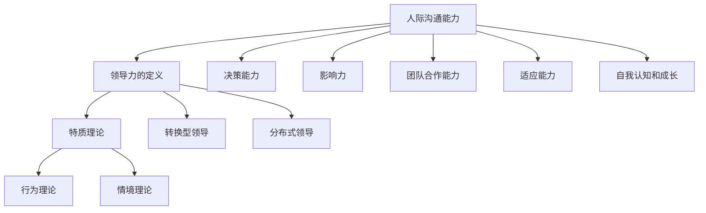

                 

### 文章标题

# 领导力的艺术：如何激发团队最大潜能

### 文章关键词

- **领导力**
- **团队管理**
- **团队潜能**
- **激励**
- **沟通技巧**
- **决策能力**
- **领导风格**

### 文章摘要

本文探讨了领导力在激发团队最大潜能中的关键作用。通过介绍领导力的核心概念，分析领导力与团队潜能的关系，提供领导力技能提升方法和实践案例，本文旨在帮助读者理解并掌握如何成为一名高效的领导者，以最大程度地发挥团队的能力。文章还讨论了领导力面临的挑战及其解决方案，并提出了长期领导力发展策略。读者将了解到如何在复杂多变的环境中运用领导力艺术，激发团队潜能，实现组织目标。

## 引言

领导力是组织中至关重要的因素，它不仅影响着团队的整体表现，还决定着组织的成功与否。在快速变化的市场环境和激烈的竞争压力下，领导力的重要性愈发凸显。有效的领导力能够激发团队的潜能，促进创新和合作，提升团队的整体绩效。然而，领导力的培养并非易事，它需要领导者具备深厚的理论基础、丰富的实践经验以及对团队深刻理解。

本文旨在探讨领导力的艺术，特别是如何通过领导力来激发团队的最大潜能。文章首先介绍了领导力的基本定义和重要性，随后详细分析了领导力与团队潜能的关系，并提供了提升领导力的具体方法和实践案例。此外，文章还讨论了领导力面临的主要挑战和解决方案，以及如何制定长期的领导力发展策略。

本文结构如下：

1. **领导力的核心概念**：介绍领导力的定义、基本理论以及领导力的核心要素。
2. **领导力与团队潜能**：分析领导力对团队潜能的影响，并探讨如何评估团队潜能。
3. **领导力技能提升**：提供实用的领导力技能提升方法和技巧。
4. **领导力实践案例**：分享真实的领导力实践案例，提供可操作的指导。
5. **领导力挑战与解决方案**：讨论领导力面临的主要挑战以及解决方案。
6. **领导力发展策略**：提出领导力发展的长期策略和规划。

通过本文的阅读，读者将能够深入理解领导力的本质，掌握提升领导力的方法和技巧，并能够在实际工作中有效地运用领导力，激发团队的最大潜能，实现组织的目标。

## 领导力的核心概念

### 领导力的定义

领导力是一个多维度的概念，它涉及到个人魅力、影响力、决策能力、沟通技巧和团队管理等各个方面。总的来说，领导力可以被定义为一种能力，即通过激励、引导和影响他人，实现共同目标的过程。领导力不仅仅是对个体的领导，更重要的是对集体的领导。它包括对团队的动力激发、方向指引和资源整合。

领导力与管理的区别在于，管理侧重于规章制度和流程，而领导力则侧重于人的因素。有效的领导力能够促进团队的自我管理和自我发展，而管理则更多地依赖于外部的指导和控制。因此，领导力更多地强调激励、愿景和价值观，而管理则更侧重于目标和效率。

### 领导力的基本理论

领导力的发展历程中，许多学者和专家提出了各种领导力模型和理论。以下是几种常见的领导力理论：

1. **特质理论**：特质理论认为，领导者具备某些固有的特质，如自信、决断力、魅力等，这些特质是成功领导的基础。然而，随着对领导力研究的深入，学者们发现领导力并非仅仅是某些个体的特权，而是可以通过培养和训练获得的。

2. **行为理论**：行为理论强调领导者应该如何行动，而不是领导者本身的特质。这种理论认为，领导者的行为模式可以影响团队的表现。例如，领导者的行为可以表现为任务导向或人际导向，不同的行为模式适用于不同的情境。

3. **情境理论**：情境理论认为，领导力并非一成不变，而是需要根据不同的环境和情境进行调整。例如，费德勒模型（Fiedler Model）提出了领导者的权变理论，认为领导者的风格需要根据情境的变化而变化。

4. **转换型领导**：转换型领导理论认为，领导者通过激发和激励团队成员，引导他们超越自我实现共同目标。这种领导风格强调领导者的愿景、价值观和激励能力。

5. **分布式领导**：分布式领导理论强调领导力的分散化，认为领导力不仅仅存在于个体领导者，而是存在于整个团队中。这种理论提倡通过构建一个共享的领导框架，让每个团队成员都能够发挥领导力。

### 领导力的核心要素

领导力的有效性不仅依赖于理论框架，还取决于领导者具备的核心要素。以下是领导力的几个核心要素：

1. **人际沟通能力**：有效的沟通是领导力的基础。领导者需要能够清晰、准确地传达信息，同时也要能够倾听和理解团队成员的想法和需求。

2. **决策能力**：领导者需要具备快速而明智的决策能力，尤其是在面临不确定性和压力时。良好的决策能力有助于团队在面对挑战时保持稳定和自信。

3. **影响力**：领导者需要具备影响力，能够通过自己的言行和价值观来引导和激励团队成员。影响力不仅来自于职位和权力，更重要的是来自于领导者的人格魅力和道德准则。

4. **团队合作能力**：领导者需要能够促进团队的合作和协作，营造一个积极、包容和高效的团队氛围。这需要领导者具备团队合作的精神，并能够有效地协调和解决团队内部的冲突。

5. **适应能力**：在快速变化的环境中，领导者需要具备适应能力，能够灵活应对各种变化和挑战。这种能力包括对新技术的接受、对市场变化的敏感以及对团队成员动态的理解。

6. **自我认知和成长**：领导者需要具备自我认知的能力，了解自己的优点和不足，并不断寻求成长和改进。自我认知有助于领导者更好地理解自己的行为和影响，从而提高领导力水平。

### 核心概念之间的关系架构

为了更好地理解领导力的核心概念，我们可以使用Mermaid流程图来展示这些概念之间的关系：

通过上述流程图，我们可以清晰地看到领导力的核心概念及其之间的关系。这有助于读者更好地理解领导力的本质，并认识到领导力并非单一维度的能力，而是多个要素的综合体现。

综上所述，领导力是一个复杂且多维度的概念，它涉及到多个核心要素，并需要根据不同的情境和团队需求进行灵活调整。理解这些核心概念和关系，是提升领导力水平的第一步。

## 领导力与团队潜能

### 领导力对团队潜能的影响

领导力在团队潜能的激发中扮演着至关重要的角色。有效的领导力能够通过多种途径提升团队的潜能，从而实现更高的绩效和组织目标。

首先，领导力能够塑造团队的愿景和目标。一个有远见的领导者能够为团队提供一个清晰的目标和愿景，这有助于团队成员明确方向，统一行动。这种愿景不仅激发了团队成员的内在动力，还提升了团队的整体凝聚力。

其次，领导力通过激励和鼓舞团队成员，激发其潜力。领导者可以通过积极的沟通和正面的反馈，增强团队成员的自信心和归属感，从而激发他们在工作中的最佳表现。这种激励不仅能够提升个人的绩效，还能够促进团队的合作和协作。

此外，领导力还能够优化团队的沟通和协作机制。一个有效的领导者能够建立开放的沟通渠道，鼓励团队成员分享意见和反馈，从而提高团队的信息透明度和决策效率。这种沟通机制有助于减少误解和冲突，提升团队的整体协作能力。

最后，领导力还能够帮助团队克服困难和挑战。在面对困境时，领导者通过提供支持和资源，帮助团队成员找到解决问题的方法，从而增强团队的韧性和适应能力。

### 领导力与团队绩效的关系

领导力与团队绩效之间的关系是复杂的，但研究表明，有效的领导力显著提升团队绩效。以下是一些关键点：

首先，领导力通过提升团队成员的工作满意度，从而提高绩效。当团队成员感受到领导的关怀和支持时，他们更愿意投入更多的时间和精力在工作上，从而提升整体绩效。

其次，领导力通过提升团队的创新能力，促进绩效的提升。有效的领导者鼓励团队成员进行创新思考，提出新的想法和解决方案，从而推动团队在技术和业务上的进步。

此外，领导力还能够通过优化团队的工作流程和提高效率，提升绩效。领导者可以通过优化资源配置、流程改进和团队协调，减少工作中的浪费和重复，提高工作效率。

### 如何评估团队潜能

评估团队潜能是领导者了解团队状态和制定改进计划的重要步骤。以下是一些评估团队潜能的方法：

1. **绩效评估**：通过定期的绩效评估，领导者可以了解团队成员的工作表现和潜力。这种评估不仅包括对任务完成的评价，还包括对团队成员的工作态度和协作能力的评估。

2. **团队反馈**：定期收集团队成员的反馈是评估团队潜能的有效方法。通过匿名调查、一对一访谈或团队会议等形式，领导者可以了解团队成员的感受和建议，从而发现团队中的潜在问题和改进点。

3. **行为观察**：领导者的日常观察也是评估团队潜能的重要手段。通过观察团队成员的工作行为和工作环境，领导者可以评估团队的合作氛围、沟通效率和团队动力等。

4. **团队建设活动**：通过团队建设活动，如团队游戏、研讨会或模拟项目等，领导者可以观察团队成员的互动和协作情况，评估团队的整体潜力和潜力。

### 团队潜能评估案例分析

以下是一个团队潜能评估的案例分析：

某科技公司的新产品开发团队在项目初期面临诸多挑战，团队成员之间缺乏有效的沟通，项目进度缓慢。为了评估团队的潜能，领导者采取了以下措施：

1. **绩效评估**：通过绩效评估，发现团队成员在项目任务中的完成度不高，且在协作方面存在明显问题。

2. **团队反馈**：通过匿名调查和一对一访谈，了解到团队成员对项目目标的理解不一致，且对彼此的工作方式存在误解。

3. **行为观察**：领导者在日常工作中观察到，团队成员在沟通时存在障碍，且缺乏有效的协调机制。

4. **团队建设活动**：通过组织团队建设活动，如项目模拟和团队研讨会，发现团队成员在互动中的协作能力较弱，但通过积极的沟通和反馈，逐渐改善。

通过上述评估，领导者明确了团队潜能的提升方向，并采取了以下措施：

1. **加强沟通**：通过定期召开团队会议，建立开放的沟通渠道，鼓励团队成员分享想法和意见。

2. **明确目标**：重新定义项目目标，确保团队成员对目标有清晰的理解和共识。

3. **提供培训**：为团队成员提供沟通和协作技巧的培训，提高团队的整体协作能力。

4. **改进流程**：优化项目流程，减少不必要的步骤，提高工作效率。

通过这些措施，团队成员的沟通效率和工作积极性显著提升，项目进度逐步加快，最终成功完成了新产品开发，取得了良好的市场反响。

通过上述案例分析，我们可以看到，有效的团队潜能评估不仅有助于识别问题，还能为团队提供具体的改进方向和策略，从而提升团队的整体表现。

### 小结

领导力在激发团队潜能方面具有不可替代的作用。通过塑造团队愿景、激励团队成员、优化沟通机制和克服困难，领导者能够显著提升团队的绩效和潜能。有效的领导力不仅能够提升个人和团队的工作满意度，还能促进创新和协作，为组织的长远发展奠定基础。评估团队潜能是领导者了解团队状态和制定改进计划的重要步骤，通过多种评估方法，领导者可以识别团队中的问题和潜力，从而有针对性地进行改进。通过本文的分析，读者应能够深入理解领导力与团队潜能的关系，并掌握评估和提升团队潜能的方法。

## 领导力技能提升

### 自我认知与成长

自我认知是提升领导力的重要基础。一个自我认知清晰的领导者能够更好地理解自己的优点和不足，从而针对性地进行改进。以下是几种自我认知的方法：

1. **定期自我反思**：领导者可以通过定期进行自我反思，回顾自己的行为和决策，分析其效果和影响。这种反思有助于领导者发现潜在的问题和改进点。

2. **360度反馈**：通过360度反馈，领导者可以收集来自同事、下属和上级的反馈，了解他们在工作中的表现和影响。这种全面的反馈有助于领导者从多个角度了解自己的行为和风格。

3. **职业发展计划**：制定职业发展计划，设定明确的成长目标，并制定相应的行动计划。这有助于领导者有针对性地提升自己的能力和技能。

4. **参加领导力培训**：参加领导力培训课程，学习最新的领导力理论和实践方法。这些课程通常包括案例研讨、角色扮演和团队活动，有助于领导者将理论知识应用到实际工作中。

5. **阅读和学习**：通过阅读领导力相关的书籍和文章，领导者可以不断积累知识和经验，提升自己的理论水平。此外，与其他领导者进行交流和学习，分享经验和见解，也是提升领导力的重要途径。

### 情绪管理与压力应对

情绪管理和压力应对是领导者面临的另一大挑战。有效的情绪管理和压力应对能力不仅有助于领导者保持良好的心态，还能提升领导效果。以下是几种情绪管理和压力应对的方法：

1. **积极心态**：保持积极的心态是应对压力的关键。领导者可以通过积极思考、自我激励和正面情绪的引导，减轻压力和焦虑。

2. **时间管理**：通过合理的时间管理，领导者可以更好地平衡工作与生活，减少工作压力。这包括制定合理的工作计划、设定优先级和学会拒绝不必要的工作任务。

3. **锻炼和放松**：定期进行体育锻炼和放松活动，如瑜伽、冥想等，有助于减轻压力和焦虑。这些活动有助于提升领导者的身心健康，提高工作效率。

4. **寻求支持**：在面临压力和困难时，领导者可以寻求同事、下属或专业心理咨询师的支持。通过分享自己的困扰和寻求建议，领导者可以更好地应对压力。

5. **情绪调节技巧**：学会情绪调节技巧，如深呼吸、放松训练和正念冥想等，有助于领导者快速缓解情绪，保持冷静和理智。

### 激励与鼓舞团队

激励和鼓舞团队是领导者的重要职责。一个能够激励和鼓舞团队的领导者能够显著提升团队的工作动力和绩效。以下是几种激励和鼓舞团队的方法：

1. **明确目标**：领导者需要明确团队的目标和期望，确保每个成员都理解并认同这些目标。通过设定具体、可衡量和可达成的工作目标，领导者可以激发团队成员的内在动力。

2. **正面反馈**：及时给予团队成员正面的反馈，认可他们的努力和成就。这种反馈不仅能够提升团队成员的自信心和归属感，还能激发他们继续努力的动力。

3. **个性化激励**：根据每个团队成员的不同特点和需求，提供个性化的激励。例如，对技术能力强的成员提供更多的技术挑战，对需要职业发展的成员提供培训和晋升机会。

4. **共享成就**：将团队的成就和进步与团队成员共享，让每个人都感受到自己的贡献和重要性。这种共享成就可以增强团队的凝聚力，提升团队的士气。

5. **激励活动**：定期组织团队活动，如团建活动、竞赛和奖励，提升团队的凝聚力和工作积极性。这些活动不仅可以增强团队成员之间的互动，还能提升团队的整体氛围。

### 团队建设与冲突管理

团队建设和冲突管理是领导力提升的重要方面。一个高效的团队需要良好的团队建设和有效的冲突管理。以下是几种团队建设和冲突管理的方法：

1. **建立共同价值观**：领导者需要与团队成员共同制定团队的价值观和行为准则，确保每个成员都认同并遵循这些价值观。这有助于建立团队的共同目标和愿景，提升团队的凝聚力。

2. **促进沟通**：领导者需要促进团队成员之间的沟通，建立开放的沟通渠道，鼓励成员分享意见和反馈。这有助于减少误解和冲突，提升团队的协作效率。

3. **团队培训**：定期为团队成员提供培训，提升他们的技能和知识。这不仅有助于团队成员的个人成长，还能提升团队的整体能力。

4. **解决冲突**：领导者需要学会有效解决团队内部的冲突。通过倾听、调解和协商，领导者可以帮助团队成员找到解决问题的方法，维护团队的和谐与稳定。

5. **角色明确**：确保每个团队成员都清楚自己的角色和责任，避免工作重叠和责任不清。这有助于提升团队的工作效率，减少冲突的发生。

通过上述方法，领导者可以不断提升自己的领导力技能，建立高效的团队，激发团队的潜能，实现组织的目标。

### 小结

提升领导力技能是每一位领导者的重要任务。通过自我认知与成长、情绪管理与压力应对、激励与鼓舞团队、团队建设与冲突管理，领导者可以不断提升自己的能力，建立高效的团队，激发团队的最大潜能。有效的领导力不仅能够提升团队的绩效，还能促进团队的成长和发展。通过本文的探讨，读者应能够理解并掌握提升领导力技能的方法和策略，从而在实际工作中更好地发挥领导力，实现组织的目标。

## 领导力实践案例

### 案例一：成功领导激发团队潜能

#### 案例背景

某国际知名科技公司的一支研发团队在项目初期遭遇了严重的瓶颈，团队成员间缺乏沟通，项目进度严重滞后。领导层意识到，要突破这一困境，需要一位能够激发团队潜能的新领导者。

#### 领导策略分析

1. **建立愿景和目标**：新领导者上任后，首先与团队成员进行了深入交流，明确了项目的最终目标，并提出了“创新、协作、高效”的团队愿景。这一愿景不仅激发了团队成员的斗志，还统一了团队的方向。

2. **强化沟通机制**：为了改善团队内部的沟通状况，新领导者建立了定期的团队会议和反馈机制。每次会议不仅包括项目进度的汇报，还设有开放提问和意见交流环节，确保每个成员的声音都能被听到。

3. **激励和鼓舞**：新领导者通过一系列激励措施，如设立挑战性目标、提供技术培训和晋升机会，激发了团队成员的工作热情。他特别关注团队成员的成就，并在公司内部进行宣传，让每个成员都能感受到自己的贡献和重要性。

4. **团队建设活动**：新领导者组织了多次团建活动，如团队拓展训练、技术竞赛和团队聚会，增强了团队成员之间的互信和协作。

5. **解决冲突**：在团队建设过程中，新领导者注重解决团队内部的冲突。他通过倾听、调解和协商，帮助团队成员找到解决问题的方法，确保团队的和谐与稳定。

#### 案例结果与启示

经过新领导者的努力，研发团队的项目进度显著提升，成功在规定时间内完成了开发任务，并得到了客户的高度评价。团队成员的工作满意度和凝聚力也显著提高，团队的整体氛围变得更加积极和高效。

这个案例表明，成功的领导不仅需要清晰的愿景和目标，还需要建立有效的沟通机制、激励和鼓舞团队成员，并通过团队建设活动增强团队凝聚力。解决冲突和提供支持也是领导者的重要职责，这些措施有助于激发团队的最大潜能，实现组织的目标。

### 案例二：面对挑战的领导力实践

#### 案例背景

另一家大型跨国公司的市场部门在面临市场竞争压力和内部团队冲突时，业绩持续下滑。公司高层意识到，需要一位能够应对挑战并激发团队潜能的新领导者来扭转局面。

#### 领导策略分析

1. **调整战略方向**：新领导者上任后，首先对市场进行了深入分析，调整了公司的市场战略。他提出了“精准定位、差异化竞争、持续创新”的市场策略，明确了市场部门的努力方向。

2. **建立跨部门合作**：新领导者积极推动跨部门合作，通过与研发、销售等部门紧密合作，确保市场策略能够有效执行。他建立了跨部门的项目协调团队，定期召开会议，共享信息和资源，提升了团队的协作效率。

3. **激励与反馈**：新领导者通过设定短期和长期的激励目标，如奖金和晋升机会，激励市场部门的成员。同时，他建立了定期的绩效评估和反馈机制，及时肯定团队成员的成就，并提供改进建议。

4. **文化建设**：新领导者重视团队文化建设，通过团队价值观的宣导和实践活动，塑造了一个积极向上、团结协作的团队氛围。他鼓励团队成员提出创新想法，并为创新者提供资源和支持。

5. **解决冲突**：在团队内部，新领导者采取了开放沟通和透明决策的方式，积极解决团队冲突。他通过建立冲突解决的流程和机制，帮助团队成员找到解决问题的方法，维护团队的稳定和和谐。

#### 案例结果与启示

在新的领导策略下，市场部门的业绩逐渐回暖，并开始实现持续增长。团队成员的士气和工作积极性显著提升，团队的整体凝聚力也显著增强。

这个案例表明，面对挑战时，领导者需要具备敏锐的市场洞察力、战略调整能力以及团队管理和冲突解决的能力。通过调整战略、建立合作机制、激励团队和解决冲突，领导者可以激发团队的最大潜能，实现组织的长远发展。

### 小结

通过上述两个案例，我们可以看到，成功的领导力实践不仅需要清晰的愿景和目标，还需要建立有效的沟通机制、激励和鼓舞团队，并通过团队建设活动增强团队凝聚力。同时，解决冲突和提供支持也是领导者的重要职责。这些措施有助于激发团队的最大潜能，实现组织的目标。读者可以从中汲取经验，结合自身实际，运用到工作中，提升领导力水平。

### 领导力挑战与解决方案

#### 跨文化领导

在全球化的今天，跨文化领导成为一个重要的挑战。不同的文化背景、价值观和行为模式可能导致团队成员之间的误解和冲突。为了有效应对这一挑战，领导者可以采取以下解决方案：

1. **文化敏感培训**：为团队成员提供文化敏感培训，帮助他们了解不同文化的特点和沟通方式。这种培训可以包括文化差异分析、跨文化沟通技巧和跨文化管理策略。

2. **建立多元文化团队**：通过建立多元文化团队，促进不同文化背景的团队成员之间的交流与合作。多元文化团队不仅能够带来不同的视角和创意，还能增强团队的多样性和包容性。

3. **文化适配策略**：在制定政策和决策时，领导者需要考虑不同文化的特点和需求，采取文化适配策略。例如，在沟通方式上，可以采用更加灵活和开放的方式，尊重不同文化的沟通习惯。

#### 新一代员工的领导

随着新一代员工（如千禧一代和Z世代）进入职场，领导者面临新的挑战。这些新一代员工通常更加注重自我实现、工作与生活的平衡和多样化的发展机会。为了有效领导这一代员工，领导者可以采取以下解决方案：

1. **个性化管理**：新一代员工更加注重个性化管理，领导者需要了解每个员工的需求和期望，提供个性化的职业发展路径和激励措施。

2. **灵活的工作安排**：提供灵活的工作安排，如远程工作、弹性工作时间等，以满足新一代员工对工作与生活平衡的需求。

3. **职业发展支持**：为新一代员工提供职业发展的支持和指导，包括培训机会、晋升路径和职业规划咨询。

#### 组织变革中的领导力

在组织变革过程中，领导者需要应对诸多挑战，如员工的抵触情绪、资源分配的不平衡和变革带来的不确定性。为了有效应对这些挑战，领导者可以采取以下解决方案：

1. **明确变革愿景**：领导者需要明确变革的愿景和目标，确保所有团队成员都理解变革的重要性和必要性。这有助于减少员工的抵触情绪，增强变革的凝聚力。

2. **有效的沟通**：在变革过程中，领导者需要保持开放的沟通渠道，及时传达变革的信息和进展，解答团队成员的疑问和担忧。

3. **提供支持**：领导者需要为团队成员提供支持和资源，帮助他们在变革过程中适应新的环境和要求。这包括提供培训、指导和支持，以减少变革带来的压力。

#### 解决方案与策略

1. **领导力培训与发展**：定期为领导者提供领导力培训和发展机会，提升他们的领导技能和变革管理能力。这有助于领导者更好地应对各种挑战，带领团队实现变革。

2. **创新思维与领导**：鼓励领导者培养创新思维，探索新的领导方法和策略。通过引入创新思维，领导者可以更有效地应对变革和不确定性。

3. **持续改进与学习**：领导者需要保持持续改进和学习的心态，不断更新自己的知识和技能。通过持续学习和反思，领导者可以不断提升自己的领导能力，适应不断变化的环境。

通过上述解决方案和策略，领导者可以更好地应对跨文化领导、新一代员工领导和组织变革中的领导力挑战，带领团队实现持续的发展和成长。

### 小结

跨文化领导、新一代员工的领导以及组织变革中的领导力都是领导者面临的重大挑战。通过文化敏感培训、个性化管理、有效沟通和提供支持，领导者可以应对这些挑战。同时，领导力培训与发展、创新思维和持续改进也是提升领导力的重要策略。通过这些方法和策略，领导者能够更好地引领团队，实现组织的长远发展。

### 领导力发展策略

#### 长期领导力发展规划

要成为一名卓越的领导者，不仅需要具备扎实的理论基础和实际技能，还需要进行长期的规划和持续的学习。以下是构建长期领导力发展规划的几个关键步骤：

1. **自我评估与定位**：首先，领导者需要对自己的领导能力进行全面的自我评估，识别自身的优点和不足。这可以通过自我反思、360度反馈和职业规划咨询等方式实现。通过明确自己的优势和改进方向，领导者可以更有针对性地制定发展计划。

2. **设定发展目标**：基于自我评估的结果，领导者需要设定具体的领导力发展目标。这些目标应包括短期和长期的发展方向，如提升沟通技巧、增强决策能力、培养团队合作精神等。设定明确的目标有助于领导者保持方向，不断进步。

3. **制定行动计划**：为了实现领导力发展目标，领导者需要制定详细的行动计划。这包括参加领导力培训课程、阅读相关书籍、参与行业研讨会和实践活动等。行动计划应具有可操作性和时间节点，以确保目标的逐步实现。

4. **持续学习与反思**：领导力的发展是一个持续的过程，领导者需要保持学习的心态。通过不断学习新知识、新技能，领导者可以不断提升自己的领导力。此外，定期进行反思和总结，分析领导实践中的成功和不足，是提升领导力的关键。

#### 个人领导力发展计划

个人领导力发展计划是实现长期领导力发展规划的具体体现。以下是一个典型的个人领导力发展计划的构建步骤：

1. **明确发展目标**：根据长期领导力发展规划，设定个人领导力发展的具体目标。例如，提升团队管理能力、增强决策能力和改善沟通技巧。

2. **制定具体措施**：为实现每个目标，制定具体的行动措施。例如，报名参加领导力培训课程、阅读相关书籍、寻求导师指导等。

3. **设定时间表**：为每个目标设定实现的时间节点，并安排相应的学习任务和实践活动。时间表应具有灵活性和可调整性，以应对实际工作中的变化和挑战。

4. **定期评估与调整**：定期对领导力发展计划进行评估和调整。通过自我评估和反馈，识别进展和问题，及时调整发展计划，确保目标的实现。

#### 团队领导力建设

团队领导力建设是实现组织目标的关键环节。以下是团队领导力建设的几个关键步骤：

1. **明确团队愿景和目标**：团队领导力建设的第一步是明确团队的愿景和目标。这需要领导者与团队成员共同参与，确保每个成员都理解并认同团队的使命。

2. **培养团队成员的领导力**：领导者需要通过培训、实践和反馈等方式，培养团队成员的领导力。这包括提升团队成员的决策能力、沟通技巧和团队合作精神。

3. **建立团队协作机制**：通过建立开放的沟通渠道、透明的决策流程和协作平台，促进团队成员之间的互动和合作。这有助于提升团队的整体效能和创造力。

4. **提供支持和资源**：领导者需要为团队成员提供必要的支持和资源，帮助他们克服工作中的困难和挑战。这包括提供培训机会、分配合理的任务和资源等。

#### 组织领导力提升

组织领导力提升是确保组织长期成功的重要保障。以下是一些组织领导力提升的策略：

1. **领导力发展计划**：制定组织的领导力发展计划，为各级领导者提供系统性的培训和指导。这包括领导力课程、工作坊和研讨会等。

2. **领导力文化**：建立领导力文化，鼓励领导者以身作则，通过榜样作用影响团队成员。这有助于提升组织的领导力水平。

3. **领导力评估**：建立领导力评估体系，定期评估领导者的绩效和发展潜力。这有助于识别优秀的领导者并进行针对性的培养。

4. **激励机制**：建立激励机制，鼓励领导者不断提升自己的能力和水平。这可以通过晋升、奖金和荣誉等方式实现。

通过个人领导力发展计划、团队领导力建设和组织领导力提升，领导者可以不断提升自己的领导能力，建立高效的团队，实现组织的长期发展。

### 小结

领导力的发展是一个长期且持续的过程。通过自我评估与定位、设定发展目标、制定行动计划和持续学习与反思，领导者可以不断提升自己的领导力水平。同时，个人领导力发展计划、团队领导力建设和组织领导力提升也是实现领导力发展的关键策略。通过这些方法和策略，领导者可以更好地激发团队的潜能，实现组织的长远目标。

### 未来领导力的趋势与展望

#### 数字化时代的领导力

随着科技的飞速发展，数字化已经成为当今时代的重要特征。数字化时代对领导力提出了新的要求，领导者需要具备以下几方面的能力：

1. **技术敏感度**：领导者需要了解和掌握最新的数字化技术，如人工智能、大数据、区块链等，以便更好地理解技术对业务的影响，并在决策中加以应用。

2. **数据驱动决策**：数字化时代，数据成为重要的决策依据。领导者需要具备数据驱动的决策能力，通过分析数据来识别问题和机会，从而制定更有效的战略和决策。

3. **创新思维**：在数字化时代，创新成为企业持续发展的关键。领导者需要鼓励创新思维，推动组织内部进行创新实践，从而保持竞争优势。

#### 新兴领域的领导力挑战

随着新兴领域的快速发展，领导力也面临着新的挑战。以下是几个主要的新兴领域和相应的领导力挑战：

1. **物联网（IoT）**：物联网技术的广泛应用带来了大量的数据和连接，对网络安全、数据隐私和系统稳定性提出了更高的要求。领导者需要关注这些问题，并建立相应的风险管理和安全策略。

2. **可持续发展**：在全球环境问题日益严重的背景下，可持续发展成为企业的重要责任。领导者需要关注环保、社会责任和经济效益的平衡，推动组织的可持续发展战略。

3. **健康科技**：健康科技领域的快速发展带来了新的机遇和挑战。领导者需要关注医疗技术、药物研发和健康管理等方面的创新，推动健康科技的应用和发展。

#### 全球化背景下的领导力

全球化使得企业面临更加复杂多变的国际环境。以下是全球化背景下领导者需要关注的一些问题：

1. **跨文化管理**：全球化带来了多样化的文化背景，领导者需要具备跨文化管理能力，理解和尊重不同文化的价值观和行为模式，促进跨文化团队的有效合作。

2. **全球协作**：全球化要求领导者能够建立全球协作网络，促进不同国家和地区的团队之间的合作。这需要领导者具备跨时区管理和远程协作的技能。

3. **全球战略规划**：领导者需要具备全球视野，制定符合全球市场需求的战略规划。这包括市场分析、资源调配和风险控制等方面。

#### 未来领导力的展望

未来领导力的发展趋势将更加注重数字化、新兴领域和全球化。以下是未来领导力的一些展望：

1. **领导力的个性化**：随着个性化需求的增加，未来领导力将更加注重个性化管理和培养。领导者需要根据每个团队成员的独特需求和潜力，制定个性化的职业发展计划。

2. **领导力的可塑性**：未来领导力将更加灵活和可塑性。领导者需要不断学习新知识、新技能，以适应快速变化的环境和新的挑战。

3. **领导力的可持续性**：未来领导力将更加注重可持续性，包括环境、社会和经济三个方面。领导者需要将可持续发展理念融入企业的战略和文化中，推动企业的可持续发展。

通过了解和适应这些趋势，领导者可以更好地应对未来挑战，提升领导力水平，引领组织实现长期成功。

### 小结

未来领导力将面临数字化、新兴领域和全球化等新的挑战和机遇。领导者需要具备技术敏感度、数据驱动决策能力、创新思维和跨文化管理能力。同时，个性化管理和全球协作将成为未来领导力的重要特征。通过适应这些变化，领导者可以更好地引领组织，实现长期可持续发展。

### 总结

本文系统地探讨了领导力的艺术，从核心概念、提升方法、实践案例、挑战应对到未来发展，全方位阐述了如何激发团队的最大潜能。首先，通过介绍领导力的定义和基本理论，我们理解了领导力在团队管理和绩效提升中的重要性。接着，通过分析领导力与团队潜能的关系，我们认识到领导力在塑造团队愿景、激励团队成员和优化团队协作中的关键作用。

在提升领导力技能的部分，我们探讨了自我认知、情绪管理、激励与鼓舞团队以及团队建设与冲突管理的方法，提供了实用的策略和技巧。通过具体案例，我们看到了成功领导力实践带来的显著成果，同时也了解了如何应对跨文化领导、新一代员工领导和组织变革中的领导力挑战。

最后，我们提出了长期领导力发展策略，包括个人领导力发展计划、团队领导力建设和组织领导力提升，为领导者的持续成长提供了指导。同时，展望了未来领导力在数字化、新兴领域和全球化背景下的发展趋势。

通过本文的探讨，读者应能深入理解领导力的本质，掌握提升领导力的方法和技巧，并能够在实际工作中有效运用领导力，激发团队的最大潜能，实现组织的目标。希望本文能为领导者在激发团队潜能的道路上提供有益的启示和指导。**作者：AI天才研究院/AI Genius Institute & 禅与计算机程序设计艺术 /Zen And The Art of Computer Programming**

