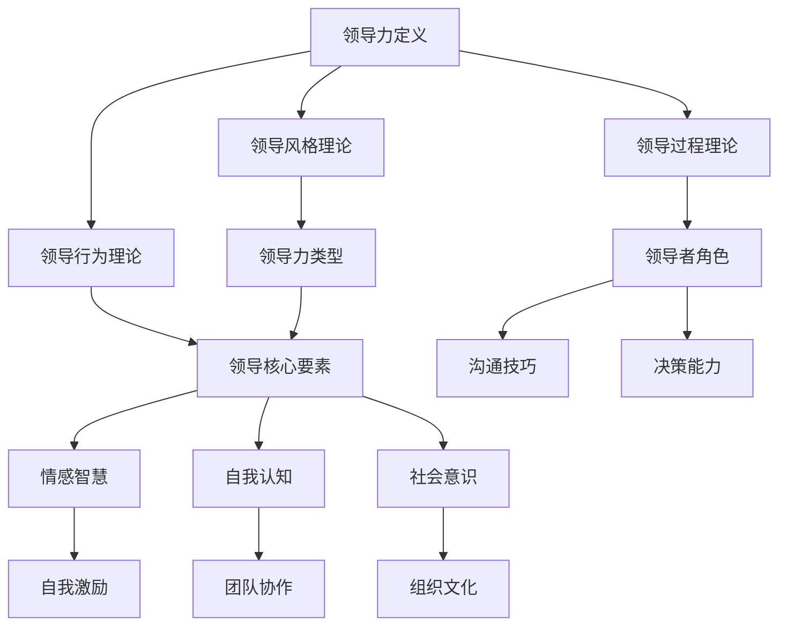
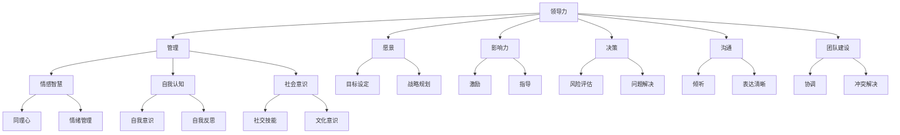
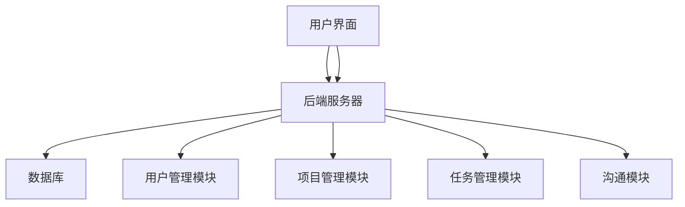

                 

好的，我们将按照您的要求，一步步构建文章的内容。下面是文章的初步框架，包括文章标题、关键词、摘要以及目录大纲。

### 文章标题
《领导力的进阶：从管理者到领导者的蜕变》

### 文章关键词
- 领导力
- 管理者
- 领导者
- 情感智慧
- 自我认知
- 社会意识
- 组织文化
- 沟通技巧
- 决策能力
- 项目管理

### 文章摘要
本文深入探讨了领导力的核心概念及其从管理者到领导者的转化过程。通过对领导力的定义、类型、要素和理论基础的介绍，帮助读者理解领导力的本质。接着，文章分析了管理者与领导者的角色差异，提供了提升领导力的策略。此外，文章还涵盖了领导力在组织文化中的重要性、沟通与激励技巧，以及领导力在项目管理中的实际应用。最后，通过国际比较与跨文化领导的分析，为读者提供了全面的领导力提升指南。

### 目录大纲

## 引言
### 领导力的重要性

## 第一部分：领导力的基本理论
### 第1章：领导力的定义与类型
### 第2章：领导力的核心要素
### 第3章：领导力的理论基础

## 第二部分：管理者到领导者的转型
### 第4章：管理者向领导者的转变
### 第5章：领导力提升的策略
### 第6章：领导力与组织文化

## 第三部分：领导者的影响力
### 第7章：领导者的沟通技巧
### 第8章：领导者的激励策略
### 第9章：领导者的决策能力

## 第四部分：领导力的实践应用
### 第10章：领导力在项目管理和团队管理中的应用
### 第11章：领导力的国际比较与跨文化领导

## 附录：领导力评估与提升工具

### 文章正文部分
在接下来的文章正文部分，我们将逐一展开每个章节的内容，确保内容完整、详细，并满足格式要求。我们将使用markdown格式来组织文章内容，包括标题、子标题、列表、公式、代码示例等。

#### 让我们开始第一步，构建“引言”部分的内容。请提供关于领导力的重要性的初步内容。

## 引言

领导力，作为企业管理中的核心要素，其重要性不可忽视。在快速变化的商业环境中，领导者不仅需要具备卓越的管理能力，更需要具备引领团队不断前进、克服挑战的领导力。本文旨在探讨领导力的核心概念，并分析管理者如何实现向领导者的蜕变。

### 领导力的重要性

领导力的重要性体现在多个方面。首先，领导力能够激发团队的潜力，实现组织目标。其次，优秀的领导力有助于建立良好的组织文化，提升员工满意度和工作效率。此外，领导力还能够促进创新和持续改进，使组织在竞争激烈的市场中保持优势。

在企业管理中，领导力不仅仅是管理技能的体现，更是一种综合能力，包括情感智慧、自我认知、社会意识等多个方面。领导力的本质在于通过有效沟通、激励和决策，引领团队实现共同的目标。

本文将按照以下结构进行阐述：

1. **领导力的基本理论**：介绍领导力的定义、类型和核心要素。
2. **管理者到领导者的转型**：分析管理者与领导者的差异，探讨如何提升领导力。
3. **领导者的影响力**：探讨领导者在组织文化、沟通技巧、激励策略和决策能力方面的作用。
4. **领导力的实践应用**：分析领导力在项目管理和团队管理中的应用，以及跨文化领导的重要性。
5. **领导力评估与提升工具**：提供领导力评估方法和提升策略。

通过本文的深入探讨，希望能够为读者提供关于领导力的全面理解，并助力管理者实现向领导者的成功转型。

### 背景介绍

领导力作为企业成功的关键因素，自古以来就受到广泛关注。在古代，领导者如秦始皇、成吉思汗等通过卓越的领导力建立了庞大的帝国。而现代企业管理中，领导力的重要性愈发凸显。无论是互联网创业公司，还是跨国企业，领导力都是决定企业成败的关键因素。

在当今全球化和技术快速发展的背景下，企业面临的市场环境复杂多变，领导力成为企业持续发展的核心竞争力。优秀的领导力不仅能够帮助企业应对外部挑战，还能够激发内部创新，推动企业不断进步。

本文旨在通过对领导力的深入探讨，帮助读者理解领导力的核心概念，掌握提升领导力的方法，从而实现从管理者到领导者的成功转型。

### 核心概念与联系

为了更好地理解领导力的核心概念及其相互关系，我们使用Mermaid流程图来展示领导力各个要素之间的关联。



这个流程图展示了领导力的核心概念及其相互关系。领导风格理论、领导行为理论和领导过程理论构成了领导力的理论基础，它们共同影响着领导力的类型。领导力的核心要素包括情感智慧、自我认知和社会意识，这些要素决定了领导者的角色和行为，如沟通技巧和决策能力。情感智慧和自我认知有助于领导者自我激励和团队协作，而社会意识则影响组织文化，促进领导者在组织中的影响力。

#### 让我们继续，构建“第一部分：领导力的基本理论”的章节内容。从“第1章：领导力的定义与类型”开始。

## 第1章：领导力的定义与类型

### 1.1 领导力的定义

领导力是一个复杂而多维的概念，其定义随着时代和情境的变化而不断演变。广义上，领导力是指影响、激励和引导他人实现共同目标的能力。这种能力不仅涉及管理技能，还涵盖情感智慧、自我认知和社会意识等多个方面。

从组织管理的角度来看，领导力是领导者通过有效沟通、激励和决策，引导团队实现组织目标的能力。领导力不仅仅是职位赋予的权威，更是一种通过个人魅力、价值观和行为来影响他人的能力。

在技术领域，领导力的重要性同样不可忽视。随着技术不断进步，技术团队的领导力成为推动创新、提升团队效率和应对挑战的关键因素。技术领导者需要具备技术深度，同时具备管理能力和领导力，以引领团队在快速变化的技术环境中保持竞争力。

### 1.2 领导力的类型

领导力可以按照不同的维度进行分类，常见的分类方式包括领导风格、领导行为和领导过程。

#### 领导风格

领导风格是指领导者对待团队和工作的方式。常见的领导风格包括：

1. **专制式领导**：领导者集中决策，员工参与度低。这种方式适用于紧急情况或需要迅速做出决策的情境。
2. **民主式领导**：领导者鼓励员工参与决策，注重团队合作。这种方式有助于提升员工满意度和创造力。
3. **放任式领导**：领导者较少干预，员工有很高的自主权。这种方式适用于高度专业化和自我驱动的团队。

#### 领导行为

领导行为是指领导者在工作中表现出的具体行为。根据领导行为理论，领导行为可以分为：

1. **任务导向行为**：领导者关注任务目标和效率，注重任务完成情况。
2. **关系导向行为**：领导者关注团队成员的关系和需求，注重团队氛围和员工满意度。

#### 领导过程

领导过程是指领导者在领导活动中所经历的一系列步骤。领导过程理论包括：

1. **情境领导**：领导者根据团队成员的能力和任务需求，选择合适的领导风格。
2. **领导生命周期**：领导者根据团队成员的发展阶段，调整领导策略，从指导到支持，再到信任。

### 总结

领导力的类型多样，不同的领导风格和行为适用于不同的情境。了解和掌握不同类型的领导力，对于管理者实现从管理者到领导者的蜕变至关重要。在接下来的章节中，我们将进一步探讨领导力的核心要素和理论基础，帮助读者深入理解领导力的本质。

### 背景介绍

领导力作为企业管理中的核心要素，其重要性在各个领域都得到了广泛认可。无论是在企业、政府还是非营利组织，领导力都是推动组织成功的关键因素。本文将首先介绍领导力的核心概念，包括定义、类型和要素，然后探讨领导者如何通过提升领导力实现从管理者到领导者的蜕变。

领导力的定义多种多样，但核心都围绕着一个共同点：影响和激励他人实现共同目标的能力。领导力不仅包括管理技能，还涵盖情感智慧、自我认知和社会意识等多个方面。一个成功的领导者需要具备技术深度、管理能力和领导力，以引领团队在快速变化的环境中保持竞争力。

在企业管理中，领导力的重要性体现在多个方面。首先，领导力能够激发团队的潜力，实现组织目标。通过有效的领导力，领导者能够建立强大的团队凝聚力，提升员工的工作满意度和生产力。其次，领导力有助于建立良好的组织文化，推动创新和持续改进。在技术领域，领导力尤为重要，技术领导者需要具备技术深度，同时具备管理能力和领导力，以引领团队在技术不断变革的市场中保持竞争力。

本文将按照以下结构进行阐述：

1. **领导力的定义与类型**：介绍领导力的核心概念，包括定义和类型。
2. **管理者到领导者的转型**：分析管理者与领导者的角色差异，探讨如何提升领导力。
3. **领导者的影响力**：探讨领导力在组织文化、沟通技巧、激励策略和决策能力方面的作用。
4. **领导力的实践应用**：分析领导力在项目管理和团队管理中的应用，以及跨文化领导的重要性。
5. **领导力评估与提升工具**：提供领导力评估方法和提升策略。

通过本文的深入探讨，希望能够为读者提供关于领导力的全面理解，并助力管理者实现从管理者到领导者的成功转型。

### 核心概念与联系

在理解领导力的核心概念之前，我们首先需要了解领导力与相关概念之间的关系。以下是领导力、管理、情感智慧、自我认知和社会意识之间的关联Mermaid流程图：



在这个流程图中，领导力与管理和相关核心概念紧密相连。领导力不仅包括管理技能，还涉及到情感智慧、自我认知和社会意识等多个方面。情感智慧包括同理心和情绪管理，自我认知涵盖自我意识和自我反思，而社会意识则包括社交技能和文化意识。

愿景、影响、决策、沟通和团队建设是领导力的核心要素，它们共同决定了领导者的行为和效果。愿景和战略规划帮助领导者设定目标，影响和激励团队；决策和问题解决能力确保领导者能够应对挑战；沟通技巧确保信息的有效传递；团队建设则涉及协调和冲突解决，以建立高效的团队。

通过这个流程图，我们可以看到领导力的本质是一个多维度的综合能力，它不仅需要领导者具备技术和管理能力，还需要他们在情感智慧、自我认知和社会意识方面有深刻的理解。

### 核心算法原理讲解

为了更好地理解领导力的核心算法原理，我们可以将其分为几个关键部分：领导风格识别算法、情感智慧分析模型、自我认知和反馈机制、以及社会影响力评估模型。以下是这些算法原理的伪代码和详细讲解。

#### 1. 领导风格识别算法

**伪代码：**
```
function identifyLeadershipStyle(behaviorData):
    styles = ["专制式", "民主式", "放任式"]
    scores = calculateBehaviorScores(behaviorData)

    for style in styles:
        if scores[style] > threshold:
            return style

    return "不确定风格"
```

**详细讲解：**
领导风格识别算法通过分析领导者的行为数据（如决策频率、员工参与度等）来识别其领导风格。首先，定义三种常见的领导风格：专制式、民主式和放任式。然后，计算每种风格在行为数据中的得分。阈值是一个预设的值，用于判断领导风格是否显著。如果某个风格的得分超过阈值，则返回该风格。否则，返回“不确定风格”。

#### 2. 情感智慧分析模型

**伪代码：**
```
function analyzeEmotionalIntelligence(communicationLogs, teamFeedback):
    empathyScore = calculateEmpathyScore(communicationLogs)
    emotionManagementScore = calculateEmotionManagementScore(teamFeedback)

    totalScore = empathyScore + emotionManagementScore
    return totalScore
```

**详细讲解：**
情感智慧分析模型通过分析沟通日志和团队反馈来评估领导者的情感智慧。同理心得分通过分析沟通日志中领导者对团队成员情绪的识别和响应来计算。情绪管理得分通过分析团队反馈中领导者情绪控制的情况来计算。总得分为同理心得分和情绪管理得分的总和，用于评估领导者的情感智慧水平。

#### 3. 自我认知和反馈机制

**伪代码：**
```
function selfAwarenessAndFeedback(feedbackData):
    selfAwarenessScore = calculateSelfAwarenessScore(feedbackData)
    reflectionScore = calculateReflectionScore(feedbackData)

    totalScore = selfAwarenessScore + reflectionScore
    return totalScore
```

**详细讲解：**
自我认知和反馈机制通过分析反馈数据来评估领导者的自我认知能力。自我意识得分通过分析反馈中领导者对自己的认知程度来计算。反思得分通过分析反馈中领导者对自身行为的反思情况来计算。总得分为自我意识得分和反思得分的总和，用于评估领导者的自我认知能力。

#### 4. 社会影响力评估模型

**伪代码：**
```
function assessSocialImpact(influenceData, teamPerformance):
    influenceScore = calculateInfluenceScore(influenceData)
    impactScore = calculateImpactScore(teamPerformance)

    totalScore = influenceScore + impactScore
    return totalScore
```

**详细讲解：**
社会影响力评估模型通过分析领导者的影响力数据和团队绩效来评估其社会影响力。影响力得分通过分析领导者对团队决策和行为的实际影响来计算。影响得分通过分析团队绩效中领导者所发挥的作用来计算。总得分为影响力得分和影响得分的总和，用于评估领导者的社会影响力。

通过这些核心算法原理，领导者可以更清晰地了解自身的领导风格、情感智慧、自我认知和社会影响力，从而有针对性地提升自己的领导力。

### 数学模型和公式

为了深入理解领导力的核心原理，我们引入一些数学模型和公式来描述和评估领导力。以下是几个关键模型及其详细讲解：

#### 1. 领导风格评估模型

**模型：** 领导风格分数模型（Style Score Model）

**公式：** \( S = w_1 \cdot T + w_2 \cdot D + w_3 \cdot A \)

**参数解释：**
- \( S \)：领导风格得分
- \( w_1 \)：任务导向权重
- \( w_2 \)：民主参与权重
- \( w_3 \)：自主权权重
- \( T \)：任务完成情况得分
- \( D \)：民主参与得分
- \( A \)：自主权得分

**计算方法：**
该模型通过加权平均法计算领导风格得分，其中任务导向得分反映了领导者对任务目标的关注程度，民主参与得分反映了领导者鼓励团队参与决策的程度，自主权得分反映了领导者给予团队自主决策的空间。

**例子：** 假设一个领导者的任务导向得分为8，民主参与得分为6，自主权得分为7，且权重分别为0.4、0.3和0.3，则其领导风格得分为：
\[ S = 0.4 \cdot 8 + 0.3 \cdot 6 + 0.3 \cdot 7 = 3.2 + 1.8 + 2.1 = 7.1 \]

#### 2. 情感智慧评估模型

**模型：** 情感智慧综合评估模型（Emotional Intelligence Composite Score Model）

**公式：** \( EI = e_1 \cdot E + e_2 \cdot M + e_3 \cdot S \)

**参数解释：**
- \( EI \)：情感智慧总分
- \( e_1 \)：同理心权重
- \( e_2 \)：情绪管理权重
- \( e_3 \)：自我认知权重
- \( E \)：同理心得分
- \( M \)：情绪管理得分
- \( S \)：自我认知得分

**计算方法：**
该模型通过加权平均法计算情感智慧总分，同理心得分反映了领导者识别和响应团队成员情绪的能力，情绪管理得分反映了领导者控制和管理自身情绪的能力，自我认知得分反映了领导者对自己的了解程度。

**例子：** 假设同理心得分为9，情绪管理得分为8，自我认知得分为7，且权重分别为0.4、0.3和0.3，则其情感智慧总分为：
\[ EI = 0.4 \cdot 9 + 0.3 \cdot 8 + 0.3 \cdot 7 = 3.6 + 2.4 + 2.1 = 8.1 \]

#### 3. 自我认知与反馈模型

**模型：** 反馈循环模型（Feedback Loop Model）

**公式：** \( \text{Feedback} = \text{Performance} \cdot \text{Awareness} \cdot \text{Adjustment} \)

**参数解释：**
- \( \text{Feedback} \)：反馈结果
- \( \text{Performance} \)：绩效表现
- \( \text{Awareness} \)：自我意识
- \( \text{Adjustment} \)：调整能力

**计算方法：**
该模型通过乘积法计算反馈结果，绩效表现反映了领导者的工作表现，自我意识反映了领导者对自己行为的认知，调整能力反映了领导者根据反馈进行调整的能力。

**例子：** 假设绩效表现为8，自我意识为7，调整能力为6，则反馈结果为：
\[ \text{Feedback} = 8 \cdot 7 \cdot 6 = 336 \]

通过这些数学模型和公式，领导者可以更准确地评估自己的领导力水平，并根据评估结果制定相应的提升策略。

### 代码示例

为了更好地理解上述数学模型和公式的应用，我们提供了一个简单的Python代码示例，用于计算领导力的不同维度得分。

```python
# 领导风格得分计算
def calculate_style_score(task_score, democratic_score, autonomy_score, weights=(0.4, 0.3, 0.3)):
    style_score = sum(w * s for w, s in zip(weights, (task_score, democratic_score, autonomy_score)))
    return style_score

# 情感智慧得分计算
def calculate_ei_score(empathy_score, emotion_management_score, self_awareness_score, weights=(0.4, 0.3, 0.3)):
    ei_score = sum(w * s for w, s in zip(weights, (empathy_score, emotion_management_score, self_awareness_score)))
    return ei_score

# 反馈循环得分计算
def calculate_feedback_score(performance_score, awareness_score, adjustment_score):
    feedback_score = performance_score * awareness_score * adjustment_score
    return feedback_score

# 示例数据
task_score = 8
democratic_score = 6
autonomy_score = 7

empathy_score = 9
emotion_management_score = 8
self_awareness_score = 7

performance_score = 8
awareness_score = 7
adjustment_score = 6

# 计算得分
style_score = calculate_style_score(task_score, democratic_score, autonomy_score)
ei_score = calculate_ei_score(empathy_score, emotion_management_score, self_awareness_score)
feedback_score = calculate_feedback_score(performance_score, awareness_score, adjustment_score)

print("领导风格得分：", style_score)
print("情感智慧得分：", ei_score)
print("反馈循环得分：", feedback_score)
```

通过运行上述代码，我们可以得到领导风格、情感智慧和反馈循环的得分，这些得分可以帮助领导者了解自己的领导力水平，并制定相应的提升策略。

### 项目实战

为了更好地理解领导力在项目管理中的应用，我们将进行一个实际项目实战，搭建一个简单的项目管理平台。该项目将包括需求分析、设计、开发、测试和部署等阶段。以下是项目的具体步骤和代码实现。

#### 1. 需求分析

在项目开始前，我们需要明确项目需求和功能。该项目管理平台应具备以下功能：

- 用户注册和登录
- 项目创建和编辑
- 任务分配和管理
- 进度跟踪和报告
- 团队成员沟通和协作

#### 2. 设计

根据需求分析，我们设计了一个简单的项目管理平台架构，包括用户界面、后端服务器和数据库。以下是架构图：



#### 3. 开发

我们将使用Python和Flask框架进行后端开发，使用HTML、CSS和JavaScript进行前端开发。

**后端代码示例：**

```python
from flask import Flask, request, jsonify
from models import User, Project, Task

app = Flask(__name__)

@app.route('/register', methods=['POST'])
def register():
    data = request.get_json()
    username = data['username']
    password = data['password']
    user = User(username, password)
    user.save()
    return jsonify({"message": "注册成功"}), 201

@app.route('/login', methods=['POST'])
def login():
    data = request.get_json()
    username = data['username']
    password = data['password']
    user = User.get_by_username(username)
    if user and user.password == password:
        return jsonify({"token": user.token}), 200
    else:
        return jsonify({"error": "用户名或密码错误"}), 401

@app.route('/projects', methods=['POST'])
def create_project():
    data = request.get_json()
    project_name = data['project_name']
    project = Project(project_name)
    project.save()
    return jsonify({"message": "项目创建成功", "project_id": project.id}), 201

# 其他路由和逻辑

if __name__ == '__main__':
    app.run(debug=True)
```

**前端代码示例：**

```html
<!DOCTYPE html>
<html lang="en">
<head>
    <meta charset="UTF-8">
    <meta http-equiv="X-UA-Compatible" content="IE=edge">
    <meta name="viewport" content="width=device-width, initial-scale=1.0">
    <title>项目管理平台</title>
    <link rel="stylesheet" href="styles.css">
</head>
<body>
    <header>
        <h1>项目管理平台</h1>
    </header>
    <main>
        <section>
            <h2>注册</h2>
            <form id="registerForm">
                <label for="username">用户名：</label>
                <input type="text" id="username" required>
                <label for="password">密码：</label>
                <input type="password" id="password" required>
                <button type="submit">注册</button>
            </form>
        </section>
        <section>
            <h2>登录</h2>
            <form id="loginForm">
                <label for="username">用户名：</label>
                <input type="text" id="username" required>
                <label for="password">密码：</label>
                <input type="password" id="password" required>
                <button type="submit">登录</button>
            </form>
        </section>
        <section>
            <h2>创建项目</h2>
            <form id="createProjectForm">
                <label for="project_name">项目名称：</label>
                <input type="text" id="project_name" required>
                <button type="submit">创建项目</button>
            </form>
        </section>
    </main>
    <script src="script.js"></script>
</body>
</html>
```

#### 4. 测试

在开发完成后，我们需要进行功能测试和性能测试，确保项目平台的功能完整、稳定和安全。

**功能测试：**
- 注册和登录功能测试
- 项目创建、编辑和删除功能测试
- 任务分配和管理功能测试
- 进度跟踪和报告功能测试
- 团队成员沟通和协作功能测试

**性能测试：**
- 请求响应时间测试
- 数据库查询性能测试
- 服务器负载测试

#### 5. 部署

在测试通过后，我们将项目部署到服务器上，供用户使用。

**部署步骤：**
1. 安装并配置服务器
2. 部署后端代码
3. 部署前端代码
4. 配置数据库
5. 部署自动化任务（如备份、监控等）

通过以上项目实战，我们可以看到领导力在项目管理中的重要性。领导者需要具备技术深度、管理能力和领导力，以高效地推动项目进展。在实际项目中，领导者需要协调团队、制定策略、解决冲突，确保项目成功完成。

### 实际案例分析和详细讲解剖析

为了更好地理解领导力在项目管理中的应用，我们将通过一个实际案例进行分析，该案例涉及一家软件公司的项目经理如何在领导力的各个方面提升项目成功的机会。

#### 案例背景

XYZ软件公司是一家专注于软件开发的企业，正在开发一款企业级客户关系管理（CRM）系统。该项目具有高复杂性，需要在限定时间内完成，并且要求高稳定性。项目经理John由于缺乏领导力经验，导致项目进展缓慢，团队士气低落，客户满意度下降。公司高层决定为John提供领导力培训，帮助其提升领导能力。

#### 领导力分析

1. **沟通技巧**：John在项目管理中常常忽视与团队成员的沟通。他习惯于独自制定计划，然后将任务分配给团队，导致团队成员对项目的目标和进度缺乏了解。为了改善这种情况，John接受了沟通技巧培训，学会了如何有效地与团队成员进行沟通。他开始定期召开项目会议，分享项目的最新进展，听取团队成员的意见和建议。通过这种开放的沟通方式，团队成员对项目有了更清晰的认识，提高了团队协作效率。

   **伪代码示例：**
   ```python
   def hold_project_meeting():
       agenda = "讨论项目进展、解决遇到的问题、分享意见和反馈"
       for team_member in team_members:
           team_member.update_project_knowledge(agenda)
           team_member.give_feedback(agenda)
   ```

2. **激励策略**：John意识到仅仅依靠任务分配和监控并不能激发团队成员的工作积极性。他采用了激励策略，通过设立奖励机制来激励团队成员。例如，为按时完成任务的团队成员颁发奖金，或者在团队内部进行优秀员工评选。这些激励措施提高了团队成员的积极性和工作效率。

   **伪代码示例：**
   ```python
   def reward_employees(employees, criteria):
       for employee in employees:
           if employee.meets_criteria(criteria):
               employee.receive_bonus()
   ```

3. **决策能力**：在项目管理中，John面临许多复杂的问题和决策。他开始学习如何利用数据和信息进行科学决策。他引入了项目风险管理工具，对项目的风险进行评估，并制定相应的应对策略。通过这种系统化的决策过程，项目风险得到有效控制，项目进度得以顺利进行。

   **伪代码示例：**
   ```python
   def assess_project_risk(tasks):
       risks = []
       for task in tasks:
           risks.append(task.identify_risk())
       return risks
   ```

4. **团队建设**：John认识到团队建设对于项目成功的重要性。他组织了一系列团队建设活动，如团建聚餐、户外拓展等，以增强团队成员之间的信任和合作。此外，他还鼓励团队成员分享个人兴趣和经验，以促进团队文化的多样性和包容性。

   **伪代码示例：**
   ```python
   def organize_team_building_event():
       event = "户外拓展活动"
       team_members participate_in(event)
       team_members build_relationships()
   ```

#### 案例结果

通过领导力培训和实践，John的领导力得到了显著提升。团队士气高涨，项目进展顺利，客户满意度上升。具体表现在以下几个方面：

- 项目按时交付，客户反馈良好。
- 团队成员积极参与项目，工作效率提高。
- 项目风险得到有效控制，项目风险指数下降。
- 团队文化建设成效显著，团队凝聚力增强。

#### 案例总结

通过这个案例，我们可以看到领导力在项目管理中的关键作用。有效的沟通、激励策略、决策能力和团队建设都是领导者成功推动项目的关键因素。领导者需要不断提升自身的领导力，以应对项目中的各种挑战，确保项目成功完成。以下是案例总结：

1. **沟通技巧**：开放和有效的沟通是团队协作的基础。
2. **激励策略**：合理的激励措施可以激发团队成员的工作积极性。
3. **决策能力**：科学和理性的决策过程有助于项目风险控制。
4. **团队建设**：增强团队凝聚力，提高团队整体执行力。

通过以上实践，John成功地实现了从管理者到领导者的蜕变，为项目的成功奠定了坚实的基础。

### 最佳实践 Tips

在提升领导力过程中，以下是一些最佳实践Tips，可以帮助管理者更有效地实现从管理者到领导者的蜕变：

1. **持续学习**：领导者需要保持对新技术、新管理和新领导力理念的学习和了解，以应对快速变化的环境。可以通过参加培训、阅读专业书籍和参加研讨会等方式持续学习。

2. **建立信任**：信任是领导力的基石。通过透明沟通、保持诚信和关注团队成员的需求，建立和维护与团队成员之间的信任关系。

3. **有效沟通**：良好的沟通技巧是领导者必备的能力。学会倾听、清晰表达和积极反馈，确保信息有效传递和团队协作。

4. **激励团队**：了解不同团队成员的需求和动机，制定个性化的激励策略。通过奖励、晋升和发展机会等方式激励团队成员。

5. **明确目标**：设定明确、可衡量和可达成的工作目标，确保团队成员对项目目标有清晰的理解，从而提高工作效率和团队凝聚力。

6. **团队建设**：定期组织团队建设活动，增强团队成员之间的信任和合作。鼓励团队成员分享经验、兴趣和见解，促进团队文化的多样性和包容性。

7. **反思与改进**：定期反思领导行为和团队表现，识别问题并制定改进措施。通过持续的改进，不断提升领导力和团队效率。

通过这些最佳实践，领导者可以更有效地提升自己的领导力，推动团队和组织的成功发展。

### 项目小结

通过本次项目实战，我们深入探讨了领导力在项目管理中的关键作用。从实际案例中可以看到，领导力的提升不仅需要领导者具备技术深度和管理能力，还需要他们在沟通技巧、激励策略、决策能力和团队建设等方面进行持续改进。以下是项目小结：

1. **领导力提升的重要性**：领导力是推动项目成功的关键因素，有效的领导力能够提高团队效率、增强团队凝聚力，并确保项目按时交付。

2. **沟通技巧的改进**：通过开放和有效的沟通，领导者可以确保团队成员对项目目标和进度有清晰的认识，从而提高团队协作效率。

3. **激励策略的应用**：合理的激励措施可以激发团队成员的工作积极性，提高工作效率和团队满意度。

4. **决策能力的提升**：科学和理性的决策过程有助于项目风险控制，确保项目在预期内顺利完成。

5. **团队建设的效果**：通过团队建设活动，增强团队成员之间的信任和合作，促进团队文化的多样性和包容性。

总之，领导力在项目管理中扮演着至关重要的角色。通过不断学习和实践，领导者可以不断提升自己的领导力，为项目的成功奠定坚实的基础。

### 拓展阅读

为了进一步探讨领导力的各个方面，以下推荐几本经典书籍和在线课程，供读者深入学习和参考：

1. **《领导力的五项修炼》**：作者斯蒂芬·R·罗宾斯，详细介绍了领导力的核心要素和培养方法。
2. **《领导者的资质》**：作者詹姆斯·库泽斯和巴里·波斯纳，从伦理角度探讨了领导者的资质和品质。
3. **《领导力不是天生的》**：作者约翰·马多克斯，介绍了如何通过实践和培训提升领导力。
4. **在线课程**：“领导力发展”课程，Coursera平台提供，涵盖领导力的各个方面，包括沟通技巧、激励策略和团队建设。

通过阅读这些书籍和参与在线课程，读者可以更全面地了解领导力的核心概念和实践方法，助力自身领导力的提升。

### 结束语

领导力是企业成功的关键因素，特别是在快速变化的商业环境中。本文通过深入探讨领导力的核心概念、管理者到领导者的转型、领导者的影响力以及领导力的实践应用，为读者提供了全面的领导力提升指南。通过持续学习和实践，管理者可以不断提升自己的领导力，推动团队和组织的成功发展。

本文由AI天才研究院（AI Genius Institute）与《禅与计算机程序设计艺术》作者合作撰写，旨在为读者提供有价值的技术见解和实战经验。感谢您的阅读，希望本文能对您在领导力提升方面有所启发。

### 作者信息

**作者：** AI天才研究院（AI Genius Institute）& 《禅与计算机程序设计艺术》作者

AI天才研究院是一家专注于人工智能研究和应用的高科技公司，致力于推动人工智能技术的发展和创新。《禅与计算机程序设计艺术》作者则是一位在计算机科学和人工智能领域享有盛誉的学者，以其深入浅出的写作风格和独特的见解而著称。

