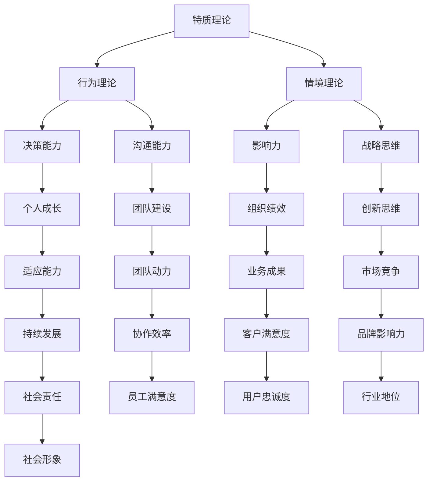

                 

### 1. 引言

**领导力训练营：168天从新手到专家**

**目的**

本书旨在帮助那些希望在短时间内提升领导能力的新手，通过168天的系统训练，逐步成长为具备实战能力的专家。我们相信，领导力并非遥不可及，而是可以通过科学的方法和持续的努力来培养和提升的。

**背景介绍**

在快速变化的商业环境中，领导者不仅需要具备管理团队的能力，还需要具备适应变化、创新思维和战略规划等高级技能。然而，许多新手领导者可能由于缺乏系统的培训和指导，难以在短时间内提升自己的领导能力。因此，本书应运而生，希望通过系统的训练和实战案例，帮助读者快速掌握领导力核心技能。

**核心概念与联系**

领导力的核心概念包括但不限于：影响力、团队建设、战略思维、沟通能力和个人成长。这些概念之间紧密相连，共同构成了领导力的全貌。例如，影响力是领导力的基础，而团队建设和沟通能力则是影响力的具体体现。战略思维和个人成长则帮助领导者保持持续的学习和适应能力，从而在动态环境中保持领先地位。

**文章标题：** 领导力训练营：168天从新手到专家

**关键词：** 领导力、训练、专家、新手、168天、个人成长、团队建设、战略思维、沟通能力

**摘要：**

本文将带领读者进入一个为期168天的领导力训练营，通过系统化的学习和实践，帮助新手领导者从基础理论开始，逐步提升个人能力，掌握团队建设和战略思维等核心技能，最终成为具备实战经验的专家。文章结构分为七个部分：引言、领导力基础、个人成长、团队建设、战略思维、实战应用和总结与反思，确保读者能够全面、深入地理解领导力，并将其应用于实际工作中。

### 2. 领导力基础

**2.1 领导力的定义与重要性**

**概念解析：**

领导力是指影响和激励他人，共同实现目标的能力。它不仅仅是管理团队，更是一种影响力。领导力涵盖了多个方面，包括但不限于决策能力、沟通能力、影响力、战略思维等。

**重要性：**

领导力在个人和组织的成功中起着至关重要的作用。具备优秀领导力的人能够在困难面前保持冷静，激励团队克服挑战，推动组织实现目标。

**理论框架：**

领导力的发展可以基于多种理论框架，如特质理论、行为理论、情境理论等。特质理论认为领导力是由一系列天生的特质决定的；行为理论则认为领导力是通过行为表现出来的结果；情境理论则强调领导力取决于具体的环境和情境。

**核心原理架构 Mermaid 流程图：**

**2.2 领导力的核心概念**

**领导者与追随者**

领导者是团队的领袖，他们具有决策能力、沟通能力和影响力，能够激励团队成员共同实现目标。追随者则是领导者影响的对象，他们需要信任并支持领导者，共同为组织目标努力。

**领导风格**

领导风格是指领导者处理团队事务和与团队成员互动的方式。常见的领导风格包括专制型、民主型和放任型。每种风格都有其适用的场景和优缺点。

**领导与管理的区别**

领导强调愿景、影响和激励，而管理关注组织、规划和控制。领导和管理都是组织成功的关键，但侧重点不同。

### 3. 个人成长

**3.1 自我认知**

**重要性：**

自我认知是领导力发展的基础。了解自己的优点和不足，有助于领导者更好地发挥领导作用，提升个人能力和团队绩效。

**方法：**

- **心理测试**：如MBTI、DISC等，帮助领导者了解自己的性格特征和优缺点。
- **反思日志**：记录自己的行为和感受，进行自我反思。
- **反馈**：从同事、下属和导师那里获取反馈，了解他人的看法。

**策略：**

- **阅读**：阅读相关书籍，扩展知识面。
- **学习**：参加培训课程，提升技能。
- **实践**：通过实际工作，锻炼领导能力。

**3.2 情绪管理**

**重要性：**

情绪管理是领导者必备的能力，它有助于领导者保持冷静，处理压力和冲突，提升团队士气和效率。

**方法：**

- **情绪识别**：了解自己的情绪，并识别他人的情绪。
- **情绪调节**：通过深呼吸、冥想等方式调节情绪。
- **情绪表达**：以适当的方式表达情绪，避免负面情绪的传递。

**策略：**

- **练习**：通过角色扮演、情境模拟等练习提升情绪管理能力。
- **学习**：学习心理学、情绪管理等知识。
- **咨询**：寻求专业咨询师的帮助。

**3.3 沟通能力**

**重要性：**

良好的沟通能力是领导者成功的关键之一，它能够帮助领导者有效地传达信息，建立信任，解决冲突。

**要素：**

- **倾听**：倾听他人的意见和需求。
- **表达**：清晰、准确地表达自己的想法和意图。

**策略：**

- **提升倾听能力**：主动倾听，避免打断他人发言。
- **提高表达技巧**：练习清晰、逻辑性地表达，注重用词和语气。

### 4. 团队建设

**4.1 团队领导**

**重要性：**

团队领导是领导力的重要组成部分，一个成功的团队领导能够激发团队成员的潜力，提高团队绩效。

**方法：**

- **明确目标**：为团队设定清晰的目标和期望。
- **激励团队**：通过激励措施，如奖励、认可等，激发团队成员的积极性。
- **培养团队文化**：建立积极、互助的团队文化，促进团队成员之间的合作。

**4.2 团队动力**

**重要性：**

团队动力是团队绩效的驱动力，它决定了团队成员之间的合作和协调程度。

**方法：**

- **建立信任**：通过沟通和合作，建立团队成员之间的信任。
- **促进沟通**：鼓励团队成员之间开放、坦诚地交流。
- **解决冲突**：及时解决团队内部的冲突，避免影响团队绩效。

**4.3 冲突管理**

**重要性：**

冲突管理是团队建设的关键环节，有效的冲突管理能够促进团队和谐，提高团队绩效。

**方法：**

- **预防冲突**：通过建立明确的规则和沟通机制，预防潜在冲突。
- **识别冲突**：及时识别和诊断团队中的冲突。
- **解决冲突**：通过对话、妥协、调解等方式解决冲突。

### 5. 战略思维

**5.1 决策制定**

**重要性：**

决策制定是领导力的核心能力之一，它决定了组织的发展方向和成败。

**方法：**

- **明确问题**：准确识别和定义问题。
- **收集信息**：收集与问题相关的信息，进行分析。
- **制定方案**：根据分析结果，制定多个可能的解决方案。
- **评估方案**：评估每个方案的优缺点，选择最佳方案。
- **执行决策**：制定详细的执行计划，确保决策得到有效实施。

**5.2 创新思维**

**重要性：**

创新思维是领导者在竞争激烈的市场环境中保持领先地位的关键。

**方法：**

- **培养好奇心**：保持好奇心，不断探索新的想法和解决方案。
- **跨学科学习**：学习不同领域的知识，促进创新思维的培养。
- **鼓励创新**：为团队成员创造一个鼓励创新的环境，提供必要的资源和支持。

**5.3 企业文化建设**

**重要性：**

企业文化是组织的灵魂，它决定了组织的价值观、行为准则和员工的工作态度。

**方法：**

- **确立价值观**：明确组织的核心价值观，并将其融入到日常工作中。
- **传播企业文化**：通过培训、会议等方式，传播企业文化，确保员工理解和认同。
- **实践企业文化**：通过实际行动，践行企业文化，建立良好的组织氛围。

### 6. 实战应用

**6.1 实际案例**

**重要性：**

实际案例是检验领导力理论的最佳方式。通过分析实际案例，读者可以更深入地理解领导力理论，并将其应用于实际工作中。

**方法：**

- **案例研究**：深入分析实际案例，了解案例背景、问题、解决方案和结果。
- **经验分享**：分享自己的领导经验，从案例中学习并吸取教训。

**6.2 场景应用**

**重要性：**

场景应用是将领导力理论应用到实际工作中的关键。通过实际应用，读者可以更好地掌握领导力技能，提升个人领导能力。

**方法：**

- **模拟训练**：通过模拟训练，提高应对实际场景的能力。
- **实践演练**：在实际工作中，运用所学理论，提升领导能力。

### 7. 总结与反思

**7.1 全书回顾**

**重要性：**

全书回顾有助于读者系统地梳理领导力知识，加深对领导力理论的理解。

**方法：**

- **回顾每个章节**：回顾每个章节的核心概念和要点。
- **总结收获**：总结自己在学习过程中得到的收获和感悟。

**7.2 个人反思**

**重要性：**

个人反思是领导力提升的关键环节。通过反思，读者可以了解自己的优势和不足，制定改进计划。

**方法：**

- **自我评估**：评估自己在领导力各方面的能力和表现。
- **制定改进计划**：根据自我评估结果，制定具体的改进计划。

**7.3 长期规划**

**重要性：**

长期规划有助于读者明确自己的领导力发展路径，持续提升个人领导能力。

**方法：**

- **设定长期目标**：明确自己在领导力方面的长期目标。
- **制定实施计划**：制定详细的实施计划，确保目标的实现。

### 作者信息

**作者：** AI天才研究院/AI Genius Institute & 禅与计算机程序设计艺术 /Zen And The Art of Computer Programming

**结语：**

领导力训练营：168天从新手到专家，不仅是一本书，更是一种自我提升的旅程。通过系统的学习和实践，读者将逐步提升自己的领导能力，成为具备实战经验的专家。让我们一起踏上这段旅程，共同成长。

