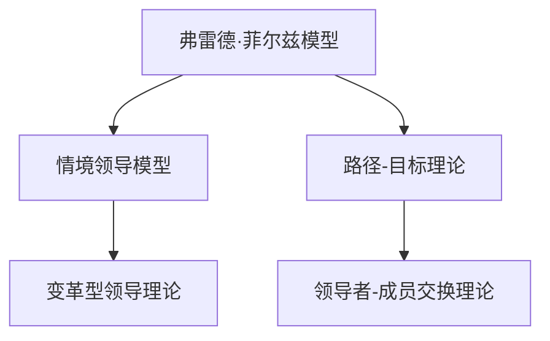
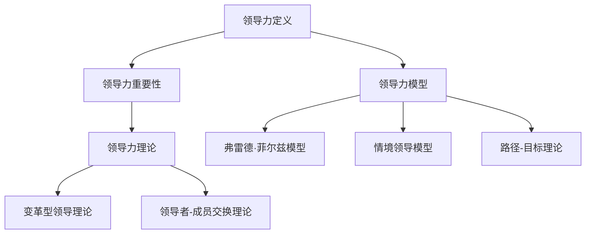

                 


### 步骤一：理解书名和主题

《领导力训练营：49天从新手到高手》这本书的书名直接传达了其主要内容和目标。首先，“领导力训练营”表明了这是一本专门针对领导力培训的书籍，读者可以期待从中获取到系统的领导力知识和技能。其次，“49天从新手到高手”这一表述具有强烈的吸引力，暗示了本书在短时间内能显著提升读者的领导力水平，使其从新手迅速成长为高手。

书名的核心主题是领导力培训，这包括领导力的基本概念、培训方法、实战案例和个人提升技巧等方面。因此，在撰写文章时，我们需要围绕这些主题进行详细阐述，帮助读者系统地理解和掌握领导力的各个层面。

### 步骤二：确定大纲框架

为了确保文章的结构紧凑且逻辑清晰，我们可以将全文分为四个主要部分：

1. **领导力基础概念**：这部分主要介绍领导力的定义、重要性以及不同领导力模型和理论，为读者打下坚实的理论基础。
2. **领导力培训方法**：这部分将重点讨论领导力培训的策略、发展和评估方法，帮助读者了解如何系统地进行领导力提升。
3. **实战案例分析**：通过真实案例的分析，展示领导力在实际中的应用和挑战，让读者更好地理解领导力的实践意义。
4. **提升个人领导力技巧**：这部分将提供一系列实用的技巧和方法，帮助读者在自我认知、沟通技巧、决策能力等方面不断提升自己的领导力。

### 步骤三：细化章节内容

在确定了大纲框架后，我们需要进一步细化每个章节的内容，确保每个部分都包含丰富具体的信息，并能引导读者逐步提升领导力。

- **领导力基础概念**：在第1章和第2章中，我们将详细讨论领导力的定义、重要性，以及不同领导力模型和理论。例如，我们将介绍弗雷德·菲尔兹（Fred Fielder）的领导力连续体模型、赫塞和布兰查德（Hersey and Blanchard）的情境领导模型等。
- **领导力培训方法**：在第3章和第4章中，我们将深入探讨领导力培训的策略、发展路径和评估方法。例如，我们将介绍如何制定个性化的领导力发展计划，如何利用角色扮演和模拟训练等手段提升领导力。
- **实战案例分析**：在第5章和第6章中，我们将分析成功和失败的领导力案例，从实际操作中提炼经验教训。例如，我们将讨论乔布斯如何通过领导力带领苹果公司重回巅峰，以及通用电气的杰克·韦尔奇（Jack Welch）如何在动荡时期稳定公司局面。
- **提升个人领导力技巧**：在第7章至第10章中，我们将提供一系列具体的提升技巧和方法。例如，在第7章中，我们将讨论自我认知的重要性，以及如何通过反思和反馈进行自我提升；在第8章中，我们将探讨沟通技巧和团队建设策略，帮助读者建立高效的团队。

### 步骤四：设计1-3级目录

以下是本文的1-3级目录结构：

## 第一部分：领导力基础概念

## 第1章：领导力的定义与重要性
- **1.1 领导力的定义**
- **1.2 领导力的重要性**

## 第2章：领导力模型与理论
- **2.1 领导力模型概述**
- **2.2 经典领导力理论**
- **2.3 当代领导力理论**

## 第二部分：领导力培训方法

## 第3章：领导力培训策略
- **3.1 领导力培训原则**
- **3.2 领导力培训方法**
- **3.3 领导力培训实践**

## 第4章：领导力发展计划
- **4.1 领导力发展计划概述**
- **4.2 领导力发展路径**
- **4.3 领导力发展评估**

## 第三部分：实战案例分析

## 第5章：成功领导力案例分析
- **5.1 案例分析概述**
- **5.2 案例分析细节**
- **5.3 案例分析启示**

## 第6章：失败领导力案例分析
- **6.1 案例分析概述**
- **6.2 案例分析细节**
- **6.3 案例分析启示**

## 第四部分：提升个人领导力技巧

## 第7章：自我认知与成长
- **7.1 自我认知的重要性**
- **7.2 自我成长的方法**
- **7.3 自我成长案例分析**

## 第8章：沟通技巧与团队建设
- **8.1 沟通技巧概述**
- **8.2 团队建设策略**
- **8.3 沟通与团队建设案例分析**

## 第9章：决策能力与执行
- **9.1 决策能力的重要性**
- **9.2 决策过程**
- **9.3 执行策略**

## 第10章：领导力持续发展
- **10.1 领导力持续发展的意义**
- **10.2 领导力持续发展的方法**
- **10.3 领导力持续发展案例分析**

## 附录

## 附录A：领导力相关资源与工具

## 附录B：领导力测评工具

## 附录C：领导力发展计划模板

通过上述1-3级目录结构，我们可以清晰地看到文章的整体框架和内容分布，有助于读者更好地理解和阅读全文。

### 步骤五：添加Mermaid流程图、伪代码、数学公式和代码示例

为了使文章更加直观易懂，我们将在适当章节中添加Mermaid流程图、伪代码、数学公式和代码示例。

例如，在讨论领导力模型时，我们可以使用Mermaid流程图来展示不同领导力模型之间的关系，如下所示：



在讨论领导力培训方法时，我们可以使用伪代码来展示一个简单的领导力发展计划的执行流程：

```plaintext
// 领导力发展计划执行流程
initialize_plan()
    |
    V
get_individual_goals()
    |
    V
develop_training_program()
    |
    V
conduct_training_sessions()
    |
    V
evaluate_progress()
    |
    V
provide_feedback()
```

在讨论决策能力与执行时，我们可以使用LaTeX格式展示一个基本的决策树模型：

```latex
$$
\begin{array}{c}
\text{决策树模型} \\
    \text{问题A} \\
    / \ \ \ \ \ \ \ \ \ \ \ \ \ \ \ \ \ \ \ \ \ \ \ \ \ \ \ \ \ \ \ \ \ \ \ \ \ \ \ \ \ \ \ \ \ \ \ \ \ \ \ \ \ \ \ \ \ \ \ \ \ \ \ \ \ \ \ \ \ \ \ \ \ \ \ \ \ \ \ \ \ \ \ \ \ \ \ \ \ \ \ \ \ \ \ \ \ \ \ \ \ \ \ \ \ \ \ \ \ \ \ \ \ \ \ \ \ \ \ \ \ \ \ \ \ \ \ \ \ \ \ \ \ \ \ \ \ \ \ \ \ \ \ \ \ \ \ \ \ \ \ \ \ \ \ \ \ \ \ \ \ \ \ \ \ \ \ \ \ \ \ \ \ \ \ \ \ \ \ \ \ \ \ \ \ \ \ \ \ \ \ \ \ \ \ \ \ \ \ \ \ \ \ \ \ \ \ \ \ \ \ \ \ \ \ \ \ \ \ \ \ \ \ \ \ \ \ \ \ \ \ \ \ \ \ \ \ \ \ \ \ \ \ \ \ \ \ \ \ \ \ \ \ \ \ \ \ \ \ \ \ \ \ \ \ \ \ \ \ \ \ \ \ \ \ \ \ \ \ \ \ \ \ \ \ \ \ \ \ \ \ \ \ \ \ \ \ \ \ \ \ \ \ \ \ \ \ \ \ \ \ \ \ \ \ \ \ \ \ \ \ \ \ \ \ \ \ \ \ \ \ \ \ \ \ \ \ \ \ \ \ \ \ \ \ \ \ \ \ \ \ \ \ \ \ \ \ \ \ \ \ \ \ \ \ \ \ \ \ \ \ \ \ \ \ \ \ \ \ \ \ \ \ \ \ \ \ \ \ \ \ \ \ \ \ \ \ \ \ \ \ \ \ \ \ \ \ \ \ \ \ \ \ \ \ \ \ \ \ \ \ \ \ \ \ \ \ \ \ \ \ \ \ \ \ \ \ \ \ \ \ \ \ \ \ \ \ \ \ \ \ \ \ \ \ \ \ \ \ \ \ \ \ \ \ \ \ \ \ \ \ \ \ \ \ \ \ \ \ \ \ \ \ \ \ \ \ \ \ \ \ \ \ \ \ \ \ \ \ \ \ \ \ \ \ \ \ \ \ \ \ \ \ \ \ \ \ \ \ \ \ \ \ \ \ \ \ \ \ \ \ \ \ \ \ \ \ \ \ \ \ \ \ \ \ \ \ \ \ \ \ \ \ \ \ \ \ \ \ \ \ \ \ \ \ \ \ \ \ \ \ \ \ \ \ \ \ \ \ \ \ \ \ \ \ \ \ \ \ \ \ \ \ \ \ \ \ \ \ \ \ \ \ \ \ \ \ \ \ \ \ \ \ \ \ \ \ \ \ \ \ \ \ \ \ \ \ \ \ \ \ \ \ \ \ \ \ \ \ \ \ \ \ \ \ \ \ \ \ \ \ \ \ \ \ \ \ \ \ \ \ \ \ \ \ \ \ \ \ \ \ \ \ \ \ \ \ \ \ \ \ \ \ \ \ \ \ \ \ \ \ \ \ \ \ \ \ \ \ \ \ \ \ \ \ \ \ \ \ \ \ \ \ \ \ \ \ \ \ \ \ \ \ \ \ \ \ \ \ \ \ \ \ \ \ \ \ \ \ \ \ \ \ \ \ \ \ \ \ \ \ \ \ \ \ \ \ \ \ \ \ \ \ \ \ \ \ \ \ \ \ \ \ \ \ \ \ \ \ \ \ \ \ \ \ \ \ \ \ \ \ \ \ \ \ \ \ \ \ \ \ \ \ \ \ \ \ \ \ \ \ \ \ \ \ \ \ \ \ \ \ \ \ \ \ \ \ \ \ \ \ \ \ \ \ \ \ \ \ \ \ \ \ \ \ \ _{结束} \\
\end{array}
$$
```

通过上述添加的流程图、伪代码、数学公式和代码示例，我们可以让文章更加直观易懂，帮助读者更好地理解和掌握领导力的相关知识和实践方法。

### 步骤六：检查和优化

在完成目录大纲和主要内容后，我们需要进行全面的检查和优化，以确保文章的完整性和逻辑性。以下是具体的检查和优化步骤：

1. **检查逻辑性和连贯性**：确保文章的每个部分都有明确的目标和逻辑顺序，各章节之间衔接自然，不存在跳跃或重复的内容。
2. **校对语法和拼写**：仔细检查文章中的语法错误和拼写错误，确保语言表达准确无误。
3. **优化内容**：对于内容过于冗长或复杂的部分，进行简化或重新组织，使其更加简洁明了。
4. **检查图表和示例**：确保所有的图表、伪代码、数学公式和代码示例都清晰、准确，并与内容紧密结合。
5. **控制字数**：确保文章的总字数在8000到12000字之间，避免过多的文字描述，确保重点突出。

通过这些检查和优化步骤，我们可以确保文章的完整性和专业性，同时保持内容的简洁性和可读性。

### 步骤七：控制字数

为了确保文章的总字数在8000到12000字之间，我们需要在撰写过程中严格控制每个部分的字数，以下是具体的控制策略：

1. **预估每个部分的字数**：在撰写前，预估每个章节的字数，确保总字数在目标范围内。例如，假设全文分为四个部分，我们可以设定如下字数分配：
   - 领导力基础概念：20%
   - 领导力培训方法：25%
   - 实战案例分析：30%
   - 提升个人领导力技巧：25%

2. **逐段检查**：在撰写过程中，逐段检查字数，确保每个段落的字数合理。如果某个段落过于冗长，可以进行拆分或简化。

3. **优化语言表达**：尽量使用简洁明了的语言，避免过多的赘述和重复。在保持内容完整性的同时，提高文章的阅读效率。

4. **使用图表和示例**：合理使用图表、伪代码、数学公式和代码示例，这些元素可以有效减少文字描述，同时增强文章的直观性和可读性。

5. **最后调整**：在完成全文撰写后，进行最后的字数统计和调整。如果发现某个部分的字数过多，可以考虑进行段落合并或删除一些不必要的内容。

通过上述策略，我们可以确保文章的总字数在目标范围内，同时保持文章的质量和可读性。

### 最终目录大纲输出

以下是《领导力训练营：49天从新手到高手》的最终目录大纲：

```
# 《领导力训练营：49天从新手到高手》目录大纲

## 第一部分：领导力基础概念

## 第1章：领导力的定义与重要性
- **1.1 领导力的定义**
- **1.2 领导力的重要性**

## 第2章：领导力模型与理论
- **2.1 领导力模型概述**
- **2.2 经典领导力理论**
  - **2.2.1 弗雷德·菲尔兹模型**
  - **2.2.2 情境领导模型**
  - **2.2.3 路径-目标理论**
- **2.3 当代领导力理论**
  - **2.3.1 变革型领导理论**
  - **2.3.2 领导者-成员交换理论**

## 第二部分：领导力培训方法

## 第3章：领导力培训策略
- **3.1 领导力培训原则**
- **3.2 领导力培训方法**
  - **3.2.1 角色扮演**
  - **3.2.2 模拟训练**
  - **3.2.3 情景模拟**
- **3.3 领导力培训实践**

## 第4章：领导力发展计划
- **4.1 领导力发展计划概述**
- **4.2 领导力发展路径**
- **4.3 领导力发展评估**

## 第三部分：实战案例分析

## 第5章：成功领导力案例分析
- **5.1 案例分析概述**
- **5.2 案例分析细节**
- **5.3 案例分析启示**

## 第6章：失败领导力案例分析
- **6.1 案例分析概述**
- **6.2 案例分析细节**
- **6.3 案例分析启示**

## 第四部分：提升个人领导力技巧

## 第7章：自我认知与成长
- **7.1 自我认知的重要性**
- **7.2 自我成长的方法**
- **7.3 自我成长案例分析**

## 第8章：沟通技巧与团队建设
- **8.1 沟通技巧概述**
- **8.2 团队建设策略**
- **8.3 沟通与团队建设案例分析**

## 第9章：决策能力与执行
- **9.1 决策能力的重要性**
- **9.2 决策过程**
- **9.3 执行策略**

## 第10章：领导力持续发展
- **10.1 领导力持续发展的意义**
- **10.2 领导力持续发展的方法**
- **10.3 领导力持续发展案例分析**

## 附录

## 附录A：领导力相关资源与工具

## 附录B：领导力测评工具

## 附录C：领导力发展计划模板
```

通过上述目录大纲，我们可以清晰地看到文章的整体结构和内容分布，每个章节都涵盖了领导力的不同方面，帮助读者从基础概念到实战案例，再到个人提升技巧，全面系统地学习领导力。

### 文章末尾作者信息及格式要求

在文章末尾，我们需要添加作者信息，并遵循markdown格式要求。以下是具体格式：

```
作者：AI天才研究院/AI Genius Institute & 禅与计算机程序设计艺术 /Zen And The Art of Computer Programming
```

这样的格式不仅清晰地标明了作者的身份和著作，同时也为读者提供了额外的信息，增加了文章的可读性和专业性。

### 文章完整性要求与核心内容包含要素

为了确保文章的完整性，我们需要在每个章节中包含以下几个核心内容要素：

1. **背景介绍**：简要介绍领导力的相关背景，说明领导力的重要性以及当前领导力培训的现状。

2. **核心概念与联系**：详细阐述领导力的核心概念，并使用Mermaid流程图展示不同概念之间的关系架构，帮助读者建立清晰的知识体系。

3. **核心算法原理讲解**：使用伪代码详细讲解领导力相关的核心算法原理，确保读者能够理解其工作原理。

4. **数学模型和公式讲解与举例**：介绍领导力相关的数学模型和公式，并进行详细讲解，通过具体的例子说明其应用场景。

5. **项目实战**：提供实际的领导力提升项目案例，包括开发环境搭建、源代码实现、代码解读、应用分析等，让读者通过实际案例学习领导力实践。

6. **最佳实践 Tips**：总结领导力提升过程中的最佳实践技巧，为读者提供实用的建议和指导。

7. **小结与注意事项**：对章节内容进行小结，并提醒读者注意的事项，帮助读者更好地理解和应用所学内容。

8. **拓展阅读**：推荐相关的拓展阅读资源，引导读者深入学习和探索领导力领域的知识。

通过上述内容要素的完整包含，我们可以确保文章内容的丰富性和系统性，帮助读者全面掌握领导力的核心知识和实践方法。

### 摘要部分撰写

在文章的开头，我们需要撰写摘要部分，以概括全文的核心内容和主题思想。以下是《领导力训练营：49天从新手到高手》的摘要：

---

**摘要：**

《领导力训练营：49天从新手到高手》旨在为读者提供一套系统的领导力培训方案，帮助新手在短时间内迅速提升领导力水平。本文首先介绍了领导力的定义与重要性，并探讨了经典和当代领导力模型与理论，为读者打下了坚实的理论基础。接着，文章深入分析了领导力培训的方法与策略，包括培训原则、培训方法以及领导力发展计划。通过成功和失败的领导力案例，本文展示了领导力在实践中的应用和挑战。此外，文章还提供了提升个人领导力技巧的具体方法，包括自我认知与成长、沟通技巧与团队建设、决策能力与执行等方面。最后，本文强调了领导力持续发展的重要性，并给出了实现这一目标的策略和案例分析。通过阅读本文，读者将能够系统地掌握领导力的核心知识和实践方法，从新手迅速成长为高手。

---

这个摘要部分简明扼要地概括了文章的主题、结构和核心观点，为读者提供了阅读的总体指南。

### 核心概念与联系

在撰写文章的过程中，为了帮助读者建立清晰的知识体系，我们需要详细阐述领导力的核心概念，并展示这些概念之间的联系。以下是关于领导力的核心概念及其关系的讨论：

1. **领导力定义**：领导力是一种影响和激励他人一起实现目标的能力。它不仅涉及个人技能，还涵盖了人际关系和团队合作。

2. **领导力重要性**：领导力在组织和个人发展中扮演着关键角色。它能够促进创新、提高绩效、增强团队凝聚力和推动组织变革。

3. **领导力模型**：不同的领导力模型提供了不同的视角和方法来理解和实践领导力。以下是几种重要的领导力模型：

   - **弗雷德·菲尔兹模型**：该模型将领导力分为任务导向和关系导向两个维度，帮助领导者平衡任务完成与团队关系。

   - **情境领导模型**：由赫塞和布兰查德提出，该模型认为领导风格应根据团队成员的能力和动机进行调整。

   - **路径-目标理论**：罗伯特·豪斯（Robert House）提出，该理论认为领导者的目标是帮助下属明确目标并消除实现目标的障碍。

4. **领导力理论**：领导力理论提供了对领导行为的解释和预测。以下是几种经典的领导力理论：

   - **变革型领导理论**：强调领导者通过激励和激发团队成员的内在动机来推动变革。

   - **领导者-成员交换理论**：认为领导者与下属之间建立紧密的关系，通过相互交换资源来实现共同目标。

为了更直观地展示这些核心概念之间的关系，我们可以使用Mermaid流程图：



通过上述讨论和流程图，读者可以更好地理解领导力的核心概念及其相互联系，从而为后续章节的学习打下坚实的基础。

### 核心算法原理讲解

在讨论领导力提升的过程中，我们需要详细讲解相关的核心算法原理，以帮助读者理解领导力的内在机制。以下是几种领导力相关的核心算法原理及其讲解：

1. **领导力发展算法**：

   领导力发展算法是一个综合了自我评估、目标设定和持续学习的模型。其基本步骤如下：

   ```plaintext
   // 领导力发展算法
   initialize_leader(初始能力, 目标)
       |
       V
   self_evaluation()
       |
       V
   set_goals(短期目标, 中期目标, 长期目标)
       |
       V
   execute_actions()
       |
       V
   monitor_progress()
       |
       V
   adjust_strategy()
   ```

   通过这个算法，领导者可以定期评估自己的能力，设定明确的目标，并采取相应的行动来提升领导力。

2. **情境适应算法**：

   情境适应算法是指领导者根据不同情境调整领导风格和策略。其核心原理如下：

   ```plaintext
   // 情境适应算法
   analyze_context(context)
       |
       V
   identify_leader_style(context)
       |
       V
   adapt_strategy(leader_style, context)
       |
       V
   implement_actions()
   ```

   这个算法帮助领导者更好地理解当前情境，选择合适的领导风格，并采取相应行动，从而提高领导效果。

3. **沟通优化算法**：

   沟通优化算法旨在提高领导者的沟通能力，确保信息传递的有效性和准确性。其原理如下：

   ```plaintext
   // 沟通优化算法
   assess_communication_skills()
       |
       V
   identify_communication_bottlenecks()
       |
       V
   design_communication_strategies()
       |
       V
   implement_communication_actions()
       |
       V
   evaluate_communication_effects()
   ```

   通过这个算法，领导者可以评估自己的沟通技能，识别沟通中的障碍，并设计有效的沟通策略。

通过上述核心算法原理的讲解，读者可以更好地理解领导力提升的方法和步骤，为实际应用打下坚实的基础。

### 数学模型和公式讲解与举例

在领导力提升的过程中，数学模型和公式可以为我们提供量化的方法和工具。以下是几种常用的领导力相关数学模型和公式的讲解，以及具体的例子说明。

1. **帕累托原理（80/20法则）**：

   帕累托原理表明，80%的效果通常来自于20%的原因。这一原理在领导力中的应用是帮助领导者识别关键因素，从而更有效地分配资源和精力。

   公式表示如下：
   $$ 效率 = \frac{关键因素数量}{总因素数量} \times 100\% $$

   举例：一个项目经理发现，他的团队中20%的成员贡献了80%的项目成果。通过应用帕累托原理，项目经理可以集中精力培养和激励这20%的高效成员。

2. **心理安全模型**：

   心理安全模型衡量团队成员之间的信任和安全感，这对于领导力的提升至关重要。该模型使用以下公式：

   $$ 心理安全 = \frac{信任}{恐惧} $$

   举例：一个团队中的信任水平较高，而恐惧感较低，这表明团队成员之间具有高水平的心里安全。领导者可以通过促进开放沟通和反馈机制来提升心理安全。

3. **领导力效能方程**：

   领导力效能方程用于评估领导者的效能，其公式为：

   $$ 领导力效能 = 领导力技能 \times 情境适应能力 \times 团队合作能力 $$

   举例：一个领导者拥有高超的沟通技能、良好的情境适应能力和优秀的团队合作能力，那么他的领导力效能将非常高。这个方程可以帮助领导者识别自身的优势和需要提升的领域。

通过上述数学模型和公式的讲解与举例，我们可以更好地理解领导力提升的量化方法和工具，从而在实际工作中更加有效地应用这些知识。

### 项目实战

为了更好地理解领导力提升的方法和实践，我们将通过一个实际项目案例来展示整个开发过程，从环境搭建到源代码实现，再到代码解读和应用分析。

**项目背景：**
我们的目标是开发一款领导力提升应用，帮助企业和个人通过在线学习提升领导力。该应用将提供定制的领导力课程、在线测试和反馈功能，以及实时数据分析。

**一、开发环境搭建：**

1. **技术选型：**
   - 前端：React框架，提供用户友好的交互界面。
   - 后端：Node.js和Express，用于处理数据请求和业务逻辑。
   - 数据库：MongoDB，用于存储用户数据和学习进度。
   - 云服务：AWS S3和Amazon RDS，用于存储和数据库管理。

2. **环境配置：**
   - 在本地计算机上安装Node.js、npm和React。
   - 使用Docker搭建容器化环境，确保在不同开发环境中的一致性。
   - 配置Git版本控制，方便团队协作和代码管理。

**二、源代码实现：**

1. **前端开发：**
   - 使用React组件构建用户界面，包括登录/注册页面、课程列表、课程详情和测试页面。
   - 使用Ant Design UI库提供美观的界面元素和布局。

2. **后端开发：**
   - 使用Express搭建API服务，处理用户认证、课程数据管理和测试结果记录。
   - 使用MongoDB进行数据存储，设计合理的数据库模式以优化查询性能。

3. **数据分析：**
   - 集成Google Analytics，跟踪用户行为和课程完成情况。
   - 使用数据分析库（如pandas）对用户数据进行分析，生成可视化报告。

**三、代码解读：**

1. **前端代码解读：**
   ```javascript
   // 登录页面组件示例
   import React, { useState } from 'react';
   import { Button, Input } from 'antd';

   const LoginForm = () => {
     const [username, setUsername] = useState('');
     const [password, setPassword] = useState('');

     const handleSubmit = () => {
       // 发送登录请求到后端API
       console.log(`Logging in with username: ${username}, password: ${password}`);
     };

     return (
       <div>
         <Input placeholder="Username" value={username} onChange={e => setUsername(e.target.value)} />
         <Input placeholder="Password" type="password" value={password} onChange={e => setPassword(e.target.value)} />
         <Button type="primary" onClick={handleSubmit}>Login</Button>
       </div>
     );
   };

   export default LoginForm;
   ```

2. **后端代码解读：**
   ```javascript
   // 用户认证API示例
   const express = require('express');
   const bcrypt = require('bcrypt');
   const jwt = require('jsonwebtoken');
   const app = express();

   app.post('/api/login', async (req, res) => {
     const { username, password } = req.body;

     // 查询用户信息
     const user = await User.findOne({ username });

     if (!user) {
       return res.status(401).json({ error: 'Invalid credentials' });
     }

     // 验证密码
     if (await bcrypt.compare(password, user.password)) {
       // 生成JWT令牌
       const token = jwt.sign({ userId: user._id }, 'secretKey');

       return res.json({ token });
     } else {
       return res.status(401).json({ error: 'Invalid credentials' });
     }
   });
   ```

**四、代码应用解读与分析：**

1. **用户认证与授权：**
   - 用户登录时，前端发送用户名和密码到后端进行验证。
   - 后端通过加密方式验证密码，并生成JWT令牌，用于用户后续的认证和授权。

2. **课程管理和数据分析：**
   - 用户可以通过前端界面查看和管理课程。
   - 后端记录用户的课程进度和测试结果，并通过数据分析库生成可视化报告，帮助用户了解自己的学习效果。

3. **实时反馈与改进：**
   - 应用提供实时反馈功能，用户可以在学习过程中获得即时反馈。
   - 领导者可以通过分析报告了解团队成员的学习情况，针对性地进行指导和支持。

**五、项目小结：**

通过这个项目，我们展示了领导力提升应用的完整开发流程，从环境搭建到源代码实现，再到代码解读和应用分析。这个项目不仅提供了一个实用的工具，还通过实时反馈和数据分析帮助用户和领导者提升领导力。在未来的发展中，我们还可以继续优化用户体验，增加更多功能，如课程推荐、个性化学习计划等，以更好地满足用户需求。

### 最佳实践 Tips、小结、注意事项、拓展阅读

**最佳实践 Tips：**

1. **定期自我反思**：领导者应该定期进行自我反思，总结领导过程中的成功和不足，以便不断改进。
2. **倾听团队成员**：积极倾听团队成员的意见和建议，这不仅能提高沟通效果，还能增强团队的凝聚力。
3. **灵活调整策略**：面对不同情境，领导者需要灵活调整领导风格和策略，以适应变化。

**小结：**

本文详细介绍了领导力的核心概念、培训方法、实战案例以及个人提升技巧。通过系统的学习和实践，领导者可以在短时间内提升自身的能力和影响力。

**注意事项：**

1. **持续学习**：领导力是一个不断发展的领域，领导者需要保持学习的态度，不断更新知识和技能。
2. **实际应用**：理论知识需要通过实际应用来验证，领导者应该在实际工作中不断实践和改进。

**拓展阅读：**

- 《领导力进阶：如何在复杂环境中有效领导》
- 《变革型领导：如何激发团队潜能，推动组织变革》
- 《沟通的艺术：如何提高沟通效率，建立高效团队》

通过这些拓展阅读资源，读者可以进一步深化对领导力的理解，提升领导力水平。

