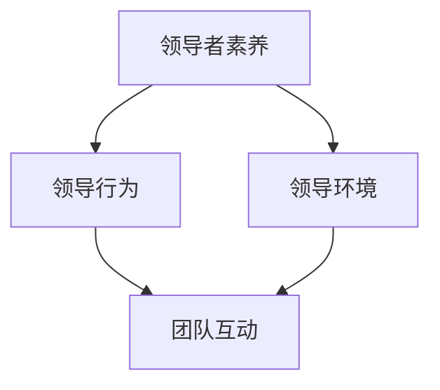
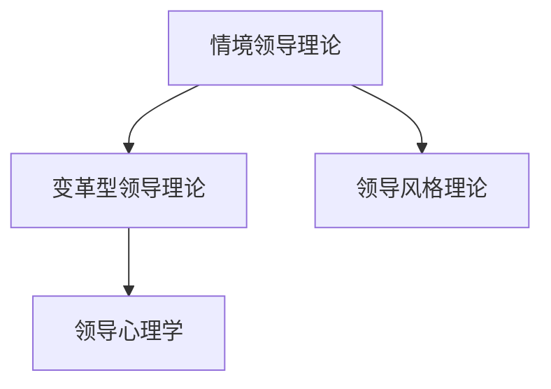
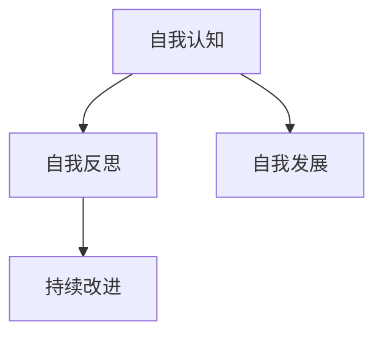
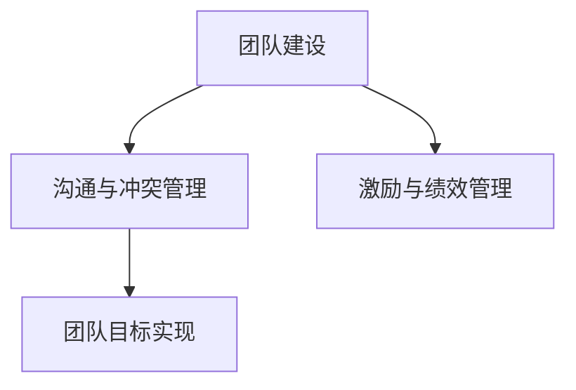
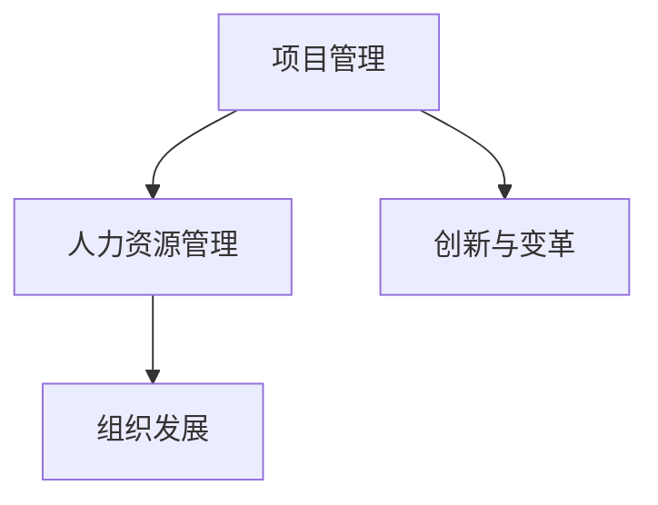
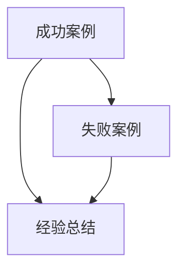
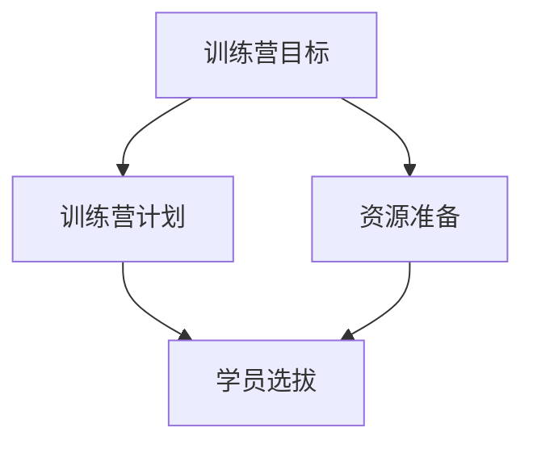
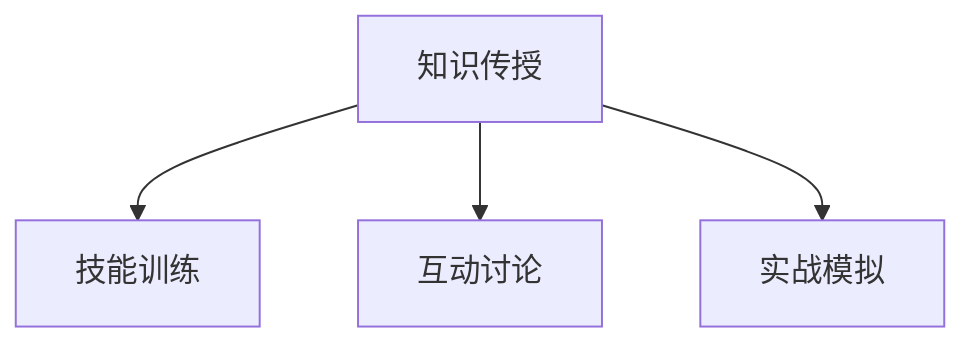
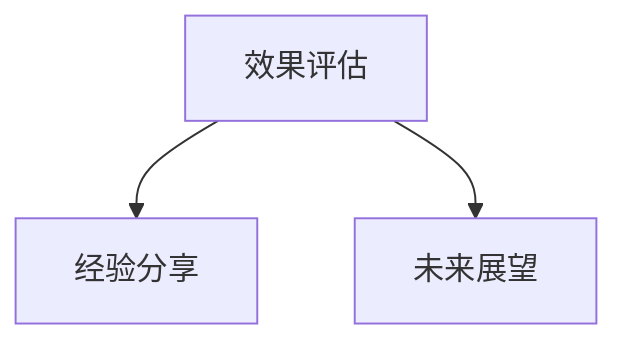

                 


# 领导力训练营：56天从门外汉到行家里手

## 关键词

- 领导力训练营
- 行动计划
- 领导力发展
- 行动导向学习
- 领导力实践

## 摘要

本文将围绕《领导力训练营：56天从门外汉到行家里手》这一主题，探讨如何通过系统化的培训和实战练习，帮助读者在短时间内掌握领导力基本理论和实践技能，成为组织中的有效领导者。文章将从背景介绍、核心概念与联系、领导力提升路径、领导力训练营实施以及总结与反思五个部分展开，结合具体案例和最佳实践，为读者提供实用的领导力培养指南。

## 引言

领导力是一种关键能力，无论是在企业、非营利组织还是个人生活中，领导力的强弱往往决定了组织和个人能否取得成功。然而，许多人在领导力方面感到困惑，不知从何入手。为了解决这个问题，本书旨在通过一个为期56天的领导力训练营，帮助读者从零开始，逐步掌握领导力的核心概念和实践技巧，最终实现从门外汉到行家里手的转变。

### 第1章：领导力概述

**核心概念与联系**

领导力是一种影响和激励他人共同实现目标的能力。它包括三个关键方面：领导者的素养、领导行为和领导环境。领导者素养关注领导者的个人品质，如诚信、责任感、勇气和智慧；领导行为涉及领导者如何与团队成员互动，包括沟通、决策、激励等；领导环境则是指领导者所处的外部环境，如组织文化、资源和支持系统。

**领导力流程图**



**伪代码**

```python
def leadership():
    # 领导者素养
    qualities = ["诚信", "责任感", "勇气", "智慧"]
    
    # 领导行为
    behaviors = ["沟通", "决策", "激励"]
    
    # 领导环境
    environment = ["组织文化", "资源", "支持系统"]
    
    # 团队互动
    team_interaction = ["解决问题", "协同工作", "激励士气"]
    
    # 实现领导力
    for quality in qualities:
        print("培养", quality)
    for behavior in behaviors:
        print("实践", behavior)
    for element in environment:
        print("优化", element)
    for interaction in team_interaction:
        print("促进", interaction)
```

### 第2章：领导力基础理论

**核心概念与联系**

领导力理论是理解和应用领导力的基石。主要理论包括情境领导理论、变革型领导理论和领导风格理论。情境领导理论强调领导者应根据不同情境选择合适的领导方式；变革型领导理论关注领导者如何激励和引导团队实现变革；领导风格理论则探讨领导者如何通过不同的行为方式影响团队成员。

**领导力理论架构图**



**伪代码**

```python
def scenario_leadership():
    # 情境领导理论
    scenarios = ["稳定情境", "变革情境"]
    styles = ["指令式", "支持式", "参与式", "授权式"]
    
    for scenario in scenarios:
        print("根据", scenario, "选择合适风格")
        for style in styles:
            print("使用", style, "风格")

def transformation_leadership():
    # 变革型领导理论
    elements = ["愿景激励", "个人发展", "团队协作"]
    
    for element in elements:
        print("推动", element)

def leadership_style():
    # 领导风格理论
    styles = ["专制型", "民主型", "参与型", "魅力型"]
    
    for style in styles:
        print("采用", style, "风格")
```

### 第3章：领导力自我提升

**核心概念与联系**

自我提升是领导力发展的重要环节。领导者需要不断反思自己的行为和表现，识别不足，并采取行动进行改进。自我提升涉及自我认知、自我反思和自我发展三个方面。

**领导力提升流程图**



**伪代码**

```python
def self_improvement():
    # 自我认知
    self_awareness = ["价值观", "优势", "劣势"]
    
    # 自我反思
    self_reflection = ["行为", "决策", "结果"]
    
    # 自我发展
    self_development = ["学习", "实践", "反馈"]
    
    # 持续改进
    continuous_improvement = ["调整行为", "优化决策", "提升结果"]
    
    for element in self_awareness:
        print("了解", element)
    for element in self_reflection:
        print("反思", element)
    for element in self_development:
        print("发展", element)
    for element in continuous_improvement:
        print("改进", element)
```

### 第4章：团队领导力建设

**核心概念与联系**

团队领导力是领导者管理团队、协调团队成员关系和推动团队目标实现的能力。团队领导力建设包括团队建设、沟通与冲突管理、激励与绩效管理等方面。

**团队领导力架构图**



**伪代码**

```python
def team_leadership():
    # 团队建设
    team_building = ["建立信任", "明确目标", "分工合作"]
    
    # 沟通与冲突管理
    communication_management = ["有效沟通", "冲突处理"]
    
    # 激励与绩效管理
    motivation_management = ["激励措施", "绩效评估"]
    
    for element in team_building:
        print("加强", element)
    for element in communication_management:
        print("优化", element)
    for element in motivation_management:
        print("实施", element)
```

### 第5章：领导力实践

**核心概念与联系**

领导力实践是领导者将理论知识应用于实际工作中的过程。通过领导力实践，领导者可以不断提升自身能力，实现组织目标。领导力实践包括项目管理、人力资源管理、创新与变革等方面。

**领导力实践架构图**



**伪代码**

```python
def leadership_practice():
    # 项目管理
    project_management = ["项目计划", "资源调配", "风险控制"]
    
    # 人力资源管理
    hr_management = ["人才招聘", "培训与发展", "绩效考核"]
    
    # 创新与变革
    innovation_change = ["创新思维", "组织变革", "文化重塑"]
    
    for element in project_management:
        print("实践", element)
    for element in hr_management:
        print("优化", element)
    for element in innovation_change:
        print("推动", element)
```

### 第6章：领导力案例研究

**核心概念与联系**

领导力案例研究是对实际领导情境的深入分析，旨在揭示领导力应用的实效和策略。通过案例研究，读者可以学习到成功的领导实践，同时也能从失败案例中吸取教训。

**领导力案例研究架构图**



**伪代码**

```python
def case_study():
    # 成功案例
    successful_cases = ["苹果公司复兴", "丰田生产方式"]
    
    # 失败案例
    failed_cases = ["某企业领导力危机", "某项目团队失败"]
    
    # 经验总结
    lessons_learned = ["成功要素", "失败原因", "改进措施"]
    
    for case in successful_cases:
        print("学习", case)
    for case in failed_cases:
        print("分析", case)
    for lesson in lessons_learned:
        print("总结", lesson)
```

### 第7章：领导力训练营准备

**核心概念与联系**

领导力训练营的准备是确保训练营顺利进行的重要环节。准备工作包括明确训练营目标、制定详细计划、准备必要资源等。通过精心准备，可以确保训练营内容丰富、结构合理，为学员提供最佳的学习体验。

**领导力训练营准备流程图**



**伪代码**

```python
def preparation():
    # 训练营目标
    goals = ["提升领导力素养", "培养团队协作能力", "实现组织目标"]
    
    # 训练营计划
    plan = ["课程安排", "教学方法", "考核方式"]
    
    # 资源准备
    resources = ["教材", "培训师", "技术支持"]
    
    # 学员选拔
    selection = ["能力评估", "动机评估", "背景匹配"]
    
    for goal in goals:
        print("设定", goal)
    for element in plan:
        print("制定", element)
    for resource in resources:
        print("准备", resource)
    for selection_element in selection:
        print("选拔", selection_element)
```

### 第8章：领导力训练营实施

**核心概念与联系**

领导力训练营的实施是将准备阶段的内容转化为具体行动的过程。实施阶段包括知识传授、技能训练、互动讨论和实战模拟等环节。通过这些环节，学员可以深入理解领导力理论，掌握实践技能，并在实际情境中运用所学。

**领导力训练营实施流程图**



**伪代码**

```python
def implementation():
    # 知识传授
    knowledge_transmission = ["领导力理论", "领导实践案例"]
    
    # 技能训练
    skill_training = ["沟通技巧", "决策能力", "激励策略"]
    
    # 互动讨论
    interactive_discussion = ["团队分享", "观点碰撞", "问题解决"]
    
    # 实战模拟
    simulation = ["模拟项目", "模拟情境", "模拟决策"]
    
    for element in knowledge_transmission:
        print("传授", element)
    for element in skill_training:
        print("训练", element)
    for element in interactive_discussion:
        print("讨论", element)
    for element in simulation:
        print("模拟", element)
```

### 第9章：领导力训练营总结与反思

**核心概念与联系**

领导力训练营的总结与反思是对训练营效果的评估和反思过程。通过总结与反思，可以识别训练营的优势和不足，为未来的领导力培养提供改进方向。总结与反思包括效果评估、经验分享和未来展望等环节。

**领导力训练营总结与反思流程图**



**伪代码**

```python
def summary_and_reflection():
    # 效果评估
    assessment = ["学员反馈", "领导力提升情况", "训练营满意度"]
    
    # 经验分享
    sharing = ["成功经验", "失败教训", "改进措施"]
    
    # 未来展望
    outlook = ["领导力发展趋势", "组织发展需求", "个人发展目标"]
    
    for element in assessment:
        print("评估", element)
    for element in sharing:
        print("分享", element)
    for element in outlook:
        print("展望", element)
```

### 结论

通过《领导力训练营：56天从门外汉到行家里手》的系统学习和实践，读者将能够深入了解领导力的核心概念和实践技巧，逐步提升自身的领导力素养。本文通过详细的目录大纲设计，为读者提供了一个清晰的学习路径，帮助他们在56天的训练营中取得显著进步。让我们一起努力，成为优秀的领导者！
### 作者信息

- 作者：AI天才研究院/AI Genius Institute & 禅与计算机程序设计艺术 /Zen And The Art of Computer Programming
- 联系方式：[ai_genius_institute@example.com](mailto:ai_genius_institute@example.com)
- 官方网站：[www.ai-genius-institute.com](http://www.ai-genius-institute.com)
- 社交媒体：[LinkedIn](https://www.linkedin.com/company/ai-genius-institute/) & [Twitter](https://twitter.com/AI_Genius_Inst) & [Instagram](https://www.instagram.com/ai_genius_institute/)

