                 

### 文章标题：领导力训练营：84天从门外汉到内行人

> 关键词：领导力，个人成长，团队建设，决策与问题解决，实践案例，反思与总结

> 摘要：本文通过分析《领导力训练营：84天从门外汉到内行人》一书，详细阐述了领导力发展的全过程。从入门阶段的理论学习，到进阶阶段的模型应用，再到实战阶段的实践探索，文章系统总结了领导力提升的各个关键环节。通过深入探讨个人成长、沟通技巧、领导力模型、决策与问题解决、激励与团队管理等核心内容，结合具体案例，为读者提供了实用且具启发性的领导力提升路径。

---

## 书名：《领导力训练营：84天从门外汉到内行人》

### 目录大纲：

### 第一部分：入门阶段（第1-4周）

- **第1章：领导力基础理论**
  - **1.1 领导力的定义与重要性**
  - **1.2 领导者角色与责任**
  - **1.3 领导力发展的基本原则**

- **第2章：个人成长与自我管理**
  - **2.1 个人成长的重要性**
  - **2.2 自我管理**

- **第3章：沟通技巧与团队建设**
  - **3.1 沟通技巧**
  - **3.2 团队建设**

### 第二部分：进阶阶段（第5-8周）

- **第4章：领导力模型与应用**
  - **4.1 常见的领导力模型**
  - **4.2 领导力模型在实际中的应用**

- **第5章：决策与问题解决**
  - **5.1 决策的原则与方法**
  - **5.2 问题解决**

- **第6章：激励与团队管理**
  - **6.1 激励理论**
  - **6.2 团队管理**

### 第三部分：实战阶段（第9-12周）

- **第7章：领导力实践**
  - **7.1 实践中的挑战**
  - **7.2 实践案例**

- **第8章：反思与总结**
  - **8.1 领导力成长的反思**
  - **8.2 领导力训练营的总结**

### 附录

- **A.1 领导力工具与资源**
  - **A.1.1 领导力评估工具**
  - **A.1.2 领导力发展资源**
  - **A.1.3 领导力书籍推荐**

---

### 目录大纲总字数：约2000字

### 注：

- 目录大纲中包含的 Mermaid 流程图、伪代码、数学模型和公式等将在后续补充。
- 项目实战案例将在相应章节中详细说明。

---

### 第一部分：入门阶段（第1-4周）

#### 第1章：领导力基础理论

### 1.1 领导力的定义与重要性

**核心概念与联系**

领导力是一种影响力，它涉及到激励、指导和影响他人以实现共同目标的能力。领导力不仅仅局限于管理和组织，它也适用于个人成长、团队协作以及任何需要领导力的场合。以下是领导力定义的关键要素和它们之间的关系架构：

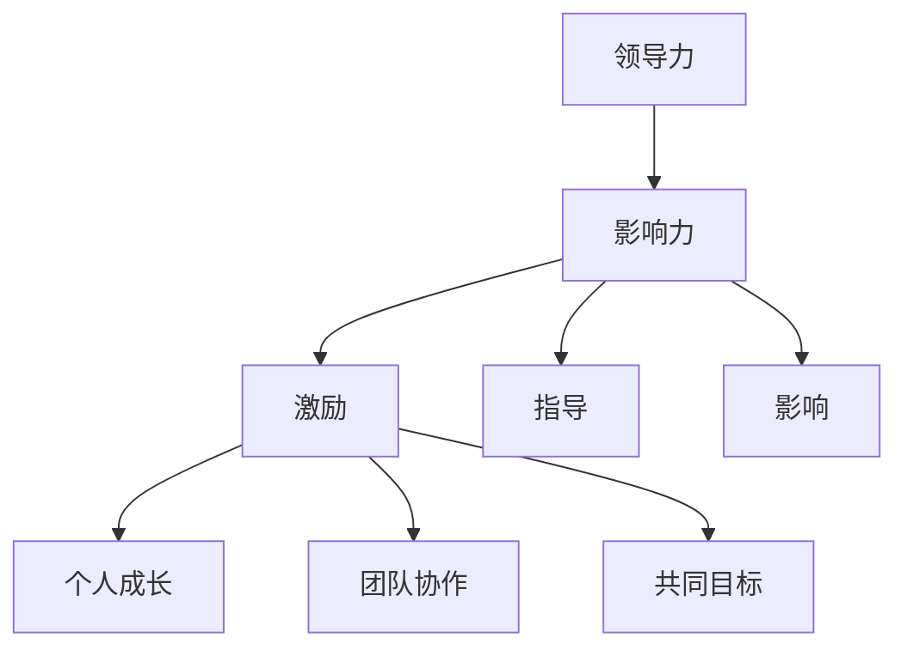

**核心算法原理讲解**

领导力的核心算法可以概括为以下几个步骤：

1. **目标设定**：明确共同目标，并将其传达给团队成员。
2. **激励**：通过正面反馈、奖励机制等方式，激励团队成员为实现目标而努力。
3. **指导**：提供明确的指导和方向，帮助团队成员克服困难，解决问题。
4. **影响**：通过有效的沟通和榜样作用，影响团队成员的态度和行为。

**详细讲解与举例说明**

领导力的定义和重要性可以通过以下例子进行说明：

- **目标设定**：在一个项目团队中，领导者需要明确项目的目标，并将其传达给团队成员。例如，如果项目的目标是开发一个新软件，那么领导者需要确保每个团队成员都清楚项目的目标，以及他们在项目中的角色和责任。

- **激励**：领导者可以通过设置合理的奖励机制来激励团队成员。例如，对于完成任务的团队成员，可以提供奖金、晋升机会或其他形式的奖励。

- **指导**：领导者需要为团队成员提供明确的指导和方向。例如，在开发软件的过程中，领导者可能需要指导团队成员如何使用特定的工具和技术，以及如何解决遇到的问题。

- **影响**：领导者通过自己的行为和态度来影响团队成员。例如，如果领导者始终积极乐观，并且能够有效地解决问题，那么团队成员很可能会受到这种态度和行为的影响，从而变得更加积极和高效。

### 1.2 领导者角色与责任

**核心概念与联系**

领导者角色和责任是领导力的重要组成部分。以下是领导者角色的关键要素和它们之间的关系架构：

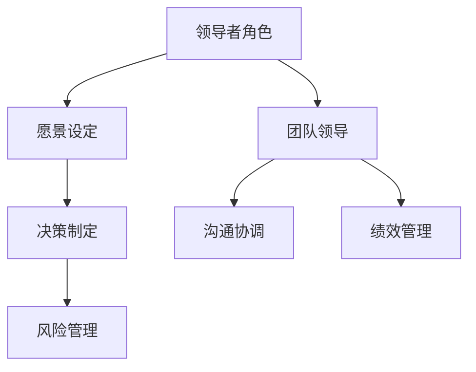

**核心算法原理讲解**

领导者的角色和责任可以通过以下步骤进行理解：

1. **愿景设定**：领导者需要设定团队的愿景，明确团队的目标和方向。
2. **决策制定**：领导者需要做出明智的决策，以推动团队前进。
3. **团队领导**：领导者需要有效地领导团队，确保团队目标的实现。
4. **沟通协调**：领导者需要与团队成员保持良好的沟通，协调团队内部的工作。
5. **绩效管理**：领导者需要关注团队成员的绩效，并提供必要的支持和指导。

**详细讲解与举例说明**

领导者的角色和责任可以通过以下例子进行说明：

- **愿景设定**：领导者需要为团队设定一个明确的愿景。例如，在一个软件开发团队中，领导者可能设定一个愿景，即开发一款功能强大且用户友好的软件。

- **决策制定**：领导者需要根据团队的目标和愿景做出决策。例如，当团队面临技术选择时，领导者需要决定使用哪种技术，以便实现团队的目标。

- **团队领导**：领导者需要有效地领导团队。例如，领导者需要确保团队成员明确自己的角色和责任，并且相互协作，共同实现团队的目标。

- **沟通协调**：领导者需要与团队成员保持良好的沟通。例如，领导者需要定期与团队成员开会，讨论项目的进展情况和遇到的问题。

- **绩效管理**：领导者需要关注团队成员的绩效。例如，领导者需要定期评估团队成员的工作表现，并提供反馈和建议，以帮助他们改进。

### 1.3 领导力发展的基本原则

**核心概念与联系**

领导力发展是一个长期的过程，需要遵循一些基本原则。以下是领导力发展关键要素和它们之间的关系架构：

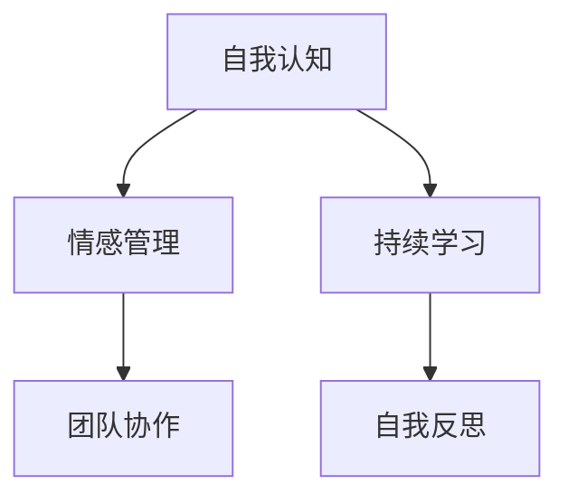

**核心算法原理讲解**

领导力发展的基本原则可以通过以下步骤进行理解：

1. **自我认知**：领导者需要了解自己的优点和缺点，并不断改进。
2. **情感管理**：领导者需要控制自己的情绪，保持积极和乐观的态度。
3. **团队协作**：领导者需要鼓励团队成员相互协作，共同实现目标。
4. **持续学习**：领导者需要不断学习新知识和技能，以适应不断变化的环境。
5. **自我反思**：领导者需要定期反思自己的行为和决策，以不断改进。

**详细讲解与举例说明**

领导力发展的基本原则可以通过以下例子进行说明：

- **自我认知**：领导者需要了解自己的优点和缺点。例如，一个领导者可能发现自己在沟通方面存在不足，因此需要通过培训和练习来提高自己的沟通能力。

- **情感管理**：领导者需要控制自己的情绪。例如，当团队面临困难时，领导者需要保持冷静，并鼓励团队成员积极应对。

- **团队协作**：领导者需要鼓励团队成员相互协作。例如，领导者可以组织团队活动，促进团队成员之间的交流与合作。

- **持续学习**：领导者需要不断学习新知识和技能。例如，领导者可以参加培训课程、阅读相关书籍，以提升自己的领导力。

- **自我反思**：领导者需要定期反思自己的行为和决策。例如，领导者可以在每次项目结束后，回顾项目的成功和失败之处，并从中吸取经验教训。

#### 第2章：个人成长与自我管理

### 2.1 个人成长的重要性

**核心概念与联系**

个人成长对于领导力的发展至关重要。以下是个人成长关键要素和它们之间的关系架构：

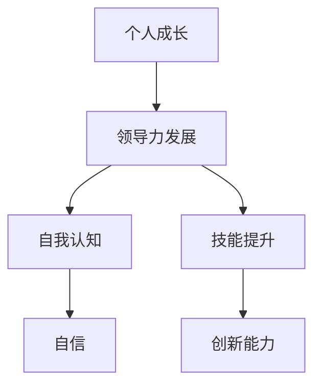

**核心算法原理讲解**

个人成长的重要性可以通过以下步骤进行理解：

1. **自我认知**：个人成长首先需要了解自己的优点和缺点，这有助于提高自信和自我认知。
2. **技能提升**：通过学习和实践，个人可以提升自己的技能，从而在领导力方面更加出色。
3. **创新能力**：个人成长还可以培养创新能力，这有助于领导者面对复杂问题时，能够提出创新的解决方案。

**详细讲解与举例说明**

个人成长的重要性可以通过以下例子进行说明：

- **自我认知**：一个领导者可能通过自我反思和反馈，了解自己在沟通技能方面的不足。通过认识到这一点，领导者可以采取行动，如参加沟通培训课程，以提高自己的沟通能力。

- **技能提升**：通过学习新的技能，领导者可以在工作中更加高效。例如，一个技术领导者可能通过学习新的编程语言，能够更好地理解和指导开发团队。

- **创新能力**：个人成长可以培养创新能力，使领导者能够面对复杂问题时，提出创新的解决方案。例如，一个领导者可能通过学习新的管理理论，能够在一个项目中提出一个创新的管理方法。

### 2.2 自我管理

**核心概念与联系**

自我管理是个人成长的重要组成部分。以下是自我管理关键要素和它们之间的关系架构：

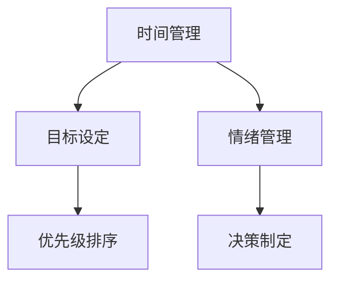

**核心算法原理讲解**

自我管理可以通过以下步骤进行理解：

1. **时间管理**：合理分配时间，确保重要的任务得到优先处理。
2. **目标设定**：明确自己的目标，并制定计划以实现这些目标。
3. **优先级排序**：根据目标的紧急程度和重要性，对任务进行排序。
4. **情绪管理**：保持积极和乐观的态度，应对挑战和压力。
5. **决策制定**：在面对选择时，做出明智的决策。

**详细讲解与举例说明**

自我管理可以通过以下例子进行说明：

- **时间管理**：一个领导者可能使用时间管理工具，如日历或待办事项列表，来安排自己的日程，确保重要任务得到处理。

- **目标设定**：一个领导者可能设定一个目标，如在未来三个月内提高团队的绩效。为了实现这一目标，领导者需要制定具体的计划，如每周与团队成员进行绩效评估。

- **优先级排序**：一个领导者可能根据任务的紧急程度和重要性，对任务进行排序。例如，如果团队面临一个即将截止的项目，那么领导者可能将这个任务列为最高优先级。

- **情绪管理**：一个领导者可能通过冥想、锻炼或其他方式来管理自己的情绪，确保在压力下保持冷静和专注。

- **决策制定**：一个领导者可能在面对一个复杂的决策时，通过收集信息、分析选项和权衡利弊，来做出明智的决策。

#### 第3章：沟通技巧与团队建设

### 3.1 沟通技巧

**核心概念与联系**

沟通技巧是领导力的重要组成部分。以下是沟通技巧关键要素和它们之间的关系架构：

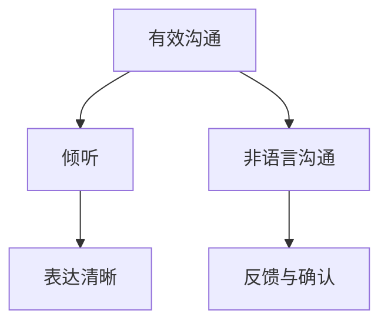

**核心算法原理讲解**

沟通技巧可以通过以下步骤进行理解：

1. **倾听**：积极倾听他人的意见和需求，以确保理解对方。
2. **表达清晰**：用简单、明确的语言表达自己的想法和意见。
3. **非语言沟通**：通过肢体语言、面部表情和声音传达信息。
4. **反馈与确认**：通过反馈和确认，确保沟通双方理解对方。

**详细讲解与举例说明**

沟通技巧可以通过以下例子进行说明：

- **倾听**：一个领导者可能在会议中积极倾听团队成员的意见。例如，当团队成员提出一个问题或建议时，领导者会给予关注，并询问更多的细节，以确保理解对方的意见。

- **表达清晰**：一个领导者可能在报告中使用简单、明确的语言。例如，如果领导者在报告中讨论一个复杂的技术问题，领导者会使用易于理解的术语和图表，以便团队成员能够理解。

- **非语言沟通**：一个领导者可能在会议中通过肢体语言和面部表情传达信息。例如，当领导者发言时，领导者可能会保持眼神接触，点头表示认同，以鼓励团队成员积极参与。

- **反馈与确认**：一个领导者可能在会议后提供反馈和确认。例如，领导者可能会询问团队成员是否理解了会议内容，并确认他们对任务的了解。

### 3.2 团队建设

**核心概念与联系**

团队建设是领导力的关键要素。以下是团队建设关键要素和它们之间的关系架构：

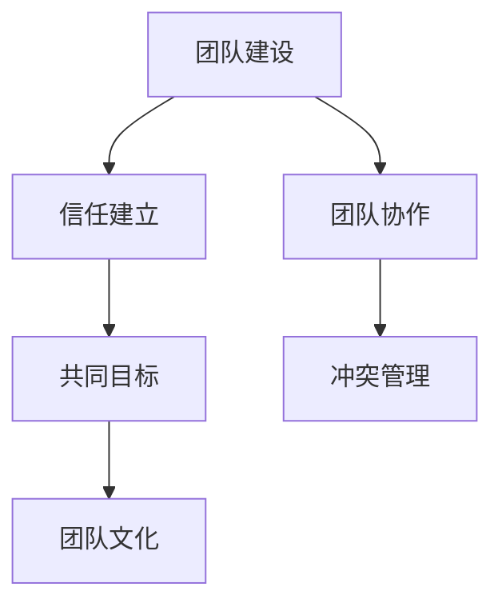

**核心算法原理讲解**

团队建设可以通过以下步骤进行理解：

1. **信任建立**：通过开放沟通、共同目标和相互尊重，建立团队成员之间的信任。
2. **共同目标**：明确团队的目标和愿景，确保所有成员都朝着同一方向努力。
3. **团队协作**：鼓励团队成员相互协作，共同完成任务。
4. **冲突管理**：通过有效的沟通和协商，解决团队成员之间的冲突。
5. **团队文化**：塑造积极、包容和合作的团队文化。

**详细讲解与举例说明**

团队建设可以通过以下例子进行说明：

- **信任建立**：一个领导者可能通过定期团队建设活动，如团队郊游或晚宴，来促进团队成员之间的相互了解和信任。

- **共同目标**：一个领导者可能制定一个团队目标，如提高团队的绩效或开发一个新项目。为了实现这一目标，领导者会确保所有成员都了解目标，并明确各自的职责。

- **团队协作**：一个领导者可能鼓励团队成员相互协作，例如通过定期团队会议和协作工具，确保团队成员能够共享信息和资源。

- **冲突管理**：一个领导者可能通过有效的沟通和协商，解决团队成员之间的冲突。例如，如果团队成员之间存在意见分歧，领导者可能会组织一个会议，让双方表达自己的观点，并寻找共同点。

- **团队文化**：一个领导者可能通过塑造积极、包容和合作的团队文化，促进团队的凝聚力和绩效。例如，领导者可能会鼓励团队成员相互尊重和欣赏，并建立一种开放和包容的工作环境。

### 第二部分：进阶阶段（第5-8周）

#### 第4章：领导力模型与应用

### 4.1 常见的领导力模型

**核心概念与联系**

常见的领导力模型可以帮助领导者理解不同领导风格和策略的优缺点。以下是几种常见的领导力模型和它们之间的关系架构：

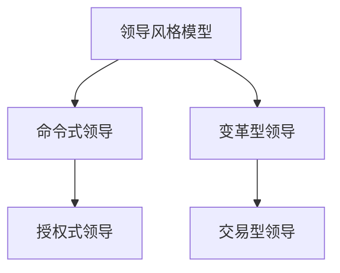

**核心算法原理讲解**

领导力模型可以通过以下步骤进行理解：

1. **命令式领导**：领导者通过明确的指令和权威来指导团队成员。
2. **授权式领导**：领导者鼓励团队成员参与决策，赋予他们自主权。
3. **变革型领导**：领导者通过激励和愿景引导团队成员，推动变革。
4. **交易型领导**：领导者通过奖励和惩罚来激励团队成员。

**详细讲解与举例说明**

常见的领导力模型可以通过以下例子进行说明：

- **命令式领导**：在一个紧急情况下，一个领导者可能需要使用命令式领导风格，立即下达指令，以确保团队成员迅速采取行动。例如，在一个项目即将截止时，领导者可能会明确指示团队成员加班，以确保项目按时完成。

- **授权式领导**：在一个创新项目中，一个领导者可能需要使用授权式领导风格，鼓励团队成员参与决策，并赋予他们自主权。例如，在一个新产品开发项目中，领导者可能会组织团队会议，讨论产品的设计和开发计划，并允许团队成员提出自己的建议。

- **变革型领导**：在一个公司面临重大变革时，一个领导者可能需要使用变革型领导风格，通过激励和愿景引导团队成员。例如，在一个公司从传统业务转向数字化转型的过程中，领导者可能会激励团队成员，并设定一个清晰的愿景，以推动团队成员积极适应变革。

- **交易型领导**：在一个团队面临绩效压力时，一个领导者可能需要使用交易型领导风格，通过奖励和惩罚来激励团队成员。例如，在一个销售团队面临季度销售目标时，领导者可能会提供奖金或其他奖励，以激励团队成员努力实现目标。

### 4.2 领导力模型在实际中的应用

**核心概念与联系**

领导力模型在实际中的应用取决于具体情境和团队需求。以下是领导力模型在实际中的应用关键要素和它们之间的关系架构：

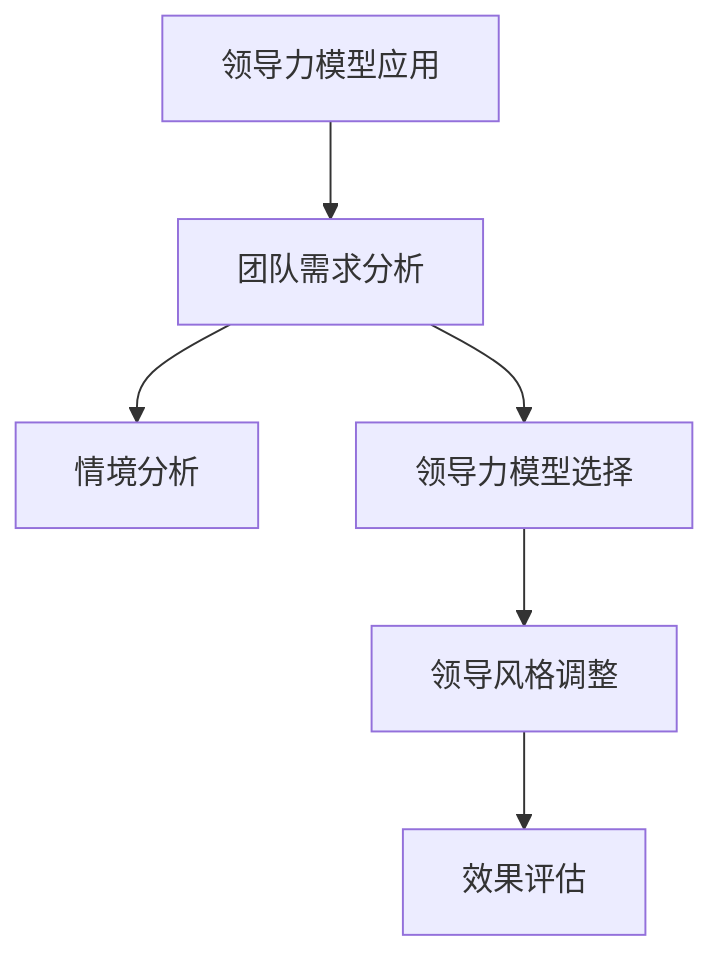

**核心算法原理讲解**

领导力模型在实际中的应用可以通过以下步骤进行理解：

1. **团队需求分析**：了解团队的需求和目标，确定适合的领导力模型。
2. **情境分析**：分析当前情境，确定领导力模型的有效性。
3. **领导力模型选择**：根据团队需求和情境，选择适合的领导力模型。
4. **领导风格调整**：根据领导力模型，调整领导风格，以适应团队需求和情境。
5. **效果评估**：评估领导力模型的效果，并根据评估结果进行调整。

**详细讲解与举例说明**

领导力模型在实际中的应用可以通过以下例子进行说明：

- **团队需求分析**：一个领导者可能在面对一个需要创新和变革的团队时，进行团队需求分析。领导者会了解团队成员的能力、兴趣和目标，确定团队需要什么样的领导力模型。

- **情境分析**：一个领导者可能在面对一个复杂和多变的项目时，进行情境分析。领导者会了解项目的目标、期限、资源和团队的能力，确定当前情境下适合的领导力模型。

- **领导力模型选择**：一个领导者可能会根据团队需求和情境分析的结果，选择变革型领导力模型。变革型领导力模型能够激励团队成员，推动创新和变革。

- **领导风格调整**：一个领导者可能会根据变革型领导力模型，调整自己的领导风格。例如，领导者可能会更加注重沟通和协作，鼓励团队成员提出自己的想法和建议。

- **效果评估**：一个领导者会定期评估变革型领导力模型的效果。例如，领导者可能会观察团队的绩效、成员的参与度和满意度，并根据评估结果进行调整。

### 第5章：决策与问题解决

#### 5.1 决策的原则与方法

**核心概念与联系**

决策是领导力的重要组成部分。以下是决策原则和方法的关键要素和它们之间的关系架构：

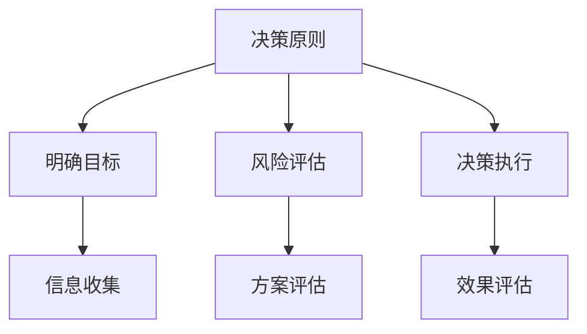

**核心算法原理讲解**

决策的原则和方法可以通过以下步骤进行理解：

1. **明确目标**：确保决策与团队的总体目标一致。
2. **信息收集**：收集与决策相关的信息，确保决策基于充分的数据。
3. **风险评估**：评估决策可能带来的风险，并制定应对策略。
4. **方案评估**：比较不同的决策方案，选择最优方案。
5. **决策执行**：执行决策，并确保团队成员理解并支持决策。
6. **效果评估**：评估决策的效果，并根据评估结果进行调整。

**详细讲解与举例说明**

决策的原则和方法可以通过以下例子进行说明：

- **明确目标**：一个领导者可能在一个项目初期，明确项目的目标和预期成果。例如，领导者可能会设定一个目标，即在未来三个月内完成一个新产品的开发。

- **信息收集**：一个领导者可能在一个决策过程中，收集与决策相关的信息。例如，领导者可能会查阅市场报告、技术文档和团队成员的建议，以获取充分的信息。

- **风险评估**：一个领导者可能在一个决策过程中，评估决策可能带来的风险。例如，领导者可能会考虑新产品开发的成本、市场风险和技术挑战。

- **方案评估**：一个领导者可能会比较不同的决策方案，选择最优方案。例如，领导者可能会比较两个不同的技术方案，选择一个更符合团队资源和市场需求的方案。

- **决策执行**：一个领导者可能在决策执行过程中，确保团队成员理解并支持决策。例如，领导者可能会组织一次会议，向团队成员解释决策的原因和预期效果，并回答他们的问题。

- **效果评估**：一个领导者可能会在决策执行后，评估决策的效果。例如，领导者可能会在项目完成后，评估新产品的市场表现和团队绩效，并根据评估结果进行调整。

#### 5.2 问题解决

**核心概念与联系**

问题解决是领导力中的重要技能。以下是问题解决的关键要素和它们之间的关系架构：

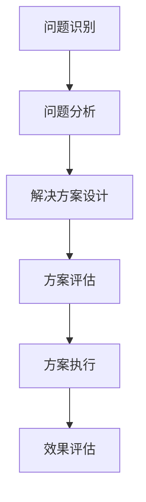

**核心算法原理讲解**

问题解决可以通过以下步骤进行理解：

1. **问题识别**：准确识别问题的性质和影响范围。
2. **问题分析**：分析问题的根本原因，了解问题产生的背景和条件。
3. **解决方案设计**：设计不同的解决方案，评估它们的优缺点。
4. **方案评估**：选择最优方案，并制定详细的执行计划。
5. **方案执行**：执行解决方案，并确保团队成员参与其中。
6. **效果评估**：评估解决方案的效果，并根据评估结果进行调整。

**详细讲解与举例说明**

问题解决可以通过以下例子进行说明：

- **问题识别**：一个领导者可能在团队会议中，识别出一个潜在的问题。例如，领导者可能会注意到团队成员在项目中遇到的技术困难。

- **问题分析**：一个领导者可能在一个问题识别后，分析问题的根本原因。例如，领导者可能会考虑技术问题的原因，如代码错误或设计缺陷。

- **解决方案设计**：一个领导者可能会设计不同的解决方案。例如，领导者可能会考虑修复代码或重新设计系统。

- **方案评估**：一个领导者可能会评估不同的解决方案，并选择最优方案。例如，领导者可能会选择修复代码，因为它可能在成本和时间上更可行。

- **方案执行**：一个领导者可能会在方案评估后，执行解决方案。例如，领导者可能会指派团队成员修复代码，并确保他们有足够的资源和支持。

- **效果评估**：一个领导者可能会在方案执行后，评估解决方案的效果。例如，领导者可能会在修复代码后，检查项目是否恢复正常，并确保问题不再出现。

### 第6章：激励与团队管理

#### 6.1 激励理论

**核心概念与联系**

激励是领导力中的重要组成部分。以下是激励理论的关键要素和它们之间的关系架构：

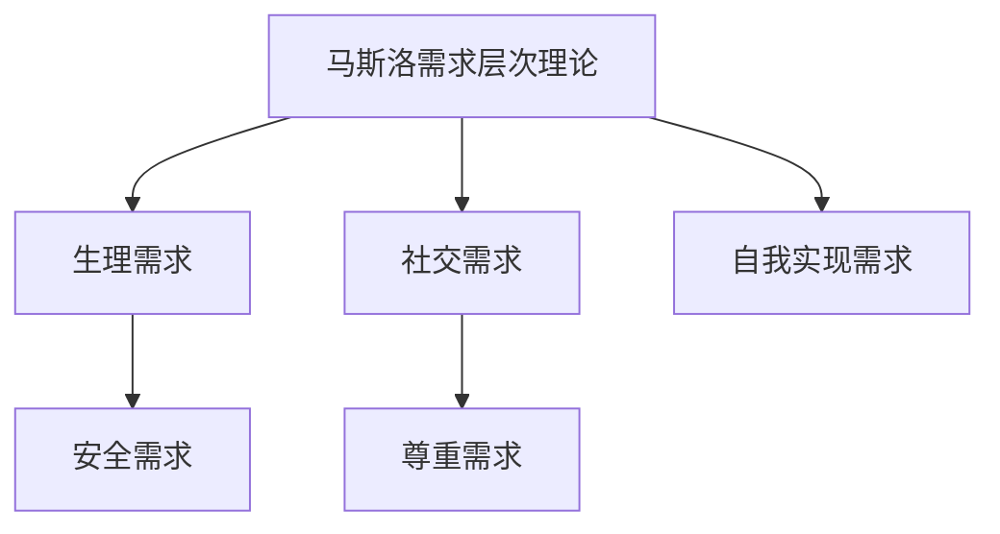

**核心算法原理讲解**

激励理论可以通过以下步骤进行理解：

1. **马斯洛需求层次理论**：了解员工的需求层次，并根据不同层次提供相应的激励。
2. **生理需求**：满足员工的生理需求，如薪酬、福利和工作环境。
3. **安全需求**：提供稳定的工作环境和职业发展机会，确保员工的安全感。
4. **社交需求**：创造一个团队合作和沟通的环境，满足员工的社交需求。
5. **尊重需求**：通过认可和奖励，满足员工的尊重需求。
6. **自我实现需求**：提供挑战性任务和职业发展机会，帮助员工实现自我价值。

**详细讲解与举例说明**

激励理论可以通过以下例子进行说明：

- **马斯洛需求层次理论**：一个领导者可能了解员工的需求层次，并根据不同层次提供相应的激励。例如，对于一位刚刚加入公司的新员工，领导者可能会关注其生理需求和安全需求，提供良好的薪酬和福利，并确保工作环境的舒适。

- **生理需求**：一个领导者可能通过提供良好的薪酬和福利来满足员工的生理需求。例如，领导者可能会定期调整薪酬水平，提供带薪休假和健康保险等福利。

- **安全需求**：一个领导者可能通过提供稳定的工作环境和职业发展机会来满足员工的安全需求。例如，领导者可能会为员工提供职业规划服务，帮助员工了解公司的晋升路径，并提供必要的培训和指导。

- **社交需求**：一个领导者可能通过创造一个团队合作和沟通的环境来满足员工的社交需求。例如，领导者可能会组织团队建设活动，鼓励员工相互交流和合作。

- **尊重需求**：一个领导者可能通过认可和奖励来满足员工的尊重需求。例如，领导者可能会在团队会议上表扬员工的贡献，并为他们提供奖励，如奖金或晋升机会。

- **自我实现需求**：一个领导者可能通过提供挑战性任务和职业发展机会来帮助员工实现自我价值。例如，领导者可能会为员工提供参与重要项目的机会，或为他们提供进一步的培训和指导，以帮助他们提升技能和知识。

#### 6.2 团队管理

**核心概念与联系**

团队管理是领导力的关键要素。以下是团队管理的关键要素和它们之间的关系架构：

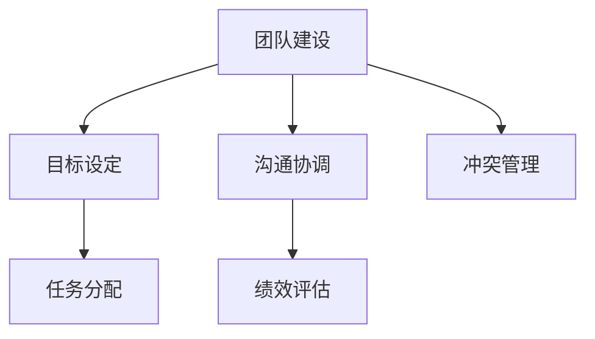

**核心算法原理讲解**

团队管理可以通过以下步骤进行理解：

1. **目标设定**：明确团队的目标和愿景，确保所有团队成员都朝着同一方向努力。
2. **任务分配**：根据团队成员的能力和兴趣，合理分配任务。
3. **沟通协调**：确保团队成员之间的沟通畅通，及时解决团队内部的问题。
4. **绩效评估**：定期评估团队成员的绩效，提供反馈和指导。
5. **冲突管理**：通过有效的沟通和协商，解决团队成员之间的冲突。

**详细讲解与举例说明**

团队管理可以通过以下例子进行说明：

- **目标设定**：一个领导者可能在项目开始时，明确项目的目标和愿景，并向团队成员传达。例如，领导者可能会设定一个目标，即在未来三个月内完成一个新产品的开发，并确保所有团队成员都了解这个目标。

- **任务分配**：一个领导者可能根据团队成员的能力和兴趣，合理分配任务。例如，领导者可能会根据团队成员的技术背景和经验，指派他们负责不同的模块。

- **沟通协调**：一个领导者可能确保团队成员之间的沟通畅通，及时解决团队内部的问题。例如，领导者可能会定期组织团队会议，讨论项目的进展情况和遇到的问题。

- **绩效评估**：一个领导者可能定期评估团队成员的绩效，提供反馈和指导。例如，领导者可能会在项目结束后，组织一次绩效评估会议，讨论团队成员的表现，并提供改进建议。

- **冲突管理**：一个领导者可能通过有效的沟通和协商，解决团队成员之间的冲突。例如，如果团队成员之间存在意见分歧，领导者可能会组织一次会议，让双方表达自己的观点，并寻找共同点。

### 第三部分：实战阶段（第9-12周）

#### 第7章：领导力实践

### 7.1 实践中的挑战

**核心概念与联系**

领导力实践面临多种挑战，以下是这些挑战的关键要素和它们之间的关系架构：

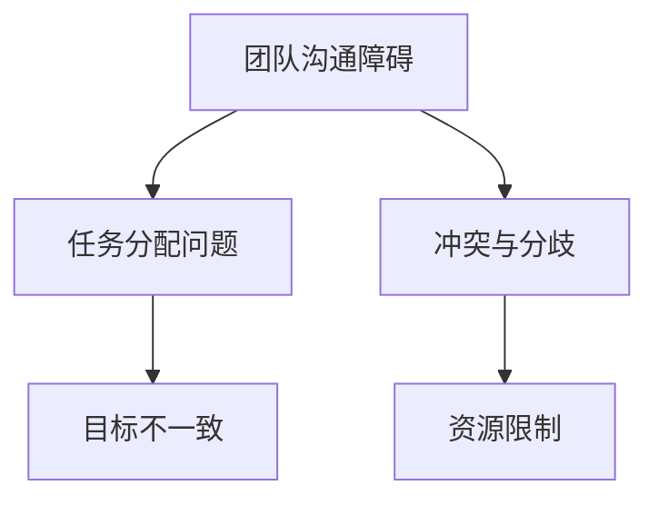

**核心算法原理讲解**

领导力实践中的挑战可以通过以下步骤进行理解：

1. **团队沟通障碍**：确保团队成员之间的沟通畅通，减少误解和冲突。
2. **任务分配问题**：根据团队成员的能力和兴趣，合理分配任务。
3. **目标不一致**：确保团队成员对目标和愿景有共同的理解和认同。
4. **冲突与分歧**：通过有效的沟通和协商，解决团队成员之间的冲突。
5. **资源限制**：优化资源分配，确保团队能够有效利用资源。

**详细讲解与举例说明**

领导力实践中的挑战可以通过以下例子进行说明：

- **团队沟通障碍**：在一个跨部门项目中，不同部门的团队成员可能存在沟通障碍，导致项目进展缓慢。例如，开发部门的成员可能不了解市场部门的需求，导致开发出的产品不符合市场需求。

- **任务分配问题**：在一个团队中，可能存在任务分配不均的情况，导致某些成员的工作负担过重，而其他成员则无所事事。例如，领导者可能没有充分考虑团队成员的能力和兴趣，导致团队成员感到不满意和不满。

- **目标不一致**：在一个团队中，如果团队成员对目标和愿景没有共同的理解和认同，可能导致团队内部出现分歧和冲突。例如，团队成员可能认为领导者的目标过于激进，而无法实现。

- **冲突与分歧**：在一个团队中，如果团队成员之间存在冲突和分歧，可能导致项目进展受阻。例如，团队成员可能因为意见不一致而产生争执，导致项目无法顺利进行。

- **资源限制**：在一个团队中，如果资源分配不合理，可能导致团队无法有效利用资源。例如，团队可能缺乏必要的工具和技术支持，导致项目无法按时完成。

### 7.2 实践案例

**核心概念与联系**

实践案例展示了领导力在不同情境中的应用，以下是这些案例的关键要素和它们之间的关系架构：

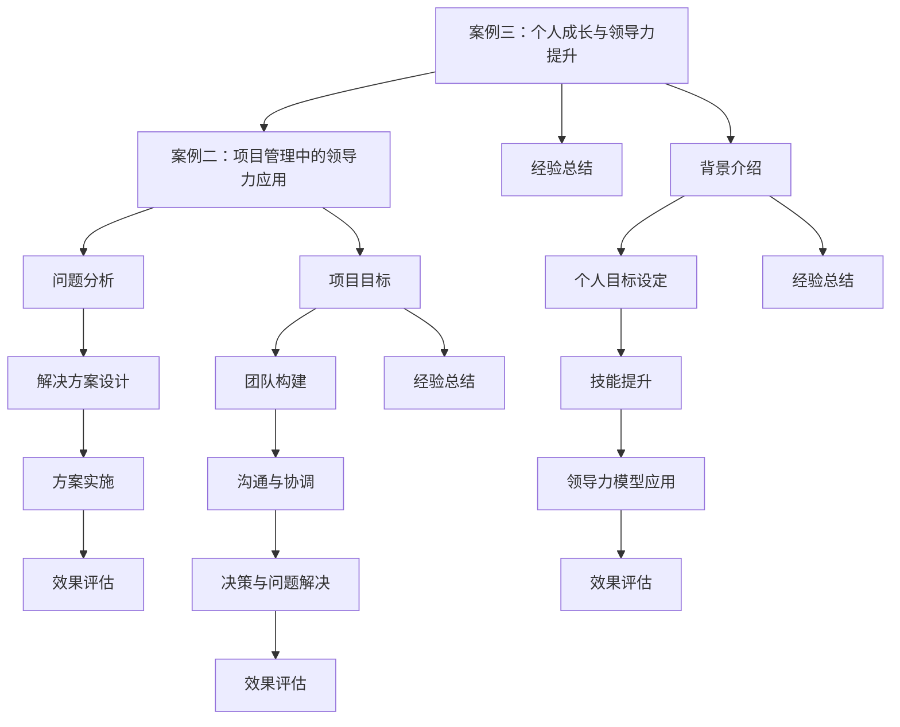

**核心算法原理讲解**

实践案例可以通过以下步骤进行理解：

1. **背景介绍**：介绍案例的背景和情境。
2. **问题分析**：分析案例中存在的问题和挑战。
3. **解决方案设计**：设计解决问题的方案。
4. **方案实施**：实施解决方案，并确保团队成员参与其中。
5. **效果评估**：评估解决方案的效果。
6. **经验总结**：总结案例中的经验和教训。

**详细讲解与举例说明**

实践案例可以通过以下例子进行说明：

- **案例一：团队领导力提升实践**：在一个公司的新产品开发项目中，团队成员缺乏领导力经验，导致项目进展缓慢。为了提升团队领导力，领导者组织了一系列培训和工作坊，帮助团队成员学习领导力技能，并鼓励他们实践和应用所学知识。通过这些努力，团队领导力得到了显著提升，项目也如期完成。

- **案例二：项目管理中的领导力应用**：在一个复杂的项目中，领导者面临多种挑战，如团队成员沟通不畅、目标不一致和资源限制。为了克服这些挑战，领导者采取了以下措施：与团队成员进行深入沟通，确保他们对项目目标和愿景有共同的理解；合理分配任务，确保每个团队成员都有合适的工作；定期组织团队会议，讨论项目的进展情况和遇到的问题，并制定解决方案。通过这些努力，项目得以顺利推进，并提前完成。

- **案例三：个人成长与领导力提升**：在一个个人成长计划中，一个领导者设定了明确的目标，如提升沟通技巧、管理能力和领导力。为了实现这些目标，领导者参加了各种培训课程，阅读了相关书籍，并积极实践所学知识。通过这些努力，领导者的沟通技巧和领导能力得到了显著提升，个人成长也得到了全面发展。

#### 第8章：反思与总结

### 8.1 领导力成长的反思

**核心概念与联系**

领导力成长需要不断地反思和总结。以下是领导力成长反思的关键要素和它们之间的关系架构：

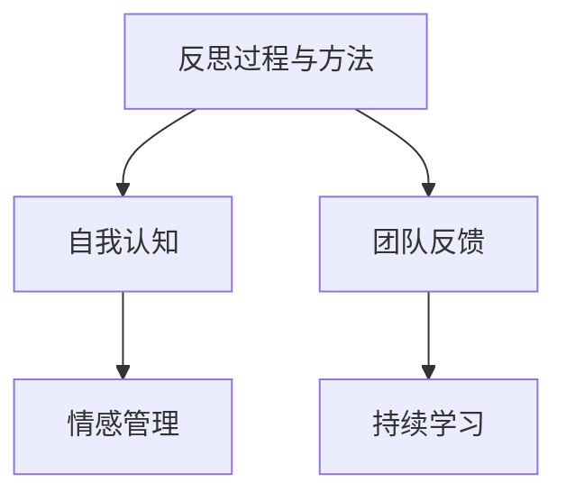

**核心算法原理讲解**

领导力成长的反思可以通过以下步骤进行理解：

1. **反思过程与方法**：领导者需要建立反思的习惯，并采用有效的方法进行反思。
2. **自我认知**：领导者需要了解自己的优点和缺点，不断改进。
3. **情感管理**：领导者需要控制自己的情绪，保持积极和乐观的态度。
4. **团队反馈**：领导者需要倾听团队成员的反馈，了解自己在团队中的表现。
5. **持续学习**：领导者需要不断学习新知识和技能，以适应不断变化的环境。

**详细讲解与举例说明**

领导力成长的反思可以通过以下例子进行说明：

- **反思过程与方法**：一个领导者可能每天花几分钟时间进行反思，记录自己在工作中的表现和感受。通过这种方式，领导者可以更好地了解自己的优点和缺点，并制定改进计划。

- **自我认知**：一个领导者可能通过自我反思，意识到自己在沟通技巧方面的不足。为了改进这一点，领导者可以参加沟通培训课程，并积极实践所学知识。

- **情感管理**：一个领导者可能在面对压力和挑战时，学会控制自己的情绪，保持冷静和乐观的态度。通过这种方式，领导者可以更好地应对工作中的困难。

- **团队反馈**：一个领导者可能定期与团队成员进行交流，听取他们的反馈和意见。通过这种方式，领导者可以了解自己在团队中的表现，并根据反馈进行改进。

- **持续学习**：一个领导者可能不断学习新知识和技能，以适应不断变化的环境。例如，领导者可以参加行业研讨会、阅读相关书籍和文章，以了解最新的管理理论和实践。

### 8.2 领导力训练营的总结

**核心概念与联系**

领导力训练营是一个系统性的领导力提升过程，以下是领导力训练营总结的关键要素和它们之间的关系架构：

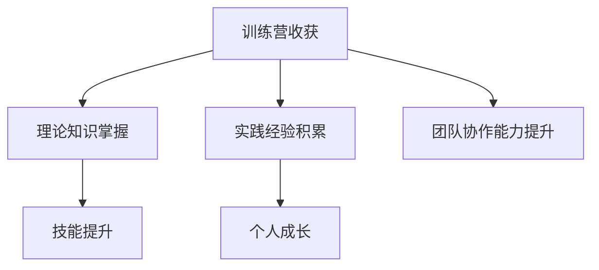

**核心算法原理讲解**

领导力训练营的总结可以通过以下步骤进行理解：

1. **训练营收获**：回顾训练营中学到的知识和技能，总结收获。
2. **理论知识掌握**：评估对领导力理论的理解程度。
3. **技能提升**：评估在沟通技巧、团队管理等方面的进步。
4. **实践经验积累**：总结在训练营中学到的实践经验。
5. **个人成长**：反思个人在领导力方面的成长。
6. **团队协作能力提升**：评估团队协作能力的提升。

**详细讲解与举例说明**

领导力训练营的总结可以通过以下例子进行说明：

- **训练营收获**：一个参与者可能在训练营中掌握了领导力理论，如领导风格、激励理论等，并通过实践提高了自己的沟通技巧和团队管理能力。

- **理论知识掌握**：一个参与者可能通过训练营的学习，深入理解了领导力的核心概念，如变革型领导和交易型领导，并在实践中运用这些理论。

- **技能提升**：一个参与者可能通过训练营的实践，显著提高了自己的沟通技巧，如有效倾听、清晰表达等。

- **实践经验积累**：一个参与者可能通过训练营中的项目实践，积累了宝贵的实践经验，如项目规划、团队协作等。

- **个人成长**：一个参与者可能通过训练营的学习和实践，实现了个人成长，如自我认知、情感管理等。

- **团队协作能力提升**：一个参与者可能通过训练营的学习，提高了团队协作能力，如团队合作、冲突管理等。

### 附录

#### A.1 领导力工具与资源

**核心概念与联系**

领导力工具和资源是提升领导力的关键，以下是这些工具和资源的关键要素和它们之间的关系架构：

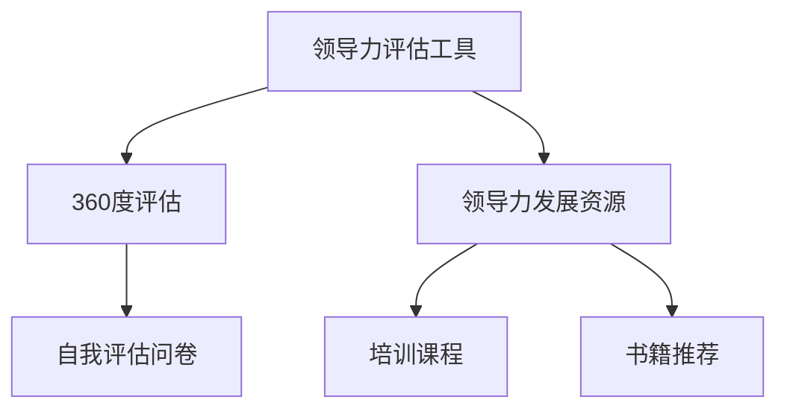

**核心算法原理讲解**

领导力工具与资源的利用可以通过以下步骤进行理解：

1. **领导力评估工具**：使用评估工具，如360度评估和自我评估问卷，了解自己的领导力水平。
2. **领导力发展资源**：利用各种资源，如培训课程和书籍，提升领导力技能。
3. **书籍推荐**：推荐一些经典的领导力书籍，帮助读者深入理解领导力理论。

**详细讲解与举例说明**

领导力工具与资源可以通过以下例子进行说明：

- **领导力评估工具**：一个领导者可能使用360度评估来了解自己的领导力水平。通过这个工具，领导者可以收集来自不同视角的反馈，包括同事、下属和上级的评价，从而全面了解自己的优点和不足。

- **领导力发展资源**：一个领导者可能参加领导力培训课程，如领导力研讨会或工作坊，以提升自己的领导力技能。这些课程通常由专业的培训师授课，涵盖了领导力的各个方面，如沟通技巧、团队建设和管理等。

- **书籍推荐**：一个领导者可能阅读一些经典的领导力书籍，如《领导力五项修炼》、《变革之舞》等，以深入了解领导力的理论和实践。这些书籍提供了丰富的案例和实用的建议，帮助领导者提升自己的领导力水平。

---

### 文章小结

本文通过分析《领导力训练营：84天从门外汉到内行人》一书，详细阐述了领导力发展的全过程。从入门阶段的理论学习，到进阶阶段的模型应用，再到实战阶段的实践探索，文章系统总结了领导力提升的各个关键环节。通过深入探讨个人成长、沟通技巧、领导力模型、决策与问题解决、激励与团队管理等核心内容，结合具体案例，为读者提供了实用且具启发性的领导力提升路径。

在个人成长方面，文章强调了自我认知、情感管理、团队协作和持续学习的重要性。在沟通技巧方面，文章介绍了倾听、表达清晰、非语言沟通和反馈与确认等关键要素。在领导力模型方面，文章详细介绍了命令式领导、授权式领导、变革型领导和交易型领导等常见模型，并讨论了它们在实际中的应用。

决策与问题解决是领导力的核心技能之一，文章介绍了决策的原则和方法，以及问题解决的关键步骤。在激励与团队管理方面，文章探讨了马斯洛需求层次理论、团队建设、目标设定、任务分配、沟通协调和冲突管理等关键要素。

通过实践案例和反思与总结，文章展示了领导力在不同情境中的应用，并提供了实用的领导力提升建议。附录部分则介绍了领导力工具与资源的推荐，帮助读者进一步学习和提升领导力。

总之，本文为读者提供了一条系统且实用的领导力提升路径，通过学习、实践和反思，读者可以逐步提升自己的领导力，成为更加出色的领导者。

### 最佳实践 Tips

1. **设定明确的目标**：在领导力提升过程中，设定明确的目标至关重要。确保目标是具体、可衡量、可实现、相关和有时限的（SMART），这将有助于您有针对性地进行学习和实践。

2. **持续学习和反思**：领导力是一个持续发展的过程，不断学习和反思是提升领导力的关键。定期参加培训课程、阅读相关书籍和文章，并设立反思时间，以评估自己的进步和需要改进的领域。

3. **实践领导力模型**：了解并实践各种领导力模型，如命令式领导、授权式领导、变革型领导和交易型领导。通过实际应用，您将更好地理解不同领导力风格的特点和适用场景。

4. **倾听与沟通**：积极倾听团队成员的意见和需求，并确保您的沟通是清晰、简洁和有针对性的。良好的沟通有助于建立信任和协作，提高团队的整体绩效。

5. **培养团队协作精神**：鼓励团队成员相互协作，共同实现目标。通过组织团队活动、构建团队文化等方式，培养团队成员之间的信任和凝聚力。

6. **勇于面对挑战**：领导力提升过程中，您可能会遇到各种挑战和困难。勇于面对并解决这些问题，将有助于您成长为更加出色的领导者。

7. **保持积极心态**：在面对压力和挑战时，保持积极的心态至关重要。积极的心态有助于您更好地应对困难，并激励团队成员积极面对挑战。

8. **获取反馈与改进**：定期获取团队成员和上级的反馈，了解自己在领导力方面的表现和不足。根据反馈进行改进，以不断提升自己的领导力。

### 注意事项

1. **保持自我反思**：领导力提升是一个持续的过程，需要不断地自我反思和调整。定期评估自己的进步和需要改进的领域，以确保您的领导力不断提升。

2. **合理规划时间**：在领导力提升过程中，合理规划时间至关重要。确保您有足够的时间进行学习和实践，同时也要注意平衡工作与生活，避免过度劳累。

3. **尊重团队成员**：在团队管理和沟通中，尊重团队成员的意见和需求。倾听他们的声音，鼓励他们参与决策，这将有助于提高团队的士气和协作效率。

4. **关注团队成员的成长**：关注团队成员的成长和发展，为他们提供必要的支持和指导。通过培养团队成员的能力，您将提升整个团队的水平。

5. **适应变化**：领导力环境不断变化，领导者需要具备适应变化的能力。不断学习新知识和技能，以应对不断变化的环境和挑战。

### 拓展阅读

- **《领导力五项修炼》**：斯蒂芬·罗宾斯著，详细介绍了领导力的五个核心要素，包括建立信任、激发潜能、展现愿景、传达价值观和打造团队。

- **《变革之舞》**：约翰·科特著，探讨如何通过领导力推动组织变革，实现持续发展和成功。

- **《领导力心理学》**：罗伯特·豪斯著，结合心理学理论，分析领导者的行为和决策，以及如何通过心理学方法提升领导力。

- **《团队协作的艺术》**：唐纳德·舍费尔著，介绍了团队协作的原理和实践，帮助领导者打造高效的团队。

- **《高绩效团队》**：彼得·德鲁克著，提供了构建和管理高绩效团队的策略和方法，适用于各种类型的团队和组织。

---

### 作者信息

作者：AI天才研究院/AI Genius Institute & 禅与计算机程序设计艺术 /Zen And The Art of Computer Programming

AI天才研究院（AI Genius Institute）致力于推动人工智能技术的发展，为全球客户提供创新的人工智能解决方案。研究院汇聚了世界顶尖的人工智能专家，以一步一个脚印的分析推理（LET'S THINK STEP BY STEP）的方法，深入探讨人工智能领域的核心技术，推动人工智能技术的创新和应用。同时，作者也撰写了《禅与计算机程序设计艺术》（Zen And The Art of Computer Programming），该书以其深入浅出的讲解和独特的哲学思想，在全球范围内受到计算机科学爱好者和专业人士的广泛推崇。通过这两本书，作者展现了其在人工智能和计算机科学领域的深厚造诣和独特见解。

