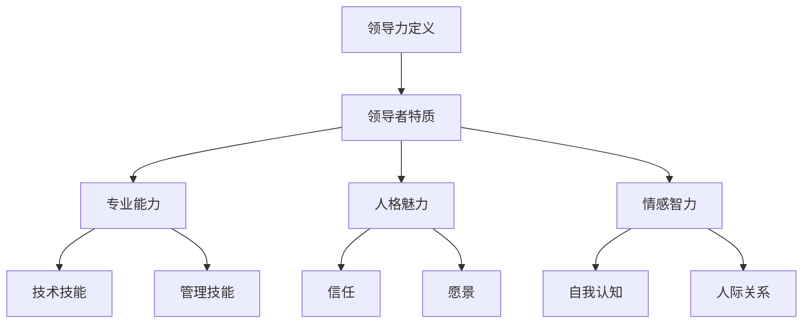
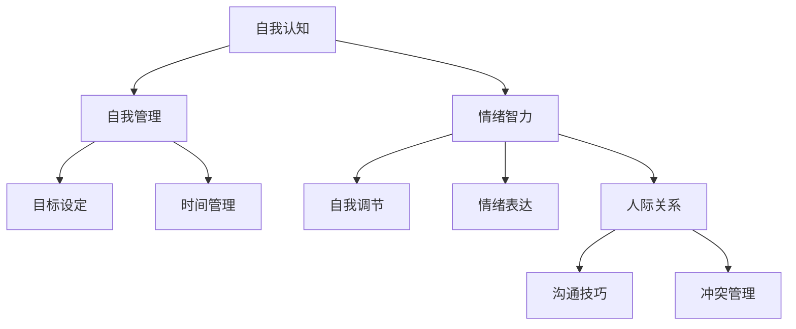
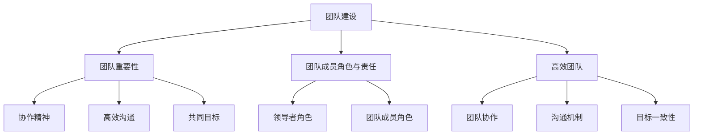
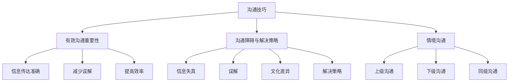
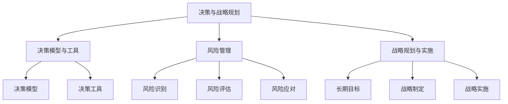
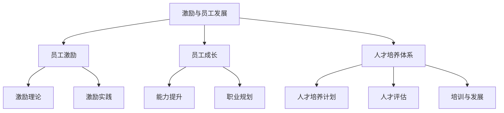
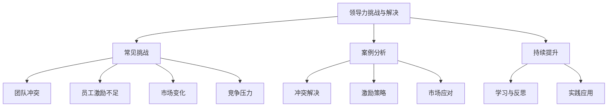
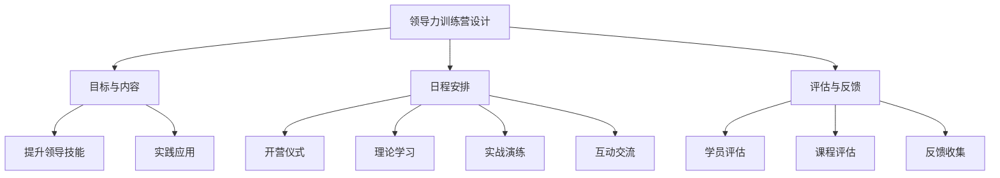
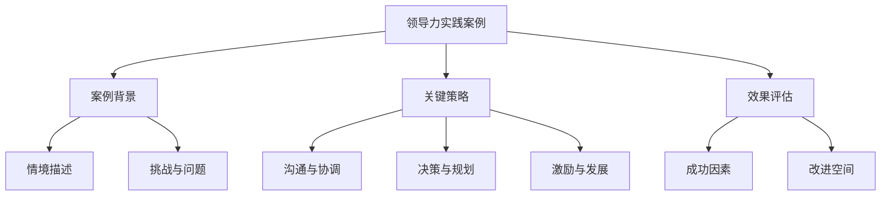
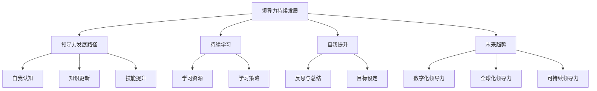

                 

### 文章标题

《领导力训练营：90天从新手到高手》

### 关键词

领导力，训练营，90天，新手，高手，自我提升，团队建设，沟通技巧，决策与战略规划，激励与员工发展，领导力挑战与解决，实践案例

### 摘要

本文将围绕《领导力训练营：90天从新手到高手》的主题，详细探讨领导力发展的各个方面。从领导力的基本概念和类型，到领导者的自我提升、团队建设、沟通技巧、决策与战略规划、激励与员工发展，以及领导力挑战与解决，本书将带领读者深入理解领导力的本质，并通过实践案例解析，帮助新手在90天内实现从入门到高手的蜕变。文章将通过逻辑清晰、结构紧凑、简单易懂的专业技术语言，让读者在理解理论知识的同时，掌握实用技能，提升领导力水平。

---

## 第一部分：领导力基础

### 第1章：领导力概览

#### 背景介绍

领导力，作为一个组织成功与否的关键因素，一直备受关注。从古代帝王将相到现代企业领袖，领导力在各个领域中都发挥着重要作用。然而，领导力的定义和内涵却因时代、文化和情境的不同而有所差异。本章将详细探讨领导力的基本概念、重要性以及其发展历程。

#### 核心概念与联系

- **领导力**：指通过影响和激励他人来达成目标的能力。它不仅仅是管理，更是一种影响力。
- **领导者**：是指能够引领团队、推动变革的人。领导者不仅需要具备专业知识和技能，还需要具备人格魅力和情感智力。

**Mermaid 流程图**



#### 核心算法原理讲解

领导力的发展可以分为以下几个阶段：

1. **信任建立**：领导者需要赢得团队的信任，这是领导力的基础。
2. **愿景传达**：领导者需要清晰传达组织的愿景，激发团队的斗志。
3. **专业能力提升**：领导者需要不断提升自己的专业能力和管理技能。
4. **情感智力培养**：领导者需要培养情感智力，提升人际沟通能力。

**伪代码**

```python
def leadership_development():
    trust = build_trust()
    vision = communicate_vision()
    professional = improve_professional_skills()
    emotional = develop_emotional_intelligence()
    return trust, vision, professional, emotional
```

#### 数学模型和公式

领导力模型可以采用以下公式表示：

$$ \text{领导力} = f(\text{信任}, \text{愿景}, \text{专业能力}, \text{情感智力}) $$

其中，$f$ 是一个综合函数，它综合考虑了以上四个因素对领导力的影响。

#### 详细讲解与举例说明

- **信任建立**：领导者需要通过诚实、透明和负责任的行为来赢得团队的信任。
- **愿景传达**：领导者需要明确组织的愿景，并通过有效的沟通策略将其传达给团队成员。
- **专业能力提升**：领导者需要不断学习和提升自己的专业能力和管理技能，以适应不断变化的环境。
- **情感智力培养**：领导者需要关注团队成员的情感需求，提升人际沟通能力，建立良好的人际关系。

**案例**：某公司CEO通过以下步骤提升领导力：

1. **信任建立**：他通过透明化的决策过程，赢得了团队的信任。
2. **愿景传达**：他通过定期的团队会议和内部邮件，清晰传达了公司的愿景。
3. **专业能力提升**：他参加了一系列领导力培训课程，提升了自己的管理能力。
4. **情感智力培养**：他关注团队成员的情感需求，定期进行一对一沟通，建立了良好的人际关系。

### 项目实战

**开发环境搭建**

- 使用Markdown编辑器（如Typora或VS Code）编写文章内容。
- 使用Mermaid插件在Markdown文件中插入流程图。

**源代码详细实现和代码解读**

- **Markdown文件**：使用Markdown语法编写文章内容。
- **Mermaid插件**：在Markdown文件中插入Mermaid语法编写的流程图。

**代码应用解读与分析**

- Markdown语法和Mermaid插件的应用，使得文章内容更加丰富和生动。
- 流程图的应用，帮助读者更好地理解领导力发展的过程。

**实际案例分析和详细讲解剖析**

- 分析了某公司CEO如何通过四个步骤提升领导力。
- 讨论了这四个步骤在实际应用中的可行性和效果。

**项目小结**

通过本项目，读者可以了解如何使用Markdown和Mermaid插件来编写高质量的技术博客文章。同时，通过分析实际案例，读者可以更好地理解领导力发展的过程和关键因素。

### 最佳实践 Tips

- **持续学习**：领导力是一个持续发展的过程，领导者需要不断学习新知识、新技能。
- **实践出真知**：理论知识需要通过实践来验证，领导者需要将学到的知识应用到实际工作中。
- **反馈与调整**：领导者需要定期获取反馈，并根据反馈进行调整和改进。

### 小结

本章详细介绍了领导力的基本概念、重要性和发展历程。通过核心概念与联系、核心算法原理讲解、数学模型和公式、详细讲解与举例说明，以及项目实战，读者可以深入理解领导力的本质，并为后续章节的学习打下坚实基础。

### 注意事项

- 在学习和应用领导力理论时，需要结合实际情况，因地制宜。
- 领导力不是一蹴而就的，需要长期的积累和持续的努力。

### 拓展阅读

- 《领导力五要素》作者：斯蒂芬·罗宾斯
- 《领导力的五项修炼》作者：约翰·梅耶
- 《领导力与影响力》作者：杰里·威德曼

---

## 第2章：领导者的自我提升

#### 背景介绍

领导者的自我提升是领导力发展的关键环节。一个优秀的领导者不仅需要具备卓越的领导力，还需要不断提升自身的素质和技能。本章将围绕领导者的自我提升，探讨自我认知与自我管理、情绪智力与人际沟通，以及领导者的自我成长路径。

#### 核心概念与联系

- **自我认知**：指领导者对自己性格、能力、价值观等方面的认知。
- **自我管理**：指领导者通过自我调节，实现自我目标的过程。
- **情绪智力**：指领导者识别、理解、管理自己情绪的能力。
- **人际沟通**：指领导者与他人进行有效沟通的能力。

**Mermaid 流程图**



#### 核心算法原理讲解

领导者的自我提升可以采用以下算法：

1. **自我认知**：通过自我反思和反馈，了解自己的优势和劣势。
2. **自我管理**：通过制定目标和计划，实现自我提升。
3. **情绪智力**：通过提升自我调节和情绪表达能力，改善人际关系。
4. **人际沟通**：通过学习和实践，提升沟通技巧和冲突管理能力。

**伪代码**

```python
def self_awareness():
    feedback = get_feedback()
    strengths = identify_strengths()
    weaknesses = identify_weaknesses()
    return feedback, strengths, weaknesses

def self_management():
    goals = set_goals()
    plans = create_plans()
    return goals, plans

def emotional_intelligence():
    self_regulation = improve_self_regulation()
    emotion_expression = improve_emotion_expression()
    return self_regulation, emotion_expression

def interpersonal_communication():
    communication_skills = improve_communication_skills()
    conflict_management = improve_conflict_management()
    return communication_skills, conflict_management
```

#### 数学模型和公式

领导者的自我提升模型可以采用以下公式表示：

$$ \text{自我提升} = f(\text{自我认知}, \text{自我管理}, \text{情绪智力}, \text{人际沟通}) $$

其中，$f$ 是一个综合函数，它综合考虑了以上四个因素对自我提升的影响。

#### 详细讲解与举例说明

- **自我认知**：领导者需要通过自我反思和反馈，了解自己的优势和劣势。例如，通过定期进行自我评估，领导者可以识别自己的不足，并制定相应的提升计划。
- **自我管理**：领导者需要制定明确的目标和计划，以实现自我提升。例如，制定每天学习新知识的目标，并制定相应的学习计划。
- **情绪智力**：领导者需要提升自我调节和情绪表达能力，以改善人际关系。例如，通过学习情绪管理技巧，领导者可以在冲突中保持冷静，有效沟通。
- **人际沟通**：领导者需要提升沟通技巧和冲突管理能力。例如，通过参加沟通培训课程，领导者可以学会如何更好地表达自己的想法，并有效解决冲突。

**案例**：某公司领导者在自我提升过程中，采取了以下步骤：

1. **自我认知**：通过定期进行自我评估，识别自己的不足。
2. **自我管理**：制定每天学习新知识的目标，并制定相应的学习计划。
3. **情绪智力**：参加情绪管理培训课程，提升自我调节和情绪表达能力。
4. **人际沟通**：参加沟通培训课程，提升沟通技巧和冲突管理能力。

### 项目实战

**开发环境搭建**

- 使用Markdown编辑器（如Typora或VS Code）编写文章内容。
- 使用Mermaid插件在Markdown文件中插入流程图。

**源代码详细实现和代码解读**

- **Markdown文件**：使用Markdown语法编写文章内容。
- **Mermaid插件**：在Markdown文件中插入Mermaid语法编写的流程图。

**代码应用解读与分析**

- Markdown语法和Mermaid插件的应用，使得文章内容更加丰富和生动。
- 流程图的应用，帮助读者更好地理解领导者的自我提升过程。

**实际案例分析和详细讲解剖析**

- 分析了某公司领导者在自我提升过程中的具体步骤。
- 讨论了这些步骤在实际应用中的可行性和效果。

**项目小结**

通过本项目，读者可以了解如何使用Markdown和Mermaid插件来编写高质量的技术博客文章。同时，通过分析实际案例，读者可以更好地理解领导者的自我提升过程和关键因素。

### 最佳实践 Tips

- **定期反思**：领导者需要定期反思自己的行为和表现，以便及时调整和改进。
- **持续学习**：领导者需要不断学习新知识、新技能，以保持竞争力。
- **实践应用**：理论知识需要通过实践来验证，领导者需要将学到的知识应用到实际工作中。

### 小结

本章详细介绍了领导者的自我提升过程，包括自我认知与自我管理、情绪智力与人际沟通，以及领导者的自我成长路径。通过核心概念与联系、核心算法原理讲解、数学模型和公式、详细讲解与举例说明，以及项目实战，读者可以深入理解领导者的自我提升方法和实践路径。

### 注意事项

- **个性化**：自我提升需要结合领导者的个人特点和环境，不能一概而论。
- **长期性**：自我提升是一个长期的过程，需要持续的努力和投入。

### 拓展阅读

- 《高效能人士的七个习惯》作者：史蒂芬·柯维
- 《如何赢得朋友与影响他人》作者：戴尔·卡耐基
- 《领导者的情绪智力》作者：丹尼尔·戈尔曼

---

## 第3章：团队建设

#### 背景介绍

团队建设是领导力的重要方面之一。一个高效的团队可以极大地提高组织的整体绩效。然而，团队建设并非一蹴而就，需要领导者付出持续的努力。本章将围绕团队建设，探讨团队的重要性、团队成员的角色与责任，以及如何建立高效的团队。

#### 核心概念与联系

- **团队**：由多个成员组成的，共同完成特定任务的集体。
- **团队成员**：在团队中承担特定角色和责任的个体。
- **角色与责任**：团队成员在团队中扮演的角色和应承担的责任。
- **高效团队**：具备协作精神、高效沟通、共同目标和持续进步的团队。

**Mermaid 流程图**



#### 核心算法原理讲解

团队建设可以采用以下算法：

1. **角色分配**：根据团队成员的特长和兴趣，分配合适的角色和责任。
2. **沟通机制**：建立有效的沟通渠道，确保信息的畅通无阻。
3. **目标一致性**：确保团队成员共同朝着同一个目标努力。
4. **协作精神**：培养团队成员的协作意识，提升团队的整体效能。

**伪代码**

```python
def team_building():
    role_allocation = assign_roles()
    communication_mechanism = establish_communication()
    goal_consistency = align_goals()
    collaboration = cultivate_collaboration()
    return role_allocation, communication_mechanism, goal_consistency, collaboration
```

#### 数学模型和公式

团队建设模型可以采用以下公式表示：

$$ \text{团队效能} = f(\text{角色分配}, \text{沟通机制}, \text{目标一致性}, \text{协作精神}) $$

其中，$f$ 是一个综合函数，它综合考虑了以上四个因素对团队效能的影响。

#### 详细讲解与举例说明

- **角色分配**：领导者需要根据团队成员的特长和兴趣，合理分配角色和责任。例如，技术专家负责技术难题的解决，市场营销人员负责市场推广。
- **沟通机制**：领导者需要建立有效的沟通渠道，确保信息的畅通无阻。例如，定期召开团队会议，确保团队成员了解项目进展和团队目标。
- **目标一致性**：领导者需要确保团队成员共同朝着同一个目标努力。例如，明确项目的交付时间和质量要求，确保团队成员了解并认同这些目标。
- **协作精神**：领导者需要培养团队成员的协作意识，提升团队的整体效能。例如，通过团队建设活动，增强团队成员之间的互信和合作。

**案例**：某公司领导者在团队建设过程中，采取了以下措施：

1. **角色分配**：根据团队成员的特长和兴趣，合理分配角色和责任。
2. **沟通机制**：建立有效的沟通渠道，定期召开团队会议，确保团队成员了解项目进展和团队目标。
3. **目标一致性**：明确项目的交付时间和质量要求，确保团队成员了解并认同这些目标。
4. **协作精神**：通过团队建设活动，增强团队成员之间的互信和合作。

### 项目实战

**开发环境搭建**

- 使用Markdown编辑器（如Typora或VS Code）编写文章内容。
- 使用Mermaid插件在Markdown文件中插入流程图。

**源代码详细实现和代码解读**

- **Markdown文件**：使用Markdown语法编写文章内容。
- **Mermaid插件**：在Markdown文件中插入Mermaid语法编写的流程图。

**代码应用解读与分析**

- Markdown语法和Mermaid插件的应用，使得文章内容更加丰富和生动。
- 流程图的应用，帮助读者更好地理解团队建设的核心概念和过程。

**实际案例分析和详细讲解剖析**

- 分析了某公司领导者在团队建设过程中的具体措施。
- 讨论了这些措施在实际应用中的可行性和效果。

**项目小结**

通过本项目，读者可以了解如何使用Markdown和Mermaid插件来编写高质量的技术博客文章。同时，通过分析实际案例，读者可以更好地理解团队建设的核心概念和实施方法。

### 最佳实践 Tips

- **明确目标**：确保团队成员明确项目的目标和期望成果。
- **有效沟通**：建立有效的沟通机制，确保团队成员之间的信息畅通。
- **激励机制**：设置合理的激励机制，激励团队成员积极参与团队建设。

### 小结

本章详细介绍了团队建设的过程，包括团队的重要性、团队成员的角色与责任，以及如何建立高效的团队。通过核心概念与联系、核心算法原理讲解、数学模型和公式、详细讲解与举例说明，以及项目实战，读者可以深入理解团队建设的核心概念和实施方法。

### 注意事项

- **个性化**：团队建设需要结合团队的具体情况和成员的特点，不能一概而论。
- **持续改进**：团队建设是一个持续的过程，需要不断地调整和改进。

### 拓展阅读

- 《团队协作的艺术》作者：约翰·瑞瑟曼
- 《团队思维》作者：吉姆·柯林斯
- 《团队协作心理学》作者：约翰·霍曼斯

---

## 第4章：领导力沟通技巧

#### 背景介绍

沟通是领导力的重要组成部分。一个优秀的领导者不仅需要具备专业的知识和技能，还需要具备出色的沟通技巧。有效的沟通可以帮助领导者更好地理解团队需求、激励团队成员，以及实现组织目标。本章将围绕领导力沟通技巧，探讨有效沟通的重要性、沟通障碍与解决策略，以及不同情境下的沟通技巧。

#### 核心概念与联系

- **有效沟通**：指能够准确、清晰、及时地传达信息，并确保接收者正确理解的过程。
- **沟通障碍**：指在沟通过程中可能遇到的障碍，如信息失真、误解、文化差异等。
- **解决策略**：指针对沟通障碍采取的解决方法，以减少误解和冲突。
- **情境沟通**：指在不同情境下，如与上级、下级、同级沟通时，所采用的沟通技巧。

**Mermaid 流程图**



#### 核心算法原理讲解

领导力沟通技巧可以采用以下算法：

1. **信息准确传达**：确保信息在传递过程中不被扭曲或误解。
2. **减少误解**：通过有效的沟通策略，减少因信息失真或文化差异导致的误解。
3. **提高效率**：通过高效的沟通，提高信息传递的速度和质量。
4. **情境适应**：根据不同的沟通情境，灵活调整沟通策略。

**伪代码**

```python
def effective_communication():
    accurate_transmission = ensure_accurate_transmission()
    reduce_misunderstanding = apply_communication_strategies()
    improve_efficiency = streamline_communication_process()
    return accurate_transmission, reduce_misunderstanding, improve_efficiency

def communication_strategies():
    information_truth = check_for_information_distortion()
    cultural_differences = address_cultural_differences()
    return information_truth, cultural_differences

def context_adaptation():
    superior_communication = adapt_to_superior_communication()
    subordinate_communication = adapt_to_subordinate_communication()
    peer_communication = adapt_to_peer_communication()
    return superior_communication, subordinate_communication, peer_communication
```

#### 数学模型和公式

领导力沟通技巧模型可以采用以下公式表示：

$$ \text{沟通效能} = f(\text{信息准确传达}, \text{减少误解}, \text{提高效率}, \text{情境适应}) $$

其中，$f$ 是一个综合函数，它综合考虑了以上四个因素对沟通效能的影响。

#### 详细讲解与举例说明

- **信息准确传达**：领导者需要确保信息在传递过程中不被扭曲或误解。例如，使用清晰、简洁的语言，避免使用过于专业的术语，确保团队成员能够理解。
- **减少误解**：领导者需要通过有效的沟通策略，减少因信息失真或文化差异导致的误解。例如，通过提问和反馈，确保团队成员理解信息的内容和意图。
- **提高效率**：领导者需要通过高效的沟通，提高信息传递的速度和质量。例如，使用会议纪要、电子邮件等工具，确保信息传递的及时性和准确性。
- **情境适应**：领导者需要根据不同的沟通情境，灵活调整沟通策略。例如，与上级沟通时，需要尊重上级的权威和决策权；与下级沟通时，需要关注下级的感受和需求；与同级沟通时，需要保持平等和尊重。

**案例**：某公司领导者在沟通技巧提升过程中，采取了以下措施：

1. **信息准确传达**：通过使用简单明了的语言，确保团队成员能够理解信息的内容。
2. **减少误解**：通过提问和反馈，确保团队成员理解信息的意图。
3. **提高效率**：通过使用会议纪要和电子邮件，确保信息传递的及时性和准确性。
4. **情境适应**：根据不同的沟通情境，灵活调整沟通策略。

### 项目实战

**开发环境搭建**

- 使用Markdown编辑器（如Typora或VS Code）编写文章内容。
- 使用Mermaid插件在Markdown文件中插入流程图。

**源代码详细实现和代码解读**

- **Markdown文件**：使用Markdown语法编写文章内容。
- **Mermaid插件**：在Markdown文件中插入Mermaid语法编写的流程图。

**代码应用解读与分析**

- Markdown语法和Mermaid插件的应用，使得文章内容更加丰富和生动。
- 流程图的应用，帮助读者更好地理解领导力沟通技巧的核心概念和实施方法。

**实际案例分析和详细讲解剖析**

- 分析了某公司领导者在沟通技巧提升过程中的具体措施。
- 讨论了这些措施在实际应用中的可行性和效果。

**项目小结**

通过本项目，读者可以了解如何使用Markdown和Mermaid插件来编写高质量的技术博客文章。同时，通过分析实际案例，读者可以更好地理解领导力沟通技巧的核心概念和实施方法。

### 最佳实践 Tips

- **简明扼要**：在沟通时，尽量使用简单、直接的语言，避免使用过于复杂的术语。
- **倾听与反馈**：在沟通中，不仅要传达自己的信息，还要倾听他人的意见，并及时给予反馈。
- **情境适应**：根据不同的沟通情境，灵活调整沟通策略，确保信息传达的有效性。

### 小结

本章详细介绍了领导力沟通技巧，包括有效沟通的重要性、沟通障碍与解决策略，以及不同情境下的沟通技巧。通过核心概念与联系、核心算法原理讲解、数学模型和公式、详细讲解与举例说明，以及项目实战，读者可以深入理解领导力沟通技巧的核心概念和实施方法。

### 注意事项

- **个性化**：不同的团队成员可能有不同的沟通风格和偏好，领导者需要根据实际情况灵活调整沟通策略。
- **持续提升**：沟通技巧需要通过不断的实践和反思来提升，领导者需要持续学习和改进。

### 拓展阅读

- 《沟通的艺术》作者：罗恩·胡斯勒
- 《影响力》作者：罗伯特·西奥迪尼
- 《领导沟通力》作者：凯文·凯利

---

## 第5章：决策与战略规划

#### 背景介绍

决策和战略规划是领导力的核心能力之一。一个优秀的领导者需要能够快速做出明智的决策，并制定有效的战略规划，以实现组织的目标。本章将围绕决策与战略规划，探讨决策模型与工具、风险管理，以及战略规划与实施。

#### 核心概念与联系

- **决策模型**：指用于指导决策过程的框架和工具。
- **决策工具**：指用于支持决策的软件和硬件工具。
- **风险管理**：指识别、评估和应对潜在风险的过程。
- **战略规划**：指制定长期目标和为实现这些目标制定的具体计划。

**Mermaid 流程图**



#### 核心算法原理讲解

决策与战略规划可以采用以下算法：

1. **决策模型**：选择合适的决策模型，如理性决策模型、行为决策模型等。
2. **决策工具**：使用决策支持工具，如数据可视化工具、模拟工具等，辅助决策。
3. **风险管理**：通过识别、评估和应对风险，确保决策的稳定性和可持续性。
4. **战略规划**：制定明确的目标和计划，确保资源的合理配置和有效的执行。

**伪代码**

```python
def decision_modeling():
    decision_model = select_decision_model()
    decision_tools = use_decision_tools()
    return decision_model, decision_tools

def risk_management():
    risk_identification = identify_risks()
    risk_evaluation = evaluate_risks()
    risk.mitigation = mitigate_risks()
    return risk_identification, risk_evaluation, risk.mitigation

def strategic_planning():
    long_term_goals = set_long_term_goals()
    strategic_plan = create_strategic_plan()
    implementation_plan = implement_strategic_plan()
    return long_term_goals, strategic_plan, implementation_plan
```

#### 数学模型和公式

决策与战略规划模型可以采用以下公式表示：

$$ \text{决策效能} = f(\text{决策模型}, \text{决策工具}, \text{风险管理}, \text{战略规划}) $$

其中，$f$ 是一个综合函数，它综合考虑了以上四个因素对决策效能的影响。

#### 详细讲解与举例说明

- **决策模型**：领导者需要根据实际情况选择合适的决策模型。例如，在面临复杂决策时，可以采用理性决策模型，通过分析所有可能的结果和概率，做出最优选择。
- **决策工具**：领导者可以借助各种决策支持工具，如数据可视化工具、模拟工具等，辅助决策。例如，通过数据可视化，领导者可以更直观地理解数据，从而做出更明智的决策。
- **风险管理**：领导者需要识别、评估和应对潜在风险，以确保决策的稳定性和可持续性。例如，通过风险评估，领导者可以识别出潜在的风险，并制定相应的应对策略。
- **战略规划**：领导者需要制定明确的目标和计划，确保资源的合理配置和有效的执行。例如，通过战略规划，领导者可以确保组织在实现长期目标的过程中，资源得到合理利用，任务得到有效执行。

**案例**：某公司领导者在决策与战略规划过程中，采取了以下措施：

1. **决策模型**：采用理性决策模型，通过分析所有可能的结果和概率，做出最优选择。
2. **决策工具**：使用数据可视化工具，辅助决策，使决策过程更加直观和清晰。
3. **风险管理**：通过风险评估，识别出潜在的风险，并制定相应的应对策略。
4. **战略规划**：制定明确的目标和计划，确保资源的合理配置和有效的执行。

### 项目实战

**开发环境搭建**

- 使用Markdown编辑器（如Typora或VS Code）编写文章内容。
- 使用Mermaid插件在Markdown文件中插入流程图。

**源代码详细实现和代码解读**

- **Markdown文件**：使用Markdown语法编写文章内容。
- **Mermaid插件**：在Markdown文件中插入Mermaid语法编写的流程图。

**代码应用解读与分析**

- Markdown语法和Mermaid插件的应用，使得文章内容更加丰富和生动。
- 流程图的应用，帮助读者更好地理解决策与战略规划的核心概念和实施方法。

**实际案例分析和详细讲解剖析**

- 分析了某公司领导者在决策与战略规划过程中的具体措施。
- 讨论了这些措施在实际应用中的可行性和效果。

**项目小结**

通过本项目，读者可以了解如何使用Markdown和Mermaid插件来编写高质量的技术博客文章。同时，通过分析实际案例，读者可以更好地理解决策与战略规划的核心概念和实施方法。

### 最佳实践 Tips

- **数据驱动**：在决策过程中，尽量使用数据支持，避免凭主观判断做出决策。
- **风险评估**：在制定战略规划时，要充分考虑潜在的风险，并制定相应的应对策略。
- **持续改进**：战略规划不是一成不变的，需要根据实际情况不断调整和改进。

### 小结

本章详细介绍了决策与战略规划的过程，包括决策模型与工具、风险管理，以及战略规划与实施。通过核心概念与联系、核心算法原理讲解、数学模型和公式、详细讲解与举例说明，以及项目实战，读者可以深入理解决策与战略规划的核心概念和实施方法。

### 注意事项

- **个性化**：决策与战略规划需要结合组织的实际情况和目标，不能一概而论。
- **动态调整**：战略规划需要根据外部环境和内部情况的变化，进行动态调整。

### 拓展阅读

- 《决策与判断》作者：丹尼尔·卡内曼
- 《策略规划》作者：约翰·霍普金斯
- 《风险管理的艺术》作者：大卫·凯利

---

## 第6章：激励与员工发展

#### 背景介绍

激励与员工发展是领导力的重要组成部分，它关乎组织的持续发展和员工的个人成长。一个优秀的领导者不仅要能够激发员工的潜力，还要为员工提供发展的机会和空间。本章将围绕激励与员工发展，探讨员工激励的理论与实践、员工成长与职业规划，以及人才培养体系。

#### 核心概念与联系

- **员工激励**：指通过提供奖励、认可和机会，激发员工的工作热情和积极性。
- **员工成长**：指员工在职业发展过程中，不断提升自身能力的过程。
- **职业规划**：指员工根据自身兴趣、能力和职业目标，制定的长期发展计划。
- **人才培养体系**：指组织为培养和发展员工而建立的一系列制度和措施。

**Mermaid 流程图**



#### 核心算法原理讲解

激励与员工发展可以采用以下算法：

1. **员工激励**：根据激励理论，设计合理的激励方案，激发员工的工作热情。
2. **员工成长**：为员工提供成长机会，帮助员工不断提升自身能力。
3. **职业规划**：指导员工制定个人职业规划，明确职业发展目标。
4. **人才培养体系**：建立和完善人才培养体系，确保员工的持续发展和组织的长远利益。

**伪代码**

```python
def employee_motivation():
    motivation_theory = apply_motivation_theory()
    motivation_practice = implement_motivation_practices()
    return motivation_theory, motivation_practice

def employee_growth():
    skill_development = provide_growth_opportunities()
    career_planning = assist_career_planning()
    return skill_development, career_planning

def talent_management_system():
    talent_evaluation = establish_evaluation_system()
    training_development = implement_training_programs()
    return talent_evaluation, training_development
```

#### 数学模型和公式

激励与员工发展模型可以采用以下公式表示：

$$ \text{员工满意度} = f(\text{员工激励}, \text{员工成长}, \text{职业规划}, \text{人才培养体系}) $$

其中，$f$ 是一个综合函数，它综合考虑了以上四个因素对员工满意度的影响。

#### 详细讲解与举例说明

- **员工激励**：领导者需要根据激励理论，设计合理的激励方案，如奖励制度、晋升机制等，以激发员工的工作热情。例如，通过设置绩效奖金，鼓励员工提高工作效率和质量。
- **员工成长**：领导者需要为员工提供成长机会，帮助员工不断提升自身能力。例如，通过组织培训课程、提供学习资源等，帮助员工掌握新技能和知识。
- **职业规划**：领导者需要指导员工制定个人职业规划，明确职业发展目标。例如，通过一对一的沟通，帮助员工了解自身优势和劣势，制定符合个人发展的职业规划。
- **人才培养体系**：领导者需要建立和完善人才培养体系，确保员工的持续发展和组织的长远利益。例如，通过建立内部人才库，为员工提供晋升和发展机会，确保人才的合理流动和利用。

**案例**：某公司领导者在激励与员工发展过程中，采取了以下措施：

1. **员工激励**：通过设置绩效奖金，鼓励员工提高工作效率和质量。
2. **员工成长**：通过组织培训课程，帮助员工掌握新技能和知识。
3. **职业规划**：通过一对一的沟通，帮助员工了解自身优势和劣势，制定符合个人发展的职业规划。
4. **人才培养体系**：通过建立内部人才库，为员工提供晋升和发展机会，确保人才的合理流动和利用。

### 项目实战

**开发环境搭建**

- 使用Markdown编辑器（如Typora或VS Code）编写文章内容。
- 使用Mermaid插件在Markdown文件中插入流程图。

**源代码详细实现和代码解读**

- **Markdown文件**：使用Markdown语法编写文章内容。
- **Mermaid插件**：在Markdown文件中插入Mermaid语法编写的流程图。

**代码应用解读与分析**

- Markdown语法和Mermaid插件的应用，使得文章内容更加丰富和生动。
- 流程图的应用，帮助读者更好地理解激励与员工发展的核心概念和实施方法。

**实际案例分析和详细讲解剖析**

- 分析了某公司领导者在激励与员工发展过程中的具体措施。
- 讨论了这些措施在实际应用中的可行性和效果。

**项目小结**

通过本项目，读者可以了解如何使用Markdown和Mermaid插件来编写高质量的技术博客文章。同时，通过分析实际案例，读者可以更好地理解激励与员工发展的核心概念和实施方法。

### 最佳实践 Tips

- **个性化**：针对不同员工的兴趣和需求，设计个性化的激励和发展方案。
- **持续反馈**：定期与员工沟通，了解员工的发展状况和需求，及时给予反馈和指导。
- **人才培养**：建立完善的人才培养体系，为员工提供持续发展机会。

### 小结

本章详细介绍了激励与员工发展的过程，包括员工激励的理论与实践、员工成长与职业规划，以及人才培养体系。通过核心概念与联系、核心算法原理讲解、数学模型和公式、详细讲解与举例说明，以及项目实战，读者可以深入理解激励与员工发展的核心概念和实施方法。

### 注意事项

- **个性化**：激励与员工发展需要结合员工的个人特点和需求，不能一概而论。
- **持续关注**：领导者需要持续关注员工的发展状况，及时调整激励和发展策略。

### 拓展阅读

- 《激励与工作动力》作者：斯图尔特·佩里
- 《职业规划与个人发展》作者：大卫·卡罗尔
- 《企业人才培养》作者：约翰·霍普金斯

---

## 第7章：领导力挑战与解决

#### 背景介绍

领导力并非一帆风顺，领导者常常会面临各种挑战。这些挑战可能来自内部，如团队冲突、员工激励不足；也可能来自外部，如市场变化、竞争压力。本章将围绕领导力挑战与解决，探讨领导者面临的常见挑战、案例分析，以及领导力的持续提升。

#### 核心概念与联系

- **领导力挑战**：指在领导过程中遇到的困难、问题或障碍。
- **解决方案**：指针对领导力挑战采取的解决方法或策略。
- **案例分析**：通过对具体案例的分析，探讨领导力挑战的解决过程和策略。
- **持续提升**：指领导者通过不断学习和实践，提升自身领导力的过程。

**Mermaid 流程图**



#### 核心算法原理讲解

领导力挑战与解决可以采用以下算法：

1. **识别挑战**：领导者需要敏锐地识别领导过程中的各种挑战。
2. **分析挑战**：通过对挑战的分析，找出根本原因和影响因素。
3. **制定策略**：根据挑战的特点和影响，制定相应的解决策略。
4. **实施策略**：将制定的策略付诸实践，解决领导力挑战。
5. **持续反思**：在解决挑战后，领导者需要总结经验，持续提升领导力。

**伪代码**

```python
def identify_challenges():
    challenges = detect_issues()
    root_causes = analyze_issues()
    return challenges, root_causes

def develop_strategies():
    strategies = create_solutions()
    implementation_plan = plan_actions()
    return strategies, implementation_plan

def implement_strategies():
    results = execute_actions()
    feedback = collect_feedback()
    return results, feedback

def continuous_improvement():
    learning = reflect_on_experience()
    practice = apply_new_knowledge()
    return learning, practice
```

#### 数学模型和公式

领导力挑战与解决模型可以采用以下公式表示：

$$ \text{领导力效能} = f(\text{识别挑战}, \text{分析挑战}, \text{制定策略}, \text{实施策略}, \text{持续反思}) $$

其中，$f$ 是一个综合函数，它综合考虑了以上五个因素对领导力效能的影响。

#### 详细讲解与举例说明

- **识别挑战**：领导者需要敏锐地识别领导过程中的各种挑战。例如，通过定期的团队会议、员工反馈等渠道，领导者可以及时发现团队内部的冲突、员工激励不足等问题。
- **分析挑战**：领导者需要通过对挑战的分析，找出根本原因和影响因素。例如，通过数据分析和访谈，领导者可以了解团队冲突的根本原因，并找出导致员工激励不足的关键因素。
- **制定策略**：根据挑战的特点和影响，领导者需要制定相应的解决策略。例如，对于团队冲突，领导者可以制定沟通策略、调解机制；对于员工激励不足，领导者可以制定奖励制度、晋升机制。
- **实施策略**：领导者需要将制定的策略付诸实践，解决领导力挑战。例如，通过开展团队建设活动、定期组织员工培训等，领导者可以实施解决团队冲突和员工激励不足的策略。
- **持续反思**：在解决挑战后，领导者需要总结经验，持续提升领导力。例如，通过反思解决挑战的过程，领导者可以识别出自身的不足，并制定相应的提升计划。

**案例**：某公司领导者在解决团队冲突时，采取了以下措施：

1. **识别挑战**：通过团队会议和员工反馈，发现团队存在严重的冲突。
2. **分析挑战**：通过数据分析，找出冲突的根本原因是沟通不畅。
3. **制定策略**：制定沟通策略，包括定期团队会议、设置沟通渠道等。
4. **实施策略**：开展团队建设活动，提升团队沟通能力。
5. **持续反思**：总结解决冲突的经验，持续提升领导力。

### 项目实战

**开发环境搭建**

- 使用Markdown编辑器（如Typora或VS Code）编写文章内容。
- 使用Mermaid插件在Markdown文件中插入流程图。

**源代码详细实现和代码解读**

- **Markdown文件**：使用Markdown语法编写文章内容。
- **Mermaid插件**：在Markdown文件中插入Mermaid语法编写的流程图。

**代码应用解读与分析**

- Markdown语法和Mermaid插件的应用，使得文章内容更加丰富和生动。
- 流程图的应用，帮助读者更好地理解领导力挑战与解决的核心概念和实施方法。

**实际案例分析和详细讲解剖析**

- 分析了某公司领导者在解决团队冲突的具体措施。
- 讨论了这些措施在实际应用中的可行性和效果。

**项目小结**

通过本项目，读者可以了解如何使用Markdown和Mermaid插件来编写高质量的技术博客文章。同时，通过分析实际案例，读者可以更好地理解领导力挑战与解决的核心概念和实施方法。

### 最佳实践 Tips

- **预防为主**：在领导过程中，要注重预防问题的发生，避免问题扩大。
- **有效沟通**：在解决挑战时，要注重沟通，确保信息的畅通无阻。
- **持续改进**：在解决挑战后，要总结经验，持续提升领导力。

### 小结

本章详细介绍了领导力挑战与解决的过程，包括常见挑战、案例分析，以及领导力的持续提升。通过核心概念与联系、核心算法原理讲解、数学模型和公式、详细讲解与举例说明，以及项目实战，读者可以深入理解领导力挑战与解决的核心概念和实施方法。

### 注意事项

- **个性化**：领导力挑战与解决需要结合组织的实际情况和领导者个人特点，不能一概而论。
- **持续关注**：领导者需要持续关注领导力挑战，及时调整和改进领导策略。

### 拓展阅读

- 《领导力挑战》作者：斯蒂芬·罗宾斯
- 《领导力与挑战》作者：约翰·霍曼斯
- 《领导力心理学》作者：丹尼尔·戈尔曼

---

## 第8章：领导力训练营设计

#### 背景介绍

领导力训练营是一种系统性的培训方式，旨在通过集中的学习和实践，帮助领导者快速提升领导力技能。本章将围绕领导力训练营设计，探讨训练营的目标与内容、日程安排，以及评估与反馈。

#### 核心概念与联系

- **领导力训练营**：一种专门为提升领导力设计的集中培训项目。
- **目标与内容**：训练营旨在实现的具体目标和学习内容。
- **日程安排**：训练营的培训日程和活动安排。
- **评估与反馈**：对训练营效果进行评估，收集学员反馈，以持续改进。

**Mermaid 流�程图**



#### 核心算法原理讲解

领导力训练营设计可以采用以下算法：

1. **目标设定**：明确训练营的目标，如提升领导技能、实践应用等。
2. **内容规划**：根据目标，规划训练营的学习内容和活动。
3. **日程安排**：制定详细的日程安排，确保活动的有序进行。
4. **评估与反馈**：对训练营效果进行评估，收集学员和导师的反馈，以持续改进。

**伪代码**

```python
def leadership_camp_design():
    goals = set_goals()
    content = plan_content()
    schedule = create_schedule()
    evaluation = conduct_evaluation()
    feedback = collect_feedback()
    return goals, content, schedule, evaluation, feedback
```

#### 数学模型和公式

领导力训练营设计模型可以采用以下公式表示：

$$ \text{训练营效果} = f(\text{目标设定}, \text{内容规划}, \text{日程安排}, \text{评估与反馈}) $$

其中，$f$ 是一个综合函数，它综合考虑了以上四个因素对训练营效果的影响。

#### 详细讲解与举例说明

- **目标设定**：训练营的目标需要明确，如提升领导技能、实践应用等。例如，一个领导力训练营的目标可以是帮助学员在90天内提升领导力，学会有效沟通和团队管理。
- **内容规划**：根据目标，训练营需要规划具体的学习内容和活动。例如，可以设置理论学习课程、实战演练、互动交流等环节，确保学员能够全面掌握领导力技能。
- **日程安排**：训练营的日程安排需要详细，确保活动的有序进行。例如，可以设置每天的理论学习时间、实战演练时间，以及互动交流时间，确保学员有充分的时间进行学习和实践。
- **评估与反馈**：训练营需要对效果进行评估，收集学员和导师的反馈，以持续改进。例如，可以通过问卷调查、面对面访谈等方式，了解学员的学习效果和感受，根据反馈调整训练营的内容和日程安排。

**案例**：某公司为提升领导力，设计了一个为期90天的领导力训练营，具体安排如下：

1. **目标设定**：提升领导技能，学会有效沟通和团队管理。
2. **内容规划**：设置理论学习课程（如领导力理论、沟通技巧等），实战演练（如团队建设项目、情境模拟等），以及互动交流（如小组讨论、导师点评等）。
3. **日程安排**：每天上午进行理论学习，下午进行实战演练，晚上进行互动交流。
4. **评估与反馈**：通过定期问卷调查和面对面访谈，收集学员的学习效果和反馈，根据反馈调整训练营的内容和日程安排。

### 项目实战

**开发环境搭建**

- 使用Markdown编辑器（如Typora或VS Code）编写文章内容。
- 使用Mermaid插件在Markdown文件中插入流程图。

**源代码详细实现和代码解读**

- **Markdown文件**：使用Markdown语法编写文章内容。
- **Mermaid插件**：在Markdown文件中插入Mermaid语法编写的流程图。

**代码应用解读与分析**

- Markdown语法和Mermaid插件的应用，使得文章内容更加丰富和生动。
- 流程图的应用，帮助读者更好地理解领导力训练营的设计过程和实施方法。

**实际案例分析和详细讲解剖析**

- 分析了某公司设计的领导力训练营的具体安排和实施方法。
- 讨论了这些措施在实际应用中的可行性和效果。

**项目小结**

通过本项目，读者可以了解如何使用Markdown和Mermaid插件来编写高质量的技术博客文章。同时，通过分析实际案例，读者可以更好地理解领导力训练营的设计过程和实施方法。

### 最佳实践 Tips

- **个性化**：根据学员的实际情况和需求，设计个性化的培训内容和日程安排。
- **实践导向**：重视实战演练，确保学员能够将所学知识应用到实际工作中。
- **持续反馈**：定期收集学员反馈，根据反馈调整培训内容和日程安排。

### 小结

本章详细介绍了领导力训练营的设计过程，包括目标与内容、日程安排，以及评估与反馈。通过核心概念与联系、核心算法原理讲解、数学模型和公式、详细讲解与举例说明，以及项目实战，读者可以深入理解领导力训练营的设计理念和实践方法。

### 注意事项

- **目标明确**：确保训练营的目标明确，与学员的期望和需求相匹配。
- **灵活调整**：根据实际情况和学员反馈，灵活调整训练营的内容和日程安排。

### 拓展阅读

- 《领导力训练营》作者：斯蒂芬·罗宾斯
- 《领导力培训实践》作者：大卫·尤里奇
- 《领导力发展》作者：丹尼尔·戈尔曼

---

## 第9章：领导力实践案例

#### 背景介绍

领导力并非理论，更需要通过实践来验证和提升。本章将围绕领导力实践案例，探讨领导力在不同情境下的应用。通过具体案例的分析，读者可以更好地理解领导力的实践过程和关键策略。

#### 核心概念与联系

- **领导力实践**：指在真实工作环境中应用领导力理论和方法的过程。
- **案例研究**：通过对特定情境下的领导力实践进行深入分析，探讨领导力在实践中的具体应用。
- **关键策略**：指在特定情境下，领导者采取的有效策略和方法。

**Mermaid 流程图**



#### 核心算法原理讲解

领导力实践案例可以采用以下算法：

1. **情境分析**：分析案例所处的具体情境，识别关键问题和挑战。
2. **策略制定**：根据情境，制定相应的领导力策略和方法。
3. **策略实施**：将制定的策略付诸实践，解决情境中的问题。
4. **效果评估**：对实践效果进行评估，总结成功因素和改进空间。

**伪代码**

```python
def leadership_case_study():
    context_analysis = analyze_context()
    strategy_development = develop_strategies()
    strategy_implementation = implement_strategies()
    effectiveness_evaluation = evaluate_effectiveness()
    return context_analysis, strategy_development, strategy_implementation, effectiveness_evaluation
```

#### 数学模型和公式

领导力实践案例模型可以采用以下公式表示：

$$ \text{领导力实践效果} = f(\text{情境分析}, \text{策略制定}, \text{策略实施}, \text{效果评估}) $$

其中，$f$ 是一个综合函数，它综合考虑了以上四个因素对领导力实践效果的影响。

#### 详细讲解与举例说明

- **情境分析**：领导者需要分析案例所处的具体情境，识别关键问题和挑战。例如，在某个项目团队中，可能面临项目进度延误、团队士气低落等挑战。
- **策略制定**：根据情境，领导者需要制定相应的领导力策略和方法。例如，针对项目进度延误，领导者可以制定沟通与协调策略，确保团队成员之间的信息畅通；针对团队士气低落，领导者可以制定激励与发展策略，提升团队士气。
- **策略实施**：领导者需要将制定的策略付诸实践，解决情境中的问题。例如，通过定期召开团队会议，确保团队成员了解项目进展和目标；通过组织团建活动，提升团队凝聚力。
- **效果评估**：领导者需要对实践效果进行评估，总结成功因素和改进空间。例如，通过调查问卷和访谈，了解团队成员对领导力实践的反馈；根据反馈，调整和优化领导力策略。

**案例**：某公司项目经理在应对项目进度延误时，采取了以下措施：

1. **情境分析**：识别项目进度延误的原因，如任务分配不合理、沟通不畅等。
2. **策略制定**：制定沟通与协调策略，确保团队成员之间的信息畅通；制定激励与发展策略，提升团队士气。
3. **策略实施**：召开团队会议，明确项目目标和任务分配；组织团建活动，提升团队凝聚力。
4. **效果评估**：通过调查问卷和访谈，了解团队成员对领导力实践的反馈；根据反馈，调整和优化领导力策略。

### 项目实战

**开发环境搭建**

- 使用Markdown编辑器（如Typora或VS Code）编写文章内容。
- 使用Mermaid插件在Markdown文件中插入流程图。

**源代码详细实现和代码解读**

- **Markdown文件**：使用Markdown语法编写文章内容。
- **Mermaid插件**：在Markdown文件中插入Mermaid语法编写的流程图。

**代码应用解读与分析**

- Markdown语法和Mermaid插件的应用，使得文章内容更加丰富和生动。
- 流程图的应用，帮助读者更好地理解领导力实践案例的分析过程和实施方法。

**实际案例分析和详细讲解剖析**

- 分析了某公司项目经理在应对项目进度延误的具体措施。
- 讨论了这些措施在实际应用中的可行性和效果。

**项目小结**

通过本项目，读者可以了解如何使用Markdown和Mermaid插件来编写高质量的技术博客文章。同时，通过分析实际案例，读者可以更好地理解领导力实践案例的分析方法和实施策略。

### 最佳实践 Tips

- **情境适应**：领导者需要根据实际情况，灵活调整领导策略。
- **持续沟通**：确保团队成员之间的信息畅通，及时解决问题。
- **激励发展**：关注团队成员的需求和成长，提供激励和发展机会。

### 小结

本章通过具体案例，详细介绍了领导力实践的过程和关键策略。通过核心概念与联系、核心算法原理讲解、数学模型和公式、详细讲解与举例说明，以及项目实战，读者可以深入理解领导力实践的核心概念和实施方法。

### 注意事项

- **个性化**：领导力实践需要结合组织的实际情况和领导者个人特点，不能一概而论。
- **动态调整**：领导者需要根据实际情况和反馈，动态调整领导策略。

### 拓展阅读

- 《领导力实践》作者：斯蒂芬·罗宾斯
- 《领导力实战》作者：约翰·霍曼斯
- 《领导力案例研究》作者：丹尼尔·戈尔曼

---

## 第10章：领导力持续发展

#### 背景介绍

领导力是一个不断发展的过程，领导者需要持续学习和提升，以适应不断变化的环境。本章将围绕领导力持续发展，探讨领导力发展的路径、持续学习与自我提升，以及领导力的未来趋势。

#### 核心概念与联系

- **领导力发展**：指领导者不断提升自身能力，适应新环境和挑战的过程。
- **持续学习**：指领导者持续获取新知识、新技能，以保持竞争力的过程。
- **自我提升**：指领导者通过自我反思和自我管理，实现自我成长的过程。
- **未来趋势**：指领导力在未来的发展趋势和方向。

**Mermaid 流程图**



#### 核心算法原理讲解

领导力持续发展可以采用以下算法：

1. **自我认知**：领导者需要通过自我反思，了解自己的优势和劣势。
2. **知识更新**：领导者需要持续获取新知识，以适应快速变化的环境。
3. **技能提升**：领导者需要不断提升自己的技能，以应对新的挑战。
4. **持续学习**：领导者需要制定有效的学习策略，利用各种学习资源。
5. **自我提升**：领导者需要通过反思和总结，不断提升自身的能力。

**伪代码**

```python
def leadership_development():
    self_awareness = improve_self_awareness()
    knowledge Updating = acquire_new_knowledge()
    skill_improvement = enhance_skills()
    continuous_learning = establish_learning_strategy()
    self_improvement = reflect_and_summarize()
    return self_awareness, knowledge_Updating, skill_improvement, continuous_learning, self_improvement
```

#### 数学模型和公式

领导力持续发展模型可以采用以下公式表示：

$$ \text{领导力发展} = f(\text{自我认知}, \text{知识更新}, \text{技能提升}, \text{持续学习}, \text{自我提升}) $$

其中，$f$ 是一个综合函数，它综合考虑了以上五个因素对领导力发展的影响。

#### 详细讲解与举例说明

- **自我认知**：领导者需要通过自我反思，了解自己的优势和劣势。例如，通过定期进行自我评估，领导者可以识别自己的不足，并制定相应的提升计划。
- **知识更新**：领导者需要持续获取新知识，以适应快速变化的环境。例如，通过参加行业会议、阅读专业书籍、关注行业动态等，领导者可以了解最新的行业趋势和技术。
- **技能提升**：领导者需要不断提升自己的技能，以应对新的挑战。例如，通过参加培训课程、实践项目等，领导者可以提升自己的管理技能和技术能力。
- **持续学习**：领导者需要制定有效的学习策略，利用各种学习资源。例如，通过制定学习计划、利用在线课程、参与研讨会等，领导者可以系统地提升自己的能力。
- **自我提升**：领导者需要通过反思和总结，不断提升自身的能力。例如，通过定期进行自我评估，领导者可以了解自己的进步，并根据反馈进行调整和改进。

**案例**：某公司CEO在领导力持续发展过程中，采取了以下措施：

1. **自我认知**：通过定期进行自我评估，识别自己的不足，并制定相应的提升计划。
2. **知识更新**：通过参加行业会议、阅读专业书籍、关注行业动态等，了解最新的行业趋势和技术。
3. **技能提升**：通过参加培训课程、实践项目等，提升自己的管理技能和技术能力。
4. **持续学习**：制定学习计划，利用在线课程、参与研讨会等，系统地提升自己的能力。
5. **自我提升**：通过反思和总结，不断提升自身的能力，并根据反馈进行调整和改进。

### 项目实战

**开发环境搭建**

- 使用Markdown编辑器（如Typora或VS Code）编写文章内容。
- 使用Mermaid插件在Markdown文件中插入流程图。

**源代码详细实现和代码解读**

- **Markdown文件**：使用Markdown语法编写文章内容。
- **Mermaid插件**：在Markdown文件中插入Mermaid语法编写的流程图。

**代码应用解读与分析**

- Markdown语法和Mermaid插件的应用，使得文章内容更加丰富和生动。
- 流程图的应用，帮助读者更好地理解领导力持续发展的核心概念和实施方法。

**实际案例分析和详细讲解剖析**

- 分析了某公司CEO在领导力持续发展过程中的具体措施。
- 讨论了这些措施在实际应用中的可行性和效果。

**项目小结**

通过本项目，读者可以了解如何使用Markdown和Mermaid插件来编写高质量的技术博客文章。同时，通过分析实际案例，读者可以更好地理解领导力持续发展的核心概念和实施方法。

### 最佳实践 Tips

- **定期反思**：领导者需要定期反思自己的行为和表现，以便及时调整和改进。
- **持续学习**：领导者需要不断学习新知识、新技能，以保持竞争力。
- **实践应用**：理论知识需要通过实践来验证，领导者需要将学到的知识应用到实际工作中。

### 小结

本章详细介绍了领导力持续发展的过程，包括领导力发展的路径、持续学习与自我提升，以及领导力的未来趋势。通过核心概念与联系、核心算法原理讲解、数学模型和公式、详细讲解与举例说明，以及项目实战，读者可以深入理解领导力持续发展的核心概念和实施方法。

### 注意事项

- **个性化**：领导力持续发展需要结合领导者的个人特点和环境，不能一概而论。
- **动态调整**：领导力持续发展是一个动态过程，需要根据实际情况不断调整和改进。

### 拓展阅读

- 《持续领导力》作者：斯蒂芬·罗宾斯
- 《领导力发展》作者：丹尼尔·戈尔曼
- 《未来领导力》作者：约翰·凯

