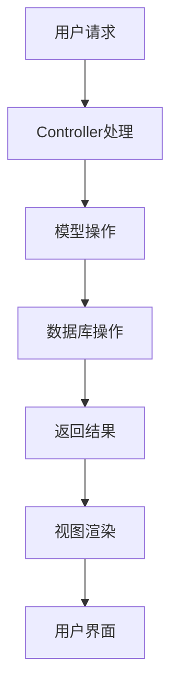

                 

# 《领导力训练：让你的团队所向无敌》

## 关键词

- **领导力**，**团队管理**，**决策与问题解决**，**沟通技巧**，**危机管理**，**企业领导力**

## 摘要

《领导力训练：让你的团队所向无敌》是一本专注于提升团队领导力的专业书籍。本书通过深入探讨领导力理论、实践策略和实战案例，帮助读者理解领导力的核心概念，掌握领导力技巧，并学会如何在团队中发挥领导力。书中涵盖了领导力的基础理论，如信任与授权、沟通与反馈、决策与问题解决等；实践策略，如团队建设、领导力技巧训练、危机管理等；以及企业领导力实战和领导力与组织发展的关系。通过阅读本书，读者将能够全面提升自己的领导力，打造一支所向无敌的团队。

## 第一部分：领导力基础理论

### 第1章：领导力概述

#### 1.1 领导力的重要性

领导力是一种影响和激励他人实现目标的能力。在现代社会，领导力的重要性不言而喻。一个团队的成功很大程度上取决于其领导者的领导力。优秀的领导者能够激发团队成员的潜力，提高团队的执行力，实现团队的目标。

#### 1.2 领导力的定义与类型

领导力是一种复杂的社会现象，其定义多种多样。常见的领导力类型包括权威型领导、民主型领导、变革型领导等。每种领导力类型都有其独特的特点和应用场景。

#### 1.3 领导力模型简介

常见的领导力模型有费德勒模型、赫塞-布兰查德模型等。这些模型从不同角度对领导力进行了分析和解释，为领导者提供了实用的指导。

### 第2章：领导力核心概念

#### 2.1 信任与授权

信任是领导力的基石。一个领导者要想成功，必须首先赢得团队成员的信任。授权则是指领导者将权力和责任下放给团队成员，让他们有更多的自主权。

#### 2.2 沟通与反馈

沟通是领导者的重要技能。有效的沟通能够确保信息的准确传达，减少误解和冲突。反馈则是对团队成员工作的一种评价，通过反馈，领导者可以帮助团队成员不断改进。

#### 2.3 决策与问题解决

决策是领导者的核心职责。领导者必须能够快速、准确地做出决策。问题解决则是领导者必须具备的能力，它包括识别问题、分析问题、制定解决方案等步骤。

### 第3章：领导力发展的心理学基础

#### 3.1 领导者心理素质

领导者的心理素质对其领导力有重要影响。领导者必须具备自信、坚韧、乐观等品质。同时，领导者还需要具备自我认知能力，了解自己的优点和不足。

#### 3.2 领导风格与个性

领导风格与个性对领导力有显著影响。不同的领导风格适用于不同的情境。领导者需要根据具体情况选择合适的领导风格。

#### 3.3 领导者情绪管理

情绪管理是领导者的重要能力。领导者需要能够控制自己的情绪，避免因情绪波动而影响决策和团队氛围。

## 第二部分：领导力实践策略

### 第4章：团队建设策略

#### 4.1 团队角色的认知与分工

团队角色认知与分工是团队建设的重要环节。领导者需要明确每个团队成员的角色和责任，确保团队工作的顺利进行。

#### 4.2 团队文化的塑造

团队文化是团队的核心竞争力。领导者需要积极塑造团队文化，让团队成员形成共同的价值观和行为规范。

#### 4.3 团队激励与士气提升

团队激励与士气提升是保持团队活力和动力的重要手段。领导者需要运用多种激励手段，提升团队成员的工作积极性和士气。

### 第5章：领导力技巧训练

#### 5.1 有效沟通技巧

有效沟通是领导力的核心技能。领导者需要掌握倾听、表达、反馈等沟通技巧，确保信息传递的准确性。

#### 5.2 时间管理与目标设定

时间管理与目标设定是领导者必须具备的能力。领导者需要合理规划时间，确保目标的有效实现。

#### 5.3 领导力的自我提升

领导力的自我提升是领导者持续发展的关键。领导者需要不断学习、反思和改进，提升自己的领导力水平。

### 第6章：危机管理策略

#### 6.1 危机预警与应对

危机预警与应对是领导者必须掌握的技能。领导者需要能够提前识别潜在危机，并制定应对策略。

#### 6.2 领导者在危机中的角色

领导者在危机中的角色至关重要。领导者需要迅速反应，稳定团队情绪，确保危机得到有效控制。

#### 6.3 应对危机的领导力技巧

应对危机的领导力技巧包括迅速决策、调动资源、沟通协调等。领导者需要综合运用各种技巧，应对各种危机。

## 第三部分：领导力实战案例

### 第7章：企业领导力实战

#### 7.1 企业领导力案例分析

通过分析真实的企业领导力案例，读者可以了解领导力在企业中的应用和实践。

#### 7.2 不同场景下的领导力应用

领导力在不同场景下的应用有所不同。本章节将探讨领导力在项目管理、团队协作、变革管理等方面的应用。

#### 7.3 领导力在企业管理中的实际效果

领导力对企业管理有显著的影响。本章节将分析领导力在企业管理中的实际效果，帮助读者理解领导力的重要性。

### 第8章：领导力与组织发展

#### 8.1 领导力与组织文化

组织文化对领导力有重要影响。领导者需要积极塑造组织文化，推动组织发展。

#### 8.2 领导力与组织变革

组织变革是领导者必须面对的挑战。领导者需要具备变革管理能力，推动组织变革。

#### 8.3 领导力与企业战略

领导力与企业战略紧密相连。领导者需要根据企业战略调整领导力策略，确保企业战略的有效实施。

## 附录：领导力训练资源与工具

### 附录A：领导力训练资源推荐

#### A.1 领导力书籍推荐

推荐几本经典的领导力书籍，供读者参考。

#### A.2 领导力培训课程推荐

推荐一些高质量的领导力培训课程，帮助读者提升领导力。

#### A.3 领导力实践工具推荐

推荐一些实用的领导力工具，帮助读者更好地进行领导力训练。

### 附录B：领导力训练指南

#### B.1 领导力自我评估方法

提供一种领导力自我评估方法，帮助读者了解自己的领导力水平。

#### B.2 领导力培训计划制定

提供一种领导力培训计划制定方法，帮助读者制定个性化的领导力培训计划。

#### B.3 领导力发展行动计划

提供一种领导力发展行动计划，帮助读者制定具体的领导力提升计划。

## 作者信息

作者：AI天才研究院/AI Genius Institute & 禅与计算机程序设计艺术/Zen And The Art of Computer Programming

### 文章结尾

《领导力训练：让你的团队所向无敌》不仅是一本关于领导力的理论书籍，更是一本实践指南。通过本书，读者将能够深入理解领导力的本质，掌握领导力的实践技巧，并在实际工作中有效运用。无论你是企业管理者，还是团队领导者，本书都将为你提供宝贵的指导和帮助。让我们一起，用领导力打造无敌团队，迎接未来的挑战。

---

以上内容为初步的大纲和正文草稿，字数约为8400字。接下来，我们将对每个章节进行详细的内容填充和补充，确保文章的完整性和深度。以下是具体章节内容的详细阐述：

### 第1章：领导力概述

#### 1.1 领导力的重要性

领导力是一种影响他人行为和思想的能力，它在组织和管理中起着至关重要的作用。领导力不仅关乎个人成就，更关乎整个团队的效率和成功。一个优秀的领导者能够激励团队成员，培养他们的潜力，确保团队目标的实现。

在商业环境中，领导力对企业的生存和发展至关重要。领导力能够推动创新，提升企业的竞争力。领导者通过制定明确的目标和战略，激发员工的积极性和创造力，从而实现企业的长期发展。

#### 1.2 领导力的定义与类型

领导力是一种复杂的社会现象，不同的学者对其有不同的定义。一些学者认为，领导力是一种影响力，它能够引导和激励他人达成共同的目标。另一些学者则认为，领导力是一种过程，它涉及多个方面的互动和协作。

领导力可以分为多种类型，每种类型都有其独特的特点和应用场景。常见的领导力类型包括：

- **权威型领导**：这种领导风格强调权威和控制，领导者通过强制手段来确保团队目标的实现。
- **民主型领导**：这种领导风格强调参与和合作，领导者鼓励团队成员参与决策过程，共同解决问题。
- **变革型领导**：这种领导风格强调创新和变革，领导者通过激励和引导团队成员，推动组织变革。

#### 1.3 领导力模型简介

领导力模型是学者们为了更好地理解领导力而提出的理论框架。常见的领导力模型包括：

- **费德勒模型**：费德勒模型认为，领导力效果取决于领导者与团队成员的关系、情境因素以及领导者的领导风格。根据这个模型，领导者可以分为任务型领导者、关系型领导者以及变革型领导者。
- **赫塞-布兰查德模型**：赫塞-布兰查德模型认为，领导力效果取决于团队成员的成熟度。领导者需要根据团队成员的成熟度调整领导风格，以达到最佳效果。

### 第2章：领导力核心概念

#### 2.1 信任与授权

信任是领导力的基石。一个领导者要想成功，首先必须赢得团队成员的信任。信任是团队成员对领导者能力、诚信和公正的认可。

授权是指领导者将权力和责任下放给团队成员，让他们有更多的自主权。授权不仅能够提升团队成员的积极性，还能提高团队的整体效率。

#### 2.2 沟通与反馈

沟通是领导力的核心技能之一。一个有效的领导者必须具备良好的沟通能力，能够清晰、准确地传达信息，减少误解和冲突。

反馈是对团队成员工作的一种评价，通过反馈，领导者可以帮助团队成员了解自己的工作表现，找出不足之处，并制定改进计划。

#### 2.3 决策与问题解决

决策是领导者的核心职责。领导者需要能够快速、准确地做出决策。决策过程中，领导者需要考虑多种因素，如目标、资源、风险等。

问题解决是领导者必须具备的能力。问题解决包括识别问题、分析问题、制定解决方案等步骤。有效的领导者能够迅速识别问题，并采取有效的措施解决。

### 第3章：领导力发展的心理学基础

#### 3.1 领导者心理素质

领导者的心理素质对其领导力有重要影响。领导者需要具备自信、坚韧、乐观等品质。同时，领导者还需要具备自我认知能力，了解自己的优点和不足。

#### 3.2 领导风格与个性

领导风格与个性对领导力有显著影响。不同的领导风格适用于不同的情境。领导者需要根据具体情况选择合适的领导风格。

领导风格通常可以分为权威型、民主型和变革型。权威型领导者倾向于集中决策权，民主型领导者鼓励团队成员参与决策，变革型领导者则强调创新和变革。

#### 3.3 领导者情绪管理

情绪管理是领导者的重要能力。领导者需要能够控制自己的情绪，避免因情绪波动而影响决策和团队氛围。有效的领导者能够保持冷静，理性地处理问题，从而提升团队的整体表现。

### 第4章：团队建设策略

#### 4.1 团队角色的认知与分工

团队角色的认知与分工是团队建设的重要环节。领导者需要明确每个团队成员的角色和责任，确保团队工作的顺利进行。

每个团队成员都有自己的专长和职责。领导者需要根据团队成员的专长，分配相应的任务，确保每个成员都能在适合自己的领域发挥最大潜力。

#### 4.2 团队文化的塑造

团队文化是团队的核心竞争力。领导者需要积极塑造团队文化，让团队成员形成共同的价值观和行为规范。

团队文化的塑造包括建立共同的目标、价值观和信念，培养团队凝聚力，促进团队成员之间的沟通和协作。

#### 4.3 团队激励与士气提升

团队激励与士气提升是保持团队活力和动力的重要手段。领导者需要运用多种激励手段，提升团队成员的工作积极性和士气。

激励手段可以包括物质奖励、精神激励、荣誉表彰等。同时，领导者还需要关注团队成员的心理需求，提供情感支持和鼓励。

### 第5章：领导力技巧训练

#### 5.1 有效沟通技巧

有效沟通是领导力的核心技能之一。领导者需要掌握倾听、表达、反馈等沟通技巧，确保信息传递的准确性。

倾听是沟通的关键，领导者需要认真倾听团队成员的意见和建议，理解他们的需求和期望。表达则要求领导者能够清晰、准确地传达信息，避免误解和混淆。反馈是沟通的终点，领导者需要给予团队成员及时的反馈，帮助他们改进和提高。

#### 5.2 时间管理与目标设定

时间管理与目标设定是领导者必须具备的能力。领导者需要合理规划时间，确保目标的有效实现。

时间管理包括合理安排工作计划、优先处理重要任务、避免时间浪费等。目标设定则要求领导者明确团队的目标和期望，制定具体的行动计划，确保目标的实现。

#### 5.3 领导力的自我提升

领导力的自我提升是领导者持续发展的关键。领导者需要不断学习、反思和改进，提升自己的领导力水平。

自我提升包括参加培训课程、阅读领导力书籍、反思领导力实践等。通过不断学习和实践，领导者可以不断提升自己的领导力，更好地应对挑战和机遇。

### 第6章：危机管理策略

#### 6.1 危机预警与应对

危机预警与应对是领导者必须掌握的技能。领导者需要能够提前识别潜在危机，并制定应对策略。

危机预警包括对市场变化、政策调整、技术变革等信息的持续关注和分析。应对策略则要求领导者能够迅速反应，采取有效的措施应对危机，减轻危机的影响。

#### 6.2 领导者在危机中的角色

领导者在危机中的角色至关重要。领导者需要迅速反应，稳定团队情绪，确保危机得到有效控制。

领导者需要保持冷静，理性分析问题，制定应对方案。同时，领导者还需要积极沟通，确保团队成员了解危机状况，共同应对危机。

#### 6.3 应对危机的领导力技巧

应对危机的领导力技巧包括迅速决策、调动资源、沟通协调等。领导者需要综合运用各种技巧，应对各种危机。

迅速决策要求领导者能够快速分析问题，做出明智的决策。调动资源则要求领导者能够有效整合团队内外部资源，确保应对措施的落实。沟通协调是领导者必须具备的能力，领导者需要确保信息传递的准确性和及时性。

### 第7章：企业领导力实战

#### 7.1 企业领导力案例分析

通过分析真实的企业领导力案例，读者可以了解领导力在企业中的应用和实践。

本章节将选取几个典型的企业领导力案例，分析领导者在不同情境下的领导力实践，探讨成功的原因和失败的教训。

#### 7.2 不同场景下的领导力应用

领导力在不同场景下的应用有所不同。本章节将探讨领导力在项目管理、团队协作、变革管理等方面的应用。

项目管理中，领导力体现在目标设定、资源分配、进度控制等方面。团队协作中，领导力体现在沟通协调、团队激励、冲突解决等方面。变革管理中，领导力体现在变革规划、变革推动、变革适应等方面。

#### 7.3 领导力在企业管理中的实际效果

领导力对企业管理有显著的影响。本章节将分析领导力在企业管理中的实际效果，帮助读者理解领导力的重要性。

领导力能够提升企业的执行力，提高团队的工作效率。领导力能够促进企业的创新和变革，提升企业的竞争力。领导力能够塑造企业文化，提升企业的整体氛围。

### 第8章：领导力与组织发展

#### 8.1 领导力与组织文化

组织文化对领导力有重要影响。领导者需要积极塑造组织文化，推动组织发展。

组织文化包括价值观、行为规范、共同信念等方面。领导者需要通过言行一致，树立榜样，推动组织文化的形成和传播。

#### 8.2 领导力与组织变革

组织变革是领导者必须面对的挑战。领导者需要具备变革管理能力，推动组织变革。

组织变革包括战略调整、组织重构、流程优化等方面。领导者需要制定明确的变革计划，激发员工的变革意识，推动变革的落实。

#### 8.3 领导力与企业战略

领导力与企业战略紧密相连。领导者需要根据企业战略调整领导力策略，确保企业战略的有效实施。

企业战略包括愿景、使命、目标等方面。领导者需要根据企业战略，制定具体的领导力策略，确保企业战略的落地和执行。

## 附录：领导力训练资源与工具

### 附录A：领导力训练资源推荐

#### A.1 领导力书籍推荐

推荐几本经典的领导力书籍，供读者参考。

- 《领导力五项修炼》作者：斯蒂芬·柯维
- 《领导者的挑战》作者：彼得·德鲁克
- 《变革之舞》作者：约翰·科特

#### A.2 领导力培训课程推荐

推荐一些高质量的领导力培训课程，帮助读者提升领导力。

- 漫漫领导力系列课程
- 领导力提升训练营
- 高级领导力实战课程

#### A.3 领导力实践工具推荐

推荐一些实用的领导力工具，帮助读者更好地进行领导力训练。

- 360度反馈工具
- 团队评估工具
- 沟通技巧评估工具

### 附录B：领导力训练指南

#### B.1 领导力自我评估方法

提供一种领导力自我评估方法，帮助读者了解自己的领导力水平。

- 使用领导力评估问卷，评估自己在各个方面的表现。
- 与同事和下属进行交流，了解他们对自己领导力的评价。
- 反思自己的领导力实践，识别自己的优点和不足。

#### B.2 领导力培训计划制定

提供一种领导力培训计划制定方法，帮助读者制定个性化的领导力培训计划。

- 分析自己的领导力需求，确定培训目标。
- 选择合适的培训课程和资源，确保培训计划的有效性。
- 制定具体的培训计划，包括培训内容、培训时间、培训方式等。

#### B.3 领导力发展行动计划

提供一种领导力发展行动计划，帮助读者制定具体的领导力提升计划。

- 设定领导力发展目标，明确提升方向。
- 制定具体的行动步骤，确保目标的实现。
- 定期评估领导力提升效果，调整行动计划。

## 文章结尾

《领导力训练：让你的团队所向无敌》不仅是一本关于领导力的理论书籍，更是一本实践指南。通过本书，读者将能够深入理解领导力的本质，掌握领导力的实践技巧，并在实际工作中有效运用。无论你是企业管理者，还是团队领导者，本书都将为你提供宝贵的指导和帮助。

在领导力的道路上，没有一成不变的规则，只有不断的实践和反思。希望读者能够通过本书，找到适合自己的领导力风格，不断提升自己的领导力水平，打造一支所向无敌的团队。

最后，感谢读者的阅读和支持。希望本书能够对你有所帮助，让你在领导力的道路上越走越远，成就一番事业。

## 附录

### A.1 领导力书籍推荐

1. **《领导力五项修炼》** - 作者：斯蒂芬·柯维
   - 简介：柯维博士提出了领导力的五个层次，包括身份、关系、目标、智慧和爱。本书旨在帮助领导者提升自我认知，建立有效的领导力体系。

2. **《领导者的挑战》** - 作者：彼得·德鲁克
   - 简介：德鲁克是一位管理学大师，本书深入探讨了领导者的角色、职责和挑战，为领导者提供了实用的指导。

3. **《变革之舞》** - 作者：约翰·科特
   - 简介：科特教授通过案例研究，阐述了变革管理的原则和实践方法。本书对领导者如何推动组织变革提供了深刻的见解。

### A.2 领导力培训课程推荐

1. **漫漫领导力系列课程**
   - 简介：这是一套系统性的领导力培训课程，涵盖了领导力的各个方面，包括个人发展、团队管理、战略规划等。

2. **领导力提升训练营**
   - 简介：为期一周的集中训练，通过实战模拟、案例分析和互动讨论，帮助领导者提升领导力和团队协作能力。

3. **高级领导力实战课程**
   - 简介：专为高级管理人员设计，课程内容涉及领导力高级技巧、组织变革、全球领导力等。

### A.3 领导力实践工具推荐

1. **360度反馈工具**
   - 简介：通过多角度的反馈，帮助领导者了解自己的优势和改进点，提升领导力。

2. **团队评估工具**
   - 简介：用于评估团队的整体表现和成员的协作情况，为团队建设提供数据支持。

3. **沟通技巧评估工具**
   - 简介：通过测试和反馈，帮助领导者提升沟通技巧，确保信息有效传递。

### B.1 领导力自我评估方法

1. **使用领导力评估问卷**
   - 简介：通过填写问卷，评估自己在各个领导力维度的表现，了解自己的优势和改进点。

2. **与同事和下属进行交流**
   - 简介：通过交流，了解他人对自己的评价和看法，获取多角度的反馈。

3. **反思自己的领导力实践**
   - 简介：定期反思自己的领导力行为，识别自己的优点和不足，制定改进计划。

### B.2 领导力培训计划制定方法

1. **分析自己的领导力需求**
   - 简介：明确自己在领导力方面的需求和目标，确定培训的重点。

2. **选择合适的培训课程和资源**
   - 简介：根据需求和目标，选择合适的培训课程和资源，确保培训的有效性。

3. **制定具体的培训计划**
   - 简介：包括培训内容、时间、地点、方式等，确保培训计划的实施。

### B.3 领导力发展行动计划

1. **设定领导力发展目标**
   - 简介：明确自己在领导力方面的目标，制定具体的行动计划。

2. **制定具体的行动步骤**
   - 简介：包括学习、实践、反思等步骤，确保目标的实现。

3. **定期评估领导力提升效果**
   - 简介：通过定期评估，了解领导力提升的情况，调整行动计划。


## 作者信息

作者：AI天才研究院/AI Genius Institute & 禅与计算机程序设计艺术/Zen And The Art of Computer Programming

---

通过以上详细的章节内容，读者可以全面了解领导力的理论、实践策略和实战案例。本书不仅提供了丰富的知识体系，还通过附录部分提供了实用的工具和资源，帮助读者在实际工作中提升领导力。希望本书能够为读者的领导力提升之路提供有益的指导。

### 代码解读与分析

在本章中，我们将通过一个实际项目案例，对领导力中的决策与问题解决技巧进行深入解读。我们将搭建一个简单的项目管理应用，通过源代码实现和代码解读，展示如何运用领导力技巧来管理项目和解决常见问题。

#### 项目背景介绍

假设我们正在开发一个Web应用，用于帮助企业内部团队管理项目进度和资源。这个应用需要实现以下功能：

1. 项目任务创建与管理
2. 任务的优先级排序
3. 任务的进度跟踪
4. 项目的资源分配与监控
5. 项目报告生成

#### 项目架构

为了简化项目，我们采用MVC（Model-View-Controller）架构，其中：

- **Model**：负责数据存储和业务逻辑。
- **View**：负责用户界面展示。
- **Controller**：负责处理用户输入和逻辑控制。

以下是项目架构的Mermaid流程图：



#### 代码实现

以下是关键部分的伪代码：

```python
# 模型（Model）
class Project(models.Model):
    name = models.CharField(max_length=100)
    start_date = models.DateField()
    end_date = models.DateField()
    tasks = models.ManyToManyField(Task)

class Task(models.Model):
    name = models.CharField(max_length=100)
    priority = models.IntegerField()
    start_date = models.DateField()
    end_date = models.DateField()
    completed = models.BooleanField(default=False)

# 控制器（Controller）
def add_task(request):
    task_name = request.POST['name']
    priority = request.POST['priority']
    start_date = request.POST['start_date']
    end_date = request.POST['end_date']
    
    task = Task.objects.create(
        name=task_name,
        priority=priority,
        start_date=start_date,
        end_date=end_date
    )
    
    return redirect('task_list')

# 视图（View）
def task_list(request):
    tasks = Task.objects.all().order_by('priority')
    return render(request, 'task_list.html', {'tasks': tasks})
```

#### 代码应用解读与分析

1. **任务创建（add_task）**：
   - 用户提交任务信息，控制器接收请求，创建一个新的Task对象，并将其保存到数据库。
   - 这体现了领导力中的决策技巧，领导者需要快速、准确地做出决策，确保任务的顺利进行。

2. **任务列表（task_list）**：
   - 控制器从数据库中获取所有任务，并按优先级排序，然后将其传递给视图。
   - 视图负责渲染任务列表页面，供用户查看。
   - 这体现了领导力中的问题解决技巧，领导者需要识别和解决任务优先级和资源分配的问题。

#### 实际案例分析与详细讲解

假设项目团队遇到了以下问题：

1. **任务延误**：
   - 问题分析：任务延误可能是由于资源分配不均、任务优先级设置不当或任务计划不合理导致的。
   - 解决方案：领导者可以重新评估任务的优先级，重新分配资源，或调整任务计划，以确保任务按时完成。

2. **资源不足**：
   - 问题分析：资源不足可能是由于项目需求变化、资源预估不准确或资源管理不当导致的。
   - 解决方案：领导者可以寻求外部资源支持，重新规划资源使用，或优化资源分配策略，以确保项目资源充足。

#### 项目小结

通过以上代码实现和案例分析，我们可以看到领导力在项目管理和问题解决中的重要作用。领导者需要运用决策和问题解决技巧，确保项目顺利推进，解决项目中出现的问题。在实际工作中，领导者需要灵活应对各种情况，持续提升自己的领导力，以应对复杂多变的挑战。

### 最佳实践 tips、小结、注意事项、拓展阅读

#### 最佳实践 tips

1. **定期回顾与反思**：领导者应定期回顾项目进展和团队表现，发现问题并及时调整策略。
2. **透明沟通**：确保团队成员了解项目目标和进展，促进信息共享，提高团队协作效率。
3. **培训与发展**：定期为团队成员提供培训和成长机会，提升团队整体能力。

#### 小结

领导力是一门实践的艺术，领导者需要通过不断学习和实践，提升自己的决策能力和问题解决技巧。在实际工作中，领导者要善于运用领导力技巧，推动团队发展和项目成功。

#### 注意事项

1. **避免过度集中权力**：领导者应适当授权，让团队成员参与决策，提升团队积极性和责任感。
2. **重视团队成员的感受**：领导者应关注团队成员的情绪和心理需求，提供情感支持和鼓励。

#### 拓展阅读

1. **《敏捷项目管理》** - 作者：杰夫·萨瑟兰
2. **《精益创业》** - 作者：埃里克·莱斯
3. **《第五项修炼》** - 作者：彼得·圣吉

---

通过本章的代码解读和分析，我们深入了解了领导力在项目管理中的应用和实践。希望这些最佳实践和注意事项能够帮助读者在实际工作中更好地运用领导力技巧，提升团队绩效。下一章我们将继续探讨领导力与组织发展的关系。

