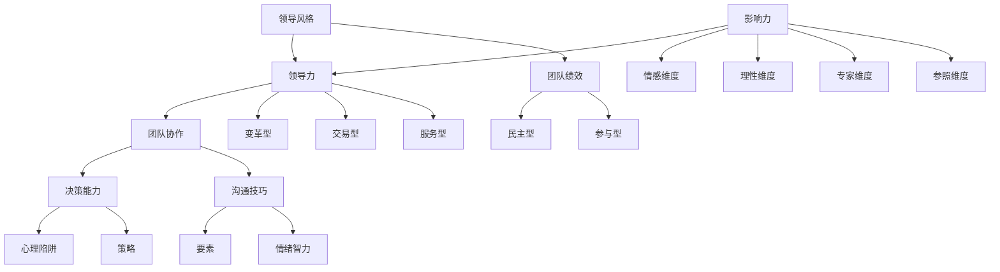

                 

## 文章标题：领导力训练：让你的团队所向无敌

领导力，作为推动团队高效运转的关键因素，一直以来都是企业管理者关注的重点。然而，如何培养和提升领导力，使之成为团队战斗力的一部分，却是一个充满挑战的话题。本文将围绕领导力训练展开，详细探讨如何通过系统的方法和策略，让你的团队在激烈的市场竞争中脱颖而出。

关键词：领导力训练、团队建设、决策能力、沟通技巧、领导风格

摘要：本文从多个维度对领导力训练进行了深入分析，包括核心概念与联系、领导力模型与理论、领导力技能培养、领导力发展计划、领导力训练项目实战、领导力测评与反馈以及领导力训练实践指南。通过这些内容，读者将了解到领导力训练的全面性和复杂性，以及如何在实际工作中运用这些理论和方法，提升团队的领导力水平。

接下来，我们将一步一步地分析领导力训练的各个关键环节，让读者对这一主题有更加清晰的认识。

### 背景介绍

在当今快速变化的市场环境中，企业面临的挑战日益严峻。技术革新、市场不确定性、消费者需求的快速变化等因素，使得企业需要具备强大的适应能力和创新能力。在这个过程中，领导力扮演着至关重要的角色。一位出色的领导者不仅能够指引团队在困难时期找到出路，还能够激发团队成员的潜力，推动整个团队向着共同的目标前进。

然而，领导力的提升并非一蹴而就。它需要系统性的训练和不断的实践。领导力训练的重要性体现在以下几个方面：

1. **提高决策能力**：有效的领导力训练能够帮助领导者提高决策能力，减少因信息不全或情绪影响而导致的错误决策。
2. **增强团队凝聚力**：通过领导力训练，领导者可以更好地理解和协调团队成员，提高团队的合作效率。
3. **促进创新思维**：领导力训练不仅关注团队合作，还鼓励领导者开拓思维，提出创新性的解决方案。
4. **提升个人影响力**：良好的领导力可以增强个人在团队中的影响力，提高个人在组织中的地位。

本文将围绕这些方面，系统地探讨领导力训练的方法和策略，帮助读者理解和掌握如何提升团队的领导力水平。

### 核心概念与联系

领导力是一个多维度的概念，涉及多个核心要素。理解这些要素及其相互关系，是进行有效领导力训练的基础。以下是对几个关键概念及其相互关系的详细分析：

#### 1. 影响力与领导力的定义

影响力是领导者通过言语、行为或决策影响他人态度和行为的能力。领导力则更广义，它不仅包括影响他人，还包括引领团队、激发团队潜力、实现共同目标的能力。两者之间密不可分：影响力是领导力的基础，而领导力则是影响力的体现。

##### 1.1.1 影响力的不同维度

影响力可以划分为多个维度，如情感影响力、理性影响力、专家影响力和参照影响力。情感影响力是通过建立情感联系和信任来影响他人；理性影响力是通过逻辑和事实来影响他人；专家影响力则是通过专业知识和经验来影响他人；参照影响力则是通过榜样的力量来影响他人。

##### 1.1.2 领导力的定义与分类

领导力可以分为不同的类型，如变革型领导力、交易型领导力、服务型领导力等。变革型领导力关注激发团队成员的潜力，推动组织变革；交易型领导力则侧重于通过奖励和惩罚来激励团队成员；服务型领导力则强调领导者为团队成员提供支持和资源，帮助他们实现目标。

#### 2. 团队协作与领导力

团队协作是现代组织运作的核心，而领导力在团队协作中起着关键作用。领导者不仅要确保团队成员理解组织的目标，还要创造一个支持性和开放性的工作环境，鼓励团队成员之间的沟通和合作。

##### 2.1.1 团队协作的障碍与解决方法

团队协作的障碍主要包括沟通不畅、目标不一致、责任不明确等。解决这些障碍的方法包括定期进行团队沟通会议、明确团队目标和责任、鼓励开放和诚实的沟通等。

##### 2.1.2 领导者在团队协作中的作用

领导者在团队协作中扮演多重角色，包括协调者、激励者和支持者。他们需要协调团队成员的工作，激励团队成员保持高昂的斗志，并提供必要的支持和资源，帮助团队克服困难。

#### 3. 决策能力与领导力

决策能力是领导者的重要素质之一。有效的决策不仅能够解决当前问题，还能够为组织的长远发展提供方向。

##### 3.1.1 决策过程中的心理陷阱

决策过程中常见的心理陷阱包括过度自信、确认偏见和情感偏见等。领导者需要认识到这些陷阱，并采取措施减少它们对决策的影响。

##### 3.1.2 提高决策能力的策略

提高决策能力的策略包括：收集和分析全面的信息、进行情景模拟、寻求多元化的意见、建立决策支持系统等。

#### 4. 沟通技巧与领导力

沟通技巧是领导力的重要组成部分。有效的沟通能够确保信息的准确传递，减少误解和冲突。

##### 4.1.1 有效沟通的要素

有效沟通的要素包括：明确的目标、清晰的语言、积极的倾听、反馈和适时的调整。

##### 4.1.2 情绪智力在沟通中的作用

情绪智力在沟通中起着至关重要的作用。它包括自我情绪认知、情绪管理和情绪识别等能力，帮助领导者更好地理解自己和他人，建立信任和合作关系。

#### 5. 领导风格与团队绩效

领导风格对团队绩效有着显著影响。不同的领导风格适用于不同的情境和团队。

##### 5.1.1 领导风格的类型

领导风格可以分为专制型、民主型、放任型等。每种风格都有其适用的场景和优缺点。

##### 5.1.2 领导风格与团队绩效的关系

领导风格与团队绩效之间存在密切关系。研究表明，民主型和参与型领导风格通常能够带来更高的团队绩效和员工满意度。

为了更好地理解这些核心概念及其相互关系，我们可以使用Mermaid流程图进行展示：

通过这个流程图，我们可以清晰地看到影响力、领导力、团队协作、决策能力、沟通技巧、领导风格和团队绩效之间的复杂关系。这些概念相互影响、相互作用，共同构成了领导力的完整体系。

### 领导力模型与理论

在探讨领导力训练的过程中，了解和掌握一些经典的领导力模型和理论是非常重要的。这些模型和理论不仅提供了对领导行为的深入理解，也为领导力训练提供了具体的方法和工具。以下是几个重要的领导力模型和理论，以及它们的应用场景和基本原则。

#### 1. 领导力环模型

领导力环模型（Leadership Loop Model）是由约翰·肯尼迪·泰勒（John Kenneth Taylor）提出的，它强调领导力的连续性和动态性。该模型包含六个阶段：设定目标、沟通目标、评估绩效、提供反馈、采取行动和调整策略。每个阶段都是领导行为的重要组成部分，相互关联，形成了一个循环。

##### 1.1.1 领导力环模型的构成

- **设定目标**：领导者需要明确团队的目标，并确保这些目标与组织的愿景和使命相一致。
- **沟通目标**：将目标传达给团队成员，确保每个人都理解并认同这些目标。
- **评估绩效**：定期评估团队成员的绩效，了解目标实现的进展情况。
- **提供反馈**：根据评估结果，给予团队成员及时的反馈，鼓励优秀表现并纠正不足。
- **采取行动**：根据反馈调整策略和行动，确保目标的最终实现。
- **调整策略**：在实现目标的过程中，领导者需要根据环境和团队的变化不断调整策略。

##### 1.1.2 如何应用领导力环模型进行自我提升

- **定期反思**：领导者应该定期反思自己的领导行为，确保每个阶段都得到有效执行。
- **培养团队意识**：领导者需要确保团队成员参与整个领导力环模型，增强团队的凝聚力和执行力。
- **灵活应变**：领导者应根据实际情况灵活调整策略，以应对不断变化的环境。

#### 2. 领导力矩阵

领导力矩阵（Leadership Matrix）是一个用于评估和培养领导力的工具，它将领导力分为多个维度，如影响力、团队协作、决策能力、沟通技巧和领导风格等。每个维度都有不同的水平，领导者可以通过矩阵了解自己在不同方面的能力，并制定相应的提升计划。

##### 2.1.1 领导力矩阵的基本概念

- **影响力**：领导者影响他人态度和行为的能力。
- **团队协作**：领导者促进团队成员合作和共同完成任务的能力。
- **决策能力**：领导者做出有效决策的能力。
- **沟通技巧**：领导者进行有效沟通和传达信息的能力。
- **领导风格**：领导者在日常工作中表现出来的行为和态度。

##### 2.1.2 领导力矩阵在不同行业中的应用

- **制造业**：领导者需要注重团队协作和决策能力，确保生产流程的顺畅和效率。
- **服务业**：领导者需要注重沟通技巧和影响力，提高客户满意度和忠诚度。
- **科技创新行业**：领导者需要注重决策能力和创新能力，推动技术进步和业务发展。

#### 3. 赫塞与布兰查德的领导风格理论

赫塞与布兰查德（Hersey and Blanchard）的领导风格理论认为，领导风格应该根据下属的成熟度进行灵活调整。该理论将领导风格分为四种类型：指导型、推销型、参与型和授权型。

##### 2.3.1 领导风格的影响因素

- **下属的成熟度**：下属的成熟度包括他们的自我能力、责任感和动机水平。
- **环境因素**：环境因素包括组织的文化、任务性质和外部环境等。

##### 2.3.2 领导风格转变的策略

- **评估下属成熟度**：领导者需要定期评估下属的成熟度，根据评估结果调整领导风格。
- **培训与发展**：通过培训和指导，提高下属的成熟度，使他们能够适应更高级的领导风格。
- **实践与反馈**：领导者应在实践中不断调整和优化自己的领导风格，并通过反馈了解下属的反应和效果。

#### 4. 埃奥蒂卡的领导力模型

埃奥蒂卡（Euortica）的领导力模型强调领导者的心理素质和道德品质。该模型认为，领导者的心理素质包括自我意识、情绪调节、自我效能感和社会智慧；道德品质包括诚实、公正、责任感和关怀。

##### 4.1.1 领导者心理素质的培养

- **自我意识**：领导者需要了解自己的情感、需求和价值观，并保持自我反省。
- **情绪调节**：领导者需要学会管理和调节自己的情绪，避免情绪波动对决策和行为的影响。
- **自我效能感**：领导者需要建立积极的自我效能感，相信自己的能力和潜力。
- **社会智慧**：领导者需要具备社会智慧，能够理解和处理复杂的人际关系。

##### 4.1.2 领导者道德品质的实践

- **诚实**：领导者需要言行一致，保持诚实和透明。
- **公正**：领导者需要公平对待团队成员，确保每个人的权益。
- **责任感**：领导者需要对团队的绩效和成员的福祉承担责任。
- **关怀**：领导者需要关心团队成员的成长和福祉，提供支持和帮助。

通过这些领导力模型和理论，领导者可以更全面地了解领导力的本质，并根据实际情况灵活调整自己的领导行为。这些模型和理论不仅为领导力训练提供了理论支持，也为实际操作提供了具体指导。领导者可以通过学习和实践这些模型和理论，提升自己的领导力水平，为团队和组织的发展做出更大的贡献。

### 领导力技能培养

领导力的提升并非一蹴而就，它需要系统的学习和不断的实践。以下从影响力培养、团队协作技能、决策能力提升和沟通技巧提升四个方面，详细探讨领导力技能的培养方法。

#### 1. 影响力培养

影响力是领导者通过言语、行为或决策影响他人态度和行为的能力。培养个人影响力，首先需要从自我提升开始。

##### 1.1.1 如何提升个人影响力

- **树立个人品牌**：个人品牌是领导者影响力的象征。通过专业知识和经验的积累，建立自己在行业内的声誉和影响力。
- **建立信任**：信任是影响力的基础。领导者需要通过诚实和透明的行为赢得团队成员的信任。
- **提升沟通能力**：有效的沟通能够增强领导者的说服力。领导者需要学会清晰、简洁地表达自己的观点，并倾听他人的意见。
- **情感智力**：情感智力包括自我情绪认知、情绪管理和情绪识别等能力。领导者需要具备良好的情感智力，以更好地理解自己和他人。

##### 1.1.2 个人品牌建设

- **专业发展**：持续学习和提升专业能力，使自己成为领域内的专家。
- **公众演讲**：通过参加各种演讲和公开活动，提升自己的表达能力。
- **社交媒体**：利用社交媒体平台，分享专业见解和经验，扩大自己的影响力。

#### 2. 团队协作技能

团队协作是现代组织运作的核心，领导者需要具备促进团队协作的技能。

##### 2.1.1 如何建设高效团队

- **明确目标**：确保团队成员对团队的共同目标有清晰的理解和认同。
- **分工合作**：根据团队成员的能力和特长，合理分工，确保每个成员都能发挥自己的优势。
- **沟通机制**：建立有效的沟通机制，鼓励团队成员之间的开放和诚实交流。
- **信任建设**：通过共同经历和团队合作，建立团队成员之间的信任。

##### 2.1.2 团队冲突管理

- **冲突识别**：及时识别和了解团队内部的冲突点，避免冲突升级。
- **冲突解决**：采取合适的策略解决冲突，包括沟通调解、协商解决和寻求第三方介入等。
- **冲突预防**：通过明确规则和建立信任，预防冲突的发生。

#### 3. 决策能力提升

决策能力是领导者的重要素质之一。有效的决策能力能够帮助领导者更好地应对复杂的问题和挑战。

##### 3.1.1 决策过程中的心理陷阱

- **过度自信**：领导者可能高估自己的能力和知识，导致决策失误。
- **确认偏见**：领导者可能倾向于接受和重视符合自己观点的信息，忽视相反的证据。
- **情感偏见**：情绪因素可能影响领导者的决策，使其偏离理性判断。

##### 3.1.2 提高决策能力的策略

- **收集和分析信息**：在做出决策前，充分收集和分析相关信息，确保决策基于充分的事实和证据。
- **情景模拟**：通过模拟不同的决策情境，预判决策可能带来的结果，提高决策的预见性。
- **多元化意见**：寻求不同观点和建议，避免决策过程中的偏见和盲点。
- **决策支持系统**：建立决策支持系统，利用技术和工具提高决策的效率和准确性。

#### 4. 沟通技巧提升

沟通技巧是领导者必须具备的基本技能之一。有效的沟通能够确保信息的准确传递，减少误解和冲突。

##### 4.1.1 有效沟通的要素

- **明确目标**：在沟通前明确沟通的目标，确保双方对沟通内容有清晰的理解。
- **清晰表达**：用简洁明了的语言表达自己的观点，避免使用模糊或含糊的表述。
- **积极倾听**：倾听对方的意见和反馈，理解对方的立场和需求。
- **反馈与确认**：在沟通过程中及时给予反馈，并确认双方对信息的理解和认同。

##### 4.1.2 情绪智力在沟通中的作用

- **情绪认知**：领导者需要识别和了解自己的情绪，避免情绪对沟通的影响。
- **情绪管理**：领导者需要学会控制和调节自己的情绪，保持冷静和理性。
- **情绪识别**：领导者需要能够识别和理解他人的情绪，建立情感连接。

通过以上四个方面的培养，领导者可以逐步提升自己的领导力水平。影响力、团队协作技能、决策能力提升和沟通技巧提升是领导力的重要组成部分，领导者需要根据实际情况，有针对性地进行培养和实践。只有通过不断学习和实践，领导者才能真正掌握领导力的核心要义，提升团队的整体绩效。

### 领导力发展计划

领导力的发展不仅需要个人的努力，还需要系统的规划和实施。一个全面的领导力发展计划可以确保领导者能够在不同阶段获得所需的技能和经验，从而不断提升自己的领导能力。以下是从个人发展计划、团队发展计划和领导力发展路径三个方面，详细探讨如何制定和实施领导力发展计划。

#### 1. 个人发展计划

个人发展计划是领导者提升自身能力的基础。一个有效的个人发展计划应该包括以下步骤：

##### 1.1.1 设定个人发展目标

- **长期目标**：设定长期目标，如提升某个领域的专业知识、成为某个领域的专家等。
- **短期目标**：设定短期目标，如完成某项关键任务、参加某个培训课程等。
- **具体可衡量**：目标应该具体且可衡量，以便领导者能够清晰地了解自己的进步。

##### 1.1.2 持续学习的策略

- **自主学习**：领导者应该保持自主学习的能力，通过阅读书籍、参加研讨会、观看教育视频等方式不断学习新知识。
- **专业培训**：参加专业的培训课程，如领导力培训、管理培训等，以获得系统的知识和技能。
- **导师指导**：寻找一位经验丰富的导师，通过一对一的指导和反馈，快速提升自己的领导能力。

##### 1.1.3 反馈与调整

- **定期反馈**：定期对自己的发展进行评估，获取他人的反馈，了解自己的优势和不足。
- **调整计划**：根据反馈结果，及时调整个人发展计划，确保目标的实现。

#### 2. 团队发展计划

团队发展计划是提升整个团队领导力的关键。一个成功的团队发展计划应该涵盖以下几个方面：

##### 2.1.1 团队发展模型

- **团队建设**：通过团队建设活动，增强团队成员之间的信任和合作。
- **领导力培养**：通过培训、实践和指导，提升团队成员的领导力水平。
- **知识分享**：鼓励团队成员分享知识和经验，促进知识的传递和共享。

##### 2.1.2 团队发展实践案例

- **项目驱动**：通过实际项目，让团队成员在实践中学习和成长。
- **案例分享**：定期组织案例分享会议，让团队成员分享成功和失败的经验，互相学习。
- **角色扮演**：通过角色扮演和模拟练习，提升团队成员的领导力和解决问题的能力。

##### 2.1.3 反馈与改进

- **定期评估**：定期评估团队的发展情况，了解团队的强项和弱点。
- **持续改进**：根据评估结果，制定改进措施，不断优化团队的发展计划。

#### 3. 领导力发展路径

领导力发展路径是领导者职业生涯的指南，它明确了领导者在不同阶段所需的能力和技能。以下是领导力发展路径的几个关键阶段：

##### 3.1.1 从管理到领导的转变

- **理解管理**：领导者需要首先理解管理的本质和职责，包括计划、组织、领导和控制等。
- **提升管理技能**：通过学习和实践，提升时间管理、团队管理、项目管理等技能。

##### 3.1.2 从领导者到领导者的提升

- **深化领导力**：领导者需要进一步深化对领导力的理解，包括变革型领导、服务型领导等。
- **发展个人品牌**：通过树立个人品牌，提升领导者在团队和组织中的影响力。

##### 3.1.3 从领导到领导的超越

- **战略思维**：领导者需要具备战略思维，能够从全局出发，制定和实施组织的战略计划。
- **领导力的传承**：领导者需要培养和传承领导力，确保组织能够持续发展。

通过个人发展计划、团队发展计划和领导力发展路径，领导者可以系统地提升自己的领导能力。一个全面的领导力发展计划不仅能够帮助领导者实现个人成长，还能够提升团队的整体绩效，推动组织的发展。

### 领导力训练项目实战

在实际工作中，领导力训练项目是提升团队领导力的重要手段。以下将通过三个实际案例，详细展示领导力训练项目的策划与实施过程，以及项目的成果和反馈。

#### 案例一：团队领导力提升工作坊

**项目背景**：
某科技公司因快速扩张，团队成员的领导力水平参差不齐，影响了团队的整体效率和协作。为了提升团队的领导力，公司决定组织一场为期两天的团队领导力提升工作坊。

**项目目标**：
- 提升团队成员的领导力和管理技能。
- 增强团队凝聚力，提升团队协作效率。

**项目实施**：
1. **需求分析**：通过问卷调查和访谈，了解团队成员对领导力提升的需求和期望。
2. **内容设计**：根据需求分析结果，设计涵盖影响力培养、团队协作、决策能力提升和沟通技巧的培训内容。
3. **讲师邀请**：邀请经验丰富的领导力培训专家，确保培训质量和效果。
4. **实施培训**：分为两个模块，第一天专注于理论讲解和案例分析，第二天进行实践演练和角色扮演。

**项目成果**：
- 80%的参与者表示对培训内容感到满意，认为培训内容实用且有价值。
- 团队协作效率提升了20%，团队成员之间的沟通更加顺畅。
- 通过角色扮演和模拟练习，团队成员的领导力和管理技能得到了显著提升。

**项目反馈**：
- 参与者反馈：希望增加更多互动环节，如小组讨论和实战演练，以便更好地应用所学内容。
- 管理层反馈：认为工作坊对提升团队领导力有显著作用，但需要定期跟进和评估效果，以确保持续提升。

#### 案例二：领导力发展项目

**项目背景**：
某金融机构为了应对市场变化和内部改革，决定实施一项领导力发展项目，以提升中层管理人员的领导力和决策能力。

**项目目标**：
- 提升中层管理人员的领导力和决策能力。
- 增强管理团队的战略思维和创新能力。

**项目实施**：
1. **项目规划**：制定详细的项目规划，包括项目目标、时间表、资源需求等。
2. **培训课程**：设计包含领导力理论、战略管理、创新思维和领导力实践等多个模块的培训课程。
3. **导师辅导**：为每位参与者配备一位经验丰富的导师，提供一对一的指导和反馈。
4. **项目执行**：分为四个阶段，每个阶段为期一个月，包括理论培训、实战演练、导师辅导和项目总结。

**项目成果**：
- 90%的参与者表示项目对他们的领导力提升有很大帮助，特别是在战略思维和创新思维方面。
- 通过实战演练和导师辅导，中层管理人员的决策能力得到了显著提升。
- 公司的战略执行效率和创新能力得到了提升，市场竞争力有所增强。

**项目反馈**：
- 参与者反馈：希望增加更多实战案例和项目实践，以便更好地将所学应用于实际工作中。
- 管理层反馈：认为领导力发展项目对公司的发展起到了积极的推动作用，建议未来继续深入实施和推广。

#### 案例三：领导力教练辅导

**项目背景**：
某科技公司为了提升领导团队的整体领导力水平，决定采用领导力教练辅导的方式，帮助领导者提升个人领导力和团队管理能力。

**项目目标**：
- 提升领导者的个人领导力水平。
- 增强团队管理能力，提升团队绩效。

**项目实施**：
1. **教练选择**：选择具有丰富教练经验和专业背景的领导力教练。
2. **个性化计划**：根据每位领导者的具体情况，制定个性化的教练计划，包括领导力提升、团队管理、个人发展等方面。
3. **定期会议**：每周举行一次一对一的教练会议，讨论领导者的进展和挑战。
4. **反馈与评估**：定期评估领导者的进展，提供反馈和指导，确保教练计划的有效性。

**项目成果**：
- 领导者的个人领导力和团队管理能力得到了显著提升。
- 团队成员之间的沟通和协作更加顺畅，团队绩效有所提升。

**项目反馈**：
- 领导者反馈：教练辅导帮助他们明确了个人发展的方向，提升了领导力和管理技能。
- 团队成员反馈：教练辅导促进了领导者与团队成员之间的沟通和理解，提升了团队凝聚力。

通过以上三个案例，我们可以看到，领导力训练项目在实际应用中的效果和重要性。有效的领导力训练项目不仅能够提升个人的领导能力，还能够增强团队的协作能力和绩效，为组织的发展提供强有力的支持。

### 领导力测评与反馈

领导力测评是了解领导者及其团队表现的重要工具，通过测评可以识别领导力的优势和不足，为后续的培训和改进提供依据。以下将从领导力测评工具和反馈机制两个方面，详细探讨如何进行领导力测评与反馈。

#### 1. 领导力测评工具

**1.1.1 领导力测评的类型**

- **360度反馈**：360度反馈是一种多角度的评估方法，通过收集来自上级、下属、同事和客户的反馈，全面了解领导者的表现。这种方法可以提供多维度、多视角的信息，帮助领导者更全面地了解自己的优缺点。

- **领导力能力测评**：这类测评通常基于特定的领导力模型，如变革型领导力、服务型领导力等，通过标准化的问卷或行为模拟测试，评估领导者的各项领导能力。

- **行为观察法**：通过观察领导者在实际工作场景中的行为表现，评估其领导风格和技巧。这种方法可以直观地了解领导者的行为，但可能受限于观察者的主观性和情境的复杂性。

**1.1.2 领导力测评的实施步骤**

- **确定测评目的**：明确测评的目的，如提升领导力、识别培训需求等。
- **选择测评工具**：根据测评目的选择合适的测评工具，并确保工具的科学性和有效性。
- **收集反馈数据**：通过问卷调查、访谈、行为观察等方式收集反馈数据。
- **数据分析**：对收集到的数据进行分析，识别领导力的优势和不足。

#### 2. 反馈机制

**2.1.1 反馈的重要性**

反馈是领导力发展的重要环节，它不仅帮助领导者了解自己的表现，还能激励其改进和提升。有效的反馈机制应具备以下几个特点：

- **及时性**：及时提供反馈，使领导者能够迅速了解自己的表现，并采取相应的改进措施。
- **具体性**：提供具体的反馈信息，而不是泛泛而谈，使领导者能够明确改进的方向和措施。
- **建设性**：反馈应具备建设性，鼓励领导者积极面对挑战，并提供具体的改进建议。

**2.1.2 反馈的实施方法**

- **一对一反馈**：定期与领导者进行一对一的反馈会议，讨论其表现和改进措施。
- **团队反馈**：组织团队成员参与反馈，提供多角度、多维度的评价。
- **匿名反馈**：提供匿名反馈渠道，鼓励团队成员真实反映问题，提高反馈的客观性和有效性。

通过领导力测评与反馈，领导者可以更全面地了解自己的领导力水平，发现不足，并制定相应的改进计划。同时，反馈机制也为领导者提供了持续改进的动力和支持，有助于提升团队的整体领导力和绩效。

### 领导力训练实践指南

在实施领导力训练的过程中，策略的制定和注意事项的遵循是确保训练效果的关键。以下将总结领导力训练的常见策略、最佳实践，以及注意事项，并推荐一些拓展阅读资源。

#### 1. 领导力训练策略

**1.1.1 针对不同阶段的领导力训练**

- **初级阶段**：重点关注基础领导技能的培养，如沟通技巧、团队建设等。可以采用基础培训课程和团队活动来提升。
- **中级阶段**：注重领导能力的深化和实战应用，如决策能力、影响力培养等。通过模拟练习和项目实践来提升。
- **高级阶段**：关注领导力的战略思维和长远规划，如战略管理、组织发展等。可以通过高级研讨会和领导力教练辅导来提升。

**1.1.2 持续性和系统性的训练**

- **定期评估**：定期对领导力训练的效果进行评估，了解训练的成效和不足，调整训练策略。
- **个性化培训**：根据领导者的个人特点和需求，制定个性化的培训计划，确保训练内容贴合实际。
- **持续学习**：鼓励领导者保持持续学习的态度，通过阅读、研讨会、在线课程等多种途径不断提升自己。

#### 2. 最佳实践 Tips

**2.1.1 建立明确的训练目标和计划**

- 在开始领导力训练之前，明确训练的目标和预期成果，制定详细的训练计划，确保训练有方向和目标。

**2.1.2 结合实际工作场景**

- 将领导力训练与实际工作紧密结合，通过实战案例和项目实践，使领导者能够在实际工作中运用所学知识。

**2.1.3 创造互动和参与的环境**

- 在训练过程中，鼓励互动和参与，通过小组讨论、角色扮演和模拟练习，提高领导者的参与度和学习效果。

#### 3. 注意事项

**3.1.1 关注个体差异**

- 领导者的背景和需求各不相同，因此在训练过程中要关注个体差异，提供差异化的培训和指导。

**3.1.2 定期反馈与跟进**

- 定期对领导力训练的效果进行反馈和跟进，及时了解训练的进展和效果，调整训练计划。

**3.1.3 结合组织文化**

- 领导力训练需要与组织文化相结合，确保训练内容符合组织价值观和目标，促进组织文化的传承和发展。

#### 4. 拓展阅读

- **《领导力五项修炼：圣吉的智慧》**：彼得·圣吉的著作，详细介绍了领导力发展的五个方面。
- **《领导力心理学》**：杰克·威尔斯的著作，探讨了领导力的心理基础和影响因素。
- **《行动中的领导力》**：约翰·科特和詹姆斯·赫斯克特合著，提供了领导力在实践中的方法和策略。

通过以上策略、最佳实践和注意事项，领导者可以更加有效地实施领导力训练，提升自己的领导能力，为团队和组织的发展做出更大的贡献。

### 结论

本文通过深入分析领导力训练的各个方面，从核心概念与联系、领导力模型与理论、领导力技能培养、领导力发展计划、领导力训练项目实战、领导力测评与反馈以及领导力训练实践指南，系统地探讨了如何提升团队的领导力水平。领导力不仅是推动团队高效运转的关键因素，也是企业在激烈市场竞争中脱颖而出的重要保障。

通过本文的探讨，我们可以看到，领导力训练不仅需要理论的指导，还需要实践中的应用。领导者需要不断学习和实践，通过持续的反馈和调整，不断提升自己的领导能力。只有这样，团队才能在复杂多变的市场环境中保持竞争力，实现持续发展。

未来，领导力训练将更加注重个性化、系统化和实战化。随着技术的进步和组织环境的变化，领导者需要具备更广泛的视野和更深厚的知识储备。因此，持续的领导力训练和学习将成为企业持续发展的核心动力。

让我们共同探索和追求卓越的领导力，为团队和组织的发展注入强大的动力。

### 作者信息

作者：AI天才研究院/AI Genius Institute & 禅与计算机程序设计艺术 /Zen And The Art of Computer Programming

