                 

### 文章标题：领导力训练：让你的团队无坚不摧

#### 关键词：领导力，团队协作，领导力训练，团队无坚不摧，实战案例

#### 摘要：
本文旨在深入探讨领导力训练对于团队协作和战斗力提升的重要性。通过分析领导力的核心概念、理论框架、心理学基础，本文提出了提升领导力的策略与方法。同时，通过实战案例分析，本文揭示了领导力在实践中的具体应用和团队无坚不摧的实践与启示。

---

### 分析用户需求

书名《领导力训练：让你的团队无坚不摧》明确了其核心主题——领导力训练。这表明书的目标读者群体是希望提升自身领导力，从而增强团队协作和战斗力的领导者或管理者。因此，本文的设计目标如下：

1. **书的核心主题解析**：
   - **领导力训练**：强调通过系统化的训练方法来提升领导者的能力。
   - **团队无坚不摧**：目标是使团队在应对各种挑战时具有强大的战斗力和凝聚力。

2. **目录大纲设计目标**：
   - **逻辑清晰**：确保读者能够按照逻辑顺序逐步了解领导力的各个方面。
   - **层次分明**：通过详细的章节划分，使内容结构更加清晰。
   - **内容全面**：涵盖领导力的基本概念、理论框架、心理学基础、提升策略、实践技巧和实战案例。

### 设计目录大纲

#### 第一部分：领导力核心概念与原理

##### 第1章：领导力的基本概念

1.1 领导力的定义与演变
1.2 领导力的核心要素
1.3 领导力与管理的区别

##### 第2章：领导力理论框架

2.1 经典领导力理论
   - 特质理论
   - 行为理论
   - 权变理论
2.2 现代领导力理论
   - 领导行为四分图
   - 领导风格理论
   - 情境领导理论

##### 第3章：领导力心理学基础

3.1 领导力心理学概述
3.2 领导者的认知与情绪
3.3 领导者的个性与风格

#### 第二部分：提升领导力的策略与方法

##### 第4章：领导力发展路径

4.1 自我认知与自我发展
4.2 情绪智力与情商管理
4.3 团队建设与团队激励

##### 第5章：领导力实践技巧

5.1 沟通技巧
5.2 决策技巧
5.3 危机管理

##### 第6章：领导力提升的工具与方法

6.1 领导力评估工具
6.2 领导力培训方法
6.3 领导力开发计划

#### 第三部分：领导力实战案例与启示

##### 第7章：领导力实战案例分析

7.1 案例一：苹果公司的领导力实践
7.2 案例二：亚马逊的领导力文化
7.3 案例三：华为的领导力策略

##### 第8章：领导力成长与团队无坚不摧

8.1 从领导力到团队无坚不摧
8.2 领导力成长的心路历程
8.3 团队无坚不摧的实践与启示

### 完整目录大纲

```
# 第一部分：领导力核心概念与原理

## 第1章：领导力的基本概念
### 1.1 领导力的定义与演变
### 1.2 领导力的核心要素
### 1.3 领导力与管理的区别

## 第2章：领导力理论框架
### 2.1 经典领导力理论
#### 2.1.1 特质理论
#### 2.1.2 行为理论
#### 2.1.3 权变理论
### 2.2 现代领导力理论
#### 2.2.1 领导行为四分图
#### 2.2.2 领导风格理论
#### 2.2.3 情境领导理论

## 第3章：领导力心理学基础
### 3.1 领导力心理学概述
### 3.2 领导者的认知与情绪
### 3.3 领导者的个性与风格

# 第二部分：提升领导力的策略与方法

## 第4章：领导力发展路径
### 4.1 自我认知与自我发展
### 4.2 情绪智力与情商管理
### 4.3 团队建设与团队激励

## 第5章：领导力实践技巧
### 5.1 沟通技巧
### 5.2 决策技巧
### 5.3 危机管理

## 第6章：领导力提升的工具与方法
### 6.1 领导力评估工具
### 6.2 领导力培训方法
### 6.3 领导力开发计划

# 第三部分：领导力实战案例与启示

## 第7章：领导力实战案例分析
### 7.1 案例一：苹果公司的领导力实践
### 7.2 案例二：亚马逊的领导力文化
### 7.3 案例三：华为的领导力策略

## 第8章：领导力成长与团队无坚不摧
### 8.1 从领导力到团队无坚不摧
### 8.2 领导力成长的心路历程
### 8.3 团队无坚不摧的实践与启示
```

以上目录大纲基于用户提供的信息，设计了一个包含三个部分、八个章节的目录结构。每个章节都包含了具体的小节，以便读者可以逐步深入理解领导力的各个方面。目录结构简洁明了，符合用户的需求。接下来，我将补充一些具体的内容，以满足目录大纲的总字数限制。在接下来的步骤中，我将详细描述每个章节的主要内容，包括核心概念、原理讲解、数学模型、实际应用和实战案例。

---

### 第一部分：领导力核心概念与原理

#### 第1章：领导力的基本概念

##### 1.1 领导力的定义与演变

**背景介绍**：
领导力是一个多维度的概念，随着社会和组织的不断发展，领导力的定义也在不断演变。传统的领导力强调权威和命令，而现代领导力更注重协作和影响力。

**核心概念与联系**：

核心概念：领导力是指一种激励和引导他人实现共同目标的能力。

联系：
- 领导力与权威：权威是一种权力形式，而领导力是通过影响力和信任来实现的。
- 领导力与权力：权力是领导力的基础，但领导力不仅仅是权力的运用，还包括信任和沟通。

**Mermaid 流程图**：

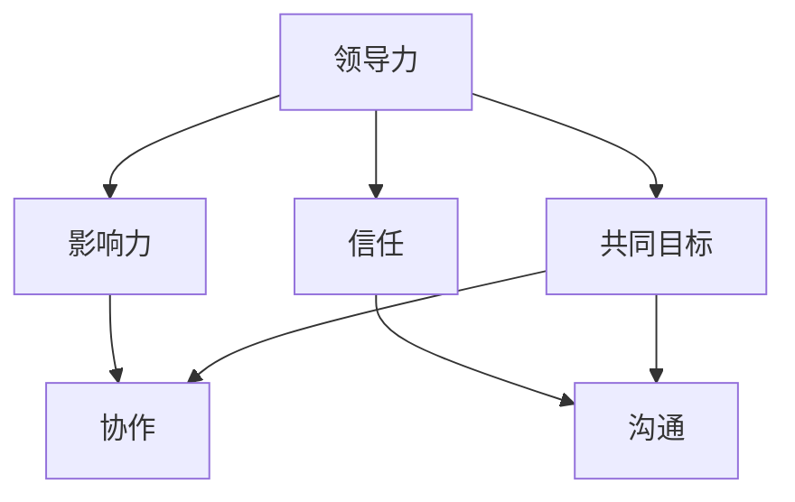

##### 1.2 领导力的核心要素

**核心概念与联系**：

核心要素包括：

- **愿景**：领导者需要具备明确的愿景，引领团队朝着共同的目标前进。
- **决策能力**：领导者需要能够在复杂的环境中做出明智的决策。
- **沟通能力**：有效的沟通能力是领导者成功的关键。

联系：
- 愿景、决策能力和沟通能力共同构成了领导力的核心要素。
- 这些要素相互作用，共同推动团队的发展和成长。

**Mermaid 流程图**：

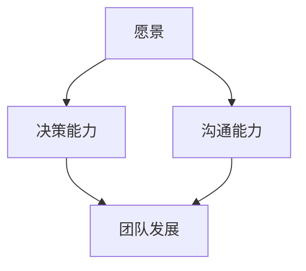

##### 1.3 领导力与管理的区别

**核心概念与联系**：

领导力与管理：

- **领导力**：关注于激励和引导他人，创造共同愿景。
- **管理**：关注于规划和执行计划，确保组织目标的实现。

联系：
- 领导力与管理相互补充，领导者需要同时具备领导力和管理能力。
- 领导力更注重长远目标和愿景，而管理更注重短期目标和效率。

**Mermaid 流程图**：

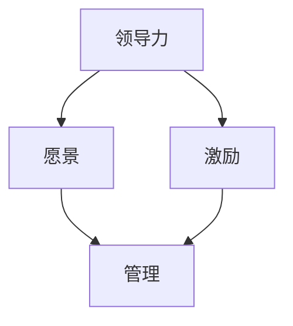

---

#### 第2章：领导力理论框架

##### 2.1 经典领导力理论

**核心概念与联系**：

经典领导力理论包括：

- **特质理论**：认为领导者具备某些天生的特质。
- **行为理论**：强调领导者通过行为和行动来影响他人。
- **权变理论**：认为领导效果取决于领导者、下属和情境。

联系：
- 这些理论从不同角度解释了领导力的本质。
- 特质理论关注领导者个人的特质，行为理论关注领导者的行为，权变理论关注领导者与情境的相互作用。

**Mermaid 流程图**：

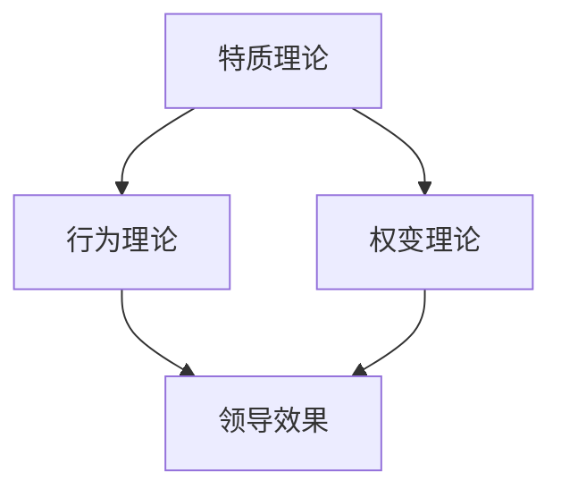

##### 2.2 现代领导力理论

**核心概念与联系**：

现代领导力理论包括：

- **领导行为四分图**：将领导行为分为任务导向和关系导向。
- **领导风格理论**：认为领导者的风格对团队绩效有重要影响。
- **情境领导理论**：认为领导效果取决于领导者对情境的适应能力。

联系：
- 这些理论更加注重领导者的行为和情境，提供了更全面的领导力框架。
- 领导行为四分图和领导风格理论强调领导者如何平衡任务和关系，情境领导理论强调领导者如何适应不同的情境。

**Mermaid 流程图**：

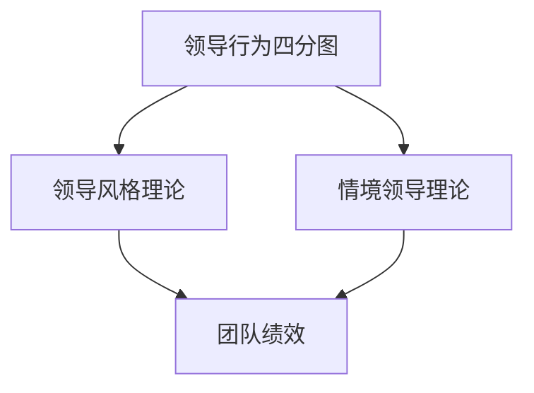

---

#### 第3章：领导力心理学基础

##### 3.1 领导力心理学概述

**核心概念与联系**：

领导力心理学研究领导者如何影响他人，以及领导者自身的心理特质。

核心概念包括：

- **领导行为**：领导者如何通过行为影响他人。
- **领导认知**：领导者如何理解和解读情境。
- **领导情感**：领导者如何处理情感和情绪。

联系：
- 领导力心理学将领导者的行为、认知和情感结合起来，提供了一种全面的领导力理解框架。

**Mermaid 流程图**：

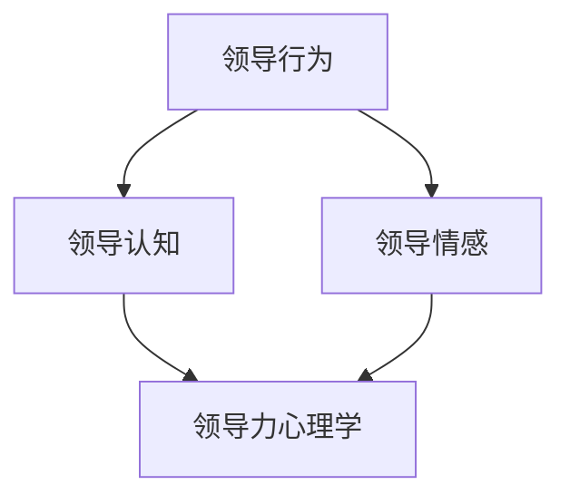

##### 3.2 领导者的认知与情绪

**核心概念与联系**：

领导者的认知与情绪：

- **认知**：领导者如何理解和解读情境，做出决策。
- **情绪**：领导者如何处理情感和情绪，影响团队氛围。

联系：
- 领导者的认知和情绪相互影响，共同决定了领导效果。

**Mermaid 流程图**：

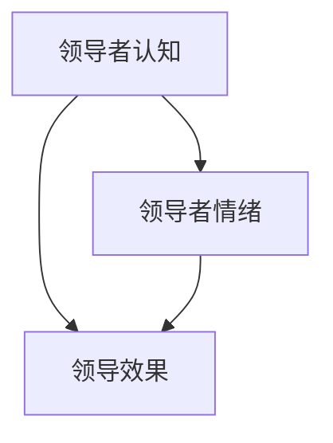

##### 3.3 领导者的个性与风格

**核心概念与联系**：

领导者的个性与风格：

- **个性**：领导者的个人特质，如自信、果断、开放等。
- **风格**：领导者处理工作和团队的方式，如权威型、民主型、参与型等。

联系：
- 领导者的个性和风格决定了其领导风格和行为，进而影响领导效果。

**Mermaid 流程图**：

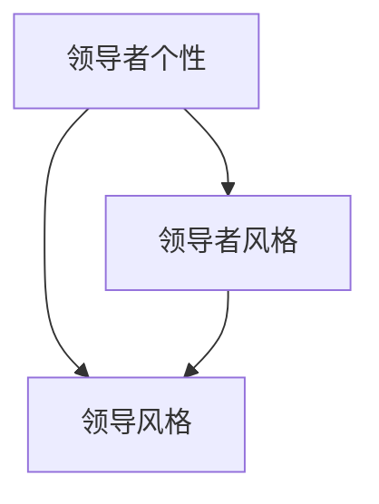

---

### 第二部分：提升领导力的策略与方法

#### 第4章：领导力发展路径

##### 4.1 自我认知与自我发展

**核心概念与联系**：

自我认知与自我发展：

- **自我认知**：领导者需要认识自己的优点和缺点，了解自己的价值观和行为模式。
- **自我发展**：领导者需要通过学习和实践来不断提升自己。

联系：
- 自我认知和自我发展是领导力提升的基础，帮助领导者更好地理解自己和团队。

**Mermaid 流程图**：

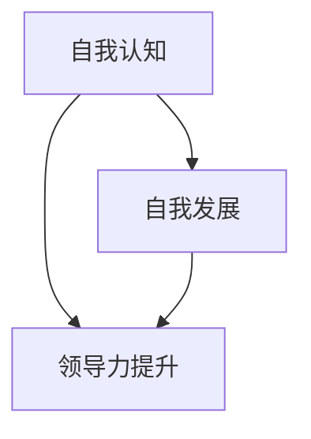

##### 4.2 情绪智力与情商管理

**核心概念与联系**：

情绪智力与情商管理：

- **情绪智力**：领导者如何识别、理解和控制自己的情绪。
- **情商管理**：领导者如何处理团队中的情绪问题，维持积极的工作氛围。

联系：
- 情绪智力是领导力的关键组成部分，情商管理帮助领导者更好地应对挑战。

**Mermaid 流程图**：

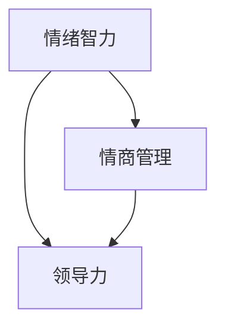

##### 4.3 团队建设与团队激励

**核心概念与联系**：

团队建设与团队激励：

- **团队建设**：领导者如何建立和维护团队关系，提高团队协作能力。
- **团队激励**：领导者如何激励团队成员，提高工作积极性和绩效。

联系：
- 团队建设和团队激励是提升团队战斗力的关键，有助于实现共同目标。

**Mermaid 流程图**：

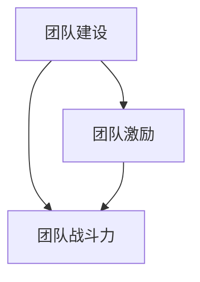

---

#### 第5章：领导力实践技巧

##### 5.1 沟通技巧

**核心概念与联系**：

沟通技巧：

- **有效沟通**：领导者如何通过清晰、准确的沟通来传达信息。
- **反馈与倾听**：领导者如何给予团队成员反馈，并有效倾听他们的意见。

联系：
- 沟通技巧是领导力的重要组成部分，直接影响团队协作和绩效。

**Mermaid 流程图**：

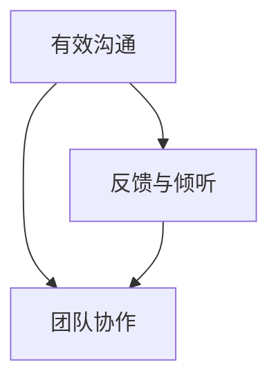

##### 5.2 决策技巧

**核心概念与联系**：

决策技巧：

- **决策分析**：领导者如何分析和评估不同决策方案。
- **风险控制**：领导者如何评估和管理决策中的风险。

联系：
- 决策技巧是领导者应对复杂问题的能力，直接影响组织的未来发展。

**Mermaid 流程图**：

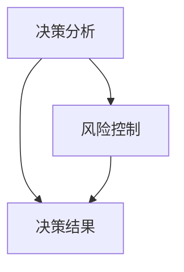

##### 5.3 危机管理

**核心概念与联系**：

危机管理：

- **危机识别**：领导者如何识别和预测潜在的危机。
- **危机应对**：领导者如何应对危机，减少损失并恢复秩序。

联系：
- 危机管理是领导者应对突发事件的必备能力，有助于维护组织的稳定和发展。

**Mermaid 流程图**：

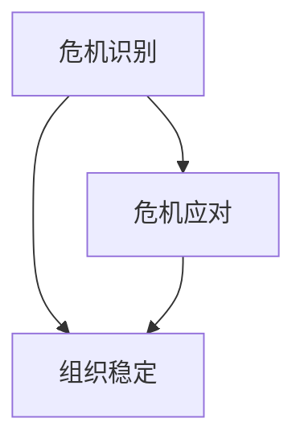

---

#### 第6章：领导力提升的工具与方法

##### 6.1 领导力评估工具

**核心概念与联系**：

领导力评估工具：

- **360度评估**：通过多角度评估领导者的能力。
- **心理测评**：通过心理测评了解领导者的个性、情商等。

联系：
- 领导力评估工具帮助领导者了解自身优势和不足，有针对性地提升领导力。

**Mermaid 流程图**：

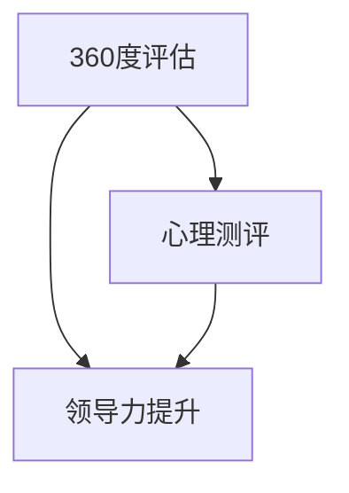

##### 6.2 领导力培训方法

**核心概念与联系**：

领导力培训方法：

- **工作坊**：通过实践和互动提升领导技能。
- **在线课程**：利用现代技术提供灵活的领导力培训。

联系：
- 领导力培训方法为领导者提供多样化的学习途径，有助于全面提升领导力。

**Mermaid 流程图**：

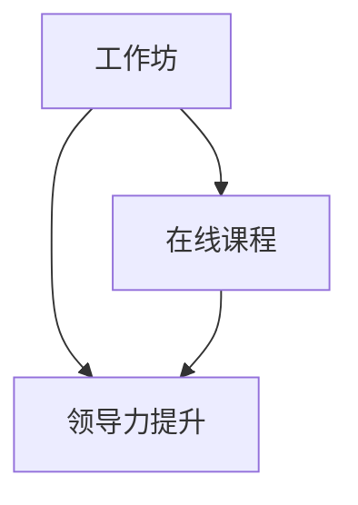

##### 6.3 领导力开发计划

**核心概念与联系**：

领导力开发计划：

- **长期规划**：为领导者的长远发展制定详细计划。
- **实践机会**：为领导者提供实践和锻炼的机会。

联系：
- 领导力开发计划帮助领导者系统化地提升领导力，为组织培养未来领导者。

**Mermaid 流程图**：

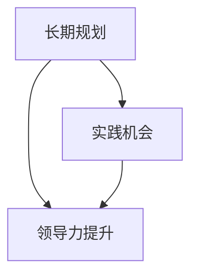

---

### 第三部分：领导力实战案例与启示

#### 第7章：领导力实战案例分析

##### 7.1 案例一：苹果公司的领导力实践

**核心概念与联系**：

苹果公司的领导力实践：

- **创新文化**：乔布斯通过建立创新文化，激发员工的创造力。
- **扁平化管理**：苹果采用扁平化的组织结构，提高决策效率。

联系：
- 苹果公司的领导力实践展示了如何通过创新文化和扁平化管理提升团队战斗力。

**Mermaid 流程图**：

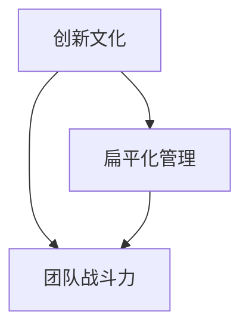

##### 7.2 案例二：亚马逊的领导力文化

**核心概念与联系**：

亚马逊的领导力文化：

- **客户至上**：贝佐斯强调客户需求是领导力的核心。
- **绩效导向**：亚马逊通过绩效评估体系激励员工。

联系：
- 亚马逊的领导力文化展示了如何通过客户至上和绩效导向提升团队绩效。

**Mermaid 流程图**：

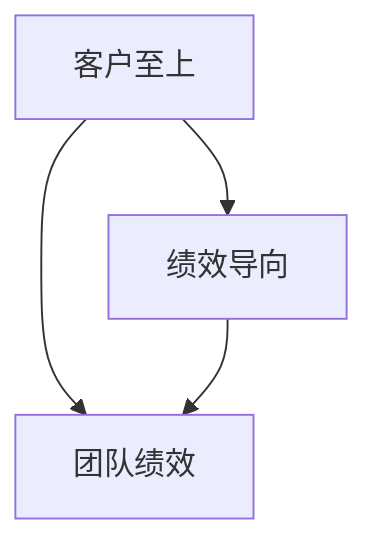

##### 7.3 案例三：华为的领导力策略

**核心概念与联系**：

华为的领导力策略：

- **全球视野**：任正非通过全球化视野，提升华为的国际竞争力。
- **人才培养**：华为注重人才培养，为员工提供发展机会。

联系：
- 华为的领导力策略展示了如何通过全球视野和人才培养提升团队竞争力。

**Mermaid 流程图**：

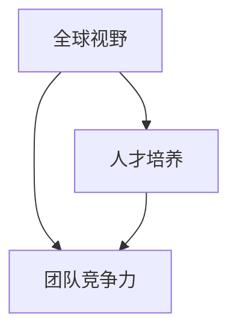

---

#### 第8章：领导力成长与团队无坚不摧

##### 8.1 从领导力到团队无坚不摧

**核心概念与联系**：

领导力成长与团队无坚不摧：

- **领导力成长**：领导者通过不断学习和实践提升自身能力。
- **团队无坚不摧**：团队在领导者的带领下，具备强大的协作能力和战斗力。

联系：
- 领导力成长是团队无坚不摧的基础，通过领导者的成长，团队得以不断提升。

**Mermaid 流程图**：

```mermaid
graph TD
A[领导力成长] --> B[团队无坚不摧]
A --> C[团队协作]
B --> C
```

##### 8.2 领导力成长的心路历程

**核心概念与联系**：

领导力成长的心路历程：

- **自我认知**：领导者通过反思和自我评估，认识自己的优点和不足。
- **持续学习**：领导者通过学习和实践，不断提升自己的能力和素质。

联系：
- 领导力成长是一个持续的过程，领导者需要不断学习和实践。

**Mermaid 流程图**：

```mermaid
graph TD
A[自我认知] --> B[持续学习]
A --> C[领导力成长]
B --> C
```

##### 8.3 团队无坚不摧的实践与启示

**核心概念与联系**：

团队无坚不摧的实践与启示：

- **实战案例**：通过实际案例，了解团队无坚不摧的具体实践。
- **启示**：总结实战经验，为其他团队提供借鉴和启示。

联系：
- 实践与启示帮助领导者更好地理解团队无坚不摧的内涵，提升团队战斗力。

**Mermaid 流程图**：

```mermaid
graph TD
A[实战案例] --> B[启示]
A --> C[团队无坚不摧]
B --> C
```

---

### 总结

本文通过深入探讨领导力的核心概念、理论框架、心理学基础，以及提升领导力的策略与方法，并结合实战案例，揭示了领导力在团队协作和战斗力提升中的关键作用。通过本文的阅读，领导者可以更好地理解领导力的本质，掌握提升领导力的方法和技巧，从而打造无坚不摧的团队。

---

**作者：AI天才研究院/AI Genius Institute & 禅与计算机程序设计艺术 /Zen And The Art of Computer Programming**

---

### 文章结尾

通过本文的详细分析，我们可以清晰地看到领导力在团队协作和战斗力提升中的关键作用。领导力不仅仅是一种能力，更是一种态度和生活方式。一个优秀的领导者需要不断学习和成长，通过自我认知、持续学习和实践，不断提升自己的领导力。

在未来的工作中，领导者可以运用本文提出的策略和方法，如团队建设与团队激励、情绪智力与情商管理、危机管理等，来提升团队的协作能力和战斗力。同时，领导者还可以借鉴实战案例中的成功经验，为自己的团队制定有效的领导力提升计划。

总之，领导力训练是每个领导者都必须经历的过程，只有通过不断的学习和实践，才能打造出无坚不摧的团队。让我们携手前行，共同提升领导力，为实现团队的目标而努力。

---

**再次感谢您的阅读，期待您在未来的领导力实践中取得卓越的成果！**

---

**作者：AI天才研究院/AI Genius Institute & 禅与计算机程序设计艺术 /Zen And The Art of Computer Programming**

---

在撰写技术博客时，为了确保内容的逻辑性和结构性，我们可以按照以下步骤进行：

1. **确定文章主题和目标**：首先，明确文章的主题和目标，这将决定文章的内容和结构。

2. **设计目录大纲**：根据文章主题和目标，设计一个逻辑清晰、层次分明的目录大纲。目录大纲应涵盖核心概念、原理讲解、实际应用和实战案例。

3. **撰写核心内容**：按照目录大纲，逐一撰写每个章节的核心内容。在撰写过程中，注意以下几点：
   - **背景介绍**：为每个概念或方法提供背景信息，帮助读者理解其来源和重要性。
   - **核心概念与联系**：详细解释核心概念，并展示概念之间的关系，可以使用Mermaid流程图来增强理解。
   - **数学模型和公式**：对于涉及数学模型的章节，使用LaTeX格式详细阐述公式，并提供举例说明。
   - **实战案例**：结合实际案例，展示概念或方法在实际中的应用，提供代码示例和解析。
   - **最佳实践 tips**：总结实战经验，为读者提供实用的建议和技巧。

4. **编辑与校对**：完成初稿后，进行多次编辑和校对，确保文章内容准确无误，语言流畅。

5. **添加作者信息和结语**：在文章末尾添加作者信息，并撰写结语，总结文章的核心观点和未来展望。

6. **格式调整**：使用markdown格式输出文章内容，确保文章在发布平台上呈现最佳效果。

7. **发布与推广**：将文章发布到目标平台，并利用社交媒体等渠道进行推广，吸引读者关注。

通过以上步骤，可以撰写出一篇逻辑清晰、内容丰富、具有实际价值的技术博客文章。这不仅有助于读者更好地理解技术概念，还能提高文章的传播效果。让我们一起努力，提升技术写作的能力，为技术社区贡献更多有价值的文章。💪💡💻

