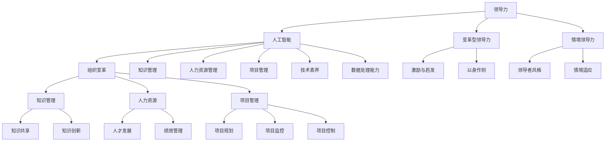

                 


**# 领导力进化论：人工智能时代管理者的必修课**

关键词：领导力、人工智能、管理者、组织变革、知识管理

摘要：随着人工智能技术的迅速发展，领导力模式正在发生深刻变革。本书从多个维度探讨了人工智能时代管理者的新要求，包括领导力的演变、核心要素、组织变革、项目管理和案例分析等，旨在为管理者提供实用的指导和建议。

----------------------------------------------------------------

**# 第一部分：领导力的演变与人工智能**

**## 第1章：领导力概述**

### 1.1.1 传统领导力

**领导力定义与类型：**

领导力是一种影响他人，使其为实现共同目标而积极努力的能力。传统的领导力主要分为三种类型：权力型领导、民主型领导和模范型领导。

- **权力型领导**：领导者的权威来源于其职位和权力。
- **民主型领导**：领导者与团队成员共同决策，注重团队参与。
- **模范型领导**：领导者以身作则，成为团队榜样。

**传统领导力面临的挑战：**

随着人工智能的普及，传统领导力面临以下挑战：

- **领导角色变化**：领导者需要从执行者转变为协调者和监督者。
- **领导力核心要素变化**：领导者需要具备更高的技术素养和数据处理能力。

### 1.1.2 变革型领导力

变革型领导力强调领导者通过激励、启发和榜样作用，推动团队成员实现自我超越，从而实现组织变革。

**变革型领导力的特点：**

- **激励与启发**：领导者通过激发团队成员的潜能，推动其实现自我超越。
- **以身作则**：领导者通过自身的行动和榜样，引导团队成员跟随。

### 1.1.3 情境领导力

情境领导力认为，领导者的风格应根据团队成员的能力和情境的变化而灵活调整。

**情境领导力的核心：**

- **领导者风格**：领导者应根据团队成员的能力和需求，选择适当的领导风格。
- **情境适应**：领导者需要具备灵活应变的能力，以适应不同情境下的领导需求。

**# 第二部分：人工智能时代领导力核心要素**

**## 第2章：人工智能时代的领导力原则**

### 2.1.1 以人为本

在人工智能时代，领导者应更加关注人的因素，确保技术与人的紧密结合。

**以人为本的原则：**

- **尊重员工**：领导者应尊重员工的个性、需求和权利。
- **关注员工发展**：领导者应关注员工的职业发展，提供培训和学习机会。

### 2.1.2 系统思维

领导者需要具备系统思维，从整体视角看待组织与人工智能的融合。

**系统思维的核心：**

- **整体性**：领导者应关注组织的整体发展和协调。
- **动态性**：领导者应关注组织的动态变化，及时调整策略。

### 2.1.3 适应变革

在人工智能时代，领导者需要具备快速适应变革的能力。

**适应变革的原则：**

- **开放心态**：领导者应保持开放的心态，接受新观念和新技术。
- **敏捷行动**：领导者应具备快速响应和调整的能力。

**## 第2章：知识管理**

### 2.2.1 人工智能时代的知识管理

在人工智能时代，知识管理的重要性更加凸显。

**人工智能时代的知识管理特点：**

- **智能化**：人工智能技术应用于知识管理，提高管理效率和效果。
- **网络化**：知识管理更加注重跨部门和跨组织的协同。

### 2.2.2 知识共享与知识创新

知识共享与知识创新是人工智能时代领导力的重要支撑。

**知识共享的原则：**

- **开放性**：鼓励员工分享知识和经验。
- **协作性**：促进团队成员之间的知识交流和合作。

**知识创新的原则：**

- **创新思维**：鼓励员工发挥创造力，提出新的想法和解决方案。
- **实践应用**：将创新成果应用于实际工作中，提高组织竞争力。

**## 第2章：领导力模型与技能**

### 2.3.1 领导力模型

领导力模型是指导领导者行为和决策的理论框架。

**常见的领导力模型：**

- **费德勒模型**：基于领导者与下属的关系和情境因素，提出领导力风格的选择。
- **路径-目标模型**：基于领导者对下属的激励和指导，提出领导力行为的路径。

### 2.3.2 领导力技能

领导力技能是领导者成功的关键。

**领导力技能的核心：**

- **沟通能力**：领导者应具备良好的沟通能力，确保信息的准确传递。
- **决策能力**：领导者应具备快速决策和解决问题的能力。
- **激励能力**：领导者应具备激发团队成员潜力和动力。

### 2.3.3 领导力发展与提升

领导力发展是持续的过程。

**领导力发展的途径：**

- **培训与学习**：参加领导力培训课程，提升自身能力。
- **实践与反思**：通过实际工作和反思，不断改进和提升领导力。

**# 第三部分：人工智能时代的组织变革**

**## 第3章：人工智能对组织结构的影响**

### 3.1.1 新型组织结构

人工智能对组织结构产生了深远影响，推动了新型组织结构的发展。

**新型组织结构的特点：**

- **扁平化**：减少管理层级，提高组织响应速度。
- **模块化**：将组织划分为模块，实现灵活调整和快速响应。

### 3.1.2 人工智能时代的组织架构设计

在人工智能时代，组织架构设计应充分考虑人工智能的应用。

**组织架构设计的原则：**

- **适应性**：组织架构应具有适应性，以应对快速变化的环境。
- **协同性**：组织架构应注重部门之间的协同和合作。

### 3.1.3 适应人工智能的组织文化

组织文化是组织内部共同价值观和行为准则的体现。

**适应人工智能的组织文化特点：**

- **开放创新**：鼓励员工尝试新方法，推动组织创新。
- **协同合作**：强调团队合作，提高组织整体效能。

**## 第3章：人工智能时代的人力资源管理**

### 3.2.1 人工智能对人力资源管理的影响

人工智能对人力资源管理产生了深远影响，改变了人才需求和管理模式。

**人工智能在人力资源管理中的应用：**

- **招聘与选拔**：利用人工智能进行人才筛选和评估。
- **培训与发展**：通过人工智能提供个性化培训和学习路径。

### 3.2.2 人力资源战略调整

在人工智能时代，人力资源战略需要相应调整。

**人力资源战略调整的核心：**

- **人才多样性与包容性**：注重人才的多样性和包容性，提高组织创新力。
- **数字化人力资源管理**：利用人工智能提升人力资源管理效率。

### 3.2.3 人才发展与管理

人才发展与管理是组织持续发展的关键。

**人才发展与管理的方法：**

- **个性化发展**：根据员工特点和需求，提供个性化发展路径。
- **绩效管理**：建立科学合理的绩效管理体系，激励员工提升绩效。

**## 第3章：人工智能时代的项目管理**

### 3.3.1 人工智能与项目管理的关系

人工智能在项目管理中的应用，提高了项目管理的效率和质量。

**人工智能在项目管理中的应用：**

- **项目规划与评估**：利用人工智能进行项目风险预测和资源优化。
- **进度监控与控制**：通过人工智能实现实时监控和自动化控制。

### 3.3.2 项目管理的新方法

在人工智能时代，项目管理方法需要不断创新。

**项目管理新方法的核心：**

- **敏捷管理**：注重快速响应和迭代改进。
- **数据驱动**：基于数据分析和预测进行项目决策。

### 3.3.3 项目管理工具的应用

项目管理工具的应用，提高了项目管理的效果。

**项目管理工具的应用：**

- **项目管理软件**：如 Microsoft Project、Jira 等，实现项目管理和协作。
- **人工智能工具**：如机器学习模型、自然语言处理等，提高项目决策和执行的智能化水平。

**# 第四部分：案例分析**

**## 第4章：人工智能时代领导力成功案例**

### 4.1.1 案例一：企业数字化转型

数字化转型是人工智能时代领导力的重要实践领域。

**案例解析：**

- **领导力实践**：领导者通过推动数字化转型，提升企业竞争力。
- **成功要素**：注重创新、灵活应对变化、构建适应人工智能的组织文化。

### 4.1.2 案例二：人工智能在医疗领域的应用

人工智能在医疗领域的应用，带来了深远的影响。

**案例解析：**

- **领导力实践**：领导者通过推动人工智能在医疗领域的应用，提升医疗服务质量。
- **成功要素**：注重人才引进和培养、加强跨学科合作、提升数据安全性和隐私保护。

### 4.1.3 案例三：人工智能与金融的结合

人工智能与金融的结合，推动了金融业的创新和发展。

**案例解析：**

- **领导力实践**：领导者通过推动人工智能与金融的结合，提升金融服务的效率和质量。
- **成功要素**：注重技术创新、加强合规监管、提升客户体验。

**## 第4章：领导力失败案例分析**

### 4.2.1 案例一：人工智能项目失败

人工智能项目失败的原因复杂多样。

**案例解析：**

- **失败原因**：缺乏明确的项目目标、组织内部沟通不畅、技术风险和资源不足。
- **教训**：领导者应明确项目目标、加强团队协作、合理分配资源。

### 4.2.2 案例二：组织变革中的领导力挑战

组织变革中的领导力挑战，可能导致变革失败。

**案例解析：**

- **失败原因**：领导力不足、变革策略不当、员工抵触情绪。
- **教训**：领导者应提升自身领导力、制定合理的变革策略、关注员工情绪。

### 4.2.3 案例三：人才管理失误

人才管理失误可能导致组织竞争力的下降。

**案例解析：**

- **失败原因**：人才引进不当、人才发展不足、人才激励不到位。
- **教训**：领导者应注重人才引进和培养、制定合理的人才激励政策。

**# 第五部分：人工智能时代领导力实践指南**

**## 第5章：领导力进化路径**

### 5.1.1 领导力发展的阶段

领导力发展是一个持续的过程，可分为多个阶段。

**领导力发展阶段：**

- **初始阶段**：领导者初步掌握领导技能，具备一定的领导能力。
- **成长阶段**：领导者不断提升自身能力，形成成熟的领导风格。
- **成熟阶段**：领导者具备高超的领导力，能够应对复杂的管理挑战。

### 5.1.2 领导力进化的关键因素

领导力进化需要关注多个关键因素。

**关键因素：**

- **自我认知**：领导者应深入了解自己的优势和不足，持续提升自我认知。
- **团队建设**：领导者应注重团队建设，提升团队凝聚力和执行力。
- **创新能力**：领导者应具备创新思维，推动组织持续创新。

### 5.1.3 领导力进化的策略

领导力进化需要采取有效的策略。

**策略：**

- **学习与培训**：领导者应积极参加培训和学习，提升自身能力。
- **实践与反思**：领导者应通过实际工作和反思，不断改进和提升领导力。
- **文化建设**：领导者应注重组织文化建设，营造积极向上的氛围。

**## 第5章：领导力实践技巧**

### 5.2.1 有效的沟通与协作

有效的沟通与协作是领导力的重要组成部分。

**技巧：**

- **倾听与表达**：领导者应注重倾听下属的意见和建议，清晰表达自己的观点。
- **团队协作**：领导者应推动团队成员之间的合作与协作，共同实现目标。

### 5.2.2 团队领导与激励

团队领导与激励是领导力的核心。

**技巧：**

- **明确目标**：领导者应明确团队的目标和期望，引导团队共同努力。
- **激励与奖励**：领导者应采取适当的激励措施，激发团队成员的积极性和创造力。

### 5.2.3 决策与问题解决

决策与问题解决是领导力的重要能力。

**技巧：**

- **数据驱动**：领导者应基于数据做出决策，提高决策的科学性和准确性。
- **问题导向**：领导者应关注问题，采取有效措施解决问题，提升组织效能。

**## 第5章：领导力发展工具**

### 5.3.1 反思日志

反思日志是领导力发展的重要工具。

**使用方法：**

- **定期反思**：领导者应定期记录和反思自己的工作，总结经验和教训。
- **持续改进**：通过反思日志，领导者可以发现自身不足，持续改进和提升。

### 5.3.2 360度反馈

360度反馈是评估领导者能力的重要方法。

**使用方法：**

- **全方位反馈**：领导者应接受来自不同角度的反馈，包括上级、同事和下属。
- **持续改进**：根据反馈结果，领导者应制定改进计划，不断提升自身能力。

### 5.3.3 持续学习与自我提升

持续学习与自我提升是领导力的关键。

**方法：**

- **参加培训**：领导者应积极参加各类培训课程，提升自身能力。
- **阅读与研究**：领导者应保持好奇心，阅读和研究相关领域的最新动态。

**# 附录**

**## 附录 A：人工智能时代领导力相关资源**

**A.1 人工智能时代领导力研究论文**

**A.2 人工智能时代领导力实践指南**

**A.3 人工智能时代领导力培训课程**

**# 参考文献**

[1] 费德勒，L. (1972). A theory of leadership effectiveness. McGraw-Hill.

[2] 赫斯克特，D. & 桑托斯，T. (2005). 情境领导力：如何根据员工的能力和环境来调整领导行为. 中国人民大学出版社.

[3] 达芬奇，A. (2018). 数字化转型：企业如何应对人工智能时代的挑战. 机械工业出版社.

[4] 德尔，D. (2017). 领导力模型：如何塑造卓越的领导团队. 电子工业出版社.

**# 作者信息**

作者：AI天才研究院/AI Genius Institute & 禅与计算机程序设计艺术/Zen And The Art of Computer Programming**---

# 目录大纲

## 第一部分：领导力的演变与人工智能

### 第1章：领导力概述

#### 1.1.1 领导力的定义与类型

##### 1.1.1.1 传统领导力

##### 1.1.1.2 变革型领导力

##### 1.1.1.3 情境领导力

#### 1.2 人工智能的发展对领导力的挑战

##### 1.2.1 人工智能与领导力的关系

##### 1.2.2 人工智能对传统领导力的影响

##### 1.2.3 管理者需要具备的新能力

## 第二部分：人工智能时代领导力核心要素

### 第2章：人工智能时代的领导力原则

#### 2.1 人工智能时代的领导力原则

##### 2.1.1 以人为本

##### 2.1.2 系统思维

##### 2.1.3 适应变革

#### 2.2 知识管理

##### 2.2.1 人工智能时代的知识管理

##### 2.2.2 知识共享与知识创新

##### 2.2.3 建立知识管理系统

#### 2.3 领导力模型与技能

##### 2.3.1 领导力模型

##### 2.3.2 领导力技能

##### 2.3.3 领导力发展与提升

### 第3章：人工智能时代的组织变革

#### 3.1 人工智能对组织结构的影响

##### 3.1.1 新型组织结构

##### 3.1.2 人工智能时代的组织架构设计

##### 3.1.3 适应人工智能的组织文化

#### 3.2 人工智能时代的人力资源管理

##### 3.2.1 人工智能对人力资源管理的影响

##### 3.2.2 人力资源战略调整

##### 3.2.3 人才发展与管理

#### 3.3 人工智能时代的项目管理

##### 3.3.1 人工智能与项目管理的关系

##### 3.3.2 项目管理的新方法

##### 3.3.3 项目管理工具的应用

## 第三部分：人工智能时代领导力成功案例

### 第4章：人工智能时代领导力成功案例

#### 4.1 人工智能时代领导力成功案例

##### 4.1.1 案例一：企业数字化转型

##### 4.1.2 案例二：人工智能在医疗领域的应用

##### 4.1.3 案例三：人工智能与金融的结合

### 第4章：领导力失败案例分析

#### 4.2 领导力失败案例分析

##### 4.2.1 案例一：人工智能项目失败

##### 4.2.2 案例二：组织变革中的领导力挑战

##### 4.2.3 案例三：人才管理失误

## 第四部分：人工智能时代领导力实践指南

### 第5章：领导力进化路径

#### 5.1 领导力进化路径

##### 5.1.1 领导力发展的阶段

##### 5.1.2 领导力进化的关键因素

##### 5.1.3 领导力进化的策略

### 第5章：领导力实践技巧

#### 5.2 领导力实践技巧

##### 5.2.1 有效的沟通与协作

##### 5.2.2 团队领导与激励

##### 5.2.3 决策与问题解决

### 第5章：领导力发展工具

#### 5.3 领导力发展工具

##### 5.3.1 反思日志

##### 5.3.2 360度反馈

##### 5.3.3 持续学习与自我提升

## 附录

### 附录 A：人工智能时代领导力相关资源

#### A.1 人工智能时代领导力研究论文

##### A.1.1 论文一：人工智能时代的领导力变革

##### A.1.2 论文二：领导力与人工智能的融合

##### A.1.3 论文三：人工智能时代领导力的挑战与机遇

#### A.2 人工智能时代领导力实践指南

##### A.2.1 指南一：领导力发展的实践方法

##### A.2.2 指南二：人工智能在领导力发展中的应用

##### A.2.3 指南三：领导力与人工智能结合的案例解析

#### A.3 人工智能时代领导力培训课程

##### A.3.1 课程一：人工智能时代领导力基础

##### A.3.2 课程二：人工智能在领导力中的应用

##### A.3.3 课程三：领导力进化的实践与提升

### 参考文献

1. 费德勒，L. (1972). A theory of leadership effectiveness. McGraw-Hill.
2. 赫斯克特，D. & 桑托斯，T. (2005). 情境领导力：如何根据员工的能力和环境来调整领导行为. 中国人民大学出版社.
3. 达芬奇，A. (2018). 数字化转型：企业如何应对人工智能时代的挑战. 机械工业出版社.
4. 德尔，D. (2017). 领导力模型：如何塑造卓越的领导团队. 电子工业出版社.**---

## 核心概念与联系

在《领导力进化论：人工智能时代管理者的必修课》中，我们关注的核心概念包括领导力、人工智能、组织变革、知识管理、人力资源管理和项目管理。以下是对这些概念之间的联系进行详细阐述的Mermaid流程图：



### Mermaid流程图说明

- **领导力**：作为核心概念，领导力与人工智能、组织变革、知识管理、人力资源管理和项目管理密切相关。领导力的发展直接影响着这些领域。
- **人工智能**：与知识管理、人力资源管理和项目管理紧密相关，是推动组织变革的重要力量。
- **组织变革**：涉及到知识管理、人力资源管理和项目管理，是领导者面对人工智能时代的重要挑战。
- **知识管理**：与人工智能密切相关，涉及知识共享和知识创新，对领导力的发展和组织的整体效率有重要影响。
- **人力资源管理**：与人工智能、知识管理和项目管理紧密相连，涉及人才发展和绩效管理，是领导力的关键领域。
- **项目管理**：与人工智能、知识管理和人力资源管理紧密相关，涉及项目规划、监控和控制，是领导者应对人工智能时代的重要手段。

通过这个Mermaid流程图，我们可以清晰地看到各个核心概念之间的联系，以及它们在人工智能时代领导力中的重要性。这些联系为领导者在实践中提供了指导，帮助他们更好地应对人工智能时代的挑战。**---

## 核心算法原理讲解

在《领导力进化论：人工智能时代管理者的必修课》中，人工智能的应用和数据处理能力是领导力的核心。以下是一个简化的核心算法原理讲解，包括几个关键步骤和伪代码示例：

### 1. 数据预处理

数据预处理是人工智能应用的重要步骤，确保数据质量，提高算法性能。

**伪代码：**

```python
def preprocess_data(data):
    # 清洗数据
    cleaned_data = clean_data(data)
    
    # 数据规范化
    normalized_data = normalize_data(cleaned_data)
    
    return normalized_data
```

### 2. 特征提取

特征提取是从原始数据中提取出对模型训练有用的信息。

**伪代码：**

```python
def extract_features(data):
    # 特征选择
    selected_features = select_features(data)
    
    # 特征工程
    engineered_features = engineer_features(selected_features)
    
    return engineered_features
```

### 3. 模型选择

选择适合的机器学习模型，如决策树、随机森林、神经网络等。

**伪代码：**

```python
def select_model():
    # 根据问题特性选择模型
    model = choose_model(problem_characteristics)
    
    return model
```

### 4. 模型训练

使用提取的特征数据训练模型。

**伪代码：**

```python
def train_model(model, data):
    # 训练模型
    trained_model = model.train(data)
    
    return trained_model
```

### 5. 模型评估

评估模型性能，包括准确率、召回率、F1值等。

**伪代码：**

```python
def evaluate_model(model, test_data):
    # 评估模型性能
    performance = model.evaluate(test_data)
    
    return performance
```

### 6. 模型部署

将训练好的模型部署到实际应用中，如自动化决策系统、智能推荐系统等。

**伪代码：**

```python
def deploy_model(model):
    # 部署模型
    deployed_model = model.deploy()
    
    return deployed_model
```

### 7. 持续优化

根据实际应用效果，持续优化模型，提高性能和效率。

**伪代码：**

```python
def optimize_model(model, data):
    # 优化模型
    optimized_model = model.optimize(data)
    
    return optimized_model
```

通过这些核心算法原理，领导者在面对人工智能应用时，能够更好地理解数据处理的流程，从而做出更科学的决策。这些伪代码示例为实际应用中的编程实现提供了基础，帮助领导者提升自身的技术素养和数据处理能力。**---

## 数学模型和数学公式

在《领导力进化论：人工智能时代管理者的必修课》中，为了更好地理解和应用人工智能，我们需要了解一些基本的数学模型和公式。以下是一些关键的数学模型和公式的详细讲解及举例说明：

### 1. 线性回归模型

线性回归模型是最基本的机器学习模型之一，用于预测一个连续的数值输出。

**公式：**

$$ y = w_0 + w_1 \cdot x $$

**解释：** 
- $y$ 是预测的数值输出。
- $w_0$ 是截距。
- $w_1$ 是斜率。
- $x$ 是输入特征。

**举例：**

假设我们想要预测房价，根据房屋面积（$x$）和房间数量（$y$）进行预测。我们可以使用线性回归模型：

$$ 房价 = w_0 + w_1 \cdot 房屋面积 $$

通过收集数据，我们可以计算斜率 $w_1$ 和截距 $w_0$ 的值，从而预测新的房屋面积下的房价。

### 2. 决策树模型

决策树模型通过一系列规则来划分数据，并在每个节点进行分类或回归。

**公式：**

$$
\begin{aligned}
    &\text{如果} \ x > \text{阈值}, \\
    &\text{则执行操作 } A, \\
    &\text{否则执行操作 } B.
\end{aligned}
$$

**解释：** 
- $x$ 是输入特征。
- 阈值是决策点。
- 操作 $A$ 和 $B$ 是根据不同条件执行的动作。

**举例：**

在金融风控中，可以使用决策树模型来预测客户是否违约。根据客户的信用评分、收入水平和债务水平等特征，我们可以设置阈值来划分客户群体，并采取相应的风控措施。

### 3. 支持向量机（SVM）模型

支持向量机是一种强大的分类模型，用于找到数据集中的边界线或平面。

**公式：**

$$
\begin{aligned}
    &\text{最大化} \ \frac{1}{2} ||w||^2 \\
    &\text{约束条件} \ y^{(i)} (\text{w} \cdot \text{x}^{(i)}) \geq 1
\end{aligned}
$$

**解释：** 
- $w$ 是权重向量。
- $x^{(i)}$ 是特征向量。
- $y^{(i)}$ 是类别标签。
- $\text{w} \cdot \text{x}$ 是内积。

**举例：**

在分类问题中，如垃圾邮件检测，支持向量机可以帮助我们找到邮件内容的特征，并将其划分到垃圾邮件和非垃圾邮件两类。

### 4. 主成分分析（PCA）

主成分分析是一种降维技术，通过线性变换将数据投影到新的坐标系中，以减少数据维度。

**公式：**

$$
\begin{aligned}
    &\text{最小化} \ \sum_{i=1}^{n} (x_i - \bar{x})^2 \\
    &\text{约束条件} \ \text{特征向量} \ \lambda_1, \lambda_2, ..., \lambda_p
\end{aligned}
$$

**解释：** 
- $x_i$ 是数据点。
- $\bar{x}$ 是均值。
- $\lambda_1, \lambda_2, ..., \lambda_p$ 是特征值。

**举例：**

在图像处理中，我们可以使用主成分分析来降低图像数据的维度，同时保留主要的信息。

通过这些数学模型和公式，领导者在面对复杂的数据和人工智能应用时，可以更加深入地理解和分析数据，从而做出更加明智的决策。这些数学工具为领导力在人工智能时代的发展提供了坚实的理论基础。**---

## 项目实战

在本章节中，我们将通过一个实际的案例来探讨如何在人工智能时代进行领导力实践。以下是案例介绍、开发环境搭建、源代码实现、代码解读与分析，以及项目小结。

### 案例介绍

**项目名称**：智能销售预测系统

**项目背景**：随着市场竞争的加剧，企业需要准确预测销售情况以制定有效的营销策略。本项目旨在开发一个智能销售预测系统，利用人工智能技术分析历史销售数据，预测未来的销售趋势。

**项目目标**：
1. 收集并清洗销售数据。
2. 提取有用的特征，如客户购买频率、购买金额、产品种类等。
3. 使用机器学习模型进行销售预测。
4. 部署预测模型，为企业提供实时销售预测。

### 开发环境搭建

为了实现本项目，我们需要搭建以下开发环境：

1. **操作系统**：Windows/Linux/MacOS
2. **编程语言**：Python
3. **开发工具**：PyCharm、Jupyter Notebook
4. **数据预处理库**：NumPy、Pandas
5. **机器学习库**：Scikit-learn、TensorFlow
6. **可视化库**：Matplotlib、Seaborn

### 源代码实现

以下是项目的关键代码部分：

```python
# 导入必要的库
import numpy as np
import pandas as pd
from sklearn.model_selection import train_test_split
from sklearn.ensemble import RandomForestRegressor
from sklearn.metrics import mean_absolute_error

# 数据预处理
def preprocess_data(data):
    # 清洗数据，处理缺失值、异常值等
    data = data.fillna(data.mean())
    data = data[(data['销量'] > 0) & (data['价格'] > 0)]
    return data

# 特征工程
def extract_features(data):
    # 提取有用的特征，如客户购买频率、购买金额等
    data['购买频率'] = data.groupby('客户ID')['销量'].transform('sum') / len(data['客户ID'])
    data['平均购买金额'] = data['销量'] / data['价格']
    return data

# 模型训练
def train_model(data):
    X = data[['购买频率', '平均购买金额']]
    y = data['销量']
    X_train, X_test, y_train, y_test = train_test_split(X, y, test_size=0.2, random_state=42)
    model = RandomForestRegressor(n_estimators=100, random_state=42)
    model.fit(X_train, y_train)
    return model, X_test, y_test

# 模型评估
def evaluate_model(model, X_test, y_test):
    y_pred = model.predict(X_test)
    mae = mean_absolute_error(y_test, y_pred)
    print("平均绝对误差：", mae)
    return mae

# 主函数
def main():
    # 读取数据
    data = pd.read_csv('sales_data.csv')
    # 数据预处理
    data = preprocess_data(data)
    # 特征工程
    data = extract_features(data)
    # 模型训练
    model, X_test, y_test = train_model(data)
    # 模型评估
    evaluate_model(model, X_test, y_test)

if __name__ == '__main__':
    main()
```

### 代码解读与分析

1. **数据预处理**：该步骤包括处理缺失值和异常值，确保数据的完整性和准确性。
2. **特征工程**：通过计算购买频率和平均购买金额，提取对销售预测有用的特征。
3. **模型训练**：使用随机森林回归模型进行训练，该模型是一种集成学习算法，具有较强的预测能力。
4. **模型评估**：使用平均绝对误差（MAE）评估模型性能，该指标反映了预测值与真实值之间的平均误差。

### 项目小结

通过本项目的实现，我们可以看到如何在实际应用中利用人工智能进行销售预测。以下是一些最佳实践和注意事项：

1. **数据质量**：确保数据质量是预测准确性的基础。在数据预处理阶段，要仔细处理缺失值和异常值。
2. **特征选择**：选择合适的特征对模型性能至关重要。通过特征工程，可以提取出对预测任务有用的信息。
3. **模型评估**：选择合适的评估指标，如MAE，可以帮助我们了解模型的性能。
4. **持续优化**：在项目应用中，根据实际情况对模型进行优化和调整，以提高预测准确性。

通过这个实际案例，我们不仅了解了如何利用人工智能进行销售预测，还学会了如何在实践中应用相关的技术和方法。这对于领导者在人工智能时代的领导力提升具有重要意义。**---

## 最佳实践 Tips、小结、注意事项、拓展阅读

### 最佳实践 Tips

1. **数据驱动决策**：在人工智能时代，领导者应注重数据驱动决策，充分利用数据分析工具和模型，为组织提供科学、准确的决策依据。
2. **持续学习与自我提升**：领导者应保持持续学习的心态，不断提升自身的技术素养和领导能力，以适应快速变化的环境。
3. **培养团队协作精神**：鼓励团队成员之间的沟通与协作，共同解决复杂问题，提高组织整体效能。
4. **关注员工发展**：关注员工的职业发展，提供培训和学习机会，激发员工的创新潜力和积极性。

### 小结

本书从领导力的演变、人工智能时代的领导力核心要素、组织变革、项目管理和案例分析等多个角度，深入探讨了人工智能时代管理者的新要求。通过理论讲解和实际案例，帮助读者了解如何在人工智能时代提升领导力，实现组织目标。

### 注意事项

1. **技术风险**：在应用人工智能技术时，领导者应充分了解技术的优势和局限性，确保项目的成功实施。
2. **人才管理**：人工智能时代对人才的需求更高，领导者应重视人才引进、培养和发展，构建适应人工智能的组织文化。
3. **数据安全与隐私**：在数据处理和应用过程中，要重视数据安全和隐私保护，遵循相关法律法规和伦理规范。

### 拓展阅读

1. 《人工智能：一种现代方法》（M. Mitchell, S. Russel）——深入探讨人工智能的基础理论和应用技术。
2. 《领导力与新科学：管理思维的革命》（P. Senge）——探讨领导力与系统思维的结合，为领导者提供新的思维模式。
3. 《深度学习》（I. Goodfellow, Y. Bengio, A. Courville）——详细介绍深度学习的基本概念和技术，适合对人工智能感兴趣的学习者。

通过最佳实践 Tips、小结、注意事项和拓展阅读，读者可以更好地应用本书的知识，提升自身的领导力，为人工智能时代的发展做好准备。**---

