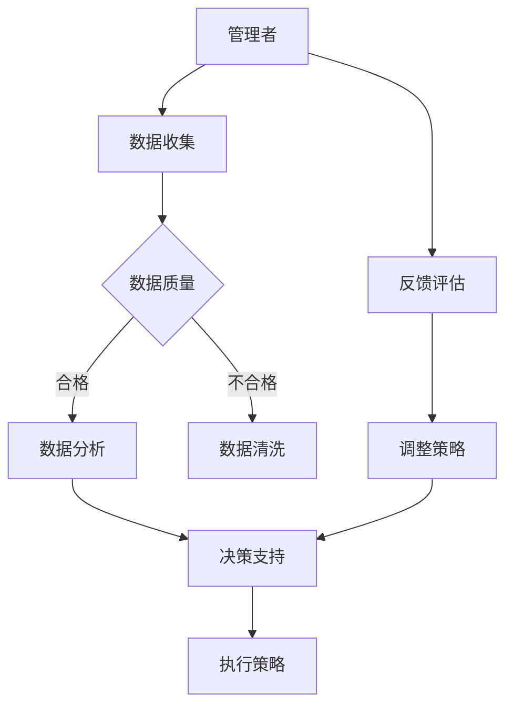

                 


### 1.1 书籍背景与目标

在快速变化的世界中，领导力的重要性愈发凸显。传统管理方法在应对日益复杂和快速演变的环境时，往往显得力不从心。为了更好地适应这种变化，本书《领导力进化论：人工智能时代管理者的领导力修炼》旨在探讨人工智能时代管理者的领导力培养和提升方法。通过系统地分析人工智能技术对管理实践的深刻影响，本书希望为管理者提供一套行之有效的领导力修炼指南。

本书的目标在于：

1. **揭示人工智能时代领导力的新特点**：通过对人工智能技术的深入理解，本书将揭示其在领导力培养中的新特点，帮助管理者识别和应对这些变化。
2. **构建领导力进化模型**：本书将构建一个基于人工智能技术的领导力进化模型，帮助管理者理解领导力的演变过程，并找到提升领导力的有效路径。
3. **提供实际操作指南**：本书不仅提供理论上的指导，还包含大量的案例分析和实践操作指南，帮助管理者在实际工作中应用这些理论。
4. **探讨未来趋势**：本书将前瞻性地探讨人工智能时代领导力的未来趋势，为管理者提供长远的发展视角。

通过以上目标，本书希望帮助管理者在人工智能时代中找到自身的定位，提升领导力，从而更好地引领团队和组织走向成功。

### 1.2 领导力的重要性与演变

领导力，作为一种重要的管理能力，对于组织的发展和成功具有至关重要的作用。简单来说，领导力是指引导和激励他人共同实现目标的能力。它不仅仅关乎权力和权威，更重要的是关于影响、沟通和激励。

**传统领导力** 的概念源于工业革命时期，那时组织结构较为简单，领导者主要依赖于职位权力和规章制度来管理团队。传统领导力强调的是命令与控制，领导者通过制定明确的任务目标和绩效指标，来确保团队高效地完成任务。然而，随着时代的发展，特别是在信息社会和知识经济的背景下，传统领导力的局限性逐渐显现。

**现代领导力** 的理念开始逐渐兴起，它强调领导者与团队成员之间的互动和合作。现代领导者不再仅仅是任务分配者，而是团队成员的导师、教练和伙伴。他们通过激发团队成员的内在动力，共同创造价值。现代领导力关注的是团队的共同成长和长期发展，而不仅仅是短期绩效。

**人工智能时代领导力** 的特点与以往不同，具有以下几方面的变化：

1. **数据驱动的决策**：人工智能技术为领导者提供了海量的数据，使得决策更加科学和精准。领导者可以通过数据分析，了解团队成员的工作状况、团队的整体绩效，以及外部环境的变化，从而做出更为明智的决策。
2. **个性化管理**：人工智能技术可以帮助领导者更准确地了解团队成员的个性和需求，从而提供个性化的管理方法。通过数据分析，领导者可以识别团队成员的优势和短板，提供有针对性的培训和发展机会，提高团队的整体效能。
3. **跨界合作**：人工智能技术使得领导者需要具备跨学科的知识和技能，能够与不同领域的专家进行有效的沟通和协作。领导者不再是单一的领导者角色，而是需要成为跨领域的协调者和催化剂。
4. **持续学习**：在人工智能时代，技术和知识更新速度非常快，领导者必须保持持续学习的态度，不断更新自己的知识和技能，以适应不断变化的环境。

总之，领导力的演变是一个从传统到现代，再到人工智能时代的不断进步过程。在这个过程中，领导者需要不断调整自己的思维方式和管理方法，以适应时代的变化。人工智能技术的引入，为领导力的发展带来了新的机遇和挑战，使得领导者需要具备更高的综合素质和创新能力。

### 1.3 人工智能时代背景及影响

进入21世纪以来，人工智能（AI）技术的发展速度迅猛，已经成为改变全球各行业格局的重要力量。从早期的机器学习和深度学习，到如今的自然语言处理、计算机视觉等，人工智能技术在各个领域都展现出了强大的潜力。那么，人工智能时代究竟是什么，它又对人类社会产生了哪些深远影响？

首先，**人工智能时代的定义** 可以从技术层面和社会层面两个角度来理解。从技术层面看，人工智能时代指的是以人工智能技术为核心，驱动产业升级和社会变革的新时代。这一时代以深度学习、神经网络、大数据等核心技术为支撑，实现了从模拟到智能的跨越。从社会层面看，人工智能时代是人类社会迈向更加智能化、自动化的新阶段，它不仅改变了生产方式，也深刻影响了人们的生活方式和社会结构。

在**人工智能技术的主要发展方面**，我们可以列举以下几个关键领域：

1. **机器学习**：机器学习是人工智能的核心技术之一，通过算法让计算机从数据中学习，从而进行预测和决策。近年来，随着算法的优化和数据量的增加，机器学习在图像识别、语音识别、自然语言处理等领域取得了显著的成果。
2. **深度学习**：深度学习是机器学习的一种重要分支，通过多层神经网络模型进行复杂的数据分析和模式识别。深度学习在图像识别、自动驾驶、医疗诊断等领域的应用已经达到了前所未有的水平。
3. **计算机视觉**：计算机视觉技术使得计算机能够“看到”和理解周围的世界。通过图像处理和模式识别，计算机视觉在安防监控、无人驾驶、机器人等领域发挥了重要作用。
4. **自然语言处理**：自然语言处理（NLP）技术使计算机能够理解和处理人类语言。NLP在智能客服、语音助手、机器翻译等领域的应用已经越来越普及。
5. **机器人技术**：机器人技术结合了计算机视觉、自然语言处理、控制技术等多种技术，实现了机器人在工业制造、服务、医疗等领域的广泛应用。

在**人工智能技术的影响**方面，其对社会、经济、文化和伦理等方面都产生了深远的影响：

1. **经济影响**：人工智能技术的广泛应用提高了生产效率，降低了成本，推动了新的产业形态的出现。同时，它也带来了就业市场的变革，一些传统岗位被自动化替代，但同时也创造了新的就业机会。
2. **社会影响**：人工智能技术改变了人们的生活方式，使得生活更加便捷和智能化。智能家庭、智能交通、智能医疗等应用让人们的日常生活更加高效和舒适。
3. **文化影响**：人工智能技术的发展对文化产生了深刻的影响。虚拟现实、增强现实等技术使得文化创作和传播方式发生了变化，人们可以更加沉浸式地体验文化内容。
4. **伦理影响**：人工智能技术的快速发展也带来了伦理挑战。数据隐私、算法偏见、机器伦理等问题需要引起重视，确保人工智能技术的应用符合道德和伦理标准。

总之，人工智能时代的到来不仅改变了我们生产和管理的方式，也深刻影响了我们的生活方式和社会结构。在这个新时代，领导者需要具备对人工智能技术的深刻理解，能够有效地利用这些技术来提升领导力和管理效能。

### 1.4 管理者领导力修炼的必要性

在人工智能时代，管理者的角色和职责发生了显著变化，对领导力的要求也越来越高。首先，随着人工智能技术的普及，传统的管理方法已经无法满足现代组织的需求。管理者不仅需要具备技术知识，还需要具备适应快速变化环境的领导能力。因此，领导力修炼对于管理者来说变得尤为必要。

**管理者领导力修炼的重要性** 可以从以下几个方面进行阐述：

1. **应对复杂性**：人工智能时代的管理环境更加复杂，信息量庞大，决策难度增加。管理者需要具备较强的分析能力和决策能力，能够快速准确地评估形势，制定有效的策略。
2. **激发团队潜力**：人工智能时代，个体的作用变得更加重要。管理者需要能够激发团队成员的潜力，建立高效协作的团队。这要求管理者具备优秀的沟通能力、激励能力和团队管理能力。
3. **引领创新**：人工智能技术不断进步，创新成为企业竞争力的关键。管理者需要具备创新思维和领导能力，能够引领团队探索新的业务模式和技术应用。
4. **适应变革**：人工智能时代，技术和市场变化迅速，管理者需要具备快速适应变革的能力。这包括持续学习、自我更新和灵活应对变化的心态。

**管理者领导力修炼的具体方法** 包括以下几个方面：

1. **自我认知**：管理者需要深入了解自己的优势和不足，建立清晰的自我认知。这可以通过定期进行自我反思、参加领导力评估和培训来实现。
2. **持续学习**：在人工智能时代，知识更新速度极快，管理者需要具备持续学习的能力。可以通过参加线上课程、阅读专业书籍、参与行业研讨会等方式不断更新知识和技能。
3. **实践锻炼**：理论知识和实际操作之间往往存在差距。管理者需要通过实际工作来锻炼自己的领导能力，可以参与项目管理、跨部门协作等活动，提高实践能力。
4. **反思与总结**：每一次实践都是一次学习和成长的机会。管理者需要善于总结经验，从成功和失败中吸取教训，不断提升自己的领导力水平。
5. **培养他人**：优秀的管理者不仅关注自己的成长，还关注团队成员的发展。通过培养和激励团队成员，管理者可以提升整个团队的能力和绩效。

总之，在人工智能时代，管理者的领导力修炼不仅是为了提升个人素质，更是为了应对复杂多变的环境，引领团队和组织走向成功。通过不断的学习、实践和反思，管理者可以不断提升自己的领导力，成为人工智能时代的卓越领导者。

### 2.1 领导力定义与类型

领导力是一种复杂而多维的概念，它不仅仅是权力和权威的象征，更是引导和激励他人共同实现目标的能力。为了更好地理解领导力，首先需要对其进行定义和分类。

**领导力的定义** 可以从多个角度来理解。首先，领导力是“关于如何影响和激励他人实现共同目标的能力”。这种定义强调了领导力是一种互动过程，涉及到领导者与追随者之间的相互作用。其次，领导力可以被视为一种“行为和态度的组合”，它包括沟通技巧、决策能力、激励措施等多个方面。最后，领导力也是一种“价值观和信念的体现”，领导者通过自身的价值观和行为影响团队成员，建立共同的目标和愿景。

**领导力的类型** 可以根据不同的维度进行分类。以下是一些常见的领导力类型：

1. **传统领导力**：传统领导力强调的是权威和命令，领导者通过职位权力来管理团队。这种领导力类型通常适用于较为稳定和结构化的环境，但在快速变化和高度不确定的环境中可能显得不够灵活。
2. **现代领导力**：现代领导力强调的是互动和合作，领导者通过与团队成员的沟通和协作来共同实现目标。这种领导力类型更加注重团队的共同成长和长期发展，适用于复杂和动态的环境。
3. **变革型领导力**：变革型领导力注重引导和激励团队成员，通过变革来实现组织的目标。这种领导力类型强调领导者的远见和创新精神，能够带领团队克服困难和挑战。
4. **服务型领导力**：服务型领导力强调领导者为团队成员提供服务，以满足他们的需求和期望。这种领导力类型强调领导者的责任感和关怀，能够建立高效和积极的团队氛围。
5. **跨界领导力**：跨界领导力强调领导者需要具备跨学科的知识和技能，能够在不同领域之间进行有效的沟通和协作。这种领导力类型在人工智能时代尤为重要，因为人工智能技术的发展使得知识跨界成为必然趋势。

每种领导力类型都有其独特的特点和适用场景。了解不同类型的领导力，可以帮助管理者根据实际情况选择合适的领导方式，提升管理效能。

**领导力的核心概念** 包括以下几个方面：

1. **影响力**：影响力是领导力的核心要素，它指的是领导者如何影响他人的能力和技巧。领导者需要通过沟通、激励、榜样作用等多种方式来提升自己的影响力。
2. **目标导向**：领导力强调的是目标导向，领导者需要明确团队的目标，并确保团队成员朝着这些目标努力。目标导向可以帮助团队保持一致的行动方向，提高工作效率。
3. **信任与尊重**：信任和尊重是领导力的重要基石。领导者需要建立和维护与团队成员之间的信任关系，通过尊重和理解来激励团队成员，提高团队的凝聚力。
4. **适应能力**：领导力要求领导者具备适应变化的能力，能够快速调整自己的领导方式和策略，以应对不同环境和挑战。

总之，领导力是一个多维度的概念，包括传统和现代的多种类型。理解不同类型的领导力和其核心概念，可以帮助管理者在实际工作中更好地运用领导力，提升管理效能。

### 2.2 人工智能时代领导力特点

在人工智能时代，领导力的发展呈现出一些新的特点，这些特点源于人工智能技术对管理实践和人类行为的深刻影响。理解这些特点对于管理者来说至关重要，因为它们决定了领导者如何引导和管理团队，以在快速变化的环境中取得成功。

**数据驱动的决策** 是人工智能时代领导力的一大特点。在过去，决策往往依赖于经验和直觉。然而，随着大数据和机器学习技术的发展，领导者现在可以依靠大量数据来做出更为科学和精准的决策。这些数据不仅包括公司内部的运营数据，还包括市场趋势、客户行为等外部数据。通过数据分析，领导者可以更全面地了解组织的现状和未来的发展方向，从而做出更明智的决策。

**个性化管理** 是另一个显著特点。人工智能技术可以帮助领导者更深入地了解团队成员的个性和需求。传统的管理方法往往采用“一刀切”的模式，无法满足每个成员的独特需求。而人工智能可以通过分析员工的绩效数据、心理测评和行为模式，为每个成员提供个性化的管理方案。这不仅有助于提高员工的工作满意度和绩效，还能增强团队的整体效能。

**跨界合作** 在人工智能时代也变得更加重要。随着技术的不断进步，不同领域之间的联系日益紧密。领导者需要具备跨学科的知识和技能，能够与不同领域的专家进行有效的沟通和协作。这种跨界合作不仅有助于推动创新，还能在复杂项目中实现高效的资源整合和问题解决。

**持续学习** 是人工智能时代领导力的另一个核心要素。人工智能技术的发展速度非常快，知识和技能的更新周期大大缩短。领导者需要具备持续学习的态度，不断更新自己的知识和技能，以适应不断变化的环境。此外，领导者还需要培养团队成员的持续学习能力，以保持团队的整体竞争力。

**自适应领导力** 也是人工智能时代领导力的重要特点。领导者需要具备快速适应变化的能力，能够在不确定的环境中灵活调整自己的领导方式和策略。这要求领导者不仅要有前瞻性思维，还要有应对突发事件和危机的能力。

总之，人工智能时代的领导力具有数据驱动、个性化管理、跨界合作、持续学习和自适应等特点。这些特点不仅改变了领导者的工作方式，也要求领导者具备更高的综合素质和创新能力。只有通过不断学习和实践，领导者才能在人工智能时代中脱颖而出，成为卓越的领导者。

### 2.3 领导力与人工智能的Mermaid流程图

为了更直观地展示领导力与人工智能之间的关系，我们可以使用Mermaid流程图来构建一个简单的流程图。以下是一个示例：



这个流程图展示了管理者在数据驱动的领导力模型中的基本步骤：

1. **数据收集**：管理者收集与业务相关的数据。
2. **数据质量评估**：评估数据的完整性和准确性。
3. **数据分析**：如果数据质量合格，则进行进一步的数据分析。
4. **决策支持**：基于数据分析结果，管理者得到决策支持。
5. **执行策略**：管理者根据决策支持制定和执行策略。
6. **反馈评估**：对执行效果进行反馈和评估。
7. **策略调整**：根据反馈结果调整策略，形成闭环。

通过这个流程图，我们可以看到领导力与人工智能技术之间的密切联系。人工智能技术为管理者提供了强大的数据分析工具，帮助他们做出更科学的决策。同时，管理者的决策和执行过程也需要不断反馈和调整，以适应动态变化的环境。

### 3.1.1 进化模型的构建

在人工智能时代，领导力的进化模型需要考虑多方面的因素，以适应不断变化的环境。构建这样的模型，首先需要定义模型的目标和基本假设，然后通过数据驱动的方法来设计具体的架构。

**模型目标** 是帮助管理者提升领导力，使其在快速变化的环境中保持竞争力。具体目标包括：

1. **提高决策质量**：通过数据分析，帮助管理者做出更科学、更精准的决策。
2. **增强团队协作**：利用人工智能技术，提升团队成员之间的沟通和协作效率。
3. **优化人才管理**：通过数据分析和个性化管理，提升员工的工作满意度和绩效。
4. **增强适应能力**：使管理者具备快速适应变化的能力，能够灵活应对突发事件和危机。

**基本假设** 是基于人工智能技术对数据处理的强大能力，以及领导者与团队成员之间的互动和反馈。以下是构建模型的基本假设：

1. **数据多样性**：管理者能够收集到多种类型的数据，包括内部业务数据、市场数据、员工行为数据等。
2. **实时反馈**：系统能够实时收集和反馈数据，帮助管理者及时调整决策和策略。
3. **个性化管理**：系统能够根据数据，为每个团队成员提供个性化的管理方案。
4. **持续学习**：系统能够不断学习和优化，以适应环境的变化。

**构建步骤** 如下：

1. **数据收集**：首先，管理者需要收集与领导力相关的多种数据。这些数据可以来源于业务系统、市场调查、员工绩效评估等。
2. **数据预处理**：对收集到的数据进行清洗和整合，确保数据的质量和一致性。
3. **特征提取**：从预处理后的数据中提取关键特征，这些特征将用于后续的分析和建模。
4. **模型训练**：利用机器学习和深度学习算法，对提取的特征进行训练，构建预测模型。这些模型可以帮助管理者进行决策支持和策略优化。
5. **模型评估**：通过交叉验证和测试集评估模型的性能，确保模型的准确性和可靠性。
6. **模型部署**：将训练好的模型部署到实际应用中，通过实时反馈和调整，不断优化模型。

通过上述步骤，管理者可以构建一个基于人工智能技术的领导力进化模型。这个模型不仅能够提供科学的决策支持，还能够根据实时数据不断调整和优化，以适应不断变化的环境。

### 3.1.2 进化模型的驱动因素

构建领导力进化模型的关键在于理解其驱动因素，这些因素决定了模型的发展和优化方向。以下是领导力进化模型的主要驱动因素：

1. **技术进步**：人工智能技术的不断进步是领导力模型发展的核心动力。随着机器学习和深度学习算法的成熟，数据处理和分析能力得到了显著提升，为领导力的进化提供了强大的技术支持。例如，自然语言处理（NLP）和计算机视觉技术的发展，使得管理者能够更全面地了解团队成员的需求和行为模式，从而做出更科学的决策。

2. **数据多样性**：数据的多样性和质量直接影响模型的性能。管理者需要收集和整合来自不同来源的数据，包括内部业务数据、市场趋势、员工行为数据等。这些数据不仅可以帮助模型更全面地了解组织内部的情况，还能对外部环境的变化做出快速反应。例如，通过分析社交媒体数据，管理者可以及时了解市场动态和客户需求，从而调整营销策略。

3. **团队反馈**：团队反馈是模型优化的关键因素。在领导力进化模型中，团队成员的反馈不仅用于评估模型的当前表现，还用于指导模型的持续优化。通过反馈机制，管理者可以识别模型中的不足之处，并针对性地进行改进。例如，团队成员可以通过定期的绩效评估和反馈会议，提供关于模型预测准确性和决策效果的具体意见。

4. **持续学习**：领导力进化模型需要具备持续学习的能力，以适应不断变化的环境。通过不断更新模型算法和参数，模型可以不断提高其预测能力和适应性。例如，通过使用强化学习算法，模型可以在实际应用中不断调整策略，以最大化团队的整体绩效。

5. **领导力素质**：领导者的素质是领导力模型成功应用的基础。一个优秀的领导者不仅需要具备对人工智能技术的理解和应用能力，还需要具备良好的沟通技巧、团队管理和决策能力。领导者的领导力水平直接影响模型的效果。例如，一个具备高度同理心和激励能力的领导者，可以通过有效的沟通和反馈，提升团队的整体士气和绩效。

通过理解这些驱动因素，管理者可以更有效地构建和优化领导力进化模型，使其在复杂多变的环境中保持竞争优势。

### 3.1.3 进化模型的实现

为了实现领导力进化模型，我们需要设计一个详细的步骤和算法，以确保模型能够有效运行并在实际应用中持续优化。以下是实现领导力进化模型的基本步骤：

**1. 数据收集与预处理**：
首先，我们需要从多个数据源收集与领导力相关的数据，包括员工绩效数据、项目进度数据、客户反馈数据、市场趋势数据等。这些数据可以通过内部业务系统、外部数据供应商和市场调研等渠道获取。收集到的数据需要进行清洗和预处理，以消除噪声和异常值，确保数据的质量和一致性。

**2. 特征提取**：
在数据预处理完成后，我们需要提取关键特征。特征提取是数据分析和建模的重要步骤，直接影响模型的性能。例如，可以从员工绩效数据中提取工作效率、团队合作能力、创新能力等特征；从项目进度数据中提取项目完成时间、项目成本等特征；从客户反馈数据中提取客户满意度、市场需求等特征。

**3. 数据建模**：
使用机器学习和深度学习算法，对提取的特征进行建模。以下是一个简单的伪代码示例：

```python
# 导入必要的库
import pandas as pd
from sklearn.ensemble import RandomForestClassifier
from keras.models import Sequential
from keras.layers import Dense

# 加载数据
data = pd.read_csv('data.csv')

# 分割数据集为特征和标签
X = data.drop('label', axis=1)
y = data['label']

# 划分训练集和测试集
X_train, X_test, y_train, y_test = train_test_split(X, y, test_size=0.2, random_state=42)

# 建立随机森林模型
rf_model = RandomForestClassifier(n_estimators=100, random_state=42)
rf_model.fit(X_train, y_train)

# 建立神经网络模型
nn_model = Sequential()
nn_model.add(Dense(units=64, activation='relu', input_dim=X_train.shape[1]))
nn_model.add(Dense(units=1, activation='sigmoid'))
nn_model.compile(optimizer='adam', loss='binary_crossentropy', metrics=['accuracy'])

# 训练神经网络模型
nn_model.fit(X_train, y_train, epochs=10, batch_size=32)

# 模型评估
print("Random Forest Accuracy:", rf_model.score(X_test, y_test))
print("Neural Network Accuracy:", nn_model.evaluate(X_test, y_test)[1])
```

**4. 模型评估与优化**：
使用交叉验证和测试集对模型的性能进行评估。通过调整模型参数和算法，优化模型的准确性和鲁棒性。例如，可以使用网格搜索（Grid Search）和贝叶斯优化（Bayesian Optimization）等技术，自动寻找最优参数。

**5. 模型部署与应用**：
将训练好的模型部署到实际应用中。模型可以实时接收新的数据，进行预测和分析，为管理者提供决策支持。例如，在员工绩效管理系统中，模型可以分析员工的绩效数据，预测其未来表现，为管理者提供调整和激励建议。

**6. 持续学习与优化**：
领导力进化模型需要具备持续学习的能力，以适应不断变化的环境。通过定期更新数据和模型，确保模型始终处于最佳状态。例如，可以使用在线学习（Online Learning）和迁移学习（Transfer Learning）等技术，实现模型的持续优化。

通过上述步骤，我们能够实现一个基于人工智能技术的领导力进化模型，帮助管理者提升领导力和管理效能。

### 3.2.1 决策支持的数学模型

在人工智能时代，决策支持系统的有效性对于管理者的领导力至关重要。一个科学的决策支持数学模型能够帮助管理者更好地分析问题、制定策略和评估结果。以下将介绍一个简单的决策支持数学模型，并详细讲解其数学模型和算法。

**1. 数学模型**：

首先，我们定义决策问题为一个多目标优化问题，目标函数为最大化或最小化一组目标，同时满足一系列约束条件。假设我们有两个目标：最大化利润（\( P \)）和最小化成本（\( C \)），以及以下约束条件：

- 资源限制：\( R_x \leq R_{max} \)
- 产能限制：\( Q_x + Q_y \leq Q_{max} \)
- 时间限制：\( T_x + T_y \leq T_{max} \)
- 其他约束：\( C_x + C_y \leq C_{max} \)

其中，\( x \)和\( y \)分别表示两个决策变量，\( R_{max} \)、\( Q_{max} \)、\( T_{max} \)、\( C_{max} \)分别为资源、产能、时间和成本的最大限制。

目标函数和约束条件可以用以下数学公式表示：

\[ \text{最大化} \quad P = P_x + P_y \]
\[ \text{最小化} \quad C = C_x + C_y \]

\[ \text{约束条件：} \]
\[ R_x \leq R_{max} \]
\[ Q_x + Q_y \leq Q_{max} \]
\[ T_x + T_y \leq T_{max} \]
\[ C_x + C_y \leq C_{max} \]

**2. 算法**：

为了求解上述优化问题，我们可以使用线性规划（Linear Programming, LP）算法。以下是一个简单的伪代码，用于求解上述线性规划问题：

```python
# 导入线性规划库
from scipy.optimize import linprog

# 定义目标函数系数
c = [-1, -1]  # 最小化成本

# 定义约束条件
A = [[1, 0], [0, 1], [-1, -1]]
b = [R_max, Q_max, C_max]

# 定义变量限制
x0_bounds = (0, R_max)
x1_bounds = (0, Q_max)
x2_bounds = (0, T_max)
x3_bounds = (0, C_max)

# 求解线性规划问题
result = linprog(c, A_ub=A, b_ub=b, bounds=[x0_bounds, x1_bounds, x2_bounds, x3_bounds], method='highs')

# 输出结果
if result.success:
    print("最优解：", result.x)
    print("最大化利润：", -result.fun)
    print("最小化成本：", result.fun)
else:
    print("无最优解")
```

在这个算法中，我们使用`scipy.optimize.linprog`函数来求解线性规划问题。函数的输入包括目标函数系数`c`、约束条件系数矩阵`A`和约束条件向量`b`，以及变量限制`bounds`。`method='highs'`指定使用`highs`算法求解。

**3. 伪代码示例**：

```python
# 假设参数值
R_max = 100
Q_max = 200
T_max = 100
C_max = 300

# 定义目标函数系数
c = [-1, -1]

# 定义约束条件
A = [[1, 0], [0, 1], [-1, -1]]
b = [R_max, Q_max, C_max]

# 定义变量限制
x0_bounds = (0, R_max)
x1_bounds = (0, Q_max)
x2_bounds = (0, T_max)
x3_bounds = (0, C_max)

# 求解线性规划问题
result = linprog(c, A_ub=A, b_ub=b, bounds=[x0_bounds, x1_bounds, x2_bounds, x3_bounds], method='highs')

# 输出结果
if result.success:
    print("最优解：", result.x)
    print("最大化利润：", -result.fun)
    print("最小化成本：", result.fun)
else:
    print("无最优解")
```

通过上述伪代码示例，我们可以求解给定约束条件下的最优解，实现决策支持的目标。

### 3.2.2 决策算法的伪代码讲解

为了更好地理解决策算法的工作原理，我们以下面这个伪代码为例，详细讲解其实现步骤：

```python
# 导入必要的库
import pandas as pd
from sklearn.ensemble import RandomForestClassifier
from keras.models import Sequential
from keras.layers import Dense
from sklearn.model_selection import train_test_split
from sklearn.metrics import accuracy_score

# 数据准备
# 假设已经收集到关于员工绩效的数据集data
# 数据集包含特征和标签，特征包括工作效率、团队合作能力、创新能力等，标签为员工是否达成绩效目标

# 分割数据集为特征和标签
X = data.drop('label', axis=1)
y = data['label']

# 划分训练集和测试集
X_train, X_test, y_train, y_test = train_test_split(X, y, test_size=0.2, random_state=42)

# 建立随机森林模型
rf_model = RandomForestClassifier(n_estimators=100, random_state=42)
rf_model.fit(X_train, y_train)

# 建立神经网络模型
nn_model = Sequential()
nn_model.add(Dense(units=64, activation='relu', input_dim=X_train.shape[1]))
nn_model.add(Dense(units=1, activation='sigmoid'))
nn_model.compile(optimizer='adam', loss='binary_crossentropy', metrics=['accuracy'])

# 训练神经网络模型
nn_model.fit(X_train, y_train, epochs=10, batch_size=32)

# 模型评估
print("随机森林准确率：", accuracy_score(y_test, rf_model.predict(X_test)))
print("神经网络准确率：", accuracy_score(y_test, nn_model.predict(X_test)))

# 决策过程
def make_decision(employee_data, model):
    # 预测员工绩效目标
    prediction = model.predict(employee_data)
    # 判断预测结果
    if prediction[0] >= 0.5:
        return "达成绩效目标"
    else:
        return "未达成绩效目标"

# 假设有一个新的员工数据，使用模型做出决策
new_employee_data = pd.DataFrame([[0.8, 0.7, 0.6]], columns=['工作效率', '团队合作能力', '创新能力'])
print("新员工绩效决策：", make_decision(new_employee_data, rf_model))  # 使用随机森林模型
print("新员工绩效决策：", make_decision(new_employee_data, nn_model))  # 使用神经网络模型
```

**具体步骤解析**：

1. **数据准备**：
    - 首先，我们需要导入必要的库，包括pandas、scikit-learn和keras。
    - 假设已经收集到关于员工绩效的数据集`data`，该数据集包含特征和标签。特征包括工作效率、团队合作能力、创新能力等，标签为员工是否达成绩效目标。

2. **数据分割**：
    - 使用`train_test_split`函数将数据集分为训练集和测试集。这样做的目的是评估模型在未知数据上的性能。

3. **随机森林模型**：
    - 建立一个随机森林模型，设置树的数量为100，随机种子为42。
    - 使用训练集数据训练随机森林模型。

4. **神经网络模型**：
    - 建立一个简单的神经网络模型，包括一个输入层和一个输出层。输入层的神经元数量与特征数量相同，输出层使用sigmoid激活函数，用于二分类问题。
    - 编译模型，设置优化器为adam，损失函数为binary_crossentropy，评估指标为accuracy。

5. **模型训练**：
    - 使用训练集数据训练神经网络模型，设置训练轮数为10，批量大小为32。

6. **模型评估**：
    - 使用测试集数据评估模型的准确性。随机森林模型和神经网络模型的评估结果将输出。

7. **决策过程**：
    - 定义一个`make_decision`函数，用于根据员工的特征数据和选定的模型预测员工是否达成绩效目标。
    - 函数通过调用模型的`predict`方法进行预测，并根据预测结果判断员工绩效。

8. **决策演示**：
    - 假设有一个新的员工数据，使用随机森林模型和神经网络模型分别进行决策演示，输出预测结果。

通过上述步骤，我们详细讲解了决策算法的实现过程，并展示了如何使用随机森林和神经网络模型进行员工绩效的预测和决策。

### 3.2.3 决策算法的应用实例

为了更好地理解决策算法在实际应用中的效果，我们可以通过一个具体案例进行详细分析。以下是一个关于企业员工绩效评估的案例，其中我们将使用决策算法来预测员工是否达成绩效目标。

**案例背景**：某企业需要对其员工进行绩效评估，以便为优秀员工提供奖励和晋升机会。该企业收集了以下数据：

1. 工作效率（Efficiency）：衡量员工在单位时间内完成工作的数量和质量。
2. 团队合作能力（Teamwork）：衡量员工在团队协作中的表现和贡献。
3. 创新能力（Innovation）：衡量员工在创新方面的表现和成果。

**数据准备**：假设我们已经收集到了100名员工的绩效数据，数据格式如下：

| 工作效率 | 团队合作能力 | 创新能力 | 是否达成绩效目标 |
|:--------:|:-----------:|:--------:|:--------------:|
|    0.8   |     0.7     |    0.6   |        是      |
|    0.5   |     0.6     |    0.4   |        否      |
|    0.9   |     0.8     |    0.7   |        是      |
|    0.6   |     0.5     |    0.5   |        否      |
|    ...   |     ...     |    ...   |       ...      |

**决策算法应用**：

1. **数据预处理**：
    - 首先，我们将数据导入Python环境，并分割数据集为特征（X）和标签（y）。标签为“是否达成绩效目标”，是一个二元变量。

    ```python
    import pandas as pd

    data = pd.DataFrame({
        '工作效率': [0.8, 0.5, 0.9, 0.6, ...],
        '团队合作能力': [0.7, 0.6, 0.8, 0.5, ...],
        '创新能力': [0.6, 0.4, 0.7, 0.5, ...],
        '是否达成绩效目标': ['是', '否', '是', '否', ...]
    })

    X = data[['工作效率', '团队合作能力', '创新能力']]
    y = data['是否达成绩效目标']
    ```

2. **模型训练**：
    - 使用随机森林（Random Forest）和神经网络（Neural Network）模型对数据进行训练。

    ```python
    from sklearn.ensemble import RandomForestClassifier
    from keras.models import Sequential
    from keras.layers import Dense
    from sklearn.model_selection import train_test_split

    # 随机森林模型
    rf_model = RandomForestClassifier(n_estimators=100, random_state=42)
    rf_model.fit(X_train, y_train)

    # 神经网络模型
    nn_model = Sequential()
    nn_model.add(Dense(units=64, activation='relu', input_dim=X_train.shape[1]))
    nn_model.add(Dense(units=1, activation='sigmoid'))
    nn_model.compile(optimizer='adam', loss='binary_crossentropy', metrics=['accuracy'])
    nn_model.fit(X_train, y_train, epochs=10, batch_size=32)
    ```

3. **模型评估**：
    - 使用测试集数据对模型进行评估，计算准确率。

    ```python
    from sklearn.metrics import accuracy_score

    # 随机森林模型评估
    rf_predictions = rf_model.predict(X_test)
    rf_accuracy = accuracy_score(y_test, rf_predictions)
    print("随机森林准确率：", rf_accuracy)

    # 神经网络模型评估
    nn_predictions = nn_model.predict(X_test)
    nn_accuracy = accuracy_score(y_test, nn_predictions)
    print("神经网络准确率：", nn_accuracy)
    ```

4. **决策应用**：
    - 假设有一个新员工的数据，使用训练好的模型进行绩效预测。

    ```python
    new_employee_data = pd.DataFrame([[0.7, 0.6, 0.5]], columns=['工作效率', '团队合作能力', '创新能力'])

    # 使用随机森林模型进行预测
    rf_prediction = rf_model.predict(new_employee_data)
    print("随机森林预测结果：", rf_prediction)

    # 使用神经网络模型进行预测
    nn_prediction = nn_model.predict(new_employee_data)
    print("神经网络预测结果：", nn_prediction)
    ```

通过上述步骤，我们详细展示了如何在实际应用中使用决策算法进行员工绩效预测。该案例不仅帮助我们理解了决策算法的工作原理，还展示了如何将算法应用于实际问题，从而为企业提供有效的决策支持。

### 4.1.1 评估指标的选择

在构建领导力评估指标时，选择合适的评估指标至关重要。这些指标不仅需要能够准确反映领导力的各个方面，还要具有可操作性和实用性。以下是一些常见的评估指标及其选择依据：

1. **员工满意度**：员工满意度是衡量领导力的重要指标之一。它反映了团队成员对领导者和管理方式的认可程度。选择员工满意度作为评估指标的原因在于，高满意度的团队通常具有更好的协作和创新能力。可以通过员工调查、绩效反馈等方式收集数据。

2. **绩效达成率**：绩效达成率是衡量领导者管理效果的关键指标。它反映了领导者能否带领团队达成既定目标。选择绩效达成率作为评估指标的原因在于，它直接关联到组织的业务绩效。可以通过分析团队完成的任务和目标达成情况进行评估。

3. **团队协作能力**：团队协作能力是领导力的核心要素之一。它反映了领导者是否能够有效地协调团队成员，共同完成任务。选择团队协作能力作为评估指标的原因在于，高效的团队协作能够提高整体工作效能。可以通过团队项目完成情况、跨部门协作效果等指标进行评估。

4. **创新能力**：在人工智能时代，创新能力成为领导者的重要特质。它反映了领导者是否能够引导团队不断探索和创新，以应对快速变化的环境。选择创新能力作为评估指标的原因在于，创新是企业持续竞争力的关键。可以通过团队提出的创新方案、创新项目的成功率等指标进行评估。

5. **领导力评分**：领导力评分是一种综合性的评估指标，通过多个维度的评分来综合反映领导力的表现。选择领导力评分作为评估指标的原因在于，它能够提供全面的领导力画像，帮助管理者了解自身的优势和不足。可以通过自评、同事评价、下属反馈等多种方式收集数据。

6. **组织文化**：组织文化是领导力的重要体现，它反映了领导者是否能够营造积极、健康的工作环境。选择组织文化作为评估指标的原因在于，良好的组织文化能够增强团队的凝聚力和归属感。可以通过员工满意度调查、组织氛围评估等方式进行评估。

在具体选择评估指标时，需要考虑以下因素：

- **组织目标**：评估指标应与组织的战略目标相一致，确保领导力的评估能够支持组织的发展。
- **数据可获取性**：选择易于收集和量化的评估指标，以确保评估过程的可行性和有效性。
- **多维性**：评估指标应覆盖领导力的各个方面，确保评估的全面性。
- **实用性**：评估指标应具有实际应用价值，能够为领导力提升提供具体指导。

通过科学合理地选择评估指标，管理者可以更好地了解自身的领导力水平，从而制定有效的提升策略。

### 4.1.2 评估指标的量化方法

为了对领导力进行量化评估，我们需要将评估指标转化为具体的量化方法。以下介绍几种常见的量化方法，包括评估标准、量化公式和计算步骤。

1. **员工满意度量化方法**：

   - **评估标准**：员工满意度通常通过1-5分的等级评分来衡量，其中5分为最高分，表示非常满意，1分为最低分，表示非常不满意。

   - **量化公式**：员工满意度得分 = （非常满意人数 × 5 + 比较满意人数 × 4 + 一般人数 × 3 + 不满意人数 × 2 + 非常不满意人数 × 1）÷ 总人数

   - **计算步骤**：
     1. 对所有员工进行满意度调查，收集评分数据。
     2. 统计每个评分等级的人数。
     3. 代入量化公式计算员工满意度得分。

2. **绩效达成率量化方法**：

   - **评估标准**：绩效达成率通常以百分比形式表示，表示实际完成的绩效与预期绩效的比例。

   - **量化公式**：绩效达成率 = （实际完成的绩效 ÷ 预期绩效）× 100%

   - **计算步骤**：
     1. 确定团队的预期绩效目标。
     2. 统计团队实际完成的绩效。
     3. 代入量化公式计算绩效达成率。

3. **团队协作能力量化方法**：

   - **评估标准**：团队协作能力通常通过团队成员之间的互动频率、协作效果和项目完成质量来衡量。

   - **量化公式**：团队协作能力得分 = （互动频率得分 + 协作效果得分 + 项目完成质量得分）÷ 3

   - **计算步骤**：
     1. 统计团队成员之间的互动频率，如邮件沟通次数、会议参与次数等。
     2. 评估团队协作效果，如项目进度是否符合预期、任务分配是否合理等。
     3. 评估项目完成质量，如项目是否按期完成、质量是否达到预期等。
     4. 分别计算互动频率得分、协作效果得分和项目完成质量得分，然后取平均值。

4. **创新能力量化方法**：

   - **评估标准**：创新能力通常通过团队提出的创新方案数量、创新项目的成功率以及创新成果的实用价值来衡量。

   - **量化公式**：创新能力得分 = （创新方案数量得分 + 创新项目成功率得分 + 创新成果实用价值得分）÷ 3

   - **计算步骤**：
     1. 统计团队在一定时间内提出的创新方案数量。
     2. 评估创新项目的成功率，如项目是否按计划完成、是否实现了预期目标等。
     3. 评估创新成果的实用价值，如创新成果是否被广泛应用、是否带来了显著的经济效益等。
     4. 分别计算创新方案数量得分、创新项目成功率得分和创新成果实用价值得分，然后取平均值。

通过上述量化方法，我们可以将领导力评估指标转化为具体的量化数据，从而更准确地衡量领导力的表现。这些量化方法不仅提供了评估的量化依据，也为领导力提升提供了具体方向。

### 4.1.3 评估指标的计算公式

为了更系统地理解评估指标的计算过程，以下列出领导力评估中常用的计算公式：

1. **员工满意度得分**：
   \[ \text{员工满意度得分} = \frac{\sum_{i=1}^{n} (S_i \times W_i)}{n} \]
   其中，\( S_i \) 表示第 \( i \) 个员工的满意度评分（通常为1-5分），\( W_i \) 表示第 \( i \) 个员工的工作权重（通常根据岗位重要性分配），\( n \) 表示员工总数。

2. **绩效达成率**：
   \[ \text{绩效达成率} = \frac{\sum_{i=1}^{m} (P_i \times W_i)}{\sum_{i=1}^{m} (E_i \times W_i)} \times 100\% \]
   其中，\( P_i \) 表示第 \( i \) 个员工实际达成的绩效值，\( E_i \) 表示第 \( i \) 个员工预期达成的绩效值，\( W_i \) 表示第 \( i \) 个员工的工作权重。

3. **团队协作能力得分**：
   \[ \text{团队协作能力得分} = \frac{\sum_{i=1}^{k} (C_i \times W_i)}{k} \]
   其中，\( C_i \) 表示第 \( i \) 个协作指标的得分（如互动频率、协作效果、项目完成质量等），\( W_i \) 表示第 \( i \) 个指标的权重。

4. **创新能力得分**：
   \[ \text{创新能力得分} = \frac{\sum_{j=1}^{l} (I_j \times W_j)}{l} \]
   其中，\( I_j \) 表示第 \( j \) 个创新成果的得分（如创新方案数量、创新项目成功率、创新成果实用价值等），\( W_j \) 表示第 \( j \) 个创新成果的权重。

通过上述公式，我们可以根据具体的评估数据计算出每个指标的具体得分，从而全面评估领导力水平。例如，对于某位管理者的领导力评估，我们可能需要计算其员工满意度、绩效达成率、团队协作能力和创新能力四个方面的得分，并综合这些得分来得出最终的评估结果。

### 4.2.1 机器学习在领导力分析中的应用

在人工智能时代，机器学习技术成为提升领导力的重要工具。通过分析大量数据，机器学习可以帮助管理者更好地理解团队行为、优化管理策略，并预测未来发展趋势。以下是机器学习在领导力分析中的应用及其实际案例：

**1. 领导力模型构建**

首先，管理者可以利用机器学习技术构建领导力模型。通过收集和分析员工的绩效数据、工作态度、团队互动等多方面信息，机器学习算法可以识别出与高绩效团队相关的关键特征。以下是一个简单的步骤：

- **数据收集**：收集包含员工绩效、工作态度、团队互动等信息的原始数据。
- **数据预处理**：清洗数据，处理缺失值和异常值，标准化数据。
- **特征提取**：提取关键特征，如工作时长、任务完成率、团队协作评分等。
- **模型训练**：使用机器学习算法（如随机森林、支持向量机、神经网络等）训练模型。
- **模型评估**：通过交叉验证和测试集评估模型的性能。

**2. 实际案例**

例如，某公司希望通过机器学习技术分析其领导力，提升团队绩效。公司收集了以下数据：

- 员工绩效：包括工作时长、任务完成率、项目质量等。
- 工作态度：包括工作满意度、离职意愿、工作投入度等。
- 团队互动：包括会议参与次数、邮件沟通频率、团队合作评分等。

通过上述数据，公司使用随机森林算法构建了一个领导力模型，识别出以下关键特征：

- **工作时长**：工作时长与绩效存在显著正相关关系。
- **任务完成率**：任务完成率越高，团队绩效越好。
- **工作满意度**：高满意度员工更倾向于积极参与团队活动。

**3. 结果与应用**

模型结果表明，工作时长、任务完成率和工作满意度是影响团队绩效的关键因素。公司根据模型结果采取了以下措施：

- **优化工作安排**：鼓励员工保持合理的工作时长，避免过度工作，提高工作效率。
- **激励政策调整**：提高任务完成率高的员工的奖励，激励员工提高工作质量。
- **提升员工满意度**：通过改善工作环境和提供职业发展机会，提升员工满意度。

通过这些措施，公司的团队绩效得到了显著提升，员工满意度也有所提高。

总之，机器学习技术在领导力分析中的应用，不仅帮助管理者识别关键因素，还可以提供科学的决策支持，从而提升领导力和团队绩效。

### 4.2.2 深度学习模型在领导力分析中的应用

深度学习模型在领导力分析中展现出巨大的潜力。通过复杂的数据结构和强大的计算能力，深度学习能够从大规模数据集中提取深层特征，从而为领导力的优化提供有力支持。以下是深度学习模型在领导力分析中的应用及其具体实例。

**1. 数据收集与预处理**

首先，领导者需要收集与领导力相关的各种数据。这些数据可能包括员工绩效、工作态度、团队合作、沟通记录等。为了使用深度学习模型，这些原始数据需要进行预处理，包括数据清洗、归一化、特征提取等步骤。

- **数据清洗**：处理缺失值、异常值，确保数据质量。
- **归一化**：将不同特征的数据范围统一，便于模型训练。
- **特征提取**：从原始数据中提取关键特征，如员工的工作时长、任务完成率、团队协作评分等。

**2. 模型构建**

接下来，使用深度学习框架（如TensorFlow或PyTorch）构建模型。深度学习模型通常包括多个隐藏层，可以捕捉数据中的非线性关系。以下是一个简单的深度学习模型架构：

```python
import tensorflow as tf
from tensorflow.keras.models import Sequential
from tensorflow.keras.layers import Dense, Dropout

# 构建模型
model = Sequential()
model.add(Dense(units=64, activation='relu', input_shape=(num_features,)))
model.add(Dropout(rate=0.2))
model.add(Dense(units=32, activation='relu'))
model.add(Dropout(rate=0.2))
model.add(Dense(units=1, activation='sigmoid'))

# 编译模型
model.compile(optimizer='adam', loss='binary_crossentropy', metrics=['accuracy'])
```

**3. 模型训练**

使用预处理后的数据训练模型。在训练过程中，模型通过反向传播算法不断调整参数，以最小化损失函数。以下是一个简单的训练步骤：

```python
# 训练模型
history = model.fit(X_train, y_train, epochs=50, batch_size=32, validation_data=(X_test, y_test))
```

**4. 模型评估**

在测试集上评估模型的性能，确保模型具有良好的泛化能力。以下是一个简单的评估步骤：

```python
# 评估模型
test_loss, test_accuracy = model.evaluate(X_test, y_test)
print("测试集准确率：", test_accuracy)
```

**5. 应用实例**

以某公司为例，该公司使用深度学习模型分析其领导力。公司收集了员工绩效、工作态度、团队互动等多方面的数据，并使用深度学习模型构建了一个领导力评估模型。

- **模型结果**：模型识别出关键特征，如员工的工作投入度、团队合作能力、沟通效率等，这些特征与领导力表现显著相关。
- **应用效果**：基于模型结果，公司采取了针对性的改进措施，如提升员工培训、优化团队结构、改进沟通机制等，有效提升了领导力和团队绩效。

通过以上步骤，深度学习模型在领导力分析中发挥了重要作用，不仅帮助管理者更好地理解团队行为，还提供了科学的决策支持，从而提升了管理效果。

### 4.2.3 强化学习模型在领导力分析中的应用

强化学习模型在领导力分析中具有独特的优势，它通过不断试错和学习，能够帮助管理者优化决策过程，提升领导力。以下是强化学习模型在领导力分析中的应用及其具体实现方法。

**1. 强化学习基础**

强化学习（Reinforcement Learning, RL）是一种机器学习方法，它通过奖励机制引导模型在复杂环境中学习最优策略。在强化学习模型中，主要包括以下元素：

- **代理（Agent）**：执行决策的主体，如管理者。
- **环境（Environment）**：代理行动的背景，包括团队成员、项目进展等。
- **状态（State）**：代理在特定时间点的信息集合，如团队绩效、员工满意度等。
- **动作（Action）**：代理可执行的操作，如任务分配、培训计划等。
- **奖励（Reward）**：动作的结果，用于评价策略的有效性。

**2. 强化学习模型**

强化学习模型通过试错和反馈来学习最优策略。以下是强化学习模型在领导力分析中的一个简单实现：

```python
import numpy as np
import random

# 定义状态空间、动作空间和奖励函数
state_space = ...
action_space = ...
reward_function = ...

# 初始化模型参数
Q = np.zeros((len(state_space), len(action_space)))

# 强化学习循环
for episode in range(num_episodes):
    state = random.choice(state_space)
    done = False
    total_reward = 0
    
    while not done:
        # 选择动作
        action = np.argmax(Q[state])
        
        # 执行动作
        next_state, reward = environment.take_action(action, state)
        
        # 更新Q值
        Q[state][action] = Q[state][action] + alpha * (reward + gamma * np.max(Q[next_state]) - Q[state][action])
        
        # 更新状态
        state = next_state
        
        # 结束条件
        if done:
            break

# 输出策略
policy = np.argmax(Q, axis=1)
```

**3. 应用实例**

以某公司为例，公司使用强化学习模型分析其领导力。公司定义了状态空间（如团队绩效、员工满意度、项目进度等）、动作空间（如任务分配、培训计划、沟通策略等）以及奖励函数（如项目完成质量、员工流失率等）。

- **训练过程**：强化学习模型通过不断试错和反馈，优化领导决策过程。
- **策略输出**：模型输出最优策略，管理者根据策略进行领导决策。

通过以上步骤，强化学习模型能够帮助管理者在复杂环境中做出更优的决策，提升领导力和团队绩效。

### 5.1.1 人工智能时代领导力培养项目

在人工智能时代，领导力培养项目的设计与实施至关重要。以下是一个详细的人工智能时代领导力培养项目案例，包括项目背景、目标、实施步骤和预期成果。

**项目背景**：

某公司为了在竞争激烈的市场中保持优势，决定启动一个针对高层管理人员的领导力培养项目。随着人工智能技术的快速发展和广泛应用，公司意识到领导力需要适应新的技术环境，管理者需要具备应对复杂变化的能力。

**项目目标**：

1. 帮助管理者提升对人工智能技术的理解，掌握相关工具和技能。
2. 培养数据驱动的决策能力，通过数据分析提升管理效率和效果。
3. 强化团队协作能力，提升跨部门沟通和协作效率。
4. 培养领导者的创新思维和持续学习能力，以应对快速变化的市场环境。

**实施步骤**：

1. **需求分析**：
   - 对公司高层管理人员进行问卷调查，了解其当前领导力水平和需求。
   - 举办研讨会，与管理人员讨论人工智能时代领导力的挑战和机遇。

2. **课程设计**：
   - 设计包括人工智能基础、数据分析、机器学习、深度学习等在内的领导力课程。
   - 邀请行业专家和学者进行授课，确保课程内容的前沿性和实用性。

3. **课程实施**：
   - 开展线上和线下混合教学模式，每周安排一次课程，持续三个月。
   - 安排实践项目，让管理者在实际工作中应用所学知识。

4. **评估与反馈**：
   - 在课程结束后，通过问卷调查和绩效评估，了解管理者的学习成果和实际应用效果。
   - 邀请学员分享学习心得和实践经验，促进知识的交流与分享。

**预期成果**：

1. **提升技术素养**：管理者对人工智能技术有更深入的理解，能够利用技术工具提升管理效能。
2. **增强决策能力**：通过数据驱动的决策方法，管理者能够做出更科学和精准的决策。
3. **提高团队协作**：管理者能够更好地协调团队资源，提升跨部门沟通和协作效率。
4. **培养创新思维**：管理者具备创新思维和持续学习能力，能够引领团队不断进步和适应市场变化。

通过这个领导力培养项目，公司旨在全面提升高层管理人员的领导力，为企业的长期发展奠定坚实的基础。

### 5.1.2 项目目标

在人工智能时代领导力培养项目中，明确项目目标是确保项目取得成功的关键。以下是项目的主要目标：

1. **提升技术理解**：通过系统的培训，使管理者深入理解人工智能技术的基本原理和应用，包括机器学习、深度学习、自然语言处理等。这有助于管理者更好地利用技术提升管理效能。
2. **培养数据驱动决策能力**：帮助管理者掌握数据分析和数据驱动的决策方法，使他们能够通过数据分析来优化业务流程、提升团队绩效和实现更精准的决策。
3. **增强团队协作能力**：通过项目中的协作练习和团队项目，培养管理者在团队中的协作精神，提升跨部门沟通和协作效率，确保团队能够高效运作。
4. **培养创新思维和持续学习能力**：在人工智能时代，技术和市场变化迅速，管理者需要具备持续学习和创新的能力。项目将通过实践项目和案例分析，培养管理者的创新思维，并鼓励他们持续学习，以适应快速变化的环境。
5. **提升领导力**：通过系统的培训和实战演练，管理者能够提升自身的领导力，包括决策能力、沟通能力、团队管理能力和应对变化的能力。

通过实现这些目标，项目将帮助公司培养出具备前沿技术理解和卓越领导力的管理者，从而在人工智能时代中保持竞争优势。

### 5.1.3 项目实施步骤

为了确保人工智能时代领导力培养项目的成功，我们需要详细制定项目实施步骤，确保每个阶段都能顺利进行。以下是项目的具体实施步骤：

**1. 项目启动阶段**：
   - **需求分析**：通过问卷调查、访谈和研讨会，收集公司高层管理人员的领导力需求和培训期望。
   - **项目规划**：根据需求分析结果，制定项目目标、培训内容、时间表和预算。
   - **团队组建**：组建项目团队，包括项目经理、培训师、技术顾问和课程设计人员。

**2. 课程设计阶段**：
   - **内容规划**：设计包括人工智能基础、数据分析、机器学习、深度学习等在内的领导力课程。
   - **讲师聘请**：邀请行业专家和学者进行授课，确保课程内容的前沿性和实用性。
   - **课程审核**：组织内部评审，确保课程内容与项目目标一致，并符合管理者的实际需求。

**3. 课程实施阶段**：
   - **开班仪式**：举行开班仪式，介绍项目背景、目标和课程安排，激发管理者的学习热情。
   - **线上与线下结合**：采用线上和线下混合教学模式，每周安排一次课程，包括理论讲解、案例分析、实践操作等。
   - **实践项目**：在课程中安排实践项目，让管理者将所学知识应用于实际工作中，提高应用能力。

**4. 评估与反馈阶段**：
   - **课程评估**：通过问卷调查、测试和实战演练，评估管理者的学习成果。
   - **绩效评估**：结合管理者的实际工作表现，评估培训对领导力提升的实际效果。
   - **反馈收集**：收集学员的反馈意见，为后续课程改进提供参考。

**5. 项目总结阶段**：
   - **总结报告**：撰写项目总结报告，包括项目目标实现情况、培训效果评估、学员反馈等。
   - **成果展示**：组织成果展示会，让管理者分享学习心得和实践经验，促进知识的交流与分享。
   - **后续跟进**：建立长期跟进机制，持续关注学员在领导力提升方面的进展，并提供必要的支持。

通过以上实施步骤，项目将确保管理者的领导力得到全面提升，为公司的长期发展提供坚实的领导力基础。

### 5.2.1 案例背景

在人工智能时代，某知名科技公司（以下简称“公司”）面临着巨大的竞争压力。为了在激烈的市场竞争中保持领先地位，公司决定启动一个领导力提升项目，以应对人工智能时代带来的挑战。该项目的背景主要基于以下几个方面的考量：

**1. 市场变化迅速**：随着人工智能技术的飞速发展，市场变化异常迅速，行业格局不断重塑。公司意识到，传统的领导力模式已经无法适应这种快速变化的环境，需要通过提升管理层的领导力，以更好地应对市场变化。

**2. 技术变革驱动**：人工智能技术的广泛应用，改变了公司运营和管理的各个方面。从生产流程的自动化，到市场营销的智能化，再到客户服务的个性化，技术变革对公司的运营模式和业务流程提出了新的要求。公司的管理层需要具备对新技术快速理解和应用的能力，以便在技术变革中抓住机遇。

**3. 团队协作挑战**：在人工智能时代，跨部门协作和团队沟通变得更加复杂和重要。公司的各个部门需要更加紧密地合作，共同应对复杂的项目和挑战。然而，传统的领导力模式往往侧重于命令和控制，忽视了团队协作和沟通的重要性，导致团队协作效率低下。

**4. 员工需求变化**：在人工智能时代，员工对领导者的期望也在发生变化。他们希望领导者不仅能够提供清晰的愿景和方向，还能够激发他们的创新潜力，为他们提供职业发展的机会。传统的领导力模式难以满足这些新的需求，导致员工流失率和满意度下降。

**5. 管理者自身需求**：公司的高层管理者也意识到，自身的领导力水平亟待提升。他们希望通过系统的培训和指导，掌握人工智能时代所需的领导力技能，提升管理效能，从而更好地引领公司走向未来。

基于以上背景，公司决定启动领导力提升项目，旨在通过系统的培训和指导，提升管理层的领导力，以应对人工智能时代带来的挑战，推动公司持续发展和成功。

### 5.2.2 案例分析

在领导力提升项目实施过程中，该公司通过多个步骤和策略，成功提升了管理层的领导力，以下是对项目的具体分析：

**1. 培训内容设计**：

公司根据人工智能时代的需求，设计了一套涵盖多个方面的培训内容。这些内容包括：

- **人工智能基础**：介绍人工智能的基本概念、技术原理和应用场景，帮助管理者建立对人工智能技术的全面理解。
- **数据驱动决策**：教授管理者如何利用数据分析工具和技术，进行数据驱动的决策，提升决策的科学性和准确性。
- **团队协作与沟通**：通过案例分析和实战演练，提升管理者的团队协作和沟通能力，培养跨部门协作精神。
- **创新思维与持续学习**：强调创新思维的重要性，通过思维导图、创新工具等教学方法，激发管理者的创新潜力。
- **领导力模型与工具**：介绍领导力模型和工具，帮助管理者更好地理解领导力，提升领导力和团队管理能力。

**2. 实施方法**：

公司采取了多种实施方法，确保培训内容的有效传达和内化：

- **线上与线下结合**：采用线上课程和线下工作坊相结合的方式，让管理者在灵活学习的同时，通过实际操作加深对知识的理解。
- **案例教学**：通过实际案例的讲解和分析，使管理者能够将理论知识与实际工作相结合，提高解决问题的能力。
- **角色扮演与模拟**：通过角色扮演和模拟演练，让管理者在模拟环境中体验不同的领导场景，提升实际操作能力。
- **互动交流**：鼓励学员之间的互动和讨论，分享经验和见解，促进知识的交流和分享。

**3. 效果评估**：

项目结束后，公司通过多种方式进行效果评估，以验证培训成果：

- **问卷调查**：通过问卷调查，收集学员对培训内容的反馈和满意度。
- **绩效评估**：通过评估管理者的工作绩效，判断培训对领导力提升的实际效果。
- **行为观察**：观察管理者在实际工作中的行为和决策，评估培训对管理者日常工作的影响。
- **学员反馈**：组织学员进行面对面访谈，收集他们对培训的深度反馈和改进建议。

**4. 成果分析**：

通过效果评估，公司发现以下几个方面的成果：

- **技术理解提升**：管理者对人工智能技术有了更深入的理解，能够更好地利用技术提升管理效能。
- **决策能力增强**：通过数据驱动的决策方法，管理者的决策更加科学和精准，决策效率显著提高。
- **团队协作提升**：管理者在团队协作和沟通方面表现出色，跨部门协作更加顺畅，团队整体效能得到提升。
- **创新思维激发**：管理者的创新思维得到激发，能够提出更多创新方案和改进措施，推动公司持续创新。
- **领导力提升**：管理者的领导力得到全面提升，包括决策能力、沟通能力、团队管理能力和应对变化的能力。

总之，通过系统的领导力提升项目，该公司成功提升了管理层的领导力，为公司的持续发展和成功奠定了坚实基础。

### 5.2.3 案例结论

通过领导力提升项目的实施，该公司取得了显著的成效，并总结了以下几个关键结论：

1. **数据驱动决策的有效性**：项目使管理者认识到数据驱动决策的重要性，并掌握了一系列数据分析工具和方法。通过应用这些工具，管理者的决策更加科学和精准，公司的运营效率显著提升。

2. **团队协作和沟通的提升**：通过培训，管理者的团队协作和沟通能力得到了显著提升。跨部门协作更加顺畅，团队整体效能显著增强，为公司应对复杂项目提供了有力支持。

3. **创新思维的培养**：项目激发了管理者的创新潜力，使他们能够提出更多创新方案和改进措施。这不仅推动了公司的持续创新，也为公司的长期发展提供了新的动力。

4. **领导力水平的提升**：通过系统的培训和实践，管理者的领导力得到了全面提升。他们在决策能力、沟通能力、团队管理能力和应对变化的能力方面都有了显著进步。

5. **长期效果的可持续**：尽管项目已经结束，但其成果具有可持续性。公司通过建立持续学习和反馈机制，确保管理者能够持续提升领导力，以适应不断变化的市场环境。

总之，该领导力提升项目不仅提升了管理层的领导力，还为公司未来的发展奠定了坚实基础，是一个成功的实践案例。

### 6.1.1 人工智能时代领导力的趋势

在人工智能时代，领导力正在经历深刻的变革。随着技术的不断进步和应用场景的拓展，未来领导力的趋势呈现出以下几方面：

**1. 数据驱动的决策**：未来领导力将更加依赖于数据驱动的决策。人工智能技术将提供海量的数据支持和强大的数据分析工具，领导者需要具备利用这些数据做出科学决策的能力。通过数据分析，领导者可以更准确地了解组织内外部环境，从而制定更有效的战略和策略。

**2. 个性化管理**：随着人工智能技术的应用，个性化管理将成为未来领导力的重要特征。通过分析员工的个性化数据，领导者可以更精准地了解员工的需求和特点，提供个性化的激励和发展方案，从而提高员工的工作满意度和绩效。

**3. 智能化的协作**：人工智能技术将使协作更加智能化。未来，智能助手和协作工具将帮助领导者更高效地管理团队和项目。领导者需要具备与智能系统协作的能力，以提升管理效能和团队协作效率。

**4. 持续学习和创新能力**：在人工智能时代，技术和知识更新速度非常快，领导者需要具备持续学习和创新能力。这不仅包括对新技术和应用场景的快速掌握，还包括对创新思维和创新方法的培养。未来领导者需要成为终身学习者，以适应快速变化的环境。

**5. 跨界领导**：未来领导力将越来越强调跨界能力。随着人工智能技术的广泛应用，不同领域之间的交叉和融合将变得更加频繁。领导者需要具备跨学科的知识和技能，能够与不同领域的专家进行有效沟通和协作，以推动创新和解决复杂问题。

**6. 道德和伦理**：随着人工智能技术的发展，道德和伦理问题将变得更加重要。未来领导者需要具备道德和伦理意识，确保人工智能技术的应用符合社会伦理和道德标准，避免对个人和社会产生负面影响。

总之，人工智能时代的领导力将更加科学、智能和多样化。领导者需要不断更新自己的知识和技能，提升综合素质，以应对未来挑战。

### 6.1.2 技术发展趋势

随着人工智能技术的不断进步，其应用领域和影响也在不断扩大。以下是一些主要的技术发展趋势，以及它们对领导力的影响：

**1. 深度学习与神经网络**：深度学习和神经网络技术在图像识别、自然语言处理和语音识别等领域取得了显著成果。这些技术的进步使得计算机能够更加智能化地理解和处理人类语言和图像，为领导者提供了更强大的数据分析工具。领导者可以利用这些技术，更准确地了解团队成员的需求和行为模式，从而做出更科学的决策。

**2. 机器学习算法**：机器学习算法的发展使得计算机能够从数据中自动学习，从而提高决策的准确性和效率。例如，决策树、支持向量机和神经网络等算法已经被广泛应用于风险管理、市场预测和人力资源管理等领域。领导者可以通过机器学习算法，更快速地识别业务中的关键问题，并制定相应的策略。

**3. 自动化与机器人流程自动化（RPA）**：自动化技术的进步，尤其是机器人流程自动化（RPA），使得许多重复性和规则性强的任务可以由计算机自动完成。这减轻了管理者的负担，使他们能够将更多时间和精力投入到战略规划和团队管理上。然而，这也要求领导者具备管理自动化系统的能力，确保自动化过程的高效和稳定。

**4. 计算机视觉**：计算机视觉技术使计算机能够“看到”和理解周围的世界，广泛应用于安防监控、无人驾驶和医疗诊断等领域。领导者可以利用计算机视觉技术，提高业务流程的透明度和效率，例如通过实时监控生产线，及时发现并解决问题。

**5. 大数据分析**：大数据技术的应用使得领导者可以处理和分析大量结构化和非结构化数据，从而获得更全面和深入的洞察。这有助于领导者更好地了解市场趋势、客户需求和竞争环境，从而制定更有效的战略和策略。

**6. 区块链技术**：区块链技术具有去中心化、不可篡改和透明等特点，被广泛应用于供应链管理、金融交易和身份验证等领域。领导者可以利用区块链技术，提高业务流程的透明度和可信度，增强客户和合作伙伴的信任。

**7. 虚拟现实和增强现实**：虚拟现实（VR）和增强现实（AR）技术为领导者提供了全新的沟通和协作方式。通过VR和AR，领导者可以远程参与会议和培训，与团队成员进行实时互动，从而提高沟通效率和管理效能。

总之，随着人工智能技术的不断进步，其应用领域和影响也在不断扩大。领导者需要紧跟技术发展趋势，掌握新技术，并将其应用于实际工作中，以提升管理效能和领导力。

### 6.1.3 领导力发展趋势

在人工智能时代，领导力的发展趋势呈现出多样化和综合性的特点，主要体现在以下几个方面：

**1. 数据导向的领导力**：未来的领导力将更加依赖于数据和分析。领导者需要具备利用数据分析工具和技术，从海量数据中提取有价值信息的能力。这不仅包括理解数据背后的趋势和模式，还包括能够通过数据做出科学决策，从而提高组织的运营效率和竞争力。

**2. 个性化管理的兴起**：随着人工智能技术的发展，领导者将能够更精准地了解员工的需求和个性特点，从而实施个性化管理。这种管理方式不仅能够提高员工的工作满意度和绩效，还能够增强员工的忠诚度和创造力。

**3. 持续学习和创新思维**：在技术快速变革的背景下，领导者需要具备持续学习和创新的能力。这意味着领导者不仅要自己不断学习新知识、新技能，还要推动整个团队进行持续学习，培养创新思维，以应对不断变化的商业环境。

**4. 跨界领导力的需求**：人工智能时代，不同领域的知识和技术相互融合，领导者需要具备跨学科的知识和技能。这种跨界能力不仅有助于领导者更好地理解和管理复杂项目，还能促进团队之间的有效协作，推动创新和突破。

**5. 情感智能的发展**：随着人工智能技术的发展，领导者需要更加关注情感智能，即理解和管理自己和他人的情感。这种能力有助于领导者建立积极的团队氛围，增强团队的凝聚力和协作效率。

**6. 道德和伦理的重视**：在人工智能时代，领导者需要更加重视道德和伦理问题。随着人工智能技术的广泛应用，如何确保技术的应用符合道德和伦理标准成为领导者必须关注的问题。领导者需要引导团队遵循道德规范，确保技术应用的负责任和可持续。

**7. 系统思维的培养**：未来的领导者需要具备系统思维，能够从全局角度理解和解决问题。这种思维方式有助于领导者识别和应对复杂的业务环境和挑战，制定更加全面和长远的战略。

总之，人工智能时代的领导力发展将更加注重数据、个性、创新、跨界、情感、道德和系统思维，领导者需要不断适应和提升这些能力，以在快速变化的环境中保持竞争力。

### 6.2.1 挑战分析

在人工智能时代，领导力面临着一系列前所未有的挑战，这些挑战不仅影响到领导者自身的能力和决策，也深刻影响了组织的运作和可持续发展。以下是人工智能时代领导力面临的几个主要挑战及其影响：

**1. 技术变革的速度**：人工智能技术的更新速度极快，新的算法、工具和应用场景不断涌现。领导者需要不断学习和更新自己的知识体系，以适应快速变化的技术环境。然而，技术变革的速度往往超过了领导者学习和适应的能力，这可能导致领导者在决策和战略制定上落后于市场。

**2. 数据隐私和安全**：随着人工智能技术的发展，大量的个人和企业数据被收集和分析。数据隐私和安全成为领导力的重要挑战。如果领导者在数据管理和保护方面出现问题，不仅可能导致法律风险，还会损害组织声誉和用户信任。

**3. 道德和伦理问题**：人工智能技术在很多领域都带来了道德和伦理挑战。例如，算法偏见、自动化决策的透明度和责任归属等问题都需要领导者深思熟虑。如果领导者在这些问题上处理不当，可能导致组织面临社会道德压力和法律诉讼。

**4. 人才短缺**：人工智能技术需要高度专业化的技能，包括数据科学家、算法工程师、机器学习专家等。然而，市场上这类人才供应不足，领导者需要制定有效的人才吸引、培养和保留策略，以保持组织在技术竞争中的优势。

**5. 跨界合作与沟通**：在人工智能时代，不同领域之间的交叉和融合日益增多，领导者需要具备跨学科的知识和技能，能够与不同领域的专家进行有效沟通和协作。然而，领导者往往在跨领域沟通中面临语言障碍、知识差异和文化冲突，这需要领导者在领导力和沟通能力方面进行不断提升。

**6. 持续学习的压力**：人工智能时代，知识更新速度极快，领导者需要保持持续学习，以适应技术变化。然而，领导者可能在时间和资源上难以满足这种持续学习的需求，这可能导致他们在管理能力和决策水平上落后。

**7. 组织文化和变革管理**：人工智能技术的引入往往需要对组织文化和流程进行变革。领导者需要推动组织文化的转型，鼓励创新和接受新技术的态度。同时，变革管理也是一个挑战，如何平衡变革的推进和员工的适应能力，是领导者需要关注的问题。

总之，人工智能时代给领导力带来了多重挑战。领导者需要具备快速适应、持续学习、跨领域沟通、道德伦理和变革管理等多方面的能力，以应对这些挑战，确保组织在技术变革中保持竞争力。

### 6.2.2 应对策略

为了有效应对人工智能时代领导力面临的挑战，领导者需要采取一系列策略和措施。以下是一些具体的应对策略：

**1. 建立持续学习机制**：领导者需要树立终身学习的理念，并推动整个组织形成持续学习的文化。可以通过以下措施实现：

- **定期培训**：定期组织培训课程，涵盖人工智能、数据分析和新兴技术等领域，确保团队成员的知识和技能跟上技术发展的步伐。
- **在线学习平台**：建立在线学习平台，提供丰富的学习资源和课程，方便团队成员随时随地学习。
- **导师制度**：推行导师制度，让有经验的团队成员指导新员工，帮助他们快速掌握所需技能。

**2. 强化数据管理和安全**：在数据隐私和安全方面，领导者需要采取以下措施：

- **数据保护政策**：制定严格的数据保护政策，确保数据收集、存储和处理过程符合法律法规和行业标准。
- **数据审计和监控**：定期进行数据审计和监控，确保数据安全和隐私不被侵犯。
- **员工培训**：对员工进行数据安全和隐私保护的培训，提高他们的数据保护意识和能力。

**3. 推动跨领域合作与沟通**：领导者需要促进不同领域之间的合作和沟通，以应对跨界挑战：

- **建立跨领域团队**：组建跨领域的项目团队，促进团队成员之间的交流和协作。
- **跨领域培训**：定期组织跨领域的培训课程，帮助团队成员了解其他领域的知识和技能。
- **共享平台**：建立共享平台，方便团队成员分享知识和经验，促进信息的流通和交流。

**4. 培养道德和伦理意识**：在道德和伦理方面，领导者需要积极培养团队成员的道德和伦理意识：

- **伦理培训**：定期组织伦理培训，帮助团队成员了解人工智能技术的伦理问题和责任。
- **伦理审查**：在项目启动和实施过程中，进行伦理审查，确保技术应用符合道德和伦理标准。
- **建立伦理委员会**：建立专门的伦理委员会，负责监督和组织伦理审查工作。

**5. 人才吸引和保留策略**：在人才短缺的情况下，领导者需要采取有效的人才吸引和保留策略：

- **灵活的薪酬和福利**：提供具有竞争力的薪酬和福利，吸引优秀人才。
- **职业发展机会**：为员工提供职业发展路径和晋升机会，激发他们的工作热情。
- **良好的工作环境**：营造积极的工作氛围，关注员工的身心健康，提高员工的满意度和忠诚度。

**6. 强化组织文化和变革管理**：领导者需要推动组织文化的转型，以适应人工智能时代的要求：

- **文化塑造**：通过领导者的言行和行动，塑造积极向上的组织文化。
- **变革沟通**：在变革过程中，积极与员工沟通，解释变革的必要性和好处，提高员工的接受度。
- **激励机制**：建立激励机制，鼓励员工参与变革和提出改进建议。

通过上述策略，领导者可以更好地应对人工智能时代领导力面临的挑战，确保组织在技术变革中保持竞争优势。

### 6.3.1 未来展望

展望未来，人工智能时代领导力将继续呈现出多样化和复杂化的趋势。随着技术的不断进步和应用场景的扩展，领导力的发展将呈现出以下几方面的重要趋势：

**1. 智能化管理的深化**：未来的领导力将更加依赖智能化工具和系统。人工智能技术将深入应用到组织管理的各个方面，包括人力资源、财务管理、项目管理和决策支持等。领导者需要具备管理智能化系统的能力，能够有效地利用这些工具提高管理效率和效果。

**2. 个性化领导力的普及**：随着人工智能技术的发展，个性化领导力将更加普及。领导者将能够利用大数据和智能算法，深入分析员工的特点、需求和偏好，提供个性化的领导和支持，从而提高员工的工作满意度和绩效。

**3. 跨界领导力的需求增加**：在人工智能时代，不同领域之间的交叉和融合将更加紧密。领导者需要具备跨学科的知识和技能，能够与不同领域的专家进行有效沟通和协作，推动创新和实现组织目标。

**4. 持续学习和创新思维的培养**：未来，领导力将更加注重持续学习和创新思维。随着技术变革的速度不断加快，领导者需要保持终身学习的态度，不断更新知识和技能，培养创新思维，以适应快速变化的环境。

**5. 数据驱动的决策将成为主流**：在人工智能时代，数据将成为重要的决策依据。领导者需要具备数据分析和解读的能力，能够通过数据分析做出更科学、更精准的决策，从而提高组织的竞争力和适应力。

**6. 道德和伦理的重视**：随着人工智能技术的广泛应用，道德和伦理问题将变得更加重要。领导者需要具备道德和伦理意识，确保技术应用的负责任和可持续发展，维护社会伦理和道德标准。

**7. 机器人与人类领导力的协同**：在未来，人工智能将越来越多地辅助人类领导者进行决策和执行。领导者需要学会与机器人协作，发挥各自的优势，实现更好的管理效果。

总之，人工智能时代的领导力将面临诸多挑战和机遇。领导者需要不断学习和适应，提升自身的综合素质，以应对未来复杂多变的环境，引领组织走向成功。

### 总结

本文通过深入探讨人工智能时代领导力的核心概念、技术特点、发展趋势及应对策略，全面分析了领导力在人工智能时代的重要性。首先，我们明确了领导力的定义和类型，探讨了传统领导力与现代领导力的区别，以及人工智能时代领导力的新特点。接着，我们介绍了领导力与人工智能之间的关系，并构建了一个详细的领导力进化模型。通过数据驱动的决策、机器学习、深度学习和强化学习等技术的应用，我们展示了人工智能如何提升领导力。同时，本文还详细分析了未来领导力的趋势和挑战，提出了相应的应对策略。

在人工智能时代，领导力不仅是管理者个人能力的体现，更是组织成功的关键。领导者需要具备数据驱动的决策能力、个性化管理的能力、跨界合作的能力以及持续学习和创新思维。通过本文的分析，我们希望管理者能够深刻认识到人工智能时代领导力的重要性，积极提升自身能力，应对未来的挑战。

### 最佳实践 tips

在人工智能时代提升领导力，以下是一些建议和最佳实践：

1. **持续学习**：定期参加专业培训，关注人工智能领域的最新动态，保持知识更新。
2. **数据驱动**：利用数据分析工具，从数据中获取洞见，做出科学决策。
3. **个性化管理**：通过数据了解团队成员的特点和需求，提供个性化的支持和发展机会。
4. **跨界合作**：培养跨学科的知识和技能，促进团队之间的有效沟通和协作。
5. **道德和伦理**：确保技术应用符合道德和伦理标准，维护组织的社会责任。
6. **实践应用**：将所学知识应用于实际工作中，通过实践不断检验和提升领导力。

### 注意事项

在提升领导力的过程中，管理者需要注意以下几点：

1. **数据隐私**：在利用数据时，确保遵守相关法律法规，保护个人隐私。
2. **技术依赖**：避免过度依赖技术，保持对人性化和情感管理的重视。
3. **文化变革**：推动组织文化转型，培养创新和接受新技术的氛围。
4. **人才发展**：关注员工职业发展，提供培训和发展机会，激发员工潜力。

### 拓展阅读

对于希望深入了解人工智能时代领导力的读者，以下是一些推荐阅读材料：

1. **书籍**：
   - 《领导力进化论：人工智能时代的智慧领导》
   - 《智能时代：领导者如何引领变革》
   - 《人工智能时代的管理：智能、数据与人性》

2. **学术论文**：
   - "Artificial Intelligence and Leadership: A Theoretical Framework"
   - "Data-Driven Leadership: Leveraging Analytics for Effective Management"

3. **行业报告**：
   - "人工智能技术对领导力的影响：现状与未来趋势"
   - "领导者如何应对人工智能时代的挑战"

通过阅读这些书籍、论文和报告，读者可以更全面地了解人工智能时代领导力的理论和实践，进一步提升自身的领导力水平。

