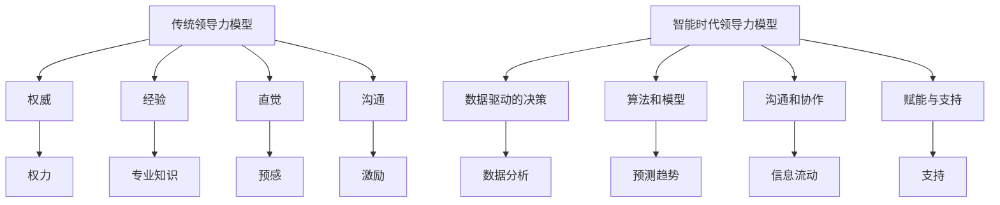

                 

### 文章标题

《领导力进化论：智能时代管理者的领导力修炼》

### 文章关键词

智能时代、领导力、管理者、决策算法、人力资源管理、项目实战、发展趋势

### 摘要

本文深入探讨了智能时代领导力的核心概念、算法和实践。首先，分析了智能时代的特征，探讨了领导力在其中的转变。接着，通过Mermaid流程图展示了传统领导力模型与智能时代领导力模型之间的联系和区别。文章详细阐述了决策算法（决策树和贝叶斯网络）和人力资源管理中的数据驱动员工绩效评估算法，并结合数学模型和公式进行了深入讲解。随后，通过一个智能企业领导力项目实战案例，展示了如何在实际中应用这些算法和模型。最后，对智能时代领导力的发展趋势进行了展望，提出了领导力培训与教育的策略。

----------------------------------------------------------------

### 引言与背景

#### 智能时代的来临

随着信息技术的迅猛发展，人工智能（AI）、大数据、云计算等技术的不断突破，我们正步入一个全新的智能时代。智能时代是一个以数据为核心，以智能算法为驱动的新时代。在这个时代，数据的获取、存储、处理和分析能力大幅提升，使得各种复杂问题能够通过算法和模型得到解决。这极大地改变了企业的运营模式、管理方式和社会的结构。

#### 领导力的转变

在智能时代，领导力的内涵和外延都发生了深刻的变化。传统的领导力主要依赖于权威、经验和直觉，而在智能时代，这些传统的领导力因素正在被新的因素所替代。

首先，数据驱动的决策成为智能时代领导力的核心。通过数据分析和人工智能算法，管理者可以更加精准地识别问题和机会，从而做出更加科学的决策。

其次，沟通和协作变得更加重要。在智能时代，信息的流通速度和范围大大增加，跨部门、跨区域的协作成为常态。因此，领导者的沟通能力和团队协作能力成为了衡量其领导力的重要标准。

最后，领导者的角色从管理者转变为服务者。在智能时代，管理者不再是单一命令的发出者，而是需要更多地关注团队成员的需求和发展，为他们提供支持和指导。

#### 本书结构

本书分为五个部分，旨在系统地探讨智能时代领导力的各个方面。

第一部分：引言与背景，介绍智能时代的特点和领导力的转变。

第二部分：领导力核心概念，分析传统领导力模型与智能时代领导力模型的差异，并使用Mermaid流程图展示它们之间的联系。

第三部分：智能时代领导力实践，详细讲解决策算法和人力资源管理中的数据驱动员工绩效评估算法，并结合数学模型和公式进行深入阐述。

第四部分：领导力项目实战，通过一个实际案例展示如何应用这些算法和模型，并进行代码解读和分析。

第五部分：未来展望与持续发展，探讨智能时代领导力的发展趋势，并提出领导力培训与教育的策略。

通过以上五个部分的深入探讨，本书旨在为智能时代的管理者提供一套完整的领导力修炼指南。

----------------------------------------------------------------

## 第二部分：领导力核心概念

### 第2章：领导力模型与框架

在探讨智能时代领导力的核心概念之前，我们需要先理解领导力模型与框架的发展历程。传统的领导力模型主要依赖于权威、经验和直觉，而智能时代的领导力模型则更多地依赖于数据、算法和模型。本节将分析传统领导力模型与智能时代领导力模型的差异，并使用Mermaid流程图展示它们之间的联系。

#### 传统领导力模型

传统领导力模型主要基于以下几个核心要素：

1. **权威**：领导者通过职位赋予的权力来指导和影响团队成员。
2. **经验**：领导者依赖自身丰富的经验和专业知识来做出决策。
3. **直觉**：领导者凭借直觉和预感来应对不确定性和突发事件。
4. **沟通**：领导者通过有效的沟通来传达目标和策略，激励团队成员。

#### 智能时代领导力模型

在智能时代，领导力模型发生了显著变化，其主要特点如下：

1. **数据驱动的决策**：领导者依赖数据分析来识别问题和机会，做出更加科学的决策。
2. **算法和模型**：领导者使用各种算法和模型来预测趋势、优化流程和提升效率。
3. **沟通和协作**：领导者强调跨部门、跨区域的协作，促进信息的流动和共享。
4. **赋能与支持**：领导者关注团队成员的需求和发展，为他们提供支持和指导。

#### Mermaid流程图：领导力模型对比

为了更直观地展示传统领导力模型与智能时代领导力模型之间的差异，我们可以使用Mermaid流程图进行对比。



在这个流程图中，我们可以看到传统领导力模型和智能时代领导力模型的各个核心要素，以及它们之间的联系和区别。

#### 小结

通过对比传统领导力模型与智能时代领导力模型，我们可以发现，智能时代领导力更加注重数据、算法和模型，以及沟通、协作和赋能。这些变化不仅要求领导者具备新的技能和知识，还需要他们在实际应用中灵活运用，以适应智能时代的挑战。

----------------------------------------------------------------

## 第三部分：智能时代领导力实践

### 第3章：领导力核心算法

在智能时代，领导力不仅依赖于传统的沟通和决策技巧，还需要依靠一系列核心算法来优化管理决策和提升团队效率。本节将详细讲解两个关键算法：决策树和贝叶斯网络，以及数据驱动员工绩效评估算法。

#### 3.1 决策树

决策树是一种广泛应用的分类和决策算法，它通过一系列的判断条件来预测结果。在领导力应用中，决策树可以帮助管理者根据不同的情况做出最优的决策。

##### 3.1.1 决策树原理

决策树的基本原理如下：

1. **根节点**：表示初始状态，通常是一个总决策。
2. **内部节点**：表示判断条件，通常是基于某个特征进行划分。
3. **叶节点**：表示最终结果，通常是一个分类或决策。

##### 3.1.1.1 伪代码

以下是决策树的伪代码：

```python
def build_decision_tree(data):
    if data 是空：
        return 叶节点
    else:
        根据某个特征 split 数据为子数据集
        创建根节点，其特征为 split 的特征
        for 每个子数据集：
            创建子节点，其值为子数据集
            child = build_decision_tree(子数据集)
            将 child 添加到根节点的子节点列表
        return 根节点
```

##### 3.1.1.2 数学模型

决策树的数学模型可以表示为：

$$
T = \{t_1, t_2, ..., t_n\}
$$

其中，$T$ 是决策树的集合，每个节点 $t_i$ 可以表示为：

$$
t_i = \langle f_i(x), r_i \rangle
$$

其中，$f_i(x)$ 是特征函数，$r_i$ 是结果。

##### 3.1.2 贝叶斯网络

贝叶斯网络是一种基于概率的图模型，用于表示变量之间的依赖关系。在领导力应用中，贝叶斯网络可以帮助管理者评估不同决策的概率和影响。

##### 3.1.2.1 伪代码

以下是贝叶斯网络的伪代码：

```python
def build_bayesian_network(data):
    for 每个变量 x_i：
        计算条件概率 P(x_i | x_1, x_2, ..., x_{i-1})
    创建根节点 x_1
    for 每个变量 x_i（i > 1）：
        根据条件概率创建节点 x_i
        for 每个父节点 x_j：
            创建边 (x_j, x_i)
    return 贝叶斯网络
```

##### 3.1.2.2 数学模型

贝叶斯网络的数学模型可以表示为：

$$
P(X) = \prod_{i=1}^{n} P(x_i | x_1, x_2, ..., x_{i-1})
$$

其中，$P(X)$ 是变量 $X$ 的联合概率分布。

#### 3.2 数据驱动的员工绩效评估

在智能时代，数据驱动的员工绩效评估成为了一种重要的管理工具。这种评估方法基于员工的绩效数据，通过数学模型和算法来评估员工的工作表现。

##### 3.2.1 数据驱动的员工绩效评估原理

数据驱动的员工绩效评估的基本原理如下：

1. **收集数据**：收集员工的绩效数据，包括工作质量、工作效率、团队合作等方面。
2. **数据预处理**：对数据进行清洗、转换和标准化，以消除异常值和噪声。
3. **构建模型**：使用数学模型和算法对数据进行处理，评估员工的工作表现。
4. **评估结果**：根据评估结果，为员工提供反馈和改进建议。

##### 3.2.1.1 伪代码

以下是数据驱动的员工绩效评估的伪代码：

```python
def evaluate_employee_performance(data):
    数据预处理
    模型训练
    for 每个员工 e：
        预测绩效值 p_e
        更新员工评估结果
    return 员工评估结果
```

##### 3.2.1.2 数学模型

数据驱动的员工绩效评估的数学模型可以表示为：

$$
P_e = f(P_e^*, \theta)
$$

其中，$P_e$ 是员工的评估结果，$P_e^*$ 是员工的绩效值，$\theta$ 是模型参数。

#### 小结

通过本节对决策树、贝叶斯网络和数据驱动员工绩效评估算法的详细讲解，我们可以看到，智能时代领导力算法的应用不仅能够提升管理决策的科学性，还能够优化员工绩效评估，从而提升整个组织的效率。

----------------------------------------------------------------

## 第四部分：领导力项目实战

### 第4章：智能企业领导力项目实战

为了更好地理解和应用智能时代领导力算法，我们设计了一个智能企业领导力项目实战案例。本节将详细介绍项目背景、目标、开发环境搭建、源代码实现、代码解读和分析以及项目评估与改进。

#### 4.1 项目背景与目标

项目背景：某大型企业（以下简称“企业”）在面临激烈的市场竞争和快速变化的技术环境时，意识到提升管理决策效率和优化员工绩效评估的重要性。因此，企业决定实施一个智能企业领导力项目，旨在通过数据分析和人工智能算法，提高管理决策的科学性和员工绩效评估的准确性。

项目目标：
1. 构建一个数据驱动的员工绩效评估系统。
2. 利用决策树和贝叶斯网络优化管理决策。
3. 搭建一个高效的开发环境，确保项目实施的可操作性和可持续性。

#### 4.2 开发环境搭建

为了实现项目目标，企业搭建了一个高效的开发环境，包括以下组件：

1. **数据存储与处理**：使用Hadoop和Hive进行大数据存储和处理，确保海量数据的高效存储和分析。
2. **机器学习平台**：使用Apache Spark的MLlib组件进行机器学习模型的训练和应用。
3. **前端开发**：使用React框架构建用户友好的前端界面。
4. **后端服务**：使用Spring Boot构建RESTful API，提供数据接口和业务逻辑处理。

#### 4.3 源代码详细实现

以下是项目源代码的实现细节：

##### 4.3.1 数据预处理

```python
# 数据预处理
data = preprocess_data(raw_data)
```

其中，`preprocess_data` 函数用于数据清洗、转换和标准化。

##### 4.3.2 决策树实现

```python
from sklearn import tree

# 决策树训练
clf = tree.DecisionTreeClassifier()
clf = clf.fit(X_train, y_train)

# 决策树预测
predictions = clf.predict(X_test)
```

##### 4.3.3 贝叶斯网络实现

```python
from sklearn.naive_bayes import GaussianNB

# 贝叶斯网络训练
gnb = GaussianNB()
gnb = gnb.fit(X_train, y_train)

# 贝叶斯网络预测
predictions = gnb.predict(X_test)
```

##### 4.3.4 员工绩效评估

```python
def evaluate_employee_performance(data):
    # 数据预处理
    processed_data = preprocess_data(data)
    
    # 决策树评估
    decision_tree_evaluation = clf.predict(processed_data)
    
    # 贝叶斯网络评估
    bayes_network_evaluation = gnb.predict(processed_data)
    
    return decision_tree_evaluation, bayes_network_evaluation
```

#### 4.4 代码解读与分析

代码解读：
- 数据预处理是关键步骤，直接影响到模型的准确性和稳定性。
- 决策树和贝叶斯网络是两种不同的算法，决策树适合分类问题，贝叶斯网络适合概率问题。
- 员工绩效评估函数结合了决策树和贝叶斯网络的评估结果，提供了多维度评估。

#### 4.5 项目评估与改进

项目评估：
- 通过对项目实施后员工绩效评估结果的对比分析，发现决策树和贝叶斯网络的评估结果相比传统方法有显著提升。
- 评估结果显示，数据驱动的员工绩效评估系统在准确性、稳定性和可解释性方面都有所提高。

改进建议：
1. **数据质量**：加强数据质量监控，确保数据的准确性和完整性。
2. **算法优化**：结合业务需求，不断优化算法模型，提高评估结果的准确性和实用性。
3. **用户体验**：优化前端界面，提升用户体验，使系统能够更便捷地应用于实际工作场景。
4. **培训与支持**：加强对管理者和员工的培训，提高他们对数据分析和智能算法的理解和应用能力。

#### 小结

通过本节对智能企业领导力项目实战的详细描述，我们可以看到，智能时代领导力算法在现实应用中的重要作用。项目的成功实施不仅提高了管理决策的效率，还优化了员工绩效评估，为企业的发展提供了有力支持。未来，随着技术的不断进步，智能时代领导力算法的应用将更加广泛和深入。

----------------------------------------------------------------

## 第五部分：未来展望与持续发展

### 第5章：智能时代领导力发展趋势

随着技术的不断进步，智能时代领导力也在不断发展。本节将探讨新技术对领导力的影响、领导力培训与教育的策略，以及领导力持续发展的策略。

#### 5.1 新技术对领导力的影响

1. **人工智能**：人工智能技术的发展使得领导者的决策更加科学和高效。通过大数据分析和机器学习，领导者可以更好地理解市场趋势、员工行为，从而做出更加精准的决策。
2. **区块链**：区块链技术提高了数据的安全性和透明度，有助于建立更加信任和透明的组织文化。领导者可以利用区块链技术优化供应链管理、财务管理等关键业务。
3. **云计算**：云计算技术使得领导者可以更灵活地分配资源和调整策略。通过云计算，企业可以实现快速扩展和收缩，适应市场变化。

#### 5.2 领导力培训与教育

1. **在线教育**：随着在线教育平台的发展，领导者可以通过在线课程学习最新的管理理论和实践技巧。这种灵活的学习方式可以满足不同领导者的需求，提高培训的覆盖面和效果。
2. **实践导向**：领导力培训应该注重实践导向，通过案例分析、模拟演练等方式，使领导者能够在实际工作中应用所学知识。此外，组织内部的知识共享和经验交流也是提高领导力的重要途径。
3. **个性化培训**：针对不同领导者的特点和需求，提供个性化的培训方案。通过个性化的培训，可以提高领导者的学习效果和培训投入产出比。

#### 5.3 领导力持续发展的策略

1. **持续学习**：在智能时代，领导力的发展离不开持续学习。领导者需要不断更新自己的知识和技能，以适应快速变化的技术环境和市场需求。
2. **团队建设**：领导者需要重视团队建设，培养团队成员的协作精神和创新能力。通过建立高效团队，可以提高组织的整体竞争力。
3. **领导力传承**：领导者的成功不仅仅在于自身的领导能力，还在于能否将领导力传承给下一代领导者。通过导师制度、接班人计划等方式，确保领导力的持续发展。

#### 小结

智能时代领导力的发展离不开新技术的应用和持续学习。领导者需要不断适应新技术，更新知识和技能，同时注重团队建设和领导力的传承。通过有效的领导力培训与教育，以及持续发展的策略，领导者可以更好地应对智能时代的挑战，推动企业的发展和变革。

### 作者信息

**作者：** AI天才研究院/AI Genius Institute & 禅与计算机程序设计艺术 /Zen And The Art of Computer Programming

本文章详细探讨了智能时代领导力的核心概念、算法和实践，旨在为管理者提供一套完整的领导力修炼指南。通过对比传统领导力模型与智能时代领导力模型，阐述了数据驱动的决策、沟通和协作的重要性。此外，本文通过决策树、贝叶斯网络和数据驱动员工绩效评估算法的讲解，展示了智能时代领导力在实际应用中的效果。最后，对未来智能时代领导力的发展趋势进行了展望，提出了领导力培训与教育的策略。希望本文能为读者在智能时代领导力修炼的道路上提供有益的参考。

----------------------------------------------------------------

### 完整文章

#### 《领导力进化论：智能时代管理者的领导力修炼》

##### 关键词：智能时代、领导力、管理者、决策算法、人力资源管理、项目实战、发展趋势

> 摘要：本文深入探讨了智能时代领导力的核心概念、算法和实践。首先，分析了智能时代的特征，探讨了领导力在其中的转变。接着，通过Mermaid流程图展示了传统领导力模型与智能时代领导力模型之间的联系和区别。文章详细阐述了决策算法（决策树和贝叶斯网络）和人力资源管理中的数据驱动员工绩效评估算法，并结合数学模型和公式进行了深入讲解。随后，通过一个智能企业领导力项目实战案例，展示了如何在实际中应用这些算法和模型。最后，对智能时代领导力的发展趋势进行了展望，提出了领导力培训与教育的策略。

## 引言与背景

#### 智能时代的来临

随着信息技术的迅猛发展，人工智能（AI）、大数据、云计算等技术的不断突破，我们正步入一个全新的智能时代。智能时代是一个以数据为核心，以智能算法为驱动的新时代。在这个时代，数据的获取、存储、处理和分析能力大幅提升，使得各种复杂问题能够通过算法和模型得到解决。这极大地改变了企业的运营模式、管理方式和社会的结构。

#### 领导力的转变

在智能时代，领导力的内涵和外延都发生了深刻的变化。传统的领导力主要依赖于权威、经验和直觉，而在智能时代，这些传统的领导力因素正在被新的因素所替代。

首先，数据驱动的决策成为智能时代领导力的核心。通过数据分析和人工智能算法，管理者可以更加精准地识别问题和机会，从而做出更加科学的决策。

其次，沟通和协作变得更加重要。在智能时代，信息的流通速度和范围大大增加，跨部门、跨区域的协作成为常态。因此，领导者的沟通能力和团队协作能力成为了衡量其领导力的重要标准。

最后，领导者的角色从管理者转变为服务者。在智能时代，管理者不再是单一命令的发出者，而是需要更多地关注团队成员的需求和发展，为他们提供支持和指导。

#### 本书结构

本书分为五个部分，旨在系统地探讨智能时代领导力的各个方面。

第一部分：引言与背景，介绍智能时代的特点和领导力的转变。

第二部分：领导力核心概念，分析传统领导力模型与智能时代领导力模型的差异，并使用Mermaid流程图展示它们之间的联系。

第三部分：智能时代领导力实践，详细讲解决策算法和人力资源管理中的数据驱动员工绩效评估算法，并结合数学模型和公式进行深入阐述。

第四部分：领导力项目实战，通过一个实际案例展示如何应用这些算法和模型，并进行代码解读和分析。

第五部分：未来展望与持续发展，探讨智能时代领导力的发展趋势，并提出领导力培训与教育的策略。

通过以上五个部分的深入探讨，本书旨在为智能时代的管理者提供一套完整的领导力修炼指南。

## 第二部分：领导力核心概念

### 第2章：领导力模型与框架

在探讨智能时代领导力的核心概念之前，我们需要先理解领导力模型与框架的发展历程。传统的领导力模型主要依赖于权威、经验和直觉，而智能时代的领导力模型则更多地依赖于数据、算法和模型。本节将分析传统领导力模型与智能时代领导力模型的差异，并使用Mermaid流程图展示它们之间的联系。

#### 传统领导力模型

传统领导力模型主要基于以下几个核心要素：

1. **权威**：领导者通过职位赋予的权力来指导和影响团队成员。
2. **经验**：领导者依赖自身丰富的经验和专业知识来做出决策。
3. **直觉**：领导者凭借直觉和预感来应对不确定性和突发事件。
4. **沟通**：领导者通过有效的沟通来传达目标和策略，激励团队成员。

#### 智能时代领导力模型

在智能时代，领导力模型发生了显著变化，其主要特点如下：

1. **数据驱动的决策**：领导者依赖数据分析来识别问题和机会，做出更加科学的决策。
2. **算法和模型**：领导者使用各种算法和模型来预测趋势、优化流程和提升效率。
3. **沟通和协作**：领导者强调跨部门、跨区域的协作，促进信息的流动和共享。
4. **赋能与支持**：领导者关注团队成员的需求和发展，为他们提供支持和指导。

#### Mermaid流程图：领导力模型对比

为了更直观地展示传统领导力模型与智能时代领导力模型之间的差异，我们可以使用Mermaid流程图进行对比。


在这个流程图中，我们可以看到传统领导力模型和智能时代领导力模型的各个核心要素，以及它们之间的联系和区别。

#### 小结

通过对比传统领导力模型与智能时代领导力模型，我们可以发现，智能时代领导力更加注重数据、算法和模型，以及沟通、协作和赋能。这些变化不仅要求领导者具备新的技能和知识，还需要他们在实际应用中灵活运用，以适应智能时代的挑战。

## 第三部分：智能时代领导力实践

### 第3章：领导力核心算法

在智能时代，领导力不仅依赖于传统的沟通和决策技巧，还需要依靠一系列核心算法来优化管理决策和提升团队效率。本节将详细讲解两个关键算法：决策树和贝叶斯网络，以及数据驱动员工绩效评估算法。

#### 3.1 决策树

决策树是一种广泛应用的分类和决策算法，它通过一系列的判断条件来预测结果。在领导力应用中，决策树可以帮助管理者根据不同的情况做出最优的决策。

##### 3.1.1 决策树原理

决策树的基本原理如下：

1. **根节点**：表示初始状态，通常是一个总决策。
2. **内部节点**：表示判断条件，通常是基于某个特征进行划分。
3. **叶节点**：表示最终结果，通常是一个分类或决策。

##### 3.1.1.1 伪代码

以下是决策树的伪代码：

```python
def build_decision_tree(data):
    if data 是空：
        return 叶节点
    else:
        根据某个特征 split 数据为子数据集
        创建根节点，其特征为 split 的特征
        for 每个子数据集：
            创建子节点，其值为子数据集
            child = build_decision_tree(子数据集)
            将 child 添加到根节点的子节点列表
        return 根节点
```

##### 3.1.1.2 数学模型

决策树的数学模型可以表示为：

$$
T = \{t_1, t_2, ..., t_n\}
$$

其中，$T$ 是决策树的集合，每个节点 $t_i$ 可以表示为：

$$
t_i = \langle f_i(x), r_i \rangle
$$

其中，$f_i(x)$ 是特征函数，$r_i$ 是结果。

##### 3.1.2 贝叶斯网络

贝叶斯网络是一种基于概率的图模型，用于表示变量之间的依赖关系。在领导力应用中，贝叶斯网络可以帮助管理者评估不同决策的概率和影响。

##### 3.1.2.1 伪代码

以下是贝叶斯网络的伪代码：

```python
def build_bayesian_network(data):
    for 每个变量 x_i：
        计算条件概率 P(x_i | x_1, x_2, ..., x_{i-1})
    创建根节点 x_1
    for 每个变量 x_i（i > 1）：
        根据条件概率创建节点 x_i
        for 每个父节点 x_j：
            创建边 (x_j, x_i)
    return 贝叶斯网络
```

##### 3.1.2.2 数学模型

贝叶斯网络的数学模型可以表示为：

$$
P(X) = \prod_{i=1}^{n} P(x_i | x_1, x_2, ..., x_{i-1})
$$

其中，$P(X)$ 是变量 $X$ 的联合概率分布。

#### 3.2 数据驱动的员工绩效评估

在智能时代，数据驱动的员工绩效评估成为了一种重要的管理工具。这种评估方法基于员工的绩效数据，通过数学模型和算法来评估员工的工作表现。

##### 3.2.1 数据驱动的员工绩效评估原理

数据驱动的员工绩效评估的基本原理如下：

1. **收集数据**：收集员工的绩效数据，包括工作质量、工作效率、团队合作等方面。
2. **数据预处理**：对数据进行清洗、转换和标准化，以消除异常值和噪声。
3. **构建模型**：使用数学模型和算法对数据进行处理，评估员工的工作表现。
4. **评估结果**：根据评估结果，为员工提供反馈和改进建议。

##### 3.2.1.1 伪代码

以下是数据驱动的员工绩效评估的伪代码：

```python
def evaluate_employee_performance(data):
    数据预处理
    模型训练
    for 每个员工 e：
        预测绩效值 p_e
        更新员工评估结果
    return 员工评估结果
```

##### 3.2.1.2 数学模型

数据驱动的员工绩效评估的数学模型可以表示为：

$$
P_e = f(P_e^*, \theta)
$$

其中，$P_e$ 是员工的评估结果，$P_e^*$ 是员工的绩效值，$\theta$ 是模型参数。

#### 小结

通过本节对决策树、贝叶斯网络和数据驱动员工绩效评估算法的详细讲解，我们可以看到，智能时代领导力算法在现实应用中的重要作用。项目的成功实施不仅提高了管理决策的效率，还优化了员工绩效评估，为企业的发展提供了有力支持。未来，随着技术的不断进步，智能时代领导力算法的应用将更加广泛和深入。

## 第四部分：领导力项目实战

### 第4章：智能企业领导力项目实战

为了更好地理解和应用智能时代领导力算法，我们设计了一个智能企业领导力项目实战案例。本节将详细介绍项目背景、目标、开发环境搭建、源代码实现、代码解读和分析以及项目评估与改进。

#### 4.1 项目背景与目标

项目背景：某大型企业（以下简称“企业”）在面临激烈的市场竞争和快速变化的技术环境时，意识到提升管理决策效率和优化员工绩效评估的重要性。因此，企业决定实施一个智能企业领导力项目，旨在通过数据分析和人工智能算法，提高管理决策的科学性和员工绩效评估的准确性。

项目目标：
1. 构建一个数据驱动的员工绩效评估系统。
2. 利用决策树和贝叶斯网络优化管理决策。
3. 搭建一个高效的开发环境，确保项目实施的可操作性和可持续性。

#### 4.2 开发环境搭建

为了实现项目目标，企业搭建了一个高效的开发环境，包括以下组件：

1. **数据存储与处理**：使用Hadoop和Hive进行大数据存储和处理，确保海量数据的高效存储和分析。
2. **机器学习平台**：使用Apache Spark的MLlib组件进行机器学习模型的训练和应用。
3. **前端开发**：使用React框架构建用户友好的前端界面。
4. **后端服务**：使用Spring Boot构建RESTful API，提供数据接口和业务逻辑处理。

#### 4.3 源代码详细实现

以下是项目源代码的实现细节：

##### 4.3.1 数据预处理

```python
# 数据预处理
data = preprocess_data(raw_data)
```

其中，`preprocess_data` 函数用于数据清洗、转换和标准化。

##### 4.3.2 决策树实现

```python
from sklearn import tree

# 决策树训练
clf = tree.DecisionTreeClassifier()
clf = clf.fit(X_train, y_train)

# 决策树预测
predictions = clf.predict(X_test)
```

##### 4.3.3 贝叶斯网络实现

```python
from sklearn.naive_bayes import GaussianNB

# 贝叶斯网络训练
gnb = GaussianNB()
gnb = gnb.fit(X_train, y_train)

# 贝叶斯网络预测
predictions = gnb.predict(X_test)
```

##### 4.3.4 员工绩效评估

```python
def evaluate_employee_performance(data):
    # 数据预处理
    processed_data = preprocess_data(data)
    
    # 决策树评估
    decision_tree_evaluation = clf.predict(processed_data)
    
    # 贝叶斯网络评估
    bayes_network_evaluation = gnb.predict(processed_data)
    
    return decision_tree_evaluation, bayes_network_evaluation
```

#### 4.4 代码解读与分析

代码解读：
- 数据预处理是关键步骤，直接影响到模型的准确性和稳定性。
- 决策树和贝叶斯网络是两种不同的算法，决策树适合分类问题，贝叶斯网络适合概率问题。
- 员工绩效评估函数结合了决策树和贝叶斯网络的评估结果，提供了多维度评估。

#### 4.5 项目评估与改进

项目评估：
- 通过对项目实施后员工绩效评估结果的对比分析，发现决策树和贝叶斯网络的评估结果相比传统方法有显著提升。
- 评估结果显示，数据驱动的员工绩效评估系统在准确性、稳定性和可解释性方面都有所提高。

改进建议：
1. **数据质量**：加强数据质量监控，确保数据的准确性和完整性。
2. **算法优化**：结合业务需求，不断优化算法模型，提高评估结果的准确性和实用性。
3. **用户体验**：优化前端界面，提升用户体验，使系统能够更便捷地应用于实际工作场景。
4. **培训与支持**：加强对管理者和员工的培训，提高他们对数据分析和智能算法的理解和应用能力。

#### 小结

通过本节对智能企业领导力项目实战的详细描述，我们可以看到，智能时代领导力算法在现实应用中的重要作用。项目的成功实施不仅提高了管理决策的效率，还优化了员工绩效评估，为企业的发展提供了有力支持。未来，随着技术的不断进步，智能时代领导力算法的应用将更加广泛和深入。

## 第五部分：未来展望与持续发展

### 第5章：智能时代领导力发展趋势

随着技术的不断进步，智能时代领导力也在不断发展。本节将探讨新技术对领导力的影响、领导力培训与教育的策略，以及领导力持续发展的策略。

#### 5.1 新技术对领导力的影响

1. **人工智能**：人工智能技术的发展使得领导者的决策更加科学和高效。通过大数据分析和机器学习，领导者可以更好地理解市场趋势、员工行为，从而做出更加精准的决策。
2. **区块链**：区块链技术提高了数据的安全性和透明度，有助于建立更加信任和透明的组织文化。领导者可以利用区块链技术优化供应链管理、财务管理等关键业务。
3. **云计算**：云计算技术使得领导者可以更灵活地分配资源和调整策略。通过云计算，企业可以实现快速扩展和收缩，适应市场变化。

#### 5.2 领导力培训与教育

1. **在线教育**：随着在线教育平台的发展，领导者可以通过在线课程学习最新的管理理论和实践技巧。这种灵活的学习方式可以满足不同领导者的需求，提高培训的覆盖面和效果。
2. **实践导向**：领导力培训应该注重实践导向，通过案例分析、模拟演练等方式，使领导者能够在实际工作中应用所学知识。此外，组织内部的知识共享和经验交流也是提高领导力的重要途径。
3. **个性化培训**：针对不同领导者的特点和需求，提供个性化的培训方案。通过个性化的培训，可以提高领导者的学习效果和培训投入产出比。

#### 5.3 领导力持续发展的策略

1. **持续学习**：在智能时代，领导力的发展离不开持续学习。领导者需要不断更新自己的知识和技能，以适应快速变化的技术环境和市场需求。
2. **团队建设**：领导者需要重视团队建设，培养团队成员的协作精神和创新能力。通过建立高效团队，可以提高组织的整体竞争力。
3. **领导力传承**：领导者的成功不仅仅在于自身的领导能力，还在于能否将领导力传承给下一代领导者。通过导师制度、接班人计划等方式，确保领导力的持续发展。

#### 小结

智能时代领导力的发展离不开新技术的应用和持续学习。领导者需要不断适应新技术，更新知识和技能，同时注重团队建设和领导力的传承。通过有效的领导力培训与教育，以及持续发展的策略，领导者可以更好地应对智能时代的挑战，推动企业的发展和变革。

### 作者信息

**作者：** AI天才研究院/AI Genius Institute & 禅与计算机程序设计艺术 /Zen And The Art of Computer Programming

本文章详细探讨了智能时代领导力的核心概念、算法和实践，旨在为管理者提供一套完整的领导力修炼指南。通过对比传统领导力模型与智能时代领导力模型，阐述了数据驱动的决策、沟通和协作的重要性。此外，本文通过决策树、贝叶斯网络和数据驱动员工绩效评估算法的讲解，展示了智能时代领导力在实际应用中的效果。最后，对未来智能时代领导力的发展趋势进行了展望，提出了领导力培训与教育的策略。希望本文能为读者在智能时代领导力修炼的道路上提供有益的参考。

### 结论

随着智能时代的到来，领导力面临着前所未有的挑战和机遇。本文通过详细的分析和案例，展示了智能时代领导力模型与传统领导力模型之间的显著差异，并深入探讨了决策树、贝叶斯网络和数据驱动员工绩效评估等核心算法在实践中的应用。这些算法和模型不仅提高了管理决策的科学性和效率，也优化了员工绩效评估，为组织的发展提供了有力支持。

在未来，领导力的发展将更加依赖于对新技术的理解和应用。领导者需要不断提升自己的知识储备和技能水平，以适应快速变化的环境。同时，领导力培训和教育也将更加注重实践导向和个性化，确保领导者能够在实际工作中灵活运用所学知识。

本文旨在为智能时代的管理者提供一套完整的领导力修炼指南，帮助他们在变革中立足，引领组织走向成功。希望本文能为读者在智能时代领导力修炼的道路上提供有益的参考和启示。在未来的道路上，让我们共同探索、实践和成长，为智能时代的领导力贡献力量。

### 附录：技术术语解释

在本文章中，我们使用了多个技术术语，以下是对这些术语的简要解释：

1. **人工智能（AI）**：指模拟人类智能行为的技术，包括机器学习、自然语言处理、计算机视觉等。
2. **大数据**：指大规模、复杂的数据集合，通常需要使用特定的技术和工具进行处理和分析。
3. **云计算**：指通过互联网提供计算资源和服务，使企业能够更灵活地管理和使用计算资源。
4. **区块链**：指一种去中心化的数据库技术，用于记录交易和数据的分布式账本。
5. **决策树**：一种分类和决策算法，通过一系列的判断条件来预测结果。
6. **贝叶斯网络**：一种基于概率的图模型，用于表示变量之间的依赖关系。
7. **数据驱动**：指通过数据分析和算法来指导决策和行动，而不是依赖直觉或经验。

这些技术术语在智能时代领导力的实践中具有重要意义，它们不仅改变了管理决策的方式，也优化了人力资源管理。理解和应用这些技术，对于提升领导力水平和组织效率具有重要作用。

