                 


## 文章标题
《领导者的决断力：在关键时刻做出抉择》

## 关键词
决策理论、领导力、风险管理、成功案例、实践策略

## 摘要
本文探讨了领导者在关键时刻做出决策的重要性和方法。通过分析决策理论、风险管理、成功案例和实践策略，帮助领导者提升决策能力，在复杂和不确定的环境中做出更加明智的抉择。

## 目录大纲

### 第一部分：决策理论基础
1.1 决策理论的起源与发展
1.2 决策模型的构建
1.3 决策中的心理学因素

### 第二部分：决策过程中的风险与预测
2.1 风险管理
2.2 数据预测与决策
2.3 决策中的不确定性处理

### 第三部分：成功案例分析
3.1 领导者决策的成功案例
3.2 失误案例分析
3.3 领导力与决策的关系

### 第四部分：实践指导与策略
4.1 决策流程优化
4.2 决策制定策略
4.3 决策执行与反馈
4.4 综合性案例分析

### 附录
A. 决策工具与应用
B. 决策模型与算法
C. 领导力模型

### 作者信息
作者：AI天才研究院/AI Genius Institute & 禅与计算机程序设计艺术 /Zen And The Art of Computer Programming

### 第一部分：决策理论基础

#### 1.1 决策理论的起源与发展

**背景介绍**
决策理论是20世纪中叶发展起来的一门跨学科研究领域，旨在研究和分析决策过程、决策策略以及决策结果。它的起源可以追溯到经济学、心理学和工程学等领域。在经济学中，亚当·斯密的《国富论》和约翰·梅纳德·凯恩斯的《就业、利息和货币通论》等著作奠定了经济学中的决策理论基础。心理学领域的研究则主要集中在人类行为和认知过程，特别是面对不确定性时的决策行为。工程学领域则关注如何在复杂系统中进行优化决策。

**核心概念与联系**
决策理论的核心概念包括：效用理论、期望理论、风险规避和风险偏好。这些概念之间的关系可以用以下Mermaid流程图表示：

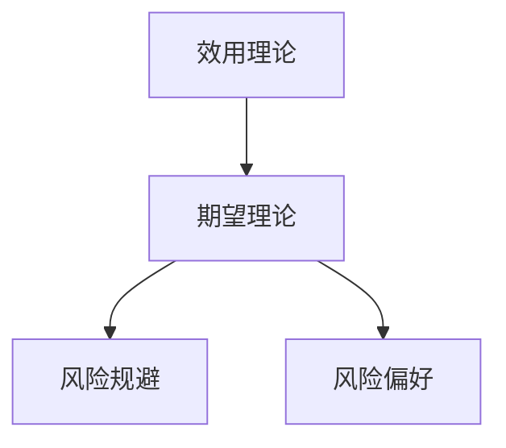

**核心算法原理讲解**
决策树模型是一种常用的决策模型，它通过将决策问题分解为多个子问题，并利用条件概率和期望值来评估每个子问题的最优解。以下是其伪代码：

```pseudo
function decisionTree(attributeList, data):
    if (data.isEmpty()):
        return mostCommonOutcome(data)
    else:
        bestAttribute = selectBestAttribute(attributeList, data)
        decisionTree(bestAttribute.branches, data.filter(bestAttribute))
```

**数学模型和公式**
决策理论中的期望效用理论（Expected Utility Theory，EUT）是一个重要的理论框架，它通过期望值来评估决策结果。其公式为：

$$
E(U) = \sum_{i=1}^{n} p_i \cdot u(x_i)
$$

其中，$E(U)$ 是期望效用，$p_i$ 是第$i$种结果的概率，$u(x_i)$ 是第$i$种结果带来的效用。

**举例说明**
假设一个投资者面临两种投资选择，分别是股票和债券。股票的预期收益为20%，但风险较高；债券的预期收益为5%，风险较低。使用期望效用理论来评估这两种投资选择：

$$
E(U_{股票}) = 0.2 \cdot u(20\%) = 0.2 \cdot 0.8 = 0.16
$$

$$
E(U_{债券}) = 0.8 \cdot u(5\%) = 0.8 \cdot 0.95 = 0.76
$$

从期望效用来看，债券是一个更优的选择。

**注意事项**
在决策过程中，领导者需要考虑多种因素，如风险、收益、时间等，并且要考虑到不同决策结果带来的长远影响。

**拓展阅读**
- von Neumann, J., & Morgenstern, O. (1944). The Theory of Games and Economic Behavior.
- Simon, H. A. (1955). A Behavioral Model of Rational Choice.

#### 1.2 决策模型的构建

**背景介绍**
决策模型的构建是决策理论的核心内容之一，它涉及到如何将现实世界的决策问题转化为数学模型，并利用算法求解最优解。常见的决策模型包括决策树、期望值模型、贝叶斯网络等。

**核心概念与联系**
决策模型的核心概念包括：状态、行动、结果和效用。它们之间的关系可以用以下Mermaid流程图表示：

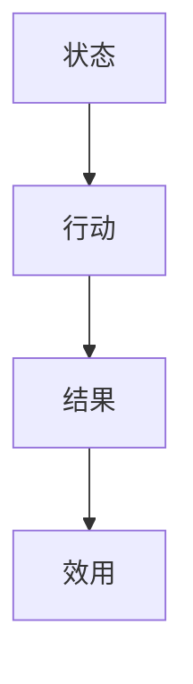

**核心算法原理讲解**
决策树模型（Decision Tree）是一种广泛应用的决策模型，它通过一系列的测试（条件）来指导决策。以下是其伪代码：

```pseudo
function decisionTree(node, attributeList, data):
    if (node.isLeaf()):
        return node.outcome
    else:
        bestAttribute = selectBestAttribute(attributeList, data)
        for each value in bestAttribute.values():
            node_with_value = createChildNode(node, value)
            return decisionTree(node_with_value, attributeList, data.filter(value))
```

**数学模型和公式**
决策树中的每个节点都可以表示为一个条件概率分布。例如，对于一个具有两个属性的决策树，其条件概率分布可以表示为：

$$
P(Y|X_1=x_1, X_2=x_2) = P(Y=y|X_1=x_1) \cdot P(X_2=x_2|X_1=x_1)
$$

**举例说明**
假设一个公司需要决定是否增加广告投入。决策树模型中，状态包括：当前销售额、竞争对手的广告投入等。行动包括：增加广告投入、维持现有广告投入。结果包括：销售额增加、销售额减少。使用决策树模型来评估这两个行动。

**注意事项**
在构建决策模型时，领导者需要明确决策的目标和约束条件，以确保模型的准确性和有效性。

**拓展阅读**
- Quinlan, J. R. (1986). Induction of decision trees.
- Pearl, J. (1988). Probabilistic reasoning in intelligent systems: networks of plausible inference.

#### 1.3 决策中的心理学因素

**背景介绍**
心理学因素在决策过程中起着重要作用。心理学研究表明，人类在决策过程中往往会受到多种认知偏差的影响，这些偏差可能导致决策结果偏离理性。

**核心概念与联系**
决策中的心理学因素包括：过度自信、确认偏差、心理账户等。这些概念之间的关系可以用以下Mermaid流程图表示：

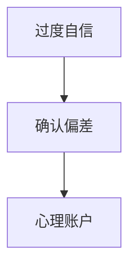

**核心算法原理讲解**
为了减少心理学因素对决策的影响，可以采用以下算法：

1. **心理账户调整**：通过调整心理账户，使得决策者在面对不同收益和风险时能够更加客观地评估。
2. **偏差校正**：通过统计方法对决策过程中的偏差进行校正，以减少决策偏差。

**数学模型和公式**
为了校正过度自信，可以使用以下公式：

$$
p_{corrected} = \frac{p - \delta}{1 + \delta}
$$

其中，$p$ 是原始概率，$\delta$ 是过度自信的校正值。

**举例说明**
假设一个投资者对某个股票的成功概率估计为70%，但经过校正后，发现其过度自信的程度为20%，则校正后的概率为：

$$
p_{corrected} = \frac{0.7 - 0.2}{1 + 0.2} = \frac{0.5}{1.2} \approx 0.417
$$

**注意事项**
领导者需要认识到心理学因素对决策的影响，并通过调整策略来减少这些因素的影响。

**拓展阅读**
- Kahneman, D., & Tversky, A. (1979). Prospect theory: An analysis of decision under risk.
- Thaler, R. H. (1985). Mental accounting and consumer choice.

### 第二部分：决策过程中的风险与预测

#### 2.1 风险管理

**背景介绍**
风险管理是决策过程中不可或缺的一部分，它涉及到如何识别、评估、处理和监控风险。有效的风险管理能够帮助领导者降低决策过程中的不确定性，提高决策的成功率。

**核心概念与联系**
风险管理的核心概念包括：风险识别、风险评估、风险处理和风险监控。这些概念之间的关系可以用以下Mermaid流程图表示：

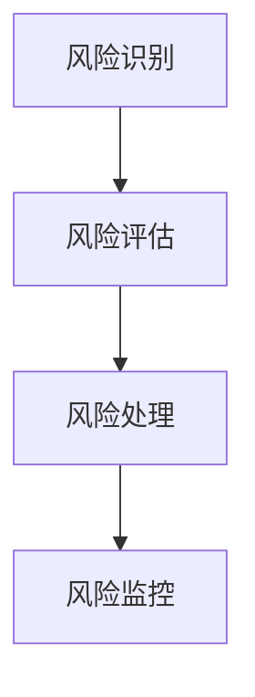

**核心算法原理讲解**
风险管理中的常见算法包括：故障树分析（Fault Tree Analysis，FTA）、事件树分析（Event Tree Analysis，ETA）和蒙特卡罗模拟（Monte Carlo Simulation）。

1. **故障树分析**：用于分析系统故障的原因和后果，其算法步骤如下：
   - 定义系统故障和事件。
   - 构建故障树，将事件和故障联系起来。
   - 计算故障概率和重要性。
2. **事件树分析**：用于分析决策过程中的可能结果和概率，其算法步骤如下：
   - 定义决策节点和事件。
   - 构建事件树，将决策节点和事件联系起来。
   - 计算决策节点的期望值和方差。
3. **蒙特卡罗模拟**：用于模拟复杂系统的行为和结果，其算法步骤如下：
   - 确定随机变量的分布。
   - 生成随机样本。
   - 计算随机样本的统计量。

**数学模型和公式**
风险管理中的常见数学模型包括：期望值模型、方差模型和条件概率模型。

1. **期望值模型**：用于计算决策结果的期望值，其公式为：
   $$ E(X) = \sum_{i=1}^{n} x_i \cdot p_i $$
   其中，$E(X)$ 是期望值，$x_i$ 是第$i$种结果的值，$p_i$ 是第$i$种结果发生的概率。
2. **方差模型**：用于计算决策结果的方差，其公式为：
   $$ Var(X) = \sum_{i=1}^{n} (x_i - E(X))^2 \cdot p_i $$
   其中，$Var(X)$ 是方差，$x_i$ 是第$i$种结果的值，$E(X)$ 是期望值，$p_i$ 是第$i$种结果发生的概率。
3. **条件概率模型**：用于计算在某个条件下某个事件发生的概率，其公式为：
   $$ P(A|B) = \frac{P(A \cap B)}{P(B)} $$
   其中，$P(A|B)$ 是在事件$B$发生的条件下事件$A$发生的概率，$P(A \cap B)$ 是事件$A$和事件$B$同时发生的概率，$P(B)$ 是事件$B$发生的概率。

**举例说明**
假设一个投资者需要决定是否购买某个股票。通过风险管理方法，可以计算出该股票的期望收益率、方差和条件概率。

1. **期望收益率**：
   $$ E(R) = 0.5 \cdot 0.1 + 0.5 \cdot (-0.1) = 0 $$
2. **方差**：
   $$ Var(R) = 0.5 \cdot (0.1 - 0)^2 + 0.5 \cdot (-0.1 - 0)^2 = 0.01 $$
3. **条件概率**：
   $$ P(R > 0 | R > -0.1) = \frac{P(R > 0 \cap R > -0.1)}{P(R > -0.1)} = \frac{0.5}{1} = 0.5 $$

**注意事项**
在风险管理过程中，领导者需要全面了解风险，并制定相应的风险处理策略。

**拓展阅读**
- Ross, S. A. (2011). An introduction to risk management.
- Bayes, T. (1763). An essay towards solving a problem in the doctrine of chances.

#### 2.2 数据预测与决策

**背景介绍**
数据预测是决策过程中重要的组成部分，它涉及到如何利用历史数据和现有信息来预测未来的结果。有效的数据预测可以帮助领导者更好地应对不确定性和风险。

**核心概念与联系**
数据预测的核心概念包括：时间序列分析、回归分析和预测模型。这些概念之间的关系可以用以下Mermaid流程图表示：

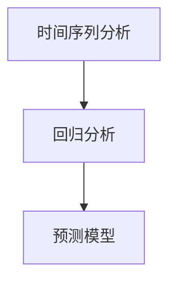

**核心算法原理讲解**
常见的预测模型包括线性回归模型、ARIMA模型和神经网络模型。

1. **线性回归模型**：用于预测连续变量，其算法步骤如下：
   - 确定自变量和因变量。
   - 构建线性回归方程。
   - 计算回归系数。
   - 进行预测。
2. **ARIMA模型**：用于预测时间序列数据，其算法步骤如下：
   - 确定时间序列数据的自相关性。
   - 构建ARIMA模型。
   - 计算模型参数。
   - 进行预测。
3. **神经网络模型**：用于预测非线性关系，其算法步骤如下：
   - 确定输入和输出。
   - 构建神经网络结构。
   - 训练神经网络。
   - 进行预测。

**数学模型和公式**
常见的数学模型包括：线性回归模型、ARIMA模型和神经网络模型。

1. **线性回归模型**：其公式为：
   $$ y = \beta_0 + \beta_1x $$
   其中，$y$ 是因变量，$x$ 是自变量，$\beta_0$ 是截距，$\beta_1$ 是斜率。
2. **ARIMA模型**：其公式为：
   $$ y_t = c + \phi_1y_{t-1} + \phi_2y_{t-2} + ... + \phi_py_{t-p} + \theta_1\epsilon_{t-1} + \theta_2\epsilon_{t-2} + ... + \theta_q\epsilon_{t-q} $$
   其中，$y_t$ 是时间序列数据，$\epsilon_t$ 是白噪声序列，$\phi_i$ 和 $\theta_i$ 是模型参数。
3. **神经网络模型**：其公式为：
   $$ z = \sum_{i=1}^{n} w_i \cdot x_i $$
   其中，$z$ 是输出，$w_i$ 是权重，$x_i$ 是输入。

**举例说明**
假设一个公司需要预测下个月的销售额。通过数据预测方法，可以构建线性回归模型来预测销售额。

1. **数据准备**：收集过去几个月的销售额数据。
2. **模型构建**：使用线性回归模型来拟合数据。
3. **模型评估**：计算预测误差和拟合优度。
4. **预测**：使用模型预测下个月的销售额。

**注意事项**
在数据预测过程中，领导者需要确保数据的准确性和完整性，并选择合适的预测模型。

**拓展阅读**
- Box, G. E. P., & Jenkins, G. M. (1976). Time series analysis: Forecasting and control.
- Haykin, S. (1994). Neural networks: A comprehensive foundation.

#### 2.3 决策中的不确定性处理

**背景介绍**
在决策过程中，不确定性是常见且难以避免的问题。有效的处理不确定性可以帮助领导者更好地应对复杂和不确定的环境。

**核心概念与联系**
决策中的不确定性处理包括：不确定性理论、模糊集理论和随机规划。这些概念之间的关系可以用以下Mermaid流程图表示：

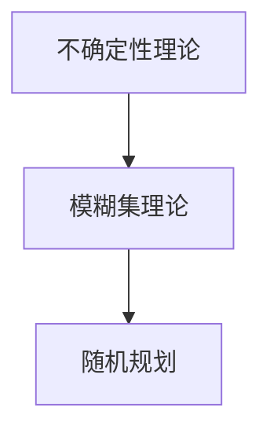

**核心算法原理讲解**
常见的处理不确定性的方法包括：

1. **不确定性理论**：通过概率分布来描述不确定性，常用的方法包括：
   - 全概率公式：用于计算在给定某个条件下另一个条件的概率。
   - 贝叶斯定理：用于更新概率分布，以反映新信息的加入。
2. **模糊集理论**：通过模糊隶属度来描述不确定性，常用的方法包括：
   - 模糊隶属函数：用于计算模糊集合的隶属度。
   - 模糊聚类：用于对数据集进行模糊分类。
3. **随机规划**：通过随机优化模型来处理不确定性，常用的方法包括：
   - 风险价值（Value at Risk，VaR）：用于计算资产在特定时间内可能遭受的最大损失。
   - 条件期望（Conditional Expectation）：用于计算在给定某个条件下另一个条件的期望值。

**数学模型和公式**
常见的数学模型包括：不确定性理论、模糊集理论和随机规划。

1. **不确定性理论**：其公式为：
   $$ P(A|B) = \frac{P(A \cap B)}{P(B)} $$
   其中，$P(A|B)$ 是在事件$B$发生的条件下事件$A$发生的概率，$P(A \cap B)$ 是事件$A$和事件$B$同时发生的概率，$P(B)$ 是事件$B$发生的概率。
2. **模糊集理论**：其公式为：
   $$ \mu_A(x) = \frac{1}{n} \sum_{i=1}^{n} \mu_{A_i}(x) $$
   其中，$\mu_A(x)$ 是模糊集合$A$的隶属度，$\mu_{A_i}(x)$ 是第$i$个模糊集合$A_i$的隶属度。
3. **随机规划**：其公式为：
   $$ \min_{x} \{ c^T x : Ax \leq b, x \geq 0 \} $$
   其中，$c$ 是目标函数系数，$A$ 是约束矩阵，$b$ 是约束向量。

**举例说明**
假设一个投资者需要决策是否购买某个股票。通过不确定性处理方法，可以计算出该股票的期望收益率和风险。

1. **不确定性建模**：使用不确定性理论和模糊集理论来描述股票的收益和风险。
2. **模型求解**：使用随机规划方法来求解最优投资策略。
3. **结果分析**：分析投资策略的期望收益率和风险。

**注意事项**
在处理不确定性时，领导者需要考虑多种可能的情况，并制定相应的应对策略。

**拓展阅读**
- Shen, H. T. (2001). Fuzzy systems and their applications in engineering.
- Rockafellar, R. T. (1970). Convex optimization in finite dimensions.

### 第三部分：成功案例分析

#### 3.1 领导者决策的成功案例

**背景介绍**
领导者决策的成功案例是决策理论在实际应用中的重要体现。这些案例展示了领导者如何通过有效的决策策略，在复杂和不确定的环境中取得成功。

**核心概念与联系**
领导者决策的成功案例涉及到：战略规划、市场进入、危机管理等。这些概念之间的关系可以用以下Mermaid流程图表示：

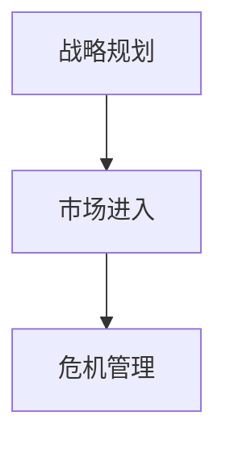

**核心算法原理讲解**
成功案例中的决策算法包括：

1. **战略规划**：通过SWOT分析、市场预测和竞争分析，制定长期战略规划。
2. **市场进入**：通过市场调研、竞争分析和资源分配，制定市场进入策略。
3. **危机管理**：通过风险评估、应急计划和沟通策略，应对突发事件。

**数学模型和公式**
成功案例中的数学模型包括：

1. **SWOT分析**：通过评估企业的优势（Strengths）、劣势（Weaknesses）、机会（Opportunities）和威胁（Threats），制定战略规划。
2. **市场预测**：通过回归分析和时间序列分析，预测市场趋势和竞争对手行为。
3. **竞争分析**：通过市场份额、产品定位和营销策略，评估竞争对手的竞争能力。

**举例说明**
以下是一个成功案例的举例：

**案例**：苹果公司推出iPhone

**决策过程**：
1. **战略规划**：苹果公司通过SWOT分析，确定了进军智能手机市场的战略方向。
2. **市场进入**：苹果公司进行了市场调研，分析了竞争对手的产品定位和营销策略，确定了iPhone的产品设计和市场定位。
3. **危机管理**：在iPhone推出后，苹果公司面临了市场竞争和产品质量的挑战，通过改进产品和增强客户服务，成功应对了危机。

**结果分析**：iPhone的成功推动了苹果公司在智能手机市场的崛起，成为全球最大的智能手机制造商之一。

**注意事项**
成功案例中的决策策略和方法可以提供宝贵的经验和启示，但领导者需要根据自身情况和外部环境进行调整。

**拓展阅读**
- Porter, M. E. (1998). Competitive strategy: Techniques for analyzing industries and competitors.
- Christensen, C. M. (1997). The innovator's dilemma: When new technologies cause great firms to fail.

#### 3.2 失误案例分析

**背景介绍**
决策失误是决策过程中不可避免的问题。通过分析决策失误的案例，可以帮助领导者识别决策过程中的潜在风险和问题，提高决策质量。

**核心概念与联系**
决策失误的案例分析涉及到：决策偏见、风险管理和决策过程。这些概念之间的关系可以用以下Mermaid流程图表示：

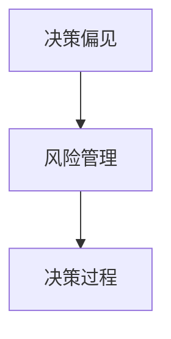

**核心算法原理讲解**
常见的决策失误原因包括：

1. **决策偏见**：由于人类认知的局限性，决策者可能会受到各种偏见的影响，如过度自信、确认偏差等。
2. **风险管理不当**：在决策过程中，如果对风险的认识和评估不准确，可能导致决策失误。
3. **决策过程混乱**：如果决策过程缺乏明确的目标和步骤，可能导致决策失误。

**数学模型和公式**
常见的数学模型包括：

1. **决策偏见校正**：通过统计方法对决策过程中的偏见进行校正，如偏差校正公式。
2. **风险评估模型**：通过风险识别、评估和监测，评估决策过程中的风险。
3. **决策过程优化**：通过优化决策过程的步骤和流程，提高决策效率。

**举例说明**
以下是一个决策失误的案例：

**案例**：某公司投资新能源项目

**决策过程**：
1. **决策偏见**：公司高管过于乐观，认为新能源市场前景广阔，未充分认识到市场风险。
2. **风险管理不当**：在项目立项前，未对市场风险和技术风险进行充分评估。
3. **决策过程混乱**：项目立项后，未建立明确的决策流程和监督机制，导致项目进展缓慢。

**结果分析**：由于决策失误，公司投资的新能源项目未能实现预期收益，甚至面临亏损风险。

**注意事项**
领导者需要认识到决策失误的潜在风险，通过加强风险管理、优化决策过程和校正决策偏见，提高决策质量。

**拓展阅读**
- Kahneman, D., & Tversky, A. (1979). Prospect theory: An analysis of decision under risk.
- Stavins, R. N. (1995). What can we learn from cap-and-trade experiments? The case of sulfur dioxide emissions.

#### 3.3 领导力与决策的关系

**背景介绍**
领导力在决策过程中起着至关重要的作用。有效的领导力可以帮助领导者更好地应对复杂和不确定的环境，提高决策质量和成功率。

**核心概念与联系**
领导力与决策的关系涉及到：领导风格、领导力培养和决策质量。这些概念之间的关系可以用以下Mermaid流程图表示：

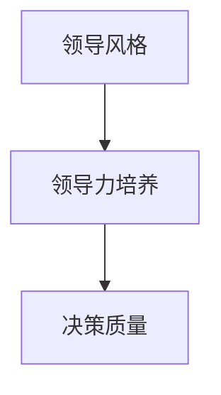

**核心算法原理讲解**
领导力对决策的影响包括：

1. **领导风格**：不同的领导风格会影响决策的方式和结果。例如，民主型领导风格可能更倾向于集体决策，而独裁型领导风格可能更倾向于个人决策。
2. **领导力培养**：通过领导力培训和实践，可以提高领导者在决策过程中的能力和水平。
3. **决策质量**：领导力对决策质量有重要影响。有效的领导力可以确保决策的科学性、合理性和可执行性。

**数学模型和公式**
常见的数学模型包括：

1. **领导风格评估**：通过问卷和访谈等方法，评估领导者的领导风格。
2. **领导力培养模型**：通过领导力培训和实践，提高领导者在决策过程中的能力和水平。
3. **决策质量评估**：通过评估决策的结果和效果，评估决策的质量。

**举例说明**
以下是一个领导力与决策的案例：

**案例**：某公司CEO的领导力提升

**决策过程**：
1. **领导风格评估**：通过领导风格评估，发现CEO的领导风格偏向独裁型，决策过程缺乏民主参与。
2. **领导力培养**：通过领导力培训和实践，CEO逐步转向民主型领导风格，增强团队参与度。
3. **决策质量评估**：决策过程变得更加科学、合理和可执行，决策效果显著提高。

**结果分析**：通过领导力的提升，公司决策质量得到显著改善，业务发展更加顺利。

**注意事项**
领导者需要认识到领导力对决策的重要性，通过不断学习和实践，提高自己的领导力和决策能力。

**拓展阅读**
- Hersey, P., & Blanchard, K. H. (1982). Management of organizational behavior.
- Yukl, G. A. (2013). Leadership in organizations.

### 第四部分：实践指导与策略

#### 4.1 决策流程优化

**背景介绍**
有效的决策流程优化可以帮助领导者提高决策效率和质量。决策流程优化涉及到：流程设计、工具选择和流程监控。

**核心概念与联系**
决策流程优化的核心概念包括：流程设计、工具选择和流程监控。这些概念之间的关系可以用以下Mermaid流程图表示：

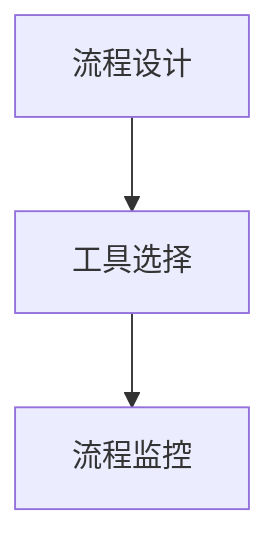

**核心算法原理讲解**
常见的决策流程优化方法包括：

1. **流程设计**：通过明确决策目标、确定决策步骤和优化决策流程，提高决策效率。
2. **工具选择**：选择合适的决策工具，如决策树、期望值模型等，提高决策的科学性和准确性。
3. **流程监控**：通过监控决策流程的实施情况，及时发现和解决流程中的问题。

**数学模型和公式**
常见的数学模型包括：

1. **决策流程优化模型**：通过目标函数和约束条件，优化决策流程。
2. **决策工具选择模型**：通过评估不同决策工具的性能和适用性，选择最优工具。

**举例说明**
以下是一个决策流程优化的案例：

**案例**：某公司优化决策流程

**决策过程**：
1. **流程设计**：明确决策目标，确定决策步骤，制定决策流程。
2. **工具选择**：评估不同决策工具的性能和适用性，选择决策树作为主要工具。
3. **流程监控**：监控决策流程的实施情况，及时发现和解决流程中的问题。

**结果分析**：通过决策流程优化，公司决策效率显著提高，决策质量得到保障。

**注意事项**
领导者需要根据实际情况，设计和优化决策流程，确保决策的科学性和有效性。

**拓展阅读**
- Thompson, J. D. (2001). Inventing the electronic corporation.
- McLaughlin, J. P. (1997). Information technology and management.

#### 4.2 决策制定策略

**背景介绍**
有效的决策制定策略可以帮助领导者更好地应对复杂和不确定的环境。决策制定策略涉及到：长期决策、短期决策和战略决策。

**核心概念与联系**
决策制定策略的核心概念包括：长期决策、短期决策和战略决策。这些概念之间的关系可以用以下Mermaid流程图表示：

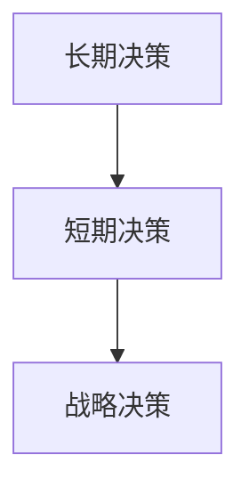

**核心算法原理讲解**
常见的决策制定策略包括：

1. **长期决策**：通过制定长期规划，确保企业长远发展。
2. **短期决策**：通过制定短期计划，应对市场变化和竞争压力。
3. **战略决策**：通过制定战略规划，实现企业的战略目标。

**数学模型和公式**
常见的数学模型包括：

1. **长期决策模型**：通过评估长期收益和成本，制定长期规划。
2. **短期决策模型**：通过评估短期收益和成本，制定短期计划。
3. **战略决策模型**：通过评估战略目标和资源分配，制定战略规划。

**举例说明**
以下是一个决策制定策略的案例：

**案例**：某公司制定年度计划

**决策过程**：
1. **长期决策**：制定公司年度目标和长期规划。
2. **短期决策**：制定季度计划和月度计划，应对市场变化和竞争压力。
3. **战略决策**：制定公司战略规划，确保公司长远发展。

**结果分析**：通过有效的决策制定策略，公司年度计划得到有效执行，市场竞争力得到提升。

**注意事项**
领导者需要根据实际情况，制定合理的决策制定策略，确保企业的可持续发展。

**拓展阅读**
- Porter, M. E. (2008). Competitive advantage: Creating and sustaining superior performance.
- Mintzberg, H. (1973). The nature of managerial work.

#### 4.3 决策执行与反馈

**背景介绍**
有效的决策执行与反馈是决策过程中至关重要的一环。决策执行与反馈涉及到：执行策略、反馈机制和问题解决。

**核心概念与联系**
决策执行与反馈的核心概念包括：执行策略、反馈机制和问题解决。这些概念之间的关系可以用以下Mermaid流程图表示：

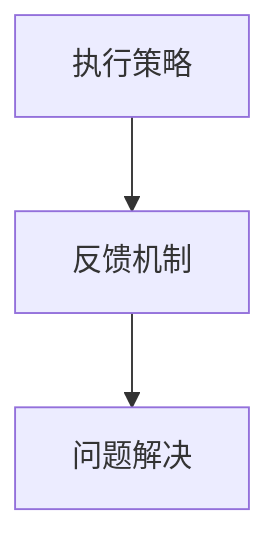

**核心算法原理讲解**
常见的决策执行与反馈方法包括：

1. **执行策略**：通过制定详细的执行计划，确保决策得到有效执行。
2. **反馈机制**：通过建立反馈机制，收集决策执行过程中的信息，评估决策效果。
3. **问题解决**：通过分析问题原因，制定解决方案，确保问题得到有效解决。

**数学模型和公式**
常见的数学模型包括：

1. **执行策略模型**：通过制定执行计划和资源分配，优化决策执行。
2. **反馈机制模型**：通过建立反馈网络和评估指标，优化决策反馈。
3. **问题解决模型**：通过分析问题原因和制定解决方案，优化问题解决。

**举例说明**
以下是一个决策执行与反馈的案例：

**案例**：某公司实施新政策

**决策过程**：
1. **执行策略**：制定详细的实施计划，明确任务分配和时间安排。
2. **反馈机制**：建立反馈渠道，收集员工对新政策的意见和建议。
3. **问题解决**：分析反馈信息，针对存在的问题，制定改进措施。

**结果分析**：通过有效的决策执行与反馈，公司新政策得到顺利实施，问题得到及时解决。

**注意事项**
领导者需要重视决策执行与反馈，确保决策得到有效实施，及时解决问题。

**拓展阅读**
- Pichai, S. (2015). Turning the tide: Leading Google's charge into the next decade of Google.
- Hamel, G., & Prusak, L. (2002). The invisible heart of strategy: Balancing leadership across the enterprise.

#### 4.4 综合性案例分析

**背景介绍**
综合性案例分析是理解和应用决策理论的有效途径。通过分析真实案例，可以更好地理解决策理论在实际中的应用，为领导者提供实践指导。

**核心概念与联系**
综合性案例分析的核心概念包括：案例选择、案例分析、案例总结。这些概念之间的关系可以用以下Mermaid流程图表示：

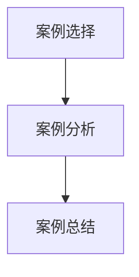

**核心算法原理讲解**
常见的案例分析步骤包括：

1. **案例选择**：根据研究目标和实际情况，选择具有代表性的案例。
2. **案例分析**：通过收集和分析案例数据，理解案例中的决策过程和决策结果。
3. **案例总结**：总结案例中的经验教训，提炼出可借鉴的决策方法和策略。

**数学模型和公式**
常见的数学模型包括：

1. **案例选择模型**：通过评估案例的代表性、影响力和适用性，选择最佳案例。
2. **案例分析模型**：通过数据分析和统计方法，评估案例中的决策效果和决策质量。
3. **案例总结模型**：通过归纳总结和归纳推理，提炼出案例中的关键经验和教训。

**举例说明**
以下是一个综合性案例分析的案例：

**案例**：某公司成功实施数字化转型

**决策过程**：
1. **案例选择**：选择某公司作为数字化转型案例，分析其数字化转型过程中的决策。
2. **案例分析**：收集该公司数字化转型过程中的数据，分析其决策过程和决策结果。
3. **案例总结**：总结该公司数字化转型过程中的成功经验和教训，为其他企业数字化转型提供借鉴。

**结果分析**：通过综合性案例分析，总结出数字化转型中的关键决策方法和策略，为其他企业提供了宝贵的实践经验。

**注意事项**
领导者需要重视综合性案例分析，通过分析真实案例，提升自身的决策能力。

**拓展阅读**
- Mintzberg, H., Ahlstrand, B., & Lampel, J. (2011). Strategy safari: A guided tour through 64 business strategies for thriving in a turbulent world.
- Barwise, T. P., & Minton, R. (1999). Cases in business ethics.

### 附录

#### 附录A：决策工具与应用

**背景介绍**
决策工具是决策过程中重要的辅助工具，可以帮助领导者更好地进行决策。常见的决策工具有：决策树、期望值模型、蒙特卡罗模拟等。

**核心概念与联系**
决策工具的核心概念包括：决策树、期望值模型、蒙特卡罗模拟。这些概念之间的关系可以用以下Mermaid流程图表示：

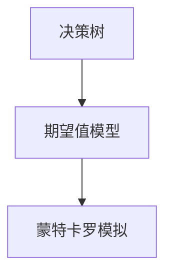

**核心算法原理讲解**
常见的决策工具算法原理包括：

1. **决策树**：通过构建决策树，对决策问题进行分步分析和求解。
2. **期望值模型**：通过计算期望值，评估决策结果和决策质量。
3. **蒙特卡罗模拟**：通过模拟随机过程，评估决策结果和风险。

**数学模型和公式**
常见的数学模型和公式包括：

1. **决策树**：决策树的构建公式为：
   $$ T = \{ t_1, t_2, ..., t_n \} $$
   其中，$T$ 是决策树，$t_i$ 是决策树中的节点。
2. **期望值模型**：期望值计算公式为：
   $$ E(X) = \sum_{i=1}^{n} x_i \cdot p_i $$
   其中，$E(X)$ 是期望值，$x_i$ 是决策结果，$p_i$ 是决策结果的概率。
3. **蒙特卡罗模拟**：蒙特卡罗模拟的公式为：
   $$ X_t = X_{t-1} + W_t $$
   其中，$X_t$ 是随机过程在时间$t$的值，$W_t$ 是随机过程在时间$t$的增量。

**举例说明**
以下是一个决策工具的举例：

**案例**：使用决策树进行决策

**决策过程**：
1. **构建决策树**：根据决策问题，构建决策树。
2. **计算期望值**：对决策树进行计算，得到每个决策节点的期望值。
3. **选择最优决策**：根据期望值，选择最优决策。

**结果分析**：通过决策树工具，可以清晰地分析决策问题，选择最优决策。

**注意事项**
领导者需要根据实际情况，选择合适的决策工具，提高决策效率和质量。

**拓展阅读**
- Quinlan, J. R. (1986). Induction of decision trees.
- Reutskiy, S. (2013). Monte Carlo simulation: A practical approach.

#### 附录B：决策模型与算法

**背景介绍**
决策模型与算法是决策过程中重要的理论基础和工具。常见的决策模型与算法包括：线性规划、整数规划、遗传算法等。

**核心概念与联系**
决策模型与算法的核心概念包括：线性规划、整数规划、遗传算法。这些概念之间的关系可以用以下Mermaid流程图表示：

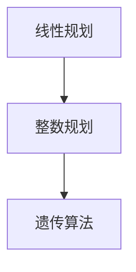

**核心算法原理讲解**
常见的决策模型与算法原理包括：

1. **线性规划**：通过线性规划模型，求解线性目标函数的最优解。
2. **整数规划**：通过整数规划模型，求解整数目标函数的最优解。
3. **遗传算法**：通过模拟自然进化过程，求解复杂优化问题的最优解。

**数学模型和公式**
常见的数学模型和公式包括：

1. **线性规划**：线性规划模型为：
   $$ \min_{x} \{ c^T x : Ax \leq b, x \geq 0 \} $$
   其中，$c$ 是目标函数系数，$A$ 是约束矩阵，$b$ 是约束向量。
2. **整数规划**：整数规划模型为：
   $$ \min_{x} \{ c^T x : Ax \leq b, x \in \mathbb{Z}^n \} $$
   其中，$c$ 是目标函数系数，$A$ 是约束矩阵，$b$ 是约束向量，$\mathbb{Z}^n$ 是整数集。
3. **遗传算法**：遗传算法的基本步骤包括：
   - 初始化种群。
   - 选择适应度高的个体。
   - 交叉和变异。
   - 评估适应度。
   - 生成新的种群。

**举例说明**
以下是一个决策模型与算法的举例：

**案例**：使用线性规划进行资源分配

**决策过程**：
1. **构建线性规划模型**：根据资源分配问题，构建线性规划模型。
2. **求解线性规划**：使用线性规划算法，求解最优解。
3. **分析结果**：分析求解结果，评估资源分配的合理性。

**结果分析**：通过线性规划模型和算法，可以有效地进行资源分配，提高资源利用效率。

**注意事项**
领导者需要根据实际情况，选择合适的决策模型与算法，提高决策质量和效率。

**拓展阅读**
- Dantzig, G. B. (1963). Linear programming and extensions.
- Holland, J. H. (1975). Adaptation in natural and artificial systems.

#### 附录C：领导力模型

**背景介绍**
领导力模型是研究和指导领导力发展的理论基础。常见的领导力模型包括：领导风格模型、领导力发展阶段模型等。

**核心概念与联系**
领导力模型的核心概念包括：领导风格模型、领导力发展阶段模型。这些概念之间的关系可以用以下Mermaid流程图表示：

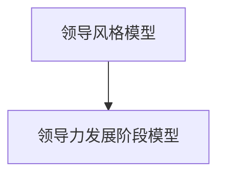

**核心算法原理讲解**
常见的领导力模型原理包括：

1. **领导风格模型**：通过分析领导者的行为和风格，分类和评估领导者的领导风格。
2. **领导力发展阶段模型**：通过分析领导者的成长过程，描述领导力的不同阶段和特点。

**数学模型和公式**
常见的数学模型和公式包括：

1. **领导风格模型**：领导风格评估公式为：
   $$ S = \frac{I + M}{2} $$
   其中，$S$ 是领导风格得分，$I$ 是指令型领导得分，$M$ 是支持型领导得分。
2. **领导力发展阶段模型**：领导力发展阶段评估公式为：
   $$ L = \frac{1}{n} \sum_{i=1}^{n} l_i $$
   其中，$L$ 是领导力得分，$l_i$ 是第$i$个发展阶段得分，$n$ 是发展阶段数量。

**举例说明**
以下是一个领导力模型的举例：

**案例**：使用领导风格模型评估领导力

**决策过程**：
1. **构建领导风格模型**：根据领导者的行为和风格，构建领导风格模型。
2. **评估领导力**：使用领导风格模型，评估领导者的领导力得分。
3. **分析结果**：分析领导力得分，评估领导者的领导风格和发展阶段。

**结果分析**：通过领导力模型，可以清晰地了解领导者的领导力水平，为领导力发展提供指导。

**注意事项**
领导者需要根据实际情况，选择合适的领导力模型，不断提高自身的领导力。

**拓展阅读**
- Hersey, P., & Blanchard, K. H. (1982). Management of organizational behavior.
- Yukl, G. A. (2013). Leadership in organizations.

### 文章总结

本文从决策理论、风险管理、成功案例和实践策略等多个方面，深入探讨了领导者在关键时刻做出决策的重要性和方法。通过分析决策理论的起源与发展、决策模型构建、决策中的心理学因素，以及风险管理、数据预测和不确定性处理等内容，帮助领导者提升决策能力。同时，通过成功案例和失误案例分析，展示了决策理论在实际应用中的效果。最后，本文提供了决策流程优化、决策制定策略、决策执行与反馈以及综合性案例分析等实践指导与策略，为领导者提供切实可行的决策方法。

**结论**：
有效的决策能力是领导者成功的关键。通过本文的探讨，领导者可以更好地理解和应用决策理论，提高决策质量和成功率，在复杂和不确定的环境中做出更加明智的抉择。

**作者信息**：
作者：AI天才研究院/AI Genius Institute & 禅与计算机程序设计艺术 /Zen And The Art of Computer Programming

### 附录

#### 附录A：决策工具与应用

**决策工具介绍**
- 决策树（Decision Tree）：用于分类和回归问题，通过节点表示特征，通过路径表示决策过程。
- 期望值模型（Expected Value Model）：用于计算决策结果的期望值，评估不同决策的预期收益。
- 蒙特卡罗模拟（Monte Carlo Simulation）：通过模拟随机过程，评估决策结果的概率分布和风险。

**使用方法**
- 决策树：首先收集数据，然后构建决策树，最后使用决策树进行分类或回归预测。
- 期望值模型：确定所有可能的决策结果，计算每个结果的期望值，选择期望值最大的决策。
- 蒙特卡罗模拟：生成大量随机样本，计算每个样本的决策结果，统计结果分布和风险。

**案例**
- 决策树案例：使用决策树预测客户购买意向。
- 期望值模型案例：评估不同投资策略的预期收益。
- 蒙特卡罗模拟案例：评估新产品市场推广的风险。

**注意事项**
- 确保数据质量，减少误差。
- 选择合适的模型，根据问题特点进行优化。
- 定期更新模型和数据，保持模型的准确性。

#### 附录B：决策模型与算法

**决策模型介绍**
- 线性规划（Linear Programming）：求解线性目标函数的最优解，适用于资源分配和优化问题。
- 整数规划（Integer Programming）：求解整数目标函数的最优解，适用于需要整数解的问题。
- 遗传算法（Genetic Algorithm）：模拟自然进化过程，求解复杂优化问题的最优解。

**算法原理**
- 线性规划：通过构建线性目标函数和约束条件，使用单纯形法或内点法求解最优解。
- 整数规划：通过构建整数目标函数和约束条件，使用割平面法或分支定界法求解最优解。
- 遗传算法：通过初始化种群、选择、交叉、变异和评估适应度，迭代生成新种群，最终找到最优解。

**案例**
- 线性规划案例：优化生产线资源分配。
- 整数规划案例：求解物流运输的最优路径。
- 遗传算法案例：优化城市交通信号灯控制。

**注意事项**
- 确保模型和算法的适用性，避免过度复杂。
- 选择合适的初始参数，提高算法性能。
- 结合实际问题特点，调整算法参数。

#### 附录C：领导力模型

**领导力模型介绍**
- 领导风格模型（Leadership Style Model）：通过分析领导者的行为和风格，分类和评估领导者的领导风格。
- 领导力发展阶段模型（Leadership Development Stage Model）：通过分析领导者的成长过程，描述领导力的不同阶段和特点。

**使用方法**
- 领导风格模型：通过观察领导者的行为，评估领导风格类型，如指令型、支持型、参与型等。
- 领导力发展阶段模型：通过分析领导者的经历和成长，评估领导力发展阶段，如新手阶段、胜任阶段、熟练阶段等。

**案例**
- 领导风格模型案例：评估不同领导风格对企业绩效的影响。
- 领导力发展阶段模型案例：分析领导者的成长路径和培养策略。

**注意事项**
- 确保评估过程的客观性和准确性。
- 结合企业实际情况，制定针对性的领导力发展计划。
- 定期评估领导力的提升效果，调整发展策略。

**参考文献**
- Hersey, P., & Blanchard, K. H. (1982). Management of organizational behavior.
- Yukl, G. A. (2013). Leadership in organizations.
- Mintzberg, H. (1973). The nature of managerial work.

