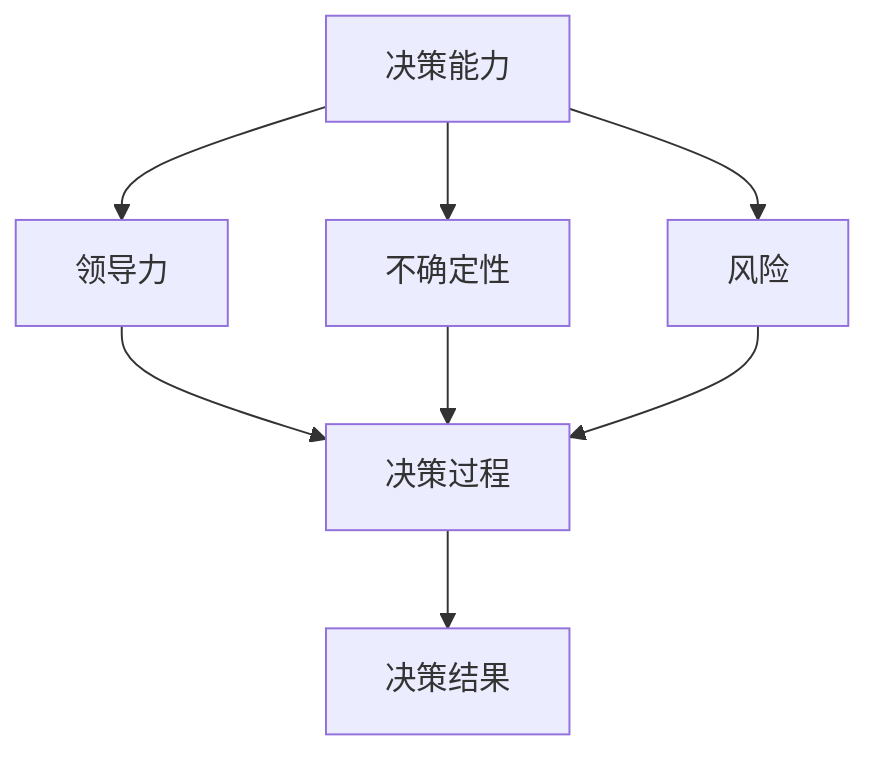
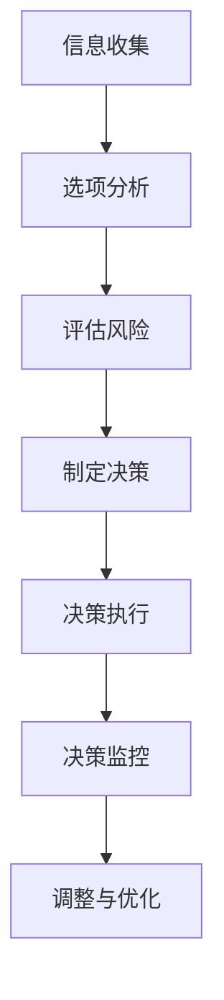
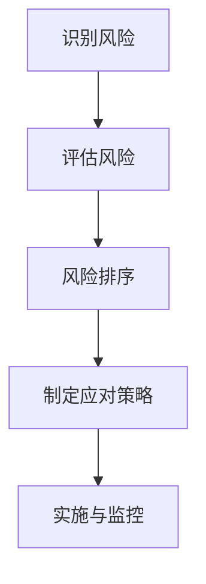
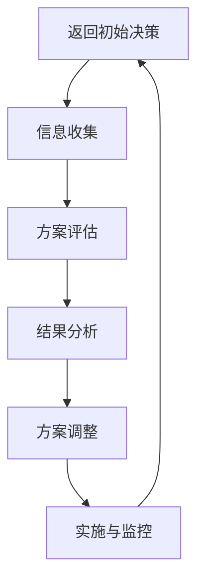
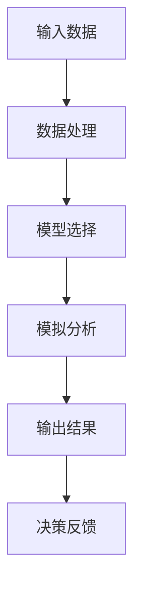

                 


### 背景介绍

领导者的决策能力在现代商业环境中至关重要。随着全球化进程的加速，市场竞争日益激烈，技术变革日新月异，企业面临着前所未有的复杂性和不确定性。在这种环境下，领导者不仅需要具备卓越的战略眼光和判断力，还必须在不确定性中做出明智的决策。

决策能力不仅是领导者个人素质的体现，更是团队协作和整体组织效能的关键。有效的决策能够帮助企业在竞争中保持优势，实现长期发展；而错误的决策则可能导致资源浪费、市场丧失甚至企业倒闭。

本文旨在探讨领导者在不确定性中做出决策的挑战和策略。我们将从以下几个方面展开：

1. **决策能力的核心概念与框架**：介绍决策能力的定义、重要性及其与领导力的关系，解析决策过程的基本框架。
2. **不确定性分析**：探讨不确定性的定义、类型及其影响因素，分析市场环境变化、技术变革和社会文化因素对不确定性决策的影响。
3. **决策模型与算法**：介绍经典决策模型和不确定性决策模型，包括最大最小后悔值模型、贝叶斯决策理论、决策树模型、风险评估模型等，并详细解释其原理和应用。
4. **案例分析**：通过具体案例展示领导者在不确定性环境中做出决策的实践，分析其决策过程和结果。
5. **决策能力提升策略**：探讨领导者如何通过自我评估、学习和案例研究等手段提升决策能力。
6. **未来展望**：分析决策能力的发展趋势和面临的挑战，探讨未来决策能力的培养方向。

通过本文的探讨，希望能够为领导者提供实用的决策策略，帮助他们在不确定性中做出更明智的选择，从而实现企业的长期成功。

### 核心概念与联系

在探讨领导者的决策能力时，我们首先需要明确几个核心概念，并理解它们之间的相互关系。

1. **决策能力**：决策能力是指个体在面临复杂情境时，能够合理收集信息、分析选项、评估风险并做出合理决策的能力。它包括信息收集、问题分析、方案评估和执行监控等多个环节。

2. **不确定性**：不确定性是指在决策过程中无法准确预测或控制的各种变量和情境。这些变量可能来自于市场环境、技术发展、社会文化等多个方面，它们增加了决策的复杂性。

3. **领导力**：领导力是指领导者通过激励、指导、协调和影响团队，实现组织目标的能力。决策能力是领导力的重要组成部分，有效的决策能力能够增强领导者的权威和影响力。

4. **风险**：风险是指决策结果偏离预期目标的可能性。在不确定性环境中，领导者必须学会评估和管理风险，以降低决策失误的可能性。

这几个核心概念之间的关系可以概括为：

- **决策能力**与**领导力**密切相关，决策能力的高低直接影响领导者的领导效果。
- **不确定性**是决策过程中的一个重要因素，它要求领导者具备更强的适应能力和分析能力。
- **风险**评估是决策过程中的关键步骤，领导者必须学会如何合理评估和管理风险。

为了更好地理解这些概念之间的关系，我们可以使用Mermaid流程图来展示它们之间的相互作用。



- **决策能力**作为输入，通过**决策过程**这个核心环节，影响**决策结果**。
- **领导力**作为决策能力的一部分，通过**决策能力**作用于**决策过程**，最终影响**决策结果**。
- **不确定性**增加了决策的复杂性，通过**决策过程**影响**决策结果**。
- **风险**评估是决策过程中的一个关键步骤，直接影响**决策结果**。

通过上述流程图，我们可以清晰地看到决策能力、领导力、不确定性和风险之间的相互关系，这为后续章节的具体分析提供了理论基础。

### 决策过程的基本框架

决策过程是一个复杂的系统，涉及多个环节和步骤。领导者必须在这个过程中有效地进行信息收集、分析选项、评估风险并制定最终决策。以下是决策过程的基本框架：

#### 1. 信息收集

信息收集是决策过程的基础。领导者需要从各种渠道获取相关信息，这些信息可能来自市场调研、内部报告、竞争对手分析、行业动态等多个方面。

- **市场调研**：通过问卷调查、焦点小组讨论、用户访谈等方式获取市场趋势和消费者需求。
- **内部报告**：分析销售数据、财务报表、生产数据等，了解企业的运营状况。
- **竞争对手分析**：研究竞争对手的产品、价格、市场策略等，以便找出自身的优势和劣势。
- **行业动态**：关注行业新闻、技术发展、政策变化等，把握行业趋势。

#### 2. 选项分析

在获取到足够的信息后，领导者需要对不同的选项进行分析。这包括：

- **优势与劣势分析**：列出每个选项的优势和劣势，评估其对企业的潜在影响。
- **可行性分析**：考虑每个选项的可行性，包括技术、资源、时间等方面的要求。
- **潜在风险分析**：评估每个选项可能带来的风险，包括市场风险、技术风险、财务风险等。

#### 3. 评估风险

评估风险是决策过程中至关重要的一步。领导者需要综合考虑各种风险因素，制定应对策略。

- **风险评估模型**：使用定性或定量的方法对风险进行评估，如最大最小后悔值模型、贝叶斯决策理论等。
- **风险应对策略**：制定针对不同风险的应对措施，包括风险规避、风险降低、风险接受等。

#### 4. 制定决策

在完成信息收集、选项分析和风险评估后，领导者需要制定最终决策。这包括：

- **决策制定策略**：根据分析结果选择最佳方案，考虑资源分配、时间规划等因素。
- **决策执行计划**：制定详细的执行计划，确保决策能够顺利实施。

#### 5. 决策执行与监控

决策制定后，领导者需要确保决策得到有效执行，并对其进行持续监控。

- **执行监控**：建立监控机制，跟踪决策执行进度，及时发现和解决问题。
- **调整与优化**：根据执行情况调整决策方案，优化资源配置和执行策略。

以下是一个简单的决策过程框架，使用Mermaid流程图表示：



- **信息收集**是决策过程的第一步，为后续分析提供基础。
- **选项分析**帮助领导者从多个角度评估不同方案。
- **评估风险**确保领导者能够预见并应对可能的风险。
- **制定决策**是整个过程的核心，领导者需要基于分析结果做出最佳选择。
- **决策执行**和**决策监控**确保决策能够得到有效实施和调整。

通过上述流程，领导者可以系统地完成决策过程，从而在不确定性中做出更为明智的选择。

### 不确定性原理与影响因素

在决策过程中，不确定性是一个不可忽视的重要因素。它不仅增加了决策的复杂性，还可能直接影响决策的成败。为了更好地理解不确定性，我们需要从其定义、类型以及影响因素等多个角度进行探讨。

#### 不确定性的定义

不确定性是指在决策过程中无法准确预测或控制的各种变量和情境。这些变量可能涉及市场环境、技术发展、社会文化等多个方面。根据德鲁克（Peter Drucker）的定义，不确定性可以看作是“决策过程中不可预测的未来事件和条件”。

#### 不确定性的类型

不确定性可以大致分为以下几类：

1. **客观不确定性**：这种不确定性来源于外部环境，如市场波动、技术变革等，是领导者无法完全控制的。

2. **主观不确定性**：这种不确定性来源于决策者的认知和判断，如信息不足、经验不足等，是可以通过提升个人能力来减少的。

3. **模糊性**：模糊性是指信息不完全、不明确或不确定的情况。例如，在市场需求预测中，由于数据不足或信息滞后，可能导致预测结果的不确定性。

#### 影响不确定性的关键因素

不确定性受到多种因素的影响，以下是一些主要的影响因素：

1. **市场环境变化**：市场环境的不稳定性是导致不确定性的主要原因之一。例如，经济衰退、贸易战、政策变化等都可能对市场产生重大影响。

2. **技术变革**：技术的快速发展使得企业必须不断适应新的技术环境。例如，人工智能、区块链等新兴技术的崛起，不仅改变了市场竞争格局，也增加了决策的不确定性。

3. **社会文化因素**：社会文化的变迁和多样性也会影响决策。例如，消费者行为的变化、文化价值观的多元化等都可能导致市场不确定性增加。

4. **信息不完整**：信息不完整或信息滞后是常见的不确定性来源。在决策过程中，如果信息不充分或不准确，领导者很难做出准确的判断。

5. **竞争态势**：竞争的激烈程度也会增加不确定性。在高度竞争的市场中，企业需要快速应对竞争对手的动态变化，这增加了决策的复杂性。

#### 不确定性对决策的影响

不确定性对决策的影响主要体现在以下几个方面：

1. **增加决策难度**：不确定性使得决策过程更加复杂，领导者需要面对更多的变量和可能性，从而增加了决策的难度。

2. **增加决策风险**：不确定性增加了决策失败的风险，因为无法准确预测未来可能发生的事件。

3. **影响决策效率**：在不确定性较高的环境中，领导者可能需要更多的时间和资源来收集信息和进行分析，这可能会影响决策的效率。

4. **决策结果的不可预测性**：在不确定性环境中，决策结果具有很高的不可预测性，即使是最优的决策也可能面临失败的风险。

为了更好地应对不确定性，领导者需要具备以下能力：

1. **适应性**：领导者需要具备快速适应环境变化的能力，能够灵活调整决策方案。

2. **前瞻性**：领导者需要具备前瞻性思维，能够预见潜在的不确定性因素，并提前制定应对策略。

3. **信息整合能力**：领导者需要具备强大的信息整合能力，能够从大量信息中提取关键信息，做出准确的判断。

4. **风险评估能力**：领导者需要具备较强的风险评估能力，能够准确评估不确定性的影响，并制定相应的风险应对策略。

通过上述分析，我们可以看出不确定性是决策过程中一个不可忽视的重要因素。领导者需要具备应对不确定性的能力，才能在复杂多变的环境中做出明智的决策，实现企业的长期发展。

### 经典决策模型介绍

在探讨领导者的决策能力时，理解并掌握一些经典的决策模型是至关重要的。这些模型不仅提供了系统化的决策框架，还能够帮助领导者更好地应对复杂性和不确定性。在本章节中，我们将介绍几种经典的决策模型，包括最大最小后悔值模型、贝叶斯决策理论以及决策树模型，并详细解释其原理和应用。

#### 最大最小后悔值模型

最大最小后悔值模型（Maximum Regret Minimization, MRM）是一种基于“后悔理论”的决策方法。它的核心思想是：在面临多个选择时，选择导致最大后悔最小的方案。具体步骤如下：

1. **计算后悔值**：对于每一个选择和每一种可能的未来情况，计算如果选择了其他方案，将会产生的后悔值。后悔值的计算公式为：
   $$ 
   \text{后悔值} = \text{最佳选择的结果} - \text{当前选择的结果} 
   $$
2. **找到最小最大后悔值**：在所有可能的选择和未来情况下，找到导致最大后悔最小的方案。

以下是一个简单的示例：

假设领导者需要在三个备选方案中选择一个：
- **方案A**：如果市场繁荣，收益为100；如果市场衰退，损失为-20。
- **方案B**：如果市场繁荣，收益为80；如果市场衰退，损失为-30。
- **方案C**：如果市场繁荣，收益为60；如果市场衰退，损失为-10。

可能的未来情况有繁荣和衰退两种。

| 未来情况 | 方案A的结果 | 方案B的结果 | 方案C的结果 |
| :------: | :---------: | :---------: | :---------: |
| 繁荣     | 100         | 80          | 60          |
| 衰退     | -20         | -30         | -10         |

计算每个方案的后悔值：

| 未来情况 | 方案A的后悔值 | 方案B的后悔值 | 方案C的后悔值 |
| :------: | :-----------: | :-----------: | :-----------: |
| 繁荣     | 0            | 20           | 40           |
| 衰退     | 20           | 0            | 10           |

找出每个方案的最大后悔值：

- **方案A**：最大后悔值为20。
- **方案B**：最大后悔值为20。
- **方案C**：最大后悔值为40。

因此，选择最大最小后悔值最小的方案，即**方案A**或**方案B**（两者相同）。

#### 贝叶斯决策理论

贝叶斯决策理论（Bayesian Decision Theory）是基于概率论的决策方法，它通过不断更新先验概率来估计后验概率，从而做出最优决策。贝叶斯决策理论的核心公式为贝叶斯定理：
$$
P(A|B) = \frac{P(B|A)P(A)}{P(B)}
$$
其中，\( P(A|B) \) 是在条件 \( B \) 发生的概率下 \( A \) 发生的概率，\( P(B|A) \) 是在 \( A \) 发生的概率下 \( B \) 发生的概率，\( P(A) \) 是 \( A \) 发生的概率，\( P(B) \) 是 \( B \) 发生的概率。

贝叶斯决策理论的应用步骤如下：

1. **定义状态和行动**：明确决策问题中的所有可能状态和行动。
2. **计算先验概率**：根据以往的经验和知识，估计每个状态的概率。
3. **计算后验概率**：在观察到某些证据后，更新每个状态的先验概率，得到后验概率。
4. **计算期望效用**：计算每个行动在每种状态下的期望效用，选择期望效用最大的行动。

以下是一个简单的示例：

假设有一个决策问题，有两个行动（A1和A2）和两个状态（S1和S2），以及相应的收益矩阵：

|      | S1 | S2 |
| :--: | : | : |
| A1   | 10 | 20 |
| A2   | 30 | 10 |

先验概率为 \( P(S1) = 0.6 \)，\( P(S2) = 0.4 \)。

计算每个行动的期望效用：

- **行动A1**的期望效用：
  $$ 
  E(U(A1)) = P(S1) \cdot 10 + P(S2) \cdot 20 = 0.6 \cdot 10 + 0.4 \cdot 20 = 14 
  $$
- **行动A2**的期望效用：
  $$ 
  E(U(A2)) = P(S1) \cdot 30 + P(S2) \cdot 10 = 0.6 \cdot 30 + 0.4 \cdot 10 = 22 
  $$

因此，选择期望效用最大的行动，即**行动A2**。

#### 决策树模型

决策树模型（Decision Tree Model）是一种直观且易于理解的决策模型，它通过树状结构展示决策过程和可能的结果。决策树包括决策节点、机会节点、结果节点和概率分支。

决策树模型的步骤如下：

1. **定义决策节点**：表示决策的起点，列出所有可能的决策行动。
2. **定义机会节点**：表示决策结果，列出所有可能的结果状态。
3. **定义结果节点**：表示决策的结果，列出每种行动和每种结果状态的收益或损失。
4. **计算概率和期望**：为每个机会节点分配概率，计算每个结果节点的期望值。
5. **选择最佳行动**：选择期望值最大的行动。

以下是一个简单的决策树示例：

```
          起点
         /     \
        A       B
       / \     / \
      C   D   E   F
     / \ / \ / \ / \
   a1 a2 b1 b2 c1 c2 d1 d2
```

- **决策节点**：起点A和B表示决策的行动。
- **机会节点**：C、D、E和F表示决策的结果。
- **结果节点**：a1、a2、b1、b2、c1、c2、d1和d2表示每种行动和结果的收益或损失。

计算每个结果节点的期望值：

- **结果节点a1**：
  $$ 
  E(U(a1)) = 0.5 \cdot 10 + 0.5 \cdot 20 = 15 
  $$
- **结果节点a2**：
  $$ 
  E(U(a2)) = 0.5 \cdot 30 + 0.5 \cdot 10 = 20 
  $$
- **结果节点b1**：
  $$ 
  E(U(b1)) = 0.4 \cdot 10 + 0.6 \cdot 20 = 16 
  $$
- **结果节点b2**：
  $$ 
  E(U(b2)) = 0.4 \cdot 30 + 0.6 \cdot 10 = 24 
  $$

选择期望值最大的结果节点，即**a2**或**b2**（两者相同）。

通过上述三个经典决策模型的介绍，我们可以看到每个模型都有其独特的应用场景和优点。领导者可以根据具体情况选择合适的模型，以更好地应对复杂性和不确定性，做出明智的决策。

### 不确定性决策模型

在不确定性环境中，领导者需要具备更强的适应能力和分析能力，以便在不确定性的影响下做出明智的决策。以下将介绍几种常见的不确定性决策模型，包括风险评估模型、灵活性和适应性模型以及决策支持系统，详细解释其原理和应用。

#### 风险评估模型

风险评估模型是一种用于评估和管理不确定性的方法，它通过系统化的步骤，帮助领导者识别、分析和应对潜在的风险。以下是风险评估模型的几个关键步骤：

1. **识别风险**：通过头脑风暴、历史数据分析和专家访谈等方式，识别可能影响决策的各种风险因素。
2. **评估风险**：使用定性或定量方法，对识别出的风险进行评估。定性方法包括风险严重性和发生概率的评估，定量方法则通过概率分布和期望值计算。
3. **风险排序**：根据评估结果，对风险进行排序，优先处理高风险因素。
4. **制定应对策略**：针对不同风险，制定相应的应对策略，包括风险规避、风险降低、风险转移和风险接受等。

以下是一个简化的风险评估模型流程，使用Mermaid流程图表示：



- **识别风险**：通过头脑风暴和历史数据分析，识别潜在风险。
- **评估风险**：使用定性或定量方法，评估风险的发生概率和影响程度。
- **风险排序**：根据风险严重性和发生概率，对风险进行排序。
- **制定应对策略**：制定针对不同风险的应对措施。
- **实施与监控**：执行应对策略，并对风险控制效果进行持续监控。

在实际应用中，风险评估模型可以帮助领导者更好地了解和应对不确定性，从而做出更为稳健的决策。

#### 灵活性和适应性模型

在不确定性环境中，灵活性（Flexibility）和适应性（Adaptability）是领导者成功的关键。灵活性指的是在决策过程中能够快速调整和改变方案的能力，而适应性则是指在整个组织范围内，对环境变化进行有效响应的能力。

1. **灵活性和适应性定义**：

   - **灵活性**：在决策过程中，领导者需要根据新的信息和变化，快速调整和修改决策方案。
   - **适应性**：组织需要在战略、流程和文化等方面具备灵活性，以快速适应外部环境的变化。

2. **灵活性和适应性模型**：

   - **迭代决策模型**：该模型强调在决策过程中，不断收集信息、评估结果、调整方案，形成一种循环往复的决策过程。迭代决策模型可以提高决策的灵活性，帮助领导者快速适应环境变化。
   - **敏捷管理模型**：敏捷管理强调团队协作、快速反馈和持续改进。通过敏捷管理模型，组织可以在不确定的环境中快速响应变化，提高整体适应性。

以下是一个简单的迭代决策模型流程，使用Mermaid流程图表示：



- **初始决策**：领导者制定初步决策。
- **信息收集**：收集新的信息和反馈。
- **方案评估**：评估当前方案的有效性。
- **结果分析**：分析决策结果。
- **方案调整**：根据分析结果，调整决策方案。
- **实施与监控**：执行调整后的方案，并对实施效果进行监控。

通过灵活性和适应性模型，领导者可以更好地应对不确定性，提高决策的质量和效率。

#### 决策支持系统

决策支持系统（Decision Support System, DSS）是一种计算机辅助决策系统，它通过数据分析和模拟工具，为领导者提供决策支持。DSS的特点包括：

1. **数据分析能力**：DSS能够处理大量数据，进行多维分析，帮助领导者识别关键信息和趋势。
2. **模拟预测**：DSS可以模拟不同决策方案的结果，帮助领导者评估潜在的风险和收益。
3. **用户友好**：DSS通常具有直观的用户界面，方便领导者快速操作和分析。

以下是决策支持系统的一般架构：

```
[输入模块] --> [数据处理模块] --> [模型库] --> [模拟分析模块] --> [输出模块]
```

- **输入模块**：收集数据和信息，包括内部数据和外部数据。
- **数据处理模块**：对输入数据进行清洗、整理和转换。
- **模型库**：包含各种决策模型和算法，供用户选择。
- **模拟分析模块**：使用模型库中的模型，对决策方案进行模拟和分析。
- **输出模块**：将分析结果以图表、报告等形式展示给用户。

以下是一个简化的决策支持系统工作流程：



- **输入数据**：收集决策所需的数据。
- **数据处理**：对数据进行清洗和处理。
- **模型选择**：根据决策问题选择合适的模型。
- **模拟分析**：使用模型对决策方案进行分析。
- **输出结果**：将分析结果展示给用户。
- **决策反馈**：用户根据分析结果进行决策，并提供反馈。

通过决策支持系统，领导者可以更高效地应对不确定性，提高决策的科学性和准确性。

综上所述，不确定性决策模型为领导者提供了多种应对不确定性的方法和工具。通过风险评估模型、灵活性和适应性模型以及决策支持系统的应用，领导者可以在不确定的环境中做出更为明智和稳健的决策。

### 实践案例一：应对市场变化

在市场中，不确定性是领导者在决策过程中常常面临的一个重要挑战。以下是一个具体的案例，展示了领导者在面对市场变化时如何通过有效的决策过程，在不确定性中做出明智选择。

#### 案例背景

某大型电商平台，其主要业务包括线上零售、物流配送和数字营销。在过去的几年里，该平台凭借其强大的供应链和用户基础，取得了显著的市场份额。然而，随着市场的变化和竞争的加剧，该平台的销售额开始出现下降趋势。

#### 信息收集与分析

1. **市场调研**：为了应对市场变化，公司开展了全面的市场调研，包括用户需求调查、竞争对手分析以及行业趋势研究。调研结果表明，消费者的购买行为正在发生变化，越来越倾向于个性化和定制化的产品。同时，竞争对手也在积极拓展新兴市场，如跨境电商和社交电商。

2. **内部报告**：公司内部报告显示，尽管销售额下降，但物流配送效率和客户满意度保持在较高水平。这表明，公司仍拥有一定的竞争优势，但需要进一步挖掘潜力。

3. **竞争对手分析**：通过分析竞争对手的策略和市场表现，发现竞争对手在新兴市场中的成功，主要得益于他们灵活的运营模式和创新的市场营销手段。

#### 选项分析

根据收集到的信息，公司制定了以下三个备选方案：

1. **方案A：拓展传统市场**：通过加大广告投入，吸引更多传统市场的用户。这种方法风险较低，但收益相对有限。

2. **方案B：开拓新兴市场**：积极进入跨境电商和社交电商领域，利用公司的物流优势和用户基础，快速占领市场。这种方法收益高，但风险较大。

3. **方案C：提升用户满意度**：通过改善产品和服务，提高用户的忠诚度和复购率。这种方法收益稳定，风险相对较低。

#### 评估风险

1. **方案A**：传统市场的竞争激烈，广告投入可能无法带来预期的效果，且容易导致资源浪费。

2. **方案B**：新兴市场的进入成本较高，但具备较大的成长潜力。如果策略得当，可能迅速扩大市场份额，但失败的风险也较大。

3. **方案C**：通过提升用户满意度，可以稳定现有客户，提高复购率。但这种方法需要较长时间才能见效，且市场反应不确定。

#### 制定决策

经过详细的分析和评估，公司最终选择了方案C，提升用户满意度。主要考虑因素包括：

1. **资源优化**：公司现有的物流和用户基础可以支持这一策略，且成本相对较低。

2. **长期效益**：提升用户满意度有助于建立品牌忠诚度，长期来看，这将带来稳定的收益。

3. **风险可控**：与方案B相比，方案C的风险较低，失败的可能性较小。

#### 决策执行与监控

1. **执行策略**：公司制定了详细的执行计划，包括产品优化、客户服务改进以及营销策略调整。

2. **监控机制**：建立数据监控和反馈机制，实时跟踪用户满意度、复购率等关键指标。

#### 决策结果与启示

经过一年的执行，公司用户满意度显著提升，复购率也有所提高。尽管销售额在短期内没有明显增长，但客户基础更加稳固，为未来的发展奠定了坚实基础。

#### 启示

1. **重视用户需求**：在不确定性环境中，了解并满足用户需求是成功的关键。

2. **风险评估与优化**：在决策过程中，必须进行全面的风险评估，并选择最优方案。

3. **灵活调整**：在执行过程中，领导者需要具备灵活调整策略的能力，以应对不断变化的市场环境。

通过这个案例，我们可以看到，领导者在面对市场变化时，如何通过有效的决策过程，在不确定性中做出明智的选择，从而实现企业的长期发展。

### 实践案例二：技术创新下的决策

在快速发展的技术环境中，领导者需要具备敏锐的洞察力和前瞻性，以便在技术变革的浪潮中做出明智的决策。以下是一个具体的案例，展示了领导者在面对技术创新时如何通过有效的决策过程，在不确定性中抓住机遇。

#### 案例背景

某知名科技公司，其业务主要集中在互联网服务和软件开发。近年来，随着人工智能、大数据和云计算等新兴技术的快速发展，公司意识到技术创新是保持竞争优势的关键。然而，技术领域的变革速度极快，如何选择合适的技术方向成为公司决策的重要课题。

#### 信息收集与分析

1. **技术趋势研究**：公司组织了专门的技术研究团队，通过分析行业报告、学术论文和技术论坛，了解当前技术发展的趋势和热点。研究结果显示，人工智能和大数据技术在各个行业中的应用日益广泛，而云计算则成为支撑这些应用的基础设施。

2. **市场调研**：公司通过市场调研，发现客户对于智能化服务和个性化推荐的需求日益增加，这为人工智能和大数据技术的应用提供了广阔的市场空间。

3. **内部技术评估**：公司内部的技术团队对现有技术和能力进行了评估，发现公司已经在人工智能和大数据方面有一定的技术积累，但在云计算领域仍需加强。

#### 选项分析

根据收集到的信息，公司制定了以下三个备选方案：

1. **方案A：专注现有业务**：继续深化互联网服务和软件开发，避免技术风险，确保现有业务的稳定增长。

2. **方案B：全面进军人工智能和大数据领域**：加大对人工智能和大数据技术的研发投入，开发智能化服务和个性化推荐，抓住市场机遇。

3. **方案C：构建云计算基础设施**：投资建设云计算平台，为人工智能和大数据应用提供基础设施支持，同时开拓新的业务领域。

#### 评估风险

1. **方案A**：专注于现有业务，风险较低，但增长潜力有限。

2. **方案B**：技术方向正确，市场前景广阔，但研发投入大，风险较高。

3. **方案C**：云计算是未来的基础设施，市场需求大，但建设周期长，技术风险高。

#### 制定决策

经过详细的分析和评估，公司最终选择了方案C，构建云计算基础设施。主要考虑因素包括：

1. **长远发展**：云计算是未来的基础设施，投资建设云计算平台有助于公司在未来的技术浪潮中占据有利位置。

2. **技术协同**：云计算平台可以为人工智能和大数据应用提供强大支持，促进技术协同创新。

3. **市场机遇**：云计算市场正处于快速增长阶段，公司可以借助这一机会开拓新的业务领域。

#### 决策执行与监控

1. **执行策略**：公司制定了详细的执行计划，包括技术团队组建、研发投入安排和业务拓展策略。

2. **监控机制**：建立技术进度和业务发展监控机制，实时跟踪项目进展和业务绩效。

#### 决策结果与启示

经过一年的执行，公司成功构建了云计算基础设施，并在多个领域实现了技术协同创新。尽管建设过程中遇到了一些技术挑战和业务调整，但公司通过灵活调整策略，最终实现了预期的目标。

#### 启示

1. **前瞻性思维**：在技术变革的浪潮中，领导者需要具备前瞻性思维，能够预见未来的发展趋势。

2. **风险评估与调整**：在决策过程中，必须进行全面的风险评估，并具备灵活调整策略的能力。

3. **技术协同创新**：通过构建云计算基础设施，公司能够更好地支持人工智能和大数据应用，实现技术协同创新。

通过这个案例，我们可以看到，领导者在面对技术创新时，如何通过有效的决策过程，在不确定性中抓住机遇，实现企业的长远发展。

### 实践案例三：社会文化因素影响下的决策

在社会文化日益多元和复杂的环境中，领导者必须在决策过程中充分考虑社会文化因素，以确保决策的可行性和有效性。以下是一个具体的案例，展示了领导者在面对社会文化因素时如何通过有效的决策过程，在不确定性中做出明智选择。

#### 案例背景

某跨国企业计划在中国市场推出一款面向年轻人的社交应用。该应用旨在通过提供个性化的内容推荐和社交互动功能，吸引年轻用户群体。然而，中国市场具有独特的社会文化背景，这使得决策过程面临诸多不确定性。

#### 信息收集与分析

1. **社会文化调研**：公司开展了全面的社会文化调研，包括对用户行为、文化价值观、消费习惯等方面的分析。调研结果显示，中国年轻人更加注重社交互动和个性化体验，同时对于隐私保护和信息安全有着较高的要求。

2. **竞争对手分析**：公司分析了市场上现有的主要社交应用，发现它们在内容推荐和社交互动方面都有独特的优势。同时，竞争对手在处理社会文化因素方面也积累了丰富的经验。

3. **内部团队讨论**：公司内部团队进行了多次讨论，分享了对中国市场的理解和看法。团队成员来自不同背景，包括在中国工作多年的外籍员工和熟悉本地文化的本地员工。

#### 选项分析

根据收集到的信息，公司制定了以下三个备选方案：

1. **方案A：完全遵循本地文化**：完全按照中国市场的文化特点，设计用户界面、内容推荐和互动功能，确保应用符合当地用户的需求。

2. **方案B：结合本地和国际文化**：在设计中结合本地文化和国际文化元素，以吸引更广泛的用户群体。这种方法可以在保留本地特色的同时，兼顾国际化趋势。

3. **方案C：坚持企业自身文化**：坚持公司的核心文化价值观，设计具有普世性的社交应用。这种方法可以确保应用在不同市场都具有吸引力，但可能难以满足中国市场特定需求。

#### 评估风险

1. **方案A**：完全遵循本地文化，风险较低，但可能导致用户接受度不高，因为国际用户可能无法适应。

2. **方案B**：结合本地和国际文化，风险适中，但可以吸引更广泛的用户群体。然而，在具体实施过程中，可能难以平衡本地和国际元素的比重。

3. **方案C**：坚持企业自身文化，风险较高，但可以确保应用具有普世性。然而，在中国市场可能面临较大的文化冲突和用户适应问题。

#### 制定决策

经过详细的分析和评估，公司最终选择了方案B，结合本地和国际文化。主要考虑因素包括：

1. **用户需求**：调研结果显示，中国年轻人更倾向于接受具有本地特色的社交应用，但同时也希望看到国际化的元素。

2. **市场机会**：结合本地和国际文化的应用可以吸引更广泛的用户群体，提高市场竞争力。

3. **风险管理**：方案B在风险和收益之间找到了一个平衡点，可以最大限度地降低文化冲突的风险。

#### 决策执行与监控

1. **执行策略**：公司制定了详细的执行计划，包括用户界面设计、内容推荐算法和互动功能的开发。

2. **监控机制**：建立用户反馈和数据分析机制，实时监控应用的表现和用户满意度。

#### 决策结果与启示

经过一年的执行，公司推出的社交应用在中国市场取得了显著的成效。用户群体不仅包括本地年轻人，也有不少国际用户。应用在内容推荐和社交互动方面得到了用户的高度评价，市场反馈积极。

#### 启示

1. **文化适应性**：在多元文化环境中，领导者必须具备文化适应性，确保决策符合当地市场需求和文化特点。

2. **平衡本地与国际化**：在决策过程中，需要找到一个平衡点，既保留本地特色，又兼顾国际化趋势。

3. **用户反馈**：及时收集用户反馈，并根据反馈进行调整，是确保决策成功的关键。

通过这个案例，我们可以看到，领导者在面对社会文化因素时，如何通过有效的决策过程，在不确定性中做出明智选择，实现企业的市场拓展和长期发展。

### 领导者如何提升决策能力

在充满不确定性的商业环境中，提升决策能力是领导者的重要任务。以下将从自我评估与反思、学习与培训、案例研究与模拟训练三个方面，探讨领导者如何提升决策能力。

#### 自我评估与反思

自我评估与反思是提升决策能力的第一步。领导者需要定期审视自己的决策过程和结果，识别自己的优点和不足。

1. **建立评估标准**：领导者可以制定一套评估标准，如决策质量、执行效率、风险控制能力等，用于评估自己的决策行为。

2. **定期回顾**：定期回顾过去的决策过程，分析决策的成功与失败，总结经验教训。

3. **寻求反馈**：向团队成员、同事或上级寻求反馈，了解他们的看法和建议。

4. **记录与分析**：记录每次决策的关键步骤、数据来源、决策依据等，以便后续分析。

#### 学习与培训

持续学习和培训是提升决策能力的重要途径。领导者需要不断更新知识，学习新的决策理论、方法和工具。

1. **专业课程**：参加专业的决策能力培训课程，学习最新的决策理论和方法。

2. **阅读与研究**：阅读相关书籍和论文，研究成功领导者的决策案例，吸取他们的经验和教训。

3. **在线学习平台**：利用在线学习平台，如Coursera、edX等，学习数据科学、人工智能等与决策相关的先进技术。

4. **实践演练**：通过参与实际项目，将理论知识应用到实践中，提升决策能力。

#### 案例研究与模拟训练

案例研究与模拟训练是提升决策能力的重要手段。通过研究和模拟，领导者可以学习他人的决策经验，提高自己在不确定性环境中的应变能力。

1. **案例研究**：研究成功和失败的决策案例，分析其中的决策过程、关键因素和结果。例如，通过研究苹果公司iPhone推出的成功案例，了解其决策过程和市场策略。

2. **模拟训练**：设计模拟场景，模拟真实决策环境，进行实战演练。例如，通过模拟市场变化、技术变革等情境，练习快速决策和应对不确定性的能力。

3. **角色扮演**：组织角色扮演活动，让领导者扮演不同的角色，体验不同的决策情境。这种方法有助于提高领导者的全局观念和应变能力。

4. **团队讨论**：组织团队成员进行团队讨论，分享决策经验，互相学习。通过集体智慧，提升团队整体的决策能力。

### 实用技巧与工具

除了上述方法，领导者还可以利用一些实用的技巧和工具来提升决策能力。

1. **决策树**：使用决策树来系统地分析和评估不同决策方案，明确每个方案的可能结果和风险。

2. **SWOT分析**：通过SWOT分析（优势、劣势、机会、威胁），全面评估决策情境，为制定决策提供依据。

3. **数据驱动的决策**：利用数据分析工具，如数据可视化、机器学习算法等，从数据中提取有价值的信息，支持决策制定。

4. **情境模拟**：通过情境模拟，预测不同决策方案的结果，评估其可行性和潜在风险。

通过自我评估与反思、学习与培训、案例研究与模拟训练等方法，领导者可以不断提升自己的决策能力，在不确定性中做出更加明智和有效的决策。

### 未来展望

在当今这个快速变化的世界中，决策能力的发展趋势和面临的挑战也不断演变。以下将探讨未来决策能力的发展趋势、潜在挑战以及面向未来的决策能力培养方向。

#### 未来决策能力的发展趋势

1. **数据科学与人工智能的结合**：随着数据科学和人工智能技术的发展，未来决策能力将更加依赖大数据分析和机器学习算法。通过数据挖掘和分析，领导者可以更准确地预测市场趋势、消费者行为和业务风险，从而做出更为科学的决策。

2. **实时决策**：在数字化和物联网技术的推动下，实时数据获取和分析成为可能。未来领导者需要具备实时决策的能力，能够快速响应市场变化和突发事件，以保持竞争优势。

3. **可持续发展与伦理道德**：随着全球对环境保护和可持续发展的重视，领导者需要将社会责任和伦理道德纳入决策框架。未来决策将更加注重长期影响和社会责任，要求领导者具备更强的道德判断和责任感。

4. **跨领域整合**：未来决策将不再局限于单一领域，而是需要跨领域整合。领导者需要具备跨学科的知识和技能，能够处理复杂的跨领域问题，从而做出更全面和创新的决策。

#### 潜在挑战

1. **信息过载**：在数字化时代，领导者面临的信息量巨大，如何筛选和处理有用的信息成为一大挑战。信息过载可能导致决策者陷入数据陷阱，无法准确判断和做出决策。

2. **技术风险**：随着人工智能和自动化技术的发展，技术风险和伦理问题日益凸显。领导者需要确保技术应用的合规性和安全性，避免技术滥用和隐私泄露。

3. **全球复杂性**：全球化的加剧使得市场环境更加复杂多变。领导者需要具备全球视野和跨文化沟通能力，能够应对不同国家和地区之间的政治、经济和文化差异。

4. **道德和伦理挑战**：在决策过程中，领导者需要面对道德和伦理的抉择。如何在商业利益和道德责任之间找到平衡，是未来领导者必须应对的挑战。

#### 面向未来的决策能力培养

1. **数据素养**：培养领导者的数据素养，包括数据收集、处理、分析和解释的能力。领导者需要掌握基本的数据分析工具和算法，能够从数据中提取有价值的信息。

2. **批判性思维**：培养领导者的批判性思维，包括对信息的质疑、分析和判断能力。领导者需要能够从多角度分析问题，避免盲目接受信息。

3. **领导力与伦理**：加强领导力与伦理教育，培养领导者的道德判断和责任感。领导者需要具备在复杂道德困境中做出正确决策的能力。

4. **跨领域学习**：鼓励领导者跨学科学习，提升跨领域整合能力。领导者需要具备跨领域的知识和视野，能够处理复杂的跨领域问题。

5. **持续学习**：未来是一个快速变化的世界，领导者需要具备持续学习的能力。通过参加培训、研讨会和在线课程，不断更新知识和技能。

通过关注未来决策能力的发展趋势和潜在挑战，以及采取相应的培养措施，领导者可以不断提升自己的决策能力，为应对未来的不确定性做好准备。

### 结论

本文探讨了领导者在不确定性中做出决策的挑战和策略，包括决策能力的核心概念、不确定性原理与影响因素、经典决策模型、案例分析以及决策能力提升策略等。通过逐步分析推理，我们明确了提升决策能力的重要性，并提供了实用的方法与工具。

在未来的商业环境中，不确定性将继续是领导者面临的重要挑战。通过不断提升决策能力，领导者可以更有效地应对复杂性和变化，实现企业的长期成功。我们呼吁领导者重视决策能力的培养，积极探索新的决策方法和技术，以在不确定性中做出更加明智和有效的决策。

### 附录

**附录一：参考资料**

1. Drucker, P. F. (1999). *Management: Tasks, Responsibilities, Practices*. HarperCollins.
2. Russell, S., & Norvig, P. (2020). *Artificial Intelligence: A Modern Approach*. Prentice Hall.
3. Simon, H. A. (1957). *Models of Man: Social and Rational*. Wiley.
4. Tversky, A., & Kahneman, D. (1974). *Judgment under Uncertainty: Heuristics and Biases*. Science.

**附录二：术语解释**

- **决策能力**：个体在面临复杂情境时，能够合理收集信息、分析选项、评估风险并做出合理决策的能力。
- **不确定性**：在决策过程中无法准确预测或控制的各种变量和情境。
- **领导力**：领导者通过激励、指导、协调和影响团队，实现组织目标的能力。

### 作者信息

**作者：AI天才研究院（AI Genius Institute） & 禅与计算机程序设计艺术（Zen And The Art of Computer Programming）**

AI天才研究院致力于推动人工智能技术的创新与应用，研究涵盖机器学习、自然语言处理、计算机视觉等多个领域。研究院的专家团队在人工智能领域拥有深厚的理论基础和丰富的实践经验，致力于为企业和个人提供高质量的技术解决方案。

《禅与计算机程序设计艺术》是由AI天才研究院的资深专家撰写的一本经典技术书籍，深入探讨了计算机程序设计的哲学与艺术，为读者提供了独特的视角和方法论。作者通过结合东方哲学思想，揭示了编程领域的深层次原理和最佳实践，深受广大程序员和技术爱好者的喜爱。

