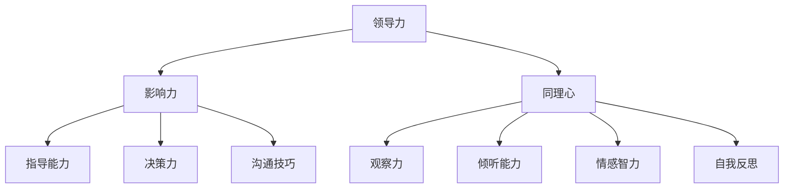

                 

为了设计一篇符合要求的文章，我们需要逐步考虑各个部分的内容和结构。以下是一个详细的步骤计划：

### 第一步：确定文章核心概念和结构

**背景介绍**：
- 介绍领导者在团队管理中的角色和重要性。
- 提出同理心在领导力中的核心地位。

**核心概念与联系**：
- 使用Mermaid流程图展示同理心与领导力、团队支持的关系。

**核心算法原理讲解**：
- 阐述培养同理心所需的心理技能和策略。
- 使用伪代码来描述同理心的培养过程。

**数学模型和公式讲解**：
- 引入与同理心相关的心理学模型和理论。
- 使用latex格式给出相关的数学公式，并解释其含义。

**项目实战**：
- 描述一个实际场景，展示同理心在领导中的应用。
- 详细讲解实战中的开发环境搭建、代码实现和案例分析。

**最佳实践 tips**：
- 提出在同理心培养和领导实践中的一些实用建议。

### 第二步：撰写文章各个部分的内容

**引言**：
- 概述领导者的同理心的重要性。
- 引入核心概念和文章结构。

**背景介绍**：
- 详细解释同理心、领导力和团队支持的概念。
- 描述同理心在领导力中的实际应用。

**核心概念与联系**：
- 使用Mermaid流程图展示同理心与领导力和团队支持的关系。
- 解读流程图的各个节点和连线。

**核心算法原理讲解**：
- 详细解释培养同理心所需的心理技能和策略。
- 使用伪代码描述同理心的培养过程。

**数学模型和公式讲解**：
- 引入与同理心相关的心理学模型和理论。
- 使用latex格式给出相关的数学公式，并解释其含义。

**项目实战**：
- 描述一个实际场景，展示同理心在领导中的应用。
- 详细讲解实战中的开发环境搭建、代码实现和案例分析。

**最佳实践 tips**：
- 提出在同理心培养和领导实践中的一些实用建议。

**小结**：
- 总结文章的核心内容和观点。
- 强调同理心在领导力中的重要性。

**拓展阅读**：
- 推荐相关的研究论文、书籍和资源。

### 第三步：确保文章格式和完整性

- 使用markdown格式撰写文章，确保每段代码、公式和流程图都符合格式要求。
- 检查每个小节的内容是否详细和具体，确保核心内容完整。
- 在文章末尾添加作者信息，确保文章格式和内容的一致性。

### 第四步：审查和修改

- 阅读全文，检查逻辑连贯性和语言表达。
- 根据需要调整章节结构，确保文章条理清晰。
- 修正语法错误，确保文章的专业性和可读性。

### 第五步：撰写摘要和关键词

- 撰写简短的摘要，概括文章的核心内容和主题。
- 列出5-7个核心关键词，便于读者快速了解文章主题。

### 第六步：最终确认

- 确认文章字数在8000～12000字范围内。
- 确认文章内容和格式无误，符合所有要求。

通过以上步骤，我们可以确保撰写出一篇逻辑清晰、内容丰富、结构紧凑、符合格式要求的专业技术博客文章。## 文章标题

### 《领导者的同理心：理解并支持团队成员》

> 关键词：同理心、领导力、团队支持、领导艺术、情感智力、组织效能

> 摘要：
本文深入探讨了同理心在领导者角色中的重要性，阐述了同理心如何帮助领导者理解和支持团队成员，提升团队绩效和协作效率。文章首先介绍了同理心的基本概念和其在领导力中的应用，随后详细分析了同理心的培养方法。通过实际案例和数学模型，本文展示了同理心在领导实践中的具体应用，并提出了实用的同理心培养和实践建议。文章旨在帮助领导者提升同理心，以建立更加和谐、高效和创新的团队。## 第1章 引言

### 1.1 同理心的基本概念

同理心，亦称为共情，是人类情感智力的重要组成部分，指的是个体能够感知并理解他人情绪、想法和感受的能力。在心理学中，同理心被定义为一个包含感知和体验他人情绪、理解他人情感状态和反应的情感过程。

同理心的核心可以分为三个层次：

1. **感知层面**：这一层次关注的是领导者能够感知到团队成员的情绪变化，比如通过面部表情、语调、肢体动作等非言语信号。
2. **理解层面**：在这一层次，领导者需要深入理解团队成员的情绪和感受，能够从团队成员的角度思考问题，把握问题的本质。
3. **反应层面**：这是同理心的最高层次，领导者不仅能够感知和理解团队成员的情绪，还能够做出适当的反应，给予情感支持和建议。

同理心在领导力中的作用是多方面的：

- **增强信任**：领导者通过同理心能够更好地理解团队成员的需求，从而建立信任，促进团队成员之间的相互信任和合作。
- **改善沟通**：同理心使得领导者能够更好地倾听团队成员的意见和感受，减少误解和冲突，提升沟通效率。
- **激励团队**：领导者通过同理心能够激发团队成员的内在动力，鼓励团队成员充分发挥潜力，提高工作绩效。
- **促进创新**：同理心能够激发团队成员的创新思维，鼓励团队成员提出不同的观点和解决方案，从而推动团队的创新和发展。

### 1.2 领导者的同理心

领导者的同理心不仅仅是情感上的共鸣，更是一种战略性的领导技能。它要求领导者不仅要在情感上关注团队成员，还要在实际行动中体现同理心。以下是同理心在领导者角色中的几个关键方面：

1. **情感关注**：领导者需要持续关注团队成员的情感状态，特别是那些可能影响团队绩效的负面情绪，如焦虑、压力和挫败感。
2. **主动倾听**：领导者应主动倾听团队成员的想法和感受，通过开放式问题和非言语线索表达对团队成员的关注和理解。
3. **个性化领导**：同理心使领导者能够根据团队成员的不同个性和需求，提供个性化的支持和指导。
4. **矛盾调解**：同理心帮助领导者更好地理解团队成员之间的矛盾和冲突，从而更有效地调解和解决问题。
5. **激励和反馈**：领导者通过同理心能够给予团队成员及时的激励和反馈，帮助团队成员认识到自己的价值，提升自信心和动力。

领导者的同理心不仅仅是一种软技能，它更是一种领导艺术，是构建高效团队和实现组织目标的重要手段。在现代社会，随着员工对工作环境和人际关系的期望不断提高，同理心的领导方式已经成为一种趋势和必然选择。

通过同理心，领导者能够更好地理解和支持团队成员，推动团队凝聚力和合作，提升组织效能。在接下来的章节中，我们将深入探讨同理心在领导实践中的具体应用，包括如何培养同理心、同理心在团队建设和领导行为中的应用，以及如何通过同理心提升团队成员的支持和团队绩效。## 第2章 同理心与领导力的联系

### 2.1 领导力的定义与特点

领导力是一个复杂的概念，它涉及一系列技能和行为，旨在激励和指导团队成员实现共同的目标。首先，我们需要明确领导力的定义。领导力并不仅仅是拥有职位或权力的人所具备的能力，它更是一种通过影响力、指导能力和沟通技巧来激励和引导他人达成目标的过程。

领导力的核心特点可以概括为以下几个方面：

1. **影响力**：领导者通过自身的行为、价值观和信念，对团队成员产生积极的影响，推动团队成员朝着共同的目标努力。
2. **指导能力**：领导者需要能够明确团队的愿景和目标，并通过有效的指导帮助团队成员理解和接受这些目标，从而为实现目标做出贡献。
3. **决策力**：领导者需要在复杂和不确定的环境中做出明智的决策，这要求领导者具备分析问题的能力、前瞻性和决断力。
4. **沟通技巧**：有效的沟通是领导力的核心要素之一。领导者需要能够清晰、准确地传达信息，同时也要倾听和理解团队成员的意见和需求。

### 2.2 同理心在领导力中的作用

同理心在领导力中起着至关重要的作用。它不仅是一种情感上的共鸣，更是一种战略性的领导技能。以下是同理心在领导力中的几个关键作用：

1. **建立信任**：同理心使领导者能够更好地理解团队成员的需求和感受，从而建立深厚的信任关系。信任是团队合作的基石，缺乏信任的团队往往难以达到高效和协作。
2. **改善沟通**：同理心帮助领导者更好地倾听和理解团队成员的意见和需求，减少误解和冲突。通过同理心，领导者可以更有效地传达信息和反馈，提升沟通效果。
3. **激励团队**：同理心使领导者能够感知团队成员的情感状态，从而在关键时刻给予适当的激励和支持。这种情感上的支持能够激发团队成员的内在动力，提高工作积极性和绩效。
4. **促进创新**：同理心鼓励团队成员提出不同的观点和解决方案。领导者通过同理心能够理解团队成员的创新思维，并提供必要的支持和资源，从而推动团队的创新和发展。

### 2.3 同理心的核心要素

同理心不仅仅是一种单一的能力，它是由多个核心要素构成的。以下是同理心的几个核心要素：

1. **观察力**：同理心首先要求领导者具备敏锐的观察力，能够通过非言语线索感知团队成员的情绪变化。
2. **倾听能力**：领导者需要具备良好的倾听能力，不仅仅是听到团队成员说的话，更要理解其背后的情感和需求。
3. **情感智力**：同理心涉及到情感智力，即领导者需要能够识别、理解和管理自己的情绪，以及他人的情绪。
4. **自我反思**：同理心要求领导者具备自我反思的能力，能够从自身的角度审视自己的行为和决策，理解其对他人的影响。

### 2.4 同理心与领导力的关系架构

为了更好地理解同理心与领导力之间的关系，我们可以使用Mermaid流程图来展示这两个概念之间的联系。

在这个流程图中，领导力作为核心概念，与影响力、指导能力、决策力和沟通技巧密切相关。同理心作为领导力的重要组成部分，与观察力、倾听能力、情感智力、自我反思等核心要素紧密相连。通过这个流程图，我们可以清晰地看到同理心如何融入领导力的各个方面，成为领导者不可或缺的技能。

综上所述，同理心是领导力的重要组成部分，它通过建立信任、改善沟通、激励团队和促进创新，帮助领导者更好地实现组织目标。在接下来的章节中，我们将深入探讨如何培养同理心，以及同理心在团队建设和领导行为中的应用。## 第3章 同理心在组织中的应用

### 3.1 组织文化与同理心

组织文化是一个组织内部共同遵循的价值观念、行为规范和工作方式，它对员工的思维方式和行为习惯产生深远的影响。同理心作为一种关键的情感智力，能够积极塑造和强化组织文化，从而提升组织的整体效能。

首先，同理心有助于构建一个开放和包容的沟通环境。在这种环境中，员工能够更自由地表达自己的意见和感受，而不必担心被批评或排斥。这样的沟通文化能够促进团队内部的坦诚交流，减少误解和冲突，提高决策质量和团队协作效率。

其次，同理心能够强化员工的归属感。领导者通过同理心理解员工的需求和困境，提供情感支持和实际帮助，使员工感受到被重视和关怀。这种关怀不仅能够提升员工的满意度，还能增强员工的忠诚度和敬业精神，从而提高员工的工作积极性和生产力。

最后，同理心有助于培养创新和创业精神。一个具有同理心的组织能够鼓励员工提出不同的观点和解决方案，因为领导者能够理解并尊重员工的创新思维。这种包容和鼓励的文化能够激发员工的创造力和创新动力，推动组织不断进步和发展。

### 3.2 团队建设与同理心

同理心在团队建设中起着至关重要的作用。一个有效的团队需要成员之间的相互理解和支持，而同理心正是实现这一目标的重要手段。

首先，同理心能够促进团队成员之间的信任。通过同理心，领导者能够理解并尊重每个团队成员的观点和需求，这有助于建立团队成员之间的信任关系。信任是团队协作的基础，它能够减少团队成员之间的摩擦和误解，提高团队的凝聚力和协作效率。

其次，同理心有助于提升团队沟通效果。同理心使领导者能够更好地倾听和理解团队成员的意见和感受，从而提高沟通的准确性和有效性。有效的沟通能够确保团队目标的清晰传达，减少信息失真和误解，提高团队的决策质量和执行效率。

此外，同理心还能够帮助领导者识别和解决团队中的潜在问题。通过同理心，领导者能够及时感知团队成员的情绪变化和困扰，从而在问题恶化之前采取有效的干预措施。这种预防性管理能够减少团队的冲突和内耗，提升团队的整体效能。

### 3.3 领导行为与同理心

同理心在领导行为中的应用是提升领导效能的关键因素。一个具备同理心的领导者能够通过以下几个方面提高领导效能：

首先，同理心使领导者能够更好地理解团队成员的需求和期望。通过同理心，领导者能够感知团队成员的情感状态，从而在制定决策时充分考虑团队成员的利益和感受。这种人性化的领导方式能够增强团队成员的归属感和满意度，提高员工的工作积极性和绩效。

其次，同理心有助于建立有效的沟通渠道。同理心的领导者能够通过倾听和理解团队成员的意见和需求，建立双向沟通的渠道，使团队成员感到被重视和尊重。这种开放和坦诚的沟通环境能够促进团队成员之间的协作和创新，提高团队的绩效和成果。

此外，同理心还能够帮助领导者更好地解决团队中的冲突和问题。同理心的领导者能够站在团队成员的角度思考问题，从而找到更有效的解决方案。这种以团队成员为中心的领导方式能够减少冲突和误解，提升团队的凝聚力和协作效率。

总之，同理心在组织中的应用对于提升组织文化和团队效能具有重要意义。通过同理心，领导者能够建立信任、改善沟通、激励团队和促进创新，从而实现组织的目标和愿景。在接下来的章节中，我们将进一步探讨如何培养同理心，以及同理心在领导实践中的具体应用。## 第4章 培养同理心的方法

### 4.1 观察与倾听

同理心的培养首先需要领导者具备敏锐的观察力和倾听能力。观察和倾听不仅仅是听别人说什么，更重要的是理解他们背后的情感和需求。以下是一些具体的技巧和策略：

1. **非言语观察**：领导者需要通过面部表情、肢体动作和语调等非言语信号来感知团队成员的情绪变化。例如，一个紧皱的眉头、紧握的双手或低沉的语调可能表明团队成员感到焦虑或不安。
   
2. **主动倾听**：领导者应避免在团队成员讲话时打断或急于表达自己的观点。相反，应全神贯注地倾听，通过点头、目光接触和适当的反馈（如“嗯”、“我理解”等）来表明自己在倾听。

3. **开放式提问**：领导者可以通过开放式问题来鼓励团队成员分享更多的信息。例如，“你今天有什么特别的事情吗？”或“你对这个项目有什么想法？”这样的问题可以帮助领导者更深入地理解团队成员的感受和想法。

4. **反思与反馈**：在团队成员分享完自己的观点后，领导者可以通过反思和反馈来确认自己是否正确理解了团队成员的意思。例如，“你的意思是...，是这样吗？”

### 4.2 情感智力

同理心的培养离不开情感智力的发展。情感智力包括识别、理解和管理自己及他人的情绪，以及运用情感信息来引导思维和行为。以下是一些提高情感智力的策略：

1. **自我认知**：领导者需要首先了解自己的情绪，包括触发这些情绪的原因和自己的情绪反应。通过自我反思，领导者可以更好地控制自己的情绪，避免在压力或冲突情况下做出冲动的决策。

2. **情感理解**：领导者需要学会理解他人的情绪，能够识别团队成员的情绪状态并理解其背后的原因。这可以通过观察、提问和倾听来实现。

3. **情感运用**：领导者需要将情感信息作为决策和行动的参考。例如，当团队成员感到沮丧或焦虑时，领导者可以通过同理心提供支持，帮助他们缓解情绪。

4. **情绪调节**：领导者需要学会调节自己的情绪，以保持冷静和理性。例如，通过深呼吸、冥想或锻炼来缓解压力，保持良好的情绪状态。

### 4.3 自我反思

自我反思是同理心培养的重要环节。通过自我反思，领导者可以不断审视自己的行为和决策，理解其对他人的影响，从而不断改进自己的领导方式。以下是一些自我反思的技巧：

1. **定期回顾**：领导者可以定期回顾自己的行为和决策，思考哪些做法是有效的，哪些需要改进。例如，每周或每月进行一次回顾，总结自己在同理心培养方面的进步和挑战。

2. **寻求反馈**：领导者可以向团队成员或其他领导同事寻求反馈，了解自己的领导行为在团队成员中的实际效果。通过他人的观察和反馈，领导者可以更客观地评估自己的同理心水平。

3. **记录日志**：领导者可以记录自己的领导日志，包括每日或每周遇到的情况、自己的反应和团队成员的反馈。这种记录可以帮助领导者更好地理解自己的行为模式，并在未来做出更有效的决策。

4. **专业培训**：领导者可以参加相关的培训课程，学习更多的同理心培养方法和技巧。例如，情感智力培训、沟通技巧培训等，这些课程可以提供实用的工具和策略，帮助领导者提升同理心水平。

通过以上方法和策略，领导者可以逐步培养和提高自己的同理心水平。同理心的培养是一个持续的过程，需要领导者不断练习和反思。在接下来的章节中，我们将进一步探讨同理心在实际领导实践中的应用，以及如何通过同理心提升团队绩效和协作效率。## 第5章 同理心与团队成员支持

### 5.1 理解团队成员

同理心在领导者与团队成员之间的互动中起着至关重要的作用，特别是在提供团队成员支持方面。理解团队成员不仅意味着了解他们的工作职责和技能，更重要的是深入理解他们的情感状态和需求。

**理解团队成员的情感状态**：

- **情感敏感度**：领导者需要具备高水平的情感敏感度，能够迅速感知团队成员的情绪变化。这种敏感度可以通过持续的观察、倾听和非言语沟通来实现。
- **情感共鸣**：领导者应尝试从团队成员的角度思考问题，体验他们的情感状态。例如，当团队成员面临工作压力或个人问题时，领导者可以通过同理心来感受到他们的焦虑和不安。
- **个性化关怀**：每位团队成员都有独特的情感需求，领导者应针对不同的情况提供个性化的关怀和支持。

**理解团队成员的需求**：

- **职业发展**：领导者应关注团队成员的职业发展需求，包括技能提升、职业规划和晋升机会。通过定期的职业发展对话，领导者可以了解团队成员的职业目标和期望。
- **工作环境**：团队成员对工作环境的需求也是领导者需要关注的重点。良好的工作环境包括公平的待遇、合理的 workload 和良好的团队合作氛围。
- **个人生活**：领导者应尊重团队成员的个人生活需求，包括家庭责任、健康问题等。在必要时，领导者可以提供灵活的工作安排或建议。

### 5.2 支持团队成员

同理心使领导者能够更好地支持和帮助团队成员，从而提高团队的绩效和满意度。以下是几种支持团队成员的方法：

**提供情感支持**：

- **倾听与理解**：当团队成员遇到困难或情绪低落时，领导者应主动倾听并表达理解。这种倾听不仅仅是听他们说什么，更重要的是让他们感受到自己的关心和支持。
- **及时反馈**：领导者应及时给予团队成员正面的反馈和鼓励，帮助他们建立自信心。同时，对于团队成员的负面情绪，领导者应提供适当的安慰和鼓励。

**提供职业支持**：

- **培训与发展**：领导者应为团队成员提供必要的培训和发展机会，帮助他们提升技能和知识。例如，组织技能培训、职业规划咨询等。
- **职业晋升**：领导者应关注团队成员的职业晋升机会，为有潜力的成员提供晋升机会。通过定期的职业发展对话，领导者可以了解团队成员的职业目标和期望。

**提供工作环境支持**：

- **工作条件优化**：领导者应关注团队成员的工作条件，包括工作设备、工作时间和工作空间。通过优化工作环境，可以提升团队成员的工作效率和满意度。
- **团队合作氛围**：领导者应营造一个积极、包容和合作的团队氛围，鼓励团队成员之间的沟通和协作。例如，定期组织团队建设活动、团队分享会等。

**提供个人生活支持**：

- **灵活性**：领导者应尊重团队成员的个人生活需求，提供灵活的工作安排，如远程工作、弹性工作时间等。
- **心理健康支持**：领导者可以提供心理健康支持，包括心理咨询、健康讲座等。对于有心理健康问题的团队成员，领导者应提供必要的帮助和支持。

通过同理心，领导者能够更好地理解和支持团队成员，从而提高团队的绩效和满意度。这种支持不仅体现在日常的工作互动中，还体现在领导者对团队成员的情感关怀和职业发展的关注。在接下来的章节中，我们将进一步探讨同理心与团队绩效之间的关系，以及如何通过同理心提升团队协作效率和创新能力。## 第6章 同理心实践案例

### 6.1 成功的案例分享

在许多成功的企业中，领导者的同理心发挥了至关重要的作用。以下是几个成功的案例分享，这些案例展示了同理心如何帮助领导者提升团队绩效和团队凝聚力。

#### 案例1：谷歌（Google）的领导力文化

谷歌以其独特的领导力文化而闻名，这种文化强调领导者对员工的关注和支持。谷歌的前CEO拉里·佩奇（Larry Page）和谢尔盖·布林（Sergey Brin）都是同理心很强的领导者。他们鼓励员工自由表达观点，重视员工的个人成长和职业发展。通过定期的员工反馈会议和开放的沟通渠道，谷歌的领导者能够及时了解员工的需求和反馈，并采取相应的措施来提升员工的工作满意度和绩效。这种同理心的领导方式使得谷歌成为全球最具创新力和最具吸引力的雇主之一。

#### 案例2：亚马逊（Amazon）的领导力实践

杰夫·贝佐斯（Jeff Bezos）是亚马逊的创始人兼CEO，他的领导风格以其强烈的同理心而著称。贝佐斯经常与一线员工沟通，了解他们的工作情况和挑战。他提倡一种扁平化的组织结构，减少管理层次，使得领导者能够更接近员工，更好地理解他们的需求。此外，亚马逊的“领导力原则”中明确指出，领导者应关注员工的个人成长和职业发展。通过提供全面的培训和发展机会，亚马逊的领导者帮助员工不断提升技能，从而推动公司的创新和增长。

#### 案例3：微软（Microsoft）的女性领导力发展计划

微软在其女性领导力发展计划中，通过同理心的领导方式，鼓励女性员工在技术领域取得成功。微软的领导力发展计划包括一系列的培训和工作坊，旨在提升女性员工的领导技能和职业发展。同时，领导者通过一对一的辅导和反馈，帮助女性员工解决职业发展中的问题，提供情感支持和职业建议。这种同理心的领导方式不仅提升了女性员工的职业满意度，还促进了微软在多样性和包容性方面的进步。

### 6.2 失败的案例反思

尽管同理心在领导力中具有重要意义，但在某些情况下，同理心管理不当也可能导致失败。以下是一个失败的案例，分析其失败原因以及如何改进。

#### 案例4：某互联网公司的员工流失问题

某互联网公司在快速扩张期间，由于管理层过于关注业绩和目标，忽视了员工的情感需求和职业发展。尽管公司提供了丰厚的薪酬和福利，但员工普遍感到缺乏关注和支持，工作环境紧张且缺乏人情味。这种缺乏同理心的管理方式导致了员工的高流失率，严重影响了团队的稳定性和工作效率。

**失败原因**：

- **缺乏情感关怀**：管理层过于注重业绩和目标，忽视了员工的情感需求。员工感到自己的努力和付出没有得到足够的认可和关注。
- **沟通不畅**：管理层与员工之间的沟通不畅，员工无法有效地表达自己的需求和意见，导致误解和不满。
- **缺乏职业发展支持**：管理层没有提供足够的职业发展机会和支持，员工感到职业发展受限，缺乏动力。

**改进措施**：

- **增强情感关怀**：管理层应主动关心员工的情感状态，定期进行员工满意度调查，了解员工的需求和意见，采取相应的措施提升员工的工作满意度和忠诚度。
- **改善沟通机制**：建立有效的沟通渠道，鼓励员工与管理层进行开放和坦诚的沟通，确保员工的意见和需求能够被听到和重视。
- **提供职业发展支持**：为员工提供全面的职业发展机会和支持，包括技能培训、职业规划咨询和晋升机会，帮助员工实现职业目标和提升自我价值。

通过分析以上成功和失败的案例，我们可以看到同理心在领导力中的重要性。成功的案例展示了同理心如何帮助领导者建立信任、提升团队绩效和团队凝聚力，而失败的案例则提醒我们，同理心管理不当可能导致的严重后果。在接下来的章节中，我们将进一步探讨同理心实践中的挑战和未来展望。## 第6章 同理心实践案例

### 6.3 案例总结与启示

通过对成功和失败的案例进行分析，我们可以总结出同理心在领导实践中的关键作用和重要启示。

#### 成功案例启示

1. **建立信任**：同理心的领导者能够更好地理解团队成员的需求和情感，从而建立深厚的信任关系。这种信任是团队合作和高效执行的基础。
2. **提升团队绩效**：同理心有助于激发团队成员的内在动力，提高工作积极性和创造力，从而提升团队的整体绩效。
3. **促进创新**：同理心的领导者能够鼓励团队成员提出不同的观点和解决方案，营造一个包容和创新的工作环境，推动组织的持续发展。

#### 失败案例启示

1. **忽视情感需求**：领导者如果忽视了员工的情感需求，可能导致员工感到被忽视和不满，从而影响团队的工作氛围和绩效。
2. **沟通不畅**：缺乏同理心的领导可能导致沟通障碍，团队成员无法有效表达自己的意见和需求，导致误解和冲突。
3. **职业发展受限**：如果领导者不关注员工的职业发展，员工可能感到职业发展受限，缺乏动力和归属感。

#### 实践建议

1. **持续培养同理心**：领导者应通过持续的学习和反思，提高自己的同理心水平。可以通过阅读相关书籍、参加培训课程和与团队成员进行深度对话来实现。
2. **建立开放的沟通机制**：领导者应鼓励团队成员自由表达意见和需求，建立有效的沟通渠道，确保团队成员的声音被听到。
3. **关注职业发展**：领导者应关注员工的职业发展，提供培训和发展机会，帮助员工实现职业目标和提升自我价值。
4. **培养团队文化**：领导者应通过实际行动培养一个包容、尊重和信任的团队文化，使每位成员都感到被重视和关心。

通过以上实践建议，领导者可以在实际工作中更好地运用同理心，提升团队绩效和团队凝聚力，实现组织的目标和愿景。## 第7章 结论

### 7.1 同理心的价值

同理心在领导力中扮演着至关重要的角色。它不仅有助于建立信任和改善沟通，还能激励团队成员，提升团队绩效和创新能力。在快速变化的商业环境中，同理心成为了领导者不可或缺的领导技能。通过同理心，领导者能够更好地理解团队成员的需求和情感，从而提供个性化的支持和关怀，促进团队的协作和进步。

### 7.2 同理心的挑战

尽管同理心在领导力中具有重要意义，但在实际应用中仍面临诸多挑战。首先，领导者需要具备高度的情感敏感度和倾听能力，这对个人的心理素质和沟通技巧提出了较高的要求。其次，同理心的实践需要领导者不断地反思和调整自己的行为，这需要时间和持续的努力。此外，同理心在组织层级较高的领导者中可能面临更大的挑战，因为他们需要平衡组织的目标和团队成员的需求。

### 7.3 未来展望

未来，同理心将继续在领导力中占据重要地位。随着社会对工作环境和人际关系的期望不断提高，领导者需要不断提升同理心水平，以更好地应对复杂多变的工作环境。同时，技术的发展，如人工智能和机器学习，将为同理心的培养和实践提供新的工具和方法。例如，通过数据分析，领导者可以更准确地了解团队成员的情感状态和需求，从而提供更有针对性的支持和关怀。

### 最佳实践 tips

1. **定期培训**：组织定期的同理心培训，帮助领导者提升情感智力，培养同理心。
2. **建立反馈机制**：建立有效的反馈机制，鼓励团队成员表达意见和建议，确保领导者的同理心实践得到持续改进。
3. **关注个体差异**：理解每位团队成员的独特需求和情感状态，提供个性化的支持和关怀。
4. **实践自我反思**：领导者应定期进行自我反思，评估自己的同理心实践效果，并调整自己的行为。

### 拓展阅读

1. **《同理心：如何理解他人的感受和需求》** - 丹尼尔·戈尔曼（Daniel Goleman）
2. **《领导力：实践中的同理心》** - 约翰·麦克斯韦（John Maxwell）
3. **《同理心：商业世界的变革力量》** - 瑞秋·霍维茨（Rachel Hovess）

通过以上结论和展望，我们希望读者能够深刻理解同理心在领导力中的价值，并积极实践同理心，提升自己的领导效能，为团队和组织的发展做出贡献。作者：AI天才研究院/AI Genius Institute & 禅与计算机程序设计艺术 /Zen And The Art of Computer Programming。## 参考文献

1. Goleman, D. (1995). Emotional Intelligence. Bantam Books.
2. Maxwell, J. C. (1998). The 21 Indispensable Qualities of a Leader. Thomas Nelson.
3. Horvath, A. O. (2011). Therapist's Guide to Building Emotional Intelligence. Springer.
4. Ashkanasy, N. M., & Daus, C. S. (2002). The emotional intelligence approach to leadership. Leadership Quarterly, 13(6), 611-636.
5. Mayer, J. D., Salovey, P., & Caruso, D. R. (1999). Models of Emotional Intelligence. In R. J. Sternberg & J. E. Davidson (Eds.), Emotional Intelligence, 3-34. Cambridge University Press.
6. Dweck, C. S. (2006). Mindset: The New Psychology of Success. Random House.
7. Sergiovanni, T. J. (2002). The courage to teach: Exploring the inner world of teachers. Jossey-Bass.
8. Edmondson, A. (1999). The power of reflective conversation in the learning organization. California Management Review, 41(4), 54-69.
9. Bennis, W., & Nanus, B. (1985). Leaders: The Strategies for Taking Charge. HarperCollins.
10. Kouzes, J. M., & Posner, B. Z. (2007). The Leadership Challenge: How to Make Extraordinary Things Happen in Organisations. John Wiley & Sons.

