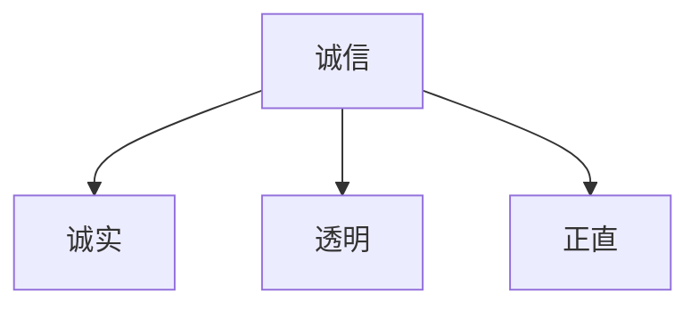
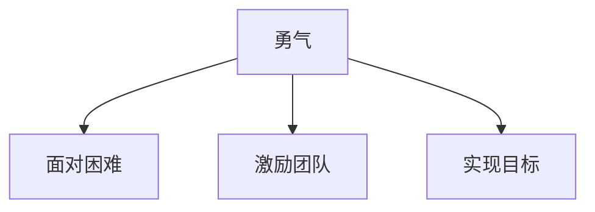
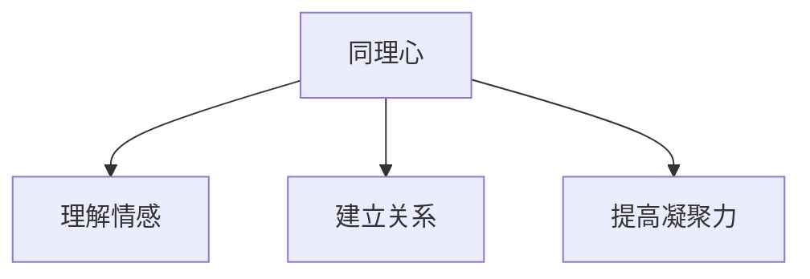
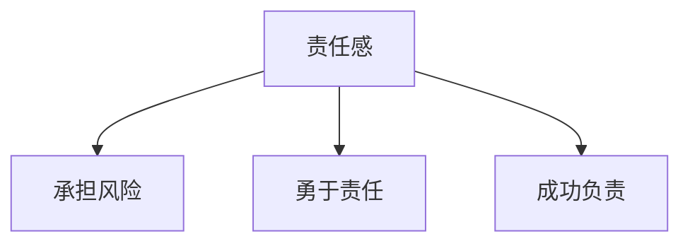
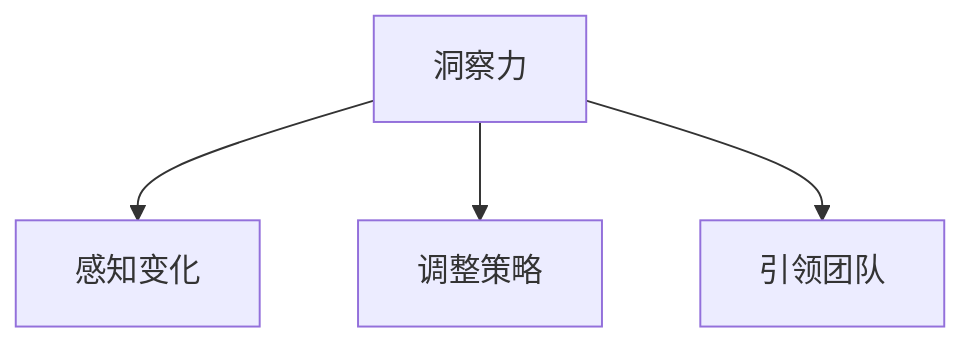

                 

### 文章标题：领导者的品格塑造：赢得团队尊重与信任

### 关键词：领导者，品格，团队，尊重，信任，塑造

### 摘要：
领导者是团队的核心，他们的品格直接影响团队的凝聚力和绩效。本文通过深入剖析领导者的品格定义与重要性，探讨诚信、勇气、同理心、责任感和洞察力等核心要素，并提供一系列策略与方法，帮助领导者塑造赢得团队尊重与信任的品格。通过实际案例分析和实践指南，本文旨在为领导者提供实用的品格修炼之路。

---

### 第一部分：领导者品格概述

#### 1.1 领导者的品格定义与重要性

领导者品格是指领导者通过行为和态度所展现出的价值观、道德观和行为准则。品格不仅是个人素质的体现，更是领导者影响力的基础。领导者品格的重要性在于：

- **增强领导效能**：良好的品格有助于提升领导者的决策质量，增强团队的执行力，从而提高整体绩效。
- **建立团队信任**：品格正直、有责任心和同理心的领导者更容易赢得团队的信任和尊重，形成良好的团队文化。
- **促进个人成长**：领导者品格塑造是一个不断自我完善的过程，有助于领导者实现自我超越，提升个人影响力。

#### 1.2 领导者的品格核心要素

领导者的品格核心要素包括诚信、勇气、同理心、责任感和洞察力。这些要素相互作用，共同构成了领导者的品格基础。

##### 1.2.1 诚信

诚信是领导者的基石。它包括诚实、透明和正直。诚信的领导者能够建立信任，促进团队协作。

##### 1.2.2 勇气

勇气是指领导者面对困难和挑战时的决心和毅力。勇敢的领导者能够激励团队克服困难，实现目标。

##### 1.2.3 同理心

同理心是领导者理解并感受团队成员情感的能力。同理心的领导者能够建立紧密的团队关系，提高团队凝聚力。

##### 1.2.4 责任感

责任感是领导者对团队和组织成功负责的态度。有责任感的领导者能够承担风险，勇于承担责任。

##### 1.2.5 洞察力

洞察力是领导者对环境变化和团队动态的敏锐感知能力。有洞察力的领导者能够及时调整策略，引领团队走向成功。

#### 1.3 领导者的品格与团队绩效的关系

领导者的品格直接影响团队绩效。良好的品格能够：

- **提高团队凝聚力**：信任和尊重是团队凝聚力的重要基石。
- **增强团队执行力**：领导者品格的正面影响能够增强团队的执行力和工作效率。
- **促进创新和成长**：开放和透明的领导者能够激发团队成员的创新思维，推动团队成长。

### 第二部分：品格塑造的策略与方法

#### 2.1 自我认知与自我反思

自我认知是领导者品格塑造的第一步。领导者需要通过自我反思，认识自己的优点和不足，并制定改进计划。

##### 2.1.1 自我认知的方法

- **反馈法**：收集团队成员和上级的反馈，了解自己的表现。
- **日记法**：定期记录自己的行为和思考，反思自己的行为模式。
- **比较法**：与其他优秀的领导者进行比较，找到自己的不足。

##### 2.1.2 自我反思的重要性与实践

自我反思能够帮助领导者：

- **提高自我认知**：通过反思，领导者可以更清楚地了解自己的行为和动机。
- **发现并解决问题**：领导者可以通过反思，发现并解决团队和自身的潜在问题。
- **持续改进**：自我反思是一个持续的过程，有助于领导者不断提升自己的品格。

### 第三部分：实际案例分析

#### 3.1 成功的领导品格塑造案例

成功案例一：**乔布斯与苹果公司的领导品格塑造**

乔布斯以他的创新精神和严格的道德标准，塑造了苹果公司的领导品格。他的诚信、勇气和责任感赢得了员工的尊重和信任，推动了苹果公司的持续创新和成功。

成功案例二：**谷歌的领导品格塑造**

谷歌以其开放的文化和卓越的领导力著称。领导者通过培养同理心和洞察力，建立了高度凝聚力的团队，推动了公司的持续成长。

#### 3.2 失败的领导品格塑造案例

失败案例一：**泰坦尼克号船长的领导品格缺陷**

泰坦尼克号船长的决策失误和缺乏责任感导致了悲剧的发生。他的领导品格缺陷暴露了领导者在危机管理中的不足。

失败案例二：**宝洁公司高管的领导品格问题**

宝洁公司的高管因道德问题引发了一系列危机，损害了公司的声誉和团队士气。这表明领导品格的缺失会导致严重的后果。

### 第四部分：品格塑造实践指南

#### 4.1 品格塑造的实践步骤

##### 4.1.1 制定个人品格提升计划

- **确定目标**：明确提升品格的具体目标。
- **制定计划**：制定具体的行动计划，包括学习、实践和反思。

##### 4.1.2 实践与反思

- **实践**：通过实际行动，践行品格提升计划。
- **反思**：定期反思自己的行为和决策，评估提升效果。

##### 4.1.3 评估与调整

- **评估**：定期评估品格提升的进展。
- **调整**：根据评估结果，调整提升计划，确保持续改进。

### 第五部分：领导者的品格修炼

#### 5.1 品格修炼的重要性

品格修炼是领导者个人成长的必要过程。它有助于：

- **提升领导力**：品格修炼能够增强领导者的决策能力和影响力。
- **实现自我超越**：通过品格修炼，领导者可以实现自我提升，成为更优秀的领导者。

#### 5.2 品格修炼的方法与技巧

##### 5.2.1 阅读与学习

阅读和学习是品格修炼的重要途径。领导者可以通过阅读相关书籍和文章，学习优秀的领导经验。

##### 5.2.2 模仿与反思

领导者可以模仿优秀的领导者，并反思自己的行为和决策，从而提升自己的品格。

##### 5.2.3 挑战与超越

领导者需要勇于面对挑战，通过挑战自己，实现品格的进一步提升。

### 第六部分：领导者的品格塑造之路

#### 6.1 品格塑造的长期过程

品格塑造是一个长期的过程，需要领导者持续的努力和自我提升。

##### 6.1.1 品格塑造的挑战

品格塑造面临诸多挑战，如自我认知的困难、实践中的阻力等。

##### 6.1.2 品格塑造的成果

品格塑造能够为领导者带来长期的收益，如提升领导力、赢得团队尊重等。

#### 6.2 品格塑造的未来趋势

随着社会环境的变化，品格塑造在未来将面临新的挑战和机遇。

##### 6.2.1 企业对领导品格的要求

企业对领导品格的要求将越来越高，强调领导者的道德责任和社会责任。

##### 6.2.2 社会对领导品格的期待

社会对领导品格的期待将更加多元化，要求领导者具备全球视野和跨文化领导能力。

---

### 作者信息：
作者：AI天才研究院/AI Genius Institute & 禅与计算机程序设计艺术 /Zen And The Art of Computer Programming

