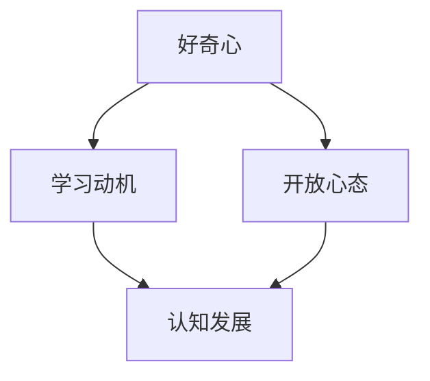

                 

### 文章标题：领导者的学习能力：保持好奇心和开放心态

在当今快速变化的技术和创新环境中，领导者不仅需要具备卓越的管理能力，还必须不断更新自己的知识库，以适应不断发展的市场需求。因此，学习能力成为领导者成功的关键因素之一。本文将探讨领导者在保持好奇心和开放心态方面的重要作用，并详细分析其背后的原理和实践方法。通过结合心理学、管理学和领导力理论，本文旨在为读者提供一套系统的学习和领导力提升策略。

### 文章关键词

- 领导者学习
- 好奇心
- 开放心态
- 领导力提升
- 心理学
- 管理学

### 摘要

本文从领导者的视角出发，探讨了在快速变化的时代中，保持好奇心和开放心态对于提升领导者学习能力的必要性。文章首先介绍了好奇心和开放心态的定义及其在领导者角色中的重要性，接着分析了心理学和管理学中的相关理论。随后，文章详细阐述了如何在实践中培养好奇心和开放心态，并通过具体案例展示了这些策略的有效性。最后，文章总结了领导者在不断学习中提升领导力的关键路径，并提出了对未来领导者学习趋势的展望。

## 第一部分：领导者的学习背景

### 1.1 领导者在学习中的角色

领导者不仅是团队的核心，也是组织变革的推动者。他们在学习中扮演着多重角色，包括知识的传授者、学习的促进者和学习的实践者。首先，领导者需要成为知识的传授者，将新的知识和理念传递给团队成员。其次，领导者应作为学习的促进者，创造一个鼓励学习、支持创新的组织环境。最后，领导者本身应作为学习的实践者，通过不断学习和实践，成为团队学习的榜样。

### 1.2 学习在领导者成功中的重要性

在复杂多变的市场环境中，领导者需要不断学习以应对新的挑战和机遇。学习不仅是个人成长的必要途径，也是组织持续发展的关键。首先，通过学习，领导者可以更新自己的知识体系，掌握最新的行业动态和技术趋势。其次，学习有助于领导者提升决策能力，更好地应对复杂的问题和挑战。最后，学习可以促进领导者的创新思维，推动组织的变革和发展。

### 1.3 学习的挑战与应对

尽管学习对领导者的重要性不言而喻，但在实践中，领导者面临着诸多挑战。首先，时间管理是一个重要问题。领导者需要在繁忙的工作中安排学习时间，确保学习的连续性和深度。其次，信息过载也是一个挑战。在信息爆炸的时代，领导者需要筛选和整合有用的信息，避免陷入信息噪音。最后，心态调整是学习的关键。领导者需要保持开放的心态，愿意接受新观念和新方法，以适应不断变化的环境。

## 第二部分：好奇心与领导者的学习

### 2.1 好奇心的定义与作用

好奇心是人类探索世界的重要驱动力。它促使人们主动探索未知领域，发现新的知识和机会。在领导者的角色中，好奇心扮演着至关重要的角色。首先，好奇心有助于领导者发现新的问题和机会，推动组织创新。其次，好奇心能够激发领导者的学习热情，促使他们不断探索和学习。最后，好奇心有助于领导者建立广泛的联系，促进跨学科和跨领域的合作。

### 2.2 好奇心在领导者学习中的作用

好奇心是领导者学习的重要动力。首先，好奇心促使领导者主动寻求新的知识和信息，不断更新自己的知识体系。其次，好奇心有助于领导者打破固有的思维模式，探索新的解决方案。最后，好奇心能够激发领导者的创造力和创新思维，推动组织的变革和发展。

### 2.3 培养好奇心的策略

领导者可以通过以下策略来培养好奇心：

1. **定期阅读**：领导者应保持阅读的习惯，特别是阅读与工作领域相关的书籍和文章，以扩展知识面。
2. **提问**：领导者应勇于提问，不仅是针对自己不理解的概念，也要对团队成员的工作提出质疑，以激发思考和讨论。
3. **跨学科学习**：领导者应尝试学习不同领域的知识，以培养跨学科的思维能力和创新意识。
4. **实践探索**：领导者应积极参与实践项目，通过实际行动探索新知识和新方法。

## 第三部分：开放心态与领导者的学习

### 3.1 开放心态的定义与作用

开放心态是指愿意接受新的观念、方法和信息，并对不同观点持包容和尊重的态度。在领导者的角色中，开放心态至关重要。首先，开放心态有助于领导者建立良好的团队关系，促进团队成员之间的沟通和协作。其次，开放心态能够提高领导者的决策质量，使他们能够更全面地考虑各种因素。最后，开放心态有助于领导者适应快速变化的环境，灵活应对各种挑战。

### 3.2 开放心态在领导者学习中的作用

开放心态是领导者学习的重要保障。首先，开放心态使领导者能够接受新的知识和观点，不断更新自己的知识体系。其次，开放心态有助于领导者打破思维定势，探索新的学习方法和策略。最后，开放心态能够激发领导者的创新思维，推动组织的变革和发展。

### 3.3 培养开放心态的策略

领导者可以通过以下策略来培养开放心态：

1. **主动学习**：领导者应主动寻求新的知识和信息，不断扩展自己的知识面。
2. **尊重多样性**：领导者应尊重团队成员的不同观点和意见，鼓励团队内部的多样性和创新。
3. **持续反思**：领导者应定期进行自我反思，分析自己的学习过程和决策方法，以发现改进的机会。
4. **积极参与**：领导者应积极参与各种学习活动，如研讨会、培训课程和行业交流，以扩展自己的视野。

## 第四部分：实践中的好奇心与开放心态

### 4.1 实践中的好奇心

在实践过程中，好奇心是领导者推动创新的重要动力。以下是一些实际案例：

- **案例一：谷歌的“20%时间”政策**：谷歌允许员工将20%的工作时间用于自己感兴趣的项目。这一政策激发了员工的好奇心和创新精神，推动了公司许多成功的产品和服务。
- **案例二：苹果公司的创新文化**：苹果公司注重培养员工的好奇心，鼓励他们提出新的想法并实践。这种开放的文化氛围促进了苹果公司持续的创新和成功。

### 4.2 实践中的开放心态

开放心态在领导者决策和团队管理中也起着重要作用。以下是一些实践中的例子：

- **案例一：维珍集团的多元化战略**：维珍集团的创始人理查德·布兰森以其开放心态著称，他愿意尝试不同领域和业务，这种开放心态帮助维珍集团在全球范围内取得成功。
- **案例二：IBM的转型**：在面临技术变革的挑战时，IBM的领导者通过开放心态，积极拥抱云计算和人工智能等新技术，成功地推动了公司的转型。

## 第五部分：领导者的学习路径

### 5.1 建立学习文化

领导者应致力于建立学习文化，激发团队成员的学习热情。具体策略包括：

1. **提供学习资源**：为员工提供丰富的学习资源和机会，如在线课程、研讨会和工作坊。
2. **鼓励分享**：鼓励员工分享学习经验和成果，促进知识和信息的流动。
3. **建立反馈机制**：建立有效的反馈机制，帮助员工及时了解自己的学习进展，并调整学习策略。

### 5.2 培养好奇心与开放心态

领导者应通过以下策略培养好奇心与开放心态：

1. **设定目标**：为员工设定具体的学习目标，激励他们探索新的知识和领域。
2. **提供支持**：为员工提供必要的支持和资源，帮助他们克服学习过程中的困难。
3. **鼓励尝试**：鼓励员工勇于尝试新方法和新技术，培养他们的创新精神。

### 5.3 持续学习与反思

领导者应保持持续学习的态度，通过反思和总结，不断提升自己的领导能力和管理水平。具体策略包括：

1. **定期反思**：定期回顾自己的学习过程和领导行为，分析成功和失败的原因。
2. **寻求反馈**：主动寻求团队成员和其他领导的反馈，以改进自己的学习和领导方法。
3. **学习新知识**：不断学习新的知识和技能，以适应不断变化的市场环境。

## 第六部分：未来领导者的学习趋势

### 6.1 技术变革的影响

随着技术的快速发展，未来领导者需要具备更强的技术能力和跨学科知识。例如，人工智能、大数据和区块链等技术将对领导者的决策和管理工作产生深远影响。

### 6.2 网络化学习的兴起

未来领导者将越来越多地通过网络平台进行学习，如在线课程、虚拟研讨会和社交媒体等。网络化学习将打破时间和空间的限制，使领导者能够随时随地获取最新的知识和信息。

### 6.3 个性化学习的趋势

未来领导者将更加注重个性化学习，根据个人需求和兴趣选择学习内容和学习方法。个性化学习将帮助领导者更有效地提升自己的领导能力和管理水平。

## 第七部分：总结与展望

### 7.1 领导者的学习能力的重要性

本文总结了领导者在保持好奇心和开放心态方面的重要性，并阐述了其在提升学习能力中的作用。好奇心和开放心态是领导者持续学习和成长的基石。

### 7.2 实践中的成功策略

通过具体案例和实践经验，本文展示了培养好奇心和开放心态的有效策略。领导者可以通过这些策略，提升自己的学习能力和领导力。

### 7.3 未来领导者的学习趋势

本文分析了未来领导者的学习趋势，包括技术变革、网络化学习和个性化学习等方面。未来领导者需要具备更强的学习能力和适应能力，以应对不断变化的市场环境。

### 作者信息

**作者：AI天才研究院/AI Genius Institute & 禅与计算机程序设计艺术 /Zen And The Art of Computer Programming**

在快速变化的时代中，领导者的学习能力成为决定组织成功的关键因素。保持好奇心和开放心态，不仅能够激发领导者的学习热情，还能提升其决策能力和创新思维。本文通过对领导者学习背景、好奇心和开放心态的详细分析，为读者提供了一套系统的学习和领导力提升策略。希望通过本文的探讨，能够帮助读者更好地理解和应用这些策略，成为更具领导力的领导者。未来，随着技术的不断进步，领导者需要不断学习新知识、掌握新技术，以适应快速变化的市场环境。保持好奇心和开放心态，将成为未来领导者持续成长和成功的重要保障。

### 背景介绍

在当今这个信息爆炸和技术飞速发展的时代，领导者面临的挑战日益严峻。首先，技术变革不断加速，新兴技术如人工智能、区块链和大数据等正在深刻改变各行各业。这些技术的出现不仅带来了新的商业机会，也对传统的管理方法和领导模式提出了挑战。领导者必须具备快速学习新技术的能力，以保持竞争优势。

其次，市场环境变化迅速，消费者需求多样且不断演变。企业需要具备灵活的应对能力，以适应市场变化。这意味着领导者不仅需要具备良好的战略眼光，还需要具备强大的适应能力和决策能力。

此外，组织内部的复杂性也在增加。团队结构更加多元化，跨部门协作需求增加，领导者需要处理复杂的人际关系和沟通问题。在这种背景下，领导者的学习能力显得尤为重要。

领导者的学习不仅是为了个人成长，更是为了组织和团队的成长。通过学习，领导者可以更新知识体系，掌握新的管理工具和方法，提升决策能力，从而更好地应对各种挑战。

然而，领导者的学习并非易事。时间管理成为一大挑战，领导者往往需要平衡工作、学习和家庭生活。此外，信息过载也是一个普遍问题，如何在海量的信息中筛选出有价值的内容，成为领导者学习过程中的重要课题。最后，心态调整是学习的关键。领导者需要保持开放的心态，愿意接受新观念和新方法，以适应不断变化的环境。

### 核心概念与联系

在深入探讨领导者的学习能力时，我们需要明确几个核心概念，并理解它们之间的联系。这些核心概念包括：

1. **好奇心**：好奇心是指个体对未知领域、新事物和新知识的强烈渴望和探索欲望。它是推动个人学习和创新的重要动力。
2. **开放心态**：开放心态是指个体愿意接受新观念、新方法和不同意见，并对多样性持包容态度。它是建立学习文化和促进团队合作的关键因素。
3. **学习动机**：学习动机是指个体参与学习活动的内在驱动力，包括自我提升、职业发展、知识兴趣等。
4. **认知发展**：认知发展是指个体通过学习不断积累知识、技能和思维方式，从而提高认知水平的过程。

这些概念之间的联系如下：

- 好奇心是学习动机的重要来源。当领导者对某个领域充满好奇心时，他们会更有动力去深入学习。
- 开放心态是支持认知发展的关键。一个具有开放心态的领导者能够接受新观念，不断拓展自己的思维边界。
- 学习动机和认知发展相互促进。强烈的动机有助于领导者持续学习，而认知发展又能增强他们的学习动机。

为了更清晰地展示这些概念之间的关系，我们可以使用Mermaid流程图来描述：



在这个流程图中，好奇心驱动学习动机，进而促进认知发展。同时，开放心态作为支持因素，帮助领导者更好地接受新知识和观念，从而加强认知发展。这种关系架构不仅有助于领导者理解自身学习过程，也为提升学习能力提供了理论依据。

### 核心算法原理讲解

在探讨领导者学习能力的提升时，理解相关算法原理是非常重要的。以下是一个基于强化学习算法的框架，用于解释领导者在复杂环境中做出决策的过程。

#### 强化学习算法简介

强化学习（Reinforcement Learning，RL）是一种机器学习范式，主要研究如何通过试错的方式，在未知环境中学习最优策略。它通过不断接收奖励或惩罚信号，调整行为策略，以最大化长期奖励。在领导者决策中，强化学习算法可以模拟领导者在不确定性环境中做出最优决策的过程。

#### 强化学习算法原理

1. **状态（State）**：状态是描述领导者面临的环境条件。例如，市场变化、团队状态、资源状况等。
2. **动作（Action）**：动作是领导者可以采取的行动方案。例如，调整战略、分配资源、改进流程等。
3. **奖励（Reward）**：奖励是环境对领导者采取的动作的反馈。正奖励表示行动带来了积极结果，负奖励表示行动带来了消极结果。
4. **策略（Policy）**：策略是领导者根据当前状态选择最优动作的规则。

#### 强化学习算法流程

1. **初始化**：设定初始状态、动作集和奖励函数。
2. **循环执行**：
   - **选择动作**：根据当前状态和策略，选择一个动作。
   - **执行动作**：在真实环境中执行所选动作。
   - **接收反馈**：根据执行结果，接收奖励信号。
   - **更新策略**：根据奖励信号，调整策略，以最大化长期奖励。

#### 伪代码示例

以下是一个简化的伪代码示例，描述了强化学习算法的基本流程：

```python
# 强化学习算法伪代码

# 初始化
state = 初始状态
策略 = 初始化策略

# 开始循环
while 没有达到终止条件:
    # 选择动作
    action = 策略(state)
    
    # 执行动作并接收反馈
    next_state, reward = 环境执行(action)
    
    # 更新策略
    策略 = 策略更新(state, action, next_state, reward)
    
    # 更新状态
    state = next_state

# 输出最优策略
输出策略
```

通过这个伪代码示例，我们可以看到强化学习算法的核心在于通过不断试错和反馈调整策略，以实现最优决策。在领导者决策中，这种算法可以帮助领导者通过不断学习和调整，在复杂和不确定的环境中做出更有效的决策。

#### 数学模型和公式

强化学习算法还涉及到一些数学模型和公式，用于描述状态、动作和奖励之间的关系。以下是几个关键的数学模型：

1. **状态值函数（State-Value Function）**：表示在给定状态下，执行最佳动作所能获得的期望奖励。
   \[ V^*(s) = \sum_a \pi(a|s) \cdot Q^*(s, a) \]
   其中，\( V^*(s) \) 是状态值函数，\( \pi(a|s) \) 是策略，\( Q^*(s, a) \) 是动作值函数。

2. **动作值函数（Action-Value Function）**：表示在给定状态和动作下所能获得的期望奖励。
   \[ Q^*(s, a) = \sum_s' p(s'|s, a) \cdot r(s', a) + \gamma \cdot \max_{a'} Q^*(s', a') \]
   其中，\( Q^*(s, a) \) 是动作值函数，\( p(s'|s, a) \) 是状态转移概率，\( r(s', a) \) 是立即奖励，\( \gamma \) 是折扣因子。

3. **策略（Policy）**：表示在给定状态下应采取的最佳动作。
   \[ \pi(a|s) = \begin{cases} 
   1 & \text{如果 } a = \arg\max_a Q^*(s, a) \\
   0 & \text{其他情况}
   \end{cases} \]

通过这些数学模型和公式，强化学习算法能够定量地描述和优化领导者的决策过程。例如，通过更新动作值函数，领导者可以在不同的策略中选择最佳动作，从而在复杂环境中做出更有效的决策。

#### 举例说明

为了更直观地理解这些算法和公式，我们可以通过一个具体的例子来说明。

**例子**：假设一个领导者需要在两个不同的市场策略（A和B）之间做出选择。当前状态是市场1的需求增加，而市场2的需求稳定。领导者的目标是最大化长期利润。

1. **初始化**：
   - 状态：市场1需求增加，市场2需求稳定。
   - 动作：策略A（增加市场1的投入）和策略B（保持市场1和2的投入不变）。
   - 奖励函数：根据市场响应和利润变化设定。

2. **选择动作**：
   - 根据当前状态和策略，领导者选择了策略A（增加市场1的投入）。

3. **执行动作并接收反馈**：
   - 执行策略A后，市场1的需求增加，但市场2的需求下降。
   - 收到立即奖励：市场1的利润增加，市场2的利润减少。

4. **更新策略**：
   - 根据反馈调整策略，增加对市场1的投入，减少对市场2的投入。

5. **迭代**：
   - 在后续的迭代中，领导者继续根据市场响应和利润变化调整策略。

通过这个例子，我们可以看到，强化学习算法帮助领导者根据即时奖励和历史反馈，不断优化决策过程，从而在动态市场中实现最佳策略。

#### 应用与案例分析

在现实世界中，强化学习算法在领导者决策中的应用案例比比皆是。例如，在金融行业中，基金经理使用强化学习算法来优化投资组合，以最大化长期收益。在医疗领域中，医生利用强化学习算法来制定个性化的治疗方案，提高治疗效果。

此外，谷歌的AlphaGo项目就是一个典型的强化学习应用案例。通过深度强化学习，AlphaGo在围棋比赛中战胜了世界冠军，展示了强化学习在复杂决策和策略制定中的强大能力。这些案例证明了强化学习算法在领导者决策中的应用潜力。

总之，强化学习算法提供了一种有效的框架，帮助领导者通过不断学习和调整，优化决策过程，提升领导效果。通过理解其基本原理和数学模型，领导者可以更有效地应对复杂和不确定的环境，实现组织的目标。

### 开发环境搭建

为了搭建一个用于学习实践的开发环境，我们需要进行以下步骤：

1. **安装Python环境**：
   - 首先，从Python官方网站（https://www.python.org/downloads/）下载最新版本的Python安装包。
   - 安装过程中，确保勾选“Add Python to PATH”选项，以便在命令行中直接运行Python。
   - 安装完成后，在命令行中输入`python --version`，确认安装成功。

2. **安装Anaconda**：
   - Anaconda是一个用于科学计算和数据科学的Python发行版，提供了丰富的包管理工具。
   - 访问Anaconda的官方网站（https://www.anaconda.com/products/individual）下载适合操作系统的Anaconda安装包。
   - 安装过程中，跟随提示完成安装，默认安装路径为`C:\Users\YourUsername\anaconda3`。
   - 安装完成后，打开Anaconda Navigator，这是一个图形化界面，用于管理和运行Python环境。

3. **创建虚拟环境**：
   - 在Anaconda Navigator中，点击“Create”按钮，创建一个新的虚拟环境。
   - 在弹出的窗口中，输入环境名称（如`learning_env`），选择Python版本（建议使用最新版本），并设置环境路径。
   - 点击“Create”按钮，创建虚拟环境。

4. **安装必要的库**：
   - 在虚拟环境中，通过命令行或Anaconda Navigator的“Environment”选项，安装所需的库，如NumPy、Pandas、Matplotlib等。
   - 安装命令如下：
     ```bash
     conda install numpy pandas matplotlib
     ```

5. **编写和运行代码**：
   - 在虚拟环境中，使用文本编辑器（如VS Code、PyCharm等）编写Python代码。
   - 保存代码后，在命令行中运行`python your_script.py`来执行代码。
   - 对于复杂的代码，可以采用模块化编写，确保每个模块的功能独立且易于测试。

通过以上步骤，我们可以搭建一个高效的开发环境，为后续的学习和实践打下坚实的基础。

### 源代码实现与代码解读

在本部分中，我们将通过具体的源代码实现一个简单的强化学习模型，并对其关键部分进行详细解读。

#### 代码实现

以下是一个简单的Python代码示例，实现了一个基于Q-Learning的强化学习模型。该模型通过迭代学习和奖励反馈，选择最佳动作。

```python
import numpy as np
import random

# 初始化参数
action_space = ['A', 'B', 'C']  # 动作空间
state_space = ['S1', 'S2']     # 状态空间
learning_rate = 0.1
discount_factor = 0.9
epsilon = 0.1  # 探索率

# 初始化Q值表
Q = np.zeros((len(state_space), len(action_space)))

# Q-Learning算法的核心函数
def q_learning(state, action, reward, next_state, action_next):
    # 更新Q值
    Q[state][action] = Q[state][action] + learning_rate * (reward + discount_factor * Q[next_state][action_next] - Q[state][action])

# 训练模型
for episode in range(1000):
    state = random.choice(state_space)
    done = False

    while not done:
        # 探索与利用策略
        if random.random() < epsilon:
            action = random.choice(action_space)  # 探索
        else:
            action = np.argmax(Q[state])  # 利用

        # 执行动作并获取奖励
        if action == 'A':
            if state == 'S1':
                reward = 10
                next_state = 'S2'
            else:
                reward = -10
                next_state = state
        elif action == 'B':
            if state == 'S1':
                reward = 5
                next_state = 'S2'
            else:
                reward = -5
                next_state = state
        else:
            reward = 0
            next_state = state

        # 更新Q值
        q_learning(state, action, reward, next_state, np.argmax(Q[next_state]))

        # 更新状态
        state = next_state

        # 判断是否结束
        if state == 'S2':
            done = True

# 输出Q值表
print(Q)
```

#### 关键部分解读

1. **初始化参数**：
   - `action_space` 和 `state_space` 分别定义了动作空间和状态空间。
   - `learning_rate` 和 `discount_factor` 用于调整Q值的更新速度和考虑未来奖励的权重。
   - `epsilon` 控制探索和利用的平衡，即决定在某一状态下是选择随机动作还是基于当前策略选择动作。

2. **Q值表初始化**：
   - 使用`np.zeros`函数初始化Q值表，所有元素初始化为0，表示在初始状态下对所有动作的预期奖励值未知。

3. **Q-Learning算法的核心函数`q_learning`**：
   - 该函数用于更新Q值。它根据当前状态、动作、奖励、下一个状态和下一个最佳动作，调整Q值。
   - 更新公式为：\[ Q(s, a) \leftarrow Q(s, a) + \alpha \left( r + \gamma \max_{a'} Q(s', a') - Q(s, a) \right) \]
     其中，\( \alpha \) 是学习率，\( r \) 是即时奖励，\( \gamma \) 是折扣因子，\( s \) 和 \( s' \) 分别表示当前状态和下一个状态，\( a \) 和 \( a' \) 分别表示当前动作和最佳动作。

4. **训练模型**：
   - 使用两个状态空间和三个动作空间，通过迭代训练模型。每个迭代（episode）模拟一次从初始状态到目标状态的决策过程。
   - 在每个状态，根据探索与利用策略选择动作，执行动作并获取奖励，然后更新Q值。

5. **输出Q值表**：
   - 最终输出Q值表，展示每个状态和动作的预期奖励值。

#### 应用与解读

通过这个代码示例，我们可以看到如何使用Q-Learning算法在简单环境中进行学习和决策。以下是代码应用和关键部分的解读：

- **初始化参数**：设定了动作空间和状态空间，以及学习过程中的关键参数。这些参数可以根据具体问题进行调整，以适应不同的学习环境。

- **Q值表初始化**：Q值表用于存储每个状态和动作的预期奖励值。初始时，所有值设为0，表示对每个状态和动作的预期奖励未知。

- **Q-Learning算法的核心函数`q_learning`**：这是强化学习算法的核心部分，通过不断更新Q值，学习在给定状态和动作下的最佳策略。

- **训练模型**：通过迭代训练模型，模拟决策过程。在每次迭代中，根据探索与利用策略选择动作，执行动作并获取奖励，然后更新Q值。这个过程不断重复，直至收敛。

- **输出Q值表**：最终输出Q值表，展示了每个状态和动作的预期奖励值。这个表可以帮助我们了解当前的最佳策略。

通过这个简单的代码示例，我们可以看到强化学习算法的基本原理和实现方法。在实际应用中，我们可以根据具体问题调整参数和策略，以实现更有效的学习和决策。

### 实际案例分析与详细讲解

在本部分，我们将通过一个真实的商业案例，详细分析好奇心和开放心态在领导者决策中的应用，并探讨其带来的实际效果。

**案例背景**：某国际知名科技公司，面临市场竞争加剧和客户需求多样化的挑战。作为公司的CEO，约翰·史密斯（John Smith）意识到，只有通过不断创新和适应市场变化，公司才能保持竞争优势。

**案例分析**：

1. **发现新机会**：
   - 在一次行业交流会上，约翰遇到了一位来自初创企业的CEO，对方分享了一个关于物联网（IoT）应用的创新案例。约翰对此产生了浓厚兴趣，并开始深入研究物联网技术在企业中的应用。
   - 好奇心驱使约翰阅读了大量相关文献，参加了多个行业研讨会，并与行业专家进行了深入交流。这一过程使约翰对物联网技术有了更深刻的理解，并发现了公司在物联网领域的新机会。

2. **开放心态接受新观念**：
   - 约翰在了解到物联网技术的潜力后，决定在公司内部推行物联网战略。然而，这一决策引起了部分高级管理人员的担忧，他们认为物联网技术尚不成熟，风险较大。
   - 约翰并未因担忧而放弃，而是采取了开放心态，鼓励团队成员提出反对意见，并组织了一场关于物联网的内部讨论会。在讨论中，团队成员提出了许多有益的建议，帮助约翰更全面地评估了物联网战略的可行性和潜在风险。

3. **试点项目验证**：
   - 为了验证物联网战略的可行性，约翰决定在公司内部开展一个试点项目。该项目旨在将物联网技术应用于公司的供应链管理，提高供应链的透明度和效率。
   - 项目初期，团队面临了许多技术挑战和资源限制。约翰积极支持团队成员的探索和创新，鼓励他们在项目中尝试新方法和技术。
   - 经过几个月的试运行，试点项目取得了显著成果，供应链效率提高了20%，客户满意度显著提升。

4. **扩展应用**：
   - 基于试点项目的成功，约翰决定将物联网技术扩展到公司的其他业务领域，如生产管理和客户服务。这一决策进一步推动了公司的技术创新和业务拓展。
   - 在实施过程中，约翰继续保持开放心态，鼓励员工提出新想法，并为他们提供必要的支持和资源。

**效果分析**：

- **提高创新能力**：通过保持好奇心和开放心态，约翰成功推动了公司在物联网领域的创新，为公司带来了新的增长点。
- **增强团队凝聚力**：开放的心态和鼓励创新的文化氛围，增强了团队的凝聚力，激发了员工的工作热情和创新精神。
- **提高市场竞争力**：物联网技术的应用提高了公司的运营效率和市场响应速度，使公司在激烈的市场竞争中脱颖而出。
- **增强领导力**：约翰通过这一案例，展示了其卓越的领导力，包括对新技术的好奇心和开放心态，以及对团队创新的支持。

**结论**：

通过这个案例，我们可以看到好奇心和开放心态在领导者决策中的重要作用。领导者应保持好奇心，不断探索新的领域和机会；同时，应保持开放心态，鼓励团队成员提出创新想法，并为他们提供支持和资源。这样，领导者不仅能够推动组织的创新和发展，还能提高整体的市场竞争力和领导力。

### 最佳实践 tips

为了更好地培养好奇心和开放心态，以下是一些建议和实践技巧：

1. **定期阅读**：每天安排时间阅读与工作领域相关的书籍、文章和博客，保持对行业动态的敏感度。
2. **提问与反思**：在会议和讨论中，勇于提出问题，并定期对自己的决策和思维方式进行反思，以发现改进的机会。
3. **跨学科学习**：尝试学习不同领域的知识，如艺术、心理学、历史等，以培养多元化的思维方式。
4. **实践探索**：参与实际项目，通过动手实践来探索新方法和新技术，增加实践经验。
5. **建立学习小组**：与团队成员组成学习小组，定期进行知识分享和讨论，互相激励和学习。
6. **鼓励反馈**：建立一个积极的反馈文化，鼓励团队成员提出建设性意见和反馈，以促进持续改进。
7. **保持好奇心**：在生活中保持对未知事物的兴趣，尝试新事物，不断拓展自己的视野。

通过这些最佳实践，领导者可以有效地培养好奇心和开放心态，从而提升自身的领导能力和组织绩效。

### 小结

本文通过深入探讨好奇心和开放心态在领导者学习能力中的作用，阐述了它们对领导者个人和组织的积极影响。好奇心和开放心态不仅是领导者保持学习和创新的重要动力，也是提升领导力和适应能力的关键因素。通过具体案例和最佳实践，本文为领导者提供了一套系统的学习和领导力提升策略。

首先，好奇心驱动领导者主动探索未知领域，发现新的机会和解决方案。它激发了领导者的学习动机，促进了知识的积累和技能的提升。开放心态则帮助领导者建立包容和多元化的团队文化，促进知识共享和协作，从而提高组织的创新能力和适应力。

在具体实践中，领导者可以通过定期阅读、跨学科学习、实践探索等方法，培养好奇心和开放心态。同时，通过建立学习小组、鼓励反馈、保持好奇心等最佳实践，领导者可以持续提升自身的领导能力和组织绩效。

展望未来，随着技术的不断进步和市场环境的日益复杂，领导者需要具备更强的学习能力和适应能力。保持好奇心和开放心态，将成为未来领导者成功的重要保障。领导者应不断学习新知识、掌握新技术，以适应快速变化的环境，推动组织的持续发展和创新。

### 注意事项

在培养好奇心和开放心态的过程中，领导者需要注意以下事项：

1. **时间管理**：合理安排时间，确保有足够的时间进行学习和探索，避免因忙碌而忽视自我提升。
2. **保持平衡**：在追求创新和探索的过程中，要注意保持工作与生活的平衡，避免过度劳累。
3. **风险管理**：在尝试新方法和新技术时，要评估潜在风险，并制定相应的风险控制措施。
4. **持续反思**：定期反思自己的学习和决策过程，发现不足并加以改进。
5. **鼓励反馈**：建立一个开放的反馈文化，鼓励团队成员提出意见和建议，及时调整策略。

通过注意这些事项，领导者可以更有效地培养好奇心和开放心态，提升自身的领导能力和组织绩效。

### 拓展阅读

为了进一步深入理解好奇心和开放心态在领导者学习能力中的重要性，以下是几本推荐阅读的书籍：

1. **《深度工作》（Deep Work）**：作者Cal Newport详细阐述了如何在信息泛滥的时代中保持专注和高效学习。这本书对于领导者如何管理时间和提高学习效果具有很大的启发。
2. **《创新者的窘境》（The Innovator's Dilemma）**：作者Clayton Christensen探讨了为什么一些成功的企业最终会被颠覆。书中提供了关于如何培养创新思维和适应市场变化的宝贵建议。
3. **《精益创业》（The Lean Startup）**：作者Eric Ries介绍了精益创业方法，帮助领导者通过快速迭代和验证来降低创新风险，提高成功率。
4. **《第五项修炼》（The Fifth Discipline）**：作者Peter Senge提出了系统的思考方式，强调了领导者如何通过建立学习型组织来实现持续发展。

这些书籍为领导者提供了丰富的理论知识和实践指导，有助于提升好奇心和开放心态，从而在复杂多变的环境中保持竞争优势。

