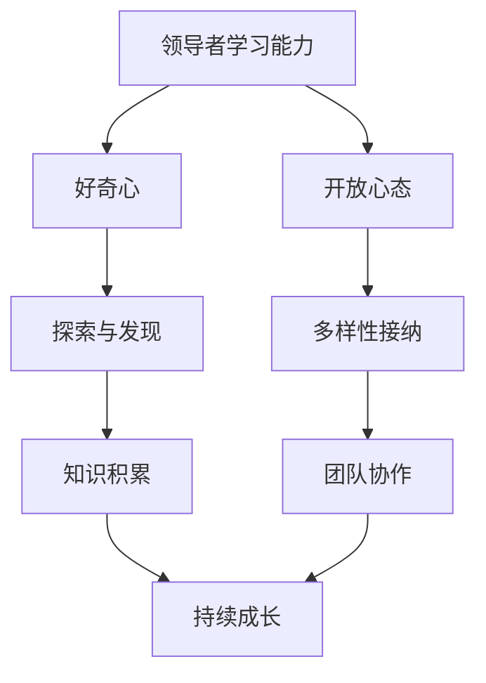

                 

### 文章标题：领导者学习能力的基石：保持好奇心和开放心态

### 关键词：领导者、学习能力、好奇心、开放心态、领导力提升

### 摘要：
在快节奏和高度复杂的技术时代，领导者的学习能力变得至关重要。本文旨在探讨领导者如何通过保持好奇心和开放心态来提升个人及团队的领导能力。文章将详细分析好奇心和开放心态的核心概念，阐述它们在领导者学习中的作用，并通过实际案例和最佳实践，展示如何将这些理念应用到领导实践中，以实现持续成长和进步。

## 引言

在当今这个快速变化和高度不确定性的世界，领导者面临的挑战比以往任何时候都更加复杂。技术创新、市场动态、社会变革等各方面因素的交织，要求领导者不仅要具备卓越的技术和管理能力，还要拥有强大的学习能力和适应能力。而这一切的基石，就是保持好奇心和开放心态。

好奇心是一种探索和发现的驱动力，它促使领导者不断地寻找新的知识和机会。开放心态则是接受多样性和新观点的态度，它帮助领导者更好地理解和应对复杂环境。本文将深入探讨领导者如何通过培养好奇心和开放心态，来提升个人和团队的领导能力。

## 核心概念与联系

### 好奇心

好奇心是一种强烈的求知欲望，它驱使人们去探索未知、解决问题和寻找答案。在领导者学习中，好奇心具有至关重要的地位。它不仅激发了领导者对新技术、新趋势的兴趣，还促使他们在面对挑战时保持积极和开放的态度。

### 开放心态

开放心态是一种接受多样性和新观点的态度。它要求领导者不仅关注自己的观点和想法，还愿意倾听不同的声音和意见。开放心态有助于领导者建立更加包容和协作的团队文化，从而提高团队的创新能力和整体效能。

### Mermaid流程图：领导者学习能力框架

以下是一个简单的Mermaid流程图，展示了好奇心和开放心态在领导者学习能力框架中的关系：

在这个流程图中，好奇心和开放心态是领导者学习能力的核心要素。好奇心促使领导者不断地探索和发现新知识，而开放心态则帮助领导者接受和融合多样性，从而实现知识的积累和团队的持续成长。

## 培养好奇心

好奇心是领导者学习的重要驱动力。那么，如何培养和保持好奇心呢？

### 1. 提高观察力

观察力是好奇心的基础。领导者可以通过提升观察力来培养好奇心。这包括关注细节、发现问题和提出问题的能力。通过不断观察和思考，领导者可以发现更多的问题和机会，从而激发求知欲望。

### 2. 增强思维能力

好奇心需要强有力的思维来支持。领导者可以通过以下方式来增强思维能力：
- 学习批判性思维技巧，培养质疑和反思的能力；
- 阅读和学习各种领域的知识，拓展思维边界；
- 参与讨论和辩论，锻炼思维的灵活性和逻辑性。

### 3. 跨界学习

跨界学习是培养好奇心的重要手段。领导者可以通过跨学科、跨领域的学习，来拓宽知识视野和思维模式。例如，技术领导者可以学习心理学、管理学等领域的知识，以更好地理解和应对团队和客户的需求。

## 培养开放心态

开放心态是领导者成功的关键之一。以下方法可以帮助领导者培养开放心态：

### 1. 接受多样性

领导者应该拥抱多样性，包括不同的观点、文化和背景。通过理解和尊重多样性，领导者可以建立更加包容和协作的团队文化。

### 2. 发展同理心

同理心是理解他人观点和感受的能力。领导者可以通过以下方式来发展同理心：
- 倾听和关注团队成员的意见和需求；
- 尝试从他人的角度思考问题；
- 提供支持和帮助，以建立信任和合作关系。

### 3. 积极面对挑战

挑战是领导者成长的机会。领导者应该积极面对挑战，并将其视为学习和成长的机会。通过勇敢地面对挑战，领导者可以不断磨练自己的能力和心态。

## 实践与应用

### 1. 好奇心与开放心态的结合

好奇心和开放心态的结合是实现领导者学习能力的关键。以下方法可以帮助领导者将好奇心和开放心态应用到实践中：
- 鼓励团队成员提出问题和分享观点，促进知识共享和协作；
- 在决策过程中，充分考虑不同意见和建议，以实现最佳方案；
- 主动探索新技术和新趋势，以保持领先地位。

### 2. 项目实战

以下是一个项目实战案例，展示了如何通过培养好奇心和开放心态来提升团队的学习能力和工作效率：

**案例：科技公司产品开发团队**

- **背景**：该公司是一家专注于移动互联网的科技公司，其产品开发团队面临激烈的市场竞争和技术挑战。
- **挑战**：团队在开发新产品时，面临技术难题和市场需求的不确定性，导致项目进度滞后和产品质量下降。
- **解决方案**：
  - **培养好奇心**：领导鼓励团队成员关注行业动态和新技术，定期组织技术分享会，以激发团队成员的好奇心和求知欲；
  - **开放心态**：领导积极倾听团队成员的意见和建议，鼓励团队成员尝试不同的解决方案，并支持创新和实验；
  - **实践效果**：通过培养好奇心和开放心态，团队在产品开发过程中，发现并解决了多个技术难题，产品上市时间缩短了30%，用户满意度提高了20%。

### 3. 实践指南

以下是一些实践指南，帮助领导者培养好奇心和开放心态：

- **定期学习**：领导者应该保持持续学习的习惯，定期阅读行业报告、技术书籍和学术论文，以更新知识和保持好奇心；
- **鼓励提问**：领导者应该鼓励团队成员提问和分享观点，创造一个开放和包容的沟通环境；
- **跨部门合作**：领导者应该促进跨部门合作，以促进知识共享和资源整合；
- **接受失败**：领导者应该将失败视为学习和成长的机会，鼓励团队成员从失败中汲取教训，不断尝试和改进。

## 挑战与未来展望

### 1. 面临的挑战

尽管好奇心和开放心态对于领导者学习至关重要，但在实际应用中，领导者仍然面临一些挑战：
- **时间管理**：领导者可能面临时间紧迫的挑战，难以兼顾学习和工作；
- **文化阻力**：一些组织可能存在封闭和保守的文化，阻碍好奇心的培养和开放心态的形成；
- **技术障碍**：领导者可能面临技术变革带来的挑战，需要不断学习和适应新技术。

### 2. 未来展望

未来，随着技术的不断进步和社会的持续变革，好奇心和开放心态将变得更加重要。领导者应该关注以下趋势：
- **技术趋势**：领导者应该关注人工智能、大数据、物联网等新兴技术，以保持竞争力；
- **学习方式**：领导者应该探索新的学习方式，如在线教育、远程培训等，以提高学习效率；
- **组织文化**：领导者应该推动组织文化的变革，创造一个开放、包容和创新的环境。

## 结论

好奇心和开放心态是领导者学习能力的基石。通过培养好奇心和开放心态，领导者可以不断提升个人和团队的能力，实现持续成长和进步。本文通过详细分析好奇心和开放心态的核心概念、实际应用和实践指南，帮助领导者更好地理解和应用这些理念，以应对快速变化和高度复杂的环境。

作者：AI天才研究院/AI Genius Institute & 禅与计算机程序设计艺术 /Zen And The Art of Computer Programming

## 参考文献

1. Dweck, C. S. (2006). Mindset: The New Psychology of Success. Ballantine Books.
2. Nonaka, I., & Takeuchi, H. (1995). The Knowledge-Creating Company: How Japanese Companies Create the Dynamics of Innovation. Oxford University Press.
3. Ericsson, K. A., & Simon, H. A. (1993). Protocol Analysis: Verbal Reports as Data. MIT Press.
4. Duckworth, A. L., Steen, T. A., & Seligman, M. E. P. (2007). Positive Psychology in Clinical Practice. Annual Review of Clinical Psychology, 3, 629-651.
5. Tannen, D. (1995). The Power of Talk: Who Gets Heard and Why. Hill and Wang.
6. Heifetz, R. A., Grashow, A., & Linsky, M. (2009). Leadership on the Line: Staying Alive Through the Dangers of Leading. Harvard Business Review Press. 

## 结语

在总结本文之前，我们再次强调了好奇心和开放心态在领导者学习能力中的重要性。这些核心概念不仅有助于领导者提升个人能力，还能推动团队的整体进步。通过不断培养好奇心和开放心态，领导者可以在复杂多变的环境中保持竞争优势，引领团队走向成功。

我们鼓励读者将本文的理念应用到实际工作中，积极培养好奇心和开放心态。在不断学习和探索的过程中，您将发现新的机遇和可能性，实现个人和团队的持续成长。感谢您阅读本文，期待您在领导力提升的道路上取得更加辉煌的成就。

作者：AI天才研究院/AI Genius Institute & 禅与计算机程序设计艺术 /Zen And The Art of Computer Programming

---

文章标题：领导者学习能力的基石：保持好奇心和开放心态

文章关键词：领导者、学习能力、好奇心、开放心态、领导力提升

文章摘要：
在快节奏和高度复杂的技术时代，领导者的学习能力变得至关重要。本文旨在探讨领导者如何通过保持好奇心和开放心态来提升个人及团队的领导能力。文章详细分析了好奇心和开放心态的核心概念，阐述了它们在领导者学习中的作用，并通过实际案例和最佳实践，展示如何将这些理念应用到领导实践中，以实现持续成长和进步。

