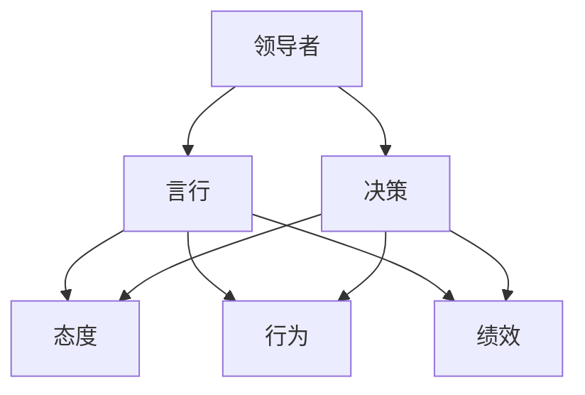
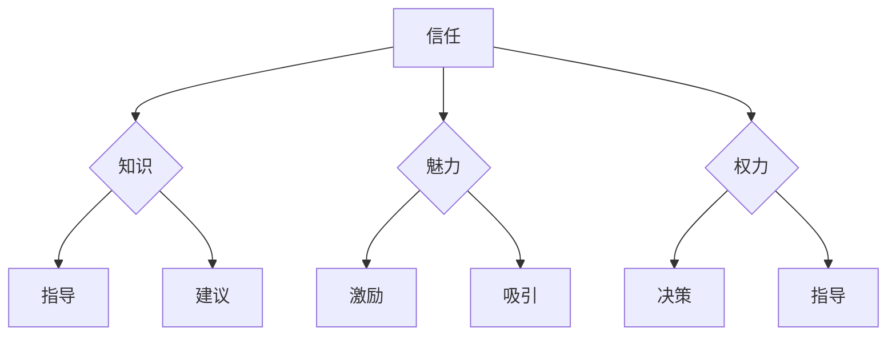
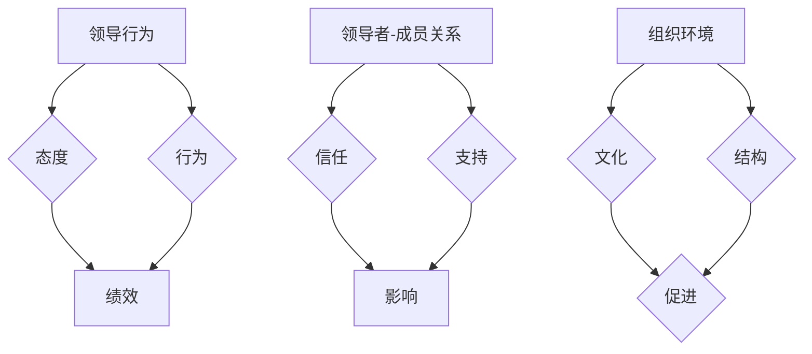
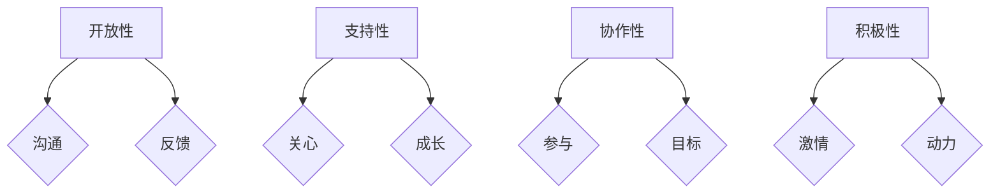

                 

### 文章标题：领导者的影响力：塑造积极的团队氛围

#### 关键词：领导者影响力，团队氛围，领导力模型，团队沟通，团队激励，团队领导力，影响力评估

#### 摘要：
本文深入探讨了领导者如何通过影响力塑造积极的团队氛围。首先，我们定义了领导者影响力的内涵及其重要性，接着介绍了领导者影响力模型及其应用。随后，我们分析了领导者影响力与团队氛围之间的关系，探讨了如何塑造积极氛围。接着，本文重点讨论了领导者如何通过沟通、激励和领导力提升团队氛围。最后，我们提出了领导者影响力评估与提升的方法，总结了关键启示，并对未来领导者影响力的发展趋势进行了展望。

---

## 第1章：领导者影响力的定义与重要性

### 1.1 领导者影响力的定义

领导者影响力指的是领导者通过自身的言行和决策，影响团队成员态度、行为和绩效的能力。这种影响力不仅体现在领导者与团队成员之间的互动中，也渗透到组织的各个方面。

**核心概念与联系：**

为了更好地理解领导者影响力，我们可以用以下Mermaid流程图展示其构成和作用：

### 1.1.1 领导者影响力的要素

领导者影响力由以下四个要素构成：

1. **信任**：领导者与团队成员之间的信任是影响力的基础。只有建立了信任，领导者才能有效地影响团队成员。
2. **知识**：领导者的专业知识和经验是其影响力的来源。通过专业知识，领导者能够提供有价值的指导和建议。
3. **魅力**：领导者的个性和魅力可以吸引和激励团队成员，使其愿意追随和信任领导者。
4. **权力**：领导者的职位和权力赋予其一定的权威和影响力，使其能够通过决策和指导影响团队成员。

**Mermaid流程图：**

### 1.2 领导者影响力的重要性

领导者影响力对个人、团队和组织具有重要意义。

#### 1.2.1 对个人成长的影响

领导者影响力可以促进团队成员的个人成长。通过领导者的指导和支持，团队成员能够不断提升自己的能力和素质，实现个人目标。

#### 1.2.2 对团队绩效的影响

领导者的影响力直接影响团队绩效。一个有影响力的领导者能够激发团队成员的积极性，提高团队协作效率，从而提升整体绩效。

#### 1.2.3 对组织文化的影响

领导者的影响力对组织文化具有深远影响。通过塑造积极、健康的组织文化，领导者可以为组织的发展奠定坚实的基础。

**数学模型和公式：**

领导者影响力（Impact）可以用以下公式表示：

$$ Impact = f(Trust, Knowledge, Charm, Power) $$

其中，Trust、Knowledge、Charm和Power分别表示信任、知识、魅力和权力。

### 第2章：领导者影响力模型

### 2.1 领导者影响力模型概述

领导者影响力模型是一个描述领导者如何通过不同方式影响团队成员的理论框架。该模型通常包括以下几个方面：

1. **领导行为**：领导者的行为对团队成员的态度和行为产生影响。
2. **领导者-成员关系**：领导者与成员之间的关系强度和信任度。
3. **组织环境**：组织文化和组织结构对领导者影响力的限制和促进。

**Mermaid流程图：**

### 2.2 领导者影响力模型的应用

领导者影响力模型可以帮助领导者识别和发挥自己的影响力。以下是一些具体的应用场景：

#### 2.2.1 领导者如何提高自己的影响力

领导者可以通过以下方法提高自己的影响力：

1. **提升自身能力**：通过不断学习和实践，提升专业知识和领导能力。
2. **建立信任关系**：与团队成员建立良好的信任关系，增强影响力。
3. **塑造积极文化**：通过塑造积极、健康的组织文化，提升整体影响力。

#### 2.2.2 领导者如何发挥影响力

领导者可以通过以下方式发挥影响力：

1. **明确目标**：设定清晰的目标和愿景，引导团队成员共同努力。
2. **有效沟通**：通过有效的沟通，传达目标和愿景，激发团队成员的积极性。
3. **激励团队**：通过激励措施，提升团队成员的士气和动力。

### 第3章：领导者影响力与团队氛围

### 3.1 团队氛围的概念与重要性

团队氛围是指团队成员在共同工作过程中形成的一种情绪和态度状态。团队氛围对团队绩效和组织文化具有深远影响。

#### 3.1.1 团队氛围的定义

团队氛围可以定义为团队成员在共同工作中表现出的情绪、态度和互动模式。

#### 3.1.2 积极团队氛围的特点

积极团队氛围具有以下特点：

1. **开放性**：团队成员之间愿意分享意见和反馈，鼓励开放沟通。
2. **支持性**：团队成员相互支持，关心彼此的成长和发展。
3. **协作性**：团队成员积极参与协作，共同实现目标。
4. **积极性**：团队成员充满激情和动力，积极面对挑战。

**Mermaid流程图：**

### 3.2 领导者如何塑造积极的团队氛围

领导者可以通过以下方法塑造积极的团队氛围：

#### 3.2.1 领导者角色与氛围塑造

领导者作为团队的核心，承担着塑造团队氛围的重要责任。领导者需要具备以下角色：

1. **引导者**：引导团队成员树立正确的价值观和态度。
2. **激励者**：激发团队成员的积极性和动力。
3. **协调者**：协调团队成员之间的沟通和协作。

#### 3.2.2 塑造积极氛围的策略

领导者可以采取以下策略塑造积极氛围：

1. **建立明确的目标和愿景**：明确的目标和愿景有助于引导团队成员共同奋斗，形成积极氛围。
2. **鼓励开放沟通**：鼓励团队成员之间进行开放、真诚的沟通，促进信息共享和协作。
3. **提供支持和资源**：为团队成员提供必要的支持和资源，帮助他们克服困难，提升自信心。
4. **奖励和认可**：通过奖励和认可，激励团队成员保持积极态度，发挥潜力。

#### 3.2.3 领导者如何处理负面氛围

领导者需要及时处理负面氛围，以防止其对团队和组织产生负面影响。以下是一些处理负面氛围的方法：

1. **倾听和沟通**：倾听团队成员的反馈和意见，与他们进行开放、真诚的沟通。
2. **识别问题根源**：分析负面氛围的根源，找出导致问题的原因。
3. **采取针对性措施**：根据问题根源，采取有针对性的措施解决负面氛围。
4. **培养积极文化**：通过培养积极文化，逐渐消除负面氛围。

### 第4章：领导者影响力与团队沟通

### 4.1 团队沟通的重要性

团队沟通在领导者影响力塑造中具有关键作用。有效的沟通可以帮助领导者传达目标、愿景和价值观，促进团队成员之间的协作和理解。

#### 4.1.1 团队沟通的作用

团队沟通具有以下作用：

1. **传达信息和指令**：领导者通过沟通传达目标和任务，确保团队成员明确任务要求。
2. **促进协作和合作**：通过沟通，团队成员可以共享信息、资源和经验，提高协作效率。
3. **解决冲突和问题**：有效的沟通可以帮助团队成员识别和解决潜在的问题和冲突。
4. **提升团队氛围**：良好的沟通可以增强团队成员之间的信任和合作，营造积极的工作氛围。

#### 4.1.2 团队沟通的障碍与解决方法

团队沟通中常见的障碍包括：

1. **信息过载**：过多的信息可能导致团队成员无法有效理解和处理。
2. **沟通方式不当**：不合适的沟通方式可能导致误解和冲突。
3. **文化差异**：团队成员来自不同文化背景，可能导致沟通困难和误解。

解决方法包括：

1. **优化沟通渠道**：选择合适的沟通渠道，确保信息有效传递。
2. **提高沟通技巧**：通过培训和实践，提升团队成员的沟通技巧和表达能力。
3. **建立信任和尊重**：建立团队成员之间的信任和尊重，减少沟通障碍。
4. **跨文化沟通**：加强跨文化沟通能力，尊重不同文化背景，促进有效沟通。

### 4.2 领导者如何提升团队沟通效果

领导者可以通过以下方法提升团队沟通效果：

#### 4.2.1 领导者沟通技巧的培养

领导者需要具备以下沟通技巧：

1. **倾听**：积极倾听团队成员的意见和反馈，确保理解其观点。
2. **清晰表达**：明确、简洁地表达自己的想法和指令，避免误解和歧义。
3. **提问和反馈**：通过提问和反馈，促进团队成员之间的沟通和理解。
4. **非言语沟通**：注意非言语沟通，如肢体语言、面部表情等，确保信息传达的一致性。

#### 4.2.2 领导者如何促进有效沟通

领导者可以通过以下方法促进有效沟通：

1. **建立沟通机制**：制定明确的沟通流程和规则，确保信息传递的顺畅和高效。
2. **鼓励开放沟通**：鼓励团队成员之间进行开放、真诚的沟通，创造一个积极沟通的氛围。
3. **提供培训和支持**：为团队成员提供沟通培训和支持，提升其沟通能力和技巧。
4. **定期沟通反馈**：定期与团队成员进行沟通反馈，了解沟通效果和改进方向。

#### 4.2.3 领导者沟通案例分析

以下是一个领导者沟通案例：

**案例背景：**  
某公司新项目启动，项目团队由不同部门的人员组成，沟通不畅导致项目进展受阻。

**案例过程：**  
1. **明确目标和任务**：项目启动初期，领导者明确了项目的目标和任务，确保团队成员对任务要求有清晰的认识。
2. **建立沟通机制**：领导者制定了项目沟通计划，定期召开项目会议，确保团队成员之间的信息共享和协作。
3. **鼓励开放沟通**：领导者鼓励团队成员在会议中分享意见和建议，促进团队成员之间的沟通和理解。
4. **提供沟通培训**：为团队成员提供沟通技巧培训，提升其沟通能力和技巧。
5. **定期沟通反馈**：领导者定期与团队成员进行沟通反馈，了解沟通效果和改进方向。

**案例结果：**  
通过领导者的有效沟通，项目团队逐渐克服了沟通障碍，项目进展顺利，最终取得了良好的成果。

### 第5章：领导者影响力与团队激励

### 5.1 团队激励的概念与作用

团队激励是指领导者通过激励措施激发团队成员的积极性、主动性和创造力，以提高团队绩效和个体满意度。

#### 5.1.1 团队激励的定义

团队激励是指领导者通过奖励、认可、支持等手段，激发团队成员的工作热情和创造力，使其为实现团队目标作出贡献。

#### 5.1.2 团队激励的作用

团队激励具有以下作用：

1. **提升团队绩效**：通过激励措施，激发团队成员的积极性和创造力，提高团队的整体绩效。
2. **增强团队凝聚力**：通过激励，增强团队成员之间的信任和合作，提升团队凝聚力。
3. **提升个体满意度**：激励措施能够满足团队成员的需求，提高其工作满意度和幸福感。
4. **促进个人成长**：通过激励，激发团队成员不断学习和提升自己的能力，实现个人成长。

### 5.2 领导者如何激励团队成员

领导者可以通过以下方法激励团队成员：

#### 5.2.1 激励理论的应用

领导者可以应用以下激励理论激励团队成员：

1. **期望理论**：通过设定合理的期望值，激发团队成员的工作动力。
2. **需要层次理论**：了解团队成员的不同需求，提供满足需求的激励措施。
3. **公平理论**：确保激励措施的公平性，避免不公平引发的负面情绪。
4. **目标设置理论**：设定具体、可衡量、有挑战性的目标，激发团队成员的积极性。

#### 5.2.2 激励策略的选择

领导者可以根据团队和成员的特点选择以下激励策略：

1. **物质激励**：提供奖金、奖品等物质奖励，满足团队成员的生理和安全需求。
2. **精神激励**：给予表扬、认可等精神奖励，满足团队成员的社会和尊重需求。
3. **职业发展激励**：提供晋升机会、培训机会等职业发展激励，满足团队成员的自我实现需求。
4. **参与决策激励**：让团队成员参与决策过程，增强其责任感和归属感。

#### 5.2.3 激励案例分析与启示

以下是一个领导者激励案例：

**案例背景：**  
某公司项目团队在项目过程中遇到困难，团队成员情绪低落，项目进展缓慢。

**案例过程：**  
1. **了解团队成员需求**：领导者通过与团队成员沟通，了解其需求和问题。
2. **设定具体目标**：领导者为团队成员设定具体、可衡量、有挑战性的目标，激发其工作动力。
3. **提供培训和支持**：领导者为团队成员提供培训和支持，提升其技能和信心。
4. **奖励和认可**：领导者通过奖励和认可，激励团队成员，增强其积极性和责任感。
5. **建立沟通机制**：领导者建立沟通机制，鼓励团队成员分享意见和建议，促进团队协作。

**案例结果：**  
通过领导者的有效激励，项目团队逐渐恢复了积极性和信心，项目进展顺利，最终取得了良好的成果。

### 第6章：领导者影响力与团队领导力

### 6.1 团队领导力的概念与类型

团队领导力是指领导者通过影响、激励和指导团队成员，实现团队目标的能力。团队领导力可以分为以下几种类型：

1. **权威型领导**：领导者通过职位和权力影响团队成员，确保团队目标的实现。
2. **民主型领导**：领导者鼓励团队成员参与决策，共同制定团队目标和计划。
3. **变革型领导**：领导者通过激发团队成员的变革意识和创造力，推动团队实现变革。
4. **支持型领导**：领导者关心团队成员的需求和情感，提供支持和帮助，增强团队成员的归属感。

### 6.2 领导者如何提升团队领导力

领导者可以通过以下方法提升团队领导力：

#### 6.2.1 领导风格与团队领导力

领导风格对团队领导力具有重要作用。领导者可以根据团队和成员的特点选择合适的领导风格：

1. **权威型领导**：在紧急情况下或团队需要严格管理时，采用权威型领导风格。
2. **民主型领导**：在团队需要协作和创新时，采用民主型领导风格。
3. **变革型领导**：在团队面临变革和挑战时，采用变革型领导风格。
4. **支持型领导**：在团队成员需要关心和支持时，采用支持型领导风格。

#### 6.2.2 领导者如何塑造领导力

领导者可以通过以下方法塑造领导力：

1. **自我反思**：领导者定期进行自我反思，识别自己的优势和不足，提升自我认知和领导能力。
2. **学习与培训**：领导者通过学习和参加培训，不断提升自己的知识和技能，增强领导能力。
3. **实践与经验**：领导者通过实践和经验积累，提升自己的领导能力和管理水平。
4. **培养下属**：领导者通过培养下属，提升团队的整体领导力水平。

#### 6.2.3 领导力发展策略

领导者可以采取以下领导力发展策略：

1. **设立明确的目标和愿景**：领导者为团队设定明确的目标和愿景，激发团队成员的积极性和创造力。
2. **提供支持和资源**：领导者为团队成员提供必要的支持和资源，帮助他们实现个人和团队目标。
3. **建立良好的沟通机制**：领导者建立有效的沟通机制，促进团队成员之间的信息共享和协作。
4. **激励和认可**：领导者通过激励和认可，激发团队成员的积极性和责任感，提升团队绩效。
5. **培养团队文化**：领导者通过培养积极、健康的团队文化，增强团队的凝聚力和战斗力。

### 第7章：领导者影响力评估与提升

### 7.1 领导者影响力评估的方法

领导者影响力评估是衡量领导者对团队和组织影响程度的过程。以下是一些常见的评估方法：

1. **360度反馈**：通过团队成员、上级、同事和下属的反馈，评估领导者的表现和影响力。
2. **关键绩效指标（KPI）**：通过关键绩效指标，评估领导者的绩效和对团队和组织的影响。
3. **行为观察**：通过观察领导者的行为和表现，评估其影响力。
4. **问卷调查**：通过问卷调查，了解团队成员对领导者的看法和评价。

### 7.2 领导者如何提升影响力

领导者可以通过以下方法提升影响力：

#### 7.2.1 影响力提升的策略

1. **建立信任**：通过诚实、透明和负责任的行为，建立信任和合作关系。
2. **提升自身能力**：通过学习和实践，提升专业知识和领导能力。
3. **塑造积极形象**：通过言行一致，塑造积极、专业的形象。
4. **建立广泛的人脉**：通过人际交往，建立广泛的人脉网络。
5. **积极沟通**：通过有效的沟通，传达目标和愿景，增强影响力。

#### 7.2.2 持续提升影响力的实践

1. **定期自我反思**：领导者定期进行自我反思，识别自己的优势和不足，持续提升领导能力。
2. **参与培训和学习**：领导者积极参加培训和学习，不断提升自己的知识和技能。
3. **实践与反思**：领导者通过实践和反思，积累经验，提升领导能力。
4. **建立反馈机制**：领导者建立反馈机制，接受团队成员的反馈，持续改进自己的领导方式。

#### 7.2.3 领导者影响力提升案例分析

以下是一个领导者影响力提升案例：

**案例背景：**  
某公司领导者李明在任职初期，领导力较弱，团队氛围消极，项目进展缓慢。

**案例过程：**  
1. **自我反思**：李明通过自我反思，认识到自身领导能力的不足，决定提升自己的领导能力。
2. **参加培训**：李明积极参加各种领导力培训，学习先进的管理理念和技巧。
3. **实践与反思**：李明在项目中尝试应用所学知识和技巧，通过实践和反思，不断提升自己的领导能力。
4. **建立反馈机制**：李明建立反馈机制，接受团队成员的反馈，及时调整自己的领导方式。
5. **激励和认可**：李明通过激励和认可，激发团队成员的积极性和创造力，提升团队氛围。

**案例结果：**  
经过一段时间的不懈努力，李明的领导力得到了显著提升，团队氛围逐渐积极，项目进展顺利，最终取得了良好的成果。

### 第8章：总结与展望

#### 8.1 领导者影响力的重要启示

1. **信任是领导力的基础**：建立信任是领导者影响力的重要保障，领导者需要通过诚实、透明和负责任的行为赢得团队成员的信任。
2. **持续学习和提升是关键**：领导者需要不断学习和提升自己的知识和技能，以适应不断变化的环境和挑战。
3. **积极沟通是塑造影响力的关键**：通过积极沟通，领导者能够传达目标和愿景，增强影响力。
4. **激励和认可能够提升团队氛围**：领导者通过激励和认可，激发团队成员的积极性和创造力，提升团队氛围。

#### 8.2 未来领导者影响力的发展趋势

1. **数字化转型**：随着数字技术的发展，领导者需要具备数字化转型的能力，引导团队适应数字化时代。
2. **多元文化领导**：在全球化背景下，领导者需要具备多元文化领导能力，适应不同文化背景的团队成员。
3. **情感智能**：情感智能在领导者影响力中的作用越来越重要，领导者需要具备理解、管理和表达情感的能力。
4. **领导力的可持续性**：领导者需要关注领导力的可持续性，通过负责任的行为和可持续的领导方式，实现长期发展。

### 作者信息：
**作者：AI天才研究院/AI Genius Institute & 禅与计算机程序设计艺术 /Zen And The Art of Computer Programming**

