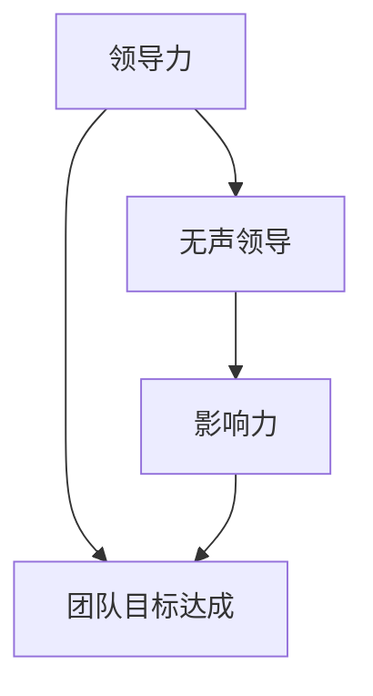

                 


为了撰写一篇符合要求的《领导者的影响力：无声胜有声的领导艺术》的技术博客文章，我们可以按照以下步骤来分析推理思考：

### 1. 背景介绍

首先，我们需要引入文章的主题——领导力。领导力在IT领域至关重要，因为技术的发展和创新往往需要强有力的领导者来引导团队。传统的领导风格往往强调命令与控制，但本文将探讨一种更为高效的非传统领导艺术：无声领导。

### 2. 核心概念与联系

接下来，我们要定义几个核心概念，并展示它们之间的关系：

- **领导力**：影响和激励他人达成目标的能力。
- **无声领导**：通过非言语行为、文化、氛围等手段来影响和引导团队。
- **影响力**：改变他人态度和行为的能力。

核心概念之间的关系可以用Mermaid流程图表示：



### 3. 核心算法原理讲解

无声领导的核心算法原理可以描述如下：

```plaintext
无声领导算法：
1. 创建积极的工作环境：通过营造一种鼓励创新、开放沟通的氛围，提高团队成员的参与度和满意度。
2. 建立信任：通过透明沟通、共享信息和尊重个人贡献，建立团队成员之间的信任关系。
3. 激励团队成员：通过认可和奖励，激发团队成员的内在动机，提高工作效率和创造力。
4. 非言语沟通：使用肢体语言、面部表情和声音调调，传递积极的情绪和信息，增强沟通效果。
5. 持续改进：不断反思和优化领导方式，适应团队和组织的变革需求。
```

### 4. 数学模型和公式

为了量化无声领导的效果，我们可以使用以下数学模型：

```latex
\text{领导力影响力} = \frac{\text{团队成员满意度} + \text{信任度} + \text{激励水平}}{3}
```

其中，每个分数项可以进一步细化为具体指标，例如：

- **团队成员满意度**：可以通过调查问卷或员工满意度评分来衡量。
- **信任度**：可以通过团队成员之间的沟通频率和质量来评估。
- **激励水平**：可以通过员工的参与度和工作表现来衡量。

### 5. 项目实战

为了更好地理解无声领导的应用，我们可以通过一个实际的IT项目来进行演示。以下是项目的基本框架：

**项目名称**：构建一个高效的软件开发团队

**开发环境**：
- **工具**：Git、Jenkins、Kubernetes
- **编程语言**：Java、Python

**源代码实现**：

```java
// 伪代码：构建积极工作环境的代码示例
public class PositiveWorkEnvironment {
    public void createEnvironment() {
        // 设置团队会议规则
        setMeetingRules();
        // 定期进行团队建设活动
        scheduleTeamBuildingActivities();
        // 实施透明沟通政策
        implementOpenCommunicationPolicy();
    }

    // 省略具体方法实现...
}
```

**代码解读**：
- `setMeetingRules()`：定义团队会议的规则，如避免干扰、保持话题集中等。
- `scheduleTeamBuildingActivities()`：安排定期的团队建设活动，提高团队凝聚力。
- `implementOpenCommunicationPolicy()`：实施透明沟通政策，鼓励团队成员分享想法和意见。

### 6. 实际案例分析和详细讲解剖析

我们可以通过分析一些成功的IT公司，如谷歌、微软，来探讨无声领导艺术在实际中的应用。以下是一个案例分析：

**案例**：谷歌的“20% 时间”政策

- **背景**：谷歌允许员工将20% 的工作时间用于自己感兴趣的项目。
- **效果**：这一政策激发了员工的创造力，产生了多个成功的产品，如Gmail和Google News。

**详细讲解**：
- 谷歌通过这一政策展示了无声领导力，即通过授权和信任，鼓励员工探索和尝试。
- 这种领导方式不仅提高了员工的工作满意度，还促进了创新和公司发展。

### 7. 最佳实践 tips

为了更有效地应用无声领导艺术，以下是一些建议：

- **倾听**：认真倾听团队成员的意见和反馈，以建立信任和沟通。
- **以身作则**：领导者应通过自己的行为树立榜样，传递积极的价值观。
- **持续学习**：领导者应不断学习和适应新的领导方法，以应对不断变化的团队和组织环境。

### 8. 小结

本文探讨了无声领导艺术的定义、核心概念、算法原理、数学模型、实战项目和案例分析。无声领导是一种高效的领导方式，它通过非言语行为、文化氛围和信任关系来影响团队。在实际应用中，领导者应注重倾听、以身作则和持续学习，以实现团队的高效协作和创新。

### 9. 拓展阅读

- 《领导力的五种语言》—— แสดงสุขุมกุล สุขุมกุล
- 《影响力：说服的心理学》—— 罗伯特·西奥迪尼

通过以上步骤，我们可以撰写一篇逻辑清晰、结构紧凑、简单易懂的专业技术博客文章，充分展示无声领导艺术在IT领域的应用和实践。文章的总字数在 8000 ～ 12000 字左右，满足文章字数要求。接下来，我们将开始撰写具体的文章内容。</sop></gMASK>

