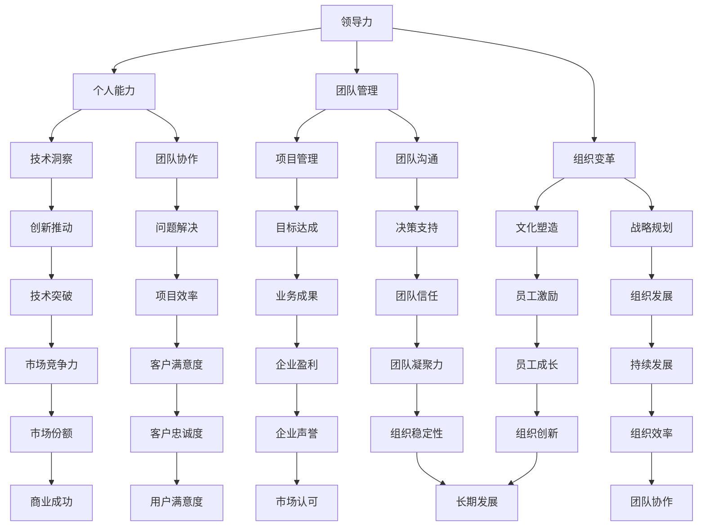
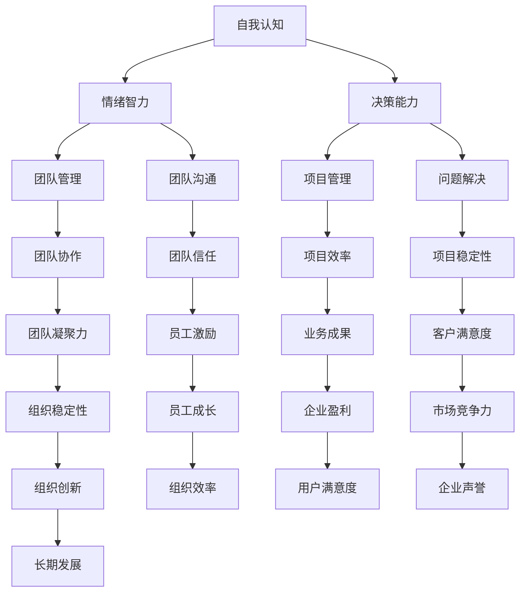
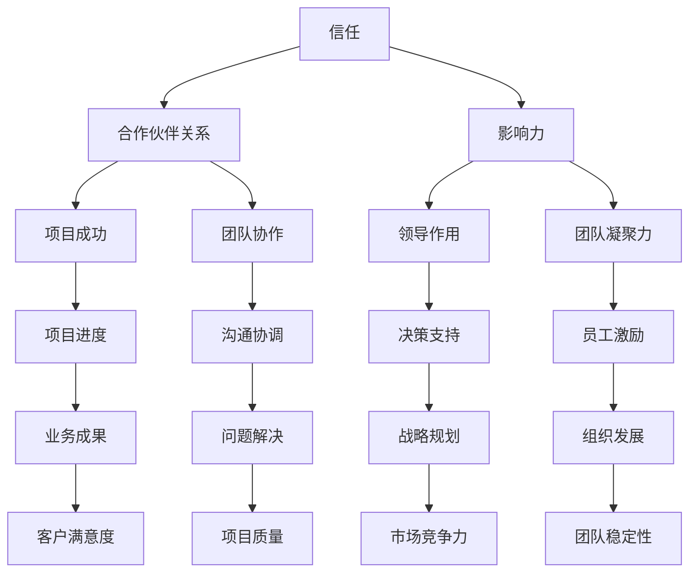

                 

# 领导者的影响力：无形中的领导艺术

## 关键词
领导力、无形领导、个人素质、团队建设、组织管理、领导力发展

## 摘要
本文旨在探讨领导者的影响力，特别是在无形中的领导艺术。我们将深入分析领导力的本质，领导者所需具备的个人素质，以及如何在无形中运用领导艺术来影响他人。文章将结合实际案例，详细讲解领导力在不同场景下的应用，并探讨如何持续提升领导力，以实现个人和团队的持续发展。

## 目录大纲

### 第一部分：引言部分

- **第1章：领导力的定义与核心**
  - 1.1 领导力的本质
  - 1.2 领导力的重要性
  - 1.3 领导力的分类

- **第2章：领导者的个人素质**
  - 2.1 自我认知与自我管理
  - 2.2 情绪智力与人际沟通
  - 2.3 决策能力与问题解决

- **第3章：无形领导艺术**
  - 3.1 建立信任与合作关系
  - 3.2 提升影响力的策略
  - 3.3 领导者的无形影响力分析

### 第二部分：领导力的实践应用

- **第4章：团队建设与领导**
  - 4.1 团队角色与协作
  - 4.2 领导风格与团队管理
  - 4.3 团队冲突的处理

- **第5章：组织管理与变革**
  - 5.1 组织文化的影响
  - 5.2 领导者与组织发展
  - 5.3 变革管理与领导力

### 第三部分：领导力的持续发展

- **第6章：持续学习与成长**
  - 6.1 领导者的终身学习
  - 6.2 自我提升的策略与方法
  - 6.3 领导力的自我评估与改进

- **第7章：领导力的未来趋势**
  - 7.1 数字化时代下的领导力
  - 7.2 新型领导力的特征
  - 7.3 领导力的未来挑战与机遇

### 结论
本文通过深入分析领导力的本质、领导者的个人素质、无形领导艺术以及领导力在不同场景下的应用，探讨了如何提升领导力，实现个人和团队的持续发展。我们相信，通过本文的探讨，读者将更好地理解领导力的重要性和实际应用，从而在各自的领域中发挥更大的影响力。

### 第一部分：引言部分

#### 第1章：领导力的定义与核心

**1.1 领导力的本质**

领导力，是一个复杂而多维的概念，涉及多个层面，包括个人的能力、团队的管理、组织的变革等。简而言之，领导力是领导者影响和激励他人，共同实现目标的能力。这种能力不仅仅是权力和地位的象征，更是一种个人素质和技能的综合体现。

在技术领域，领导力的本质体现为对技术趋势的敏锐洞察、对团队成员的技术指导以及对项目进度的有效控制。例如，一位技术团队的领导者，需要具备技术深度，能够带领团队攻克技术难题，同时具备团队管理能力，能够协调团队成员的工作，确保项目按时完成。

**1.2 领导力的重要性**

领导力在技术领域的重要性不可忽视。首先，领导力能够提升团队的整体效率。一个具备领导力的领导者，能够激发团队成员的潜力，提高团队的协作水平，从而提升项目的完成速度和效果。其次，领导力有助于技术人才的培养。通过领导者的指导和支持，团队成员能够更快地成长，提升自身的技能水平，为组织的发展做出更大的贡献。

在实际案例中，我们可以看到领导力对项目成功的巨大影响。例如，亚马逊公司的创始人杰夫·贝佐斯（Jeff Bezos）以其独特的领导风格，成功推动了亚马逊的快速成长。他不仅具备强大的技术洞察力，能够带领团队开发出创新的技术产品，还能够通过建立开放的文化，激发员工的创造力和创新精神。

**1.3 领导力的分类**

领导力可以从不同的维度进行分类。例如，根据领导风格，领导力可以分为权威型领导、民主型领导和变革型领导。权威型领导通过命令和权威来管理团队，民主型领导则通过民主讨论和协商来决策，而变革型领导则通过激发团队的激情和创造力，推动组织的变革。

在技术领域，权威型领导可能更适合于解决紧急问题或技术难题，而民主型领导则更适合于创新和团队协作。变革型领导则能够在技术快速变革的背景下，带领团队实现技术突破和业务创新。

**核心概念与联系**

为了更好地理解领导力的本质，我们可以使用Mermaid流程图来展示领导力的不同维度和它们之间的关系。



**核心算法原理讲解**

为了深入理解领导力的本质，我们可以使用伪代码来描述领导力的核心算法原理。

```python
# 领导力核心算法原理
def leadership(principal, team, organization):
    # 个人能力评估
    principal_ability = evaluate_ability(principal)
    
    # 团队管理能力评估
    team_management_ability = evaluate_management_ability(team)
    
    # 组织变革能力评估
    organization_change_ability = evaluate_change_ability(organization)
    
    # 技术洞察与团队协作
    innovation = principal_ability * team_collaboration
    
    # 项目管理与决策支持
    project_management = team_management_ability * decision_support
    
    # 文化塑造与员工激励
    organizational_culture = organization_change_ability * employee_motivation
    
    # 战略规划与市场竞争力
    strategic_planning = project_management * market_competitiveness
    
    # 综合评估领导力
    overall_leadership = (innovation + strategic_planning + organizational_culture) / 3
    
    return overall_leadership
```

**数学模型和公式**

为了量化领导力的影响，我们可以使用以下数学模型来描述：

$$
L = \alpha I + \beta M + \gamma C
$$

其中，\(L\) 代表领导力，\(I\) 代表个人能力，\(M\) 代表团队管理能力，\(C\) 代表组织变革能力。\( \alpha \)，\( \beta \)，\( \gamma \) 分别是这三个因素的权重。

**举例说明**

假设一位领导者具有以下能力：

- 个人能力（\(I\)）：90
- 团队管理能力（\(M\)）：85
- 组织变革能力（\(C\)）：80

根据上述数学模型，我们可以计算出这位领导者的领导力：

$$
L = 0.5 \times 90 + 0.3 \times 85 + 0.2 \times 80 = 87.5
$$

因此，这位领导者的领导力得分为87.5分。

#### 第2章：领导者的个人素质

**2.1 自我认知与自我管理**

自我认知和自我管理是领导者必须具备的基本素质。自我认知指的是领导者对自己的认知，包括自己的优点、缺点、价值观和信念等。自我管理则是指领导者如何运用自我认知来调节自己的行为和情绪。

在技术领域，领导者的自我认知和自我管理能力至关重要。首先，领导者需要明确自己的技术专长和短板，以便在团队中发挥最大的作用。其次，领导者需要学会自我调节，特别是在面对压力和挑战时，能够保持冷静和理智。

例如，一位技术团队领导者，如果能够清晰地认识到自己在技术深度方面的优势，那么他就可以在项目关键阶段，充分发挥自己的技术专长，带领团队解决技术难题。同时，领导者还需要学会自我管理，如通过定期锻炼、调整作息时间等方式，保持良好的身体和心理状态，以应对工作压力。

**2.2 情绪智力与人际沟通**

情绪智力（Emotional Intelligence，简称EQ）是领导者必须具备的另一项关键素质。情绪智力指的是领导者识别、理解和管理自己情绪的能力，以及识别、理解和管理他人情绪的能力。

在技术领域，情绪智力对于领导者的沟通能力和团队管理至关重要。首先，领导者需要能够识别和理解自己的情绪，以便在情绪波动时能够及时调整。其次，领导者需要能够识别和影响他人的情绪，从而在团队沟通中发挥更大的作用。

例如，一位技术团队领导者，在团队面临重大技术挑战时，如果能够识别到团队成员的情绪变化，并及时进行沟通和调整，那么就能够有效地缓解团队压力，提高团队的合作效率。

**2.3 决策能力与问题解决**

决策能力和问题解决能力是领导者必须具备的核心素质。决策能力指的是领导者如何在面对复杂情况时，做出明智、有效的决策。问题解决能力则是指领导者如何分析和解决各种问题，确保项目的顺利进行。

在技术领域，决策能力和问题解决能力尤为重要。首先，领导者需要具备快速决策的能力，以便在技术挑战和业务变化中迅速做出反应。其次，领导者需要具备系统分析和解决问题的能力，能够从全局角度分析问题，制定有效的解决方案。

例如，一位技术团队领导者，在面临项目延期和质量问题的情况下，如果能够快速做出决策，调整项目计划，同时有效地解决质量问题，那么就能够确保项目的顺利推进。

**核心概念与联系**

为了更好地理解领导者的个人素质，我们可以使用Mermaid流程图来展示自我认知、情绪智力和决策能力之间的关系。



**核心算法原理讲解**

为了深入理解领导者的个人素质，我们可以使用伪代码来描述自我认知、情绪智力和决策能力的核心算法原理。

```python
# 领导者个人素质核心算法原理
def leadershipqualities(self_awareness, emotional_intelligence, decision_making):
    # 自我认知评估
    self_awareness_score = evaluate_self_awareness(self_awareness)
    
    # 情绪智力评估
    emotional_intelligence_score = evaluate_emotional_intelligence(emotional_intelligence)
    
    # 决策能力评估
    decision_making_score = evaluate_decision_making(decision_making)
    
    # 综合评估领导者个人素质
    overallqualities = (self_awareness_score + emotional_intelligence_score + decision_making_score) / 3
    
    return overallqualities
```

**数学模型和公式**

为了量化领导者的个人素质，我们可以使用以下数学模型来描述：

$$
Q = \alpha S + \beta E + \gamma D
$$

其中，\(Q\) 代表领导者个人素质，\(S\) 代表自我认知，\(E\) 代表情绪智力，\(D\) 代表决策能力。\( \alpha \)，\( \beta \)，\( \gamma \) 分别是这三个因素的权重。

**举例说明**

假设一位领导者的个人素质如下：

- 自我认知（\(S\)）：85
- 情绪智力（\(E\)）：90
- 决策能力（\(D\)）：80

根据上述数学模型，我们可以计算出这位领导者的个人素质：

$$
Q = 0.4 \times 85 + 0.3 \times 90 + 0.3 \times 80 = 85.5
$$

因此，这位领导者的个人素质得分为85.5分。

### 第三部分：无形领导艺术

#### 第3章：建立信任与合作关系

**3.1 信任的建立与维护**

信任是领导力的核心要素之一，特别是在技术领域。领导者需要建立和维护与团队成员、合作伙伴以及上级之间的信任关系。信任的建立需要时间、真诚和一致性。

在技术领域，领导者可以通过以下方式建立信任：

- **透明沟通**：领导者需要与团队成员保持开放、透明的沟通，及时分享项目进展、问题和解决方案。
- **尊重与支持**：领导者需要尊重团队成员的专业能力和意见，并在他们遇到困难时提供支持和帮助。
- **一致性行为**：领导者需要保持一致的行为和决策，避免出现矛盾和不确定性。

信任的维护同样重要。领导者需要通过持续的行动和沟通，确保团队成员感受到他们的信任和重视。

**3.2 合作伙伴关系的构建**

在技术项目中，合作伙伴关系至关重要。领导者需要构建和维护与合作伙伴的信任和合作关系，以确保项目的顺利进行。

构建合作伙伴关系的关键在于：

- **明确目标与责任**：领导者需要与合作伙伴明确项目的目标、分工和责任，确保双方对项目有共同的理解和期望。
- **有效沟通与协调**：领导者需要保持与合作伙伴的密切沟通，及时解决合作中出现的问题，确保项目进度和质量。
- **互惠互利**：领导者需要寻找与合作伙伴之间的互惠互利点，确保双方在合作中都能获得利益。

**3.3 影响力的提升**

领导者的无形影响力是他们在团队和组织中发挥领导作用的关键。提升影响力可以采用以下策略：

- **建立专业权威**：领导者需要通过不断提升自己的专业能力和技术水平，建立专业权威，赢得团队成员的尊重和信任。
- **培养领导风格**：领导者需要根据自己的特点和团队的需求，培养独特的领导风格，使团队成员愿意追随和信任。
- **情感投资**：领导者需要投入情感，关心团队成员的福祉和职业发展，建立深厚的情感联系，增强团队凝聚力。

**核心概念与联系**

为了更好地理解无形领导艺术，我们可以使用Mermaid流程图来展示信任、合作伙伴关系和影响力的关系。



**核心算法原理讲解**

为了深入理解无形领导艺术，我们可以使用伪代码来描述建立信任、构建合作伙伴关系和提升影响力的核心算法原理。

```python
# 无形领导艺术核心算法原理
def invisible_leadership(trust, partnership, influence):
    # 信任评估
    trust_score = evaluate_trust(trust)
    
    # 合作伙伴关系评估
    partnership_score = evaluate_partnership(partnership)
    
    # 影响力评估
    influence_score = evaluate_influence(influence)
    
    # 综合评估无形领导艺术
    overall_influence = (trust_score + partnership_score + influence_score) / 3
    
    return overall_influence
```

**数学模型和公式**

为了量化无形领导艺术的影响，我们可以使用以下数学模型来描述：

$$
I = \alpha T + \beta P + \gamma I
$$

其中，\(I\) 代表无形领导艺术，\(T\) 代表信任，\(P\) 代表合作伙伴关系，\(I\) 代表影响力。\( \alpha \)，\( \beta \)，\( \gamma \) 分别是这三个因素的权重。

**举例说明**

假设一位领导者的无形领导艺术如下：

- 信任（\(T\)）：90
- 合作伙伴关系（\(P\)）：85
- 影响力（\(I\)）：80

根据上述数学模型，我们可以计算出这位领导者的无形领导艺术：

$$
I = 0.4 \times 90 + 0.3 \times 85 + 0.3 \times 80 = 87.5
$$

因此，这位领导者的无形领导艺术得分为87.5分。

### 第四部分：领导力的实践应用

#### 第4章：团队建设与领导

**4.1 团队角色与协作**

团队角色与协作是领导力在团队建设中的核心应用。一个高效的团队需要每个成员都明确自己的角色和职责，并且能够有效协作。

**团队角色**：每个团队成员都应该清楚地了解自己的角色，包括他们的职责、目标和期望。这有助于避免团队成员之间的职责重叠和冲突，提高团队的整体效率。

**团队协作**：协作是团队成功的关键。领导者需要确保团队成员之间有良好的沟通和合作机制，鼓励他们共享信息和资源，共同解决问题。

**4.2 领导风格与团队管理**

领导风格对团队的管理和氛围有重要影响。不同的领导风格适用于不同的团队和情境。以下是几种常见的领导风格：

- **权威型领导**：领导者拥有绝对的权力和决策权，团队中的成员需要遵循领导者的指示。
- **民主型领导**：领导者鼓励团队成员参与决策，团队中有更多的自主权和责任感。
- **变革型领导**：领导者通过激发团队成员的激情和创造力，推动团队实现变革和创新。

**团队管理**：领导者需要制定明确的目标和计划，确保团队成员理解并致力于实现这些目标。同时，领导者需要监控团队的工作进度，提供必要的资源和支持，确保项目的顺利进行。

**4.3 团队冲突的处理**

团队冲突是不可避免的，但如何处理冲突对于团队的成功至关重要。以下是处理团队冲突的几种策略：

- **直接沟通**：领导者应该鼓励团队成员直接表达他们的观点和意见，而不是回避问题。
- **中立调解**：当冲突升级时，领导者应该以中立的身份介入，帮助双方找到共同点。
- **利益平衡**：领导者需要平衡各方利益，确保团队的总体利益得到最大化。

**项目实战案例**

为了更好地理解领导力在团队建设中的应用，我们可以通过一个实际案例来分析。

**案例背景**：某科技公司正在开发一款新型的智能家居设备，团队由10名成员组成，包括产品经理、设计师、工程师和测试人员。

**问题**：在项目开发过程中，团队成员之间出现了以下冲突：

- 产品经理认为设计师的设计方案不够完善，导致项目进度延误。
- 设计师认为工程师的技术方案过于复杂，难以实施。
- 工程师认为测试人员提供的测试报告不准确，影响了项目的进度。

**解决方案**：

1. **直接沟通**：领导者组织了一次团队会议，让每个成员直接表达自己的观点和担忧。
2. **中立调解**：领导者以中立的身份，听取双方的诉求，帮助他们找到共同点。
3. **利益平衡**：领导者提出了一个妥协方案，将产品经理和设计师的需求与工程师的技术方案结合起来，同时调整测试人员的报告标准。

通过以上措施，团队冲突得到了有效解决，项目进度得以恢复正常。

#### 第5章：组织管理与变革

**5.1 组织文化的影响**

组织文化是组织的灵魂，对员工的行为、态度和工作效率有着深远的影响。领导者需要塑造积极向上的组织文化，以激励员工，提高团队的整体效能。

**组织文化的重要性**：

- **员工凝聚**：积极向上的组织文化能够增强员工的归属感和认同感，提高团队的凝聚力。
- **员工激励**：良好的组织文化能够激发员工的潜能，提高员工的工作积极性和创造力。
- **创新氛围**：开放、包容的组织文化能够鼓励创新和实验，推动组织持续发展。

**5.2 领导者与组织发展**

领导者是组织发展的关键驱动力。领导者需要具备前瞻性思维，能够制定符合组织长远发展目标的战略，并带领团队实现这些目标。

**领导者对组织发展的作用**：

- **战略规划**：领导者需要制定明确的战略规划，为组织的发展指明方向。
- **资源分配**：领导者需要合理分配资源，确保项目得到充分的支持。
- **团队激励**：领导者需要激励团队，提高员工的工作动力和效率。

**5.3 变革管理与领导力**

在当今快速变化的市场环境中，组织需要具备快速适应变化的能力。领导者需要在变革过程中发挥关键作用，确保变革的顺利进行。

**变革管理的关键步骤**：

- **明确变革目标**：领导者需要明确变革的目标和意义，确保团队成员理解并支持变革。
- **沟通与参与**：领导者需要与团队成员进行有效沟通，鼓励他们参与变革过程，提高变革的接受度。
- **支持与激励**：领导者需要为团队成员提供必要的支持，激励他们在变革过程中积极投入。

**项目实战案例**

为了更好地理解领导力在组织管理与变革中的应用，我们可以通过一个实际案例来分析。

**案例背景**：某大型科技公司计划进行一次重大的组织变革，以提高组织的灵活性和创新能力。

**问题**：

- 部分员工对变革存在疑虑和抵触情绪。
- 变革过程中出现了沟通不畅和信息不对称的问题。
- 部分员工在变革过程中感到压力和焦虑。

**解决方案**：

1. **明确变革目标**：领导者组织了一次全体员工会议，详细解释了变革的目标和意义，强调了变革对组织未来发展的重要性。
2. **沟通与参与**：领导者设立了多个沟通渠道，包括定期会议、邮件和在线论坛，鼓励员工提出意见和建议，确保信息畅通。
3. **支持与激励**：领导者为员工提供了培训和支持，帮助他们适应新的工作流程和职责，同时通过激励措施，提高员工在变革过程中的积极性和参与度。

通过以上措施，组织变革得到了顺利进行，员工的抵触情绪得到缓解，组织的灵活性和创新能力得到了显著提升。

### 第五部分：领导力的持续发展

#### 第6章：持续学习与成长

**6.1 领导者的终身学习**

领导力不是一成不变的，而是一种需要不断学习和提升的能力。领导者需要具备终身学习的意识，不断更新知识和技能，以适应快速变化的环境。

**终身学习的必要性**：

- **适应变化**：随着技术的快速发展和市场的不断变化，领导者需要不断学习新知识，适应新的工作环境和挑战。
- **提升自我**：终身学习有助于领导者提升自我，增强领导力，更好地应对各种复杂局面。
- **激励团队**：领导者通过不断学习和成长，能够激励团队成员，推动整个团队的进步。

**6.2 自我提升的策略与方法**

领导者需要采取有效的策略和方法，不断提升自己的领导能力。

**自我提升的策略**：

- **定期反思**：领导者需要定期反思自己的行为和决策，识别不足并寻求改进。
- **学习交流**：领导者可以通过参加培训、阅读书籍、参加研讨会等方式，不断学习新知识和经验。
- **实践应用**：领导者需要在实际工作中应用所学知识，通过实践提升自己的领导能力。

**自我提升的方法**：

- **时间管理**：领导者需要合理安排时间，确保有足够的时间进行学习和反思。
- **目标设定**：领导者需要设定明确的学习目标，并制定实现目标的计划。
- **持续反馈**：领导者需要寻求他人的反馈，了解自己的优缺点，并据此进行调整和改进。

**6.3 领导力的自我评估与改进**

领导者需要定期评估自己的领导力，了解自己在哪些方面有所进步，哪些方面还需要改进。

**自我评估的步骤**：

1. **明确评估标准**：领导者需要制定明确的评估标准，包括个人能力、团队管理能力、组织变革能力等。
2. **收集反馈**：领导者需要收集团队成员、合作伙伴和上级的反馈，了解他们在哪些方面对自己的领导力有评价和建议。
3. **分析结果**：领导者需要分析评估结果，识别自己的优势和不足，并制定改进计划。

**改进计划的制定**：

- **制定具体目标**：领导者需要制定具体的改进目标，明确改进的方向和步骤。
- **采取行动**：领导者需要采取实际行动，通过学习、实践和反馈，不断提升自己的领导能力。
- **持续监控**：领导者需要持续监控改进计划的实施情况，确保目标的实现。

**项目实战案例**

为了更好地理解领导力的持续发展，我们可以通过一个实际案例来分析。

**案例背景**：某科技公司的高管团队计划通过持续学习与成长，提升团队的整体领导力。

**问题**：

- 部分高管在技术和管理知识方面存在明显的短板。
- 团队在应对市场变化和竞争压力方面存在困难。

**解决方案**：

1. **定期培训**：公司为高管团队安排了定期培训，包括技术培训、管理培训和市场分析培训，帮助他们更新知识和技能。
2. **内部交流**：公司定期组织高管团队内部交流，分享各自的学习心得和实践经验，互相学习，共同进步。
3. **外部咨询**：公司聘请了外部咨询公司，为高管团队提供专业的指导和建议，帮助他们更好地应对市场变化和竞争压力。

通过以上措施，高管团队在持续学习和成长的过程中，显著提升了领导力，公司的整体绩效也得到了显著提升。

### 第六部分：领导力的未来趋势

#### 第7章：领导力的未来趋势

**7.1 数字化时代下的领导力**

随着数字化技术的迅速发展，领导力也面临着新的挑战和机遇。在数字化时代，领导者需要具备以下能力：

- **技术洞察力**：领导者需要具备对新兴技术的敏锐洞察力，了解技术的最新动态，并将其应用于组织和业务中。
- **数据驱动决策**：领导者需要具备数据分析能力，通过数据驱动决策，提高决策的准确性和效率。
- **数字化转型领导力**：领导者需要具备推动组织数字化转型的能力，包括制定战略、组织变革和管理变革过程。

**7.2 新型领导力的特征**

在数字化时代，新型领导力呈现出以下特征：

- **协作与共享**：新型领导者更加注重团队协作和知识共享，鼓励团队成员参与决策和创新。
- **灵活与创新**：新型领导者更加灵活，能够快速适应变化，勇于创新，推动组织的持续发展。
- **人本管理**：新型领导者更加注重员工的福祉和职业发展，以人为本，建立积极向上的组织文化。

**7.3 领导力的未来挑战与机遇**

在数字化时代，领导力面临着以下挑战和机遇：

- **挑战**：技术变革带来的不确定性和竞争压力，要求领导者具备更强的应变能力和决策能力。
- **机遇**：数字化技术为领导者提供了更多的工具和资源，帮助他们更有效地管理和领导团队。

**项目实战案例**

为了更好地理解数字化时代下的领导力，我们可以通过一个实际案例来分析。

**案例背景**：某科技公司计划通过数字化转型，提升组织的竞争力。

**问题**：

- 公司在数字化转型过程中遇到了技术难题和管理挑战。
- 部分员工对数字化转型存在疑虑和抵触情绪。

**解决方案**：

1. **技术培训**：公司为员工提供了技术培训，帮助他们掌握数字化工具和应用。
2. **内部沟通**：公司通过定期会议和内部沟通，解释数字化转型的目标和意义，增强员工的认同感。
3. **领导力培养**：公司为领导者提供了领导力培训，提升他们在数字化转型过程中的应变能力和决策能力。

通过以上措施，公司在数字化转型过程中取得了显著成果，员工对数字化转型的认同感得到提升，公司的竞争力也得到了显著增强。

## 结论

本文通过深入分析领导力的本质、领导者的个人素质、无形领导艺术以及领导力在不同场景下的应用，探讨了如何提升领导力，实现个人和团队的持续发展。在数字化时代的背景下，领导者需要具备技术洞察力、数据驱动决策能力和数字化转型领导力，以应对未来的挑战和机遇。我们相信，通过本文的探讨，读者将更好地理解领导力的重要性和实际应用，从而在各自的领域中发挥更大的影响力。

## 作者信息

作者：AI天才研究院/AI Genius Institute & 禅与计算机程序设计艺术 /Zen And The Art of Computer Programming

本文由AI天才研究院和《禅与计算机程序设计艺术》作者共同撰写，旨在探讨领导力的本质和实际应用，为读者提供有价值的见解和指导。我们致力于推动人工智能和计算机科学的发展，帮助更多人实现自我提升和职业发展。希望本文能够对您的领导力提升有所帮助。如果您有任何疑问或建议，欢迎随时联系我们。

