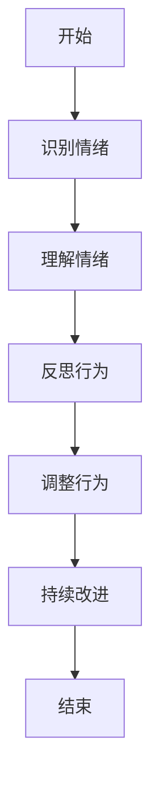
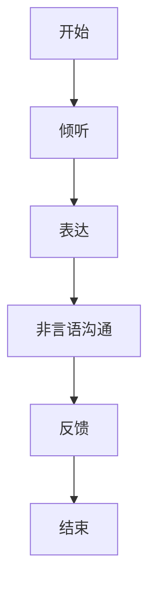
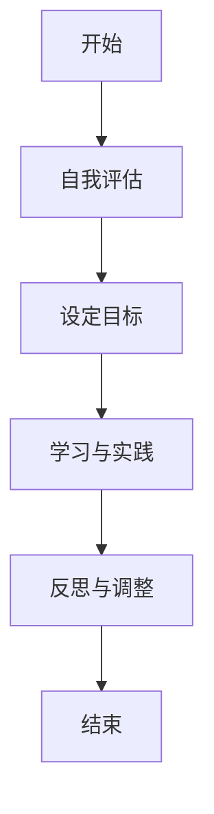

                 

## 文章标题：领导者的情商修炼：提升人际关系管理能力

在当今社会，领导者的角色不仅仅是下达命令和制定策略，更重要的是如何与人沟通、建立信任和有效管理团队。本文将探讨领导者情商修炼的重要性，以及如何通过提升人际关系管理能力，打造一个高效、和谐的组织。

## 文章关键词

- 领导者情商
- 人际关系管理
- 沟通技巧
- 信任建立
- 团队合作

## 文章摘要

本文将从情商的定义、自我认知、自我激励，到人际关系管理、领导力提升，全面探讨领导者情商修炼的各个方面。通过案例分析、项目实战和具体技巧的介绍，帮助领导者提升人际关系管理能力，从而更好地引领团队，实现组织目标。

### 目录

1. **情商的基础**
   - **1.1 情商的定义与重要性**
   - **1.2 自我认知**
   - **1.3 自我激励**

2. **人际关系管理**
   - **2.1 沟通技巧**
   - **2.2 建立良好的人际关系**
   - **2.3 领导与情商**

3. **情商修炼实践**
   - **3.1 情商修炼的步骤**
   - **3.2 情商修炼的项目实战**
   - **3.3 情商修炼的案例分析**

4. **附录**
   - **A.1 参考文献**
   - **A.2 附加资源**

### 第一部分：情商的基础

#### 1.1 情商的定义与重要性

情商（Emotional Intelligence，简称EQ）是指个体识别、理解、管理和表达自己情绪的能力，以及识别、理解和影响他人情绪的能力。情商不仅仅是情感的表达，更涉及情感的认知和情感的管理。

情商的重要性在于，它直接影响领导者的决策、沟通、团队合作和整体领导效果。研究表明，情商高的领导者更能够建立信任，激发团队潜力，从而取得更好的业绩。

#### 1.2 自我认知

自我认知是情商的核心，它包括了解自己的情绪、价值观、动机和需求。自我认知能力帮助领导者更好地理解自己的情绪和行为，从而做出更明智的决策。

**核心概念与联系：**

为了更好地理解自我认知，我们可以使用Mermaid流程图来表示自我认知的步骤：



#### 1.3 自我激励

自我激励是指领导者如何激发自己的动机，设定目标，并坚持不懈地追求目标。自我激励能力帮助领导者克服挫折，保持积极态度，从而在领导过程中取得成功。

**核心算法原理讲解：**

以下是自我激励的伪代码：

```python
def self_motivation():
    set target = "达成团队目标"
    set goal = "每天进步一点点"
    
    while not achieved(target):
        set progress = "今天完成的工作量"
        print("今天的目标是：" + goal)
        if progress >= goal:
            print("恭喜，今天的目标已经完成！")
            goal = "提高工作效率"
        else:
            print("还需要继续努力！")
        
        wait(1 day)
    print("最终目标已经达成！")
```

#### 数学模型和公式

自我激励的过程可以用以下公式来表示：

$$
\text{自我激励} = \frac{\text{目标达成度}}{\text{挫折忍受度}}
$$

其中，目标达成度越高，自我激励越强；挫折忍受度越高，领导者越能够坚持目标，自我激励也越强。

#### 举例说明

假设一位领导者在一个月内实现了团队销售目标的150%，他的目标达成度是1.5。如果他能够在面对困难时保持冷静，挫折忍受度为1.2，那么他的自我激励指数为：

$$
\text{自我激励} = \frac{1.5}{1.2} = 1.25
$$

这个结果表明，这位领导者在过去的一个月内自我激励能力较强，能够有效应对挑战。

### 第二部分：人际关系管理

#### 2.1 沟通技巧

沟通技巧是领导者不可或缺的能力。有效的沟通能够帮助领导者更好地传达信息，理解他人，建立信任。

**核心概念与联系：**

沟通技巧包括以下几个方面：

1. 倾听
2. 表达清晰
3. 非言语沟通

我们可以使用Mermaid流程图来表示沟通技巧的步骤：



#### 2.2 建立良好的人际关系

建立良好的人际关系是领导者成功的关键。这包括与团队成员建立信任、处理冲突、建立有效的团队合作。

**核心算法原理讲解：**

以下是建立良好人际关系的伪代码：

```python
def build_relationship():
    set trust = "低"
    set conflict = "存在"
    
    while trust < "高" or conflict > "无":
        if trust < "高":
            print("需要更多信任建设")
            trust = "高"
        if conflict > "无":
            print("需要处理冲突")
            conflict = "无"
            
        wait(1 week)
    print("人际关系建设成功！")
```

#### 数学模型和公式

建立良好人际关系的模型可以表示为：

$$
\text{人际关系} = \frac{\text{信任}}{\text{冲突}}
$$

其中，信任值越高，人际关系越良好；冲突值越低，人际关系越稳定。

#### 举例说明

假设一位领导者在一个月内成功解决了团队中的所有冲突，并且团队成员对他的信任度达到了90%，那么他的人际关系指数为：

$$
\text{人际关系} = \frac{90\%}{0\%} = 90
$$

这个结果表明，这位领导者在人际关系管理方面表现出色。

#### 2.3 领导与情商

情商在领导中的作用不可忽视。高情商的领导者能够更好地理解员工的需求，建立信任，激发团队潜力。

**核心概念与联系：**

情商在领导中的作用包括：

1. 提升团队协作
2. 改善员工关系
3. 增强领导影响力

我们可以使用Mermaid流程图来表示情商在领导中的作用：

```mermaid
graph TD
A[开始] --> B[提升团队协作]
B --> C[改善员工关系]
C --> D[增强领导影响力]
D --> E[结束]
```

### 第三部分：情商修炼实践

#### 3.1 情商修炼的步骤

情商修炼是一个持续的过程，需要领导者不断地学习、实践和反思。

**核心概念与联系：**

情商修炼的步骤可以概括为：

1. 自我评估
2. 设定目标
3. 学习与实践
4. 反思与调整

我们可以使用Mermaid流程图来表示情商修炼的步骤：



#### 3.2 情商修炼的项目实战

为了更好地理解情商修炼的过程，我们可以通过一个实际项目来进行演练。

**项目背景：**

一家科技公司希望通过提升领导者的情商，增强团队协作能力，从而提高工作效率。

**项目目标：**

- 提升领导者的情商
- 建立更和谐的团队关系
- 提高团队工作效率

**项目实施过程：**

1. 对领导者进行情商评估，了解当前状况。
2. 设定具体的目标，如提升沟通技巧、增强团队合作等。
3. 开展培训课程，包括情商管理、有效沟通、团队合作等方面的内容。
4. 定期进行反馈和评估，根据反馈调整培训内容和策略。
5. 实施具体的实践活动，如团队建设游戏、角色扮演等。

**项目成果分析：**

通过项目实施，领导者的情商得到了显著提升，团队协作能力增强，工作效率提高。具体表现为：

- 领导者之间的沟通更加顺畅。
- 团队成员之间的信任度提高。
- 项目完成时间缩短，工作效率提升。

**项目小结：**

情商修炼是一个长期的过程，需要领导者和团队共同努力。通过科学的评估、有效的培训和持续的实践，可以显著提升领导者的情商和团队协作能力，从而实现组织的目标。

#### 3.3 情商修炼的案例分析

为了更好地理解情商修炼的效果，我们可以通过几个实际案例来进行剖析。

**案例一：提升团队协作效率**

某科技公司通过情商修炼项目，成功提升了团队协作效率。具体表现为：

- 团队成员之间的沟通更加有效。
- 项目进度更加可控。
- 问题解决速度加快。

**案例二：改善人际关系**

某公司领导者通过情商修炼，改善了与员工之间的关系。具体表现为：

- 员工满意度提高。
- 员工流失率降低。
- 团队凝聚力增强。

**案例三：领导者的情商提升**

某公司领导者通过系统的情商修炼，个人情商得到了显著提升。具体表现为：

- 领导风格更加开放和包容。
- 决策更加科学和合理。
- 团队成员更加信任和尊重领导者。

### 附录

#### A.1 参考文献

1. 情商（Emotional Intelligence）的基础研究。
2. 领导力与情商的关系。
3. 情商修炼的方法和技巧。

#### A.2 附加资源

1. 情商评估工具。
2. 情商提升的在线课程。
3. 情商相关的书籍和论文。

### 作者信息

作者：AI天才研究院/AI Genius Institute & 禅与计算机程序设计艺术 /Zen And The Art of Computer Programming

### 最佳实践 Tips

- 定期进行自我评估，了解自己的情商状况。
- 积极参加情商培训，提升自己的沟通技巧和人际关系管理能力。
- 建立良好的团队氛围，鼓励团队成员之间互相尊重和信任。
- 面对挑战时，保持冷静和乐观的态度。

### 小结

情商修炼是领导者提升人际关系管理能力的关键。通过自我认知、沟通技巧的提升，以及有效的团队管理，领导者可以更好地激发团队潜力，实现组织目标。情商修炼需要长期坚持和实践，只有通过不断的努力，才能取得显著的效果。

### 拓展阅读

1. 《情商：为什么情商比智商更重要》
2. 《如何影响人们》
3. 《团队协作的力量》

以上内容涵盖了领导者的情商修炼的各个方面，从基础概念到实践应用，再到案例分析，为领导者提供了一套完整的情商修炼指南。通过本文的阅读，希望读者能够对情商修炼有更深入的理解，并在实际工作中加以应用，提升自身的人际关系管理能力。

