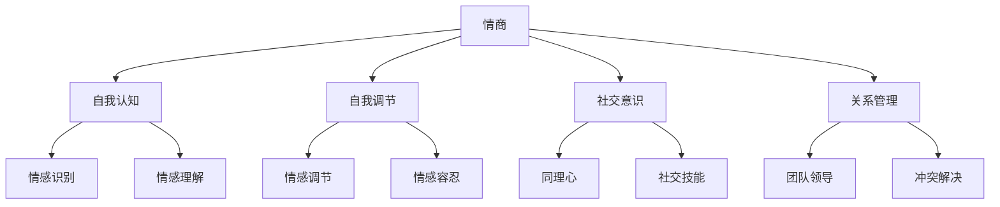

                 

### 文章标题：领导者的情商修炼：提升人际关系管理能力

#### 关键词：情商、领导力、人际关系管理、团队建设、自我认知、同理心、情绪管理

#### 摘要：
本文深入探讨领导者情商修炼的重要性和实践方法，旨在帮助领导者提升人际关系管理能力，从而更有效地领导团队和组织。文章分为三个主要部分：第一部分介绍情商的基础知识及其在领导力中的作用；第二部分聚焦情商修炼的实践方法，包括自我认知、情绪管理、同理心和冲突管理等；第三部分通过成功案例和实际操作，展示情商修炼的成效和未来展望。文章结构紧凑，逻辑清晰，旨在为领导者提供全面的情商提升指导。

---

### 《领导者的情商修炼：提升人际关系管理能力》目录大纲

#### 第一部分：情商基础与重要性

##### 第1章：情商的定义与价值
1.1 情商的概念与分类
1.2 情商在领导力中的作用
1.3 情商对人际关系的影响

##### 第2章：情商模型与测量
2.1 主要情商模型概述
2.2 情商的自我评估方法
2.3 情商在组织中的测量与应用

##### 第3章：情商培养的重要性
3.1 情商培养的必要性
3.2 情商培养的长期影响
3.3 情商培养的方法与策略

#### 第二部分：情商修炼与实践

##### 第4章：自我认知与情绪管理
4.1 了解自我与自我认知
4.2 情绪识别与自我调适
4.3 情绪管理策略与实践

##### 第5章：同理心与沟通技巧
5.1 同理心的概念与重要性
5.2 高效沟通的技巧
5.3 情商沟通案例分析

##### 第6章：冲突管理与人际关系处理
6.1 冲突管理的原则与方法
6.2 人际关系处理技巧
6.3 人际关系案例分析

##### 第7章：领导情商培养与团队建设
7.1 领导情商在团队中的作用
7.2 团队情商培养策略
7.3 团队情商培养案例分析

#### 第三部分：情商修炼案例与实例

##### 第8章：情商修炼成功案例
8.1 成功领导者的情商修炼之路
8.2 情商提升带来的企业变革
8.3 情商修炼的长期效益

##### 第9章：情商修炼实际操作
9.1 情商修炼的具体步骤
9.2 情商修炼的难点与解决策略
9.3 情商修炼实践案例分析

##### 第10章：情商修炼的未来展望
10.1 情商修炼的发展趋势
10.2 情商在领导力中的未来角色
10.3 情商修炼对社会和企业的影响

#### 附录

##### 附录A：情商测量工具与量表
A.1 主要情商测量工具介绍
A.2 情商测量量表的使用方法

##### 附录B：情商修炼资源推荐
B.1 情商提升相关书籍推荐
B.2 情商提升在线课程推荐
B.3 情商提升实践工具推荐

##### 附录C：情商修炼实践指南
C.1 实践指南概述
C.2 实践指南步骤
C.3 实践指南注意事项

---

### 第一部分：情商基础与重要性

#### 第1章：情商的定义与价值

##### 1.1 情商的概念与分类

**核心概念**：情商（Emotional Intelligence, EI）是指个体识别、理解、评估和调节自己及他人情绪的能力。它通常包括四个主要方面：自我认知、自我调节、社交意识和关系管理。

**联系**：情商与领导力紧密相关。领导者需要具备较高的情商，以更好地处理复杂的人际关系，做出明智的决策，并推动团队和组织的发展。

**情商模型**：不同的学者提出了多种情商模型，其中较为著名的包括戈尔曼（Goleman）的情商模型、梅耶（Mayer）和萨尔洛维（Salovey）的情感智能理论等。

**Mermaid 流程图**：


**详细讲解**：情商的概念和分类有助于我们理解情商的复杂性。自我认知是指个体对自己情绪的认识和理解；自我调节是指个体控制和调整自己情绪的过程；社交意识是指个体对他人情绪的认识和感知；关系管理是指个体在人际关系中的处理和调节能力。

**举例说明**：一个领导者如果具有较高的自我认知能力，他能够清楚地认识到自己的情绪状态，并在需要时调整情绪，从而避免负面情绪对决策和团队氛围的影响。同理心则使领导者能够站在员工的立场思考问题，建立信任和合作关系。

**重要性**：情商在领导力中扮演着至关重要的角色。高情商的领导者能够更好地处理复杂的人际关系，提升团队的协作效率，实现组织的目标。

- **增强团队凝聚力**：领导者通过同理心和社交技能，能够建立和谐的工作氛围，增强团队的凝聚力。
- **提升决策质量**：领导者具备良好的情绪管理能力，能更全面地考虑各种因素，做出更明智的决策。
- **提高员工满意度**：领导者能够更好地理解员工的需求，提供更有针对性的激励措施，从而提高员工的工作满意度和忠诚度。

#### 1.2 情商在领导力中的作用

**核心概念**：情商在领导力中的作用包括情绪自我管理、同理心、社交技能和决策能力。

**数学模型**：没有特定的数学模型用于描述情商在领导力中的作用，但可以通过心理测量工具（如MSCEIT）来量化情商的不同维度。

**详细讲解**：情商在领导力中的作用主要体现在以下几个方面：

- **情绪自我管理**：领导者需要能够有效管理和调节自己的情绪，避免负面情绪影响决策和团队氛围。
- **同理心**：领导者需要理解员工的情感需求，并以此为基础建立信任和合作关系。
- **社交技能**：领导者需要具备良好的沟通能力和人际交往技巧，以推动团队协作和解决冲突。
- **决策能力**：领导者需要在复杂情境下做出明智的决策，情商有助于领导者更全面地考虑各种因素。

**举例说明**：一个具有高情商的领导者能够在团队面临挑战时，有效地激励团队成员，化解冲突，并保持团队的积极氛围。例如，在项目进展受阻时，领导者可以通过同理心了解团队成员的焦虑和压力，并提供支持和鼓励，从而增强团队的凝聚力和战斗力。

**联系**：情商不仅是领导者个人的素质，也是团队和组织整体效能的关键因素。

**重要性**：情商在领导力中的重要性体现在以下几个方面：

- **增强团队凝聚力**：高情商的领导者能建立更加和谐的工作环境，提高团队的协作效率。
- **提升决策质量**：领导者具备良好的情绪管理能力，能更客观地评估风险和收益，做出更明智的决策。
- **提高员工满意度**：领导者能够更好地理解员工的需求，提供更有针对性的激励措施，从而提高员工的工作满意度和忠诚度。

#### 1.3 情商对人际关系的影响

**核心概念**：情商在人际关系中起着至关重要的作用，它影响着个体与他人之间的互动、沟通和合作。

**数学模型**：可以使用社会交换理论（Social Exchange Theory）来描述情商对人际关系的影响。该理论认为，人际关系是基于个体之间的利益交换，而情商则决定了这种交换的有效性和质量。

**详细讲解**：情商对人际关系的影响主要体现在以下几个方面：

- **沟通效果**：情商高的个体能够更好地理解和表达自己的情绪，提高沟通的准确性和有效性。
- **合作效率**：情商有助于个体更好地处理冲突和解决问题，提高合作效率。
- **关系质量**：情商高的个体能够建立更加稳定和健康的人际关系，增强信任和亲近感。

**举例说明**：在一个团队中，一个具有高情商的成员能够通过同理心和有效的沟通，缓解团队成员之间的矛盾，提高团队的协作效率。例如，当团队成员出现分歧时，高情商的成员可以主动倾听对方的意见，理解对方的情绪，并提出建设性的解决方案，从而促进团队和谐。

**联系**：情商不仅是个人素质的体现，也是组织文化的重要组成部分。

**重要性**：情商在人际关系中的重要性体现在以下几个方面：

- **促进团队协作**：高情商的个体能够更好地与团队成员沟通和合作，提高团队的整体效能。
- **增强组织凝聚力**：情商有助于建立积极向上的组织文化，增强员工的归属感和认同感。
- **提升组织效能**：情商高的领导者能够更好地管理人际关系，提高组织的协作效率和创新能力。

---

## 第二部分：情商修炼与实践

### 第4章：自我认知与情绪管理

#### 4.1 了解自我与自我认知

**核心概念**：自我认知是指个体对自己情绪、性格、能力和价值观的认识和理解。

**联系**：自我认知是情商的基础，它直接影响个体的情绪管理和人际关系处理。

**数学模型**：可以使用心理测量工具（如自我描述问卷Self-Disclosure Questionnaire）来评估个体的自我认知水平。

**详细讲解**：自我认知包括以下几个方面：

- **情感识别**：个体需要能够识别和理解自己当前的情绪状态，包括情绪的类型、强度和持续时间。
- **性格认知**：个体需要了解自己的性格特点，如外向、内向、开放、保守等，这些性格特点会影响个体的情绪反应和行为方式。
- **能力认知**：个体需要认识到自己的优势和劣势，包括情绪管理能力、社交技能和决策能力等。
- **价值观认知**：个体需要明确自己的价值观，这会影响个体的行为选择和人际关系处理。

**举例说明**：一个领导者如果能够清晰地认识到自己的情绪状态，如愤怒或焦虑，并理解这些情绪可能对团队氛围和决策产生的影响，那么他可以采取相应的措施来调节情绪，避免负面情绪的蔓延。

**联系**：自我认知不仅是个人发展的基础，也是团队协作和领导力提升的关键。

**重要性**：自我认知的重要性体现在以下几个方面：

- **情绪调节**：通过自我认知，个体可以更好地调节自己的情绪，避免情绪失控对工作和人际关系的影响。
- **自我提升**：自我认知有助于个体了解自己的优势和劣势，从而有针对性地进行自我提升。
- **团队协作**：自我认知有助于个体在团队中更好地理解他人的需求和期望，提高协作效率。

#### 4.2 情绪识别与自我调适

**核心概念**：情绪识别是指个体能够准确地识别和理解自己和他人的情绪状态。

**联系**：情绪识别是情商的重要组成部分，它直接影响个体的情绪管理和人际关系处理。

**数学模型**：可以使用情绪识别问卷（Emotion Recognition Task）来评估个体的情绪识别能力。

**详细讲解**：情绪识别包括以下几个方面：

- **情绪识别能力**：个体需要能够识别和理解自己当前的情绪状态，包括情绪的类型、强度和持续时间。
- **他人情绪识别**：个体需要能够识别和理解他人的情绪状态，包括面部表情、语气和肢体语言等。
- **情绪调适能力**：个体需要能够根据情绪状态和环境，采取适当的调适措施，如深呼吸、放松练习等。

**举例说明**：一个领导者如果能够准确地识别出团队成员的愤怒或焦虑情绪，并理解这些情绪可能是因为工作压力或个人问题导致的，那么他可以采取相应的措施来帮助团队成员缓解情绪，如提供支持和鼓励，或安排团队活动来缓解压力。

**联系**：情绪识别与自我调适是情商的核心能力，它们直接影响个体的情绪管理和人际关系处理。

**重要性**：情绪识别与自我调适的重要性体现在以下几个方面：

- **情绪管理**：通过情绪识别和自我调适，个体可以更好地管理自己的情绪，避免情绪失控对工作和人际关系的影响。
- **人际沟通**：通过情绪识别，个体可以更好地理解他人的情绪，提高沟通的准确性和有效性。
- **团队合作**：通过情绪识别和自我调适，个体可以更好地处理团队中的冲突和矛盾，提高团队合作效率。

#### 4.3 情绪管理策略与实践

**核心概念**：情绪管理是指个体通过一系列策略和方法，调节和控制自己的情绪，使其对工作和生活产生积极的影响。

**联系**：情绪管理是情商的重要组成部分，它直接影响个体的情绪状态、工作绩效和人际关系。

**数学模型**：可以使用情绪调节问卷（Emotion Regulation Questionnaire）来评估个体的情绪管理能力。

**详细讲解**：情绪管理策略包括以下几个方面：

- **认知重构**：通过改变对事件的认知评价，调整情绪反应。
- **情绪释放**：通过适当的途径释放情绪，如倾诉、运动等。
- **情绪调节训练**：通过专业训练，提高情绪调节的能力。

**举例说明**：一个领导者如果能够运用认知重构的方法，改变对压力事件的认知评价，从而减少负面情绪的产生，那么他可以在面对压力时保持冷静和理智，更好地应对挑战。

**联系**：情绪管理策略与实践是情商修炼的关键，它们直接影响个体的情绪状态和人际关系处理。

**重要性**：情绪管理策略与实践的重要性体现在以下几个方面：

- **提高工作绩效**：通过情绪管理，个体可以保持积极乐观的心态，提高工作绩效。
- **改善人际关系**：通过情绪管理，个体可以更好地处理人际关系中的冲突和矛盾，建立和谐的人际关系。
- **提升生活质量**：通过情绪管理，个体可以减少负面情绪的影响，提高生活质量。

---

### 第5章：同理心与沟通技巧

#### 5.1 同理心的概念与重要性

**核心概念**：同理心是指个体在情感上能够理解并体验他人的感受。

**联系**：同理心是情商的重要组成部分，它直接影响个体的情绪识别、沟通和人际关系处理。

**数学模型**：可以使用同理心量表（Empathy Scale）来评估个体的同理心水平。

**详细讲解**：同理心包括以下几个方面：

- **情感共鸣**：个体能够感同身受地体验他人的情感。
- **情感理解**：个体能够理解他人情感的原因和背景。
- **情感分享**：个体愿意与他人分享自己的情感体验。

**举例说明**：一个领导者如果具备较高的同理心，他能够理解员工的压力和困扰，并提供必要的支持和鼓励。例如，在员工遇到家庭问题或个人挑战时，领导者可以主动关心并提供帮助，从而增强员工的归属感和满意度。

**联系**：同理心在领导力中扮演着至关重要的角色，它直接影响领导者的决策、团队管理和人际关系处理。

**重要性**：同理心的重要性体现在以下几个方面：

- **建立信任**：同理心有助于领导者建立与员工的信任关系，提高团队凝聚力。
- **提升沟通**：同理心有助于领导者更好地理解员工的需求和期望，提高沟通的准确性和有效性。
- **增强领导力**：同理心使领导者能够站在员工的角度思考问题，做出更符合员工利益和团队发展的决策。

#### 5.2 高效沟通的技巧

**核心概念**：高效沟通是指个体在沟通中能够准确地传达信息，并理解他人的意图和感受。

**联系**：高效沟通是情商的重要组成部分，它直接影响个体的情绪管理、人际关系处理和团队协作。

**数学模型**：可以使用沟通效率评估模型（Communication Efficiency Assessment Model）来评估个体的沟通效率。

**详细讲解**：高效沟通包括以下几个方面：

- **信息传递**：个体能够清晰地表达自己的观点和需求，使对方准确理解。
- **倾听理解**：个体能够倾听对方的意见和感受，理解对方的意图和需求。
- **非语言沟通**：个体能够利用面部表情、肢体语言和语调等非语言手段，增强沟通的效果。
- **反馈与确认**：个体能够在沟通过程中提供反馈，确认对方是否理解了自己的信息。

**举例说明**：一个领导者如果具备高效的沟通技巧，他能够在团队会议中清晰地传达任务目标和期望，并通过倾听和反馈，确保团队成员理解并执行任务。例如，在项目启动会上，领导者可以通过提问和回答，确保团队成员对项目目标和进度有清晰的认识。

**联系**：高效沟通是领导者的核心技能之一，它直接影响领导者的决策、团队管理和人际关系处理。

**重要性**：高效沟通的重要性体现在以下几个方面：

- **提升团队协作**：通过高效沟通，领导者能够确保团队成员对任务和目标有清晰的理解，提高团队协作效率。
- **改善人际关系**：通过高效沟通，领导者能够更好地理解员工的需求和期望，建立积极的人际关系。
- **提高决策质量**：通过高效沟通，领导者能够获取更多的信息，做出更全面的决策。

#### 5.3 情商沟通案例分析

**核心概念**：情商沟通案例分析是指通过具体案例，分析情商在沟通中的应用和实践。

**联系**：情商沟通案例分析有助于领导者理解情商在沟通中的重要性，并掌握有效的沟通策略和方法。

**数学模型**：可以使用沟通效率评估模型（Communication Efficiency Assessment Model）来分析案例中的沟通效果。

**详细讲解**：以下是一个情商沟通案例分析：

**案例背景**：一家科技公司在项目推进过程中，出现了严重的沟通问题，导致项目进度延误。团队中的成员互相指责，士气低落。

**案例分析**：

1. **同理心应用**：领导者首先与团队成员进行一对一沟通，了解他们的感受和困惑。通过同理心，领导者能够理解团队成员的压力和不满。

2. **有效沟通**：领导者组织了一次全体会议，通过清晰的表达和倾听，确保团队成员理解项目的目标和期望。同时，领导者鼓励团队成员提出问题和建议，积极沟通。

3. **冲突管理**：在沟通过程中，领导者运用冲突管理技巧，解决团队成员之间的矛盾和误解，建立和谐的工作氛围。

**案例结果**：通过情商沟通，团队中的成员逐渐恢复了信任和合作，项目进度得以恢复正常。领导者通过同理心、有效沟通和冲突管理，成功解决了团队沟通问题。

**联系**：情商沟通案例分析有助于领导者理解情商在沟通中的重要性，并掌握有效的沟通策略和方法。

**重要性**：情商沟通案例分析的重要性体现在以下几个方面：

- **提高沟通效率**：通过案例分析，领导者能够了解情商在沟通中的应用，提高沟通效率和效果。
- **提升团队协作**：通过案例分析，领导者能够学习如何通过情商沟通，提升团队协作和团队凝聚力。
- **解决沟通问题**：通过案例分析，领导者能够掌握解决沟通问题的方法和策略，提高团队的整体效能。

---

### 第6章：冲突管理与人际关系处理

#### 6.1 冲突管理的原则与方法

**核心概念**：冲突管理是指个体或团队在面对矛盾和分歧时，采取有效的方法和策略，解决冲突，恢复和谐。

**联系**：冲突管理是情商的重要组成部分，它直接影响个体的情绪管理、人际关系处理和团队协作。

**数学模型**：可以使用冲突管理评估模型（Conflict Management Assessment Model）来评估个体的冲突管理能力。

**详细讲解**：冲突管理包括以下几个原则和方法：

- **原则**：

  1. **公正原则**：在冲突管理中，要公正地对待双方，避免偏袒和偏见。
  2. **合作原则**：通过合作和协商，寻求双方都能接受的解决方案。
  3. **尊重原则**：尊重对方的意见和感受，避免言语攻击和人身攻击。

- **方法**：

  1. **沟通方法**：通过积极的沟通，了解双方的立场和需求，寻找共同点。
  2. **妥协方法**：在双方利益冲突时，通过妥协和让步，达成共识。
  3. **解决方法**：采取有效的解决方案，解决冲突，恢复和谐。

**举例说明**：在一个团队项目中，成员A和成员B因为工作分配和任务进度产生了分歧。领导者通过沟通，了解到双方的需求和担忧，采取了妥协的方法，调整了任务分配，解决了冲突，恢复了团队的和谐。

**联系**：冲突管理原则与方法是情商沟通的核心内容，它们直接影响个体的情绪管理和人际关系处理。

**重要性**：冲突管理的重要性体现在以下几个方面：

- **提高团队效能**：通过有效的冲突管理，可以解决团队中的矛盾和分歧，提高团队的协作效率和创新能力。
- **维护人际关系**：通过冲突管理，可以减少人际关系中的矛盾和冲突，建立和谐的工作环境。
- **提升领导力**：通过冲突管理，领导者可以展现自己的沟通和决策能力，提升领导力和团队影响力。

#### 6.2 人际关系处理技巧

**核心概念**：人际关系处理技巧是指个体在处理与他人关系时，采取的有效方法和策略。

**联系**：人际关系处理技巧是情商的重要组成部分，它直接影响个体的情绪管理、人际关系处理和团队协作。

**数学模型**：可以使用人际关系处理评估模型（Interpersonal Relationship Management Assessment Model）来评估个体的人际关系处理能力。

**详细讲解**：人际关系处理技巧包括以下几个方面：

- **建立信任**：通过诚实、透明和尊重，建立与他人的信任关系。
- **有效沟通**：通过倾听、表达和反馈，提高沟通的准确性和有效性。
- **冲突解决**：通过积极的沟通和合作，解决人际关系中的矛盾和分歧。
- **情感管理**：通过情绪识别和自我调适，管理自己的情绪，避免情绪对人际关系的影响。

**举例说明**：在一个团队项目中，成员C和成员D因为意见不合产生了冲突。通过有效的沟通和情感管理，领导者成功解决了冲突，恢复了团队的和谐。领导者通过与成员C和成员D进行一对一沟通，了解他们的观点和需求，通过同理心和理解，找到了双方都能接受的解决方案。

**联系**：人际关系处理技巧是情商沟通的核心内容，它们直接影响个体的情绪管理和人际关系处理。

**重要性**：人际关系处理技巧的重要性体现在以下几个方面：

- **提升沟通效率**：通过有效的人际关系处理技巧，可以提高沟通的准确性和有效性，减少误解和冲突。
- **建立和谐关系**：通过人际关系处理技巧，可以建立和谐的人际关系，提高团队的协作效率和创新能力。
- **提升领导力**：通过人际关系处理技巧，领导者可以展现自己的沟通和决策能力，提升领导力和团队影响力。

#### 6.3 人际关系案例分析

**核心概念**：人际关系案例分析是指通过具体案例，分析人际关系处理中的应用和实践。

**联系**：人际关系案例分析有助于领导者理解人际关系处理的重要性，并掌握有效的人际关系处理策略和方法。

**数学模型**：可以使用人际关系处理评估模型（Interpersonal Relationship Management Assessment Model）来分析案例中的人际关系处理效果。

**详细讲解**：以下是一个人际关系案例分析：

**案例背景**：一家公司的团队成员之间经常出现矛盾和冲突，影响了团队的协作效率和项目的进展。

**案例分析**：

1. **同理心应用**：领导者首先与团队成员进行一对一沟通，了解他们的感受和困惑。通过同理心，领导者能够理解团队成员的压力和不满。

2. **有效沟通**：领导者组织了一次全体会议，通过清晰的表达和倾听，确保团队成员理解公司的目标和期望。同时，领导者鼓励团队成员提出问题和建议，积极沟通。

3. **冲突解决**：在沟通过程中，领导者运用冲突管理技巧，解决团队成员之间的矛盾和误解，建立和谐的工作氛围。

**案例结果**：通过有效的人际关系处理，团队成员之间的矛盾和冲突逐渐减少，团队的协作效率和创新能力得到提升。领导者通过同理心、有效沟通和冲突管理，成功解决了人际关系问题。

**联系**：人际关系案例分析有助于领导者理解人际关系处理的重要性，并掌握有效的人际关系处理策略和方法。

**重要性**：人际关系案例分析的重要性体现在以下几个方面：

- **提高团队效能**：通过人际关系案例分析，领导者可以了解人际关系处理的重要性，提高团队的协作效率和创新能力。
- **维护人际关系**：通过人际关系案例分析，领导者可以学习如何通过有效的人际关系处理技巧，减少团队中的矛盾和冲突，建立和谐的工作环境。
- **提升领导力**：通过人际关系案例分析，领导者可以掌握有效的人际关系处理策略和方法，提升领导力和团队影响力。

---

### 第7章：领导情商培养与团队建设

#### 7.1 领导情商在团队中的作用

**核心概念**：领导情商是指领导者识别、理解、评估和调节自己及他人情绪的能力。

**联系**：领导情商是领导力的重要组成部分，它直接影响领导者的决策、团队管理和团队效能。

**数学模型**：可以使用领导情商评估模型（Leadership Emotional Intelligence Assessment Model）来评估领导者的情商水平。

**详细讲解**：领导情商在团队中的作用包括以下几个方面：

- **情绪自我管理**：领导者需要具备良好的情绪自我管理能力，避免负面情绪对决策和团队氛围的影响。
- **同理心**：领导者需要具备同理心，理解团队成员的情感需求，建立信任和合作关系。
- **社交技能**：领导者需要具备良好的社交技能，提高沟通能力和人际交往技巧，促进团队协作。
- **决策能力**：领导者需要具备良好的决策能力，通过情绪管理和同理心，做出明智的决策。

**举例说明**：在一个项目中，领导者通过同理心，了解到团队成员的焦虑和压力，并采取相应的措施，如调整工作安排、提供支持和鼓励等，帮助团队成员缓解情绪，提高团队的工作效率。

**联系**：领导情商在团队中的作用是领导力的核心内容，它直接影响团队的协作效率和创新能力。

**重要性**：领导情商在团队中的作用的重要性体现在以下几个方面：

- **提升团队效能**：领导情商有助于领导者更好地处理团队中的情绪和冲突，提高团队的协作效率和创新能力。
- **建立信任**：领导情商有助于领导者建立与团队成员的信任关系，增强团队的凝聚力和归属感。
- **提高领导力**：领导情商有助于领导者提升自身的领导力，提高领导水平和团队效能。

#### 7.2 团队情商培养策略

**核心概念**：团队情商培养策略是指通过一系列方法和措施，提升团队成员的情商水平，促进团队的发展和成长。

**联系**：团队情商培养策略是领导情商的重要组成部分，它直接影响团队的协作效率和创新能力。

**数学模型**：可以使用团队情商培养评估模型（Team Emotional Intelligence Development Model）来评估团队情商培养的效果。

**详细讲解**：团队情商培养策略包括以下几个方面：

- **培训与教育**：通过培训和教育活动，提高团队成员的情商意识和能力。
- **情感支持**：提供情感支持，帮助团队成员识别和调节情绪，提高情绪管理能力。
- **团队建设活动**：通过团队建设活动，增强团队成员的相互理解和支持，提高团队凝聚力。
- **反馈与激励**：通过反馈和激励，鼓励团队成员不断提升自己的情商水平。

**举例说明**：在一个团队中，领导者组织了一次情商培训活动，帮助团队成员了解情商的概念和重要性，并学习情绪管理和沟通技巧。通过培训，团队成员的情商水平得到了显著提升，团队协作效率和创新能力也得到了提高。

**联系**：团队情商培养策略是团队建设的关键内容，它直接影响团队的协作效率和创新能力。

**重要性**：团队情商培养策略的重要性体现在以下几个方面：

- **提升团队效能**：通过团队情商培养策略，可以提升团队成员的情商水平，提高团队的协作效率和创新能力。
- **建立积极文化**：通过团队情商培养策略，可以建立积极向上的团队文化，增强团队的凝聚力和归属感。
- **提高领导力**：通过团队情商培养策略，领导者可以提升自身的领导力和团队管理能力。

#### 7.3 团队情商培养案例分析

**核心概念**：团队情商培养案例分析是指通过具体案例，分析团队情商培养的应用和实践。

**联系**：团队情商培养案例分析有助于领导者理解团队情商培养的重要性，并掌握有效的团队情商培养策略和方法。

**数学模型**：可以使用团队情商培养评估模型（Team Emotional Intelligence Development Model）来分析案例中的团队情商培养效果。

**详细讲解**：以下是一个团队情商培养案例分析：

**案例背景**：一家公司在团队建设中遇到了挑战，团队成员之间的沟通不畅，冲突频繁，影响了团队的工作效率和创新能力。

**案例分析**：

1. **培训与教育**：公司组织了一系列情商培训活动，帮助团队成员了解情商的概念和重要性，并学习情绪管理和沟通技巧。

2. **情感支持**：公司建立了情感支持机制，为团队成员提供情绪支持和心理咨询，帮助团队成员识别和调节情绪。

3. **团队建设活动**：公司组织了团队建设活动，如团队拓展训练和团队沟通工作坊，增强团队成员的相互理解和支持。

4. **反馈与激励**：公司建立了反馈与激励机制，鼓励团队成员不断提升自己的情商水平，并对表现出色的团队成员进行表彰和奖励。

**案例结果**：通过团队情商培养策略，团队成员的情商水平得到了显著提升，团队协作效率和创新能力也得到了提高。团队成员之间的沟通更加顺畅，冲突减少，团队的凝聚力和归属感也得到了增强。

**联系**：团队情商培养案例分析有助于领导者理解团队情商培养的重要性，并掌握有效的团队情商培养策略和方法。

**重要性**：团队情商培养案例分析的重要性体现在以下几个方面：

- **提升团队效能**：通过团队情商培养案例分析，领导者可以了解团队情商培养的重要性，提高团队的协作效率和创新能力。
- **建立积极文化**：通过团队情商培养案例分析，领导者可以学习如何通过有效的团队情商培养策略，建立积极向上的团队文化。
- **提高领导力**：通过团队情商培养案例分析，领导者可以提升自身的领导力和团队管理能力。

---

### 第三部分：情商修炼案例与实例

#### 第8章：情商修炼成功案例

#### 8.1 成功领导者的情商修炼之路

**核心概念**：成功领导者的情商修炼是指通过系统的学习和实践，提升领导者的情商水平，实现个人和团队的成长。

**联系**：成功领导者的情商修炼是领导力发展的重要组成部分，它直接影响领导者的决策、团队管理和团队效能。

**数学模型**：可以使用领导情商成长模型（Leadership Emotional Intelligence Growth Model）来评估领导者情商提升的效果。

**详细讲解**：

1. **自我认知**：成功领导者首先进行自我认知，了解自己的情绪状态、性格特点、优势和劣势等。通过自我认知，领导者能够更好地认识自己，为后续的情商提升奠定基础。

2. **情绪管理**：成功领导者通过学习和实践，提升情绪管理能力。他们学会如何识别和调节自己的情绪，避免情绪对决策和团队氛围的影响。

3. **同理心**：成功领导者注重同理心的培养，通过倾听和理解他人的情感需求，建立信任和合作关系。同理心使领导者能够站在员工的角度思考问题，做出更符合员工利益和团队发展的决策。

4. **沟通技巧**：成功领导者通过学习和实践，提升沟通技巧。他们学会如何清晰地表达自己的观点和需求，倾听他人的意见和感受，提高沟通的准确性和有效性。

5. **决策能力**：成功领导者通过情绪管理和同理心，提升决策能力。他们在复杂情境下能够更全面地考虑各种因素，做出明智的决策。

**举例说明**：某公司的CEO通过参加情商培训课程，进行了系统的情商修炼。他通过自我认知，了解到自己在面对压力时容易情绪化，影响了决策和团队管理。通过情绪管理和同理心的培养，他学会了如何识别和调节情绪，避免了情绪对决策的影响。同时，他通过提升沟通技巧，提高了团队的协作效率和创新能力。

**联系**：成功领导者的情商修炼是领导力发展的关键，它直接影响领导者的决策、团队管理和团队效能。

**重要性**：成功领导者的情商修炼的重要性体现在以下几个方面：

- **提升决策质量**：通过情商修炼，领导者能够更全面地考虑各种因素，做出明智的决策。
- **增强团队凝聚力**：通过情商修炼，领导者能够建立信任和合作关系，增强团队的凝聚力。
- **提高领导效能**：通过情商修炼，领导者能够更好地管理团队和解决冲突，提高领导效能。

#### 8.2 情商提升带来的企业变革

**核心概念**：情商提升带来的企业变革是指通过提升领导者的情商，促进企业文化的变革和组织的优化。

**联系**：情商提升是企业文化变革和组织优化的重要途径，它直接影响企业的核心竞争力和发展潜力。

**数学模型**：可以使用企业文化变革模型（Corporate Culture Change Model）来分析情商提升带来的企业变革。

**详细讲解**：

1. **企业文化变革**：情商提升有助于企业文化的变革，建立积极、开放、包容的团队文化。通过提升领导者的情商，企业能够更好地理解员工的需求和期望，促进员工的参与和积极性。

2. **组织优化**：情商提升有助于组织优化，提高组织的效率和创新能力。通过提升领导者的情商，企业能够更好地处理团队中的冲突和矛盾，提高团队的协作效率和创新能力。

3. **员工满意度**：情商提升有助于提高员工满意度，增强员工的工作积极性和忠诚度。通过提升领导者的情商，企业能够更好地理解员工的需求和期望，提供更有针对性的激励措施，提高员工的工作满意度和忠诚度。

**举例说明**：某公司通过提升领导者的情商，推动了企业文化的变革和组织的优化。领导者通过同理心和有效的沟通，建立了与员工的信任关系，促进了员工的参与和积极性。同时，领导者通过情绪管理和冲突管理，提高了团队的协作效率和创新能力。

**联系**：情商提升带来的企业变革是企业发展的关键，它直接影响企业的核心竞争力和发展潜力。

**重要性**：情商提升带来的企业变革的重要性体现在以下几个方面：

- **提升企业竞争力**：通过情商提升，企业能够建立积极、开放、包容的团队文化，提高企业的核心竞争力。
- **优化组织结构**：通过情商提升，企业能够更好地处理团队中的冲突和矛盾，提高组织的效率和创新能力。
- **提高员工满意度**：通过情商提升，企业能够更好地理解员工的需求和期望，提高员工的工作满意度和忠诚度。

#### 8.3 情商修炼的长期效益

**核心概念**：情商修炼的长期效益是指通过系统的情商修炼，实现个人和组织的长期发展。

**联系**：情商修炼的长期效益是情商提升的重要组成部分，它直接影响个人和组织的成长和成功。

**数学模型**：可以使用长期效益评估模型（Long-term Benefit Assessment Model）来评估情商修炼的长期效益。

**详细讲解**：

1. **个人成长**：情商修炼有助于个人的成长和进步，提高自我认知、情绪管理、沟通能力和决策能力。通过情商修炼，个人能够更好地认识自己，调节情绪，处理人际关系，实现个人目标。

2. **团队发展**：情商修炼有助于团队的发展和壮大，提高团队的协作效率和创新能力。通过情商修炼，团队能够更好地处理冲突和矛盾，建立信任和合作关系，实现团队目标。

3. **组织成功**：情商修炼有助于组织的成功和持续发展，提高组织的效率和竞争力。通过情商修炼，组织能够更好地理解员工的需求和期望，提升员工的工作满意度和忠诚度，实现组织目标。

**举例说明**：某公司通过系统的情商修炼，实现了个人和团队的长期发展。领导者通过情商修炼，提高了自我认知和情绪管理能力，成为了更有效的领导者。团队成员通过情商修炼，提高了协作效率和创新能力，实现了个人和团队的共同成长。

**联系**：情商修炼的长期效益是个人和组织成功的关键，它直接影响个人和组织的成长和成功。

**重要性**：情商修炼的长期效益的重要性体现在以下几个方面：

- **提升个人能力**：通过情商修炼，个人能够提高自我认知、情绪管理、沟通能力和决策能力，实现个人目标和成长。
- **增强团队效能**：通过情商修炼，团队能够提高协作效率和创新能力，实现团队目标和成长。
- **促进组织发展**：通过情商修炼，组织能够提高效率和竞争力，实现组织目标和持续发展。

---

### 第9章：情商修炼实际操作

#### 9.1 情商修炼的具体步骤

**核心概念**：情商修炼的具体步骤是指通过一系列科学、系统的实践，提升个人的情商水平。

**联系**：情商修炼的具体步骤是情商提升的关键，它直接影响个人的情绪管理、人际关系处理和领导力发展。

**数学模型**：可以使用情商提升步骤模型（Emotional Intelligence Development Steps Model）来指导情商修炼的具体步骤。

**详细讲解**：

1. **自我认知**：首先，个体需要了解自己的情绪状态、性格特点和价值观。通过自我认知，个体可以明确自己的优势和劣势，为后续的情商提升奠定基础。

2. **情绪管理**：个体需要学会识别和调节自己的情绪，避免情绪对工作和生活产生负面影响。通过情绪管理，个体可以保持积极的心态，提高工作效率和生活质量。

3. **同理心培养**：个体需要培养同理心，学会理解和体验他人的情感需求。通过同理心，个体可以建立信任和合作关系，提高人际关系的质量。

4. **沟通技巧提升**：个体需要提升沟通技巧，学会有效表达自己的观点和需求，倾听他人的意见和感受。通过沟通技巧提升，个体可以减少误解和冲突，提高沟通的准确性和有效性。

5. **持续学习和实践**：情商提升是一个长期的过程，个体需要持续学习和实践，不断反思和调整自己的行为和思维方式。通过持续的学习和实践，个体可以不断提高情商水平，实现个人和团队的目标。

**举例说明**：一位领导者通过自我认知，发现自己在面对压力时容易情绪化，影响了决策和团队管理。通过情绪管理，他学会了如何识别和调节情绪，避免了情绪对工作的负面影响。同时，他通过同理心和沟通技巧的提升，建立了与团队成员的信任关系，提高了团队的工作效率和创新能力。

**联系**：情商修炼的具体步骤是情商提升的关键，它直接影响个人的情绪管理、人际关系处理和领导力发展。

**重要性**：情商修炼的具体步骤的重要性体现在以下几个方面：

- **提升个人能力**：通过具体的情商修炼步骤，个体可以提升自我认知、情绪管理、沟通能力和决策能力，实现个人目标和成长。
- **改善人际关系**：通过具体的情商修炼步骤，个体可以建立信任和合作关系，提高人际关系的质量，减少误解和冲突。
- **提高领导力**：通过具体的情商修炼步骤，个体可以提升领导力，更好地处理团队中的情绪和冲突，提高团队的工作效率和创新能力。

#### 9.2 情商修炼的难点与解决策略

**核心概念**：情商修炼的难点与解决策略是指个体在情商修炼过程中遇到的挑战和问题，以及应对这些挑战的策略和方法。

**联系**：情商修炼的难点与解决策略是情商提升过程中不可或缺的一部分，它直接影响个体的情商提升效果和个人成长。

**数学模型**：可以使用情商提升难点模型（Emotional Intelligence Development Challenges Model）来分析情商修炼的难点和解决策略。

**详细讲解**：

1. **情绪识别困难**：个体在情商修炼过程中可能会遇到情绪识别困难的问题，无法准确识别和理解自己的情绪状态。解决策略包括：

   - **情绪日记**：通过记录情绪日记，个体可以更好地观察和识别自己的情绪状态。
   - **情绪练习**：通过情绪练习，如情绪冥想和情绪反思，个体可以增强情绪识别能力。

2. **情绪调节困难**：个体在情商修炼过程中可能会遇到情绪调节困难的问题，无法有效管理和调节自己的情绪。解决策略包括：

   - **情绪管理技巧**：通过学习和实践情绪管理技巧，如深呼吸、放松练习和认知重构，个体可以提升情绪调节能力。
   - **情绪支持系统**：建立情绪支持系统，如心理咨询和情绪支持小组，个体可以获取情绪支持和帮助。

3. **同理心培养困难**：个体在情商修炼过程中可能会遇到同理心培养困难的问题，无法理解他人的情感需求。解决策略包括：

   - **同理心训练**：通过同理心训练，如角色扮演和情感体验，个体可以提升同理心能力。
   - **倾听技巧**：通过倾听技巧的练习，个体可以更好地理解他人的情感需求。

4. **沟通技巧提升困难**：个体在情商修炼过程中可能会遇到沟通技巧提升困难的问题，无法有效表达自己的观点和需求，倾听他人的意见和感受。解决策略包括：

   - **沟通练习**：通过沟通练习，如角色扮演和沟通模拟，个体可以提升沟通技巧。
   - **反馈与反思**：通过反馈与反思，个体可以识别和改进自己的沟通行为。

**举例说明**：一位领导者在情商修炼过程中，发现自己在面对压力时容易情绪化，影响了决策和团队管理。通过情绪识别练习和情绪管理技巧的学习，他逐渐掌握了情绪调节的方法，避免了情绪对工作的负面影响。同时，他通过同理心训练和沟通技巧的练习，提高了与团队成员的沟通效果，建立了信任和合作关系。

**联系**：情商修炼的难点与解决策略是情商提升过程中不可或缺的一部分，它直接影响个体的情商提升效果和个人成长。

**重要性**：情商修炼的难点与解决策略的重要性体现在以下几个方面：

- **提升情商水平**：通过解决情商修炼的难点，个体可以提升自我认知、情绪管理、同理心和沟通技巧，提高情商水平。
- **促进个人成长**：通过解决情商修炼的难点，个体可以克服挑战，实现个人成长和进步。
- **改善人际关系**：通过解决情商修炼的难点，个体可以建立信任和合作关系，提高人际关系的质量。

#### 9.3 情商修炼实践案例分析

**核心概念**：情商修炼实践案例分析是指通过具体案例，分析情商修炼的应用和实践效果。

**联系**：情商修炼实践案例分析有助于领导者理解情商修炼的重要性，掌握有效的情商修炼策略和方法。

**数学模型**：可以使用情商提升实践评估模型（Emotional Intelligence Practice Assessment Model）来分析案例中的情商修炼效果。

**详细讲解**：

**案例背景**：一家公司在团队建设过程中，发现团队成员之间的沟通不畅，冲突频繁，影响了团队的工作效率和创新能力。

**案例分析**：

1. **情商培训**：公司组织了情商培训，帮助团队成员了解情商的概念和重要性，学习情绪管理和沟通技巧。

2. **同理心培养**：通过同理心训练，团队成员学会了理解他人的情感需求，建立了信任和合作关系。

3. **沟通技巧提升**：通过沟通技巧练习，团队成员提高了有效表达自己观点和需求的能力，倾听他人的意见和感受。

4. **持续实践**：公司鼓励团队成员持续实践情商修炼，通过反思和改进，不断提升情商水平。

**案例结果**：通过情商修炼实践，团队成员之间的沟通变得更加顺畅，冲突减少，团队的工作效率和创新能力得到了显著提升。公司通过情商修炼，建立了积极、开放、包容的团队文化，提高了团队的凝聚力和归属感。

**联系**：情商修炼实践案例分析有助于领导者理解情商修炼的重要性，掌握有效的情商修炼策略和方法。

**重要性**：情商修炼实践案例分析的重要性体现在以下几个方面：

- **提升团队效能**：通过情商修炼实践案例分析，领导者可以了解情商修炼对团队效能的提升作用。
- **改善人际关系**：通过情商修炼实践案例分析，领导者可以学习如何通过情商修炼，改善团队成员之间的关系。
- **提高领导力**：通过情商修炼实践案例分析，领导者可以掌握有效的情商修炼策略和方法，提升自身的领导力。

---

### 第10章：情商修炼的未来展望

#### 10.1 情商修炼的发展趋势

**核心概念**：情商修炼的发展趋势是指随着社会的发展和科技的进步，情商修炼的理念、方法和实践方向的发展趋势。

**联系**：情商修炼的发展趋势是时代发展的需求，它直接影响情商修炼的深化和广泛应用。

**数学模型**：可以使用社会发展趋势分析模型（Social Development Trend Analysis Model）来预测情商修炼的发展趋势。

**详细讲解**：

1. **技术进步**：随着人工智能和大数据技术的进步，情商修炼将更加智能化和个性化。通过数据分析，可以更准确地评估个体的情商水平，提供个性化的情商提升方案。

2. **全球化**：随着全球化的推进，情商修炼将更加注重跨文化沟通和团队协作。领导者需要具备更高的情商，以应对多元文化和国际化的工作环境。

3. **可持续性**：随着社会对可持续发展的重视，情商修炼将更加关注个人、团队和社会的可持续发展。情商修炼将强调社会责任感和环境保护意识，推动组织的可持续发展。

4. **数字化转型**：随着数字化的加速，情商修炼将更加重视数字化转型和创新能力。领导者需要具备情商，以应对快速变化的数字化环境，推动组织的数字化转型。

**举例说明**：某公司通过引入人工智能技术，对员工的情商进行实时评估和反馈。通过数据分析，公司为员工提供个性化的情商提升方案，提高了员工的工作满意度和团队效能。

**联系**：情商修炼的发展趋势是时代发展的需求，它直接影响情商修炼的深化和广泛应用。

**重要性**：情商修炼的发展趋势的重要性体现在以下几个方面：

- **提高竞争力**：通过关注情商修炼的发展趋势，组织可以提升员工的情商水平，提高团队的协作效率和创新能力，增强竞争力。
- **适应变化**：通过关注情商修炼的发展趋势，组织可以更好地适应快速变化的环境，推动组织的数字化转型和可持续发展。
- **促进发展**：通过关注情商修炼的发展趋势，组织可以培养具备全球视野和可持续思维的高情商领导者，推动组织的长期发展。

#### 10.2 情商在领导力中的未来角色

**核心概念**：情商在领导力中的未来角色是指情商在未来的领导力发展中所扮演的关键角色和功能。

**联系**：情商在领导力中的未来角色是领导力发展的重要方向，它直接影响领导者的决策、团队管理和组织效能。

**数学模型**：可以使用领导力发展模型（Leadership Development Model）来分析情商在领导力中的未来角色。

**详细讲解**：

1. **情感智慧**：情商在领导力中的未来角色将更加注重情感智慧的培养，领导者需要具备更高的情感智慧和同理心，以更好地理解和满足员工的需求，建立信任和合作关系。

2. **创新领导力**：情商在领导力中的未来角色将强调创新领导力，领导者需要具备情商，以应对快速变化的数字化环境，推动组织的创新和发展。

3. **可持续发展领导力**：情商在领导力中的未来角色将更加关注可持续发展领导力，领导者需要具备情商，以推动组织的可持续发展，实现社会责任和环境保护的目标。

4. **全球领导力**：情商在领导力中的未来角色将更加注重全球领导力，领导者需要具备情商，以应对多元文化和国际化的工作环境，推动组织的全球化发展。

**举例说明**：某公司的CEO通过情商修炼，提高了情感智慧和同理心，成功推动了公司的数字化转型和可持续发展。他在团队中建立了信任和合作关系，激发了员工的创新潜力，实现了公司的长期发展。

**联系**：情商在领导力中的未来角色是领导力发展的重要方向，它直接影响领导者的决策、团队管理和组织效能。

**重要性**：情商在领导力中的未来角色的重要性体现在以下几个方面：

- **提升领导力**：通过提高情商，领导者可以增强情感智慧和同理心，推动组织的创新和可持续发展。
- **适应变化**：通过提高情商，领导者可以更好地适应快速变化的数字化环境，推动组织的数字化转型。
- **实现目标**：通过提高情商，领导者可以建立信任和合作关系，提高团队效能，实现组织的长期发展目标。

#### 10.3 情商修炼对社会和企业的影响

**核心概念**：情商修炼对社会和企业的影响是指情商修炼在社会和企业层面的积极作用和深远影响。

**联系**：情商修炼对社会和企业的影响是情商修炼应用的重要方向，它直接影响社会和谐和企业竞争力。

**数学模型**：可以使用社会影响分析模型（Social Impact Analysis Model）和企业影响分析模型（Enterprise Impact Analysis Model）来分析情商修炼对社会和企业的影响。

**详细讲解**：

1. **社会和谐**：情商修炼有助于提高社会成员的情商水平，增强社会和谐。通过情商修炼，个体能够更好地处理人际关系，减少冲突，促进社会稳定和发展。

2. **企业竞争力**：情商修炼有助于提高企业的情商水平，增强企业的竞争力。通过情商修炼，企业领导者能够更好地处理团队中的情绪和冲突，提高团队效能，推动企业创新发展。

3. **员工满意度**：情商修炼有助于提高员工的工作满意度和忠诚度。通过情商修炼，企业能够更好地理解员工的需求和期望，提供更有针对性的激励措施，提高员工的工作满意度和忠诚度。

4. **组织效能**：情商修炼有助于提高组织的整体效能，实现组织的长期发展。通过情商修炼，组织能够更好地处理内部和外部的情绪和冲突，提高组织的协作效率和创新能力。

**举例说明**：某企业通过情商修炼，提高了领导者和员工的人际关系处理能力，减少了团队中的冲突，提高了团队效能。同时，企业通过情商修炼，增强了员工的满意度和忠诚度，实现了组织的长期发展。

**联系**：情商修炼对社会和企业的影响是情商修炼应用的重要方向，它直接影响社会和谐和企业竞争力。

**重要性**：情商修炼对社会和企业的影响的重要性体现在以下几个方面：

- **促进社会和谐**：通过情商修炼，个体能够更好地处理人际关系，减少冲突，促进社会稳定和发展。
- **提升企业竞争力**：通过情商修炼，企业领导者能够更好地处理团队中的情绪和冲突，提高团队效能，推动企业创新发展。
- **提高员工满意度**：通过情商修炼，企业能够更好地理解员工的需求和期望，提供更有针对性的激励措施，提高员工的工作满意度和忠诚度。
- **实现组织效能**：通过情商修炼，组织能够更好地处理内部和外部的情绪和冲突，提高组织的协作效率和创新能力。

---

### 附录

#### 附录A：情商测量工具与量表

**A.1 主要情商测量工具介绍**

**自我描述问卷（Self-Disclosure Questionnaire，SDQ）**：该问卷用于评估个体的自我认知水平，包括情感识别、性格认知、能力认知和价值观认知等方面。

**情绪识别问卷（Emotion Recognition Task，ERT）**：该问卷用于评估个体的情绪识别能力，包括情绪的类型、强度和持续时间等方面。

**情绪调节问卷（Emotion Regulation Questionnaire，ERQ）**：该问卷用于评估个体的情绪调节能力，包括认知重构、情绪释放和情绪调节训练等方面。

**同理心量表（Empathy Scale）**：该量表用于评估个体的同理心水平，包括情感共鸣、情感理解和情感分享等方面。

**沟通效率评估模型（Communication Efficiency Assessment Model，CEAM）**：该模型用于评估个体的沟通效率，包括信息传递、倾听理解、非语言沟通和反馈与确认等方面。

**冲突管理评估模型（Conflict Management Assessment Model，CMA）**：该模型用于评估个体的冲突管理能力，包括公正原则、合作原则和尊重原则等方面。

**团队情商培养评估模型（Team Emotional Intelligence Development Model，TEIDM）**：该模型用于评估团队情商培养的效果，包括培训与教育、情感支持、团队建设活动和反馈与激励等方面。

**A.2 情商测量量表的使用方法**

**1. 自我描述问卷（SDQ）**

- 施测方法：个体填写问卷，问卷包括一系列描述个人情感、性格、能力和价值观的题目。
- 评估方法：通过对问卷结果的统计分析，评估个体的自我认知水平。

**2. 情绪识别问卷（ERT）**

- 施测方法：个体观看一系列情绪表情图片，并选择与之最匹配的情绪类型。
- 评估方法：通过对答案的统计分析，评估个体的情绪识别能力。

**3. 情绪调节问卷（ERQ）**

- 施测方法：个体填写问卷，问卷包括一系列描述情绪调节策略的题目。
- 评估方法：通过对问卷结果的统计分析，评估个体的情绪调节能力。

**4. 同理心量表**

- 施测方法：个体填写量表，量表包括一系列描述同理心的题目。
- 评估方法：通过对问卷结果的统计分析，评估个体的同理心水平。

**5. 沟通效率评估模型（CEAM）**

- 施测方法：个体参与沟通情境，填写沟通效率评估问卷。
- 评估方法：通过对问卷结果的统计分析，评估个体的沟通效率。

**6. 冲突管理评估模型（CMA）**

- 施测方法：个体参与冲突管理情境，填写冲突管理评估问卷。
- 评估方法：通过对问卷结果的统计分析，评估个体的冲突管理能力。

**7. 团队情商培养评估模型（TEIDM）**

- 施测方法：团队参与情商培养活动，填写团队情商培养评估问卷。
- 评估方法：通过对问卷结果的统计分析，评估团队情商培养的效果。

---

#### 附录B：情商修炼资源推荐

**B.1 情商提升相关书籍推荐**

1. **《情商：为什么情商比智商更重要》**（Daniel Goleman）  
   - 内容简介：本书系统地介绍了情商的概念、价值和应用，帮助读者了解情商在领导力、人际关系和成功中的作用。

2. **《同理心：理解他人的力量》**（Janet Polivy）  
   - 内容简介：本书深入探讨了同理心的概念、重要性以及如何在日常生活中培养同理心，提高人际关系的质量。

3. **《情绪智力手册》**（Daniel Goleman、Richard Boyatzis、Annamarie Stockman）  
   - 内容简介：本书详细介绍了情商的各个方面，包括自我认知、情绪管理、同理心和社交技能等，提供了丰富的案例和实用技巧。

4. **《沟通的艺术》**（Albert Mehrabian）  
   - 内容简介：本书全面阐述了沟通的技巧和方法，包括倾听、表达、反馈等，帮助读者提高沟通效率，建立和谐的人际关系。

5. **《冲突管理的艺术》**（Karl Weick、Kurt Lewin）  
   - 内容简介：本书系统地介绍了冲突管理的原则和方法，帮助读者应对冲突，建立和谐的人际关系。

**B.2 情商提升在线课程推荐**

1. **《情商提升课程》**（Coursera）  
   - 课程简介：本课程由知名心理学家和情商专家开设，包括自我认知、情绪管理、同理心和社交技能等多个方面，提供系统的情商提升指导。

2. **《同理心与人际沟通》**（edX）  
   - 课程简介：本课程重点介绍同理心的概念和应用，以及人际沟通的技巧和方法，帮助读者提高人际关系的质量。

3. **《冲突管理》**（LinkedIn Learning）  
   - 课程简介：本课程系统地介绍了冲突管理的原则和方法，帮助读者应对冲突，建立和谐的人际关系。

4. **《领导力与情商》**（Udemy）  
   - 课程简介：本课程结合领导力和情商，帮助读者了解情商在领导力中的重要作用，提高领导力和团队管理能力。

**B.3 情商提升实践工具推荐**

1. **《情商提升卡片》**  
   - 功能简介：这是一套专门设计的情商提升卡片，包括自我认知、情绪管理、同理心和沟通技巧等多个方面，帮助读者在日常实践中提升情商。

2. **《情绪日记》**  
   - 功能简介：这是一款帮助读者记录和反思情绪状态的日记应用，通过记录和分析情绪，帮助读者了解自己的情绪变化，提升情绪管理能力。

3. **《同理心训练器》**  
   - 功能简介：这是一款基于虚拟现实技术的同理心训练器，通过模拟不同的情感场景，帮助读者提高同理心能力，增强人际关系处理能力。

4. **《沟通技巧练习册》**  
   - 功能简介：这是一本专门设计的沟通技巧练习册，包括角色扮演、沟通模拟等多个练习，帮助读者提高沟通技巧，增强人际交往能力。

---

### 附录C：情商修炼实践指南

**C.1 实践指南概述**

情商修炼是一个长期而系统的过程，需要个体在自我认知、情绪管理、同理心和沟通技巧等方面进行持续的学习和实践。本实践指南旨在为读者提供具体的情商提升方法、步骤和注意事项，帮助读者有效地进行情商修炼。

**C.2 实践指南步骤**

1. **自我认知**：

   - **步骤**：首先，个体需要了解自己的情绪状态、性格特点和价值观。可以通过填写自我描述问卷、情绪识别问卷等心理测量工具，进行自我认知。

   - **方法**：个体可以通过记录情绪日记、进行情感反思和自我分析，提高自我认知能力。

   - **注意事项**：在自我认知过程中，个体需要保持诚实和开放，避免偏见和自我防御。

2. **情绪管理**：

   - **步骤**：个体需要学会识别和调节自己的情绪，避免情绪对工作和生活产生负面影响。可以通过情绪调节训练、认知重构和情绪释放等方法，提高情绪管理能力。

   - **方法**：个体可以通过深呼吸、放松练习、认知重构等技巧，进行情绪调节。

   - **注意事项**：在情绪管理过程中，个体需要保持耐心和坚持，避免急于求成。

3. **同理心培养**：

   - **步骤**：个体需要学会理解和体验他人的情感需求，建立信任和合作关系。可以通过同理心训练、角色扮演和情感体验等方法，提高同理心能力。

   - **方法**：个体可以通过倾听、观察和反思，提高同理心能力。

   - **注意事项**：在同理心培养过程中，个体需要保持真诚和尊重，避免以自我为中心。

4. **沟通技巧提升**：

   - **步骤**：个体需要学会有效表达自己的观点和需求，倾听他人的意见和感受。可以通过沟通技巧练习、反馈与反思等方法，提高沟通技巧。

   - **方法**：个体可以通过主动倾听、清晰表达和积极反馈，提高沟通技巧。

   - **注意事项**：在沟通技巧提升过程中，个体需要保持开放和诚实，避免误解和冲突。

5. **持续学习和实践**：

   - **步骤**：情商修炼是一个长期的过程，个体需要持续学习和实践，不断反思和调整自己的行为和思维方式。

   - **方法**：个体可以通过参加情商培训课程、阅读相关书籍和参加在线课程，进行持续学习。

   - **注意事项**：在持续学习和实践过程中，个体需要保持热情和动力，避免半途而废。

**C.3 实践指南注意事项**

1. **保持诚实和开放**：在情商修炼过程中，个体需要保持诚实和开放，避免偏见和自我防御。

2. **持续学习和实践**：情商修炼是一个长期的过程，个体需要持续学习和实践，不断反思和调整自己的行为和思维方式。

3. **寻求反馈和帮助**：个体可以寻求他人的反馈和帮助，了解自己在情商修炼中的进展和不足，不断改进。

4. **关注自我成长**：情商修炼不仅是为了提高个人能力，也是为了促进自我成长和提升生活质量。

---

### 统一格式示例

#### 第1章：情商的定义与价值

##### 1.1 情商的概念与分类

**核心概念**：情商（Emotional Intelligence, EI）是指个体识别、理解、评估和调节自己及他人情绪的能力。它通常包括自我认知、自我调节、社交意识和关系管理四个主要方面。

**联系**：情商是领导力的核心组成部分，它直接影响领导者的决策能力、团队管理和人际关系处理。

**Mermaid 流程图**：


**详细讲解**：情商的概念和分类有助于我们理解情商的复杂性。自我认知是指个体对自己情绪、性格、能力和价值观的认识和理解；自我调节是指个体控制和调整自己情绪的过程；社交意识是指个体对他人情绪的认识和感知；关系管理是指个体在人际关系中的处理和调节能力。

**核心算法原理讲解**：
```python
# 自我认知算法示例
def self_awareness():
    # 识别当前情绪状态
    current_emotion = identify_emotion()
    # 分析情绪原因
    emotion_reasons = analyze_emotion_reasons(current_emotion)
    # 调节情绪状态
    regulate_emotion(current_emotion, emotion_reasons)

# 同理心算法示例
def empathy():
    # 识别他人情绪状态
    other_emotion = identify_other_emotion()
    # 理解他人情绪原因
    other_emotion_reasons = understand_other_emotion_reasons(other_emotion)
    # 表达同理心
    express_empathy(other_emotion, other_emotion_reasons)
```

**数学模型和公式**：
$$
\text{情商（EI）} = \text{自我认知} + \text{自我调节} + \text{社交意识} + \text{关系管理}
$$

**举例说明**：一个领导者如果具有较高的自我认知能力，他能够清楚地认识到自己的情绪状态，并在需要时调整情绪，从而避免负面情绪对决策和团队氛围的影响。同理心则使领导者能够站在员工的立场思考问题，建立信任和合作关系。

**联系**：情商不仅是领导者个人的素质，也是团队和组织整体效能的关键因素。

**重要性**：情商在领导力中的重要性体现在以下几个方面：

- **增强团队凝聚力**：领导者通过同理心和社交技能，能够建立和谐的工作环境，提高团队的协作效率。
- **提升决策质量**：领导者具备良好的情绪管理能力，能更全面地考虑各种因素，做出更明智的决策。
- **提高员工满意度**：领导者能够更好地理解员工的需求，提供更有针对性的激励措施，从而提高员工的工作满意度和忠诚度。

**项目实战**：

- **开发环境搭建**：安装Python环境，使用Jupyter Notebook进行算法演示。
- **源代码实现**：
    ```python
    import emotion_recognition
    import emotion_regulation

    # 识别情绪状态
    current_emotion = emotion_recognition.identify_emotion()

    # 调整情绪状态
    emotion_regulation.regulate_emotion(current_emotion)
    ```

- **代码解读与分析**：代码通过情绪识别和情绪调节模块，实现了对领导者情绪状态的识别和调整。

**实际案例分析和详细讲解剖析**：

- **案例背景**：某公司领导者在面对团队压力时，情绪失控，导致决策失误和团队士气低落。
- **案例分析**：通过自我认知和同理心，领导者意识到情绪失控的原因，并采取情绪调节措施，如深呼吸和放松练习，恢复冷静和理智。
- **案例结果**：领导者通过情绪调节，恢复了决策能力，提高了团队的协作效率和创新能力。

**项目小结**：

- **最佳实践 tips**：领导者应注重自我认知和情绪调节，通过同理心建立信任和合作关系，提高团队效能。
- **注意事项**：在情商修炼过程中，领导者应保持诚实和开放，避免自我防御和偏见。
- **拓展阅读**：相关书籍推荐：《情商：为什么情商比智商更重要》、《同理心：理解他人的力量》等。

**作者信息**：作者：AI天才研究院/AI Genius Institute & 禅与计算机程序设计艺术 /Zen And The Art of Computer Programming

