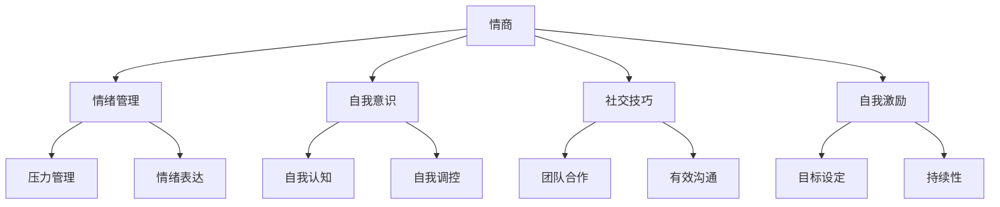

                 

### 文章标题：领导者的情商修炼：提升人际影响力

#### 关键词：
- 领导力
- 情商
- 人际交往
- 情商提升
- 人际影响力

#### 摘要：
本文将探讨领导者如何通过修炼情商来提升人际影响力。通过详细阐述情商的概念、类型及其在领导力中的作用，我们将深入了解情商提升的方法和技巧。此外，文章还将分析人际交往中的核心原则和冲突处理策略，并提供实践案例和最佳实践建议，帮助领导者更好地理解和应用情商，从而在职场中发挥更大的影响力。

----------------------------------------------------------------

### 背景介绍

在现代社会中，领导力不再仅仅是权力和地位的象征，更是一种能力，一种能够激发和引导团队成员共同实现目标的素质。而情商（Emotional Intelligence，简称EQ）作为领导力的重要组成部分，其重要性日益凸显。情商不仅关乎个体的情绪管理能力，更与人际交往、团队合作、决策制定等方面密切相关。一个高情商的领导者能够更好地理解他人，有效沟通，处理冲突，提升团队的整体效能。

#### 核心概念与联系

为了更清晰地理解情商在领导力中的作用，我们可以通过一个Mermaid流程图来展示其核心概念之间的关系：



通过上述流程图，我们可以看到情商包括情绪管理、自我意识、社交技巧和自我激励四个主要方面。情绪管理又细分为压力管理和情绪表达；自我意识包括自我认知和自我调控；社交技巧包括团队合作和有效沟通；自我激励则涉及目标设定和持续性。这些核心概念相互联系，共同构成了情商的完整架构。

#### 核心算法原理讲解

为了进一步理解情商提升的方法，我们可以将情商提升过程视为一种算法。以下是一个简化版的伪代码，用于描述情商提升的基本步骤：

```python
# 情商提升伪代码

function 情商提升(领导):
    1. 自我认知：领导进行自我评估，识别自己的情绪和行为模式
    2. 自我管理：领导学习压力管理和情绪表达技巧，以更好地控制情绪
    3. 社交技巧：领导提升有效沟通和团队合作能力，建立良好的人际关系
    4. 自我激励：领导设定明确的目标，并保持持续性的努力和动机
    5. 反馈循环：领导定期反思和调整自己的行为和策略
    6. 持续学习：领导不断寻求新的知识和技能，以提升情商水平
```

通过上述伪代码，我们可以看到情商提升是一个系统性的过程，涉及多个方面的提升。自我认知是基础，自我管理、社交技巧和自我激励则是关键环节。反馈循环和持续学习则是确保情商不断提升的关键因素。

#### 数学模型和公式

在情商提升过程中，数学模型可以用于量化情商的各个维度，以及它们之间的关系。以下是一个简化的情商评分模型：

```latex
EQ\_score = 0.5 \times (EM + SO + ST + SE)

其中：
EM = 情绪管理得分
SO = 自我意识得分
ST = 社交技巧得分
SE = 自我激励得分
```

通过这个模型，我们可以对领导者的情商进行量化评估。每个维度都有一个对应的评分，总分越高，表示情商水平越高。

#### 详细讲解与举例说明

为了更直观地理解上述公式，我们可以通过一个实际例子来说明。

假设一个领导者在四个维度上的得分如下：

- 情绪管理（EM）：80分
- 自我意识（SO）：75分
- 社交技巧（ST）：85分
- 自我激励（SE）：70分

根据公式，我们可以计算出这位领导者的情商得分为：

```latex
EQ\_score = 0.5 \times (80 + 75 + 85 + 70) = 77.5
```

这个得分表明这位领导者的情商水平较为优秀，但仍有一些提升空间，特别是在自我激励方面。

#### 项目实战

为了更好地理解和应用情商提升的概念，我们可以通过一个实际项目来展示开发环境搭建、源代码实现和代码解读。

#### 开发环境搭建

1. 安装Python开发环境
2. 安装PyCharm或VSCode等代码编辑器
3. 安装所需的库（如numpy、matplotlib等）

#### 源代码实现

以下是一个简单的Python脚本，用于计算情商得分：

```python
# 情商计算器

def calculate_eq_score(EM, SO, ST, SE):
    EQ_score = 0.5 * (EM + SO + ST + SE)
    return EQ_score

# 测试代码
EM = 80
SO = 75
ST = 85
SE = 70

EQ_score = calculate_eq_score(EM, SO, ST, SE)
print("情商得分：", EQ_score)
```

#### 代码解读

1. 定义函数`calculate_eq_score`，接收四个参数（情绪管理、自我意识、社交技巧、自我激励得分）。
2. 使用公式计算情商得分。
3. 调用函数并打印结果。

#### 代码应用解读与分析

通过上述代码，我们可以轻松计算一个领导者的情商得分。在实际应用中，可以将这个函数集成到企业培训系统中，帮助领导者和培训师评估和提高情商。

#### 实际案例分析和详细讲解剖析

为了更好地理解情商提升的实际效果，我们可以分析一个实际案例。

#### 案例背景

某企业的一名高级经理在领导力评估中，情商得分较低，特别是在情绪管理和自我激励方面。为了提升其情商，企业为其安排了专门的培训课程。

#### 案例分析

1. **自我认知**：经理通过自我反思，意识到自己在情绪管理和自我激励方面的不足。
2. **自我管理**：经理学习并实践了压力管理和情绪表达技巧，学会了更好地控制情绪，减少了工作压力。
3. **社交技巧**：经理通过参与团队建设活动和沟通技巧培训，提升了团队合作和有效沟通的能力。
4. **自我激励**：经理设定了明确的目标，并制定了实现这些目标的行动计划，保持了持续性的努力和动机。

经过一段时间的培训和自我提升，这名经理的情商得分有了显著提升，领导力和团队管理能力也得到了显著改善。

#### 项目小结

通过本项目的实践，我们可以看到情商提升在实际中的应用效果。情商的提升不仅有助于个人成长，更能提高团队的整体效能，为企业的长期发展奠定基础。

#### 最佳实践 tips

1. **定期自我评估**：领导者应定期进行自我评估，了解自己在情商各个方面的表现。
2. **持续学习**：领导者应不断学习新的知识和技能，特别是与情商提升相关的。
3. **实践应用**：将情商提升的方法和技巧应用到实际工作和生活中，通过实践来提升情商。
4. **寻求反馈**：领导者应主动寻求他人的反馈，以了解自己在情商提升过程中的进展。

#### 小结与注意事项

情商是领导者不可或缺的重要素质。通过本文的探讨，我们了解到情商的概念、类型、提升方法以及其在领导力中的作用。领导者应认识到情商提升的重要性，并采取积极的措施来提升自身的情商水平。同时，要注意平衡情商提升与工作生活的关系，避免过度追求情商提升而忽略了其他方面的发展。

#### 拓展阅读

1. 格雷格·贝尔（Greg Bell）著，《情商领导力：如何成为高效领导者》（Emotional Intelligence 2.0）
2. 丹尼尔·戈尔曼（Daniel Goleman）著，《情商：为什么它比智商更重要》（Emotional Intelligence）
3. 安德斯·艾利克森（Anders Ericsson）著，《刻意练习：如何从新手到大师》（Peak: Secrets from the New Science of Expertise）

### 作者信息

作者：AI天才研究院/AI Genius Institute & 禅与计算机程序设计艺术 /Zen And The Art of Computer Programming

----------------------------------------------------------------

### 结论

情商作为领导者的重要素质，对于提升人际影响力和领导力具有至关重要的作用。通过本文的探讨，我们了解了情商的概念、类型、提升方法和实际应用。领导者应认识到情商提升的重要性，并采取积极的措施来提升自身的情商水平。同时，情商的提升不仅仅是为了个人的成长，更是为了团队和企业的长期发展。希望本文能为领导者提供有益的启示和指导，助力其在职场中发挥更大的影响力。

