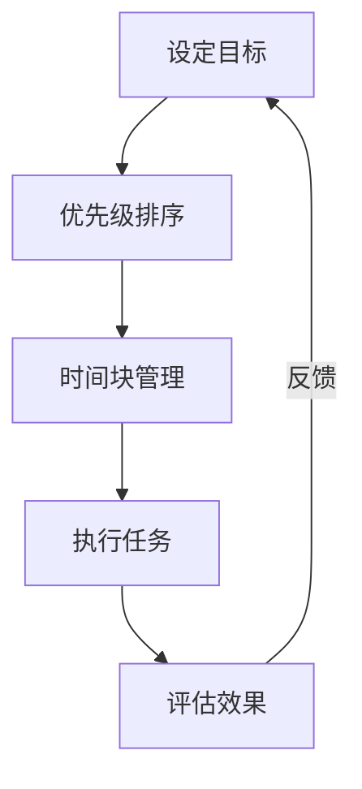

                 


### 文章标题：《领导者的时间管理：效率提升的关键》

#### 关键词：时间管理、效率提升、领导者、工作方法、实践应用

#### 摘要：
本文旨在探讨领导者如何在繁忙的工作中实现时间管理，提高个人及团队的工作效率。通过分析时间管理的基本概念、心理学原理、策略与工具，并结合实际案例，提供了一套系统的领导时间管理方法。

---

# 引言

在快节奏的现代社会中，时间管理已成为领导者不可或缺的技能。有效的时间管理不仅能提高个人的工作效率，还能带动整个团队向着共同目标迈进。然而，许多领导者面临诸多时间管理挑战，如任务繁多、决策负担重、沟通效率低下等。本文将系统地探讨领导者如何通过时间管理实现效率提升，旨在为读者提供一套实用且有效的时间管理策略。

---

## 第一部分：时间管理的基本概念与原理

### 第1章：时间管理的重要性

#### 1.1 时间管理的基本概念

时间管理是指通过规划和组织时间，以实现个人或团队目标的过程。对于领导者而言，时间管理尤为重要，因为它直接影响到工作效率、决策质量和团队士气。

#### 1.2 时间管理的基本原则

1. **明确目标**：设定清晰的目标是时间管理的第一步。领导者需要明确个人和团队的目标，以便合理安排时间和资源。
2. **优先级排序**：根据目标的紧急程度和重要性，对任务进行排序，确保关键任务优先处理。
3. **时间块管理**：将时间划分为若干块，为每个任务分配特定的时间段，以提高专注度和效率。
4. **定期回顾**：定期回顾时间管理的效果，调整计划以适应变化。

#### 1.3 时间管理的误区与挑战

1. **拖延症**：领导者常常因为拖延而错过重要任务的截止日期。
2. **决策负担**：面对众多决策，领导者可能陷入选择困境，浪费大量时间。
3. **沟通效率低**：不充分的沟通会导致重复工作和误解，降低工作效率。

### 第2章：时间管理心理学

#### 2.1 时间感知与时间观念

时间感知是指个体对时间的感受和认知。领导者需要培养正确的时间观念，避免时间浪费和过度焦虑。

#### 2.2 心理因素对时间管理的影响

1. **情绪因素**：情绪波动会影响时间的感知和分配。
2. **认知因素**：认知能力的高低影响决策速度和任务处理的效率。
3. **行为因素**：良好的行为习惯有助于提高时间管理效果。

#### 2.3 增强时间管理意识的策略

1. **时间日志**：记录每天的时间花费，帮助领导者了解时间分配情况。
2. **时间预算**：为每个任务设定时间预算，避免过度占用时间。
3. **专注训练**：通过专注训练提高时间利用效率。

---

## 第二部分：时间管理的方法与工具

### 第3章：时间管理策略

#### 3.1 设定目标和优先级

目标设定是时间管理的核心。领导者需要明确个人和团队的目标，并设定可衡量的里程碑。

#### 3.2 时间块管理法

时间块管理法是将时间划分为若干块，每个块专注于一个任务。这种方法有助于提高专注度和效率。

#### 3.3 时间窃贼识别与应对

时间窃贼是指那些干扰我们时间管理的因素，如社交媒体、邮件等。领导者需要识别并应对这些时间窃贼。

### 第4章：时间管理工具

#### 4.1 日历与日程管理工具

日历和日程管理工具可以帮助领导者更好地规划时间和任务，如Google日历、Outlook等。

#### 4.2 待办事项管理与任务追踪工具

待办事项和任务追踪工具可以帮助领导者记录和追踪任务进度，如Trello、Asana等。

#### 4.3 项目管理工具

项目管理工具可以帮助领导者管理复杂项目，如Jira、Trello等。

### 第5章：提高工作效率

#### 5.1 减少决策负担

领导者可以通过简化决策流程、授权下属等方式减少决策负担。

#### 5.2 提高沟通效率

领导者需要建立高效的沟通机制，确保信息流畅，减少误解和重复工作。

#### 5.3 破解拖延症

领导者可以通过制定明确的目标和计划、建立奖惩机制等方式破解拖延症。

---

## 第三部分：领导者的时间管理实践

### 第6章：领导者的时间管理风格

#### 6.1 领导者的时间管理类型

领导者可以根据个人特点和团队需求，选择适合的时间管理风格，如“任务导向型”、“目标导向型”等。

#### 6.2 适应不同情境的时间管理策略

领导者需要根据不同情境调整时间管理策略，如危机管理、日常运营等。

#### 6.3 建立团队的时间管理文化

领导者可以通过培训、激励等方式建立团队的时间管理文化，提高整体效率。

### 第7章：时间管理在团队管理中的应用

#### 7.1 团队时间管理的挑战

团队时间管理面临挑战，如团队成员时间观念不一、任务分配不均等。

#### 7.2 团队时间管理的最佳实践

领导者可以通过制定团队目标、建立时间管理机制等方式，提高团队时间管理效果。

#### 7.3 时间管理的团队领导力

领导者需要具备时间管理的领导力，以激励和引导团队成员实现时间管理的最佳效果。

### 第8章：时间管理案例分析

#### 8.1 成功的领导者时间管理案例

通过分析成功领导者的时间管理实践，我们可以学习到一些实用的方法和经验。

#### 8.2 失误的领导者时间管理案例

分析领导者时间管理中的失误，可以帮助我们避免类似的错误。

#### 8.3 案例分析与启示

结合案例，深入分析时间管理的实际应用，为读者提供有价值的启示。

---

## 附录

### 附录A：时间管理资源汇总

#### A.1 经典时间管理书籍推荐

- 《时间管理的艺术》
- 《高效能人士的七个习惯》
- 《深度工作》

#### A.2 在线时间管理工具介绍

- Trello
- Asana
- Google日历

#### A.3 时间管理培训课程推荐

- 时间管理大师课程
- 高效沟通与时间管理

---

**Mermaid 流程图示例**：



**核心算法原理讲解（伪代码）**：

```python
# 时间块管理法伪代码
def time_Block_Management(tasks, deadlines):
    time_blocks = []
    sorted_tasks = sort_by_priority(tasks)
    
    for task in sorted_tasks:
        if can_allocate(task, deadlines):
            time_blocks.append(allocate_time_to_task(task, deadlines))
        else:
            print("无法为任务分配时间")
            
    return time_blocks
```

**数学模型和公式讲解**：

$$
效率 = \frac{完成任务的数量}{消耗的时间}
$$

举例说明：如果一个领导者每天可以完成10个任务，且总共花费了8小时，则他的效率为：

$$
效率 = \frac{10}{8} = 1.25 \text{（个任务/小时）}
$$

**项目实战**：

环境搭建：使用Python和Jira进行时间管理实践。

源代码实现：编写Python脚本，实现任务排序、时间块管理和任务分配。

代码解读与分析：详细解读代码实现过程，分析时间管理算法的效率和效果。

实际案例分析和详细讲解剖析：结合实际案例，分析时间管理策略在不同情境下的应用效果。

项目小结：总结项目实施过程中的经验教训，为读者提供实用的时间管理建议。

---

**最佳实践 tips**：

1. **定期反思**：定期回顾时间管理效果，及时调整策略。
2. **避免完美主义**：合理分配时间，避免过度追求完美。
3. **学会说“不”**：拒绝不重要的任务，专注于核心工作。

**小结**：

本文通过深入探讨领导者时间管理的核心概念、方法与实践，旨在为读者提供一套实用的时间管理策略。通过不断学习和实践，领导者可以提升个人和团队的工作效率，实现组织目标。

**注意事项**：

1. 时间管理并非一成不变，需要根据实际情况进行调整。
2. 时间管理工具的选择需结合个人和团队的实际情况。

**拓展阅读**：

- 《时间管理的实践艺术》
- 《团队时间管理：提升团队效率的实战指南》
- 《时间管理心理学》

---

**作者信息**：

作者：AI天才研究院/AI Genius Institute & 禅与计算机程序设计艺术 /Zen And The Art of Computer Programming

---

以上是根据您提供的信息和步骤设计出的《领导者的时间管理：效率提升的关键》的目录大纲。接下来，我们可以根据这个大纲逐步撰写文章内容，确保每个部分都包含详细的讲解和实用的方法。文章的整体结构应该清晰、逻辑性强，以便读者能够轻松理解和应用。如果需要对某个部分进行修改或添加，请随时告知。让我们一步一步地完成这篇文章，为读者带来有价值的阅读体验。

