                 

## 引言

### 沟通技巧的重要性

沟通是现代职场中不可或缺的一部分，无论是在个人职业发展还是团队协作中都扮演着至关重要的角色。有效的沟通不仅能够帮助领导者更好地传达信息、指导团队，还能提高团队的协作效率和整体绩效。然而，沟通并非易事，尤其对于领导者来说，如何在复杂多变的工作环境中保持清晰、准确的传达，更是需要掌握一定的技巧和策略。

在当今高度竞争的商业环境中，领导者不仅要具备技术和管理能力，还需要具备出色的沟通技巧。沟通不仅仅是指语言上的交流，更包括了倾听、理解、表达和反馈等全方位的互动。领导者通过有效的沟通，可以确保团队成员对任务和目标有清晰的认识，增强团队的凝聚力和执行力，从而在激烈的市场竞争中取得优势。

本篇文章旨在探讨领导者的沟通技巧，特别是如何通过清晰传达来提升领导效能。我们将从沟通的重要性、基础原则和技巧、领导者角色与沟通、内部和外部沟通策略、危机沟通、跨文化沟通以及沟通技巧提升等方面，系统地分析和探讨领导者在沟通中的关键要素和方法。

通过本文的阅读，读者将了解到：

1. 沟通的基本概念和重要性。
2. 领导者沟通的角色和影响力。
3. 如何在组织内部和外部进行有效沟通。
4. 在危机情况下如何进行有效沟通。
5. 如何处理跨文化沟通的挑战。
6. 提升沟通技巧的方法和策略。

本文采用逻辑清晰、结构紧凑、简单易懂的专业技术语言，通过一步一步的分析和推理，帮助读者深入理解沟通技巧的本质和应用。让我们开始这场关于沟通艺术的探索之旅。

## 沟通的基本概念

沟通是信息在不同个体或群体之间传递和理解的过程，是建立和维护人际关系、解决冲突、协调行动的重要手段。在领导者的角色中，沟通不仅是日常工作的必需品，更是实现团队目标和战略的关键工具。

### 沟通的定义

沟通可以定义为信息的交换、理解和反馈的过程。其核心要素包括发送者、信息、渠道、接收者和反馈。一个有效的沟通循环需要这些要素之间的顺畅互动，如下图所示：

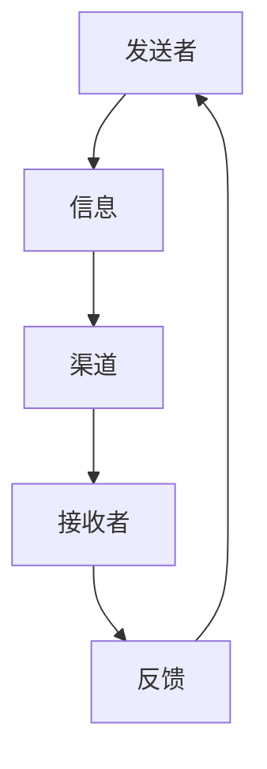

在这个模型中，发送者负责准备和发送信息，信息通过渠道传递到接收者，接收者接收并解读信息，然后提供反馈。这一过程循环往复，使得沟通成为一个动态的系统。

### 沟通的目的

沟通的目的多种多样，主要包括以下几种：

1. **信息传递**：确保信息准确、及时地传达，使团队成员了解任务、目标和工作进展。
2. **建立关系**：通过有效的沟通，建立和维护良好的人际关系，增强团队的凝聚力和合作精神。
3. **解决冲突**：通过对话和协商，解决团队内部的矛盾和分歧，避免矛盾升级。
4. **决策支持**：在决策过程中，通过广泛的沟通获取多方意见，提高决策的质量和接受度。
5. **激励和反馈**：通过积极的沟通，激励团队成员，提供及时的反馈，促进个人和团队的发展。

### 沟通的重要性

沟通的重要性体现在以下几个方面：

1. **团队协作**：有效的沟通能够确保团队成员对任务和目标有清晰的认识，提高团队协作的效率和效果。
2. **领导效能**：领导者的沟通技巧直接影响其领导效能。清晰、准确的传达能够增强领导者的权威和影响力。
3. **冲突管理**：通过有效的沟通，可以预防和解决团队内部的冲突，维护团队的稳定和和谐。
4. **信息共享**：良好的沟通促进信息的流通和共享，有助于团队获取更多的资源和支持。
5. **组织绩效**：沟通是组织内部和外部联系的重要桥梁，有效的沟通有助于提升组织的整体绩效。

总之，沟通不仅是领导者不可或缺的技能，也是团队和组织成功的关键因素。通过理解和掌握沟通的基本概念和目的，领导者可以更好地运用这些技巧，提升自己的领导效能和团队绩效。

### 沟通的基本原则

为了确保沟通的效率和效果，领导者需要遵循一系列基本沟通原则。这些原则涵盖了沟通的各个方面，包括对称性、透明度和共情等，它们共同构成了有效沟通的基石。

#### 对称性原则

对称性原则强调沟通双方在信息传递和接收过程中的平等地位。这意味着领导者不仅要主动传递信息，还要倾听下属的意见和反馈。对称性原则的关键在于打破信息不对称，使团队中的每个成员都能参与到沟通过程中，从而提高信息传递的准确性和透明度。具体来说，领导者可以通过以下方法实现对称性：

1. **主动倾听**：领导者应主动倾听下属的意见和反馈，给予充分的注意和回应。
2. **开放式提问**：通过开放式提问，鼓励下属表达自己的观点和想法，增加互动。
3. **平等对话**：确保沟通过程中没有等级差距，每个成员都能自由地发表意见。

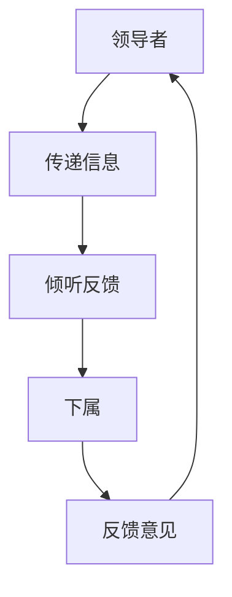

#### 透明度原则

透明度原则要求沟通的内容和过程公开透明，使团队成员能够了解信息来源、处理方式和决策过程。透明度不仅有助于建立信任，还能减少误解和猜疑，提高团队的凝聚力和合作精神。为了实现透明度，领导者可以采取以下措施：

1. **信息公开**：定期发布组织内部的各类信息，包括战略规划、项目进展、绩效评估等。
2. **公开会议**：组织定期的公开会议，邀请所有团队成员参与，讨论和解决重要问题。
3. **沟通渠道**：建立多样化的沟通渠道，如邮件、内部社交平台、即时通讯工具等，确保信息流通的顺畅。

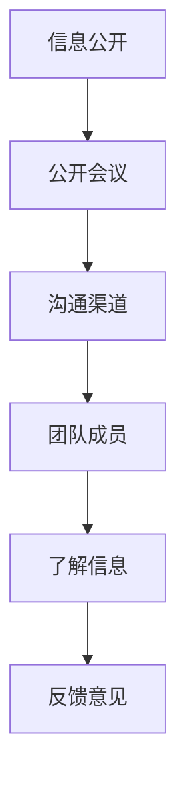

#### 共情原则

共情原则强调领导者在与下属沟通时，应站在对方的角度理解和感受，建立情感上的联系。通过共情，领导者能够更好地理解下属的需求和困惑，提供有针对性的支持和帮助。共情原则的关键在于以下几点：

1. **倾听和理解**：领导者需要耐心倾听下属的发言，理解其情感和需求。
2. **情感共鸣**：在适当的场合，领导者可以表达对下属的情感认同，增强信任和归属感。
3. **情感支持**：在下属遇到困难或挑战时，领导者应提供情感上的支持，帮助其克服困难。

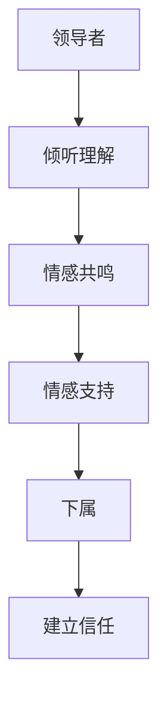

通过遵循这些基本原则，领导者可以大幅提升沟通的效率和质量，建立更加和谐、高效的团队。这些原则不仅适用于日常沟通，更是在面对复杂问题和挑战时，领导者保持清晰传达和有效领导的重要保障。

### 沟通技能

有效的沟通不仅仅依赖于良好的意愿和原则，更需要一系列具体的沟通技能。这些技能包括倾听技巧、非语言沟通、情绪管理等方面，它们共同构成了领导者沟通能力的基石。

#### 倾听技巧

倾听是沟通的核心要素之一，不仅是为了获取信息，更是为了建立信任和理解。良好的倾听技巧包括以下几个方面：

1. **主动倾听**：领导者应全神贯注地倾听对方的话语，避免在听的过程中分心或打断。
2. **反馈与确认**：通过重复对方的关键信息或提出相关问题，确认自己理解准确，同时鼓励对方继续表达。
3. **避免预判**：在对方讲话时，避免过早做出判断或假设，以免误解对方的意思。

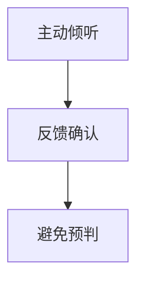

#### 非语言沟通

非语言沟通是通过肢体语言、面部表情、姿势等非言语手段进行的信息传递。在沟通中，非语言因素往往能传递比语言更丰富的信息。领导者应注重以下几点：

1. **肢体语言**：通过适当的肢体动作，如点头、眼神交流、开放姿势等，表达对对方的关注和认同。
2. **面部表情**：保持真诚和热情的面部表情，以增强沟通的亲和力和信任感。
3. **姿态控制**：避免过于僵硬或放松的姿态，保持自然和适度的肢体语言，以传达自信和稳定。

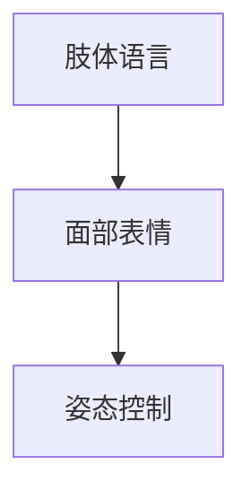

#### 情绪管理

情绪管理是领导者沟通中的重要技能，尤其是在高压和紧张的工作环境中。领导者需要学会控制自己的情绪，避免情绪对沟通产生负面影响。以下是一些情绪管理的技巧：

1. **情绪自我觉察**：领导者应时刻关注自己的情绪变化，识别情绪的触发点和原因。
2. **情绪调节**：通过深呼吸、冥想或其他放松技巧，调节情绪，保持冷静和理智。
3. **情绪释放**：在适当的时候，通过适当的渠道释放情绪，如与信任的同事或朋友交流，避免情绪积累。

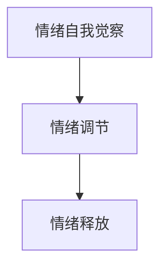

通过掌握这些沟通技能，领导者能够在复杂多变的工作环境中保持清晰、准确的传达，增强团队凝聚力和执行力。这些技能不仅有助于提升领导效能，还能促进组织内部的和谐与稳定。

### 沟通障碍及克服方法

尽管领导者具备良好的沟通意愿和技能，但在实际沟通过程中，仍可能遇到各种障碍，影响沟通的效果。识别并克服这些障碍，是确保信息准确传达和有效理解的关键。

#### 信息过滤

信息过滤是指沟通过程中信息被有意或无意地筛选、修改或省略，导致接收者无法获得完整的信息。信息过滤的常见原因包括：

1. **个人偏见**：接收者可能基于个人经验和观点，对信息进行选择性接收。
2. **心理防御**：当信息与接收者的预期不符时，他们可能会通过过滤来保护自己的心理防御。

**克服方法**：

1. **增强透明度**：提高沟通的透明度，确保信息的真实性和完整性。
2. **开放式提问**：通过开放式提问，鼓励接收者表达自己的看法和疑问，减少信息过滤。

#### 文化差异

文化差异是跨文化沟通中的一大障碍。不同文化背景下的个体可能在沟通方式、语言习惯、价值观等方面存在显著差异。例如，某些文化强调直接表达，而另一些文化则偏好委婉和间接。

**克服方法**：

1. **文化敏感性培训**：为团队成员提供文化敏感性培训，增强跨文化沟通的能力。
2. **文化适应性调整**：领导者应了解不同文化背景下的沟通习惯，根据实际情况调整自己的沟通方式。

#### 误解

误解是沟通中的常见问题，由于信息传递过程中的误差、语言障碍或情感因素，接收者可能对信息产生错误的理解。

**克服方法**：

1. **反馈机制**：建立有效的反馈机制，确保接收者能够表达对信息的理解和疑惑，并及时进行澄清。
2. **简化信息**：尽量使用简单、清晰的语言表达，避免复杂和模糊的表述。

#### 情绪干扰

情绪干扰是另一个影响沟通效果的因素。当领导者或团队成员情绪波动较大时，他们可能难以保持冷静和理智，从而影响沟通的质量。

**克服方法**：

1. **情绪管理**：通过情绪管理技巧，如深呼吸、冥想等，帮助领导者控制情绪，避免情绪干扰。
2. **心理支持**：提供心理支持渠道，帮助团队成员在情绪波动时寻求帮助，确保沟通的顺利进行。

通过识别并克服这些沟通障碍，领导者可以大幅提升沟通的效率和效果，确保信息准确传达和理解，从而提升团队的整体绩效和领导效能。

### 领导者角色与沟通

领导者的角色不仅仅是管理和指导团队，更是通过沟通来影响和激励团队成员，实现组织目标的重要角色。有效的沟通不仅能够增强领导者的权威和影响力，还能促进团队的协作和成长。

#### 领导者的沟通角色

在组织中，领导者的沟通角色具有多重性。首先，领导者是信息的传递者和解释者，他们需要将组织的战略、目标和任务传达给团队成员，确保每个人对任务和目标有清晰的理解。其次，领导者是倾听者和反馈者，他们需要倾听团队成员的意见和反馈，了解团队的实际状况和需求，及时做出调整和优化。最后，领导者是协调者和调解者，他们需要在团队内部和外部协调各种资源和支持，解决冲突和问题，确保团队的稳定和高效运行。

#### 领导者的影响力沟通

领导者的影响力沟通是指通过有效的沟通方式，对团队成员产生积极影响，激发他们的工作热情和创造力。以下是一些关键策略：

1. **明确传达目标和愿景**：领导者应通过清晰、简洁的语言，将组织的愿景和目标传达给团队成员，让他们理解自己工作的意义和价值。
2. **激励和鼓励**：领导者应善于发现团队成员的优点和成就，通过表扬和激励，增强他们的自信心和积极性。
3. **建立信任**：信任是领导力的核心要素，领导者应通过诚实、透明和开放的沟通，建立与团队成员的信任关系，提高团队的凝聚力和合作精神。
4. **提供反馈和指导**：领导者应及时提供反馈和指导，帮助团队成员改进工作方法，提升工作效率和质量。

#### 激励沟通

激励沟通是领导者通过有效的沟通技巧，激发团队成员的内在动机和工作热情的重要方式。以下是一些激励沟通的策略：

1. **明确期望和目标**：领导者应明确团队成员的工作目标和期望，确保他们了解自己的职责和任务，从而提高工作动力。
2. **认可和奖励**：领导者应对团队成员的成就和努力给予认可和奖励，增强他们的成就感和自我价值感。
3. **创造积极的工作氛围**：领导者应营造一个积极、开放和包容的工作氛围，鼓励团队成员分享想法和意见，激发创新思维。
4. **提供成长机会**：领导者应提供培训和发展机会，帮助团队成员提升技能和知识，实现职业发展。

通过有效的沟通，领导者不仅能够确保信息的准确传达和有效理解，还能激励团队成员，增强团队的凝聚力和执行力，从而实现组织的目标和愿景。

### 内部沟通技巧

在组织内部，领导者需要运用一系列具体的沟通技巧，以确保信息的有效传递、团队协作的顺利进行以及冲突的及时解决。以下是一些关键的内部沟通策略。

#### 团队协作与沟通

团队协作是组织高效运营的基础，有效的沟通则是团队协作的重要保障。以下是一些团队沟通的技巧：

1. **建立沟通机制**：领导者应建立定期沟通的机制，如团队会议、工作汇报等，确保团队成员能够及时分享信息和进展。
2. **明确角色和责任**：每个团队成员应清楚自己的角色和责任，避免在沟通中产生混淆和重复。
3. **鼓励开放式沟通**：领导者应鼓励团队成员在沟通中表达自己的意见和想法，促进思想碰撞和创意的产生。

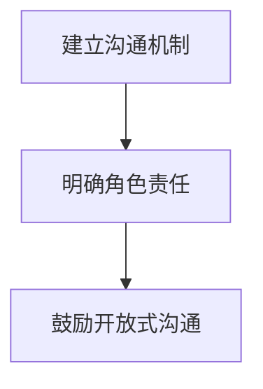

#### 反馈与表扬

反馈和表扬是激励团队成员、提升工作质量的重要手段。以下是一些提供反馈和表扬的技巧：

1. **具体和及时的反馈**：领导者应提供具体、及时的反馈，指出团队成员的表现和改进的方向，避免模糊和不具体的评价。
2. **正面反馈为主**：在反馈中，应强调团队成员的优点和成就，以正面反馈为主，鼓励他们继续努力。
3. **个性化表扬**：领导者应根据团队成员的特点和需求，提供个性化的表扬和奖励，增强他们的归属感和工作热情。

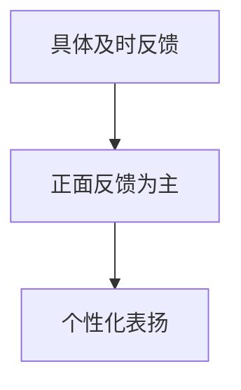

#### 沟通会议的策划与执行

沟通会议是团队内部信息交流的重要渠道，有效的会议策划和执行能大幅提升沟通效果。以下是一些关键点：

1. **明确会议目标和议程**：在会议前，明确会议的目标和议程，确保会议内容有条不紊。
2. **准备充分**：会议前，领导者应准备好必要的资料和报告，确保会议的顺利进行。
3. **积极参与和引导**：在会议中，领导者应积极参与讨论，引导团队成员围绕主题展开交流，避免偏离主题。
4. **总结和跟进**：会议结束后，领导者应总结会议结果，明确下一步行动和责任，确保会议决议得到有效执行。

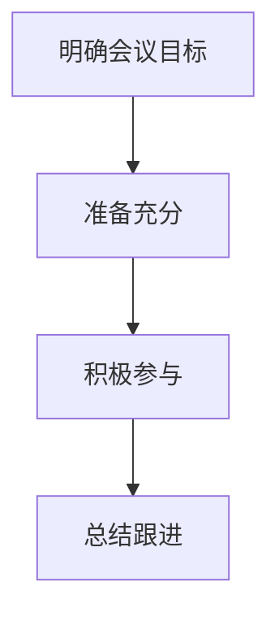

通过运用这些内部沟通技巧，领导者可以确保组织内部的信息畅通、团队协作高效，从而提升整体运营效率和绩效。

### 外部沟通技巧

在领导者与外部利益相关者（如客户、供应商、投资者等）进行沟通时，掌握适当的沟通技巧至关重要。这些利益相关者的需求和期望可能有所不同，但有效的沟通策略和方法可以确保信息的准确传达和双方关系的稳定发展。

#### 客户沟通策略

与客户进行有效沟通是确保客户满意度和忠诚度的关键。以下是一些客户沟通的策略：

1. **了解客户需求**：领导者应通过调查和沟通，了解客户的具体需求和期望，从而提供个性化的服务和解决方案。
2. **倾听与回应**：领导者应耐心倾听客户的意见和反馈，及时回应客户的问题和需求，增强客户的信任感。
3. **沟通透明**：在沟通中，领导者应保持透明度，明确地传达产品和服务的特性、优势和劣势，避免误导或隐瞒信息。

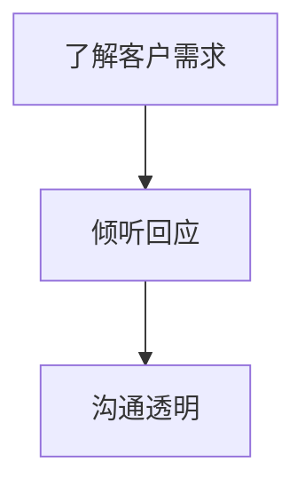

#### 供应商沟通策略

与供应商的沟通是确保供应链稳定和效率的重要环节。以下是一些与供应商沟通的策略：

1. **建立长期合作关系**：领导者应注重与供应商建立长期合作关系，通过定期沟通，增强双方的合作信任。
2. **明确沟通目标**：在与供应商沟通时，领导者应明确沟通的目标和议程，确保双方在沟通中聚焦关键问题。
3. **合作共赢**：领导者应与供应商共同探讨合作的机会和策略，寻求双赢的合作模式。

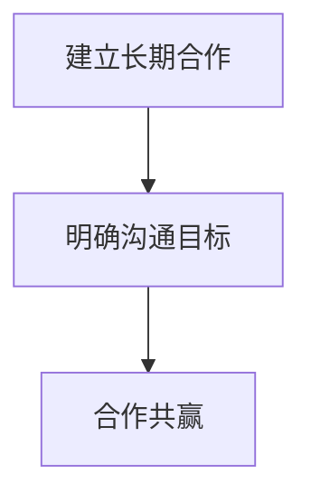

#### 投资者沟通策略

与投资者的有效沟通对于企业的融资和发展至关重要。以下是一些与投资者沟通的策略：

1. **传达公司战略**：领导者应清晰、准确地传达公司的战略目标和未来发展计划，使投资者对公司的前景有明确的认识。
2. **数据支持和说明**：在沟通中，领导者应提供充分的数据支持和详细的说明，增强投资者的信任和信心。
3. **建立信任关系**：通过定期沟通和透明的信息披露，领导者应与投资者建立信任关系，提高投资者的满意度和忠诚度。

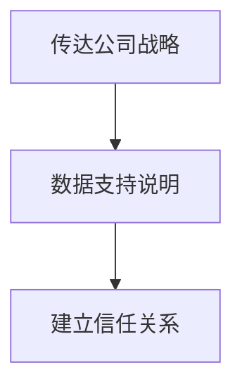

通过运用这些外部沟通技巧，领导者可以确保与外部利益相关者建立良好的合作关系，提升企业的整体运营效率和竞争力。

### 危机沟通

在组织面临危机时，领导者的沟通能力显得尤为重要。危机沟通不仅关系到组织形象的维护，还直接影响到员工的信心和团队的凝聚力。以下是在危机情况下进行有效沟通的策略和步骤。

#### 危机沟通的重要性

危机沟通在危机管理中具有关键作用。它不仅是危机响应的一部分，更是恢复组织声誉和信心的关键。有效的危机沟通可以迅速平息公众和媒体的关注，防止危机事态扩大，同时能够安抚员工和客户，确保团队的稳定和持续运作。

#### 危机沟通策略

1. **迅速反应**：危机发生后，领导者应迅速做出反应，立即启动危机沟通机制，确保信息传递的及时性和准确性。
2. **信息准确**：在危机沟通中，领导者应确保信息的准确性，避免误导或隐瞒事实，这有助于建立公众和员工对组织的信任。
3. **透明公开**：保持透明度是危机沟通的核心原则。领导者应公开披露危机事实、应对措施和进展情况，避免信息不对称引发的恐慌和猜疑。

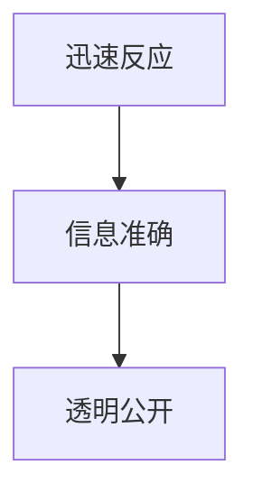

#### 危机沟通的步骤

1. **评估危机**：首先，领导者需要全面评估危机的性质、范围和影响，制定应对策略。
2. **成立危机沟通小组**：建立专门的危机沟通小组，负责危机信息的收集、分析和发布，确保沟通的协调和统一。
3. **制定沟通计划**：根据危机的性质和目标，制定详细的沟通计划，明确沟通的目标、受众、渠道和内容。
4. **发布危机声明**：通过新闻发布会、媒体发布、企业内部公告等方式，迅速向公众和内部员工传达危机信息。
5. **持续更新和跟进**：在危机过程中，领导者应持续更新信息，及时回应公众和媒体的关注，并根据危机进展调整沟通策略。

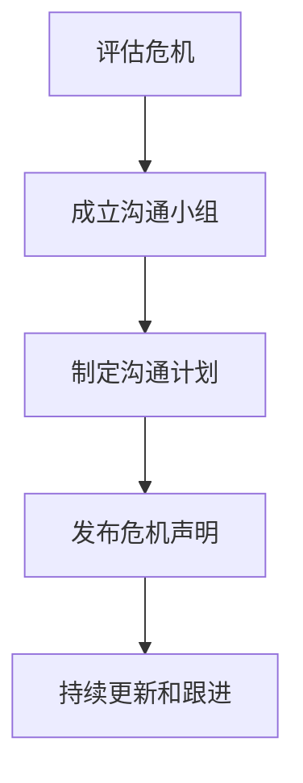

#### 危机沟通案例解析

**案例**：一家知名科技公司因软件漏洞导致大量用户数据泄露，引发了广泛关注和媒体报道。

**分析**：

1. **迅速反应**：公司高管在危机发生后迅速召开紧急会议，决定启动危机沟通机制。
2. **信息准确**：公司通过官方网站和社交媒体发布了详细的危机声明，包括漏洞的发现时间、影响范围、应对措施以及调查进展。
3. **透明公开**：公司主动与受影响的用户沟通，提供补救措施，并承诺加强数据保护措施。
4. **持续更新**：公司定期发布更新报告，通报危机调查的最新进展，回应公众和媒体的问题。

**效果**：通过上述沟通策略，公司迅速平息了公众的恐慌情绪，恢复了用户的信心，并有效防止了危机事态的扩大。

通过危机沟通策略和步骤的应用，领导者可以确保在危机情况下有效传递信息、维护组织形象，并最终帮助组织渡过危机，实现稳定和持续发展。

### 跨文化沟通

在全球化背景下，领导者不可避免地会遇到跨文化沟通的挑战。跨文化沟通涉及不同文化背景下的交流，需要领导者具备一定的文化敏感性和沟通策略，以避免误解和冲突，促进团队协作和项目的成功。

#### 跨文化沟通的概念

跨文化沟通是指在不同文化背景下进行的交流和信息传递过程。这些文化背景可能包括语言、价值观、行为规范、社会习俗等方面。跨文化沟通的复杂性和多样性使得领导者需要更加谨慎和敏感，以确保沟通的有效性和和谐性。

#### 跨文化沟通的挑战

1. **语言障碍**：不同语言的使用可能会导致信息误解和沟通障碍。语言不仅仅是交流的工具，还包含了文化背景和情感表达。
2. **价值观差异**：不同文化背景下的价值观可能存在显著差异，例如，某些文化可能更重视集体主义，而另一些文化则更强调个人主义。
3. **行为规范差异**：不同文化背景下的行为规范和礼仪可能有所不同，这些差异可能影响沟通的方式和效果。
4. **时间观念差异**：不同文化对时间的理解和使用方式可能存在差异，这可能会影响沟通的节奏和效率。

#### 跨文化沟通策略

1. **文化敏感性培训**：为团队成员提供文化敏感性培训，增强他们对不同文化的理解和尊重。
2. **语言学习**：鼓励团队成员学习当地语言，提高沟通的准确性和亲和力。
3. **透明沟通**：在跨文化沟通中，领导者应保持透明度，清晰传达信息，避免误解和猜疑。
4. **建立信任**：通过建立信任关系，增强团队成员之间的互信和理解，减少文化冲突。

#### 跨文化沟通实践

1. **跨国团队协作**：领导者可以组织跨国团队，通过跨文化沟通，提高团队协作效率和项目成功率。
2. **跨文化项目**：在跨国项目中，领导者应重视文化差异，制定相应的沟通策略和计划，确保项目的顺利推进。
3. **文化共享**：鼓励团队成员分享各自的文化背景和经验，增进相互了解，促进文化融合。

通过理解跨文化沟通的概念和挑战，并运用适当的策略和实践，领导者可以有效地处理跨文化沟通中的问题，促进团队协作和项目的成功。

### 提升沟通技巧

提升沟通技巧是每位领导者持续成长的重要任务。以下是一些具体的方法和练习，帮助领导者提升沟通能力，包括自我评估、沟通技巧训练和实际应用。

#### 自我评估与反馈

自我评估是提升沟通技巧的第一步。领导者可以通过以下方法进行自我评估：

1. **记录沟通情况**：定期记录自己的沟通情况，包括会议、邮件和对话，分析哪些方面做得好，哪些方面需要改进。
2. **寻求他人反馈**：向同事、下属和客户等寻求反馈，了解他们对自己的沟通方式的看法和建议。
3. **行为观察**：通过观察自己的行为，如肢体语言、语气和表情，识别需要改进的地方。

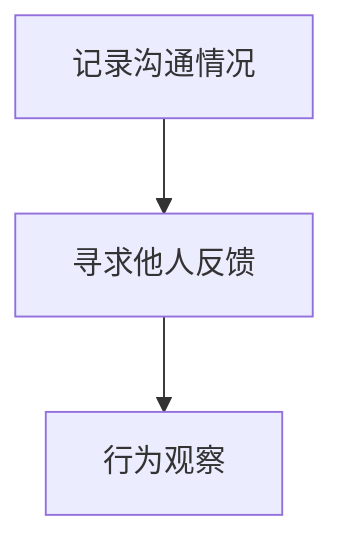

#### 沟通技巧训练

沟通技巧的训练是提升沟通能力的重要手段。以下是一些训练方法：

1. **模拟练习**：通过模拟真实沟通场景，如会议、谈判和演讲，进行角色扮演和模拟练习，提升实际沟通能力。
2. **演讲训练**：参加演讲培训，学习如何清晰、有逻辑地表达观点，增强公众演讲的能力。
3. **情感管理训练**：通过冥想、情感管理课程等，学习如何控制情绪，避免情绪对沟通的负面影响。

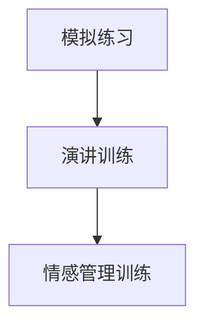

#### 提升沟通技巧的最佳实践

以下是一些提升沟通技巧的最佳实践：

1. **倾听技巧**：在沟通中，领导者应全神贯注地倾听对方的发言，避免分心和打断。
2. **开放式提问**：通过开放式提问，鼓励对方表达更多观点，提高沟通的深度和广度。
3. **简化语言**：使用简单、清晰的语言表达，避免使用过于复杂的术语和句子。
4. **情感共鸣**：在沟通中，领导者应尝试理解对方的情感和需求，建立情感上的联系。

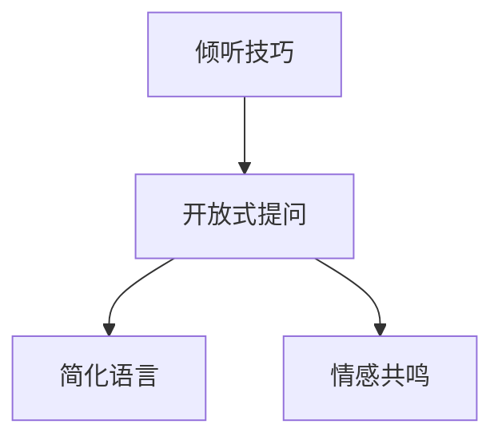

通过自我评估、沟通技巧训练和最佳实践的应用，领导者可以不断提升自己的沟通能力，确保信息的准确传达和有效理解，从而提升领导效能和团队绩效。

### 小结

通过本文的详细探讨，我们可以看到，有效的沟通是领导者不可或缺的重要技能。从基本概念到具体技巧，从内部沟通到外部沟通，再到危机沟通和跨文化沟通，每一个环节都展示了沟通在领导工作中的关键作用。沟通不仅仅是信息的传递，更是信任的建立、团队的凝聚和决策的支持。

领导者需要不断提升自己的沟通技巧，通过自我评估、专业训练和实际应用，确保沟通的清晰性和准确性。在面对复杂多变的工作环境时，良好的沟通能力能够帮助领导者迅速应对挑战，维护团队稳定，推动组织发展。

**注意事项**：

1. **持续学习和实践**：沟通技巧需要不断练习和改进，领导者应保持学习的态度，持续提升自己的沟通能力。
2. **重视反馈**：及时获取并重视他人的反馈，通过不断调整和改进，提升沟通效果。
3. **适应多样性**：在跨文化沟通中，领导者应尊重和适应不同文化的特点，避免文化冲突。

**拓展阅读**：

1. 《非暴力沟通》马歇尔·卢森堡
2. 《领导者的沟通力》斯蒂芬·罗宾斯
3. 《沟通的艺术》阿尔伯特·梅拉比安

通过深入学习和实践，领导者可以掌握沟通的艺术，提升自己的领导效能，为组织的发展创造更大的价值。

## 作者信息

**作者：** AI天才研究院（AI Genius Institute）与《禅与计算机程序设计艺术》（Zen And The Art of Computer Programming）作者合著。

AI天才研究院（AI Genius Institute）是一家专注于人工智能研究和应用的国际顶级机构，致力于推动人工智能领域的创新和发展。研究院的专家团队在人工智能算法、机器学习、深度学习和自然语言处理等方面具有深厚的研究背景和丰富的实践经验。

《禅与计算机程序设计艺术》是由世界著名计算机科学家唐纳德·克努特（Donald Knuth）所著的计算机编程经典之作，其独特的思想和方法对全球计算机科学界产生了深远的影响。本书融合了禅宗哲学和计算机编程的智慧，为程序设计提供了一种全新的视角和理念。

