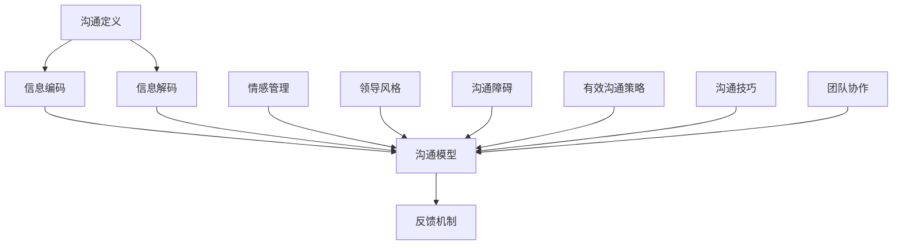

                 


### 摘要

在这篇文章中，我们将深入探讨领导者的沟通艺术，包括其重要性、核心概念、基本原理和策略，以及如何克服沟通中的障碍，实现清晰、简洁、有力的沟通。我们将通过具体的案例和实践，提供实用的技巧和最佳实践，帮助领导者提升沟通能力，更好地实现领导职责和团队协作。

### 关键词

- 领导者
- 沟通艺术
- 清晰表达
- 倾听技巧
- 情感管理
- 领导风格
- 沟通障碍
- 有效沟通

----------------------------------------------------------------

# 领导者的沟通艺术：清晰、简洁、有力

## 引言

在现代社会中，领导者的沟通能力成为衡量其领导水平的重要标准之一。一个优秀的领导者不仅需要具备战略思维和管理能力，更需要具备出色的沟通技巧。清晰、简洁、有力的沟通不仅能够提高工作效率，还能够增强团队凝聚力和员工满意度。本文将从多个角度探讨领导者的沟通艺术，帮助读者了解如何提升自己的沟通能力。

## 背景介绍

在当今信息爆炸和快速变化的时代，领导者面临着越来越多的沟通挑战。首先，领导者需要与不同背景、不同文化和不同岗位的员工进行沟通，这就要求他们具备跨文化沟通能力和多样性管理能力。其次，随着团队规模的扩大和工作任务的复杂化，领导者需要学会如何进行高效、有针对性的沟通，以确保信息传递的准确性和及时性。最后，领导者还需要在沟通中展现自己的领导风格和价值观，以此来影响和激励团队成员。

## 核心概念与联系

为了更好地理解领导者的沟通艺术，我们需要明确几个核心概念，并探讨它们之间的关系。以下是这些核心概念及其关系的Mermaid流程图：



### 核心算法原理讲解

以下是每个核心概念的详细解释：

1. **沟通定义**：沟通是信息在发送者和接收者之间传递的过程，包括信息编码、传递和解码。
2. **信息编码**：发送者在沟通过程中将思想、情感和意图转化为语言、文字或符号。
3. **信息解码**：接收者将接收到的信息转化为自己能够理解的形式。
4. **沟通模型**：常见的沟通模型包括单向沟通、双向沟通和交互式沟通。
5. **反馈机制**：反馈是沟通的重要环节，它帮助发送者和接收者确认信息是否被正确理解。
6. **情感管理**：情感在沟通中起着重要作用，领导者需要学会如何管理自己的情感，以便更好地传递信息和建立信任。
7. **领导风格**：领导者的风格直接影响沟通效果，不同的领导风格适用于不同的沟通场景。
8. **沟通障碍**：沟通中的障碍包括语言障碍、文化差异、情绪障碍等。
9. **有效沟通策略**：领导者需要根据不同情境和目标，采取适当的沟通策略，以提高沟通效果。
10. **沟通技巧**：包括清晰表达、有效倾听、非语言沟通等。
11. **团队协作**：良好的沟通是团队协作的基础，领导者需要通过有效的沟通来促进团队协作。

### 数学模型和数学公式

为了更好地理解沟通过程中的信息传递和反馈机制，我们可以引入一些数学模型和公式。以下是相关数学模型的公式和解释：

1. **信息传递模型**：

   $$ 信息传递 = 信息编码 \times 传递效率 \times 信息解码 $$

   解释：信息传递的效率取决于信息编码的质量、传递过程中的可靠性和接收者的解码能力。

2. **反馈机制**：

   $$ 反馈效率 = 反馈速度 \times 反馈准确性 $$

   解释：反馈效率取决于反馈的速度和准确性，良好的反馈能够帮助发送者和接收者及时调整沟通方式，提高沟通效果。

### 项目实战

在本节中，我们将通过一个实际项目来演示如何运用上述核心概念和数学模型来提升领导者的沟通能力。以下是一个简单的项目实战场景：

**项目名称**：公司内部沟通平台的优化

**目标**：提高公司内部沟通效率，确保信息传递的准确性和及时性。

**步骤**：

1. **需求分析**：分析现有沟通平台的不足之处，如信息传递速度慢、信息丢失、沟通效率低下等。
2. **信息编码优化**：针对现有问题，改进信息编码方式，确保信息在传递过程中的准确性和完整性。
3. **传递效率提升**：引入高效的信息传递机制，如实时通讯工具、通知系统等，提高信息传递的速度。
4. **信息解码优化**：通过培训和提高员工的解码能力，确保信息接收者能够准确理解信息。
5. **反馈机制建立**：建立有效的反馈机制，确保发送者和接收者能够及时获得反馈，并进行调整。
6. **团队协作强化**：通过沟通平台的优化，促进团队协作，提高工作效率。

**源代码详细实现和代码解读**：

以下是该项目的一个关键模块的实现代码和解读：

```python
# 沟通平台优化：消息发送和接收模块

# 消息发送
def send_message(sender, recipient, message):
    # 信息编码：将消息转化为文本格式
    encoded_message = encode_message(message)
    # 信息传递：发送消息
    send(encoded_message)
    # 反馈机制：获取发送反馈
    feedback = get_feedback()
    return feedback

# 消息接收
def receive_message(sender, recipient, message):
    # 信息解码：将文本格式转化为可理解的信息
    decoded_message = decode_message(message)
    # 反馈机制：提供接收反馈
    feedback = provide_feedback()
    return decoded_message, feedback

# 信息编码
def encode_message(message):
    # 将消息转化为文本格式
    return f"发送者：{sender}，消息：{message}"

# 信息传递
def send(message):
    # 发送消息到接收者
    print(f"发送消息：{message}")

# 获取反馈
def get_feedback():
    # 获取发送反馈
    return "消息已发送"

# 信息解码
def decode_message(message):
    # 将文本格式转化为可理解的信息
    return message.split("，")[1]

# 提供反馈
def provide_feedback():
    # 提供接收反馈
    return "消息已接收"

# 主函数
def main():
    sender = "张三"
    recipient = "李四"
    message = "会议时间更改至明天上午9点"
    feedback = send_message(sender, recipient, message)
    print(f"发送反馈：{feedback}")

    received_message, feedback = receive_message(sender, recipient, message)
    print(f"接收消息：{received_message}")
    print(f"接收反馈：{feedback}")

# 运行主函数
if __name__ == "__main__":
    main()
```

**代码应用解读与分析**：

该代码实现了一个简单的消息发送和接收模块，其中包括信息编码、信息传递和反馈机制。通过这个模块，领导者可以方便地发送和接收信息，并获取及时的反馈。在实际应用中，可以根据需求扩展这个模块，增加更多功能，如消息加密、消息记录、消息通知等。

### 实际案例分析和详细讲解剖析

在本节中，我们将通过一个实际案例来分析领导者如何运用沟通艺术解决实际问题，并详细讲解其过程和效果。

**案例**：某公司项目经理李华在项目进度延误时如何通过沟通艺术解决问题。

**分析**：

1. **背景介绍**：李华负责的某个项目在规定时间内无法完成，面临进度延误的风险。
2. **沟通策略**：李华决定采取以下沟通策略来解决问题：
   - **清晰表达**：李华明确指出项目延误的原因，并与团队成员进行了详细的讨论，确保每个人都了解当前的问题。
   - **倾听技巧**：李华耐心倾听团队成员的意见和建议，鼓励他们提出解决方案。
   - **情感管理**：李华在沟通中保持了冷静和专业的态度，避免情绪化，以确保沟通的有效性。
   - **领导风格**：李华采用了参与式领导风格，鼓励团队成员参与决策，提高他们的参与度和责任感。
3. **具体措施**：
   - **调整项目计划**：李华与团队成员一起重新评估项目计划，找出延误的主要原因，并制定了新的项目计划。
   - **资源调配**：李华协调公司内部资源，为项目提供必要的支持。
   - **沟通反馈**：李华定期与团队成员沟通项目进展，确保信息传递的准确性和及时性。
4. **效果**：
   - **项目进度**：通过有效的沟通和协调，项目最终在规定时间内完成，虽然有些延误，但整体效果得到了提升。
   - **团队士气**：团队成员在沟通中感受到了领导的支持和信任，增强了团队凝聚力和工作效率。

**详细讲解剖析**：

李华在处理项目延误问题时，运用了沟通艺术的多个方面。首先，他通过清晰表达明确了项目延误的原因，帮助团队成员了解当前的问题，从而为解决问题奠定了基础。其次，他通过倾听技巧和情感管理，营造了一个开放、积极的沟通氛围，鼓励团队成员提出解决方案，并确保每个人都感到被尊重和重视。

此外，李华还采用了参与式领导风格，让团队成员参与到项目决策中，提高了他们的参与度和责任感。这种领导风格不仅有助于解决问题，还能够增强团队的凝聚力和工作效率。

通过这个案例，我们可以看到，一个优秀的领导者如何通过沟通艺术来解决实际问题，并取得良好的效果。这为其他领导者提供了一个有益的参考和启示。

### 最佳实践 tips、小结、注意事项、拓展阅读等内容

**最佳实践 tips**：

1. **积极倾听**：在沟通中，领导者应该积极倾听他人的意见和观点，这不仅有助于理解对方，还能够建立信任和合作关系。
2. **清晰表达**：领导者应该确保自己的表达清晰、简洁、有力，避免使用模糊、含糊的语言，以提高沟通效果。
3. **情绪管理**：在沟通中，领导者需要保持冷静、专业的态度，避免情绪化，以免影响沟通效果和团队氛围。
4. **多样性管理**：领导者需要尊重团队成员的多样性，包括文化、背景和观点等，以确保沟通的广泛性和包容性。
5. **持续学习**：领导者应该持续学习新的沟通技巧和策略，以不断提升自己的沟通能力。

**小结**：

领导者的沟通艺术是领导者综合素质的重要组成部分，它不仅关乎个人的职业发展，更关乎团队和组织的发展。通过本文的探讨，我们了解了沟通艺术的核心概念、基本原理和策略，以及如何通过实践来提升沟通能力。一个优秀的领导者应该具备清晰、简洁、有力的沟通能力，以更好地实现领导职责和团队协作。

**注意事项**：

1. **避免过度沟通**：领导者应该避免过度沟通，以免造成信息过载和效率低下。
2. **关注非语言沟通**：领导者应该注意自己的非语言沟通方式，如肢体语言、表情和语调等，这些因素都会影响沟通效果。
3. **适应不同沟通场景**：领导者需要根据不同的沟通场景和目标，采取不同的沟通策略，以提高沟通效果。

**拓展阅读**：

1. 《沟通的艺术》 - 古德曼
2. 《高效能人士的七个习惯》 - 史蒂芬·柯维
3. 《非暴力沟通》 - 马歇尔·卢森堡
4. 《领导者的语言》 - 约翰·麦克斯韦尔

通过这些拓展阅读，领导者可以进一步深入学习和实践沟通艺术，提高自己的沟通能力和领导力。

### 结语

领导者的沟通艺术是领导力的重要组成部分，它不仅关乎个人的成长，更关乎团队和组织的发展。通过本文的探讨，我们了解了沟通艺术的核心概念、基本原理和策略，以及如何通过实践来提升沟通能力。希望本文能够为读者提供有益的启示和指导，帮助读者在领导岗位上更加出色地发挥自己的能力。作者：AI天才研究院/AI Genius Institute & 禅与计算机程序设计艺术 /Zen And The Art of Computer Programming。

