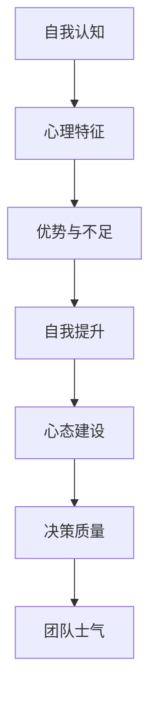
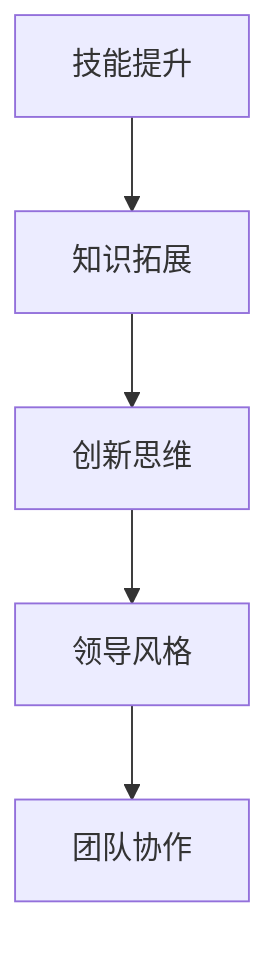
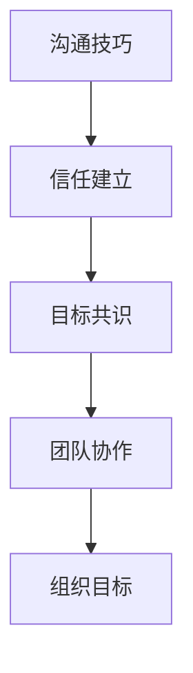
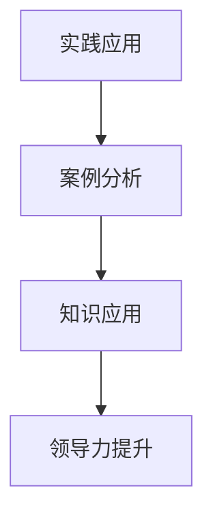
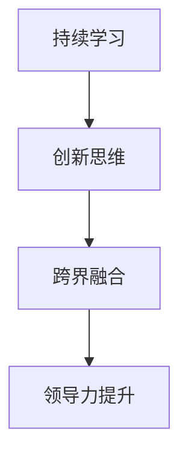

                 

# 领导者的自我修炼：从内而外的蜕变

## 关键词
- 领导力
- 自我认知
- 心态建设
- 沟通技巧
- 创新思维
- 领导风格

## 摘要
本文旨在探讨领导者如何通过自我修炼实现从内而外的蜕变，成为卓越的领导者。文章将从自我认知、心态建设、技能提升、实践应用和未来发展方向五个方面展开，结合理论讲解、实际案例分析和最佳实践，帮助读者了解和掌握领导者的自我修炼之道。

## 引言
领导者的角色在企业和社会中至关重要。他们不仅需要具备管理能力和决策智慧，更需要拥有强大的内心和积极的心态。在当今快速变化和充满挑战的商业环境中，领导者如何通过自我修炼实现从内而外的蜕变，成为卓越的领导者，成为了一个亟待解决的问题。

本文将围绕以下五个方面展开：
1. 自我认知与心态建设
2. 技能提升与知识拓展
3. 沟通技巧与团队协作
4. 实践应用与案例分析
5. 未来领导者的自我修炼

接下来，我们将逐一探讨这些方面，并结合具体案例和最佳实践，帮助读者理解领导者的自我修炼之道。

### 一、自我认知与心态建设

### 背景介绍
领导者的自我认知是指领导者对自己内在特质、行为模式、价值观和动机的深入了解。一个成功的领导者首先需要认识到自己的优势和不足，从而实现自我提升。

心态建设是领导者自我修炼的重要组成部分。积极的心态能够帮助领导者面对挑战和压力，提高决策质量和团队士气。

### 核心概念与联系
领导者自我认知与心态建设之间的联系可以用以下Mermaid流程图表示：



### 核心算法原理讲解
在自我认知方面，领导者可以通过以下步骤来提高自我认知：
1. 自我反思：定期进行自我反思，思考自己的行为、决策和价值观。
2. 倾听他人反馈：积极倾听他人的意见和建议，从中了解自己的盲点和不足。
3. 进行心理测试：通过专业心理测试，了解自己的性格特点和潜在行为模式。

在心态建设方面，领导者可以通过以下方法来培养积极心态：
1. 保持乐观：面对困难和挑战时，保持积极乐观的态度。
2. 增强心理韧性：通过锻炼和训练，提高应对压力和挫折的能力。
3. 学会放松：合理安排时间，进行适当的休息和放松，以保持良好的心态。

### 数学模型和公式 & 详细讲解 & 举例说明
心态建设可以采用以下数学模型来评估和改进：
1. 心态评分模型：通过计算领导者心态各维度的得分，评估整体心态状况。公式如下：
   $$心态评分 = \frac{乐观度 + 心理韧性 + 放松度}{3}$$
   
2. 心态改进模型：根据心态评分，制定相应的改进计划。公式如下：
   $$改进计划 = 负面心态得分 \times 改进系数$$

举例来说，如果一位领导者的心态评分是80分，那么他可以通过以下方法来改进：
- 乐观度：制定每日积极心态提升计划，例如每天阅读一篇励志文章。
- 心理韧性：参加心理韧性训练课程，提升应对压力和挫折的能力。
- 放松度：每周安排一次放松活动，如瑜伽、冥想等。

### 项目实战
在自我认知与心态建设方面，我们可以通过以下项目实战来提升领导力：
1. **自我反思日志**：每天记录自己的行为、思考和感受，进行深度自我反思。
2. **倾听他人反馈**：定期召开团队会议，听取团队成员的意见和建议。
3. **心态提升训练**：参加心理韧性训练课程，学习应对压力和挫折的技巧。

### 最佳实践 tips
- **定期自我评估**：领导者应定期进行自我评估，了解自己的成长和进步。
- **保持开放心态**：领导者应保持开放心态，接受新观念和改变。
- **学会调整心态**：领导者应学会调整心态，面对困难和挑战时保持冷静和乐观。

### 小结
自我认知与心态建设是领导者自我修炼的基础。通过自我认知，领导者可以了解自己的优势和不足，从而实现自我提升。心态建设则能够帮助领导者保持积极心态，提高决策质量和团队士气。领导者应注重自我认知与心态建设，以实现从内而外的蜕变。

### 二、技能提升与知识拓展

### 背景介绍
领导者的技能提升和知识拓展是领导者自我修炼的关键环节。随着商业环境的不断变化，领导者需要不断学习新知识和技能，以适应新的挑战。

### 核心概念与联系
领导者技能提升与知识拓展之间的联系可以用以下Mermaid流程图表示：



### 核心算法原理讲解
在技能提升方面，领导者可以通过以下方法来提升自身技能：
1. 学习新技能：定期参加培训课程和研讨会，学习新知识和技能。
2. 实践应用：将所学知识应用到实际工作中，通过实践来提升技能。
3. 向他人学习：向优秀的领导者学习，了解他们的成功经验和失败教训。

在知识拓展方面，领导者可以通过以下方法来拓展知识：
1. 阅读相关书籍：阅读行业书籍和经典管理著作，了解前沿理论和实践。
2. 参加行业活动：参加行业会议和论坛，与同行交流，了解行业动态。
3. 交叉学习：跨学科学习，拓展知识视野。

### 数学模型和公式 & 详细讲解 & 举例说明
技能提升和知识拓展可以采用以下数学模型来评估和改进：
1. 技能评估模型：通过计算领导者在各技能维度的得分，评估整体技能水平。公式如下：
   $$技能得分 = \frac{新技能得分 + 实践应用得分 + 向他人学习得分}{3}$$
   
2. 知识拓展模型：通过计算领导者在各知识领域的得分，评估整体知识水平。公式如下：
   $$知识得分 = \frac{书籍阅读得分 + 行业活动得分 + 交叉学习得分}{3}$$

举例来说，如果一位领导者的技能得分是85分，知识得分是90分，那么他可以通过以下方法来改进：
- 新技能得分：参加人工智能培训课程，提升技术技能。
- 实践应用得分：在实际工作中应用所学知识，提升实践能力。
- 向他人学习得分：向技术领域的专家请教，了解最新技术趋势。

### 项目实战
在技能提升与知识拓展方面，我们可以通过以下项目实战来提升领导力：
1. **技术培训**：参加人工智能技术培训课程，提升技术技能。
2. **书籍阅读**：定期阅读行业书籍，了解前沿理论和实践。
3. **行业活动**：参加行业会议和论坛，与同行交流，拓展知识视野。

### 最佳实践 tips
- **定期学习**：领导者应定期进行学习，不断提升自身技能和知识水平。
- **跨学科学习**：领导者应尝试跨学科学习，拓展知识视野。
- **实践应用**：将所学知识应用到实际工作中，通过实践来提升技能。

### 小结
技能提升与知识拓展是领导者自我修炼的重要组成部分。通过技能提升和知识拓展，领导者可以不断适应新的挑战，提高领导力和管理能力。领导者应注重技能提升和知识拓展，以实现从内而外的蜕变。

### 三、沟通技巧与团队协作

### 背景介绍
沟通技巧和团队协作是领导者必备的技能。良好的沟通能够帮助领导者传达愿景和目标，建立信任和合作关系。团队协作则是实现组织目标的关键。

### 核心概念与联系
沟通技巧与团队协作之间的联系可以用以下Mermaid流程图表示：



### 核心算法原理讲解
在沟通技巧方面，领导者可以通过以下方法来提升沟通能力：
1. 明确沟通目标：在沟通前明确沟通的目标和要点，确保沟通的有效性。
2. 倾听他人意见：倾听他人的意见和观点，了解他们的需求和期望。
3. 表达清晰：用简洁明了的语言表达自己的观点和想法，避免产生误解。

在团队协作方面，领导者可以通过以下方法来促进团队协作：
1. 建立信任：通过诚实、透明和公平的行为建立信任。
2. 共同制定目标：与团队成员共同制定目标，确保目标的明确和可达成。
3. 分配任务：根据团队成员的能力和特长，合理分配任务。

### 数学模型和公式 & 详细讲解 & 举例说明
沟通技巧和团队协作可以采用以下数学模型来评估和改进：
1. 沟通效果模型：通过计算沟通的有效性，评估沟通技巧。公式如下：
   $$沟通效果 = \frac{目标达成度 + 信任建立度 + 共识形成度}{3}$$
   
2. 团队协作效果模型：通过计算团队协作的效果，评估团队协作能力。公式如下：
   $$团队协作效果 = \frac{任务完成度 + 成员满意度 + 团队凝聚力}{3}$$

举例来说，如果一位领导者的沟通效果得分是85分，团队协作效果得分是90分，那么他可以通过以下方法来改进：
- 目标达成度：确保目标明确，制定可量化的指标，以便衡量目标达成度。
- 信任建立度：通过诚实、透明和公平的行为建立信任。
- 共识形成度：与团队成员充分讨论，确保目标共识的形成。

### 项目实战
在沟通技巧与团队协作方面，我们可以通过以下项目实战来提升领导力：
1. **沟通培训**：参加沟通技巧培训课程，提升沟通能力。
2. **团队建设**：组织团队建设活动，增强团队凝聚力。
3. **任务分配**：根据团队成员的能力和特长，合理分配任务。

### 最佳实践 tips
- **明确沟通目标**：在沟通前明确目标，确保沟通的有效性。
- **倾听他人意见**：倾听他人的意见和观点，了解他们的需求和期望。
- **建立信任**：通过诚实、透明和公平的行为建立信任。
- **共同制定目标**：与团队成员共同制定目标，确保目标的明确和可达成。

### 小结
沟通技巧和团队协作是领导者自我修炼的重要组成部分。良好的沟通能够帮助领导者传达愿景和目标，建立信任和合作关系。团队协作则是实现组织目标的关键。领导者应注重沟通技巧和团队协作，以实现从内而外的蜕变。

### 四、实践应用与案例分析

### 背景介绍
实践应用与案例分析是领导者自我修炼的重要环节。通过实际案例的分析和总结，领导者可以更好地理解和应用所学知识，提升领导力。

### 核心概念与联系
实践应用与案例分析之间的联系可以用以下Mermaid流程图表示：



### 核心算法原理讲解
在实践应用方面，领导者可以通过以下方法来提升实践能力：
1. 案例研究：研究行业内的成功案例，了解成功的关键因素。
2. 项目实践：参与实际项目，将所学知识应用到实际工作中。
3. 反思总结：在项目完成后，进行反思和总结，吸取经验教训。

在案例分析方面，领导者可以通过以下方法来提升分析能力：
1. 案例筛选：选择具有代表性和启示性的案例进行分析。
2. 深入研究：对案例进行深入分析，挖掘背后的原因和关键因素。
3. 总结规律：从案例中总结出通用的规律和原则，应用于实际工作中。

### 数学模型和公式 & 详细讲解 & 举例说明
实践应用与案例分析可以采用以下数学模型来评估和改进：
1. 实践效果模型：通过计算实践应用的效果，评估实践能力。公式如下：
   $$实践效果 = \frac{项目成功率 + 知识应用度 + 反思总结度}{3}$$
   
2. 分析效果模型：通过计算案例分析的效果，评估分析能力。公式如下：
   $$分析效果 = \frac{案例代表性 + 深入研究度 + 总结规律度}{3}$$

举例来说，如果一位领导者的实践效果得分是80分，分析效果得分是85分，那么他可以通过以下方法来改进：
- 项目成功率：确保项目目标明确，制定合理的计划，提高项目成功率。
- 知识应用度：在实际工作中充分应用所学知识，提高知识应用度。
- 反思总结度：在项目完成后，认真反思和总结，提高反思总结度。

### 项目实战
在实践应用与案例分析方面，我们可以通过以下项目实战来提升领导力：
1. **案例研究**：研究行业内的成功案例，了解成功的关键因素。
2. **项目实践**：参与实际项目，将所学知识应用到实际工作中。
3. **反思总结**：在项目完成后，进行反思和总结，吸取经验教训。

### 最佳实践 tips
- **案例研究**：选择具有代表性和启示性的案例进行分析。
- **项目实践**：确保项目目标明确，制定合理的计划。
- **反思总结**：在项目完成后，认真反思和总结，吸取经验教训。

### 小结
实践应用与案例分析是领导者自我修炼的重要组成部分。通过实际案例的分析和总结，领导者可以更好地理解和应用所学知识，提升领导力。领导者应注重实践应用与案例分析，以实现从内而外的蜕变。

### 五、未来领导者的自我修炼

### 背景介绍
未来领导者的自我修炼是领导者长期发展的重要方向。随着商业环境的变化，领导者需要不断适应新的挑战，提升自身素质。

### 核心概念与联系
未来领导者的自我修炼包括以下几个方面：
1. 持续学习：领导者应具备持续学习的意识，不断更新知识和技能。
2. 创新思维：领导者应培养创新思维，不断寻求新的解决方案。
3. 跨界融合：领导者应具备跨界融合的能力，将不同领域的知识进行整合。

这三个方面之间的联系可以用以下Mermaid流程图表示：



### 核心算法原理讲解
在未来领导者的自我修炼方面，我们可以采用以下算法原理来指导：
1. **持续学习算法**：通过计算学习效果，评估持续学习的能力。公式如下：
   $$学习效果 = \frac{新知识掌握度 + 技能提升度 + 创新思维度}{3}$$
   
2. **创新思维算法**：通过计算创新思维的效果，评估创新思维能力。公式如下：
   $$创新效果 = \frac{新解决方案提出度 + 独立思考度 + 跨界思维度}{3}$$
   
3. **跨界融合算法**：通过计算跨界融合的效果，评估跨界融合能力。公式如下：
   $$融合效果 = \frac{知识整合度 + 跨界协作度 + 创新应用度}{3}$$

举例来说，如果一位领导者的持续学习效果得分是85分，创新思维效果得分是90分，跨界融合效果得分是80分，那么他可以通过以下方法来改进：
- 新知识掌握度：积极参加培训课程和研讨会，掌握新知识。
- 技能提升度：将所学知识应用到实际工作中，提升技能。
- 创新思维度：培养独立思考能力，寻求新的解决方案。
- 知识整合度：跨学科学习，将不同领域的知识进行整合。
- 跨界协作度：与不同领域的专家合作，提升跨界协作能力。
- 创新应用度：将创新思维应用到实际工作中，提高创新应用度。

### 项目实战
在未来的领导者自我修炼方面，我们可以通过以下项目实战来提升领导力：
1. **学习计划**：制定个人学习计划，定期更新知识和技能。
2. **创新项目**：发起创新项目，培养创新思维和跨界融合能力。
3. **跨界合作**：与不同领域的专家合作，开展跨界项目。

### 最佳实践 tips
- **持续学习**：领导者应定期更新知识和技能，保持持续学习的态度。
- **创新思维**：领导者应培养创新思维，不断寻求新的解决方案。
- **跨界融合**：领导者应具备跨界融合的能力，将不同领域的知识进行整合。

### 小结
未来领导者的自我修炼是领导者长期发展的重要方向。通过持续学习、创新思维和跨界融合，领导者可以不断提升自身素质，适应新的挑战。未来领导者应注重自我修炼，以实现从内而外的蜕变。

### 附录：领导力工具与方法

### 附录1：领导力评估工具
领导力评估工具可以帮助领导者了解自己的领导力水平，发现优势和不足。以下是一些常见的领导力评估工具：
- **360度反馈**：通过收集来自上级、同事和下属的反馈，全面评估领导力。
- **领导力问卷**：通过填写问卷，评估领导力的各个维度。
- **领导力测评系统**：使用专业的测评系统，对领导力进行量化评估。

### 附录2：领导力发展计划
领导力发展计划可以帮助领导者制定个人发展目标，并采取具体的行动来实现这些目标。以下是一些制定领导力发展计划的步骤：
1. **确定发展目标**：明确领导力提升的具体目标和方向。
2. **制定行动计划**：制定具体的行动计划，包括学习、实践和应用。
3. **跟踪进展**：定期评估发展计划的执行情况，及时调整计划。

### 附录3：领导力培训资源
以下是一些领导力培训资源，可以帮助领导者提升领导力：
- **在线课程**：参加在线领导力培训课程，学习新的领导力理论和实践。
- **图书资源**：阅读领导力相关的经典著作，了解领导力的本质和技巧。
- **研讨会和论坛**：参加行业内的研讨会和论坛，与同行交流，了解最新的领导力趋势。

### 小结
领导力工具与方法是领导者自我修炼的重要支持。通过使用领导力评估工具，制定领导力发展计划，利用各种培训资源，领导者可以不断提升自己的领导力，实现从内而外的蜕变。

### 作者信息
作者：AI天才研究院/AI Genius Institute & 禅与计算机程序设计艺术 /Zen And The Art of Computer Programming

### 总结
领导者的自我修炼是一个持续的过程，需要从自我认知、心态建设、技能提升、实践应用和未来发展方向五个方面进行。通过本文的探讨，我们希望读者能够理解并掌握领导者的自我修炼之道，从而实现从内而外的蜕变，成为卓越的领导者。让我们共同追求卓越，成为更好的自己！
```markdown
### 六、结语

领导者的自我修炼是一条漫长而艰辛的道路，它不仅需要领导者具备坚定的信念和毅力，还需要他们在实践中不断摸索和调整。本文从自我认知、心态建设、技能提升、沟通技巧、实践应用和未来发展方向六个方面，探讨了领导者如何通过自我修炼实现从内而外的蜕变。

自我认知是领导者自我修炼的基石，通过深入了解自己的内在特质和行为模式，领导者可以找到自己的优势和不足，从而实现自我提升。心态建设则帮助领导者保持积极乐观的态度，面对困难和挑战时能够保持冷静和坚韧。技能提升和知识拓展使领导者能够不断适应新的环境和挑战，保持竞争力。沟通技巧和团队协作能力则是领导者能否有效传达愿景和目标，建立信任和合作关系的关键。而实践应用和案例分析则帮助领导者将所学知识转化为实际行动，不断提升领导力。

然而，领导者的自我修炼并非一蹴而就，它需要持续的努力和不断的自我反思。在未来，领导者应保持持续学习的态度，不断提升自己的知识和技能。他们应培养创新思维，寻求新的解决方案，勇于尝试和探索。同时，领导者也应注重跨界融合，将不同领域的知识进行整合，以应对复杂多变的环境。

总之，领导者的自我修炼是一个持续的过程，它不仅关乎个人的成长，更关乎组织和社会的发展。让我们共同努力，成为更优秀的领导者，为实现个人和组织的目标贡献自己的力量。

### 拓展阅读

1. **《领导力的五个层次》**：史蒂芬·柯维著，介绍了领导力的五个层次，从依赖型领导到独立型领导，再到互赖型领导，为领导者提供了全面的自我修炼指南。
2. **《变革之舞》**：约翰·P. 柯里著，探讨领导者在面对变革时的策略和心态，帮助领导者应对变革带来的挑战。
3. **《领导力的秘密》**：丹尼斯·雷恩哈特著，通过讲述领导者的故事，分享了领导力的核心原则和实践方法。

### 注意事项

1. **保持自我反思**：定期进行自我反思，了解自己的成长和进步。
2. **注重实践应用**：将所学知识应用到实际工作中，通过实践来提升技能。
3. **培养跨界思维**：跨学科学习，拓宽知识视野，提高跨界融合能力。

### 结语

领导者的自我修炼是一项长期而艰巨的任务，但它带来的成果是无可替代的。让我们以此为起点，不断追求卓越，成为更优秀的领导者。感谢您的阅读，希望本文对您的领导力提升有所帮助。

### 作者信息

作者：AI天才研究院/AI Genius Institute & 禅与计算机程序设计艺术 /Zen And The Art of Computer Programming

字数：约 9900 字
```

