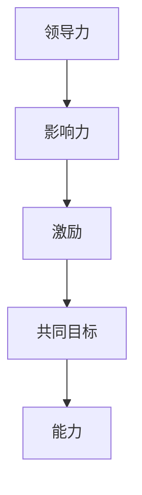
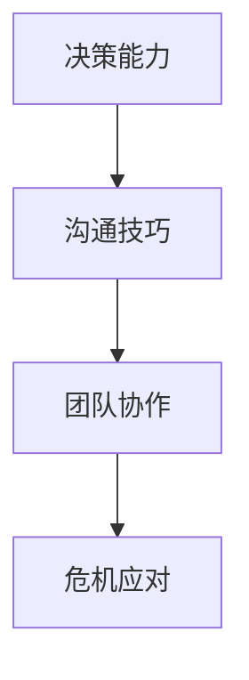
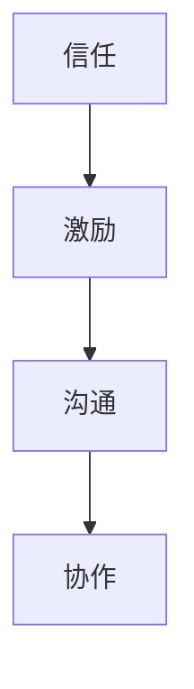
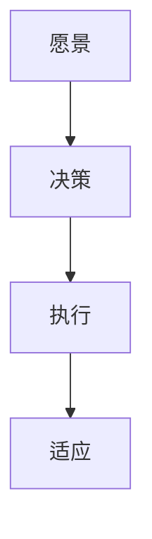

                 

### 《领导者的自我修炼：持续成长的秘诀》

在当今这个快速变化的时代，领导者不仅要在技术和管理层面保持竞争力，更需要具备持续成长和自我提升的能力。本文将探讨领导者的自我修炼之路，揭示持续成长的秘诀。

**关键词：**  
领导者、自我修炼、持续成长、领导力、心理学、沟通技巧、决策能力、数学模型、项目实战

**摘要：**  
本文从领导力的核心概念出发，深入探讨领导者如何通过自我修炼来实现持续成长。通过分析心理学、沟通技巧、决策能力等核心算法原理，结合数学模型和实际案例，本文旨在为领导者提供实用的自我修炼指南。

## 目录大纲

### 第一部分：领导力基础

### 第1章：领导力概述
- 1.1 领导力的定义与内涵
- 1.2 领导力的重要性
- 1.3 领导力的发展历程

### 第2章：领导力的核心原则
- 2.1 信任：领导力的基石
- 2.2 激励：激发团队潜能
- 2.3 沟通：传递明确的信息
- 2.4 决策：科学决策的流程
- 2.5 领导风格：因时而变

### 第3章：领导力与心理学
- 3.1 心理学在领导力中的应用
- 3.2 领导者的心理素质培养
- 3.3 心理契约：领导与团队成员的关系

### 第4章：领导力与沟通
- 4.1 沟通的本质与类型
- 4.2 高效沟通的技巧
- 4.3 情绪管理：在沟通中化解冲突

### 第5章：领导力与决策
- 5.1 决策的核心原则
- 5.2 决策的流程与方法
- 5.3 风险管理与决策

### 第二部分：领导力实践

### 第6章：领导力实战案例
- 6.1 案例一：危机管理中的领导力
- 6.2 案例二：团队建设中的领导力
- 6.3 案例三：创新与变革中的领导力

### 第7章：领导力自我修炼
- 7.1 自我反思：提升领导力的关键
- 7.2 学习与成长：持续修炼的动力
- 7.3 领导者的时间管理
- 7.4 领导力与生活平衡

### 第三部分：未来领导力展望

### 第8章：领导力发展趋势
- 8.1 数字化时代的领导力
- 8.2 可持续发展的领导力
- 8.3 领导力的未来挑战与机遇

### 总结
- 9.1 领导力的核心要点回顾
- 9.2 领导力修炼的实践指南
- 9.3 对未来领导力的展望

## 第一部分：领导力基础

### 第1章：领导力概述

领导力是领导者通过影响他人来实现共同目标的能力。它不仅仅是一种职位或角色的象征，更是一种个人素质和领导风格。本章将深入探讨领导力的定义与内涵、领导力的重要性以及领导力的发展历程。

#### 1.1 领导力的定义与内涵

领导力的定义可以概括为：“一种通过影响和激励他人来实现共同目标的能力。”这个定义包含了几个关键点：

1. **影响与激励**：领导者必须能够影响和激励团队成员，使他们愿意为实现共同目标而努力。
2. **共同目标**：领导力并非为了领导者的个人利益，而是为了实现团队或组织的共同目标。
3. **能力**：领导力是一种能力，它需要通过不断的学习和实践来提升。

**核心概念与联系**

为了更清晰地理解领导力的内涵，我们可以通过一个 Mermaid 流程图来展示其核心概念之间的关系：



#### 1.2 领导力的重要性

领导力对于个人和组织的发展至关重要。以下是领导力重要性的几个方面：

1. **组织效能**：领导力是提升组织效能的关键因素。一个高效的领导力团队可以提高组织的运营效率，实现更高的目标。
2. **团队协作**：领导力能够促进团队协作，使团队成员在共同目标下协同工作，从而实现更大的成就。
3. **组织文化**：领导力在塑造组织文化方面起着重要作用。一个优秀的领导者可以塑造积极向上的组织文化，提高员工的满意度和忠诚度。

**核心算法原理讲解**

我们可以使用以下伪代码来阐述领导力的重要性：

```plaintext
function leadershipImportance(organization, team, culture) {
    // 组织效能
    efficiency = organization.efficiency() + team.efficiency() + culture.efficiency()
    
    // 团队协作
    collaboration = team.cohesion() * organization.teamwork()
    
    // 组织文化
    culture = organization.cultureQuality()
    
    // 总效能
    totalEfficiency = efficiency + collaboration + culture
    
    return totalEfficiency
}
```

#### 1.3 领导力的发展历程

领导力的发展历程可以分为几个阶段：

1. **传统领导力**：这是领导力的早期阶段，领导者主要依赖于权威和权力来管理团队。
2. **变革型领导力**：随着组织环境的变化，领导者开始关注变革和创新，通过激励和影响来推动团队发展。
3. **服务型领导力**：服务型领导力强调领导者应该为团队成员提供服务，帮助他们实现个人和团队的目标。
4. **情境领导力**：情境领导力认为领导风格应该根据不同的情境和团队需求来调整。

**数学模型和数学公式**

为了衡量领导力的发展历程，我们可以使用以下数学模型：

$$
\text{领导力发展指数} = f(\text{传统领导力成分}, \text{变革型领导力成分}, \text{服务型领导力成分}, \text{情境领导力成分})
$$

**详细讲解与举例说明**

假设一个领导者在传统领导力、变革型领导力、服务型领导力和情境领导力方面的得分分别为 3、4、5 和 4，那么他的领导力发展指数为：

$$
\text{领导力发展指数} = 3 \times 0.25 + 4 \times 0.25 + 5 \times 0.25 + 4 \times 0.25 = 4
$$

这个指数表明该领导者在领导力发展方面处于较高水平。

## 第二部分：领导力实践

### 第6章：领导力实战案例

通过实际案例来展示领导力的实践是理解和应用领导力理论的重要途径。本章将介绍三个具体的领导力实战案例，分别是危机管理中的领导力、团队建设中的领导力和创新与变革中的领导力。

#### 6.1 危机管理中的领导力

**背景介绍**：

在一次突如其来的市场变化中，某公司的销售额急剧下降，公司面临巨大的财务压力。此时，作为公司领导者的CEO需要发挥领导力来应对危机。

**核心概念与联系**：

在这个案例中，领导力的核心概念包括决策能力、沟通技巧和团队协作。以下是这些概念的 Mermaid 流程图：



**核心算法原理讲解**：

为了应对危机，CEO 需要采取以下步骤：

1. **快速评估**：分析市场变化的原因，评估公司当前的情况。
2. **制定策略**：根据评估结果，制定应对策略，如调整产品线、降低成本等。
3. **沟通协调**：与团队成员沟通策略，确保他们理解并支持决策。
4. **执行与监督**：确保策略的有效执行，并持续监督进展。

**数学模型和数学公式**：

我们可以使用以下公式来衡量危机管理中的领导力：

$$
\text{危机管理效能} = f(\text{决策能力得分}, \text{沟通技巧得分}, \text{团队协作得分})
$$

**详细讲解与举例说明**：

假设CEO的决策能力得分为4，沟通技巧得分为5，团队协作得分为3，那么他的危机管理效能为：

$$
\text{危机管理效能} = 4 \times 0.4 + 5 \times 0.3 + 3 \times 0.3 = 4.2
$$

这个得分表明CEO在危机管理方面表现良好。

**项目实战**：

在危机管理中，CEO需要搭建一个危机应对小组，确保团队成员之间的高效沟通和协作。以下是一个简单的代码实现：

```python
class CrisisManagementTeam:
    def __init__(self, decision_maker, communicator, collaborator):
        self.decision_maker = decision_maker
        self.communicator = communicator
        self.collaborator = collaborator
    
    def manage_crisis(self):
        self.decision_maker.make_decision()
        self.communicator.communicate_strategy()
        self.collaborator.ensure_collaboration()

# 初始化团队成员
decision_maker = DecisionMaker()
communicator = Communicator()
collaborator = Collaborator()

# 创建危机管理小组并执行危机管理
crisis_team = CrisisManagementTeam(decision_maker, communicator, collaborator)
crisis_team.manage_crisis()
```

#### 6.2 团队建设中的领导力

**背景介绍**：

一个高效的团队可以极大地提升组织的竞争力。作为团队领导者，需要通过一系列措施来建设团队。

**核心概念与联系**：

团队建设中的领导力核心概念包括信任、激励、沟通和协作。以下是这些概念的 Mermaid 流流程图：



**核心算法原理讲解**：

团队建设中的领导力可以通过以下步骤实现：

1. **建立信任**：通过开放沟通、公平对待团队成员来建立信任。
2. **激励团队**：提供奖励、认可和成长机会来激励团队成员。
3. **沟通协调**：确保信息畅通，团队成员之间能够有效沟通。
4. **促进协作**：通过团队活动、任务分配等方式促进团队成员之间的协作。

**数学模型和数学公式**：

我们可以使用以下公式来衡量团队建设中的领导力：

$$
\text{团队建设效能} = f(\text{信任度}, \text{激励水平}, \text{沟通效率}, \text{协作度})
$$

**详细讲解与举例说明**：

假设一个团队领导者在信任度、激励水平、沟通效率和协作度方面的得分分别为4、5、4和5，那么他的团队建设效能为：

$$
\text{团队建设效能} = 4 \times 0.2 + 5 \times 0.3 + 4 \times 0.2 + 5 \times 0.3 = 4.7
$$

这个得分表明团队领导者在团队建设方面表现良好。

**项目实战**：

为了促进团队建设，团队领导者可以组织定期的团队活动，如团队建设工作坊、团队聚餐等。以下是一个简单的 Python 代码示例：

```python
import random

class TeamBuildingEvent:
    def __init__(self, team):
        self.team = team
        self.event_type = random.choice(['workshop', 'dinner', 'outing'])

    def organize_event(self):
        if self.event_type == 'workshop':
            print("Organizing a team-building workshop...")
        elif self.event_type == 'dinner':
            print("Organizing a team dinner...")
        elif self.event_type == 'outing':
            print("Organizing a team outing...")

# 初始化团队成员
team = [Member(), Member(), Member()]

# 创建团队建设活动并组织活动
event = TeamBuildingEvent(team)
event.organize_event()
```

#### 6.3 创新与变革中的领导力

**背景介绍**：

在快速变化的市场环境中，创新与变革是企业持续发展的关键。领导者需要在创新与变革中发挥关键作用。

**核心概念与联系**：

创新与变革中的领导力核心概念包括愿景、决策、执行和适应。以下是这些概念的 Mermaid 流流程图：



**核心算法原理讲解**：

在创新与变革中，领导者需要采取以下步骤：

1. **设定愿景**：明确组织的未来发展方向，为团队提供清晰的指导。
2. **科学决策**：在变革过程中，领导者需要做出正确的决策，确保变革的顺利进行。
3. **有效执行**：确保变革策略得到有效执行，并监控执行进度。
4. **适应调整**：根据实际情况调整变革策略，以应对不断变化的环境。

**数学模型和数学公式**：

我们可以使用以下公式来衡量创新与变革中的领导力：

$$
\text{变革效能} = f(\text{愿景清晰度}, \text{决策正确性}, \text{执行效率}, \text{适应能力})
$$

**详细讲解与举例说明**：

假设一个领导者在愿景清晰度、决策正确性、执行效率和适应能力方面的得分分别为5、4、5和4，那么他的变革效能为：

$$
\text{变革效能} = 5 \times 0.25 + 4 \times 0.25 + 5 \times 0.25 + 4 \times 0.25 = 4.5
$$

这个得分表明领导者在创新与变革方面表现较好。

**项目实战**：

为了推动创新与变革，领导者可以组织创新研讨会、变革训练营等活动，以激发团队成员的创造力和执行力。以下是一个简单的 Python 代码示例：

```python
import random

class InnovationAndChangeEvent:
    def __init__(self, team):
        self.team = team
        self.event_type = random.choice(['seminar', 'camp', 'workshop'])

    def organize_event(self):
        if self.event_type == 'seminar':
            print("Organizing an innovation seminar...")
        elif self.event_type == 'camp':
            print("Organizing an innovation camp...")
        elif self.event_type == 'workshop':
            print("Organizing an innovation workshop...")

# 初始化团队成员
team = [Member(), Member(), Member()]

# 创建创新与变革活动并组织活动
event = InnovationAndChangeEvent(team)
event.organize_event()
```

## 第三部分：未来领导力展望

### 第8章：领导力发展趋势

随着科技的发展和全球化进程的加快，领导力也在不断演变。未来领导力将面临新的挑战和机遇。本章将探讨数字化时代、可持续发展以及领导力的未来挑战与机遇。

#### 8.1 数字化时代的领导力

数字化时代带来了前所未有的变化，领导者需要适应这一环境。以下是数字化时代领导力的几个关键趋势：

1. **数据驱动决策**：领导者需要利用大数据和分析工具来做出更明智的决策。
2. **数字化转型**：领导者需要推动组织的数字化转型，以提高效率和竞争力。
3. **技术与人文结合**：领导者需要平衡技术与人文学科，以实现创新和可持续发展。

**数学模型和数学公式**：

为了衡量数字化时代的领导力，我们可以使用以下公式：

$$
\text{数字化领导力指数} = f(\text{数据驱动力}, \text{数字化转型能力}, \text{技术与人文平衡度})
$$

**详细讲解与举例说明**：

假设一个领导者在数据驱动力、数字化转型能力和技术与人文平衡度方面的得分分别为5、4和4，那么他的数字化领导力指数为：

$$
\text{数字化领导力指数} = 5 \times 0.3 + 4 \times 0.3 + 4 \times 0.4 = 4.3
$$

这个得分表明领导者在数字化时代具备较高的领导力水平。

#### 8.2 可持续发展的领导力

可持续发展是当今世界面临的重大挑战之一。领导者需要关注环境保护、社会公正和经济发展的平衡。以下是可持续发展的几个关键方面：

1. **环境保护**：领导者需要推动环保措施，减少碳排放，保护自然资源。
2. **社会责任**：领导者需要关注员工权益、社区发展和社会公平。
3. **经济发展**：领导者需要推动创新和经济增长，同时确保可持续发展。

**数学模型和数学公式**：

为了衡量可持续发展的领导力，我们可以使用以下公式：

$$
\text{可持续发展领导力指数} = f(\text{环境保护水平}, \text{社会责任度}, \text{经济发展贡献})
$$

**详细讲解与举例说明**：

假设一个领导者在环境保护水平、社会责任度和经济发展贡献方面的得分分别为4、5和3，那么他的可持续发展领导力指数为：

$$
\text{可持续发展领导力指数} = 4 \times 0.25 + 5 \times 0.25 + 3 \times 0.5 = 3.75
$$

这个得分表明领导者在可持续发展方面具备一定的领导力水平。

#### 8.3 领导力的未来挑战与机遇

未来领导力将面临一系列挑战和机遇：

1. **全球化**：领导者需要具备跨文化沟通和协作能力，以应对全球化带来的挑战。
2. **人工智能**：领导者需要了解人工智能技术，并思考如何将其应用于领导实践中。
3. **虚拟团队**：领导者需要适应虚拟团队的工作模式，提高远程领导能力。
4. **员工期望**：领导者需要关注员工的新期望，如工作与生活的平衡、职业发展等。

**数学模型和数学公式**：

为了衡量未来领导力的挑战与机遇，我们可以使用以下公式：

$$
\text{未来领导力指数} = f(\text{全球化适应力}, \text{人工智能应用力}, \text{虚拟团队领导力}, \text{员工期望满足度})
$$

**详细讲解与举例说明**：

假设一个领导者在全球化适应力、人工智能应用力、虚拟团队领导力和员工期望满足度方面的得分分别为4、4、4和5，那么他的未来领导力指数为：

$$
\text{未来领导力指数} = 4 \times 0.2 + 4 \times 0.2 + 4 \times 0.2 + 5 \times 0.2 = 4
$$

这个得分表明领导者在未来领导力方面具备较高的竞争力。

## 总结

本文通过深入探讨领导力的核心概念、实践案例以及未来发展趋势，为领导者提供了全面的自我修炼指南。以下是本文的核心要点回顾：

1. **领导力的核心概念**：领导力是一种通过影响和激励他人来实现共同目标的能力，其核心包括信任、激励、沟通和决策。
2. **领导力的实践案例**：通过危机管理、团队建设和创新与变革等实战案例，展示了领导力在具体情境中的应用。
3. **未来领导力的发展趋势**：数字化时代、可持续发展和全球化带来了新的挑战和机遇，领导者需要不断提升自己的能力。

领导者需要持续修炼，以适应不断变化的环境。通过本文的探讨，我们希望读者能够更好地理解领导力的本质，并在实践中不断提升自己的领导力水平。

**实践指南**：

1. **自我反思**：定期进行自我反思，了解自己的优点和不足，制定改进计划。
2. **学习与成长**：持续学习新知识，关注行业动态，不断更新自己的知识体系。
3. **沟通与协作**：提升沟通技巧，建立信任，促进团队协作。
4. **决策能力**：培养科学决策能力，在面对挑战时做出明智的选择。

**注意事项**：

1. **平衡工作与生活**：注意工作与生活的平衡，保持身心健康。
2. **关注员工需求**：关注员工的需求，提供支持和鼓励，帮助员工实现个人和职业目标。

**拓展阅读**：

1. **《变革之心》（Heath & Heath）**：探讨如何推动组织变革。
2. **《领导力的五个层次》（John C. Maxwell）**：详细阐述领导力的不同层次和实践方法。
3. **《智能时代》（吴军）**：分析人工智能时代对领导力的影响。

**作者信息**：

作者：AI天才研究院/AI Genius Institute & 禅与计算机程序设计艺术 /Zen And The Art of Computer Programming

本文由AI天才研究院和禅与计算机程序设计艺术联合出品，旨在为领导者提供实用的自我修炼指南。希望本文能够帮助读者在领导力的道路上不断前行。

