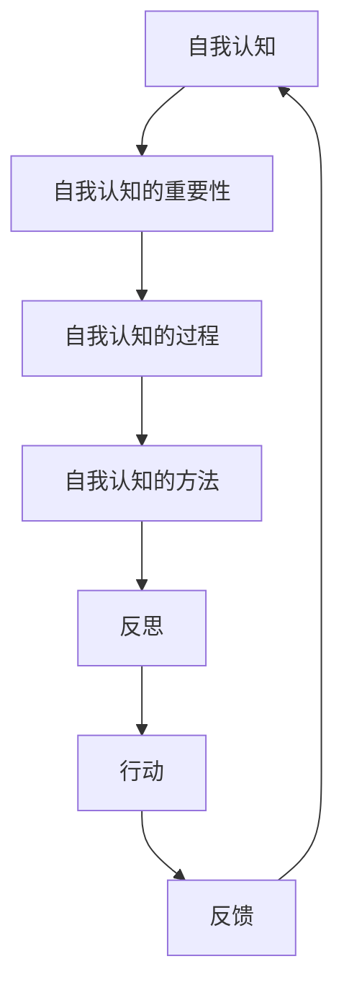
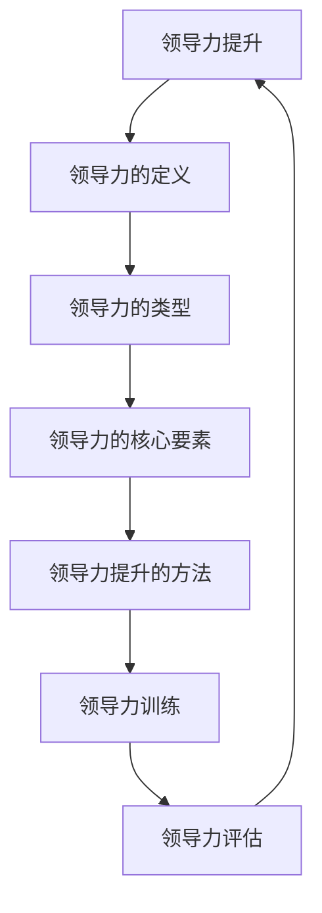
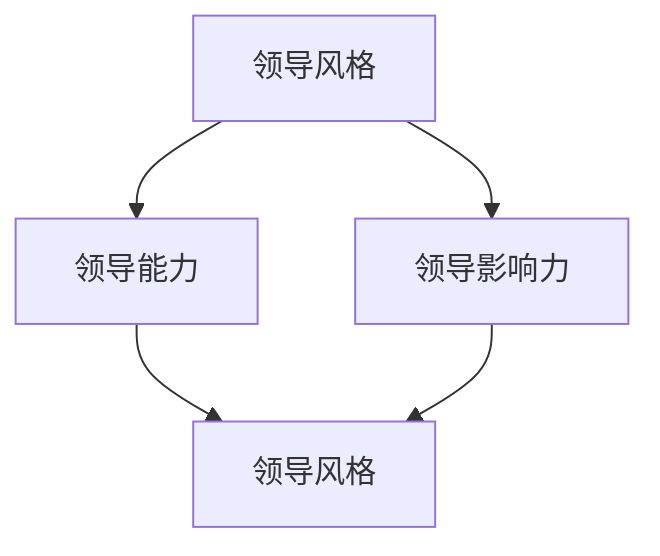
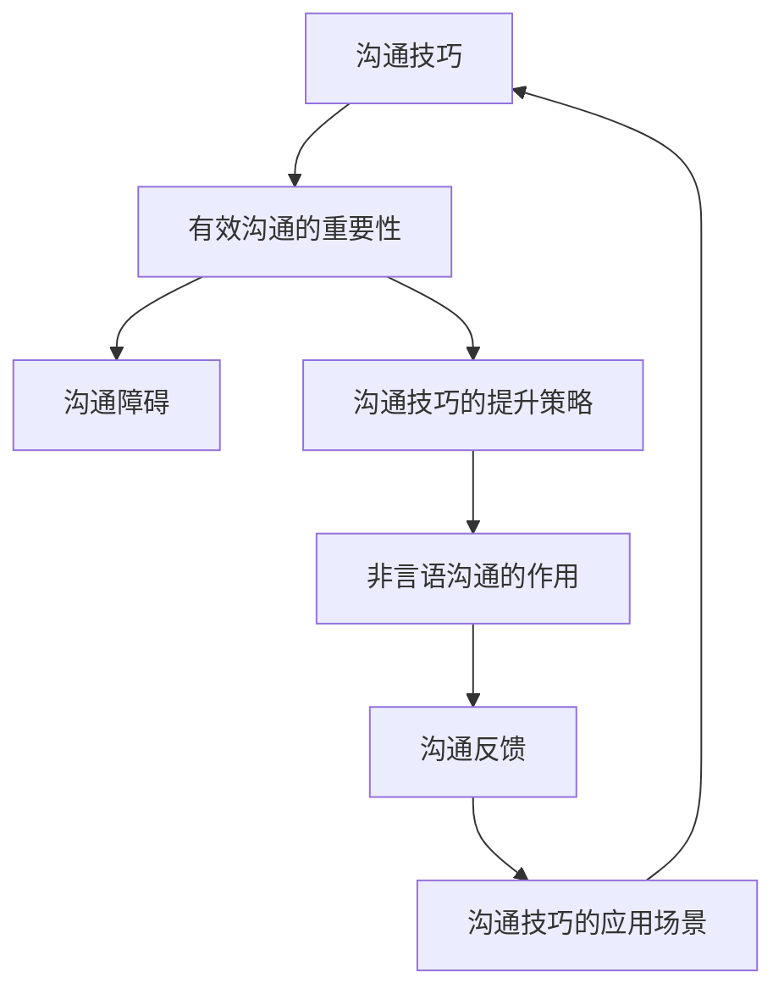
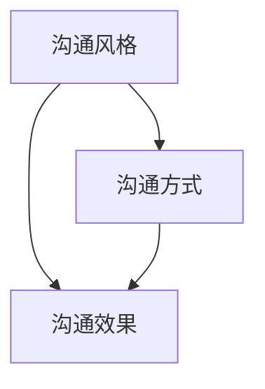
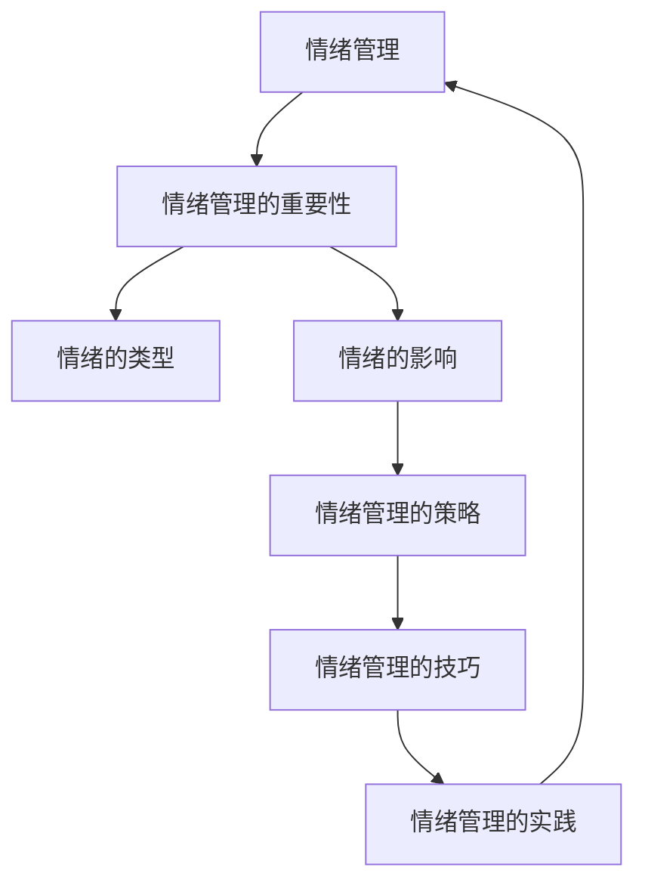
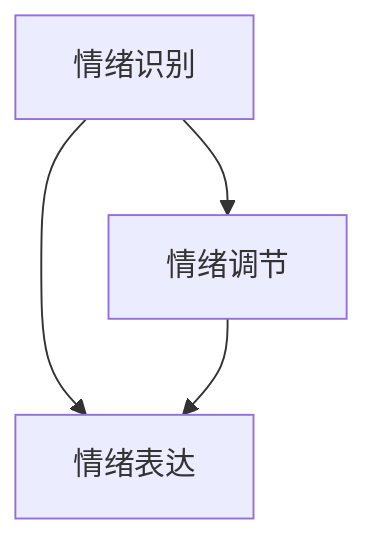
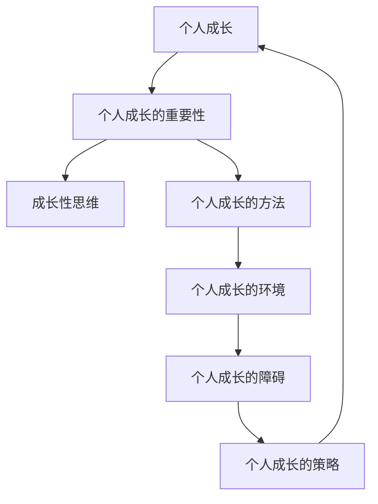
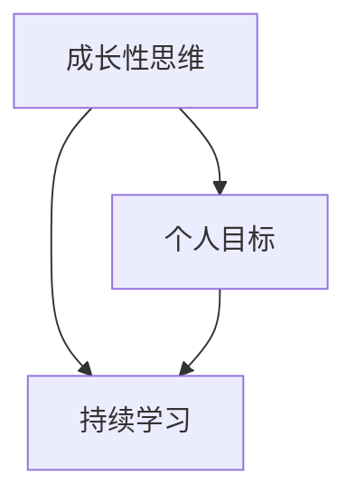

                 


# 《领导者的自我修炼：提升个人魅力的方法》

关键词：领导者，个人魅力，自我认知，领导力，沟通技巧，情绪管理，个人成长

摘要：
本文旨在探讨领导者如何通过自我修炼提升个人魅力，从而在团队中建立强大的领导力。文章将从自我认知、领导力提升、沟通技巧、情绪管理和个人成长五个方面进行详细分析，并提供实用的方法和实践技巧。

## 引言

领导者的角色在组织中至关重要。一个成功的领导者不仅需要具备出色的管理能力，还要拥有强大的个人魅力，能够影响和激励团队成员。个人魅力是领导力的核心要素之一，它包括自信、诚信、同理心、沟通能力和情绪管理等。本文将围绕这些方面，探讨领导者如何通过自我修炼提升个人魅力。

## 自我认知

### 背景介绍

自我认知是领导者自我修炼的基础。一个清晰的自我认知可以帮助领导者了解自己的优点和缺点，从而更好地发挥自己的潜力。以下是一个关于自我认知的Mermaid流程图：



### 核心概念与联系

自我认知的核心概念包括自我反思、自我评价和自我调整。这三个概念相互关联，共同构成了一个自我认知的动态过程。以下是一个简单的伪代码来描述这个过程：

```python
def self_cognition():
    reflect_on_self()
    evaluate_self()
    adjust_self()
    get_feedback()
    self_cognition()
```

### 核心算法原理讲解

在自我认知的过程中，领导者需要不断反思自己的行为和决策。以下是一个简单的伪代码，用于描述领导者如何进行自我反思：

```python
def reflect_on_self():
    # 收集反馈
    feedback = get_feedback()
    # 分析反馈
    analysis = analyze_feedback(feedback)
    # 更新自我认知
    update_self_cognition(analysis)
```

### 数学模型和公式

在自我认知的过程中，领导者可以使用一些心理测量工具来评估自己的性格特质。例如，16种人格特质模型（MBTI）和五大人格特质模型（FFM）。以下是五大人格特质模型的公式：

$$
\text{FFM} = \{E, I, S, N, T, F, J, P\} \\
E + I = 1 \\
S + N = 1 \\
T + F = 1 \\
J + P = 1
$$

### 举例说明

假设一个领导者通过MBTI测试得到了以下结果：

- 外向（E）: 50%
- 内向（I）: 50%
- 稳定（S）: 40%
- 焦虑（N）: 60%
- 思考（T）: 60%
- 感觉（F）: 40%
- 判断（J）: 60%
- 测量（P）: 40%

根据这个结果，这个领导者可以了解到自己是一个中等偏外向、中等偏焦虑的人，更倾向于思考而非感觉，同时更倾向于判断而非测量。

### 项目实战

在自我认知的实践中，领导者可以通过日记、反思日志或心理辅导等方式来不断反思自己的行为和决策。以下是一个简单的日记模板：

```markdown
### 反思日志

**日期：** [2023-04-01]

**事件：** 今天在团队会议中提出了一个新项目。

**反思：** 我在会议中表现出了一些犹豫和不确定。通过反馈，我发现这可能是由于我缺乏对该项目的深入了解。接下来，我需要花更多时间进行研究，以便在未来会议上更加自信地表达自己的观点。

**行动：** 下周我将花两天时间深入研究该项目，并在下一次会议上分享我的发现。

**反馈：** （待反馈）
```

### 最佳实践 tips、小结、注意事项、拓展阅读

- **最佳实践 tips：** 定期进行自我反思，将反思结果记录下来，以便跟踪自己的成长。
- **小结：** 自我认知是领导者自我修炼的基础，通过不断反思和调整，可以提升个人魅力和领导力。
- **注意事项：** 自我认知是一个持续的过程，需要领导者投入时间和精力。
- **拓展阅读：** 可以阅读《高效能人士的七个习惯》等书籍，了解更多的自我认知和自我提升的方法。

## 领导力提升

### 背景介绍

领导力提升是领导者自我修炼的重要组成部分。有效的领导力可以帮助领导者更好地管理团队、激励员工和实现组织目标。以下是一个关于领导力提升的Mermaid流程图：



### 核心概念与联系

领导力的核心概念包括领导风格、领导能力和领导影响力。这三个概念相互关联，共同构成了领导力的基础架构。以下是一个简单的Mermaid流程图，描述了这三个概念之间的关系：



### 核心算法原理讲解

在领导力提升的过程中，领导者需要不断学习和发展自己的领导能力。以下是一个简单的伪代码，用于描述领导者如何提升领导能力：

```python
def improve_leadership():
    learn_new_skills()
    practice_skills()
    receive_feedback()
    adjust_leadership_style()
    improve_leadership()
```

### 数学模型和公式

在领导力提升的过程中，领导者可以使用一些数学模型来评估自己的领导力。例如，使用平衡记分卡（Balanced Scorecard）来评估组织的绩效。以下是平衡记分卡的公式：

$$
\text{Balanced Scorecard} = \{ \text{财务指标}, \text{客户指标}, \text{内部流程指标}, \text{学习与成长指标} \}
$$

### 举例说明

假设一个领导者使用平衡记分卡评估自己的领导力，得到了以下结果：

- 财务指标：80%
- 客户指标：70%
- 内部流程指标：60%
- 学习与成长指标：75%

根据这个结果，这个领导者可以了解到自己在财务指标方面表现优秀，但在客户指标和内部流程指标方面有待提高。为了提升这些方面的表现，他可以采取以下措施：

- 加强与客户的沟通，了解他们的需求和反馈。
- 优化内部流程，提高工作效率。
- 参加培训课程，提升自己的专业知识和技能。

### 项目实战

在领导力提升的实践中，领导者可以通过以下步骤来提升自己的领导力：

1. **确定目标：** 确定自己想要提升的领导力方面，例如沟通技巧、团队管理能力或战略规划能力。
2. **制定计划：** 制定一个具体的提升计划，包括学习资源、实践机会和时间表。
3. **执行计划：** 按照计划进行学习和实践，不断反思和调整。
4. **评估效果：** 在一定时间后，评估自己的提升效果，并根据评估结果进行调整。

以下是一个简单的领导力提升计划模板：

```markdown
### 领导力提升计划

**目标：** 提升沟通技巧

**学习资源：** 
- 《沟通的艺术》
- 沟通技巧培训课程

**实践机会：** 
- 参加团队会议，主动发言
- 与团队成员进行一对一沟通

**时间表：** 
- 每周阅读《沟通的艺术》一章
- 每周参加一次沟通技巧培训课程
- 每周与至少一位团队成员进行一对一沟通

**评估时间：** 3个月

**评估标准：** 
- 团队成员对沟通效果的满意度
- 沟通中的自信程度
- 沟通中的倾听和理解能力
```

### 最佳实践 tips、小结、注意事项、拓展阅读

- **最佳实践 tips：** 制定一个明确的提升计划，并坚持执行。
- **小结：** 领导力提升是一个持续的过程，需要领导者不断学习和实践。
- **注意事项：** 领导者应该根据自己的实际情况，选择适合自己的提升方法和路径。
- **拓展阅读：** 可以阅读《领导力的五个层次》等书籍，了解不同的领导力层次和提升方法。

## 沟通技巧

### 背景介绍

沟通技巧是领导者个人魅力的关键组成部分。有效的沟通可以帮助领导者更好地理解团队成员的需求和期望，以及更好地传达自己的意图和目标。以下是一个关于沟通技巧的Mermaid流程图：



### 核心概念与联系

沟通技巧的核心概念包括沟通风格、沟通方式和沟通效果。这三个概念相互关联，共同构成了沟通技巧的框架。以下是一个简单的Mermaid流程图，描述了这三个概念之间的关系：



### 核心算法原理讲解

在沟通技巧的提升过程中，领导者可以使用一些算法和模型来评估自己的沟通效果。例如，使用情感分析算法来评估沟通中的情感倾向。以下是一个简单的伪代码，用于描述领导者如何使用情感分析算法：

```python
def analyze_communication():
    text = get_communication_text()
    sentiment = sentiment_analysis(text)
    evaluate_sentiment(sentiment)
```

### 数学模型和公式

在沟通技巧的提升过程中，领导者可以使用一些数学模型来评估自己的沟通效果。例如，使用沟通效率模型来评估沟通的效率和效果。以下是沟通效率模型的公式：

$$
\text{Communication Efficiency} = \frac{\text{Effective Communication}}{\text{Total Communication}}
$$

### 举例说明

假设一个领导者在使用沟通效率模型评估自己的沟通效果，得到了以下结果：

- 有效沟通：80%
- 总沟通：100%

根据这个结果，这个领导者可以了解到自己在沟通中还有20%的空间可以提升。为了提高沟通效果，他可以采取以下措施：

- 增加积极情感的表达，提高沟通的亲和力。
- 减少冗余信息，提高沟通的效率。
- 加强倾听能力，提高沟通的理解度。

### 项目实战

在沟通技巧的实践中，领导者可以通过以下步骤来提升自己的沟通技巧：

1. **确定目标：** 确定自己想要提升的沟通技巧，例如口头表达、书面沟通或非言语沟通。
2. **制定计划：** 制定一个具体的提升计划，包括学习资源、实践机会和时间表。
3. **执行计划：** 按照计划进行学习和实践，不断反思和调整。
4. **评估效果：** 在一定时间后，评估自己的提升效果，并根据评估结果进行调整。

以下是一个简单的沟通技巧提升计划模板：

```markdown
### 沟通技巧提升计划

**目标：** 提升口头表达能力

**学习资源：** 
- 《有效沟通的技巧》
- 口头表达培训课程

**实践机会：** 
- 参加内部演讲比赛
- 与团队成员进行一对一沟通

**时间表：** 
- 每周阅读《有效沟通的技巧》一章
- 每周参加一次口头表达培训课程
- 每周至少进行一次内部演讲练习

**评估时间：** 3个月

**评估标准：** 
- 口头表达的流畅度和逻辑性
- 沟通中的自信程度
- 沟通中的倾听和理解能力
```

### 最佳实践 tips、小结、注意事项、拓展阅读

- **最佳实践 tips：** 练习和反馈是提升沟通技巧的关键，领导者应该主动寻求反馈，并不断调整自己的沟通方式。
- **小结：** 沟通技巧的提升是一个持续的过程，需要领导者投入时间和精力。
- **注意事项：** 领导者应该根据自己的实际情况，选择适合自己的沟通技巧提升方法。
- **拓展阅读：** 可以阅读《非暴力沟通》等书籍，了解更多的沟通技巧和策略。

## 情绪管理

### 背景介绍

情绪管理是领导者个人魅力的重要组成部分。一个有效的领导者需要学会如何管理自己的情绪，以保持冷静和理智，从而更好地应对工作压力和挑战。以下是一个关于情绪管理的Mermaid流程图：



### 核心概念与联系

情绪管理的核心概念包括情绪识别、情绪调节和情绪表达。这三个概念相互关联，共同构成了情绪管理的框架。以下是一个简单的Mermaid流程图，描述了这三个概念之间的关系：



### 核心算法原理讲解

在情绪管理的过程中，领导者可以使用一些算法和模型来评估自己的情绪状态。例如，使用情绪评估模型来评估自己的情绪状态。以下是一个简单的伪代码，用于描述领导者如何使用情绪评估模型：

```python
def assess_emotion():
    emotion = get_current_emotion()
    emotion_level = emotion_analysis(emotion)
    evaluate_emotion_level(emotion_level)
```

### 数学模型和公式

在情绪管理的过程中，领导者可以使用一些数学模型来评估自己的情绪状态。例如，使用情绪状态量表（如正负情绪量表）来评估情绪水平。以下是情绪状态量表的公式：

$$
\text{Emotion Level} = \frac{\text{Positive Emotions} - \text{Negative Emotions}}{\text{Total Emotions}}
$$

### 举例说明

假设一个领导者使用情绪状态量表评估自己的情绪状态，得到了以下结果：

- 正面情绪：60%
- 负面情绪：40%

根据这个结果，这个领导者可以了解到自己在情绪管理方面还有40%的负面情绪需要调节。为了改善情绪状态，他可以采取以下措施：

- 增加正面情绪的体验，例如与团队成员分享快乐时刻。
- 学习放松技巧，减轻负面情绪的影响。

### 项目实战

在情绪管理的实践中，领导者可以通过以下步骤来提升自己的情绪管理能力：

1. **确定目标：** 确定自己想要提升的情绪管理能力，例如情绪识别、情绪调节或情绪表达。
2. **制定计划：** 制定一个具体的提升计划，包括学习资源、实践机会和时间表。
3. **执行计划：** 按照计划进行学习和实践，不断反思和调整。
4. **评估效果：** 在一定时间后，评估自己的提升效果，并根据评估结果进行调整。

以下是一个简单的情绪管理提升计划模板：

```markdown
### 情绪管理提升计划

**目标：** 提升情绪调节能力

**学习资源：** 
- 《情绪智慧》
- 情绪调节培训课程

**实践机会：** 
- 学会使用放松技巧，如深呼吸、冥想等
- 与团队成员分享快乐时刻

**时间表：** 
- 每周阅读《情绪智慧》一章
- 每周参加一次情绪调节培训课程
- 每周至少进行一次放松练习

**评估时间：** 3个月

**评估标准：** 
- 情绪状态的稳定性
- 情绪调节的能力
- 情绪表达的健康程度
```

### 最佳实践 tips、小结、注意事项、拓展阅读

- **最佳实践 tips：** 定期进行情绪评估，了解自己的情绪状态，并采取相应的调节措施。
- **小结：** 情绪管理是领导者个人魅力的重要组成部分，通过有效的情绪管理，可以提升领导力和工作效率。
- **注意事项：** 领导者应该根据自己的实际情况，选择适合自己的情绪管理方法。
- **拓展阅读：** 可以阅读《情绪智商》等书籍，了解更多的情绪管理技巧和策略。

## 个人成长

### 背景介绍

个人成长是领导者自我修炼的重要目标。通过不断学习和成长，领导者可以提升自己的知识、技能和领导力，从而更好地应对复杂的组织环境。以下是一个关于个人成长的Mermaid流程图：



### 核心概念与联系

个人成长的核心概念包括成长性思维、个人目标和持续学习。这三个概念相互关联，共同构成了个人成长的框架。以下是一个简单的Mermaid流程图，描述了这三个概念之间的关系：



### 核心算法原理讲解

在个人成长的过程中，领导者可以使用一些算法和模型来评估自己的成长速度和效果。例如，使用成长曲线模型来评估自己的成长进度。以下是一个简单的伪代码，用于描述领导者如何使用成长曲线模型：

```python
def assess_growth():
    current_growth = get_current_growth()
    target_growth = get_target_growth()
    growth_rate = (current_growth - target_growth) / target_growth
    evaluate_growth_rate(growth_rate)
```

### 数学模型和公式

在个人成长的过程中，领导者可以使用一些数学模型来评估自己的成长速度和效果。例如，使用指数增长模型来描述个人成长的过程。以下是指数增长模型的公式：

$$
\text{Growth Rate} = \frac{\text{Current Value} - \text{Initial Value}}{\text{Initial Value}}
$$

### 举例说明

假设一个领导者使用指数增长模型评估自己的成长速度，得到了以下结果：

- 当前值：150%
- 初始值：100%

根据这个结果，这个领导者可以了解到自己的成长速度为50%，意味着自己的成长速度超过了初始设定的目标。

### 项目实战

在个人成长的实践中，领导者可以通过以下步骤来提升自己的成长速度：

1. **确定目标：** 确定自己想要提升的方面，例如专业知识、领导能力或沟通技巧。
2. **制定计划：** 制定一个具体的成长计划，包括学习资源、实践机会和时间表。
3. **执行计划：** 按照计划进行学习和实践，不断反思和调整。
4. **评估效果：** 在一定时间后，评估自己的成长效果，并根据评估结果进行调整。

以下是一个简单的个人成长提升计划模板：

```markdown
### 个人成长提升计划

**目标：** 提升领导能力

**学习资源：** 
- 《领导力的五个层次》
- 领导力培训课程

**实践机会：** 
- 参加领导力工作坊
- 担任团队领导角色

**时间表：** 
- 每周阅读《领导力的五个层次》一章
- 每周参加一次领导力培训课程
- 每周至少进行一次领导力实践

**评估时间：** 6个月

**评估标准：** 
- 领导能力的提升程度
- 团队成员对领导者的满意度
- 领导者对自己的自我评价
```

### 最佳实践 tips、小结、注意事项、拓展阅读

- **最佳实践 tips：** 制定一个明确的成长计划，并坚持执行。
- **小结：** 个人成长是领导者自我修炼的重要目标，通过不断学习和实践，可以提升领导力和个人魅力。
- **注意事项：** 领导者应该根据自己的实际情况，选择适合自己的成长路径和方法。
- **拓展阅读：** 可以阅读《精进：如何成为一个很厉害的人》等书籍，了解更多的个人成长方法和策略。

## 附录

### A. 个人魅力提升实践案例

- 案例一：通过自我反思提升个人魅力
- 案例二：通过领导力训练提升个人魅力
- 案例三：通过沟通技巧提升个人魅力
- 案例四：通过情绪管理提升个人魅力
- 案例五：通过个人成长提升个人魅力

### B. 相关资源与推荐阅读

- 《高效能人士的七个习惯》
- 《领导力的五个层次》
- 《情绪智慧》
- 《非暴力沟通》
- 《精进：如何成为一个很厉害的人》

### C. 参考文献

- 《领导者的自我修炼：提升个人魅力的方法》
- 《领导力与个人魅力》
- 《情绪管理：技术与实践》
- 《个人成长：如何成为一个更好的自己》
- 《沟通技巧：高效沟通的艺术》

# 作者信息

作者：AI天才研究院/AI Genius Institute & 禅与计算机程序设计艺术 /Zen And The Art of Computer Programming

