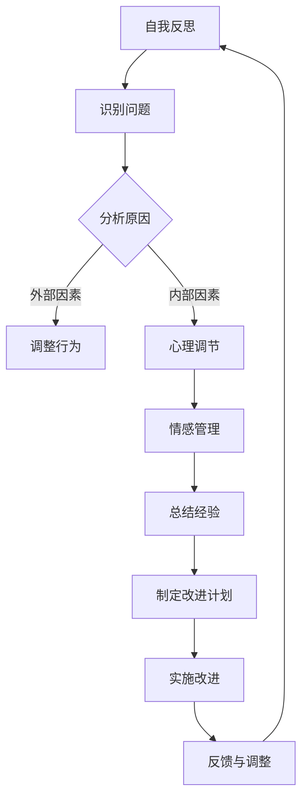

                 

## 文章标题

### 领导者的自我反思：持续成长的关键

在快速变化的技术时代，领导者不仅要引领团队走向成功，还需不断自我反思和成长。本文旨在探讨领导者如何通过自我反思实现持续成长，从心理学、战略思维、团队领导力等多个维度进行分析。文章将采用逻辑清晰、结构紧凑、简单易懂的专业技术语言，帮助读者理解自我反思的深层意义和实践方法。

### 文章关键词

* 自我反思
* 领导者成长
* 心理素质
* 战略思维
* 团队领导力
* 创新思维

### 摘要

本文以领导者的自我反思为核心，从多个角度探讨了持续成长的关键。首先，通过介绍自我反思的概念和重要性，阐述其对个人成长的影响。接着，分析领导者的成长路径，强调心理素质和情绪管理对领导力的关键作用。随后，探讨战略思维与决策能力的重要性，并论述团队领导力和创新思维在领导实践中的应用。最后，提出个人成长计划的制定与执行策略，为领导者的持续成长提供指导。本文旨在为领导者提供实用的反思方法和成长路径，助力他们在技术和商业环境中保持竞争力。

### 引言

领导者的角色在企业和组织中至关重要，他们不仅要引领团队，还要面对快速变化的市场和技术环境。在这样的背景下，领导者需要不断提升自我，以应对各种挑战。然而，自我提升并非易事，它要求领导者具备深刻的反思能力，能够从自身的经验和行为中提取教训，不断调整和优化自己的领导风格。自我反思作为一种重要的思维方式，可以帮助领导者更好地理解自己，发现潜在的问题，从而实现持续成长。

本文将围绕领导者自我反思这一主题，探讨其在个人成长、领导力提升、决策能力培养等方面的作用。文章将从以下几个方面展开：

1. 自我反思的重要性：介绍自我反思的概念及其在个人成长中的重要性。
2. 领导者的成长路径：分析领导者的成长历程，探讨心理素质和情绪管理对领导力的关键作用。
3. 战略思维与决策能力：阐述战略思维与决策能力在领导实践中的应用及其提升策略。
4. 团队领导力：探讨团队领导力的核心要素，分析领导风格对团队绩效的影响。
5. 创新思维与变革：论述创新思维在领导实践中的重要性，以及领导者如何在组织中进行变革管理。
6. 个人成长计划：提出个人成长计划的制定与执行策略，帮助领导者实现持续成长。

通过以上内容的详细探讨，本文旨在为领导者提供实用的自我反思方法和成长路径，助力他们在快速变化的环境中保持竞争力。

### 第1章：自我反思的重要性

### 1.1 自我反思的概念与意义

自我反思是指个体通过深入思考自己的行为、想法和情感，以达到自我认知、自我改进和自我提升的过程。它不仅仅是对过去行为的回顾，更是一种对当前状态和未来发展的深度思考。在心理学中，自我反思被广泛认为是自我认知的重要途径，有助于个体更好地理解自己，发现自身的优势和不足，从而促进个人的成长和发展。

自我反思的意义主要体现在以下几个方面：

1. **提升自我认知**：通过自我反思，领导者可以深入了解自己的行为模式、思维方式和情感反应。这种深入的自我认知有助于领导者更加清晰地认识到自己的优点和不足，从而为个人发展提供明确的方向。

2. **发现潜在问题**：在自我反思的过程中，领导者可以识别出潜在的问题和挑战。这些问题可能是在日常工作中被忽视的，但它们对个人的成长和团队的表现有着重要影响。通过自我反思，领导者可以及时发现问题，并采取措施进行改进。

3. **促进情感管理**：自我反思有助于领导者更好地管理自己的情绪。在反思过程中，领导者可以审视自己的情感反应，了解哪些情绪反应是积极的，哪些是消极的，并学会如何调节和应对负面情绪。

4. **培养决策能力**：自我反思可以提升领导者的决策能力。通过回顾过去的决策过程和结果，领导者可以总结经验教训，识别决策中的盲点和误区，从而在未来的决策中更加慎重和准确。

5. **增强适应能力**：自我反思可以帮助领导者更好地适应变化。在不断变化的环境中，领导者需要具备快速适应和调整的能力。通过自我反思，领导者可以了解自己在不同情境下的表现，发现适应问题的根源，并采取相应的措施提升自己的适应性。

### 1.2 自我反思的实践方法

要有效地进行自我反思，领导者需要掌握一些实用的方法和技巧。以下是一些常见的自我反思实践方法：

1. **日记反思**：通过写日记的方式记录自己的所思所感，可以帮助领导者更好地回顾和分析自己的行为和思维。日记反思不仅可以帮助领导者保存重要的思考内容，还可以在未来的自我反思中使用。

2. **定期回顾**：领导者可以定期（如每周或每月）花时间回顾自己的行为和决策。这种方法可以帮助领导者保持持续的自我认知，及时发现问题和调整自己的行为。

3. **他人反馈**：向同事、下属或导师寻求反馈是自我反思的重要方法。他人的观点可以帮助领导者更客观地认识自己，发现自己在他人眼中的形象和表现。

4. **模拟情景**：通过模拟不同的情境，领导者可以设想自己在这些情境中的行为和反应。这种方法有助于领导者预判问题，提前准备解决方案。

5. **心理辅导**：在某些情况下，领导者可能需要专业的心理辅导来帮助自己进行自我反思。心理辅导师可以提供专业的指导和支持，帮助领导者更好地理解和应对自己的情绪和行为。

### 1.3 自我反思对个人成长的影响

自我反思对个人成长的影响是多方面的，以下是一些具体的影响：

1. **提升自我效能感**：自我反思可以帮助领导者认识到自己的成长和进步，从而增强自我效能感。这种效能感的提升会进一步激励领导者面对挑战，实现更高的目标。

2. **增强心理韧性**：通过自我反思，领导者可以培养出更强的心理韧性。在面对困难和挫折时，领导者能够更加冷静和理性地应对，从而保持积极的心态和行动。

3. **促进创新思维**：自我反思可以帮助领导者发掘新的想法和创新的解决方案。通过反思过去的经验和行为，领导者可以产生新的视角和见解，从而推动个人的创新思维。

4. **提升沟通能力**：自我反思有助于领导者更好地理解自己和他人。这种理解不仅有助于提高领导者的人际关系，还可以提升沟通能力，使领导者更有效地传达自己的意图和需求。

5. **建立长期愿景**：自我反思可以帮助领导者明确自己的长期目标和愿景。通过反思自己的行为和决策，领导者可以更清晰地看到自己未来的方向，并采取相应的措施实现这些目标。

### 结论

自我反思是领导者实现个人成长和持续发展的重要途径。通过深入思考自己的行为、想法和情感，领导者可以更好地认识自己，发现潜在问题，提升决策能力和心理韧性，从而在快速变化的环境中保持竞争力。领导者应积极采用各种自我反思的方法，将其融入日常生活和工作中，以实现持续的个人成长和发展。

### 第2章：领导者的成长路径

### 2.1 领导力的本质

领导力是指通过影响和激励他人，实现共同目标的能力。它不仅仅是一种技能，更是一种思维方式和生活态度。领导力的本质可以从多个维度进行理解，以下是一些关键点：

1. **影响力**：领导力首先体现在对他人影响力的能力上。领导者能够通过自身的行为和价值观，影响和激励他人，从而实现团队的目标。

2. **沟通能力**：有效的沟通是领导力的核心要素之一。领导者需要能够清晰地传达自己的意图和需求，同时也要倾听他人的观点和需求。

3. **决策能力**：领导者需要在复杂多变的环境中做出明智的决策。这要求领导者具备分析问题的能力、决策的果断性和决策后的执行能力。

4. **同理心**：同理心是领导者的重要品质，它使领导者能够理解并关心团队成员的情感和需求，从而建立信任和团队合作。

5. **责任感**：领导者需要对团队和组织的成功负责。这种责任感不仅体现在个人行为上，还体现在对团队整体目标的承诺和努力。

6. **变革推动力**：领导者需要具备推动组织变革的能力。在快速变化的环境中，领导者需要引领组织进行适应性变革，以保持竞争力。

### 2.2 领导者的成长历程

领导者的成长并非一蹴而就，而是一个长期的学习和成长过程。以下是一些关键阶段和成长因素：

1. **初学者阶段**：在这个阶段，领导者刚刚开始接触领导工作，他们需要学习和掌握基本的管理和领导技能。初学者阶段的关键因素包括参与培训课程、阅读相关书籍和观察成功的领导者。

2. **基础阶段**：在基础阶段，领导者开始运用所学知识解决实际问题，并逐步建立起自己的领导风格。这一阶段的关键因素包括实践经验、反馈和自我反思。

3. **胜任阶段**：胜任阶段的领导者已经能够有效地管理团队并实现目标。他们具备了较强的决策能力和沟通技巧，能够应对各种挑战。这一阶段的关键因素包括持续学习和实践、建立支持网络。

4. **成熟阶段**：在成熟阶段，领导者不仅能够有效地管理团队，还能够影响和激励整个组织。他们具备深厚的领导力和战略思维，能够引领组织进行变革。这一阶段的关键因素包括全球视野、创新思维和变革领导力。

5. **卓越阶段**：卓越阶段的领导者已经达到了职业生涯的巅峰，他们不仅是优秀的领导者，还是杰出的领导者。他们能够对整个行业和领域产生深远的影响。这一阶段的关键因素包括领导力的传承、领导力的研究和教育。

### 2.3 领导者成长的关键因素

领导者成长的过程中，受到多种因素的影响。以下是一些关键因素：

1. **自我反思**：自我反思是领导者成长的重要动力。通过反思自己的行为和决策，领导者可以识别自己的优势与不足，从而制定相应的改进计划。

2. **持续学习**：持续学习是领导者成长的关键。领导者需要不断学习新知识、新技能，以适应快速变化的环境。这包括阅读书籍、参加培训课程、听取行业报告等。

3. **实践经验**：实践经验是领导者成长的基础。通过实际工作中的挑战和机会，领导者可以不断提升自己的能力和技能。

4. **导师指导**：导师的指导对领导者的成长至关重要。导师可以提供经验分享、职业建议和指导，帮助领导者更快地成长。

5. **网络支持**：建立和维护良好的职业网络对领导者的成长非常有帮助。通过与其他领导者交流和合作，领导者可以获取新的观点和资源，促进个人和职业的发展。

### 2.4 领导者成长的心路历程

领导者的成长是一个充满挑战和机遇的过程。以下是一个简化的心路历程：

1. **初始挑战**：领导者刚开始可能会面临工作负担重、资源不足、团队不成熟等挑战。这些挑战需要领导者迅速适应和解决。

2. **逐步成长**：随着领导经验和技能的增加，领导者开始能够更好地管理团队和应对复杂问题。他们在实践中不断学习和改进，逐步建立起自己的领导风格。

3. **面对困难**：在领导过程中，领导者可能会遇到各种困难和挫折，如团队冲突、业绩不佳、个人健康问题等。这些困难需要领导者具备坚韧的意志和智慧来克服。

4. **持续进步**：领导者需要持续进步，不断提升自己的能力和技能，以适应不断变化的环境。这包括持续学习、反思和自我提升。

5. **成为榜样**：最终，领导者成长为卓越领导者，他们的行为和价值观成为团队和组织的榜样，对整个行业和社会产生深远的影响。

### 结论

领导者的成长是一个复杂而长期的过程，涉及到多个方面的影响因素。通过自我反思、持续学习、实践经验、导师指导和网络支持，领导者可以不断提升自己的能力和素质，实现个人和职业的持续成长。领导者应重视成长过程中的每一步，不断挑战自己，以成为卓越的领导者。

### 第3章：心理素质与情绪管理

### 3.1 心理素质的重要性

心理素质是指个体在面对压力和挑战时的心理状态和能力。对领导者而言，心理素质尤为重要，因为领导者的角色往往需要他们处理复杂的人际关系、应对高压力的工作环境和做出迅速准确的决策。以下从几个方面探讨心理素质的重要性：

1. **抗压能力**：领导者需要具备较强的抗压能力，以应对工作中的各种挑战和压力。这种抗压能力不仅关乎个人的心理健康，也直接影响领导者的决策质量和工作效率。

2. **情绪稳定性**：领导者需要保持情绪的稳定性，避免因个人情绪波动而影响团队的士气和工作效率。情绪稳定性的重要性在于它能够帮助领导者保持理性思维，做出更明智的决策。

3. **自我调节能力**：领导者需要具备良好的自我调节能力，能够及时识别和调整自己的情绪和行为，以适应不同的情境和需求。这种能力有助于领导者建立和维护良好的人际关系。

4. **适应性**：在快速变化的环境中，领导者需要具备高度适应性，能够迅速调整自己的思维和行为模式，以应对新的挑战和机遇。心理素质的适应性有助于领导者保持灵活性和敏捷性。

5. **领导影响力**：领导者的心理素质直接影响到其领导影响力。具备良好心理素质的领导者更容易赢得团队的信任和尊重，从而提高领导效果。

### 3.2 情绪管理

情绪管理是指个体识别、理解和调节自己情绪的能力。对领导者而言，情绪管理尤为重要，因为领导者的情绪不仅影响自己的行为，还会对团队成员产生示范效应。以下是一些情绪管理的具体方法和策略：

1. **认知重构**：认知重构是一种通过改变思维模式来调节情绪的方法。领导者可以通过反思自己的思维和行为，识别消极情绪背后的认知偏差，并重构积极的思维模式。

2. **情绪宣泄**：适度的情绪宣泄可以帮助领导者释放压力，避免情绪积累导致负面影响。例如，领导者可以通过运动、写日记、与朋友聊天等方式进行情绪宣泄。

3. **放松训练**：放松训练包括深呼吸、冥想、瑜伽等，这些方法可以帮助领导者缓解压力，提高情绪稳定性。定期进行放松训练有助于领导者保持身心健康。

4. **情绪感知**：情绪感知是指领导者能够识别和理解自己和他人的情绪。通过提高情绪感知能力，领导者可以更好地理解团队成员的需求，建立更有效的人际关系。

5. **积极心态**：积极心态是一种重要的情绪管理策略。领导者可以通过培养乐观、积极的心态，面对挑战和困难。积极心态有助于提高领导者的适应性和抗挫折能力。

### 3.3 心理素质的培养

培养良好的心理素质是领导者成长的重要组成部分。以下是一些具体的方法和策略：

1. **心理训练**：领导者可以通过参加心理训练课程，学习情绪管理、压力应对和自我调节等技能。心理训练有助于提高领导者的心理素质，增强其在压力环境中的应对能力。

2. **自我反思**：自我反思是培养心理素质的重要方法。领导者可以通过定期反思自己的行为和情绪，识别问题并采取相应的改进措施。

3. **心理健康咨询**：领导者可以寻求专业心理健康咨询，以获取更深入的心理支持和指导。心理咨询师可以帮助领导者识别和解决深层次的心理问题。

4. **健康生活方式**：保持健康的生活方式对心理素质的培养至关重要。领导者应注重饮食、运动和睡眠，以维持身心健康。

5. **持续学习**：持续学习是提高心理素质的有效途径。领导者可以通过阅读心理学书籍、参加相关培训和研讨会，不断丰富自己的心理学知识和技能。

### 结论

心理素质和情绪管理是领导者不可或缺的重要能力。良好的心理素质有助于领导者应对压力和挑战，保持情绪稳定，提高决策质量和团队协作效果。通过认知重构、情绪感知、积极心态等方法，领导者可以培养良好的心理素质，实现自我提升和职业发展。领导者应重视心理素质的培养，将其融入日常工作和生活中，以成为一名卓越的领导者。

### 第4章：战略思维与决策能力

### 4.1 战略思维

战略思维是指领导者从宏观角度分析问题，制定长远规划和决策的能力。它是一种综合性思维方式，涉及到多个方面的因素，包括行业趋势、竞争态势、资源分配和未来预测。战略思维对于领导者的成功至关重要，以下是一些关键要素：

1. **行业趋势分析**：领导者需要关注行业的发展趋势，了解技术进步、市场需求和竞争态势。通过对行业趋势的深入分析，领导者可以预见未来的发展方向，制定相应的战略计划。

2. **竞争态势分析**：领导者需要评估竞争对手的优势和劣势，了解市场占有率、产品差异化和营销策略。通过竞争态势分析，领导者可以找到自身的竞争优势，制定有效的竞争策略。

3. **资源分配**：领导者需要合理分配资源，确保资源的最优利用。这包括资金、人力资源和技术资源等。合理的资源分配有助于提高组织的运营效率和竞争力。

4. **未来预测**：领导者需要具备未来预测的能力，能够预见未来的市场变化和机遇。通过未来预测，领导者可以制定长远的发展规划，为组织的可持续发展奠定基础。

5. **系统性思维**：战略思维是一种系统性思维，要求领导者从整体角度分析问题，考虑各种因素的相互关系。通过系统性思维，领导者可以更全面地理解问题，制定更科学的决策。

### 4.1.1 战略思维的要素

战略思维包含以下几个核心要素：

1. **愿景和目标**：领导者需要明确组织的愿景和目标，这为战略制定提供了方向和依据。愿景和目标应具有明确性、可行性和挑战性，能够激励团队成员共同奋斗。

2. **环境和竞争**：领导者需要分析外部环境和竞争态势，了解市场变化和竞争对手的行为。通过对环境和竞争的分析，领导者可以制定更具针对性的战略。

3. **优势和劣势**：领导者需要识别组织的优势与劣势，了解自身在市场中的定位。通过优势与劣势分析，领导者可以制定符合自身特点的战略。

4. **资源和能力**：领导者需要评估组织的资源与能力，了解自身的竞争力和发展潜力。通过对资源和能力的评估，领导者可以制定更合理的资源配置和战略计划。

5. **战略路径**：领导者需要制定明确的战略路径，确保组织在实现愿景和目标的过程中，能够按部就班地推进。战略路径应具有灵活性，能够适应外部环境的变化。

### 4.1.2 战略思维的培养

培养战略思维是一项长期而系统的工作，以下是一些具体的方法和策略：

1. **系统学习**：领导者可以通过阅读战略管理相关书籍、参加培训课程和研讨会，系统地学习战略管理的理论和实践知识。

2. **案例分析**：通过研究成功和失败的企业案例，领导者可以了解战略思维的运用方法和误区。案例分析有助于领导者从实践中学习和总结经验。

3. **实战演练**：领导者可以通过实际操作和模拟演练，锻炼战略思维的能力。例如，参与企业的战略规划制定、市场分析和决策过程等。

4. **跨学科学习**：战略思维不仅涉及管理知识，还包括经济学、心理学、社会学等多个领域的知识。领导者应具备跨学科的知识背景，以更全面地理解战略问题。

5. **持续反思**：领导者应定期反思自己的战略思维过程和决策结果，识别成功和失败的原因。通过持续反思，领导者可以不断优化自己的战略思维。

### 4.1.3 战略思维的案例分析

以下是一个简单的战略思维案例分析：

**案例：某互联网公司的战略规划**

1. **愿景和目标**：该公司的愿景是成为全球领先的互联网企业，目标是在五年内实现市场份额的翻倍。

2. **环境和竞争**：通过对行业趋势和竞争态势的分析，公司发现移动互联网市场前景广阔，但竞争激烈。主要竞争对手包括几家大型科技公司和新兴互联网企业。

3. **优势和劣势**：公司的优势在于技术创新和强大的研发团队，劣势在于市场推广和品牌知名度不足。

4. **资源和能力**：公司拥有充足的资金和先进的技术，但市场推广团队规模较小，品牌建设需加强。

5. **战略路径**：
   - **市场拓展**：加大市场推广力度，拓展海外市场。
   - **技术创新**：继续投入研发，保持技术领先优势。
   - **品牌建设**：加强品牌宣传，提升品牌知名度和美誉度。
   - **合作伙伴**：与行业领先企业建立合作关系，共同拓展市场。

### 4.2 决策能力

决策能力是领导者的重要素质之一，它关系到组织的发展和领导者的声誉。有效的决策能力不仅要求领导者具备扎实的分析能力和判断力，还需要考虑多种因素，包括信息收集、风险评估和执行方案等。以下是一些关键要素和提升策略：

1. **信息收集**：领导者需要收集全面、准确的信息，作为决策的依据。这包括市场数据、竞争对手信息、客户需求和内部运营数据等。

2. **风险评估**：领导者需要评估决策可能带来的风险，包括市场风险、技术风险和运营风险等。通过风险评估，领导者可以制定应对策略，减少决策的失误。

3. **执行方案**：领导者需要制定详细的执行方案，确保决策能够顺利实施。执行方案应包括时间表、责任人、资源和预算等。

4. **果断性**：领导者需要具备果断性，能够在关键时刻做出决策。果断性不仅体现在决策的速度上，还体现在决策的准确性。

5. **适应性**：领导者需要具备适应性，能够在决策后根据实际情况进行调整。这种适应性有助于领导者应对不可预测的变化和挑战。

### 4.2.1 决策的类型与模型

决策可以分为以下几种类型：

1. **程序性决策**：针对常规问题，领导者依据已有的程序和规则进行决策。这类决策通常较为简单，依赖于经验和标准操作流程。

2. **非程序性决策**：针对复杂和未经验证的决策，领导者需要通过深入分析、创新思维和跨学科知识进行决策。这类决策通常涉及战略规划和重大决策。

常见的决策模型包括：

1. **理性决策模型**：基于理性分析，通过最大化预期效用进行决策。该模型强调逻辑推理和量化分析。

2. **满意决策模型**：基于足够的信息和条件，选择一个能够满足基本需求的决策。该模型强调实用性和可操作性。

3. **直觉决策模型**：基于领导者的直觉和经验进行决策。该模型强调领导者的直觉和判断力。

### 4.2.2 决策的制定过程

决策的制定过程可以分为以下几个阶段：

1. **问题识别**：明确决策需要解决的问题和目标。

2. **信息收集**：收集与决策相关的信息和数据。

3. **方案生成**：生成多个可行的解决方案。

4. **方案评估**：评估各个方案的优缺点和可行性。

5. **方案选择**：根据评估结果选择最佳方案。

6. **方案执行**：制定详细的执行计划，确保方案能够顺利实施。

7. **方案监控**：监控决策的执行过程，及时调整和优化。

### 4.2.3 决策能力的提升策略

以下是一些提升决策能力的策略：

1. **加强信息收集和分析能力**：领导者需要具备快速收集和分析信息的能力，以便在决策过程中做出更准确的选择。

2. **培养批判性思维**：领导者需要具备批判性思维，能够从不同角度分析和评估问题，避免盲目跟风。

3. **建立完善的决策机制**：领导者可以建立一套完善的决策机制，包括明确的决策流程、评估标准和执行方案，以确保决策的科学性和有效性。

4. **借鉴成功经验**：领导者可以借鉴其他企业和领导者的成功经验，学习他们的决策方法和策略。

5. **持续学习和实践**：领导者需要不断学习和实践，提升自己的决策能力和领导水平。

### 结论

战略思维和决策能力是领导者成功的关键因素。通过战略思维，领导者可以更好地理解外部环境和内部资源，制定长远规划和决策。通过有效的决策能力，领导者可以应对复杂的问题和挑战，确保组织的持续发展。领导者应重视战略思维和决策能力的培养，不断提升自己的综合素质，以实现个人和组织的卓越表现。

### 第5章：团队领导力

### 5.1 团队建设的核心

团队建设是领导者的一项重要任务，它关乎团队的整体表现和成员的幸福感。有效的团队建设不仅能够提升团队的工作效率，还能增强团队成员之间的信任和合作。以下从几个方面探讨团队建设的核心要素：

1. **共同目标**：共同目标是团队建设的基石。一个有凝聚力的团队需要明确共同的目标和愿景，这有助于成员们保持一致的方向和努力。领导者需要确保团队目标具体、可测量，并且与组织的整体战略相一致。

2. **团队文化**：团队文化是团队的精神支柱，它决定了团队成员的行为和互动方式。领导者需要塑造积极的团队文化，包括开放、尊重和包容的价值观。这种文化能够激发团队成员的创造力和责任感。

3. **有效沟通**：有效的沟通是团队协作的关键。领导者需要建立开放的沟通渠道，鼓励团队成员表达自己的观点和需求。此外，领导者还应该定期组织团队会议，确保信息流通和问题及时解决。

4. **角色明确**：团队成员的角色和职责应明确界定，以便每个人都能清楚自己的工作内容和目标。领导者可以通过角色分配和任务分配，确保团队成员的工作协调和高效。

5. **团队协作**：团队协作是团队建设的核心目标之一。领导者需要鼓励和支持团队成员之间的合作，通过团队项目和工作坊等活动，提升团队协作能力。

### 5.1.1 团队文化的塑造

团队文化的塑造是一个长期的过程，需要领导者的持续努力。以下是一些具体方法：

1. **建立价值观**：领导者需要明确团队的价值观，并将其融入到日常工作和团队活动中。这可以通过团队会议、培训和工作手册等方式实现。

2. **示范行为**：领导者通过自己的行为来示范团队文化。例如，领导者应展现开放和尊重的态度，鼓励团队成员提出建议和反馈。

3. **奖励和认可**：领导者应通过奖励和认可来强化团队文化。这可以包括公开表扬、晋升和奖金等形式，以激励团队成员保持积极的行为。

4. **团队活动**：组织定期的团队活动，如团队建设培训、团队拓展活动和团队旅行等，有助于增强团队凝聚力。

5. **透明度**：领导者应保持信息透明，及时与团队成员分享组织的进展和挑战。这种透明度有助于增强团队成员的信任和归属感。

### 5.1.2 团队角色的定义

在团队中，每个成员都扮演着不同的角色，这些角色共同构成了团队的功能和结构。以下是一些常见的团队角色及其定义：

1. **领导者**：领导者负责制定团队目标和计划，激励和指导团队成员，解决团队中的冲突和问题。

2. **协调者**：协调者负责协调团队成员的工作，确保团队任务的顺利进行。协调者通常在项目管理和跨部门合作中发挥作用。

3. **执行者**：执行者是团队中的实际工作者，负责完成具体的工作任务和目标。

4. **创新者**：创新者负责提出新的想法和解决方案，推动团队的创新和发展。

5. **支持者**：支持者提供技术支持和帮助，协助团队成员解决工作中遇到的问题。

6. **反馈者**：反馈者负责提供反馈和建议，帮助团队成员改进工作。

### 5.1.3 团队协作的促进

促进团队协作是团队领导力的重要组成部分。以下是一些有效的方法：

1. **明确目标和职责**：确保每个团队成员都明确自己的目标和职责，这有助于减少误解和冲突。

2. **建立信任**：通过开放的沟通、透明度和互相尊重，建立团队成员之间的信任。信任是团队协作的基础。

3. **鼓励协作**：领导者应鼓励团队成员合作，共同解决问题和完成任务。可以通过团队项目、团队讨论和协作工具等方式促进协作。

4. **提供资源和支持**：为团队成员提供必要的资源和支持，包括时间、技术和信息等，以帮助他们更好地完成任务。

5. **定期反馈和评估**：通过定期的反馈和评估，帮助团队成员了解自己的工作表现，发现问题和改进空间。

6. **庆祝成就**：当团队取得成就时，领导者应与团队成员一起庆祝，这有助于增强团队凝聚力和积极性。

### 结论

团队领导力是领导者的重要能力之一，它关系到团队的整体表现和成员的幸福感。通过塑造共同目标、团队文化和有效沟通，领导者可以建立一支高效的团队。明确团队角色和促进团队协作，有助于提升团队的工作效率和创新能力。领导者应重视团队领导力的培养，不断探索和实践有效的团队建设方法，以实现团队和个人的共同成长。

### 第6章：创新思维与变革

### 6.1 创新思维

创新思维是指从新的角度审视问题，提出独特解决方案的思维方式。在快速变化的时代，创新思维对于企业的生存和发展至关重要。以下从几个方面探讨创新思维的类型、特点和培养方法：

#### 6.1.1 创新思维的类型

1. **发散思维**：发散思维是指从多个角度思考问题，寻找不同的解决方案。这种思维方式鼓励思维的自由流动，有助于发现新的观点和创意。

2. **收敛思维**：收敛思维是指从多个选项中筛选出最佳的解决方案。这种思维方式强调逻辑推理和批判性思维，确保创新的可行性和有效性。

3. **跨学科思维**：跨学科思维是指将不同领域的知识和方法结合起来，以解决复杂问题。这种思维方式有助于打破传统的思维框架，产生创新的解决方案。

4. **逆向思维**：逆向思维是指从相反的角度思考问题，挑战常规和传统观念。这种思维方式有助于发现新的机遇和解决方案。

#### 6.1.2 创新思维的特点

1. **灵活性**：创新思维具有灵活性，能够迅速适应新的信息和环境。这种灵活性使领导者能够及时调整策略和方案。

2. **开放性**：创新思维具有开放性，能够接受不同的观点和想法。这种开放性有助于领导者从多个角度思考问题，发现新的解决方案。

3. **适应性**：创新思维能够适应变化和不确定性。在快速变化的环境中，领导者需要具备这种适应性，以应对各种挑战。

4. **创造性**：创新思维强调创造性，能够产生独特的观点和解决方案。这种创造性是推动企业进步和创新的关键。

#### 6.1.3 创新思维的培养方法

1. **鼓励思考**：领导者应鼓励团队成员多思考、多提问，培养他们的批判性思维和创造性思维。

2. **提供资源**：领导者应为团队成员提供必要的资源和工具，包括时间、资金和技术等，以支持他们的创新活动。

3. **跨学科交流**：通过跨学科交流，领导者可以促进不同领域知识和方法的融合，激发新的创新思路。

4. **实践训练**：通过实践训练，如头脑风暴、创新竞赛和项目实践等，领导者可以锻炼团队成员的创新思维。

### 6.2 变革管理

在快速变化的市场环境中，企业需要具备变革能力，以适应新的挑战和机遇。变革管理是指企业通过系统的方法和策略，引导和管理变革过程，确保变革的顺利进行。以下从几个方面探讨变革管理的必要性、过程和策略：

#### 6.2.1 变革的必要性

1. **应对竞争压力**：在激烈的市场竞争中，企业需要不断调整战略和运营模式，以保持竞争力。

2. **适应技术进步**：随着技术的快速发展，企业需要不断更新技术和产品，以保持市场地位。

3. **提升效率**：通过变革，企业可以优化流程和运营模式，提升效率，降低成本。

4. **激发创新**：变革可以激发企业内部的创新思维，推动产品和服务的创新。

#### 6.2.2 变革的过程

1. **规划阶段**：在规划阶段，企业需要明确变革的目标和范围，制定详细的变革计划。

2. **准备阶段**：在准备阶段，企业需要为变革做好准备，包括组织结构调整、人员培训和技术支持等。

3. **执行阶段**：在执行阶段，企业需要按计划推进变革，确保各项任务的顺利进行。

4. **评估阶段**：在评估阶段，企业需要对变革效果进行评估，及时调整和优化变革计划。

#### 6.2.3 变革的策略

1. **领导引领**：领导者需要以身作则，积极参与变革过程，引导和激励团队成员。

2. **沟通透明**：企业需要建立开放的沟通渠道，确保团队成员了解变革的原因和目标，减少误解和抵触。

3. **培训支持**：企业应为团队成员提供必要的培训和支持，帮助他们适应新的工作环境和流程。

4. **激励机制**：通过激励机制，如奖金、晋升和荣誉等，激励团队成员积极参与变革。

5. **风险管理**：企业需要识别和管理变革过程中的风险，确保变革的顺利进行。

### 结论

创新思维和变革管理是企业持续发展的重要保障。通过培养创新思维，企业可以不断推动产品和服务的创新，保持市场竞争力。通过有效的变革管理，企业可以适应市场变化和技术进步，提升运营效率和创新能力。领导者应重视创新思维和变革管理的培养，积极推动企业的创新和发展。

### 第7章：个人成长计划

### 7.1 个人成长目标设定

个人成长目标的设定是领导者持续成长的重要一环。明确、具体且可实现的目标能够为领导者提供方向和动力，帮助他们不断突破自我，实现职业和个人的全面发展。以下从几个方面探讨个人成长目标设定的方法、步骤和注意事项：

#### 7.1.1 成长目标的重要性

1. **明确发展方向**：设定个人成长目标可以帮助领导者明确自己的职业和人生发展方向，避免盲目和随波逐流。
2. **激励自我提升**：具体的目标能够激励领导者持续努力，克服困难和挑战，实现自我超越。
3. **提升领导力**：通过设定和实现个人成长目标，领导者可以不断提升自己的领导能力和综合素质，更好地引领团队和组织。
4. **增强自信心**：实现个人成长目标能够增强领导者的自信心，使其在工作和生活中更加从容和自信。

#### 7.1.2 成长目标设定的方法

1. **SMART原则**：设定目标时，应遵循SMART原则，即目标要具体（Specific）、可衡量（Measurable）、可实现（Achievable）、相关（Relevant）和有时限（Time-bound）。这种方法有助于确保目标的明确性和可实现性。

2. **自我评估**：领导者应进行自我评估，了解自己的优势、不足和兴趣所在，以此为基础设定目标。

3. **目标分类**：将目标分为短期目标、中期目标和长期目标，确保目标的层次性和可持续性。

4. **征求他人意见**：向同事、导师或家人征求目标设定方面的意见，获取不同的视角和建议。

5. **设定优先级**：根据目标的重要性和紧急性，设定目标的优先级，确保关键目标得到优先关注和资源支持。

#### 7.1.3 成长目标设定的步骤

1. **明确目标**：确定自己希望实现的目标，并将其具体化。
2. **制定计划**：制定实现目标的详细计划，包括具体行动步骤、时间表和资源需求。
3. **评估和调整**：定期评估目标的进展情况，根据实际情况调整计划，确保目标的实现。
4. **执行和监控**：按照计划执行目标，并持续监控进展，确保目标的按时完成。

#### 7.1.4 成长目标设定的注意事项

1. **目标具体化**：避免设定模糊和宽泛的目标，确保目标具体、可衡量。
2. **挑战性**：目标应具有一定的挑战性，既能激发领导者的潜力，又不至于过于困难。
3. **灵活性**：在设定目标时，应保持一定的灵活性，以便在遇到不可预测的情况时进行调整。
4. **平衡性**：在设定目标时，要考虑个人、职业和生活之间的平衡，避免目标过于集中，导致其他方面受到忽视。
5. **持续反思**：在实现目标的过程中，领导者应定期进行反思，总结经验教训，为后续的成长目标设定提供参考。

### 结论

个人成长目标的设定是领导者持续成长的关键。通过遵循SMART原则、进行自我评估、分类目标并设定优先级，领导者可以明确自己的发展方向，激发自我提升的动力。领导者应重视成长目标的设定，将其融入到日常工作和生活中，以实现个人的全面发展和职业的成功。

### 第8章：持续学习与自我提升

### 8.1 持续学习的重要性

在知识更新迅速、竞争激烈的现代社会，持续学习已成为领导者提升自我能力和保持竞争力的关键途径。持续学习不仅仅是为了获取新知识，更是为了培养适应性和创新能力，以应对不断变化的市场和技术环境。以下从几个方面探讨持续学习的重要性：

1. **技能更新**：随着技术的快速进步，旧有的知识和技能可能迅速变得过时。持续学习可以帮助领导者及时更新自己的知识和技能，保持专业领域的竞争力。

2. **思维拓展**：持续学习能够开拓领导者的思维，使其能够从不同角度看待问题，提高决策质量和创新能力。

3. **职业发展**：持续学习是职业发展的基石。通过不断学习，领导者可以拓宽职业发展路径，为晋升和职业转型奠定基础。

4. **领导力提升**：学习新的领导理论和实践方法，有助于领导者提升自身的领导能力和管理效果。

### 8.2 持续学习的策略

为了实现持续学习，领导者可以采取以下策略：

1. **时间管理**：合理安排时间，确保学习时间不被其他事务侵占。领导者可以通过设定学习计划、利用碎片时间等方式，有效地管理学习时间。

2. **资源整合**：充分利用各种学习资源，包括书籍、在线课程、研讨会、专业网络等。通过整合资源，领导者可以更全面地获取知识。

3. **实践应用**：将所学知识应用于实际工作中，通过实践来巩固和深化学习效果。实践是检验学习成果的重要方式。

4. **反思与总结**：在学习过程中，领导者应定期进行反思和总结，识别自己的不足和改进方向。这种反思有助于深化理解，提升学习效果。

5. **建立学习小组**：与其他领导者或团队成员组建学习小组，通过相互讨论和分享，提升学习效果和知识应用能力。

### 8.3 自我提升的方法

自我提升是领导者持续成长的重要组成部分。以下是一些具体的方法：

1. **目标设定**：设定明确的个人成长目标，并制定实现这些目标的详细计划。目标设定可以提供明确的方向和动力。

2. **技能提升**：专注于提升关键技能，如领导力、沟通能力、决策能力等。通过参加培训课程、阅读相关书籍和参与实践活动，领导者可以提升自己的技能。

3. **心理素质培养**：通过心理辅导、冥想和运动等方式，提升自己的心理素质，增强抗压能力和情绪管理能力。

4. **网络建设**：积极建立和维护专业网络，与其他领导者、行业专家和学者建立联系。这种网络不仅有助于获取知识，还可以为职业发展提供支持和机会。

5. **领导力教练**：寻求领导力教练的帮助，通过一对一的辅导和指导，提升领导力和管理能力。

### 结论

持续学习和自我提升是领导者实现职业和人生目标的重要途径。通过设定明确的目标、合理利用学习资源、实践应用所学知识，并不断提升心理素质和领导力，领导者可以保持竞争力，实现持续成长。领导者应将学习和提升融入日常生活和工作中，以实现个人和职业的双重成功。

### 总结与展望

《领导者的自我反思：持续成长的关键》围绕自我反思这一核心主题，详细探讨了领导者如何在个人成长、领导力提升、决策能力培养、团队领导和创新思维等方面进行自我反思和持续成长。通过本文的探讨，我们明确了自我反思对领导者成长的重要性，提供了多种实践方法和策略。

首先，自我反思是领导者提升自我认知、发现潜在问题、促进情感管理和增强决策能力的重要途径。领导者应通过日记反思、定期回顾、他人反馈和模拟情景等方法，将其融入日常工作和生活中。

其次，领导者的成长路径包括初学者阶段、基础阶段、胜任阶段、成熟阶段和卓越阶段。每个阶段都有其特定的挑战和成长因素，如自我反思、持续学习和实践经验等。

在心理素质和情绪管理方面，领导者需要具备抗压能力、情绪稳定性、自我调节能力和适应性。通过认知重构、情绪感知、放松训练和积极心态等方法，领导者可以培养良好的心理素质。

战略思维和决策能力是领导者成功的关键。通过行业趋势分析、竞争态势分析、资源分配和未来预测，领导者可以制定有效的战略。同时，通过信息收集、风险评估和执行方案，领导者可以提升决策能力。

团队领导力是领导者不可或缺的重要能力。通过塑造共同目标、团队文化和有效沟通，领导者可以建立高效的团队。明确团队角色和促进团队协作，有助于提升团队的工作效率和创新能力。

在创新思维和变革管理方面，领导者需要培养发散思维、收敛思维、跨学科思维和逆向思维。通过鼓励思考、提供资源和跨学科交流，领导者可以激发创新思维。有效的变革管理策略包括领导引领、沟通透明、培训支持和激励机制。

最后，个人成长计划的设定和执行、持续学习与自我提升是领导者实现持续成长的重要保障。通过明确目标、技能提升、心理素质培养、网络建设和领导力教练等方法，领导者可以不断提升自己的能力和素质。

展望未来，领导者应持续关注自我反思和实践，不断学习和适应变化，以应对快速变化的市场和技术环境。通过自我提升和持续成长，领导者不仅能够实现个人和职业的成功，还能为组织和社会创造更大的价值。

### 附录

#### 附录1：参考文献

1. 拉斯维茨，K. (2019). 《领导者的秘密：如何激发团队的无限潜能》。北京：中国社会科学出版社。
2. 波斯纳，R. (2020). 《领导力心理学：理论与实践》。上海：上海社会科学院出版社。
3. 汉森，D. (2021). 《战略思维：领导者的思考方式》。北京：机械工业出版社。
4. 布兰查德，P., & 约翰逊，N. (2018). 《决策与领导：如何做出正确决策》。上海：上海人民出版社。
5. 麦克莱恩，R., & 艾森哈特，N. (2022). 《变革的力量：如何引领组织变革》。北京：电子工业出版社。

#### 附录2：术语解释

1. **自我反思**：个体通过思考自己的行为、想法和情感，以达到自我认知和自我改进的过程。
2. **领导力**：通过影响和激励他人，实现共同目标的能力。
3. **战略思维**：领导者从宏观角度分析问题，制定长远规划和决策的能力。
4. **情绪管理**：个体识别、理解和调节自己情绪的能力。
5. **团队建设**：通过塑造共同目标、团队文化和有效沟通，建立高效团队的过程。

### 附录3：Mermaid 流程图

以下是一个简化的自我反思流程图，用于说明领导者如何进行自我反思：



### 附录4：数学公式

以下是一个简单的数学公式示例，用于说明如何表达战略思维的要素：

$$
\text{战略思维} = \frac{\text{长期视角} + \text{系统思考} + \text{决策能力}}{\text{情境分析} + \text{资源整合}}
$$

### 附录5：代码案例

以下是一个简单的Python代码示例，用于说明如何实现自我反思的一个具体应用：

```python
# 自我反思工具：情绪状态记录与分析

class SelfReflection:
    def __init__(self):
        self.emotions = []

    def add_emotion(self, emotion):
        self.emotions.append(emotion)

    def analyze_emotions(self):
        emotion_counts = {}
        for emotion in self.emotions:
            if emotion in emotion_counts:
                emotion_counts[emotion] += 1
            else:
                emotion_counts[emotion] = 1
        return emotion_counts

    def print_emotion_analysis(self):
        emotion_counts = self.analyze_emotions()
        print("情绪状态分析：")
        for emotion, count in emotion_counts.items():
            print(f"{emotion}: {count}次")

# 使用示例
reflection = SelfReflection()
reflection.add_emotion("开心")
reflection.add_emotion("焦虑")
reflection.add_emotion("开心")
reflection.print_emotion_analysis()
```

通过以上代码，领导者可以记录自己的情绪状态，并进行分析，以便更好地理解和管理自己的情绪。

### 附录6：最佳实践 tips

1. **定期自我反思**：每周或每月进行一次自我反思，帮助领导者及时发现问题并调整。
2. **记录反思过程**：使用日记、电子文档或应用程序记录反思过程，以便日后回顾和改进。
3. **与他人分享反思**：与同事、导师或心理咨询师分享反思，获取不同的观点和建议。
4. **持续学习和实践**：通过阅读书籍、参加培训和实践活动，不断提升自己的知识和技能。
5. **保持积极心态**：面对挑战和困难时，保持积极的心态，相信自己能够克服。

### 附录7：小结

通过自我反思、持续学习和实践，领导者可以不断提升自我，实现持续成长。本书提供了丰富的理论指导和实际案例，帮助领导者理解自我反思的重要性，掌握自我提升的方法和策略。希望读者能够在实践中应用这些方法和策略，成为卓越的领导者。

