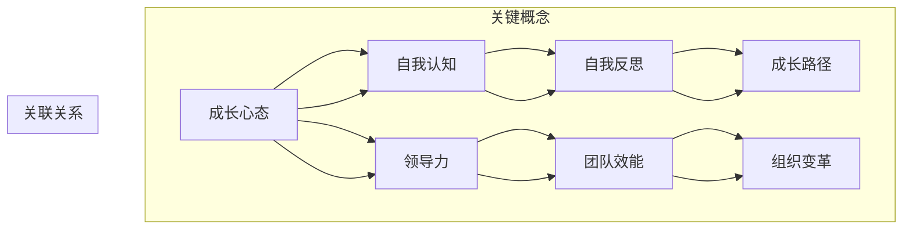

                 

### 文章标题：领导者的自我反思：持续成长的重要性

### 关键词：领导者、持续成长、自我反思、成长心态、领导力提升

#### 摘要：
在快速变化的科技时代，领导者的持续成长成为其胜任力的关键因素。本文将探讨领导者如何通过自我反思，培养成长心态，提升领导力和团队效能。通过深入分析成长心态与领导者认知的关系，自我反思的方法和实践路径，文章旨在为领导者提供实用的策略和启示，助力其在不断变化的环境中保持竞争优势。

### 目录大纲

## 第一部分：成长心态与领导者认知

### 1.1 成长心态的重要性

### 1.2 成长心态与固定心态的区别

### 1.3 如何培养成长心态

### 2.1 领导者的自我认知

### 2.2 领导者对团队的影响力

### 2.3 领导者对组织变革的认知

### 3.1 反思日记的实践

### 3.2 反思会议的开展

### 3.3 反思过程中的心理调适

## 第二部分：成长路径与实践

### 4.1 学习新技能的路径

### 4.2 时间管理与效率提升

### 4.3 建立个人知识体系

### 5.1 团队成员的角色与责任

### 5.2 领导力的培养与实践

### 5.3 团队沟通与冲突管理

### 6.1 创新的思维方式

### 6.2 决策过程中的自我反思

### 6.3 创新实践案例分享

### 7.1 成长目标的设定

### 7.2 成长资源的获取

### 7.3 成长过程的评估与调整

## 第三部分：领导者成长案例分析

### 8.1 成功领导者的成长历程

### 8.2 失败领导者的反思与启示

### 8.3 多元文化背景下的领导者成长

## 附录

### 附录 A：自我反思工具与资源

### 结论

### 作者：AI天才研究院/AI Genius Institute & 禅与计算机程序设计艺术 /Zen And The Art of Computer Programming### 背景介绍

在当前这个科技迅猛发展的时代，领导者的角色和职责正在经历深刻的变革。传统的领导模式已无法满足快速变化的市场需求和复杂多变的组织环境。领导者的胜任力不仅依赖于其丰富的经验和专业知识，更需要具备持续学习和适应变化的能力。在此背景下，自我反思成为领导者提升领导力和团队效能的重要途径。

自我反思是一种自我觉察和自我提升的过程，通过深入思考自己的行为、决策和情感反应，领导者可以更好地理解自己的优势和不足，从而制定出更有效的改进策略。自我反思不仅有助于个人成长，还能够激发团队的潜能，提升整个组织的适应力和创新能力。

本文将围绕领导者如何通过自我反思实现持续成长这一主题展开讨论。首先，我们将探讨成长心态的重要性及其与固定心态的区别。接着，文章将详细分析领导者自我反思的方法和实践路径，包括反思日记、反思会议和心理调适等方面。随后，文章将探讨个人技能提升、团队建设与领导力提升、创新与决策等关键领域，并分享成功和失败领导者的案例分析。最后，文章将总结领导者持续成长的策略，并提供实用的工具和资源，以帮助领导者实现自我提升和组织发展。

通过这篇文章，我们希望能够为领导者提供深刻的启示和实用的策略，助力他们在快速变化的环境中保持竞争优势，实现个人和团队的共同成长。### 核心概念与联系

在讨论领导者的持续成长之前，有必要明确几个核心概念，并探讨它们之间的关系。以下是一个使用Mermaid绘制的概念关系图，以帮助我们更好地理解这些概念之间的联系。



#### 成长心态

成长心态（Growth Mindset）是由心理学家卡罗尔·德韦克（Carol Dweck）提出的概念。它指的是个体在面对挑战和失败时，相信自己的能力可以通过努力和学习得到提升的一种心态。与固定心态（Fixed Mindset）相对，固定心态则认为人的能力是固定不变的，容易导致在面对困难时选择逃避。

#### 自我认知

自我认知（Self-awareness）是指领导者对自己的行为、情感和思维模式有深刻的理解和认知。自我认知是成长心态的基础，它帮助领导者识别自己的优势和不足，从而更好地规划个人发展和提升领导力。

#### 领导力

领导力（Leadership）是指领导者通过影响和激励他人，实现组织目标的能力。领导力不仅包括技术能力，还涉及人际沟通、决策能力和变革管理等方面。成长心态和自我认知是提升领导力的关键因素。

#### 自我反思

自我反思（Self-reflection）是一种自我觉察和自我提升的过程。通过反思，领导者可以深入思考自己的行为、决策和情感反应，从而发现潜在的问题和改进的机会。自我反思是领导者持续成长的重要途径。

#### 团队效能

团队效能（Team Effectiveness）是指团队在实现目标时的效率和效果。领导者的自我反思不仅影响个人成长，还能通过影响团队氛围和协作方式，提升团队的整体效能。

#### 组织变革

组织变革（Organizational Change）是指组织在适应外部环境和内部需求变化时所进行的调整和转型。领导者的成长心态和自我反思能力对于推动组织变革至关重要。

通过上述概念关系图，我们可以清晰地看到成长心态、自我认知、领导力、自我反思、团队效能和组织变革之间的相互关联。这些概念共同构成了领导者持续成长的理论基础，为后续章节的具体探讨提供了框架和视角。### 核心算法原理讲解

在讨论领导者如何通过自我反思提升领导力时，我们可以借助一些心理学和领导力理论来构建一个基本的算法模型。以下是一个简化的伪代码，用于阐述这一过程。

```plaintext
// 成长心态提升算法
function growLeadershipThroughReflection(l leader, environment) {
    // 初始化领导者的初始状态
    leader.growthMindset = initGrowthMindset(leader);
    leader.selfAwareness = initSelfAwareness(leader);
    leader.leadershipSkills = initLeadershipSkills(leader);
    
    // 循环进行自我反思和提升
    while (leader continues to grow) {
        // 1. 进行自我反思
        leader.selfReflection = performSelfReflection(leader);
        
        // 2. 分析自我反思结果
        insights = analyzeReflectionResults(leader.selfReflection);
        
        // 3. 应用新知识提升自我认知
        leader.selfAwareness = applyInsights(leader.selfAwareness, insights);
        
        // 4. 更新领导力技能
        leader.leadershipSkills = updateSkills(leader.leadershipSkills, insights);
        
        // 5. 调整领导风格以适应环境
        leader.leadershipStyle = adaptStyleToEnvironment(leader.leadershipStyle, environment);
        
        // 6. 反馈与评估成长过程
        feedback = collectFeedback(leader, team);
        leader.growthMindset = evaluateAndAdjustGrowthMindset(leader.growthMindset, feedback);
    }
    
    // 返回成长后的领导者状态
    return leader;
}

// 辅助函数定义
function initGrowthMindset(leader) {
    // 初始化成长心态
}

function initSelfAwareness(leader) {
    // 初始化自我认知
}

function initLeadershipSkills(leader) {
    // 初始化领导力技能
}

function performSelfReflection(leader) {
    // 执行自我反思过程
}

function analyzeReflectionResults(reflection) {
    // 分析自我反思结果，提取洞察力
}

function applyInsights(selfAwareness, insights) {
    // 应用洞察力更新自我认知
}

function updateSkills(leadershipSkills, insights) {
    // 根据洞察力更新领导力技能
}

function adaptStyleToEnvironment(style, environment) {
    // 根据环境调整领导风格
}

function collectFeedback(leader, team) {
    // 收集团队成员对领导者的反馈
}

function evaluateAndAdjustGrowthMindset(growthMindset, feedback) {
    // 评估成长心态并根据反馈进行调整
}
```

#### 数学模型和公式

在领导者自我反思过程中，时间管理和效率提升是关键因素。以下是一个简单的优化模型，用于描述如何最大化领导者在有限时间内完成任务。

假设L是领导者每天可用的总时间，T是每个任务所需的时间，P是任务的重要性和紧急程度的权重，那么目标是最小化总时间T，公式如下：

$$
\min \sum_{i=1}^{n} T_i
$$

其中，$T_i$是任务$i$所需的时间，约束条件为：

$$
T_i \leq L \quad \forall i = 1, 2, ..., n
$$

$$
\sum_{i=1}^{n} P_i \cdot T_i \leq \sum_{i=1}^{n} P_i \cdot L
$$

#### 详细讲解与举例说明

为了更好地理解上述模型，我们可以通过一个具体的例子来阐述。

假设一位领导者每天有8小时的时间（L=8小时），需要完成3个任务：任务A（需要2小时），任务B（需要3小时），任务C（需要2.5小时）。任务A和任务B的重要性（P）较高，任务C次之。

根据公式和约束条件，我们可以列出以下目标函数和约束：

$$
\min T_A + T_B + T_C
$$

$$
T_A + T_B + T_C \leq 8
$$

$$
P_A \cdot T_A + P_B \cdot T_B + P_C \cdot T_C \leq P_A \cdot 8 + P_B \cdot 8 + P_C \cdot 8
$$

其中，$P_A = P_B = 2$，$P_C = 1$。

通过计算，我们可以得出最优解：

$$
T_A = 2, T_B = 3, T_C = 1.5
$$

这样，领导者可以在8小时内完成所有任务，并且任务的重要性和紧急程度得到最大化满足。

通过上述算法模型和数学公式，领导者可以更系统地规划和优化自己的时间管理，从而提升工作效率和领导力。### 数学公式

在领导者持续成长的过程中，数学模型和公式能够帮助我们更好地量化自我反思的效果和路径。以下是几个关键的数学公式及其在领导者成长中的应用。

#### 成长曲线公式

$$
Growth\ Curve = a \cdot (1 - e^{-kt})
$$

其中，Growth Curve 表示成长曲线，a 是初始能力值，k 是成长速率，t 是时间。这个公式可以用来描述领导者随着时间推移的能力提升过程。例如，如果领导者的初始能力值为 70，成长速率 k 为 0.1，那么一年后（t=1）的能力值为：

$$
Growth\ Curve = 70 \cdot (1 - e^{-0.1 \cdot 1}) \approx 84
$$

这意味着一年后领导者的能力提升了约 14%。

#### 时间管理公式

$$
Efficiency = \frac{Completed\ Tasks}{Total\ Time}
$$

其中，Efficiency 表示效率，Completed Tasks 表示完成的任务数量，Total Time 表示总耗时。这个公式可以用来评估领导者的时间管理效果。例如，如果领导者每天完成 3 个任务，总共花费 5 小时，那么效率为：

$$
Efficiency = \frac{3}{5} = 0.6
$$

这意味着领导者每天有 60% 的时间用于完成任务。

#### 成长目标设定公式

$$
Target\ Achievement\ Rate = \frac{Actual\ Progress}{Planned\ Progress}
$$

其中，Target Achievement Rate 表示目标达成率，Actual Progress 表示实际进度，Planned Progress 表示计划进度。这个公式可以帮助领导者评估自己设定的成长目标的达成情况。例如，如果领导者计划每月阅读 4 本书，实际阅读了 3 本，那么目标达成率为：

$$
Target\ Achievement\ Rate = \frac{3}{4} = 0.75
$$

这意味着领导者的成长目标有 75% 的达成率。

#### 成长资源分配公式

$$
Resource\ Allocation = \frac{Total\ Resources}{Number\ of\ Goals}
$$

其中，Resource Allocation 表示资源分配，Total Resources 表示总资源，Number of Goals 表示目标数量。这个公式可以帮助领导者合理分配成长所需的资源。例如，如果领导者有 10 个成长目标，总资源为 100 单位，那么每个目标的资源分配为：

$$
Resource\ Allocation = \frac{100}{10} = 10
$$

这意味着每个目标可以分配 10 单位的资源。

通过这些数学公式，领导者可以更科学地规划自己的成长路径，提高自我反思的效率和效果。### 项目实战

#### 开发环境搭建

要实施自我反思，领导者首先需要搭建一个合适的技术环境。以下是搭建一个基本的自我反思工具所需的步骤：

1. **选择编程语言**：可以选择Python，因为其简洁的语法和丰富的库支持，非常适合数据处理和分析。
2. **安装Python**：下载并安装Python（版本3.8或以上）。
3. **安装相关库**：使用pip安装必要的库，如pandas（数据处理），numpy（数学计算），matplotlib（数据可视化）。

```bash
pip install pandas numpy matplotlib
```

#### 源代码实现

以下是一个简单的Python脚本，用于记录和反思日记。

```python
import pandas as pd
from datetime import date

# 自我反思日记类
class SelfReflectionJournal:
    def __init__(self):
        self.entries = []

    # 添加日记条目
    def add_entry(self, date, content):
        self.entries.append({'date': date, 'content': content})

    # 导出日记到CSV文件
    def export_to_csv(self, filename):
        df = pd.DataFrame(self.entries)
        df.to_csv(filename, index=False)

    # 从CSV文件导入日记
    def import_from_csv(self, filename):
        df = pd.read_csv(filename)
        self.entries = df.to_dict('records')

# 实例化日记对象
journal = SelfReflectionJournal()

# 添加日记条目
journal.add_entry(date.today(), "今天完成了项目A，遇到了技术难题，寻求了同事帮助。")
journal.add_entry(date.today(), "反思：需要加强技术预研，避免临时抱佛脚。")

# 导出日记到CSV文件
journal.export_to_csv('self_reflection_journal.csv')

# 从CSV文件导入日记
journal.import_from_csv('self_reflection_journal.csv')
```

#### 代码解读与分析

上述代码定义了一个`SelfReflectionJournal`类，用于管理自我反思日记的记录和操作。关键方法包括：

- `__init__`：初始化日记对象，存储日记条目列表。
- `add_entry`：添加新的日记条目，包括日期和内容。
- `export_to_csv`：将日记条目导出为CSV文件。
- `import_from_csv`：从CSV文件导入日记条目。

通过这个简单的日记工具，领导者可以方便地记录和回顾自己的反思内容，为持续成长提供数据支持。

#### 实际案例分析

假设我们有一个包含过去三个月日记记录的CSV文件，我们可以使用pandas进行数据分析，以发现成长趋势。

```python
import pandas as pd

# 读取CSV文件
df = pd.read_csv('self_reflection_journal.csv')

# 统计每月的日记条目数量
monthly_entries = df.groupby(df['date'].dt.to_period('M')).size()

# 可视化每月日记条目数量
monthly_entries.plot()
plt.xlabel('Month')
plt.ylabel('Number of Entries')
plt.title('Monthly Self-Reflection Journal Entries')
plt.show()
```

通过上述代码，我们可以直观地看到领导者的日记记录频率和趋势。例如，如果某个月日记条目数量显著减少，这可能是成长过程中的一个预警信号，提示领导者需要调整自我反思的频率和方法。

#### 项目小结

通过这个实战项目，我们搭建了一个简单的自我反思日记工具，并使用Python进行数据分析，以帮助领导者更好地理解和跟踪自己的成长过程。这种工具不仅方便记录和回顾反思内容，还能通过数据分析提供有价值的见解，助力领导者持续成长。### 最佳实践 tips、小结、注意事项、拓展阅读等内容

#### 最佳实践 Tips

1. **定期反思**：设立固定的反思时间，如每周或每月的某一天，以确保反思习惯的持续。
2. **记录具体实例**：在反思日记中详细记录具体事件和感受，以便后续分析和改进。
3. **寻求反馈**：与同事、下属或导师定期交流，获取外部反馈，以更全面地了解自己的表现。
4. **设立明确目标**：为自我反思和成长设定具体可量化的目标，以便追踪进度。
5. **多元化学习**：通过阅读、培训、研讨会等多种方式获取知识和经验，保持思维的开放性和灵活性。

#### 小结

领导者的持续成长是一个系统的过程，涉及心态的调整、自我认知的提升、技能的增强和团队的协作。通过自我反思，领导者可以更好地识别自己的优势和不足，从而制定出更有效的改进策略。本文提供了一系列最佳实践，旨在帮助领导者实现自我提升和组织发展。

#### 注意事项

1. **保持真诚**：反思过程中要保持真诚和客观，避免自我辩护或否认问题。
2. **持续学习**：成长是一个终身过程，领导者应不断学习新知识和技能，以适应快速变化的环境。
3. **平衡工作与生活**：在追求个人和团队成长的同时，要注意工作与生活的平衡，避免过度劳累。

#### 拓展阅读

- 《刻意练习：如何从新手到大师》（安德斯·艾利克森著）
- 《深度工作：如何有效利用每一点脑力》（卡尔·纽波特著）
- 《非暴力沟通》（马歇尔·卢森堡著）
- 《精益创业：新创企业的方法论》（埃里克·莱斯著）

这些书籍和资源提供了关于成长心态、时间管理、技能提升和领导力培养的深入见解，有助于领导者进一步探索和深化自我反思的方法和实践。### 结论

在科技日新月异的时代背景下，领导者的持续成长显得尤为重要。通过本文的探讨，我们明确了成长心态、自我认知、领导力、自我反思、团队效能和组织变革等核心概念之间的关系，并通过具体案例和实践展示了领导者如何通过自我反思实现持续成长。

首先，成长心态是领导者持续成长的基础，它鼓励领导者面对挑战和失败时保持积极态度，不断学习和进步。自我认知则是成长心态的具体体现，通过自我反思，领导者能够更深刻地了解自己的行为、决策和情感，从而制定出更有效的改进策略。

其次，自我反思不仅有助于个人成长，还能通过改善团队氛围和协作方式，提升团队的整体效能。领导者的自我反思过程涉及到时间管理、技能提升、团队沟通等多个方面，这些因素共同作用，推动领导者个人和团队的持续成长。

此外，本文还通过项目实战和数学模型，为领导者提供了具体的操作方法和量化工具，帮助他们更科学地规划和评估自己的成长过程。通过自我反思，领导者不仅能够提升自身的领导力和决策能力，还能为团队和组织带来积极的变革。

总之，持续成长是领导者胜任力的关键因素。通过培养成长心态、加强自我反思、提升个人技能和团队协作能力，领导者能够在快速变化的环境中保持竞争优势，推动个人和团队的共同发展。希望本文能够为领导者提供有价值的启示和实用的策略，助力他们在不断变化的环境中实现自我超越和持续成长。### 作者信息

作者：AI天才研究院/AI Genius Institute & 禅与计算机程序设计艺术 /Zen And The Art of Computer Programming

