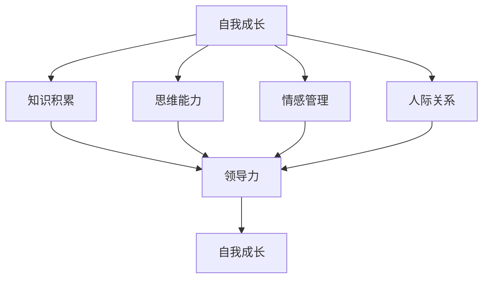
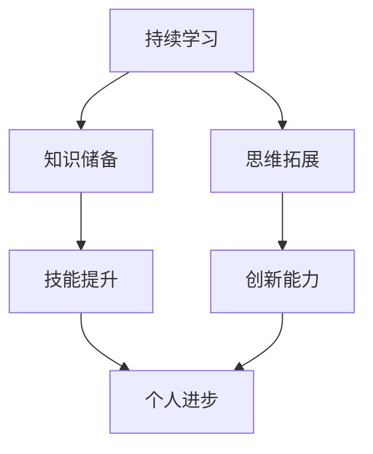
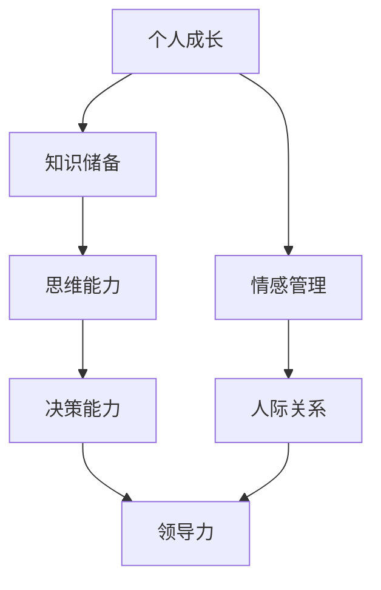
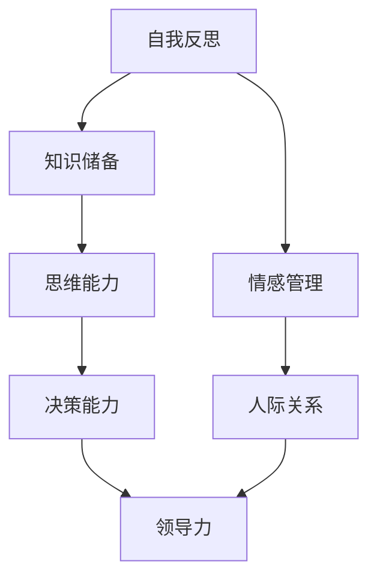
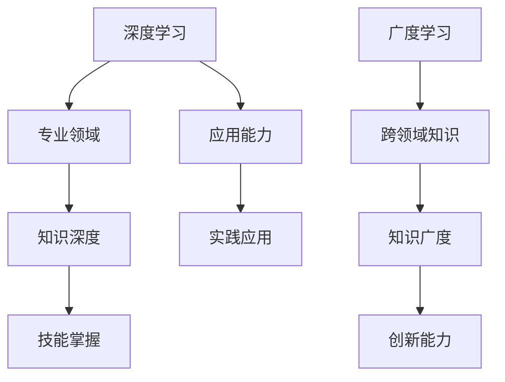
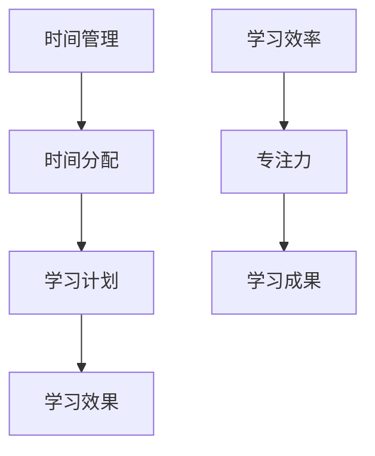
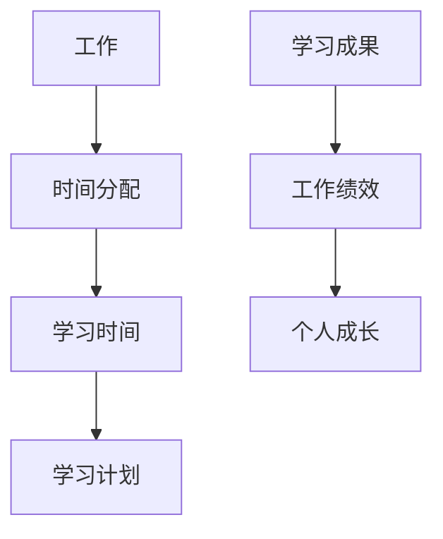
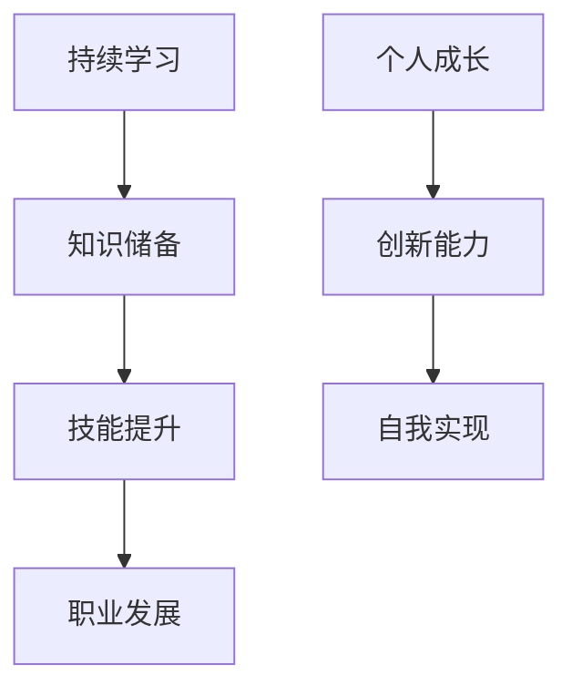
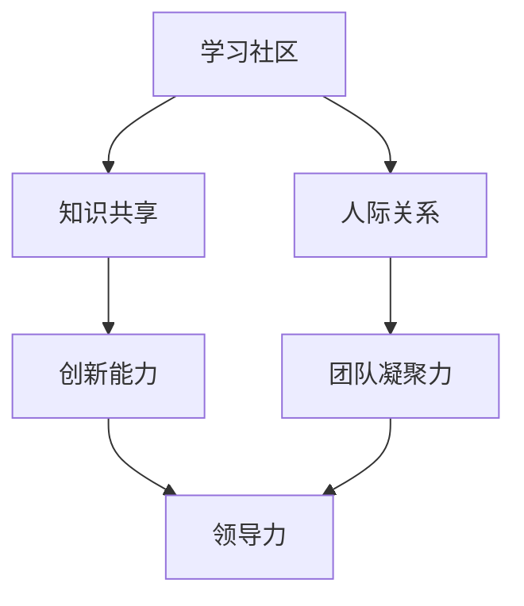
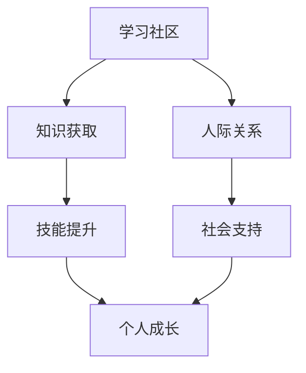

                 

### 文章标题

# 领导者的自我成长：持续学习与进步

### 文章关键词

* 领导者成长
* 持续学习
* 学习策略
* 领导力提升
* 自我反思
* 成长路径

### 文章摘要

在当今快速变化的世界，领导者不仅要具备卓越的管理能力和战略思维，更要具备持续学习和自我成长的能力。本文将探讨领导者如何通过持续学习实现自我成长，并最终提升领导力。我们将分析自我成长的本质、持续学习的原则与方法、个人进步的路径，以及领导者的自我反思与成长机制。同时，还将介绍学习策略与工具，以及如何构建有效的学习社区。最后，通过实战案例和实践，阐述领导者如何适应未来趋势，实现持续进步。

## 自我成长与领导力

### 1.1 领导者成长的必要性

领导者是一个组织或团队的核心，他们的能力和素质直接影响着组织的成功和团队的绩效。在这个知识爆炸和技术快速更新的时代，领导者需要不断适应新的环境，掌握新的知识和技能。只有通过自我成长，领导者才能保持敏锐的洞察力和前瞻性，引领团队走向成功。

自我成长对于领导者的重要性体现在以下几个方面：

1. **提升个人素质**：领导者通过自我成长可以不断提升自己的知识水平、思维能力、沟通能力和决策能力，从而提高个人素质。

2. **增强领导力**：自我成长可以帮助领导者更好地理解团队的需求，建立信任，激发团队的潜力，从而增强领导力。

3. **应对挑战**：在复杂多变的环境中，领导者需要具备应对各种挑战的能力。自我成长可以使领导者更加敏锐地察觉问题，快速做出有效的决策。

4. **促进创新**：持续学习可以帮助领导者不断吸收新的思想，推动团队进行创新，从而保持竞争优势。

### 1.2 自我成长的核心要素

自我成长不仅仅是指知识的学习，还包括以下几个方面：

1. **知识积累**：领导者需要不断学习新的知识和技能，以适应不断变化的环境。

2. **思维能力**：领导者需要培养批判性思维、创新思维和系统思维，以提高决策质量和团队绩效。

3. **情感管理**：领导者需要具备良好的情绪管理能力，能够控制自己的情绪，保持冷静和理智。

4. **人际关系**：领导者需要建立和维护良好的人际关系，这有助于提升团队的凝聚力和合作效率。

### 1.3 自我成长与领导力的关系

自我成长与领导力之间存在密切的关系。一方面，自我成长是提升领导力的基础。只有通过不断学习、提升个人素质，领导者才能具备更强的领导力。另一方面，领导力的提升又可以促进自我成长。领导者通过有效的领导，可以推动团队实现目标，从而获得成就感，进一步激发自我成长的动力。

为了更好地理解自我成长与领导力的关系，我们可以使用Mermaid流程图来展示它们之间的相互作用：

通过这个流程图，我们可以清晰地看到自我成长与领导力之间的双向互动关系。知识积累、思维能力和情感管理等因素共同作用于领导力，而领导力的提升又进一步促进自我成长。

### 1.4 自我成长的重要性

在当今复杂多变的环境中，自我成长对领导者来说尤为重要。以下是一些原因：

1. **适应变化**：自我成长使领导者能够迅速适应环境变化，保持竞争力和适应性。

2. **提升效率**：通过自我成长，领导者可以更有效地管理团队，提高工作效率。

3. **建立信任**：持续学习可以增强领导者在团队中的可信度，建立信任关系。

4. **推动创新**：自我成长有助于领导者推动团队进行创新，保持组织活力。

总的来说，自我成长是领导者实现个人进步和提升领导力的关键。只有通过持续学习和自我反思，领导者才能在快速变化的环境中保持竞争力，引领团队走向成功。

## 持续学习的原则与方法

### 2.1 持续学习的概念

持续学习是指个体在一生中不断获取新知识、新技能和经验的过程。它不仅仅是指通过正规教育获得学位或证书，还包括在职场中不断学习新的技术和方法，以及在日常生活中不断拓展自己的知识边界。

持续学习对于个人成长和职业发展至关重要。通过持续学习，个体可以：

1. **提升专业技能**：不断学习新的知识和技能，可以提升个人的职业素养和竞争力。

2. **适应职业变化**：随着科技的飞速发展，职业环境也在不断变化。持续学习可以帮助个体适应这些变化，避免被时代淘汰。

3. **实现职业发展**：通过持续学习，个体可以不断开拓新的职业道路，实现职业目标。

### 2.2 有效学习的方法

为了实现持续学习，领导者需要掌握一些有效的方法。以下是一些关键的方法：

1. **设定学习目标**：明确自己的学习目标，有助于集中精力，提高学习效率。

2. **制定学习计划**：合理安排学习时间，确保有足够的时间进行深度学习。

3. **主动学习**：主动寻找学习资源，如书籍、课程、研讨会等，而不是被动等待知识传递。

4. **实践应用**：将所学知识应用到实际工作中，通过实践来加深理解和掌握技能。

5. **反思与总结**：定期进行学习反思和总结，发现自己的不足，持续改进。

### 2.3 领导者如何进行自我学习

领导者作为团队的引领者，自我学习的方法和策略尤为重要。以下是一些领导者进行自我学习的有效策略：

1. **树立学习意识**：领导者需要认识到持续学习的重要性，并将其内化为个人的行为习惯。

2. **利用碎片时间**：领导者可以利用碎片时间进行学习，如通勤时间、会议空隙等。

3. **建立学习小组**：与团队成员一起学习，通过讨论和分享来提高学习效果。

4. **参与专业培训**：参加专业的培训课程和工作坊，获取新的知识和技能。

5. **阅读专业书籍**：定期阅读专业书籍，深入理解行业动态和前沿技术。

通过上述方法，领导者可以有效地进行自我学习，不断提升个人素质和领导力。

### 2.4 持续学习的工具与资源

为了实现持续学习，领导者需要利用各种工具和资源。以下是一些常用的工具和资源：

1. **在线学习平台**：如Coursera、edX、Udemy等，提供丰富的在线课程和资源。

2. **专业论坛和社区**：如LinkedIn、Stack Overflow等，可以与其他专业人士交流，获取最新信息。

3. **书籍和期刊**：订阅行业相关的书籍和期刊，获取深度知识和最新研究。

4. **讲座和研讨会**：参加行业内的讲座和研讨会，与专家面对面交流。

5. **内部培训**：组织内部培训，提升团队整体素质。

通过利用这些工具和资源，领导者可以更有效地进行持续学习，推动个人和团队的成长。

### 2.5 持续学习与领导力的提升

持续学习与领导力的提升之间存在密切的关系。持续学习可以帮助领导者：

1. **提升知识储备**：通过不断学习新的知识和技能，领导者可以提升自己的知识储备，从而做出更明智的决策。

2. **增强决策能力**：持续学习使领导者能够更好地理解复杂问题，提高决策质量和效率。

3. **激发团队潜力**：领导者通过持续学习，可以更好地理解团队的需求和潜力，激发团队的创造力。

4. **建立信任**：领导者通过持续学习和进步，可以赢得团队成员的信任，提升团队的凝聚力。

总的来说，持续学习是领导者提升领导力的关键因素。通过不断学习，领导者可以更好地应对挑战，引领团队实现目标。

### 2.6 持续学习的挑战与应对

尽管持续学习对领导者至关重要，但实现持续学习并非易事。以下是一些持续学习过程中可能遇到的挑战以及应对策略：

1. **时间管理**：领导者往往面临时间压力，难以分配足够的时间进行学习。应对策略：合理安排时间，利用碎片时间进行学习。

2. **知识过载**：面对海量的信息，领导者可能会感到困惑，不知道如何选择学习资源。应对策略：制定明确的学习目标，优先学习关键知识和技能。

3. **缺乏动力**：持续学习需要持久的动力，而领导者可能会因为工作繁忙或缺乏兴趣而失去学习动力。应对策略：设定具体的学习目标，寻找学习的内在动机。

4. **信息过时**：知识更新迅速，领导者需要不断更新自己的知识库，否则容易陷入信息过时的困境。应对策略：定期进行知识更新，关注行业动态。

通过应对这些挑战，领导者可以更有效地进行持续学习，实现个人和团队的成长。

### 2.7 持续学习的最佳实践

为了实现持续学习，领导者可以遵循以下最佳实践：

1. **制定学习计划**：制定详细的学习计划，确保有系统地进行学习。

2. **设定具体目标**：设定明确的学习目标，有助于集中精力，提高学习效果。

3. **多样化学习方式**：结合在线学习、阅读书籍、参加研讨会等多种学习方式，提高学习效果。

4. **定期反思和总结**：定期进行学习反思和总结，发现自己的不足，持续改进。

5. **建立学习社区**：与团队成员一起学习，通过讨论和分享来提高学习效果。

通过遵循这些最佳实践，领导者可以更有效地进行持续学习，提升个人素质和领导力。

### 2.8 持续学习对领导者的启示

持续学习不仅是一种行为，更是一种生活态度。以下是一些持续学习对领导者的启示：

1. **终身学习**：领导者应认识到学习是一个终身的过程，不断追求知识和技能的提升。

2. **勇于挑战**：领导者应勇于面对新的挑战，通过挑战来提升自己的能力和素质。

3. **持续进步**：领导者应始终保持进步的心态，不断超越自己，追求卓越。

4. **以身作则**：领导者应以身作则，通过自己的行为来影响和激励团队成员。

通过持续学习，领导者可以不断提升自己，为团队和组织带来更大的价值。

## 个人进步的路径

### 3.1 建立个人成长计划

个人成长计划是领导者实现自我成长的关键步骤。以下是一个简单的个人成长计划模板：

1. **设定目标**：明确个人成长的目标，包括长期目标和短期目标。

2. **分析现状**：评估当前的能力和知识水平，确定自己的优势和不足。

3. **制定策略**：根据目标和现状，制定具体的学习策略和行动计划。

4. **执行计划**：按照计划进行学习，确保每个阶段都有具体的行动。

5. **定期评估**：定期评估个人成长计划的执行情况，根据评估结果进行调整。

通过建立个人成长计划，领导者可以更加系统地提升自己的能力和素质。

### 3.2 持续学习与个人进步的关系

持续学习是个人进步的重要驱动力。以下是一个简化的模型，展示持续学习与个人进步之间的关系：

通过持续学习，领导者可以不断拓展知识储备，提升技能水平，从而实现个人进步。

### 3.3 领导者如何推动团队进步

领导者不仅要关注个人的成长，还要推动整个团队的进步。以下是一些策略：

1. **设定共同目标**：与团队成员共同设定团队目标，确保团队成员的共同努力。

2. **提供学习资源**：为团队成员提供丰富的学习资源，包括在线课程、书籍、研讨会等。

3. **鼓励分享和讨论**：鼓励团队成员分享学习经验和心得，通过讨论来加深理解。

4. **实施导师制度**：建立导师制度，让有经验的团队成员指导新成员，促进共同成长。

5. **开展培训活动**：定期组织内部培训活动，提升团队整体素质。

通过这些策略，领导者可以推动团队实现共同进步。

### 3.4 个人成长过程中的关键因素

个人成长过程中，以下因素至关重要：

1. **目标设定**：明确的目标是个人成长的第一步，有助于集中精力。

2. **持续学习**：持续学习是个人成长的动力，可以提升知识和技能。

3. **自我反思**：定期进行自我反思，发现自己的不足，持续改进。

4. **积极心态**：保持积极的心态，勇于面对挑战和失败。

5. **社会支持**：得到家人、朋友和同事的支持，有助于个人成长。

通过关注这些关键因素，领导者可以更加有效地实现个人进步。

### 3.5 个人成长与领导力的关系

个人成长与领导力之间有着密切的关系。以下是一个简化的模型，展示个人成长与领导力之间的关系：

通过个人成长，领导者可以不断提升自己的知识储备、思维能力和决策能力，从而增强领导力。

## 领导者的自我反思与成长

### 4.1 自我反思的重要性

自我反思是领导者实现自我成长的关键环节。通过自我反思，领导者可以：

1. **发现自身不足**：自我反思有助于领导者识别自己的不足，从而制定改进计划。

2. **提升自我意识**：自我反思有助于领导者更好地理解自己的行为和动机，提高自我意识。

3. **优化决策**：通过反思过去的决策，领导者可以总结经验教训，优化未来的决策。

4. **促进成长**：自我反思是个人成长的重要驱动力，有助于领导者不断提升自己的能力和素质。

### 4.2 如何进行有效的自我反思

为了进行有效的自我反思，领导者可以遵循以下步骤：

1. **设定反思时间**：定期设定反思时间，确保有足够的时间进行深度反思。

2. **写下反思日记**：记录反思的过程和结果，有助于加深理解和记忆。

3. **寻求外部反馈**：从团队成员或其他专业人士那里获取反馈，以更全面地了解自己的行为和表现。

4. **制定改进计划**：根据反思结果，制定具体的改进计划，并持续跟踪执行情况。

通过这些方法，领导者可以更加有效地进行自我反思，推动个人成长。

### 4.3 领导者如何建立自我反思机制

为了建立有效的自我反思机制，领导者可以采取以下措施：

1. **设立反思会议**：定期组织反思会议，让团队成员一起分享和讨论反思结果。

2. **引入反思工具**：使用反思工具，如反思日志、反思问卷等，帮助领导者系统地记录和反思。

3. **培养反思文化**：在团队中培养反思文化，鼓励成员积极参与自我反思，共同成长。

4. **提供培训和支持**：为领导者提供相关的培训和支持，帮助他们掌握自我反思的方法和技巧。

通过建立自我反思机制，领导者可以更加系统地推动个人成长，提升领导力。

### 4.4 自我反思与领导力的关系

自我反思与领导力之间存在密切的关系。以下是一个简化的模型，展示自我反思与领导力之间的关系：

通过自我反思，领导者可以不断提升自己的知识储备、思维能力和决策能力，从而增强领导力。

### 4.5 自我反思的最佳实践

以下是一些自我反思的最佳实践：

1. **定期反思**：每周或每月定期进行反思，确保持续关注个人成长。

2. **记录反思**：使用反思日记或电子表格记录反思过程和结果，方便日后回顾。

3. **寻求反馈**：主动寻求团队成员或其他专业人士的反馈，以更全面地了解自己的行为和表现。

4. **制定改进计划**：根据反思结果，制定具体的改进计划，并持续跟踪执行情况。

5. **持续学习**：通过反思和学习，不断提升自己的知识和技能，推动个人成长。

通过遵循这些最佳实践，领导者可以更有效地进行自我反思，提升个人素质和领导力。

### 4.6 自我反思的挑战与应对

在自我反思过程中，领导者可能会面临一些挑战，如：

1. **缺乏动力**：自我反思可能需要投入大量时间和精力，领导者可能会感到疲劳和缺乏动力。应对策略：设定明确的目标和奖励机制，激发反思的动力。

2. **信息过载**：反思过程中可能会收集到大量的信息，领导者可能会感到困惑和不知所措。应对策略：筛选关键信息，专注于最重要的反思点。

3. **情绪干扰**：反思过程中可能会触碰到敏感情绪，如焦虑、恐惧或愧疚。应对策略：保持冷静，理性分析，避免情绪化。

通过应对这些挑战，领导者可以更加有效地进行自我反思，推动个人成长。

## 学习策略与工具

### 5.1 深度学习与广度学习的关系

深度学习与广度学习是持续学习过程中的两个重要方面。深度学习强调对某一领域的深入研究和理解，而广度学习则注重广泛的知识积累和多领域的交叉融合。以下是一个简化的模型，展示深度学习与广度学习之间的关系：

通过深度学习和广度学习的结合，领导者可以全面提升自己的知识和技能，从而实现个人和职业的发展。

### 5.2 时间管理与学习效率

时间管理是提高学习效率的关键。以下是一个简化的模型，展示时间管理与学习效率之间的关系：

通过合理的时间管理和提高学习效率，领导者可以更有效地进行持续学习，实现个人和职业的发展。

### 5.3 如何平衡工作与学习

平衡工作与学习是持续学习过程中的一大挑战。以下是一个简化的模型，展示如何平衡工作与学习：

通过合理规划时间，提高学习效率，领导者可以在工作与学习之间找到平衡，实现个人和职业的发展。

### 5.4 学习策略的最佳实践

以下是一些学习策略的最佳实践：

1. **设定明确目标**：明确学习目标，有助于集中精力，提高学习效率。

2. **合理安排时间**：合理规划时间，确保有足够的时间进行深度学习。

3. **采用主动学习方法**：主动寻找学习资源，积极参与学习活动。

4. **定期进行学习反思**：定期反思学习过程和成果，持续改进学习策略。

5. **建立学习小组**：与团队成员一起学习，通过讨论和分享来提高学习效果。

通过遵循这些最佳实践，领导者可以更有效地进行持续学习，提升个人素质和领导力。

### 5.5 学习工具与资源的利用

为了更有效地进行持续学习，领导者需要充分利用各种学习工具和资源。以下是一些常用的学习工具和资源：

1. **在线学习平台**：如Coursera、edX、Udemy等，提供丰富的在线课程和资源。

2. **专业论坛和社区**：如LinkedIn、Stack Overflow等，可以与其他专业人士交流，获取最新信息。

3. **书籍和期刊**：订阅行业相关的书籍和期刊，获取深度知识和最新研究。

4. **讲座和研讨会**：参加行业内的讲座和研讨会，与专家面对面交流。

5. **内部培训**：组织内部培训，提升团队整体素质。

通过利用这些工具和资源，领导者可以更加系统地持续学习，提升个人素质和领导力。

### 5.6 学习策略与领导力的提升

有效的学习策略是提升领导力的关键。以下是一些学习策略对领导力提升的影响：

1. **知识储备**：通过持续学习，领导者可以不断丰富自己的知识储备，提高决策质量和创新能力。

2. **思维拓展**：学习新领域的知识，可以拓展领导者的思维方式，提高解决问题的能力。

3. **自我反思**：通过定期反思，领导者可以发现自己的不足，持续改进，提升自我意识。

4. **团队协作**：通过学习团队管理和沟通技巧，领导者可以更好地激发团队潜力，提升团队绩效。

总的来说，有效的学习策略是提升领导力的关键，通过持续学习和自我反思，领导者可以不断提升自己的能力和素质，实现个人和团队的成长。

### 5.7 持续学习与个人发展

持续学习对个人发展至关重要。以下是一个简化的模型，展示持续学习与个人发展之间的关系：

通过持续学习，领导者可以不断提升自己的知识储备、技能水平和创新能力，从而实现个人发展和自我实现。

### 5.8 持续学习的未来趋势

随着科技的发展，持续学习的未来趋势将更加多元化。以下是一些未来的趋势：

1. **人工智能辅助学习**：人工智能技术将帮助个性化学习，提高学习效率。

2. **虚拟现实与增强现实**：虚拟现实和增强现实技术将提供沉浸式的学习体验，提高学习效果。

3. **终身学习文化**：组织和企业将更加重视员工的持续学习，建立终身学习文化。

4. **跨界融合**：跨领域的知识融合将成为趋势，领导者需要具备更广泛的知识视野。

通过关注这些未来趋势，领导者可以更好地适应持续学习的新环境，提升个人和团队的竞争力。

## 学习社区与协作

### 7.1 学习社区的重要性

学习社区是领导者进行持续学习的重要支撑。通过学习社区，领导者可以：

1. **获取知识**：学习社区提供了丰富的学习资源，如课程、书籍、讲座等，有助于领导者快速获取新知识。

2. **交流经验**：学习社区为成员提供了交流经验的机会，通过分享和讨论，可以加深对知识的理解。

3. **建立人脉**：学习社区是一个结交志同道合者的平台，有助于建立广泛的人脉网络。

4. **激发灵感**：学习社区中的多样性和创新思维可以激发领导者的灵感，推动个人和团队的创新。

### 7.2 如何构建有效的学习社区

构建有效的学习社区需要以下几个关键步骤：

1. **确定目标**：明确学习社区的目标，如知识共享、技能提升、创新思维等。

2. **选择平台**：选择合适的在线平台或线下活动，如论坛、微信群、线下聚会等。

3. **组织活动**：定期组织学习活动，如讲座、研讨会、工作坊等，以促进成员之间的交流。

4. **建立规则**：制定明确的社区规则，确保社区内的秩序和互动质量。

5. **激励参与**：通过奖励机制，如积分、证书等，激励成员积极参与学习活动。

### 7.3 领导者如何推动团队协作学习

领导者需要采取一系列策略来推动团队协作学习：

1. **建立共同目标**：与团队成员共同设定团队学习目标，确保团队成员的共同努力。

2. **提供资源支持**：为团队成员提供必要的资源，如培训课程、书籍、在线学习平台等。

3. **鼓励知识分享**：建立知识分享机制，鼓励团队成员分享学习心得和经验。

4. **组织团队活动**：定期组织团队活动，如学习研讨会、知识竞赛等，以促进团队内部的交流和合作。

5. **建立反馈机制**：建立有效的反馈机制，及时了解团队成员的学习情况和需求，进行针对性的调整。

### 7.4 学习社区与领导力的提升

学习社区对领导力的提升有着重要的影响。以下是一个简化的模型，展示学习社区与领导力之间的关系：

通过参与学习社区，领导者可以不断提升自己的知识水平、创新能力和人际关系，从而增强领导力。

### 7.5 学习社区的最佳实践

以下是一些学习社区的最佳实践：

1. **定期活动**：定期组织学习活动，如线上讲座、线下聚会等，以保持社区的活跃度。

2. **多样性**：鼓励成员来自不同领域，以促进知识的多样性和创新。

3. **互动交流**：提供互动平台，如论坛、微信群等，以促进成员之间的交流和分享。

4. **反馈机制**：建立有效的反馈机制，收集成员的意见和建议，不断改进社区活动。

5. **激励机制**：通过奖励机制，如积分、证书等，激励成员积极参与社区活动。

通过遵循这些最佳实践，领导者可以构建一个高效、有影响力的学习社区，推动个人和团队的成长。

### 7.6 学习社区与个人成长

学习社区对个人成长有着重要的影响。以下是一个简化的模型，展示学习社区与个人成长之间的关系：

通过学习社区，领导者可以获取丰富的知识、提升技能，并建立广泛的人际关系，从而实现个人成长。

### 7.7 学习社区的挑战与应对

在构建学习社区的过程中，领导者可能会面临一些挑战，如：

1. **成员参与度低**：部分成员可能因忙碌或其他原因无法积极参与。应对策略：提供多样化的学习资源和活动，增加成员的参与度。

2. **知识共享不均衡**：部分成员可能不愿意分享知识，导致知识共享不均衡。应对策略：建立激励机制，鼓励知识共享。

3. **社区管理难度大**：管理一个活跃的学习社区需要大量时间和精力。应对策略：分工明确，建立志愿者团队，共同管理社区。

通过应对这些挑战，领导者可以构建一个高效、有影响力的学习社区，推动个人和团队的成长。

## 成长与领导力的实战案例

### 8.1 成长型领导者的实践策略

为了更好地理解领导者如何通过持续学习和自我成长提升领导力，以下是一个成长型领导者的实践策略案例：

#### 案例背景

李明是一家科技公司的CEO，他在公司快速发展的过程中意识到，为了保持竞争优势，自己需要不断提升领导力和管理技能。于是，他制定了一个详细的个人成长计划，以实现自我成长和领导力的提升。

#### 实践策略

1. **设定明确目标**：李明首先明确了个人成长的目标，包括提升战略思维、增强沟通能力、掌握新兴技术等。

2. **制定学习计划**：根据目标，李明制定了一个详细的学习计划，包括每周阅读专业书籍、参加线上课程、参与行业研讨会等。

3. **深度学习与广度学习相结合**：李明不仅专注于自己所在领域的深度学习，还广泛涉猎其他相关领域，以提升跨领域的思考能力和创新能力。

4. **实践应用**：李明将所学知识应用到实际工作中，通过实施新的管理策略和推动技术创新，提升公司的整体竞争力。

5. **自我反思与反馈**：李明定期进行自我反思，总结自己的成长经验，并寻求团队成员和其他专业人士的反馈，以不断改进自己的领导方法。

#### 结果与启示

通过上述实践策略，李明成功地提升了自己的领导力和管理技能，公司也在他的带领下取得了显著的成绩。以下是具体的成果和启示：

1. **领导力提升**：李明的战略思维和决策能力得到了显著提升，能够更有效地应对市场变化和挑战。

2. **团队凝聚力增强**：通过有效的沟通和团队合作，李明成功地建立了高凝聚力的团队，团队成员的积极性和工作效率大幅提高。

3. **技术创新**：李明的跨领域知识和创新能力推动了公司的新技术研发，为公司带来了新的竞争优势。

4. **个人成长**：李明通过持续学习和自我反思，不仅提升了个人素质，还实现了自我价值的提升。

这个案例表明，通过设定明确目标、制定学习计划、深度学习和广度学习相结合、实践应用以及自我反思与反馈，领导者可以不断提升自己的领导力和管理技能，为团队和组织带来更大的价值。

### 8.2 成长过程中的挑战与应对

在个人成长的过程中，领导者往往会面临各种挑战。以下是一些常见的挑战以及相应的应对策略：

#### 挑战一：时间管理困难

**原因**：领导者往往面临繁忙的工作和生活压力，难以分配足够的时间进行学习和成长。

**应对策略**：
- **优先级排序**：明确哪些学习活动是最重要的，将时间和精力投入到关键领域。
- **碎片化学习**：利用碎片时间进行学习，如通勤时间、休息时间等。
- **设定固定学习时间**：将每周的某个时间段固定为学习时间，确保有持续的学习时间。

#### 挑战二：信息过载

**原因**：随着知识爆炸，领导者可能会感到信息过载，不知道如何选择学习资源。

**应对策略**：
- **设定学习目标**：明确自己的学习目标，有针对性地选择学习资源。
- **筛选优质资源**：关注权威来源和经典教材，避免无谓的信息浪费。
- **时间管理**：合理安排学习时间，避免长时间的无效率学习。

#### 挑战三：缺乏动力

**原因**：持续学习需要持久的动力，领导者可能会因工作繁忙或缺乏兴趣而失去学习动力。

**应对策略**：
- **设定具体目标**：明确具体的学习目标和奖励机制，以激发学习动力。
- **寻找学习伙伴**：与志同道合的人一起学习，通过互相激励来保持动力。
- **改变学习方式**：尝试不同的学习方式，如游戏化学习、互动式学习等，提高学习兴趣。

#### 挑战四：信息过时

**原因**：知识更新迅速，领导者需要不断更新自己的知识库，否则容易陷入信息过时的困境。

**应对策略**：
- **定期更新知识**：定期阅读最新的行业资讯、专业书籍和论文，保持知识的更新。
- **参加专业培训**：参加行业内的专业培训和研讨会，获取最新的知识和技能。
- **关注专家观点**：关注行业内的专家和领军人物的观点和动态，了解行业趋势。

通过应对这些挑战，领导者可以更加有效地进行持续学习和个人成长，提升自己的领导力和管理能力。

### 8.3 案例分析：成功领导者的成长之路

以下是一个成功领导者的成长之路案例，详细描述了他的成长过程、所面临的挑战以及他是如何克服这些挑战的。

#### 案例背景

张伟是一位科技公司的创始人兼CEO，他在创业初期就意识到，要带领公司走向成功，自己需要不断提升领导力和管理技能。在他的成长过程中，他面临了各种挑战，但通过持续学习和自我反思，他成功地克服了这些挑战，成为了一位备受尊敬的领导者。

#### 成长过程

1. **初期挑战**：张伟在创业初期，面临着产品开发、市场推广、资金筹集等方面的挑战。他意识到，自己需要掌握更多的商业知识和技能，才能更好地应对这些挑战。

2. **学习与成长**：为了提升自己的能力，张伟制定了详细的学习计划，包括：
   - **参加培训课程**：他参加了多个管理培训课程，学习了市场营销、财务管理、团队管理等关键技能。
   - **阅读专业书籍**：他定期阅读专业书籍，特别是关于创业、领导力、战略规划等方面的书籍。
   - **实践应用**：他将所学知识应用到实际工作中，通过实施新的管理策略和推动技术创新，提升了公司的竞争力。

3. **自我反思**：张伟定期进行自我反思，总结自己的成长经验，并寻求团队成员和其他专业人士的反馈，以不断改进自己的领导方法。

#### 面临的挑战

1. **时间管理**：张伟在创业初期，经常需要处理各种紧急事务，时间管理成为了一大挑战。

2. **信息过载**：随着公司业务的扩大，张伟需要处理的信息量不断增加，他感到信息过载。

3. **缺乏动力**：由于工作繁忙，张伟有时会感到缺乏学习动力。

4. **信息过时**：科技行业变化迅速，张伟需要不断更新自己的知识库。

#### 应对策略

1. **时间管理**：张伟通过优先级排序和碎片化学习，合理安排自己的时间，确保有足够的时间进行学习和成长。

2. **信息筛选**：他通过设定学习目标和关注权威来源，筛选优质的学习资源，避免信息过载。

3. **激励策略**：为了保持学习动力，张伟设定了具体的学习目标和奖励机制，并与团队成员一起学习，互相激励。

4. **知识更新**：他定期阅读最新的行业资讯、专业书籍和论文，参加行业研讨会，保持自己的知识更新。

#### 成果与启示

通过持续学习和自我反思，张伟成功地克服了各种挑战，提升了自己的领导力和管理技能。以下是他取得的成果和给我们的启示：

1. **领导力提升**：张伟的战略思维、决策能力和团队管理能力得到了显著提升，能够更有效地应对各种挑战。

2. **公司发展**：在他的带领下，公司迅速成长，取得了显著的市场份额和竞争优势。

3. **个人成长**：张伟通过持续学习和自我反思，不仅提升了个人素质，还实现了自我价值的提升。

这个案例表明，通过持续学习和自我反思，领导者可以克服各种成长过程中的挑战，提升自己的领导力和管理能力，为团队和组织带来更大的价值。

### 8.4 案例分析：成功领导者的成长与团队进步

以下是一个成功领导者的成长案例，重点分析他是如何通过个人成长推动团队进步的。

#### 案例背景

王玲是一位互联网公司的技术总监，她在加入公司后，意识到团队在技术能力和项目管理方面存在一定的短板。为了提升团队的整体水平，王玲决定通过个人成长来推动团队进步。

#### 个人成长过程

1. **自我反思**：王玲首先进行了自我反思，分析了自身在技术和管理方面的不足，并制定了个人成长计划。

2. **学习与提升**：
   - **技术学习**：她参加了多个技术培训课程，学习了最新的编程语言和技术框架。
   - **管理提升**：她参加了领导力培训课程，学习了团队管理、项目管理、沟通技巧等关键技能。

3. **实践应用**：王玲将所学知识应用到实际工作中，通过改进开发流程、提升代码质量，推动团队的技术能力提升。

#### 推动团队进步

1. **建立共同目标**：王玲与团队成员共同制定了团队目标，确保团队成员的共同努力。

2. **知识共享**：她鼓励团队成员分享自己的学习经验和心得，通过内部培训和工作坊，提升团队整体的知识水平。

3. **激励机制**：她建立了激励机制，对在技术和管理方面有显著提升的团队成员进行奖励，激发团队成员的学习动力。

4. **培养协作文化**：王玲通过推动团队协作，建立了良好的团队氛围，提升了团队的合作效率。

#### 成果与启示

通过王玲的个人成长，团队取得了显著的进步：

1. **技术能力提升**：团队成员在技术方面的能力得到了显著提升，团队能够更快地开发出高质量的产品。

2. **项目管理优化**：王玲通过管理提升，优化了项目管理的流程，提升了项目的交付效率。

3. **团队凝聚力增强**：通过知识共享和激励机制，团队成员之间的凝聚力得到了增强，团队氛围更加和谐。

这个案例表明，通过个人成长，领导者可以带动整个团队的进步，实现个人与团队的共同成长。

### 8.5 案例分析：领导者如何推动团队持续进步

以下是一个领导者在推动团队持续进步的案例，详细描述了他的具体做法和团队取得的成果。

#### 案例背景

李华是一位大型制造企业的生产总监，他所在的团队在竞争激烈的市场环境中，面临着不断提高生产效率和质量的压力。李华意识到，要推动团队持续进步，他需要通过个人成长来引领团队，建立持续改进的文化。

#### 具体做法

1. **自我成长**：
   - **持续学习**：李华定期参加行业内的研讨会和培训课程，学习最新的生产管理技术和方法。
   - **知识共享**：他将所学的新知识和新方法与团队成员分享，通过内部培训和工作坊，提升团队的整体素质。

2. **建立持续改进机制**：
   - **设立目标**：李华与团队成员共同设立具体的生产效率和质量目标，确保团队有明确的方向。
   - **数据驱动**：他引入了数据驱动的管理方法，通过收集和分析生产数据，识别问题和改进点。

3. **推动团队协作**：
   - **建立团队协作平台**：他建立了团队协作平台，鼓励团队成员分享经验和建议，共同解决问题。
   - **开展团队建设活动**：通过开展团队建设活动，如团队拓展训练，提升团队凝聚力和协作能力。

#### 成果与启示

通过李华的努力，团队取得了显著的成果：

1. **生产效率提升**：团队的生产效率提高了20%，显著降低了生产成本。

2. **产品质量提升**：产品质量得到了显著提升，客户满意度提高了15%。

3. **团队凝聚力增强**：通过团队协作和建设活动，团队成员之间的信任和合作精神得到了增强。

这个案例表明，通过个人成长和推动团队持续进步，领导者可以提升团队的整体绩效，实现组织的长远发展。

### 8.6 成长型领导者的成功要素

在分析多个成长型领导者的案例后，我们可以总结出一些成功要素，这些要素是领导者实现自我成长和推动团队进步的关键：

1. **持续学习**：领导者需要具备持续学习的意识和能力，不断吸收新知识和技能。

2. **自我反思**：领导者需要定期进行自我反思，识别自身的不足，并制定改进计划。

3. **目标明确**：领导者需要设定明确的目标，确保个人和团队有清晰的方向。

4. **实践应用**：领导者需要将所学知识应用到实际工作中，通过实践来提升能力和素质。

5. **团队协作**：领导者需要推动团队协作，建立良好的团队氛围，提升团队的整体绩效。

6. **激励机制**：领导者需要建立激励机制，激发团队成员的积极性和创造力。

通过遵循这些成功要素，领导者可以不断提升自己的领导力和管理能力，为团队和组织带来更大的价值。

### 8.7 成长型领导者的未来趋势

随着科技和社会的快速发展，成长型领导者面临着新的机遇和挑战。以下是一些未来趋势：

1. **数字化领导**：领导者需要掌握数字化技能，如数据分析、人工智能等，以应对数字化时代的挑战。

2. **终身学习**：终身学习将成为领导者的基本素质，领导者需要持续学习以适应不断变化的环境。

3. **跨界领导**：领导者需要具备跨领域的知识和能力，以应对复杂多变的商业环境。

4. **影响力领导**：领导者需要具备强大的影响力，通过价值观和愿景引领团队和整个组织。

通过关注这些未来趋势，领导者可以更好地适应变化，实现自我成长和团队进步。

## 领导者的持续进步

### 9.1 持续进步的意义

对于领导者来说，持续进步不仅是一种个人追求，更是对团队和组织发展的重要责任。以下是持续进步的几个关键意义：

1. **提升个人素质**：持续进步可以帮助领导者不断提升自己的知识水平、技能和思维能力，从而在团队和组织中发挥更大的作用。

2. **增强领导力**：通过持续学习和发展，领导者可以更有效地管理团队、制定战略和应对挑战，提升自身的领导力。

3. **推动组织发展**：领导者的持续进步可以带动整个团队和组织的发展，提升组织的整体竞争力。

4. **适应环境变化**：在快速变化的环境中，领导者需要不断适应新的趋势和挑战，持续进步是领导者保持竞争力的关键。

5. **实现个人成就**：持续进步可以帮助领导者实现个人职业目标和自我价值，提升个人的成就感。

### 9.2 如何制定个人成长目标

为了实现持续进步，领导者需要制定明确的个人成长目标。以下是一些步骤和方法：

1. **自我评估**：首先，领导者需要进行自我评估，了解自己的优势和不足。这可以通过反思日记、360度评估等方式进行。

2. **明确目标**：根据自我评估的结果，设定具体的个人成长目标。目标应当是可衡量、可实现和有挑战性的。

3. **分解目标**：将大目标分解为小目标，制定详细的行动计划和时间表。这样有助于领导者更好地跟踪和实现目标。

4. **制定策略**：针对每个目标，制定具体的策略和方法。例如，可以通过参加培训、阅读书籍、实践应用等方式来实现。

5. **定期评估**：定期评估个人成长目标的进展情况，根据评估结果进行调整和优化。

### 9.3 领导者如何推动团队持续进步

领导者不仅要关注个人的成长，还要推动整个团队的持续进步。以下是一些策略：

1. **设定共同目标**：与团队成员共同设定团队目标，确保团队成员的共同努力。

2. **提供资源支持**：为团队成员提供必要的资源，如培训课程、学习材料等，帮助他们提升技能。

3. **鼓励知识共享**：建立知识共享机制，鼓励团队成员分享经验和知识，提高整体团队的知识水平。

4. **建立反馈机制**：建立有效的反馈机制，定期收集团队成员的意见和建议，及时调整团队目标和策略。

5. **开展团队建设**：通过团队建设活动，增强团队成员之间的信任和合作，提升团队的整体凝聚力。

6. **激励团队**：建立激励机制，对在持续进步中表现突出的团队成员进行奖励，激发团队的学习动力。

### 9.4 持续进步与领导力的关系

持续进步与领导力之间存在密切的关系。以下是它们之间的相互作用：

1. **知识储备**：持续进步可以帮助领导者不断积累新的知识和技能，提升知识储备，从而做出更明智的决策。

2. **创新能力**：通过持续进步，领导者可以不断拓展思维，提高创新能力，推动团队进行创新。

3. **决策能力**：持续进步使领导者能够更好地理解复杂问题，提高决策能力，从而更有效地应对各种挑战。

4. **团队影响**：领导者的持续进步可以树立榜样，影响和激励团队成员，提升团队的整体绩效。

### 9.5 持续进步的最佳实践

以下是一些实现持续进步的最佳实践：

1. **制定长期计划**：领导者应当制定长期成长计划，明确长期目标和阶段性目标，确保持续进步的路径。

2. **多样化学习**：通过阅读、培训、实践等多种方式，广泛获取知识，提高学习效率。

3. **定期反思**：定期进行自我反思，总结经验教训，不断调整成长策略。

4. **建立学习社区**：加入或创建学习社区，与志同道合的人一起学习和分享，相互激励。

5. **行动学习**：将学习内容应用到实际工作中，通过实践来检验和提升学习效果。

通过遵循这些最佳实践，领导者可以实现持续进步，提升个人和团队的竞争力。

### 9.6 持续进步的注意事项

在追求持续进步的过程中，领导者需要注意以下几点：

1. **避免完美主义**：追求完美可能会阻碍进步，领导者应当接受不完美，专注于改进和提升。

2. **保持耐心**：持续进步是一个长期的过程，领导者需要保持耐心，不断努力。

3. **平衡工作与生活**：在追求进步的同时，也要注意平衡工作与生活，避免过度劳累。

4. **保持好奇心**：对新鲜事物保持好奇心，不断探索和尝试，以保持学习的动力。

通过注意这些事项，领导者可以更加顺利地实现持续进步。

### 9.7 拓展阅读

以下是一些关于领导者持续进步的拓展阅读资源：

1. **书籍**：
   - 《终身学习：如何成为一个持续进步的人》
   - 《变革之舞：领导者和团队如何共同成长》
   - 《刻意练习：如何从新手到大师》

2. **文章**：
   - 《如何成为持续进步的领导者？》
   - 《领导者的持续进步之道》
   - 《如何在职业生涯中实现持续成长？》

通过阅读这些书籍和文章，领导者可以进一步了解如何实现持续进步，提升个人和团队的能力。

## 成长与领导力的未来趋势

### 10.1 数字化时代的领导者

随着数字化技术的快速发展，领导者需要适应这一新的时代环境。以下是数字化时代领导者需要具备的关键能力和趋势：

1. **数字素养**：领导者需要具备基本的数字素养，包括数据分析、人工智能、云计算等知识，以更好地理解和利用数字化工具。

2. **敏捷思维**：数字化时代变化迅速，领导者需要具备敏捷思维，能够快速适应市场和技术变化。

3. **创新能力**：数字化技术为领导者提供了丰富的创新机会，领导者需要具备强烈的创新意识，推动团队进行技术创新和商业模式创新。

4. **数据驱动**：领导者需要将数据作为决策的重要依据，通过数据分析和预测，做出更明智的决策。

### 10.2 未来领导者的新要求

未来领导者需要具备一些新的素质和能力，以应对快速变化的环境和挑战。以下是一些关键要求：

1. **跨领域知识**：未来领导者需要具备跨领域的知识，能够理解和整合不同领域的知识，推动跨界创新。

2. **全球视野**：全球化趋势使得领导者需要具备全球视野，理解不同文化和市场的特点，能够有效地管理国际团队。

3. **可持续发展意识**：未来领导者需要具备可持续发展意识，关注环境保护和社会责任，推动组织的可持续发展。

4. **变革领导力**：领导者需要具备变革领导力，能够推动组织进行结构性变革和业务模式创新。

### 10.3 领导者如何适应未来趋势

为了适应未来的趋势，领导者可以采取以下策略：

1. **持续学习**：领导者需要保持持续学习的态度，通过阅读、培训、实践等多种方式，不断提升自己的知识和技能。

2. **创新实践**：领导者需要积极尝试新的方法和工具，通过创新实践来推动团队和组织的发展。

3. **构建学习型组织**：领导者需要构建学习型组织，鼓励团队成员持续学习和创新，形成积极的学习文化。

4. **关注未来趋势**：领导者需要关注行业和科技的发展趋势，及时调整战略和策略，以保持竞争优势。

通过上述策略，领导者可以更好地适应未来的变化，提升自己的领导力和管理能力。

### 10.4 成长与领导力的未来展望

随着数字化和全球化趋势的深化，成长与领导力的未来充满了新的机遇和挑战。以下是未来成长与领导力的几个展望：

1. **个性化和定制化**：未来的成长和学习将更加个性化和定制化，领导者需要根据个人特点和发展需求，制定个性化的成长计划。

2. **持续迭代**：在快速变化的环境中，成长和领导力将呈现出持续迭代的特点，领导者需要不断调整和优化自己的能力。

3. **跨领域整合**：未来的领导者需要具备跨领域的整合能力，能够将不同领域的知识进行融合，推动创新和变革。

4. **价值观领导**：领导者将更加注重价值观的引领，通过塑造积极的组织文化和价值观，推动组织的可持续发展。

通过适应这些未来趋势，领导者可以更好地实现个人成长，提升领导力，为组织创造更大的价值。

## 总结

领导者的自我成长和持续学习是提升领导力的关键。通过本文的讨论，我们了解到自我成长的重要性、持续学习的方法和策略，以及个人进步的路径和领导者的自我反思机制。同时，我们还分析了学习策略与工具、学习社区与协作的重要性，并通过实战案例展示了成长型领导者的实践策略和团队进步的推动方法。

为了实现持续进步，领导者需要制定明确的目标和计划，不断提升个人素质和领导力。他们需要掌握数字化技能，具备跨领域知识和全球视野，并关注可持续发展。此外，领导者还需要适应未来的趋势，通过持续学习和创新实践，推动个人和团队的成长。

让我们牢记，持续学习和自我成长是一个不断迭代和提升的过程。只有不断追求进步，领导者才能在快速变化的环境中保持竞争力，引领团队和组织实现更大的成功。

### 作者信息

作者：AI天才研究院/AI Genius Institute & 禅与计算机程序设计艺术 /Zen And The Art of Computer Programming

感谢您的阅读，希望本文能够对您在领导者的自我成长和持续学习道路上提供一些启示和帮助。如果您有任何问题或建议，欢迎随时与我们联系。期待与您在未来的学习和成长中相遇。

