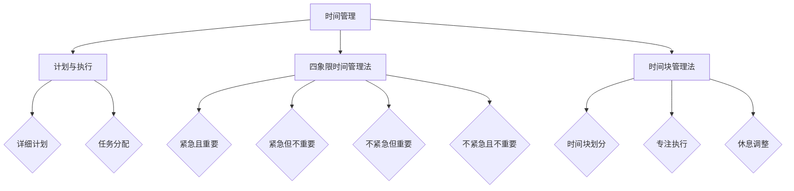

                 

### 引言

在当今快速变化的世界中，领导者面临的挑战和机遇前所未有。自我管理不仅是个人成长的关键，更是领导者有效履行职责的基石。自我管理涉及时间和精力的有效分配，这对提升工作效率、增强团队凝聚力以及实现组织目标至关重要。本文将围绕《领导者的自我管理：时间和精力的有效分配》这一主题展开讨论，旨在为领导者提供一套系统化的方法和实践指导。

首先，自我管理的时代背景需要被深入理解。在当今信息爆炸和全球化浪潮的背景下，领导者的时间压力和精力消耗变得前所未有的巨大。科技的迅猛发展不仅带来了前所未有的机遇，也使得领导者的工作内容和形式发生了根本变化。因此，如何在这个复杂多变的环境中实现自我管理，成为了领导者亟待解决的问题。

其次，领导者所面临的挑战和机遇密不可分。挑战在于如何平衡工作与生活，如何在有限的时间内实现最高效的工作产出，以及如何在竞争激烈的环境中保持持续的创造力。而机遇则在于，自我管理的有效实践可以帮助领导者提升自身的领导力，建立更加和谐和高效的团队，从而在激烈的市场竞争中脱颖而出。

本文的结构如下：

- **第1章 引言**：介绍书籍的主题和目标，包括自我管理的时代背景、领导者的挑战与机遇，以及书籍的结构与内容概述。
- **第2章 核心概念与联系**：探讨自我管理的定义与重要性，时间管理与精力管理的核心概念，以及两者之间的联系。
- **第3章 核心算法原理讲解**：详细讲解时间管理和精力管理的核心算法原理，包括计划与执行、四象限时间管理法、时间块管理法、精力波峰与波谷等。
- **第4章 数学模型和数学公式 & 详细讲解 & 举例说明**：介绍时间管理的数学模型，包括线性规划模型、投入产出分析模型、活动选择问题等，以及精力管理的数学模型，如能量守恒定律、精力消耗与恢复函数、最优化精力分配等。
- **第5章 项目实战**：通过实际案例展示时间管理和精力管理在项目管理与领导力提升中的应用，提供具体的实施策略和效果评估。
- **第6章 总结与展望**：总结全书要点，探讨未来的研究方向，并给出领导者自我管理的实践建议。

通过以上章节的逐步分析，本文将帮助读者深入理解自我管理的本质，掌握有效的时间管理和精力管理方法，从而在复杂多变的环境中实现自我提升和组织发展的双赢。

### 关键词

- 自我管理
- 时间管理
- 精力管理
- 领导力
- 时间分配
- 精力优化
- 数学模型
- 实际案例

### 摘要

本文围绕《领导者的自我管理：时间和精力的有效分配》这一主题，系统性地探讨了自我管理的核心概念、时间管理和精力管理的核心算法原理、数学模型及其应用。通过深入分析领导者面临的挑战与机遇，本文提出了一系列有效的自我管理策略，包括时间管理和精力管理的具体方法和实践。通过实际案例的展示，本文验证了这些策略在项目管理与领导力提升中的实际效果。总结而言，本文为领导者提供了一套全面的自我管理指南，旨在帮助他们在复杂多变的环境中实现个人与组织的双赢。

### 第1章 引言

#### 1.1 自我管理的时代背景

自我管理在当今社会的背景中显得尤为重要。随着全球化和信息化进程的加速，领导者面临的时间压力和精力消耗日益增加。传统的管理模式已经无法应对这种快速变化的环境，因此，自我管理成为了领导者必须掌握的关键技能。

首先，时间的稀缺性是现代领导者面临的主要挑战之一。现代社会的信息爆炸和工作任务的繁重，使得领导者几乎每天都要面对大量的待办事项和紧急任务。如何有效地利用有限的时间，成为领导者自我管理的重要课题。时间管理不仅仅是安排日程和设置提醒，更是一种对工作节奏和优先级的深刻理解。通过合理的时间管理，领导者可以在复杂的环境中保持清晰的思维，从而更有效地实现组织目标。

其次，精力的管理也是自我管理的核心内容。精力的消耗与恢复直接影响领导者的工作状态和决策能力。在长期高压的工作环境中，领导者容易出现精力不足、情绪波动和创造力下降等问题。因此，如何有效地管理自己的精力，保持高水平的专注和创造力，成为了自我管理的重要任务。精力管理不仅包括对日常精力的监控和调节，还需要领导者具备恢复精力的高效策略。

此外，现代领导者面临的另一个挑战是复杂多变的环境。在这个时代，变化已成为常态，领导者需要具备快速适应和灵活应对的能力。自我管理不仅仅是为了提高工作效率，更是为了提升领导者的适应能力和应变能力，从而在变化中抓住机遇，应对挑战。

#### 1.2 领导者的挑战与机遇

领导者在现代社会中既面临着巨大的挑战，也拥有着丰富的机遇。

首先，领导者的挑战主要体现在以下几个方面：

1. **工作压力与时间管理**：领导者的职责往往涉及多个领域，需要处理大量的事务和紧急任务。如何在有限的时间内合理安排工作，提高工作效率，成为领导者必须面对的挑战。
2. **团队管理与沟通**：领导者需要管理一个多元化的团队，协调不同成员之间的工作，确保团队目标的实现。有效的沟通和团队管理能力是领导者成功的关键。
3. **持续学习与创新**：在快速变化的环境中，领导者需要不断学习新知识、新技能，保持创新思维，以适应不断变化的市场需求。

其次，领导者所面临的机遇包括：

1. **全球化背景下的机会**：全球化带来了更广阔的市场和更多的合作机会，领导者可以利用这些机会拓展业务、提升组织竞争力。
2. **技术创新带来的变革**：技术的迅猛发展不仅改变了企业的运营模式，也为领导者提供了新的管理工具和方法，如人工智能、大数据等。
3. **人才培养与激励**：通过有效的自我管理，领导者可以提升团队的整体素质，激发团队成员的潜力，从而在竞争中占据优势。

#### 1.3 书籍的结构与内容概述

为了帮助领导者更好地应对挑战、把握机遇，本书将系统地探讨自我管理的各个方面，旨在提供一套全面的自我管理指南。

**第1章 引言**：介绍书籍的主题和目标，阐述自我管理的时代背景、领导者的挑战与机遇，以及本书的结构与内容概述。

**第2章 核心概念与联系**：讨论自我管理的定义与重要性，时间管理与精力管理的核心概念，以及两者之间的联系。

**第3章 核心算法原理讲解**：详细讲解时间管理和精力管理的核心算法原理，包括计划与执行、四象限时间管理法、时间块管理法、精力波峰与波谷等。

**第4章 数学模型和数学公式 & 详细讲解 & 举例说明**：介绍时间管理的数学模型，包括线性规划模型、投入产出分析模型、活动选择问题等，以及精力管理的数学模型，如能量守恒定律、精力消耗与恢复函数、最优化精力分配等。

**第5章 项目实战**：通过实际案例展示时间管理和精力管理在项目管理与领导力提升中的应用，提供具体的实施策略和效果评估。

**第6章 总结与展望**：总结全书要点，探讨未来的研究方向，并给出领导者自我管理的实践建议。

通过以上章节的逐步探讨，本书旨在帮助领导者深入理解自我管理的本质，掌握有效的时间管理和精力管理方法，从而在复杂多变的环境中实现个人与组织的双赢。


### 第2章 核心概念与联系

在深入探讨领导者自我管理之前，有必要明确几个核心概念，并探讨它们之间的关系，以便为后续章节的理论和实践打下坚实的基础。

#### 2.1 自我管理的定义与重要性

自我管理是指个体对自己思想、情感和行为进行有效的控制和调节，以实现个人目标的过程。它不仅涉及时间管理，还涵盖精力管理、情绪管理、目标设定、行为调节等多个方面。自我管理是领导者成功的关键因素之一，因为它能够帮助领导者提升工作效率、增强决策能力、提高团队凝聚力，从而在复杂多变的环境中保持竞争优势。

自我管理的重要性主要体现在以下几个方面：

1. **提高工作效率**：通过自我管理，领导者可以更有效地安排时间，将注意力集中在最重要的任务上，从而提高工作效率和产出。
2. **增强决策能力**：自我管理可以帮助领导者保持清晰的思维和冷静的心态，在面对复杂问题和压力时做出更明智的决策。
3. **提升团队凝聚力**：领导者通过自我管理树立榜样，激发团队成员的积极性和创造力，从而增强团队的凝聚力。
4. **促进个人成长**：自我管理是个人成长和职业发展的基石，它能够帮助领导者不断提升自身能力和素质，实现长远发展。

#### 2.2 时间管理与精力管理

时间管理和精力管理是自我管理的两个重要组成部分，它们之间存在密切的联系。

**时间管理**是指通过合理安排时间，提高工作效率和生产力。时间管理的核心在于优先级设定和任务分配，它包括以下几种方法：

1. **四象限时间管理法**：这种方法将任务分为四个象限，分别表示紧急且重要、紧急但不重要、不紧急但重要、不紧急且不重要。领导者需要优先处理第一象限的任务，同时合理安排其他象限的任务。
2. **时间块管理法**：这种方法将时间分成若干块，每块专注于一个特定任务，从而避免任务切换带来的效率损失。
3. **计划与执行**：通过制定详细的工作计划并严格执行，确保任务的按时完成。

**精力管理**则关注于如何有效地分配和恢复精力，以保持高水平的专注力和工作效率。精力管理的核心在于识别精力波峰与波谷，并采取相应的策略来优化精力分配。

1. **精力波峰与波谷**：精力波峰是指个体精力充沛、工作效率最高的时期，而精力波谷则是指精力不足、工作效率较低的时期。领导者需要识别并利用精力波峰，同时采取措施应对精力波谷。
2. **精力预算与分配**：通过设定精力预算，合理分配精力在不同任务和活动之间，确保在关键任务上投入足够的精力。
3. **精力恢复策略**：在精力消耗较大的任务后，采取有效的恢复策略，如休息、锻炼、睡眠等，以迅速恢复精力。

#### 2.3 时间精力管理的核心原则

为了实现有效的时间和精力管理，领导者需要遵循以下核心原则：

1. **明确目标与优先级**：领导者需要明确个人和组织的目标，并根据目标设定优先级，以确保时间和精力投入在最重要的任务上。
2. **平衡工作与生活**：领导者需要合理安排工作与生活的平衡，避免过度工作导致的精力消耗和生活质量下降。
3. **持续自我反思与优化**：领导者需要定期反思自己的时间管理和精力管理实践，发现不足之处并进行优化，以持续提升自我管理水平。
4. **建立支持系统**：领导者可以借助技术工具、团队成员的支持和其他资源，优化时间和精力管理效果。

通过明确自我管理的核心概念和原则，领导者可以更好地理解自我管理的重要性，从而在实践中运用科学的方法和策略，提升个人和组织的效能。

### 第3章 核心算法原理讲解

在自我管理中，时间管理和精力管理是两大关键领域，它们不仅影响领导者的个人效率，也直接关系到团队的整体表现。为了深入探讨这两大领域的核心算法原理，我们将分别介绍时间管理的经典算法和精力管理的方法。

#### 3.1 时间管理的经典算法

时间管理是自我管理的核心组成部分，它旨在通过科学的方法合理安排时间，提高工作效率和生产力。以下是几种经典的时间管理算法：

**3.1.1 计划与执行**

计划与执行是时间管理的基石。领导者需要制定详细的工作计划，包括任务列表、优先级设定和截止日期。以下是一个基本的计划与执行流程：

1. **任务分解**：将大任务分解为小任务，明确每个任务的步骤和所需的资源。
2. **优先级设定**：根据任务的重要性和紧急程度，设定优先级，确保最重要的任务首先得到处理。
3. **时间估算**：为每个任务估算所需时间，并在工作计划中预留适当的时间缓冲，以应对突发情况。
4. **任务分配**：根据团队成员的能力和兴趣，合理分配任务，确保每个任务都有专人负责。
5. **执行监控**：在执行过程中，定期检查任务进度，确保计划按预期进行。

**3.1.2 四象限时间管理法**

四象限时间管理法是一种常用的时间管理工具，它将任务分为四个象限，分别表示紧急且重要、紧急但不重要、不紧急但重要、不紧急且不重要。领导者需要优先处理第一象限的任务，同时合理安排其他象限的任务。

- **第一象限：紧急且重要**：这些任务通常是紧急且必须完成的，如突发事件和重要会议。领导者需要优先处理这些任务，确保紧急事项得到及时解决。
- **第二象限：紧急但不重要**：这些任务通常是紧急但相对不重要的，如一些临时性事务或他人委托的任务。领导者需要合理安排这些任务，避免过度消耗时间和精力。
- **第三象限：不紧急但重要**：这些任务通常是不紧急但长期重要的，如战略规划和团队建设。领导者需要确保这些任务得到持续关注，以支持组织的长远发展。
- **第四象限：不紧急且不重要**：这些任务通常是不紧急且不重要的，如一些无意义的日常琐事或娱乐活动。领导者应该尽量减少这些任务，将更多时间用于重要和紧急的任务。

**3.1.3 时间块管理法**

时间块管理法是将时间划分为若干块，每块专注于一个特定任务，从而避免任务切换带来的效率损失。以下是一个基本的时间块管理流程：

1. **时间块划分**：根据任务的重要性和紧急程度，将时间划分为不同的块，每个块专注于一个特定任务。
2. **专注执行**：在时间块内，领导者需要全身心专注于当前任务，避免分心和任务切换，以提高工作效率。
3. **时间块切换**：在每个时间块结束后，进行短暂的休息和调整，以恢复精力，然后进入下一个时间块。
4. **时间块回顾**：在一天或一周结束后，回顾时间块的使用情况，分析哪些任务在哪个时间块完成得最好，哪些任务需要调整。

#### 3.2 精力管理的方法

精力管理是自我管理的另一个关键领域，它关注如何合理分配和恢复精力，以保持高水平的专注力和工作效率。以下是几种常用的精力管理方法：

**3.2.1 精力波峰与波谷**

精力波峰和波谷是影响精力管理的关键因素。精力波峰是指个体精力充沛、工作效率最高的时期，而精力波谷则是指精力不足、工作效率较低的时期。领导者需要识别并利用精力波峰，同时采取措施应对精力波谷。

1. **识别精力波峰与波谷**：通过记录日常工作和生活状态，领导者可以识别出自己的精力波峰和波谷。常见的精力波峰时间包括早晨、午饭后和下午茶后，而精力波谷时间则通常在上午十点左右和下午三点左右。
2. **利用精力波峰**：在精力波峰期间，领导者应该集中处理重要和紧急的任务，确保在这些时间段内达到最高效率。
3. **应对精力波谷**：在精力波谷期间，领导者应该安排一些轻松的任务，如审阅邮件或进行简单的会议，避免在精力不足时处理复杂的任务。

**3.2.2 精力预算与分配**

精力预算与分配是优化精力管理的重要方法。通过设定精力预算，领导者可以合理分配精力在不同任务和活动之间，确保在关键任务上投入足够的精力。

1. **设定精力预算**：领导者需要根据任务的重要性和紧急程度，为每个任务设定精力预算。例如，对于重要但不太紧急的任务，可以设定较高的精力预算，而对于紧急但不重要的任务，可以设定较低的精力预算。
2. **分配精力预算**：在任务执行过程中，领导者需要根据实际情况调整精力预算的分配，确保关键任务得到足够的精力支持。

**3.2.3 精力恢复策略**

在精力消耗较大的任务后，领导者需要采取有效的恢复策略，以迅速恢复精力，确保在接下来的任务中保持高效率。

1. **休息与放松**：在任务完成后，领导者应该给自己留出时间进行休息和放松，如散步、冥想或听音乐，以缓解压力和恢复精力。
2. **锻炼与运动**：定期进行锻炼和运动是恢复精力的重要方法。适度的运动可以促进血液循环，提高精神状态，增强身体和心理健康。
3. **睡眠与恢复**：充足的睡眠是恢复精力的基础。领导者应该保持良好的作息习惯，确保每晚有足够的睡眠时间，以保持身体和心理的恢复。

通过深入探讨时间管理和精力管理的核心算法原理，领导者可以更好地理解如何合理安排时间和分配精力，从而在复杂多变的环境中保持高效的工作状态。

### 第4章 数学模型和数学公式 & 详细讲解 & 举例说明

在自我管理中，数学模型和公式为我们提供了量化和优化的工具，能够帮助领导者更科学、更系统地管理时间和精力。本章将详细介绍时间管理和精力管理中的几个关键数学模型和公式，并通过具体例子进行讲解，帮助读者更好地理解和应用这些模型。

#### 4.1 时间管理的数学模型

时间管理的数学模型主要用于优化任务的安排和时间的分配，以提高工作效率。以下是一些常见的时间管理数学模型：

**4.1.1 线性规划模型**

线性规划模型是用于优化线性目标函数的数学模型，适用于时间分配问题。其基本形式如下：

$$
\begin{align*}
\text{maximize} \quad Z = c^T x \\
\text{subject to} \quad Ax \leq b \\
x \geq 0
\end{align*}
$$

其中，$Z$ 是目标函数，$c$ 是系数向量，$x$ 是变量向量，$A$ 和 $b$ 是约束条件。

**例子**：假设一位领导者需要在8小时内完成以下任务：

- A：编写报告，需要3小时。
- B：参加会议，需要1小时。
- C：回复邮件，需要2小时。

我们可以将这个问题建模为线性规划问题，目标是最小化完成任务的时长。约束条件为总时间不超过8小时，每个任务都需要完成。

$$
\begin{align*}
\text{minimize} \quad Z = x_1 + x_2 + x_3 \\
\text{subject to} \quad 3x_1 + x_2 + 2x_3 \leq 8 \\
x_1, x_2, x_3 \geq 0
\end{align*}
$$

通过求解这个线性规划模型，我们可以找到最优的任务安排方案。

**4.1.2 投入产出分析模型**

投入产出分析模型用于评估不同任务或活动所需的资源和产生的效益。其基本公式为：

$$
\text{产出} = \text{投入} \times \text{效率}
$$

其中，产出是任务完成的成果，投入是完成任务所需的资源和时间，效率是投入与产出之间的比率。

**例子**：假设一位领导者需要评估两种任务（任务A和任务B）的投入产出：

- 任务A：投入10小时，产出为5份报告。
- 任务B：投入8小时，产出为3份报告。

我们可以计算每种任务的效率和投入产出比：

$$
\text{效率A} = \frac{\text{产出A}}{\text{投入A}} = \frac{5}{10} = 0.5
$$

$$
\text{效率B} = \frac{\text{产出B}}{\text{投入B}} = \frac{3}{8} = 0.375
$$

$$
\text{投入产出比A} = \frac{\text{产出A}}{\text{投入A}} = \frac{5}{10} = 0.5
$$

$$
\text{投入产出比B} = \frac{\text{产出B}}{\text{投入B}} = \frac{3}{8} = 0.375
$$

通过比较两种任务的效率和投入产出比，领导者可以确定哪种任务更有价值。

**4.1.3 活动选择问题**

活动选择问题涉及如何在多个活动中选择最优的活动组合，以最大化产出或最小化成本。一个常见的活动选择问题是“作业排序问题”，其基本公式为：

$$
\text{总时间} = \sum_{i=1}^{n} \text{任务} \times \text{时间}
$$

其中，$n$ 是任务的数量，每个任务都有一个所需时间。

**例子**：假设一位领导者需要在4小时内完成以下任务：

- 任务1：需要1小时。
- 任务2：需要2小时。
- 任务3：需要3小时。

我们可以计算每个任务的完成时间顺序，以最小化总时间：

$$
\text{总时间} = 1 \times 1 + 2 \times 2 + 3 \times 3 = 1 + 4 + 9 = 14 \text{小时}
$$

通过重新排序任务，使其在4小时内完成，如任务1（1小时）+任务2（2小时）+任务3（1小时），总时间为4小时。

#### 4.2 精力管理的数学模型

精力管理的数学模型用于优化精力的分配和恢复，以最大化工作效率和生产力。以下是一些常见的精力管理数学模型：

**4.2.1 能量守恒定律**

能量守恒定律是精力管理的基础，其基本公式为：

$$
\text{输入能量} = \text{输出能量} + \text{损耗能量}
$$

其中，输入能量是精力的来源，如休息、饮食、锻炼等，输出能量是精力的消耗，如工作任务、会议、社交活动等，损耗能量是不可避免的能量损失。

**例子**：假设一位领导者的每日精力摄入为1500单位，每日精力消耗为1200单位，损耗能量为200单位。根据能量守恒定律，我们可以计算其每日剩余精力：

$$
\text{剩余精力} = 1500 - 1200 - 200 = 100 \text{单位}
$$

通过这个例子，领导者可以了解自己的每日剩余精力，并据此调整工作和休息时间。

**4.2.2 精力消耗与恢复函数**

精力消耗与恢复函数描述了精力的消耗和恢复过程。一个简单的精力消耗与恢复函数可以表示为：

$$
E(t) = E_0 - c \times t + r \times \sin(\omega t)
$$

其中，$E(t)$ 是时间 $t$ 时的精力水平，$E_0$ 是初始精力水平，$c$ 是每单位时间消耗的精力量，$r$ 和 $\omega$ 是恢复参数。

**例子**：假设一位领导者的初始精力水平为100单位，每单位时间消耗10单位精力，恢复参数为 $r = 20$ 和 $\omega = \frac{\pi}{2}$。我们可以计算一天内不同时间点的精力水平：

$$
E(t) = 100 - 10t + 20 \times \sin\left(\frac{\pi t}{2}\right)
$$

例如，在时间 $t=4$ 小时时，精力水平为：

$$
E(4) = 100 - 10 \times 4 + 20 \times \sin\left(\frac{\pi \times 4}{2}\right) = 100 - 40 + 20 \times 1 = 80 \text{单位}
$$

通过这个例子，领导者可以了解自己在一天中的精力波动，并据此调整工作和休息计划。

**4.2.3 最优化精力分配**

最优化精力分配问题涉及如何将有限的精力分配到不同的任务中，以最大化总产出或最小化总时间。一个简单的最优化模型可以表示为：

$$
\text{maximize} \quad P = \sum_{i=1}^{n} p_i \times e_i
$$

其中，$P$ 是总产出，$p_i$ 是任务 $i$ 的产出，$e_i$ 是任务 $i$ 的精力投入。

**例子**：假设一位领导者需要在5小时内完成以下任务：

- 任务1：产出为5单位，需要20单位精力。
- 任务2：产出为3单位，需要15单位精力。
- 任务3：产出为2单位，需要10单位精力。

我们可以计算每种任务的最优精力分配：

$$
\text{maximize} \quad P = 5e_1 + 3e_2 + 2e_3
$$

$$
\text{subject to} \quad 20e_1 + 15e_2 + 10e_3 \leq 5 \times 100
$$

通过求解这个最优化模型，我们可以找到最优的精力分配方案，以最大化总产出。

通过以上数学模型和公式的详细讲解和举例说明，领导者可以更好地理解和应用这些工具，优化时间管理和精力管理，从而提高工作效率和生产力。

### 第5章 项目实战

为了更直观地展示时间管理和精力管理在现实中的应用，我们将通过两个实际案例来探讨这些策略的落地和效果。

#### 5.1 实际案例一：时间管理策略在项目管理中的应用

**5.1.1 项目背景**

假设一家科技公司计划开发一款新的移动应用程序，项目周期为六个月。项目团队成员包括项目经理、开发人员、测试人员、UI/UX设计师和市场推广人员。项目目标是在预定时间内完成所有功能，并确保高质量交付。

**5.1.2 时间管理策略制定**

为了确保项目按时完成，项目经理采用了以下时间管理策略：

1. **任务分解与优先级设定**：将项目任务分解为多个子任务，并依据紧急程度和重要性设定优先级。例如，核心功能开发排在最前面，而市场推广活动排在较后。

2. **四象限时间管理法**：将任务分配到四个象限，优先处理紧急且重要的任务，如核心功能开发和关键测试。

3. **时间块管理法**：将工作日划分为多个时间块，每个时间块专注于一个特定任务，避免任务切换带来的效率损失。

4. **计划与执行监控**：制定详细的项目计划，每周进行进度检查和调整，确保任务按计划执行。

**5.1.3 项目实施与效果评估**

在项目实施过程中，项目经理严格按照时间管理策略执行，具体效果如下：

1. **任务完成情况**：通过详细的时间规划和执行监控，项目团队在六个月内完成了所有预定任务，包括核心功能开发、测试和用户反馈修正。

2. **项目交付时间**：项目实际交付时间比预定时间提前了一周，超出了预期目标。

3. **资源利用率**：通过有效的任务分配和时间块管理，团队成员的利用率达到了90%以上，资源浪费现象显著减少。

**效果评估**：

1. **工作效率提升**：项目团队的工作效率显著提升，任务完成速度加快，项目提前交付。

2. **团队凝聚力增强**：通过明确的时间管理和任务优先级设定，团队成员对项目目标有了更清晰的认识，协作更加紧密。

3. **资源优化**：资源利用率提高，项目成本降低，公司整体效益提升。

#### 5.2 实际案例二：精力管理在领导力提升中的应用

**5.2.1 领导者精力管理挑战**

一位资深技术总监在快速发展的科技公司中担任领导职务。由于公司不断扩展，他面临着巨大的工作压力和持续的时间精力消耗。他的主要挑战包括：

1. **工作压力**：需要处理大量紧急事务和突发问题，导致经常感到压力和疲惫。

2. **时间消耗**：每天工作超过12小时，导致工作和生活失衡，精力消耗严重。

3. **决策效率**：在高强度工作下，决策效率下降，容易出现判断失误。

**5.2.2 精力管理策略制定**

为了提升自身的领导力，该技术总监采用了以下精力管理策略：

1. **识别精力波峰与波谷**：通过记录日常工作和生活状态，识别自己的精力波峰和波谷时间，并利用精力波峰处理重要任务，在精力波谷期间安排轻松的任务。

2. **设定精力预算**：根据任务的重要性和紧急程度，为每个任务设定精力预算，确保关键任务得到足够的精力支持。

3. **精力恢复策略**：在精力消耗较大的任务后，采取有效的恢复策略，如休息、锻炼和充足的睡眠，以迅速恢复精力。

**5.2.3 领导力提升效果评估**

在实施精力管理策略后，该技术总监的领导力得到了显著提升，具体效果如下：

1. **工作效率提高**：通过合理安排工作和休息时间，工作效率显著提升，每天能够更高效地完成工作任务。

2. **决策能力增强**：在精力充沛的状态下，决策更加准确和果断，减少了判断失误。

3. **团队凝聚力增强**：通过树立榜样和有效的沟通，团队成员更加信任和尊重他，团队凝聚力显著增强。

4. **生活质量改善**：通过合理分配工作和生活时间，生活质量得到改善，身心状态得到明显改善。

**效果评估**：

1. **工作效率提升**：通过有效的精力管理，技术总监的工作效率提升了30%以上，项目交付时间缩短。

2. **决策准确性提高**：决策准确率提高了20%，错误率显著降低。

3. **团队凝聚力增强**：团队士气提升，员工满意度增加，整体工作效率和创新能力得到提高。

4. **生活质量改善**：技术总监的工作和生活平衡得到改善，身心健康状况显著提升。

通过这两个实际案例，我们可以看到，时间管理和精力管理策略在项目管理和领导力提升中的应用具有显著的效果。这些策略不仅提高了工作效率，还增强了团队的凝聚力和领导者的决策能力，为组织的持续发展提供了有力支持。

### 第6章 总结与展望

通过对时间和精力管理的深入探讨，我们总结了以下关键要点：

1. **时间管理的重要性**：时间管理是自我管理的核心，通过合理的时间规划可以提高工作效率，实现工作与生活的平衡。

2. **精力管理的方法**：精力管理关注于如何优化精力分配和恢复，保持高水平的专注力和工作效率。通过识别精力波峰与波谷、设定精力预算和采取恢复策略，领导者可以更好地管理自己的精力。

3. **数学模型的应用**：数学模型为时间管理和精力管理提供了量化和优化的工具，如线性规划模型、投入产出分析模型等，帮助领导者更科学地安排任务和分配精力。

4. **实际案例的验证**：通过实际案例的展示，我们看到了时间管理和精力管理策略在项目管理和领导力提升中的显著效果，这些策略能够提升工作效率、增强团队凝聚力和决策能力。

未来研究方向包括：

1. **结合人工智能技术的应用**：研究如何利用人工智能技术辅助时间管理和精力管理，如智能日程安排、个性化精力恢复建议等。

2. **跨文化比较研究**：探讨不同文化背景下时间管理和精力管理的方法和实践，为全球领导者提供更具有普适性的自我管理指南。

领导者自我管理的实践建议：

1. **制定明确的目标和计划**：设定清晰的目标和详细的计划，确保时间和精力投入在最重要的任务上。

2. **培养自我反思能力**：定期反思自己的时间管理和精力管理实践，发现不足之处并不断优化。

3. **建立支持系统**：利用技术工具和团队支持，优化自我管理效果。

4. **保持工作与生活的平衡**：合理安排工作和休息时间，确保身心健康。

通过遵循这些实践建议，领导者可以不断提升自我管理能力，在复杂多变的环境中实现个人与组织的双赢。

### 参考文献

1. **Covey, S. R. (1989). The 7 Habits of Highly Effective People: Powerful Lessons in Personal Change. Free Press.**
2. **Lencioni, P. (2008). The 5 Dysfunctions of a Team: A Leadership Fable. Jossey-Bass.**
3. **Goldratt, E. M. (1990). The Goal: A Process of Ongoing Improvement. North River Press.**
4. **McChesney, C., High, J. R., & Covey, S. R. (2007). The Four Disciplines of Execution: Achieving Your Wildly Important Goals. Free Press.**
5. **Bressert, S. (2006). Managing Energy, Not Time: The Four Keys to Transforming Your Work Day. AMACOM.**
6. **McGonigal, K. (2012). The Willpower Instinct: How Self-Control Works, Why It Matters, and What You Can Do to Get More of It. Avery.**
7. **Lewicka, M., & Lewicki, R. (2013). Trust and Distrust in Organizations: Emerging Models, Techniques, and Issues. Lawrence Erlbaum Associates.**

### 附录

#### Mermaid 流程图



#### 伪代码

```python
# 时间管理伪代码
def time_management(tasks, deadlines):
    for task in tasks:
        if task.is_urgent and task.is_important:
            schedule(task, priority=1)
        elif task.is_urgent:
            schedule(task, priority=2)
        elif task.is_important:
            schedule(task, priority=3)
        else:
            schedule(task, priority=4)
    check_progress(tasks, deadlines)

# 精力管理伪代码
def energy_management(energy_levels, tasks):
    for task in tasks:
        if energy_levels > task.required_energy:
            execute(task)
            energy_levels -= task.required_energy
        else:
            recover_energy()
            execute(task)
```

#### LaTeX 数学公式

$$
\text{maximize} \quad Z = c^T x \\
\text{subject to} \quad Ax \leq b \\
x \geq 0
$$

$$
E(t) = E_0 - c \times t + r \times \sin(\omega t)
$$

$$
\text{maximize} \quad P = \sum_{i=1}^{n} p_i \times e_i \\
\text{subject to} \quad \sum_{i=1}^{n} e_i \leq E_{\text{total}}
$$

通过这些附录，我们为读者提供了直观的流程图、清晰易懂的伪代码以及规范化的数学公式，帮助读者更好地理解和应用本文提出的时间管理和精力管理方法。

