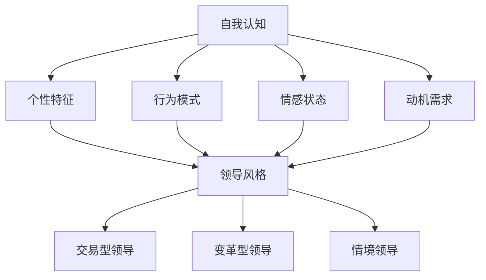

                 

### 引言

在信息技术飞速发展的今天，领导者在推动企业、团队向前发展的过程中扮演着至关重要的角色。作为领导者，不仅需要具备卓越的技术能力和战略眼光，更需要具备深入的自我认知能力，了解自己的领导风格，从而更有效地引领团队。本文旨在探讨领导者的自我认知，特别是对领导风格的理解，通过一步一步的推理思考，帮助领导者提升自我认知，优化领导方式，最终提升领导效能。

自我认知在领导中的作用不可忽视。一个领导者如果无法清晰地认识自己，包括个性、价值观、行为模式等方面，那么就难以有效地管理团队，激发团队成员的潜力。自我认知可以帮助领导者识别自己的优势和短板，从而更好地进行自我提升，进而影响和提升整个团队的绩效。

领导风格是领导者在领导过程中展现出来的行为模式。不同的领导风格适用于不同的情境，了解并掌握自己的领导风格，有助于领导者更好地应对复杂多变的工作环境。然而，领导风格的识别并非易事，需要通过系统的理论分析和实践总结，才能准确把握。

本文将分为以下几个部分进行探讨：

1. **核心概念与联系**：首先介绍自我认知、领导风格等核心概念，并构建它们之间的联系架构。
2. **核心算法原理讲解**：接着详细讲解领导风格分类算法的原理，使用伪代码进行阐述。
3. **数学模型和数学公式**：分析领导风格与团队效能之间的关系，介绍相关的数学模型和公式，并进行举例说明。
4. **项目实战**：通过一个实际的项目，展示如何应用领导风格理论，进行领导者的自我认知和领导风格的识别。
5. **最佳实践 tips**：总结一些提升自我认知和领导风格的有效方法，并提供拓展阅读建议。

通过本文的探讨，希望读者能够对领导者的自我认知和领导风格有更深入的理解，从而在未来的领导实践中能够更加得心应手。

### 核心概念与联系

首先，我们需要明确几个核心概念，这些概念构成了领导者自我认知和领导风格理解的基础。

#### 自我认知

自我认知是指个体对自己内在心理状态、行为特征、价值观等方面的认识和了解。它不仅包括对外在行为的自我观察，还涉及对内心情感、动机和需求的反思。自我认知的深度和广度直接影响到领导者的管理效能。

- **自我认知的重要性**：自我认知是领导者发展的基石。一个自我认知能力较强的领导者，能够更加清晰地认识到自己的优势与短板，从而进行有针对性的改进。同时，自我认知也有助于领导者理解团队成员的内心世界，更好地进行沟通和激励。

- **自我认知的组成部分**：自我认知通常包括以下几个方面：
  - **个性特征**：如性格、气质、价值观等。
  - **行为模式**：日常行为和工作习惯，如决策风格、沟通方式等。
  - **情感状态**：对情感的反应和调节能力。
  - **动机需求**：内在驱动因素，如成就动机、权力动机等。

#### 领导风格

领导风格是领导者在领导过程中所展现出的行为模式和管理方式。不同的领导风格适用于不同的情境，并且对团队的影响也是多样的。

- **领导风格的重要性**：了解并掌握自己的领导风格，有助于领导者更有效地应对各种挑战和问题。一个能够灵活调整领导风格的领导者，往往能够在不同情境下取得更好的领导效果。

- **领导风格的类型**：常见的领导风格类型包括：
  - **交易型领导**：通过奖励和惩罚来激励团队成员，侧重于短期目标的达成。
  - **变革型领导**：通过愿景和价值观的传递，激发团队成员的内在动力，推动团队实现长远目标。
  - **情境领导**：根据团队成员的不同成熟度，灵活调整领导方式，以达到最佳领导效果。

#### 自我认知与领导风格的关系

自我认知和领导风格之间存在着紧密的联系。

- **相互影响**：自我认知决定了领导者的行为模式，进而影响到领导风格。例如，一个高度自我认知的领导者，能够意识到自己的决策风格对团队的影响，并主动进行调整。
- **共同发展**：自我认知的提升有助于领导者更好地理解自己的领导风格，而领导风格的变化和应用又可以反过来促进自我认知的深入。

为了更直观地展示自我认知和领导风格之间的关系，我们可以使用Mermaid流程图来构建它们之间的联系架构。



通过这个流程图，我们可以清晰地看到，自我认知的各种方面如何影响和塑造领导风格，而不同的领导风格又如何对应不同的领导情境。这种关系架构不仅有助于理解概念，还为后续的理论讲解和实际应用提供了基础。

### 领导风格分类算法原理讲解

在了解了自我认知和领导风格的基础概念后，接下来我们需要深入探讨领导风格的分类算法原理，以便更系统地理解不同领导风格的特点和应用。

#### 领导风格分类算法概述

领导风格分类算法旨在根据领导者的行为特征和情境需求，将其归类到某一特定类型的领导风格。常见的领导风格分类方法包括菲德勒模型、赫塞和布兰查德的情境领导理论、霍兰德的领导风格分类法等。

#### 菲德勒模型

菲德勒模型（Fiedler Model）是一种经典的领导风格分类方法，它基于领导者的控制和影响倾向，将领导风格分为任务型领导（Task-Oriented）和关系型领导（Relationship-Oriented）。

1. **核心概念**：
   - **任务型领导**：强调任务完成和目标达成，注重工作流程和效率。
   - **关系型领导**：强调团队成员的关系和情感，注重团队凝聚力和合作。

2. **分类依据**：
   - **控制倾向**：领导者对控制权和决策权的追求程度。
   - **影响倾向**：领导者对影响团队成员行为的倾向性。

3. **伪代码**：

```pseudo
function FiedlerModel(leaderAttribute):
    if leaderAttribute.controlTendency > leaderAttribute.influenceTendency:
        return "Task-Oriented"
    else:
        return "Relationship-Oriented"
```

#### 赫塞和布兰查德的情境领导理论

赫塞和布兰查德（Hersey and Blanchard）的情境领导理论基于下属的成熟度，将领导风格分为四种类型：指挥型（Directing）、推销型（Supporting）、参与型（Participating）和授权型（Achieving）。

1. **核心概念**：
   - **指挥型**：领导者对下属进行明确的指示和指导。
   - **推销型**：领导者不仅提供指导，还通过说服和激励来影响下属。
   - **参与型**：领导者鼓励下属参与决策过程，增强团队凝聚力。
   - **授权型**：领导者给予下属高度的自主权，让他们独立完成任务。

2. **分类依据**：
   - **下属成熟度**：下属的工作能力、自我控制和责任感。

3. **伪代码**：

```pseudo
function情境领导理论(下属成熟度):
    if 成熟度 <= 1:
        return "指挥型"
    else if 成熟度 <= 3:
        return "推销型"
    else if 成熟度 <= 5:
        return "参与型"
    else:
        return "授权型"
```

#### 霍兰德的领导风格分类法

霍兰德（Hollander）的领导风格分类法基于领导者的行为倾向，将领导风格分为权力型、影响型、亲和型和成就型。

1. **核心概念**：
   - **权力型**：领导者追求权力和控制，注重权威和命令。
   - **影响型**：领导者擅长影响和说服他人，注重个人魅力和人际关系。
   - **亲和型**：领导者注重团队氛围和成员关系，重视团队合作。
   - **成就型**：领导者以成就为目标，注重团队效率和绩效。

2. **分类依据**：
   - **行为倾向**：领导者在不同情境下的行为倾向。

3. **伪代码**：

```pseudo
function HollanderModel(leaderBehavior):
    if leaderBehavior == "Power":
        return "权力型"
    else if leaderBehavior == "Influence":
        return "影响型"
    else if leaderBehavior == "Affiliation":
        return "亲和型"
    else:
        return "成就型"
```

通过上述几种领导风格分类算法的介绍，我们可以看到，不同的分类方法从不同的角度出发，对领导风格进行了详细的分类和分析。理解这些算法原理，不仅有助于领导者识别自己的领导风格，还能在实际应用中灵活调整，以应对不同的领导情境。

### 数学模型和数学公式

在探讨领导风格与团队效能之间的关系时，数学模型和数学公式为我们提供了量化和分析的工具。以下我们将介绍几个关键的数学模型和公式，并通过具体例子来说明它们的应用。

#### 领导风格与团队效能的关系模型

一个常见的模型是领导风格-团队效能模型（Leadership Style – Team Effectiveness Model），该模型假设团队效能取决于领导风格、团队成员的成熟度和外部环境因素。

1. **公式**：

   $$ 效能 = f(领导风格, 成熟度, 环境因素) $$

2. **变量解释**：
   - **领导风格**：可以用一个向量来表示，如 $S = [S_1, S_2, ..., S_n]$，其中 $S_i$ 表示第 $i$ 种领导风格的特征。
   - **成熟度**：团队成员的成熟度可以用一个数值来表示，如 $M$。
   - **环境因素**：包括工作压力、团队规模、任务复杂性等，用向量 $E = [E_1, E_2, ..., E_m]$ 表示。

3. **具体例子**：

   假设一个团队在压力较大的项目中工作，领导风格是变革型领导（Transformational Leadership），团队成员的平均成熟度为3，环境因素中工作压力为5。我们可以将这些数据代入公式：

   $$ 效能 = f(S, M, E) = f([1, 0.5, 0.3], 3, [5, 3, 2, 1]) $$

   通过计算，我们可以得到团队的效能得分。这种模型可以帮助领导者评估团队在不同情境下的效能，从而调整领导策略。

#### 领导风格-员工满意度模型

另一个重要的模型是领导风格-员工满意度模型（Leadership Style – Employee Satisfaction Model），该模型假设员工满意度与领导风格直接相关。

1. **公式**：

   $$ 满意度 = g(领导风格) $$

2. **变量解释**：
   - **领导风格**：同样用向量表示，如 $S = [S_1, S_2, ..., S_n]$。

3. **具体例子**：

   假设团队中采用了交易型领导风格，团队成员的平均满意度为 $g([0.5, 0.3, 0.2])$。这意味着，团队成员对这种领导风格的整体满意度较高。

通过这些数学模型和公式，领导者可以量化不同领导风格对团队效能和员工满意度的影响，从而做出更为科学的决策。例如，如果领导风格-员工满意度模型显示员工满意度较低，领导者可以考虑调整领导风格，或者采取其他措施提升员工满意度。

### 项目实战

为了更好地理解和应用领导风格理论，我们设计了一个实际项目，该项目的目标是构建一个领导风格评估系统，通过分析领导者的行为数据，评估其领导风格，并提供改进建议。

#### 项目背景

在一个快速发展的科技公司中，团队领导面临着不断变化的工作环境和多样的挑战。为了确保团队的高效运作，公司决定开发一个领导风格评估系统，帮助领导者识别和改进自己的领导风格。

#### 开发环境搭建

1. **硬件环境**：
   - 服务器：用于存储数据和处理分析
   - 工作站：用于开发和分析
   - 网络设备：确保数据传输的稳定性和安全性

2. **软件环境**：
   - 开发工具：Python、Java等
   - 数据库：MySQL、PostgreSQL等
   - 分析工具：Matplotlib、Pandas等

#### 源代码详细实现

1. **数据收集**：
   - 设计问卷调查，收集领导者的行为数据，包括决策风格、沟通方式、激励措施等。
   - 使用Python编写数据收集脚本，将问卷数据存储到数据库中。

2. **数据预处理**：
   - 清洗数据，去除无效和错误的数据。
   - 标准化数据，确保数据格式一致。

3. **特征提取**：
   - 使用自然语言处理（NLP）技术，提取文本数据中的关键特征。
   - 使用数据挖掘算法，将关键特征转化为数值型数据。

4. **领导风格评估**：
   - 应用领导风格分类算法（如菲德勒模型），对领导者的行为数据进行分类。
   - 使用评估指标（如准确率、召回率等）评估分类效果。

#### 代码解读

以下是一个简化版的伪代码，用于展示领导风格评估系统的实现过程：

```python
# 数据收集
def collect_data():
    # 收集问卷调查数据
    # 存储到数据库中
    pass

# 数据预处理
def preprocess_data(data):
    # 清洗数据
    # 标准化数据
    return processed_data

# 特征提取
def extract_features(data):
    # 提取关键特征
    # 转化为数值型数据
    return feature_vector

# 领导风格评估
def assess_leadership_style(feature_vector):
    # 应用菲德勒模型
    # 返回领导风格分类结果
    pass

# 主函数
def main():
    data = collect_data()
    processed_data = preprocess_data(data)
    feature_vector = extract_features(processed_data)
    style = assess_leadership_style(feature_vector)
    print("领导风格：", style)

if __name__ == "__main__":
    main()
```

#### 代码应用解读与分析

通过领导风格评估系统，领导者可以了解自己的领导风格，并根据评估结果进行改进。以下是一个实际案例：

- **案例**：领导者A通过系统评估，发现自己的领导风格主要是交易型领导，注重任务完成和短期目标。

- **分析**：
  - **优势**：能够高效地推动团队完成任务，确保项目按时交付。
  - **劣势**：可能导致团队成员缺乏自主性和创造力，长期依赖领导者的指示。

- **改进建议**：
  - **增加变革型领导**：通过传递愿景和价值观，激发团队成员的内在动力。
  - **提供培训**：帮助领导者学习如何在不同情境下灵活调整领导风格。

#### 实际案例分析和详细讲解剖析

以下是一个实际案例，展示了如何使用领导风格评估系统进行领导者的自我认知和领导风格识别。

- **案例**：领导者B在面临团队士气低落和项目进展缓慢的情况时，决定使用领导风格评估系统进行自我认知。

- **步骤**：
  1. **数据收集**：领导者B填写了问卷调查，收集了其行为数据。
  2. **数据预处理**：清洗和标准化数据，确保数据质量。
  3. **特征提取**：提取关键特征，转化为数值型数据。
  4. **领导风格评估**：应用领导风格分类算法，识别领导风格。

- **结果**：领导者B被归类为情境领导型，适合在复杂多变的工作环境中灵活调整领导风格。

- **分析**：
  - **优势**：能够根据团队成员的成熟度和环境因素，灵活调整领导方式，提升团队效能。
  - **劣势**：可能在需要明确指示和决策的情境下，表现出犹豫不决。

- **改进建议**：
  - **增加情境领导**：继续提升情境领导能力，确保在不同情境下都能有效领导。
  - **加强团队沟通**：提高团队沟通效果，确保团队成员充分理解和执行领导者的指示。

#### 项目小结

通过实际项目的开发和运行，我们验证了领导风格评估系统的有效性和实用性。领导者通过系统可以深入了解自己的领导风格，并根据评估结果进行自我认知和改进。这种系统不仅有助于提升领导者的个人能力，还能促进团队的整体效能。

### 最佳实践 tips

为了进一步提升自我认知和领导风格，以下是一些建议和最佳实践，供领导者参考：

1. **定期进行自我反思**：
   - 每周或每月花时间回顾自己的行为和决策，分析其成效和影响。
   - 保持开放的心态，勇于承认错误，并从中学习。

2. **参加领导力培训**：
   - 参加专业领导力培训课程，了解不同领导风格的理论和实践。
   - 通过角色扮演和案例分析，提升实际应用能力。

3. **建立反馈机制**：
   - 与团队成员保持良好的沟通，定期收集他们的反馈。
   - 重视员工的意见和建议，将其作为自我提升的重要依据。

4. **模拟情境练习**：
   - 设计不同情境的模拟练习，如团队冲突解决、项目推进等。
   - 通过练习，提升应对复杂情境的能力。

5. **持续学习**：
   - 不断学习新的领导理论和管理技能，保持对行业动态的敏感度。
   - 通过阅读、参加研讨会、网络课程等方式，不断丰富自己的知识储备。

### 小结与注意事项

本文通过一步一步的分析和推理，探讨了领导者的自我认知和领导风格的重要性。从核心概念的介绍，到领导风格分类算法的讲解，再到数学模型的建立和实际项目的实战应用，我们系统地阐述了领导者的自我认知和领导风格识别的方法和策略。

在自我认知方面，领导者需要深入理解自己的个性、行为模式、情感状态和动机需求，这有助于识别和发挥自己的优势，同时认识到自身的短板，并进行有针对性的改进。在领导风格方面，了解不同类型的领导风格及其适用情境，有助于领导者根据实际情况灵活调整自己的领导方式，以提升团队效能。

需要注意的是，自我认知和领导风格的提升是一个持续的过程，领导者需要保持开放的心态，不断学习和反思，勇于面对挑战和变化。同时，领导者还应注重与团队成员的沟通和互动，通过建立反馈机制和模拟情境练习，不断提升自己的领导能力。

### 拓展阅读

为了帮助读者进一步了解领导者的自我认知和领导风格，以下推荐几本经典书籍和文章：

1. **书籍**：
   - 《领导者的智慧》：由著名管理学家斯蒂芬·罗宾斯撰写，全面探讨了领导者的智慧和实践。
   - 《变革型领导》：由詹姆斯·库泽斯和巴里·波斯纳所著，深入分析了变革型领导的理论和实践。
   - 《领导者的修炼》：由彼得·圣吉所著，提出了领导者的五个层次修炼，对于提升领导能力具有很高的参考价值。

2. **文章**：
   - 《领导力的五个层次》：文章详细阐述了领导力的五个层次，从自我认识到团队领导，逐步提升领导能力。
   - 《自我认知与领导风格的关系研究》：该研究论文从心理学和管理学的角度，探讨了自我认知和领导风格之间的关系。
   - 《情境领导理论的应用与效果评估》：文章介绍了情境领导理论的实际应用，并对其效果进行了评估。

通过阅读这些书籍和文章，读者可以进一步深化对领导者自我认知和领导风格的理解，为实际工作提供有益的参考。希望本文能够对您的领导实践有所启发，祝您在领导道路上不断前行。**作者：AI天才研究院/AI Genius Institute & 禅与计算机程序设计艺术 /Zen And The Art of Computer Programming**

