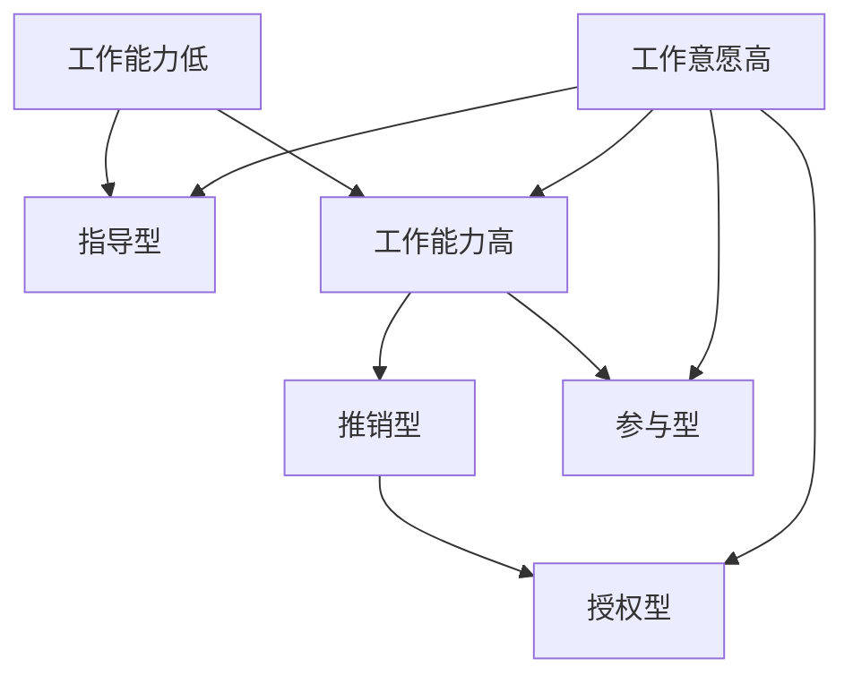
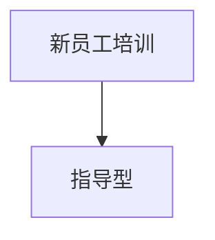
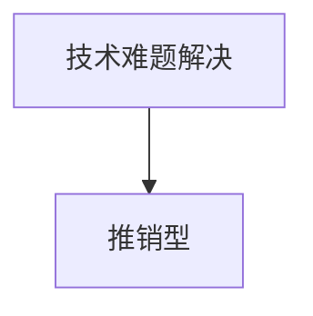
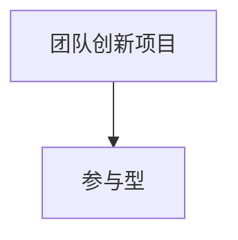

                 

### 文章标题

《领导者的角色定位：在不同情境中切换领导风格》

### 关键词

领导角色、领导风格、情境领导理论、领导力发展、实战案例分析

### 摘要

本文深入探讨了领导者在不同情境中如何有效定位自身角色，并灵活切换领导风格。首先，我们回顾了领导角色的基本概念和分类，然后详细分析了权威型、民主型、变革型等不同领导风格的理论基础。接着，我们引入情境领导理论，讨论了如何在各种情境下选择合适的领导风格。文章随后探讨了领导力发展的途径，包括自我成长、团队建设、决策能力提升等。通过实际案例分析和项目实战，我们展示了在不同情境中切换领导风格的方法和效果。最后，文章展望了领导力的未来趋势，并给出了最佳实践建议。

## 引言

在当今快速变化和竞争激烈的工作环境中，领导者的角色定位和领导风格的选择显得尤为重要。一个优秀的领导者不仅需要具备清晰的愿景和战略思维，还要能够根据不同的情境灵活调整自己的领导风格，以适应复杂多变的环境。本文旨在深入探讨领导者的角色定位和领导风格的选择，帮助读者更好地理解如何在不同情境中切换领导风格，提升领导力。

首先，我们将回顾领导角色的基本概念和分类，讨论权威型、民主型、变革型等不同领导风格的理论基础。接着，我们将引入情境领导理论，分析在不同情境下如何选择合适的领导风格。文章的后续部分将探讨领导力发展的途径，包括自我成长、团队建设、决策能力提升等。通过实际案例分析和项目实战，我们将展示在不同情境中切换领导风格的方法和效果。最后，文章将展望领导力的未来趋势，并给出最佳实践建议。

## 领导角色的定义和分类

领导角色的定义是领导者在组织中所扮演的角色和承担的职责。领导角色不仅包括指挥和指导团队，还涉及激励、沟通、决策等多个方面。根据领导者的职责和风格，可以将领导角色分为以下几种类型：

1. **权威型领导**：权威型领导是一种以强制和控制为特点的领导风格。这种领导风格强调领导者的决策权和权威，下属通常被动接受领导者的指令。权威型领导适用于需要快速决策和执行的紧急情境，但在长期合作中可能导致下属的创造力和积极性受挫。

2. **民主型领导**：民主型领导强调参与和沟通，领导者与下属之间保持开放和互动的关系。这种领导风格有助于建立信任和团队合作，但在需要迅速决策的情境中可能效率较低。

3. **变革型领导**：变革型领导关注组织变革和创新，领导者通过激励和愿景引导下属实现变革目标。这种领导风格在应对复杂变化和挑战时效果显著，但要求领导者具备较高的沟通和激励能力。

4. **服务型领导**：服务型领导强调领导者的服务精神，领导者将下属的需求和成长放在首位。这种领导风格有助于建立积极向上的团队文化，但在需要严格管理和控制的环境中可能不够有效。

5. **教练型领导**：教练型领导专注于培养下属的技能和能力，领导者通过指导和反馈帮助下属成长。这种领导风格在技能培训和团队建设方面效果显著，但在快速执行和决策方面可能存在不足。

每种领导角色都有其适用的情境和限制。理解不同领导角色的特点和适用场景，对于领导者灵活切换领导风格具有重要意义。

### 领导风格理论

领导风格是领导者在与下属互动和决策过程中表现出来的行为和态度。不同的领导风格适用于不同的情境，领导者需要根据具体情况灵活调整自己的风格。以下是几种主要的领导风格理论：

1. **权威型领导风格**：
   - **定义**：权威型领导风格是一种以命令和控制为特点的领导方式。领导者拥有明确的决策权和权威，下属需要服从领导者的指令。
   - **特点**：权威型领导风格强调效率和控制，领导者通常单方面做出决策，下属被动执行。这种风格在紧急情况和需要快速决策的情境中较为有效。
   - **优势**：在紧急情况下，权威型领导可以迅速做出决策，确保团队行动的一致性。
   - **劣势**：长期依赖权威型领导可能导致下属的主动性和创造力受到压制，影响团队的长期发展。

2. **民主型领导风格**：
   - **定义**：民主型领导风格是一种以参与和沟通为特点的领导方式。领导者鼓励下属参与决策过程，尊重下属的意见和建议。
   - **特点**：民主型领导风格强调团队合作和信任，领导者与下属之间保持开放和互动的关系。
   - **优势**：民主型领导风格有助于建立积极的团队文化，提高团队的凝聚力和创造力。
   - **劣势**：在需要快速决策的情境中，民主型领导可能因为过多的讨论和协商而降低决策效率。

3. **变革型领导风格**：
   - **定义**：变革型领导风格是一种以激励和愿景引导为特点的领导方式。领导者通过激发下属的内在动力和愿景，推动组织变革和创新。
   - **特点**：变革型领导风格强调领导者的远见和影响力，领导者能够清晰地传达愿景，并激励下属为实现愿景而努力。
   - **优势**：变革型领导风格在应对复杂变化和挑战时具有显著优势，能够激发团队的积极性和创新能力。
   - **劣势**：变革型领导风格可能需要较长的时间来实现变革目标，领导者需要具备较高的沟通和激励能力。

4. **服务型领导风格**：
   - **定义**：服务型领导风格是一种以服务精神为特点的领导方式。领导者将下属的需求和成长放在首位，通过提供支持和帮助来推动团队的发展。
   - **特点**：服务型领导风格强调领导者的服务意识和团队精神，领导者愿意为团队的成功付出额外的时间和努力。
   - **优势**：服务型领导风格有助于建立积极向上的团队文化，增强团队的凝聚力和归属感。
   - **劣势**：在需要严格管理和控制的环境中，服务型领导风格可能不够有效，领导者需要在管理和服务之间找到平衡。

5. **教练型领导风格**：
   - **定义**：教练型领导风格是一种以培养和指导为特点的领导方式。领导者通过指导和反馈帮助下属提升技能和能力，实现个人和团队的目标。
   - **特点**：教练型领导风格强调个性化培养和持续改进，领导者关注下属的成长和发展。
   - **优势**：教练型领导风格在技能培训和团队建设方面效果显著，能够提高团队的整体能力。
   - **劣势**：教练型领导风格可能需要较多的时间和精力，领导者需要具备较高的指导和培养能力。

理解不同领导风格的特点和优势，领导者可以根据实际情况灵活选择和切换领导风格，以实现最佳的管理效果。

### 情境领导理论

情境领导理论（Situational Leadership Theory，SLT）是由保罗·赫塞（Paul Hersey）和肯尼斯·布兰查德（Kenneth Blanchard）在20世纪60年代提出的，是一种基于情境的领导风格理论。该理论认为，领导者的效果取决于他们如何根据下属的能力水平和工作的环境灵活调整自己的领导风格。情境领导理论主要涉及两个关键维度：下属的工作能力和工作意愿。

#### 情境领导理论的两个维度

1. **工作能力（Task Competence）**：指下属完成工作任务的技能和知识水平。工作能力包括技术能力、专业知识和工作方法等。

2. **工作意愿（Task Commitment）**：指下属对完成工作任务的热情和积极性。工作意愿包括对工作的兴趣、责任感和团队精神等。

根据这两个维度，情境领导理论将领导风格分为四种类型：

1. **指导型领导（Directing）**：领导者详细指导下属完成任务，告诉他们做什么、怎么做以及为什么这样做。适用于下属工作能力较低、工作意愿较高的情况。

2. **推销型领导（Supporting）**：领导者提供指导和支持，鼓励下属参与决策，强调团队的共同目标。适用于下属工作能力较高、工作意愿较低的情况。

3. **参与型领导（Participating）**：领导者与下属共同参与决策，下属有较高的自主权和责任感。适用于下属工作能力较高、工作意愿较高的情况。

4. **授权型领导（Delegating）**：领导者赋予下属充分的自主权和决策权，下属负责完成任务。适用于下属工作能力较高、工作意愿较高的情况。

#### 情境领导理论之间的关系架构 Mermaid 流程图

下面是一个简单的Mermaid流程图，展示了情境领导理论的四种领导风格及其适用情境：



#### 核心算法原理讲解

情境领导理论的核心算法原理是基于下属的工作能力和工作意愿动态调整领导风格。以下是一个简化的算法框架：

```python
def determine_leadership_style(ability, commitment):
    if ability == 'low' and commitment == 'high':
        return '指导型'
    elif ability == 'high' and commitment == 'low':
        return '推销型'
    elif ability == 'high' and commitment == 'high':
        return '参与型'
    else:
        return '授权型'
```

#### 数学模型和公式

情境领导理论可以使用以下数学模型来描述领导风格选择：

$$
\text{Leadership Style} = \text{ability} \times \text{commitment}
$$

其中，ability 和 commitment 分别代表下属的工作能力和工作意愿，取值范围分别为低（L）和高（H）。

#### 举例说明

假设一个团队的成员小李的工作能力较低，但工作意愿较高，根据情境领导理论，最适合的领导风格是指导型。如果小张的工作能力较高，但工作意愿较低，则最适合的领导风格是推销型。

### 实际应用与案例分析

在组织中，领导者需要根据不同的情境灵活切换领导风格，以下是一些实际应用和案例分析：

#### 案例一：新员工培训

在一个初创公司中，新员工小王刚加入团队，他对工作内容和技术技能还不够熟悉。在这种情况下，领导风格应该倾向于指导型，领导者需要详细解释工作任务、步骤和预期结果，并给予具体的指导和支持。



#### 案例二：技术难题解决

在一家大型企业中，技术团队面临一个复杂的技术难题。团队成员小赵技术能力较强，但对该项目缺乏兴趣。这时，领导风格应转变为推销型，领导者需要与小赵沟通项目的意义和价值，并鼓励他参与决策，共同制定解决方案。



#### 案例三：团队创新项目

在一个创业团队中，成员们对项目充满热情，但各自分工不明确。这时，领导风格应转变为参与型，领导者与团队成员共同讨论项目计划，明确各自的职责，并鼓励团队成员积极参与决策和反馈。



通过这些实际案例，我们可以看到，情境领导理论在帮助领导者根据不同情境灵活切换领导风格方面具有重要作用。领导者需要深入了解团队成员的能力和工作意愿，以便选择最合适的领导风格，提升团队效率和绩效。

### 领导力发展

领导力的发展是领导者个人成长和团队建设的重要环节。一个优秀的领导者不仅需要具备卓越的领导才能，还需要不断地学习和提升自我。以下是领导力发展的几个关键方面：

#### 自我发展

自我发展是领导力提升的基础。领导者需要持续学习和反思，以提高自身的知识、技能和思维能力。以下是一些自我发展的途径：

1. **阅读和研究**：阅读相关的领导力书籍、学术论文和研究报告，了解最新的领导理论和实践。

2. **反思和反馈**：定期反思自己的领导行为和决策，寻求下属和同事的反馈，以便发现问题并改进。

3. **参加培训和工作坊**：参加领导力培训和工作坊，学习新的领导技能和工具，与同行交流经验。

4. **实际经验**：通过实际工作经历，不断积累领导经验，应对各种挑战和情境。

#### 团队建设

团队建设是领导者的重要职责之一。一个高效的团队能够实现协同工作，提高整体绩效。以下是一些团队建设的策略：

1. **明确目标**：确保团队成员对团队的目标和任务有清晰的认识，并共同制定实现目标的行动计划。

2. **建立信任**：通过开放和透明的沟通，建立团队成员之间的信任，促进合作和团队凝聚力。

3. **培养能力**：为团队成员提供培训和发展机会，帮助他们提升技能和能力，以适应团队的需求。

4. **激励和认可**：通过奖励和认可，激励团队成员发挥最佳水平，并保持积极的工作态度。

#### 决策能力提升

决策能力是领导者的重要素质。以下是一些提升决策能力的策略：

1. **收集信息**：在做出决策前，广泛收集相关信息，包括市场趋势、竞争对手和团队反馈。

2. **分析评估**：对收集到的信息进行分析和评估，确定各种选择的优缺点和潜在风险。

3. **制定方案**：制定详细的决策方案，包括实施步骤、预期结果和应对措施。

4. **果断决策**：在充分准备的基础上，果断做出决策，并承担相应的责任。

#### 实际案例与经验分享

以下是一个实际案例，展示了领导力发展的过程和效果：

在一个大型科技公司，部门经理李明在初任经理时，面临团队士气低落和项目进展缓慢的问题。他意识到需要通过自我发展和团队建设来提升领导力。

首先，李明开始阅读领导力书籍，学习如何激励团队成员和提升团队凝聚力。他定期组织团队会议，鼓励团队成员分享意见和建议，建立了一种开放和透明的沟通氛围。

其次，李明积极参与公司举办的领导力培训和工作坊，学习新的管理技巧和工具。他通过实际项目，不断锻炼自己的决策能力，并在实践中不断反思和改进。

经过一年的努力，李明的团队士气显著提升，项目进展也顺利了许多。团队成员开始主动承担责任，提出创新方案，并在公司内部获得了认可和赞誉。

这个案例展示了领导力发展的重要性。通过自我发展和团队建设，领导者不仅能够提升个人素质，还能带动整个团队的成长和发展。

### 领导力与组织文化

领导力与组织文化密切相关，二者相互影响、共同发展。一个健康的组织文化能够增强团队的凝聚力，提高员工的满意度和绩效。而卓越的领导力则是塑造和维护组织文化的关键因素。

#### 组织文化与领导力

组织文化是指企业在长期发展中形成的共同价值观、行为规范和工作习惯。它体现在企业的方方面面，包括员工关系、沟通方式、决策过程等。领导力与组织文化的关系可以从以下几个方面来理解：

1. **领导者是文化塑造者**：领导者通过自身的言行和决策，传递组织的价值观和理念，从而塑造组织文化。领导者的行为和态度直接影响员工的价值观和行为模式。

2. **组织文化影响领导力**：组织文化对领导者的行为风格和决策方式产生影响。在一个强调创新和开放的组织中，领导者更可能采用参与型和变革型领导风格；而在一个强调稳定和控制的组织中，领导者可能更倾向于权威型和民主型领导风格。

3. **领导力与组织文化的相互作用**：领导力不仅影响组织文化的形成，组织文化也会反过来影响领导力的发挥。一个积极的组织文化能够激发领导者的潜力，促进其创新和变革；而一个消极的组织文化可能会限制领导者的发挥，阻碍组织的进步。

#### 领导者在组织文化塑造中的作用

领导者在组织文化塑造中扮演着重要角色，以下是他们可以采取的一些策略：

1. **树立榜样**：领导者通过自身的言行树立榜样，传递组织的价值观和行为规范。领导者的诚信、责任心和团队合作精神会潜移默化地影响员工。

2. **制定清晰的目标和价值观**：领导者需要明确地制定组织的目标和价值观，并确保这些目标和价值观被全体员工所理解和接受。这有助于统一员工的思想和行为。

3. **鼓励员工参与**：领导者应鼓励员工参与组织文化的建设，通过团队建设活动和员工论坛等方式，让员工感受到自己的价值和作用。

4. **激励和认可**：领导者应通过激励和认可来强化员工的正面行为，营造积极向上的组织氛围。

#### 组织文化的变革与领导力

组织文化不是一成不变的，它需要随着外部环境和内部需求的变化而不断调整和变革。在这个过程中，领导力的作用尤为重要。

1. **引导变革**：领导者需要具备变革思维，能够敏锐地识别变革的信号，并主动引导变革。他们需要通过有效的沟通和激励，使员工理解变革的必要性和紧迫性。

2. **制定变革策略**：领导者需要制定详细的变革策略，包括变革的目标、步骤、资源和时间表。他们需要确保变革方案的可操作性和可行性。

3. **应对变革阻力**：在变革过程中，领导者需要应对员工的抵触和疑虑。他们需要通过沟通、培训和激励来化解阻力，促进变革的顺利进行。

4. **评估变革效果**：变革不是一蹴而就的，领导者需要持续评估变革的效果，并根据实际情况进行调整和优化。

#### 实际案例分析

在一个高科技企业中，公司创始人李总意识到，随着市场竞争的加剧和技术的快速发展，企业需要从传统的生产导向转向客户导向，以更好地满足客户需求。他决定进行一场深度的组织文化变革。

首先，李总通过内部会议和公告，明确传达了变革的目标和意义，使全体员工认识到变革的必要性和紧迫性。他强调了客户至上和持续创新的企业价值观，并以此为指导，调整了公司的组织结构和流程。

其次，李总制定了详细的变革策略，包括重新设计客户服务流程、引入新的技术和工具，以及加强员工的培训和发展。他确保了变革方案的可操作性和可行性，并成立了专门的变革团队，负责监督和推进变革的进展。

在变革过程中，李总积极应对员工的抵触和疑虑。他通过定期沟通和培训，解答员工的疑问，并鼓励他们积极参与变革。他特别注重培养员工的创新思维和团队合作精神，以适应新的工作环境。

经过一年的努力，企业的组织文化得到了显著改善，员工的工作积极性和创新能力显著提升，客户满意度也显著提高。这个案例展示了领导力在组织文化变革中的关键作用。

### 实战案例分析

为了更深入地理解如何在不同情境中切换领导风格，我们将通过几个实际案例来分析领导者的实践策略和效果。

#### 案例一：初创企业的快速启动

在一个初创企业中，创始人张华面临的是资源有限、团队成员经验不足的困境。在这个阶段，张华采用了指导型领导风格。他详细解释了公司的愿景和目标，为团队成员制定了具体的任务和步骤。由于团队成员对行业和市场不熟悉，张华提供了大量的支持和指导，确保每个人都能够迅速上手并完成任务。

**实施过程：**
1. **明确目标**：张华与团队成员一起制定了清晰的公司目标和阶段性任务。
2. **具体指导**：他制定了详细的工作计划，并为每个团队成员分配了具体的任务。
3. **持续支持**：张华定期与团队成员沟通，解答他们在工作中遇到的问题，并提供必要的资源和支持。

**效果评估：**
- 通过指导型领导风格，团队成员能够迅速了解公司的方向和任务，提高了工作效率。
- 短期内公司实现了快速启动，完成了初步的市场布局。

**项目小结：**
- 张华在初创阶段采用了指导型领导风格，确保了团队成员的迅速融入和高效执行。

#### 案例二：技术团队的危机应对

在一家大型科技企业中，技术团队面临一个严重的危机，即将面临一次关键的客户演示。在这个关键时刻，团队领导李宁意识到需要采用参与型领导风格。他鼓励团队成员参与决策过程，共同制定解决方案，并确保每个人都对演示内容有深入的了解。

**实施过程：**
1. **开放沟通**：李宁组织了多次团队会议，鼓励团队成员提出意见和建议。
2. **共同决策**：他让团队成员参与演示内容的讨论和决策，确保每个人都感到被重视。
3. **分工明确**：根据团队成员的特长和经验，李宁明确分工，确保每个环节都有专人负责。

**效果评估：**
- 通过参与型领导风格，团队成员的积极性和创造力得到了显著提升。
- 演示过程顺利，客户对公司的技术解决方案给予了高度评价。

**项目小结：**
- 李宁在技术团队面临危机时，采用了参与型领导风格，增强了团队的凝聚力和创新能力。

#### 案例三：大型项目的领导

在一个大型项目中，项目经理王刚负责协调不同部门和团队的资源，确保项目按时完成。在这个阶段，王刚采用了授权型领导风格。他赋予团队成员更多的自主权，鼓励他们根据自己的专业能力和经验做出决策，并确保每个团队都能够高效运作。

**实施过程：**
1. **明确责任**：王刚为每个团队成员明确了具体的责任和目标。
2. **授权决策**：他赋予团队成员决策权，让他们在自己的职责范围内自主决策。
3. **监督进度**：王刚定期检查项目进度，确保所有团队都在按计划推进。

**效果评估：**
- 通过授权型领导风格，团队成员的工作积极性和责任感显著提高。
- 项目在预定时间内顺利完成，质量也得到了保证。

**项目小结：**
- 王刚在大型项目中，采用了授权型领导风格，提高了团队的自主性和工作效率。

通过这些实际案例，我们可以看到，领导者根据不同情境灵活切换领导风格，能够显著提升团队的表现和项目的成功率。每个案例中的领导策略都有其特定的适用场景和效果，为其他领导者提供了宝贵的参考。

### 领导力的未来趋势

在快速变化的全球化背景下，领导力的未来趋势将受到技术发展、社会变革和商业环境等多方面因素的影响。以下是一些可能影响领导力发展的关键趋势：

#### 数字化领导

随着数字化转型的推进，领导者需要具备数字思维和技能，能够有效利用大数据、人工智能、区块链等新技术。数字化领导不仅要求领导者熟悉技术趋势，还需要他们能够将技术融入日常管理和决策过程中，提高组织效率和创新能力。

#### 智能领导

人工智能和机器学习的进步正在改变领导者的工作方式。智能领导强调利用数据分析和技术工具来支持决策，提高预测能力和响应速度。未来领导者需要学会与智能系统协作，将其作为辅助工具，提升领导效果。

#### 网络化领导

随着互联网的普及和社交平台的发展，领导者的沟通能力和网络建设变得更加重要。网络化领导强调建立广泛的人际网络，通过协作和共享知识来促进创新和合作。未来领导者需要更加注重网络建设和跨组织的合作。

#### 可持续领导

全球环境问题和社会责任的增加要求领导者关注可持续发展。可持续领导强调在商业决策中考虑环境和社会影响，推动组织实现长期繁荣和可持续发展。未来领导者需要具备环境和社会责任意识，并将这些价值观融入组织文化中。

#### 新型领导模式

未来领导模式可能更加注重灵活性和适应性，领导者需要具备快速学习和调整的能力，以适应快速变化的环境。新兴的领导模式如远程领导、敏捷领导等将逐渐流行，要求领导者更加关注员工的体验和需求。

#### 领导者的终身学习

在知识更新迅速的今天，领导者需要具备持续学习的能力。终身学习不仅包括技术知识的学习，还包括领导技能和人际交往能力的提升。未来领导者需要不断更新自己的知识库，以应对不断变化的工作环境。

通过这些趋势的探讨，我们可以看到，未来的领导者需要具备更加多元化和综合化的能力，以应对复杂多变的商业环境和社会需求。持续学习和适应变化将成为领导者成功的关键因素。

### 总结与最佳实践

本文通过详细探讨领导者的角色定位和领导风格选择，揭示了在不同情境中灵活切换领导风格的重要性。从权威型、民主型到变革型，再到情境领导理论，领导者需要根据具体情境和团队成员的能力和意愿，选择最合适的领导风格。同时，领导力的发展、组织文化的塑造以及未来趋势的洞察，也为领导者提供了全面的发展路径。

为了进一步提升领导效果，以下是一些最佳实践建议：

1. **自我反思与反馈**：领导者应定期进行自我反思，寻求下属和同事的反馈，以识别自身的优势和不足，并制定改进计划。

2. **情境适应能力**：领导者需要具备快速识别情境变化的能力，根据实际情况灵活切换领导风格，确保团队的高效运作。

3. **团队建设与培养**：重视团队建设，通过明确的沟通和激励，培养团队成员的技能和能力，提高团队的凝聚力和协作效率。

4. **持续学习与适应**：领导者应保持终身学习的态度，不断更新知识和技能，适应快速变化的环境。

5. **重视可持续发展**：在领导过程中，关注环境和社会责任，推动组织的可持续发展。

通过这些最佳实践，领导者可以进一步提升自身的领导能力，为团队和组织的发展奠定坚实基础。

### 注意事项与拓展阅读

在领导角色的定位和领导风格的选择过程中，领导者需要注意以下几点：

1. **平衡领导风格**：在实际应用中，领导者不应过分依赖某一种领导风格，而应根据具体情境灵活切换，找到最适合的平衡点。

2. **个体差异**：每个团队成员都有其独特的性格和能力，领导者需要了解并尊重这些差异，采取个性化的领导策略。

3. **反馈机制**：建立有效的反馈机制，鼓励团队成员提供反馈，以便及时调整领导风格和策略。

4. **持续监控与评估**：领导者应持续监控团队的绩效和氛围，及时评估领导风格的效果，并根据实际情况进行调整。

为了深入了解领导力的理论和实践，以下是一些建议的拓展阅读：

1. **书籍推荐**：《领导力的五个层次》作者：史蒂芬·柯维（Stephen R. Covey）；
2. **学术论文**：搜索“Situational Leadership Theory”（情境领导理论）及相关研究；
3. **专业网站**：访问哈佛商业评论（Harvard Business Review）等知名商业媒体，获取最新的领导力研究与实践。

通过这些拓展阅读，领导者可以进一步提升自己的领导能力和管理水平。作者：AI天才研究院/AI Genius Institute & 禅与计算机程序设计艺术 /Zen And The Art of Computer Programming。| [AI天才研究院官网](https://ai-genius-institute.com/) | [禅与计算机程序设计艺术](https://zen-and-the-art-of-computer-programming.com/)。

