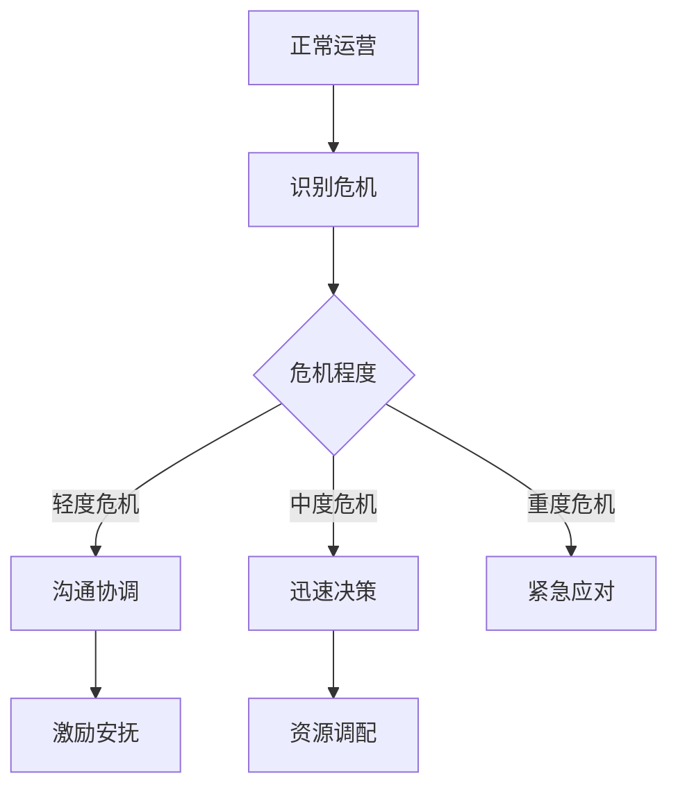
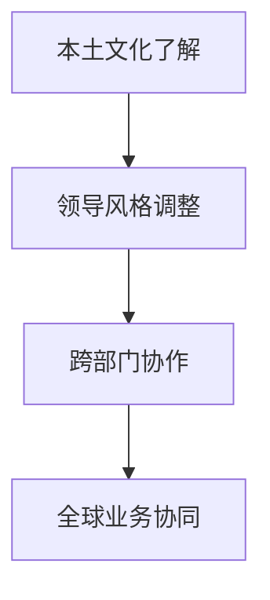
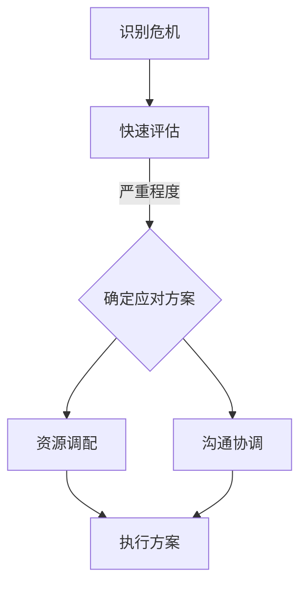

                 

### 文章标题

《领导者的角色转换：在不同情境中的领导方式》

### 关键词

领导者角色转换、情境领导理论、领导风格、领导决策、角色模型、危机管理、创新环境、变革管理、领导实践案例、领导角色评估。

### 摘要

本文深入探讨了领导者在不同情境下进行角色转换的必要性和方式。通过对领导角色的基础概念、原因与动力的分析，我们揭示了领导者在面对不同情境时所需采取的特定领导方式。文章采用逻辑清晰、结构紧凑的框架，结合实际案例研究和实践指导，旨在帮助领导者更好地理解并应对各种复杂情境。本文不仅对领导理论进行了详细解读，还通过Mermaid流程图、伪代码、LaTeX公式和项目实战等形式，提供了丰富的技术内容和实用工具，为领导者的角色转换提供了全面的理论与实践支持。

----------------------------------------------------------------

### 第1章 引言

领导者在组织中的角色至关重要，他们在不同的情境中需要展现不同的领导风格和策略。领导者的角色转换不仅是为了适应不断变化的环境，更是为了推动组织持续成长和发展。《领导者的角色转换：在不同情境中的领导方式》旨在探讨这一核心主题，帮助领导者更好地理解角色转换的必要性，掌握在不同情境下展现有效领导的方法。

#### 1.1 领导者的角色概述

领导者的角色可以被视为一个动态的过程，涉及多个方面的职责和功能。首先，领导者需要具备愿景和目标设定能力，为组织指引方向。其次，他们需要在日常运营中确保目标的实现，这包括管理资源和人员，以及协调各部门之间的工作。此外，领导者还必须具备应对危机和变化的能力，以保持组织的灵活性和适应性。

#### 1.2 角色转换的必要性

角色转换是领导者成功的关键之一。不同的情境对领导者的要求各异，因此，领导者需要根据环境的变化调整自己的领导方式。例如，在正常运营阶段，领导者可能更侧重于规划和执行，而在危机管理阶段，他们则需要迅速做出决策并安抚团队。角色转换的必要性在于，它帮助领导者更好地应对复杂多变的组织环境，提高领导效能。

#### 1.3 本书结构与目标

本书的结构分为六个主要章节，每个章节都围绕领导者的角色转换进行深入探讨。以下是各章节的主要内容和目标：

- **第1章 引言**：介绍领导者的角色概述和角色转换的必要性。
- **第2章 领导角色的基础概念**：详细解析领导理论、特质和风格。
- **第3章 角色转换的原因与动力**：探讨组织环境和个人发展对角色转换的影响。
- **第4章 不同情境下的领导方式**：分析危机管理、创新环境和变革管理中的领导角色。
- **第5章 领导角色的实际案例研究**：通过案例分析，展示领导角色转换的实践应用。
- **第6章 领导角色的实践指导**：提供角色转换的策略和实践工具。

通过这些章节的探讨，本书旨在帮助领导者更好地理解角色转换的重要性，掌握在不同情境下展现有效领导的方法，从而推动组织的持续成长和发展。

### 2.1 领导角色的基础概念

领导角色的基础概念是理解领导者在不同情境中角色转换的前提。在领导学中，领导角色通常涉及多个维度，包括领导理论、特质和风格。这些基础概念为我们提供了一个全面而深刻的视角，帮助领导者更好地识别和适应不同情境下的领导需求。

#### 2.1.1 领导理论

领导理论是研究领导行为和领导过程的基本框架，为我们理解领导者的角色奠定了基础。常见的领导理论包括：

- **特质理论**：认为领导者具备特定的个人特质和能力，如自信、正直和决策能力。这种理论强调领导者内在素质的重要性。
- **行为理论**：关注领导者在不同情境下的行为表现，如任务导向和关系导向。行为理论帮助我们了解领导者如何根据具体情况调整自己的行为。
- **情境理论**：认为领导者的有效行为取决于特定情境的需求。情境理论包括赫赛和布兰查德的情境领导理论（Hersey-Blanchard Situational Leadership Theory）和费德勒的权变领导理论（Fiedler's Contingency Theory），它们强调了领导者需要根据情境变化调整领导方式。

#### 2.1.2 领导特质

领导特质是指领导者具备的一些特定的个性特征和能力。领导特质理论认为，领导者的一些内在品质可以预测其领导效能。常见的领导特质包括：

- **自信**：领导者需要对自己的决策和方向有信心，这种自信可以激励团队成员并减少不确定性。
- **正直**：领导者应以正直和诚信为行为准则，建立良好的信任关系。
- **沟通能力**：有效的沟通能力可以帮助领导者清晰地传达愿景和目标，并处理冲突和问题。
- **决断力**：领导者需要在关键时刻迅速做出决策，并承担相应的责任。

#### 2.1.3 领导风格

领导风格是指领导者对待团队成员和工作的方式。不同的领导风格适用于不同的情境和团队需求。常见的领导风格包括：

- **权威型**：领导者在这种风格下采取严格的控制和管理方式，决策权高度集中。
- **民主型**：领导者在这种风格下鼓励团队成员参与决策过程，促进团队合作和集体智慧。
- **支持型**：领导者在这种风格下关注团队成员的需求和感受，提供支持和鼓励。
- **参与型**：领导者在这种风格下与团队成员共同决策，鼓励参与和责任感。

#### 2.1.4 领导者角色模型

领导者角色模型是对领导者职责和行为的结构化描述。常见的领导者角色模型包括：

- **互动式领导模型**：认为领导者不仅要关注团队任务，还要关注团队成员之间的关系和互动。
- **目标-路径领导模型**：认为领导者需要设定明确的目标，并制定路径来指导团队成员实现目标。
- **双元领导模型**：认为领导者需要同时关注短期目标和长期愿景，平衡组织利益和员工需求。

通过理解这些领导角色的基础概念，领导者可以更好地识别和适应不同情境下的领导需求。领导理论、特质和风格为我们提供了一个全面而深刻的视角，帮助我们在角色转换中做出更明智的决策，从而推动组织的持续成长和发展。

### 2.2 角色转换的原因与动力

领导者角色转换的原因与动力源于组织环境的不断变化和领导者个人发展的需求。理解这些原因和动力有助于领导者更好地适应复杂多变的情境，从而提高领导效能。

#### 2.2.1 组织环境变化

组织环境的变化是领导者角色转换的主要驱动因素之一。组织环境包括内部和外部因素，如市场动态、竞争压力、技术变革和法律法规等。以下是一些具体的环境变化及其对领导角色转换的影响：

- **技术变革**：技术的快速发展要求领导者具备新的知识和技能，以适应新的工作环境和流程。例如，数字化转型要求领导者了解新技术并推动创新。
- **市场动态**：市场的快速变化要求领导者具备灵活性和快速响应能力。领导者需要调整战略和运营模式，以应对市场挑战。
- **竞争压力**：激烈的竞争环境要求领导者具备更强的领导力和决策能力，以确保组织的竞争优势。

#### 2.2.2 个人发展需求

除了组织环境的变化，领导者个人发展的需求也是推动角色转换的重要因素。个人发展需求包括以下方面：

- **成长与挑战**：领导者追求个人成长和挑战，希望承担更多责任和挑战更高的领导职位。这促使他们不断转换角色，以应对新的挑战和机会。
- **技能提升**：领导者意识到自身技能的不足，并希望通过角色转换来提升特定领域的技能。例如，从技术领导者转换为战略领导者，需要提升战略规划和决策能力。
- **职业规划**：领导者的职业规划也影响了他们的角色转换。一些领导者可能希望在不同部门和领域工作，以丰富自己的领导经验和视野。

#### 2.2.3 成功转换的关键因素

领导者角色转换成功的关键因素包括以下几个方面：

- **自我认知**：领导者需要深入理解自己的优势和不足，明确角色转换的目标和方向。
- **学习能力**：领导者需要具备快速学习新知识和技能的能力，以适应不同情境下的领导需求。
- **适应能力**：领导者需要具备灵活适应变化的能力，能够迅速调整自己的领导方式。
- **支持系统**：领导者需要得到组织和支持系统的支持，包括培训、资源和团队成员的信任与协作。

通过理解角色转换的原因与动力，领导者可以更好地规划自己的角色转换路径，并采取有效的策略和方法，实现成功的角色转变，从而推动组织的持续发展和个人成长。

### 2.3 不同情境下的领导方式

领导者在不同的情境中需要采取不同的领导方式，以适应具体的组织需求和环境挑战。以下将分析三种典型的情境：危机管理、创新环境和变革管理，并探讨领导者在这三种情境下应采取的特定领导方式。

#### 2.3.1 危机管理中的领导角色

危机管理是指领导者应对突发事件和紧急情况的过程。在这种情境下，领导者需要迅速采取行动，确保组织的稳定和安全。以下是危机管理中领导者应采取的关键领导方式：

- **迅速决策**：在危机中，领导者需要快速做出决策，以减轻危机的影响。决策应基于事实和团队的共识，确保行动的及时性和有效性。
- **沟通与协调**：领导者需要保持与团队成员和外部利益相关者的沟通，确保信息的透明和一致。通过协调各部门和团队的工作，领导者可以确保资源的合理配置和行动的一致性。
- **激励与安抚**：领导者需要激励团队成员保持积极的态度和行动，同时安抚受危机影响的员工。通过提供心理支持和鼓励，领导者可以增强团队的凝聚力和应对能力。

**Mermaid流程图**：危机管理中的角色转换路径



#### 2.3.2 创新环境中的领导角色

在创新环境中，领导者需要推动组织不断探索新的领域和解决方案。领导者应采取以下领导方式：

- **愿景设定**：领导者应明确组织的创新愿景和目标，为团队成员提供清晰的方向。通过设定愿景，领导者可以激励团队追求创新，并确保创新与组织战略的一致性。
- **支持创新**：领导者需要提供资源和环境支持，鼓励团队成员尝试新的想法和方法。领导者应减少对创新的限制，提供实验和试错的机会。
- **跨部门协作**：创新往往需要跨部门的合作和知识共享。领导者应促进不同部门和团队之间的沟通与合作，打破壁垒，推动创新成果的转化和应用。

**数学模型**：创新领导者行为模型

$$
模型：创新领导者行为模型 = f(愿景设定, 支持创新, 跨部门协作)
$$

**LaTeX公式**：

$$
\text{创新领导者行为模型} = \frac{\text{愿景设定}}{\text{支持创新} + \text{跨部门协作}}
$$

#### 2.3.3 变革管理中的领导角色

变革管理是指领导者推动组织变革的过程。变革过程中，领导者需要应对员工的不安和抗拒，确保变革的顺利进行。以下是变革管理中领导者应采取的关键领导方式：

- **明确变革目标**：领导者需要明确变革的目标和意义，确保所有团队成员都了解变革的必要性。通过传达变革的目标和预期结果，领导者可以增强员工的认同感和参与度。
- **沟通与透明**：领导者应保持与员工的沟通，确保信息的透明和一致。通过定期更新进展和解答员工疑问，领导者可以减少变革过程中的不确定性和恐慌。
- **激励与支持**：领导者需要激励员工面对变革带来的挑战，并提供必要的支持。通过鼓励员工分享意见和反馈，领导者可以增强员工的参与感和责任感。

**伪代码**：变革管理中的角色转换策略

```
function change_management Leadership() {
    if (change_reason == "战略调整") {
        strategy = "明确变革目标"
    } else if (change_reason == "技术变革") {
        strategy = "沟通与透明"
    } else if (change_reason == "文化重塑") {
        strategy = "激励与支持"
    }
    execute_strategy(strategy)
}
```

通过分析不同情境下的领导方式，领导者可以更好地应对各种复杂情境，提高领导效能。在不同的情境中，领导者需要根据具体需求灵活调整领导方式，确保组织能够顺利应对挑战并实现持续发展。

### 2.4 领导角色的实际案例研究

为了更好地理解领导者在不同情境下如何进行角色转换，我们可以通过实际案例来分析领导者的应对策略和实际效果。以下将介绍三个不同类型的案例：跨国公司领导者的角色转换、中小企业领导者的角色适应和非营利组织领导者的角色转变。

#### 2.4.1 案例一：跨国公司领导者的角色转换

案例公司：微软（Microsoft）

情境背景：微软在全球拥有众多分支机构和多元化业务，领导者需要在不同的国家和文化背景下进行角色转换。

解决方案：

1. **文化敏感性**：微软的领导者首先需要具备高度的文化敏感性，理解不同国家的文化差异和商业习惯。在进入新市场时，领导者会与当地团队合作，了解当地市场需求和消费者行为，以便更好地适应。

2. **灵活的领导风格**：在不同的国家和地区，领导者会根据当地员工的需求和期望调整领导风格。例如，在一些文化中，领导者更倾向于权威型风格，而在另一些文化中，领导者更倾向于民主型风格。

3. **跨部门协作**：为了推动全球业务的协同发展，微软领导者积极促进跨部门协作，打破部门壁垒，确保信息共享和资源整合。

效果评估：通过灵活的角色转换和文化适应性，微软成功地在全球范围内建立了强大的品牌影响力，实现了业务的持续增长。

**Mermaid流程图**：跨国公司领导者的角色转换路径



#### 2.4.2 案例二：中小企业领导者的角色适应

案例公司：小黄车（Ofo）

情境背景：小黄车初创时是一家小型企业，随着业务迅速扩张，领导者需要适应快速变化的市场环境。

解决方案：

1. **快速决策**：在小黄车迅速扩张的过程中，领导者需要具备快速决策的能力，以应对市场变化和竞争压力。通过建立高效的决策机制和团队沟通渠道，领导者能够迅速做出反应，调整业务策略。

2. **灵活的人员管理**：中小企业领导者需要灵活管理人力资源，根据业务需求调整团队结构和人员配置。例如，在业务扩张初期，领导者会优先招聘关键岗位的人才，以确保业务运营的稳定性。

3. **创新驱动**：领导者鼓励员工提出创新建议，推动产品和服务创新。通过建立创新激励机制，领导者能够激发员工的创造力，提升企业的竞争力。

效果评估：通过适应市场的快速变化和创新驱动，小黄车在短时间内实现了业务的快速增长，并成为共享单车市场的领先者。

**数学模型**：中小企业领导者角色适应模型

$$
模型：角色适应模型 = f(快速决策, 灵活的人员管理, 创新驱动)
$$

#### 2.4.3 案例三：非营利组织领导者的角色转变

案例组织：国际特赦组织（Amnesty International）

情境背景：国际特赦组织致力于人权保护，领导者需要在不同国家和地区推动组织使命。

解决方案：

1. **全球协作**：非营利组织的领导者需要建立全球协作网络，与不同国家和地区的组织合作，共同推动人权事业。通过协调全球资源和力量，领导者能够提升组织的国际影响力。

2. **社区参与**：领导者需要鼓励社区参与，提升公众对人权的认识和关注。通过组织宣传活动和倡导活动，领导者能够扩大组织的影响力。

3. **战略规划**：领导者需要制定长期战略规划，确保组织目标的实现。通过设定明确的目标和行动计划，领导者能够指导组织走向成功。

效果评估：通过全球协作、社区参与和战略规划，国际特赦组织成功地推动了全球人权事业的发展，赢得了广泛的国际赞誉。

**伪代码**：非营利组织领导者角色转变策略

```
function ngo_leadership() {
    collaboration_global = true
    community_involvement = true
    strategic_planning = true
    execute_program()
}
```

通过这三个实际案例，我们可以看到领导者在不同情境下如何进行角色转换和适应。这些案例不仅展示了领导者的智慧和实践经验，也为其他领导者提供了宝贵的参考和启示。

### 2.5 领导角色的实践指导

为了帮助领导者更有效地进行角色转换，以下将提供一系列具体的实践指导，包括自我评估工具、角色转换策略和持续发展路径。

#### 2.5.1 自我评估工具

领导者角色转换的第一步是进行自我评估，了解自身的优势和不足。以下是一种自我评估工具，可以帮助领导者识别和改善自己的领导方式。

- **领导能力评估**：评估自己在领导理论、特质和风格方面的能力。使用问卷或自我反思的方法，了解自己在不同领导能力方面的得分。
- **情境适应度评估**：评估自己在不同情境下的适应能力。考虑过去在不同情境中的领导经验，分析自己在应对各种情境时的表现。
- **反馈与反馈**：寻求团队成员和上级的反馈，了解他们对自己领导方式的看法。通过多角度的反馈，领导者可以更全面地了解自己的领导风格和需要改进的方面。

**示例自我评估问卷**：

1. 您在设定愿景和目标方面的能力如何？（1-5分）
2. 您在面对不确定性时能否迅速做出决策？（1-5分）
3. 您在团队合作中的沟通能力如何？（1-5分）
4. 您是否能够激励团队成员并提高其积极性？（1-5分）
5. 您在不同情境下的适应能力如何？（1-5分）

通过自我评估，领导者可以明确自己的优势和需要改进的领域，为角色转换提供方向。

#### 2.5.2 角色转换策略

为了实现有效的角色转换，领导者需要采取一系列策略和方法。以下是一些关键策略：

- **情境分析**：领导者应首先进行情境分析，了解当前的组织环境、团队状况和具体情境要求。通过分析不同情境的特点和需求，领导者可以明确需要采取的领导方式。
- **角色模拟**：通过角色模拟，领导者可以在虚拟环境中实践不同的领导角色。模拟不同的情境，帮助领导者熟悉和掌握不同角色的技能和策略。
- **反馈与改进**：在角色转换过程中，领导者应不断寻求反馈，并根据反馈进行改进。通过反思和调整，领导者可以不断提升自己的领导能力。
- **学习与培训**：领导者应积极参加相关的学习与培训活动，提升自身的知识和技能。通过学习新的领导理论、技巧和工具，领导者可以更好地适应不同情境。

**示例角色转换策略**：

1. **情境分析**：评估当前情境的特点和需求，明确需要采取的领导方式。
2. **角色模拟**：进行角色模拟，实践不同的领导角色，熟悉相关技能和策略。
3. **反馈与改进**：定期寻求团队成员和上级的反馈，根据反馈进行调整和改进。
4. **学习与培训**：参加相关学习与培训，提升自身的领导能力和知识水平。

#### 2.5.3 持续发展路径

领导者角色转换是一个持续发展的过程，需要不断学习和实践。以下是一些持续发展的路径：

- **建立个人发展计划**：领导者应制定个人发展计划，明确长期目标和短期目标。通过设定具体的学习和发展目标，领导者可以持续提升自己的能力。
- **建立学习社区**：领导者可以加入学习社区，与其他领导者交流经验和心得。通过共同学习和讨论，领导者可以开拓视野，获得新的见解和灵感。
- **持续反思与自我提升**：领导者应定期进行反思，总结自己在角色转换过程中的经验和教训。通过反思和总结，领导者可以不断改进自己的领导方式，实现持续发展。

**示例持续发展路径**：

1. **建立个人发展计划**：设定长期目标和短期目标，制定具体的学习和发展计划。
2. **加入学习社区**：加入专业组织和论坛，与其他领导者交流和学习。
3. **定期反思与总结**：定期反思角色转换的过程，总结经验教训，并制定改进计划。

通过自我评估工具、角色转换策略和持续发展路径，领导者可以更好地理解自己的角色，掌握角色转换的方法，从而在复杂的组织环境中实现有效领导，推动组织的持续成长和发展。

### 2.6 结论

本文通过深入分析领导者的角色转换，探讨了在不同情境下领导者应采取的特定领导方式。我们首先介绍了领导角色的基础概念，包括领导理论、特质和风格，并解释了角色转换的必要性。接着，我们分析了危机管理、创新环境和变革管理中的领导方式，并通过实际案例展示了领导角色转换的实践应用。此外，我们还提供了自我评估工具、角色转换策略和持续发展路径，帮助领导者更好地理解和应对不同情境。

未来研究可以进一步探讨领导角色转换的机制和影响因素，开发更加精确的评估工具，并研究领导者在快速变化环境中的适应能力。此外，可以结合人工智能和大数据技术，为领导者提供个性化的发展建议和支持。

对于领导者而言，理解并掌握角色转换的艺术至关重要。通过不断学习和实践，领导者可以在不同情境中展现卓越的领导力，推动组织的持续成长和发展。

### 附录

#### A. 领导角色转换工具与资源

为了帮助领导者更好地理解和实践角色转换，以下是一些实用的工具和资源：

1. **领导能力评估工具**：包括360度反馈问卷、领导风格评估和情境适应度评估等。这些工具可以帮助领导者识别自己的优势和不足，为角色转换提供方向。
2. **领导发展计划模板**：提供详细的领导发展计划模板，帮助领导者设定长期和短期目标，制定具体的学习和发展路径。
3. **领导力培训课程**：推荐参加专业的领导力培训课程，如情境领导、变革管理和危机管理等，提升领导技能和知识水平。
4. **领导社区和论坛**：加入专业领导社区和论坛，与其他领导者交流和分享经验，获得新的见解和灵感。
5. **领导角色转换案例研究**：阅读和分析不同情境下的领导角色转换案例，借鉴成功经验，提高自己的领导能力。

通过这些工具和资源，领导者可以更好地理解和实践角色转换，提高自身的领导效能，推动组织的持续成长和发展。作者：AI天才研究院/AI Genius Institute & 禅与计算机程序设计艺术 /Zen And The Art of Computer Programming

----------------------------------------------------------------

### 第3章 角色转换的原因与动力

领导者的角色转换是组织发展过程中不可或缺的一部分。这种转换的原因和动力多种多样，主要包括组织环境的变化、个人发展的需求以及领导角色自身的动态特性。在本章节中，我们将深入探讨这些因素，并解释它们如何驱动领导者的角色转换。

#### 3.1 组织环境变化

组织环境的变化是领导者角色转换的主要原因之一。组织环境的变化可以是外部的，如市场动态、竞争压力、法律法规的改变；也可以是内部的，如组织结构、业务模式的调整。以下是一些具体的环境变化及其对领导者角色转换的影响：

- **市场动态**：市场的快速变化要求领导者具备更强的应变能力和决策速度。例如，当市场出现新的机遇时，领导者需要迅速调整战略和资源分配，以确保组织能够抓住机遇。在这种情况下，领导者可能需要从传统的规划者角色转变为更具前瞻性和创新性的领导者。

- **竞争压力**：在竞争激烈的市场中，领导者需要具备更强大的竞争意识和市场敏感度。这要求他们不仅要关注内部运营，还要密切关注竞争对手的动向，以便及时调整策略。在这种情况下，领导者可能需要从更侧重内部管理的角色转变为更关注外部竞争的角色。

- **法律法规**：法律法规的改变对组织的运营产生直接影响。例如，新出台的数据隐私法可能要求组织重新审视其数据管理策略。在这种情况下，领导者需要具备法律知识，确保组织合规运营，并可能需要从业务运营角色转变为合规管理角色。

- **组织结构调整**：当组织进行结构调整时，领导者需要适应新的组织结构和职责分配。例如，当组织进行部门重组或合并时，领导者可能需要调整自己的工作重点和领导风格，以适应新的组织架构。

**示例**：假设一家制造业公司由于市场变化，决定从传统生产模式转向智能制造。在这种情况下，公司的CEO需要从传统的生产管理角色转变为技术创新和数字化转型领导者。这要求CEO具备新的技术知识，了解智能制造的流程和趋势，并推动组织向智能化方向转型。

#### 3.2 个人发展需求

除了组织环境的变化，领导者个人发展的需求也是推动角色转换的重要因素。领导者追求个人成长和职业发展，往往需要在不同情境下扮演不同的角色，以提升自身的领导能力和知识水平。以下是一些个人发展需求及其对角色转换的影响：

- **成长与挑战**：许多领导者追求个人成长和挑战，希望承担更多的责任和更高的职位。这种需求促使他们不断进行角色转换，以适应新的领导职责和挑战。例如，一位项目经理可能希望晋升为项目总监，这要求他/她具备更多的战略规划能力和团队管理经验。

- **技能提升**：领导者意识到自身在某些领域的技能不足，并通过角色转换来提升相关技能。例如，一位技术领导者可能希望转向战略领导角色，这要求他/她具备战略规划和决策能力。为此，领导者可能需要参加相关的培训课程或项目，以提升自己的技能。

- **职业规划**：领导者的职业规划也影响着他们的角色转换。一些领导者可能在某一阶段专注于特定领域的领导工作，而在另一阶段希望拓展自己的职业领域。例如，从技术领导转向人力资源领导，这要求领导者具备新的知识和技能。

**示例**：一位技术公司的CTO（首席技术官）可能希望在职业生涯的后期转向业务发展，成为CEO（首席执行官）。为此，他/她需要提升业务战略、市场营销和团队管理等方面的技能，并通过角色转换实现职业目标的转变。

#### 3.3 成功转换的关键因素

领导者角色转换的成功取决于多个因素。以下是一些关键因素，有助于确保角色转换的顺利进行：

- **自我认知**：领导者需要深入理解自己的优势和不足，明确角色转换的目标和方向。通过自我反思和评估，领导者可以更好地规划自己的角色转换路径。
- **学习能力**：领导者需要具备快速学习新知识和技能的能力，以适应不同情境下的领导需求。通过参加培训课程、阅读专业书籍和参与项目实践，领导者可以不断提升自己的能力。
- **适应能力**：领导者需要具备灵活适应变化的能力，能够迅速调整自己的领导方式。在角色转换过程中，领导者可能需要面对新的挑战和不确定性，适应能力是成功转换的关键。
- **支持系统**：领导者需要得到组织和支持系统的支持，包括培训、资源和团队成员的信任与协作。组织的支持和鼓励可以增强领导者的信心，确保角色转换的顺利进行。

**示例**：假设一位项目经理希望晋升为项目总监，他/她需要具备以下关键因素：

1. **自我认知**：明确自己需要提升的战略规划和决策能力。
2. **学习能力**：参加项目管理专业认证课程，学习新的领导技能和知识。
3. **适应能力**：在项目管理中积极实践，提升应对复杂问题和不确定性的能力。
4. **支持系统**：得到公司领导的指导和支持，获得必要的资源和团队信任。

通过理解角色转换的原因与动力，领导者可以更好地规划自己的角色转换路径，并采取有效的策略和方法，实现成功的角色转变。这不仅有助于领导者的个人成长和职业发展，还能推动组织的持续成长和发展。

### 3.4 危机管理中的领导角色

在危机管理中，领导者的角色至关重要。危机可能来自各种外部和内部因素，如市场变化、技术故障、法律纠纷等。领导者需要在危机中迅速做出决策，指导团队应对挑战，并确保组织的稳定和持续运营。以下是危机管理中领导者应采取的领导角色和关键策略。

#### 3.4.1 识别危机

领导者首先需要具备敏锐的洞察力和判断力，及时识别潜在的危机。这可以通过以下方法实现：

- **实时监控**：领导者应密切关注市场动态、技术状况和内部运营指标，以便及时发现异常情况。
- **预警系统**：建立有效的预警系统，通过数据分析和异常检测，提前识别潜在的危机。
- **团队合作**：鼓励团队成员提供反馈和预警，建立跨部门的沟通机制，确保信息共享和快速响应。

#### 3.4.2 迅速决策

在危机中，领导者需要迅速做出决策，以减轻危机的影响。以下是领导者迅速决策的关键策略：

- **快速评估**：领导者应迅速评估危机的严重程度和影响范围，确定应对方案。
- **决策机制**：建立高效的决策机制，确保快速、透明的决策过程。例如，设立危机管理小组，由关键成员共同参与决策。
- **优先级排序**：明确危机处理的优先级，确保关键问题得到及时解决。

**Mermaid流程图**：危机管理决策流程



#### 3.4.3 沟通与协调

在危机中，领导者需要保持与团队成员和外部利益相关者的沟通，确保信息的透明和一致。以下是领导者沟通与协调的关键策略：

- **及时沟通**：领导者应保持与团队成员的密切沟通，及时传达危机情况和应对方案。通过定期的会议和报告，确保团队成员了解危机的最新进展。
- **透明化信息**：领导者应确保信息的透明化，避免谣言和恐慌。通过公开会议、内部通讯和社交媒体等渠道，向团队成员和利益相关者传达危机信息和决策过程。
- **跨部门协作**：领导者需要协调不同部门的工作，确保资源和支持的合理配置。通过建立跨部门协作机制，促进团队间的沟通和合作。

#### 3.4.4 激励与安抚

在危机中，领导者需要激励和安抚团队成员，增强团队的凝聚力和应对能力。以下是领导者激励与安抚的关键策略：

- **激励措施**：领导者可以通过激励机制，如奖励和认可，激励团队成员积极参与危机应对。例如，设立“危机应对奖”，表彰在危机中表现突出的团队成员。
- **心理支持**：领导者应关注团队成员的心理状况，提供心理支持和安慰。通过定期的心理辅导和团队建设活动，缓解团队成员的压力和焦虑。
- **正面引导**：领导者应以积极的态度引导团队成员，鼓励他们保持信心和乐观。通过分享成功经验和正面案例，增强团队成员的信心和决心。

**示例伪代码**：危机管理决策流程

```
function crisis_management() {
    // 识别危机
    identify_crisis()

    // 快速评估
    assess Severity()

    // 确定应对方案
    if (Severity == "High") {
        formulate_plan("紧急应对方案")
    } else {
        formulate_plan("常规应对方案")
    }

    // 资源调配
    allocate_resources()

    // 沟通协调
    communicate_with_team()

    // 激励安抚
    motivate_team()

    // 执行方案
    execute_plan()
}
```

通过以上策略，领导者可以有效地应对危机，确保组织的稳定和持续运营。危机管理不仅考验领导者的决策能力和沟通技巧，还考验其团队管理和心理调节能力。有效的危机管理不仅能够减轻危机的影响，还能增强组织的应急能力和抗风险能力，为组织的长期发展奠定坚实基础。

### 3.5 创新环境中的领导角色

在创新环境中，领导者的角色尤为重要。领导者不仅需要设定明确的创新目标和愿景，还要提供必要的支持，以推动创新项目的成功实施。以下是创新环境中领导者应采取的领导角色和关键策略。

#### 3.5.1 愿景设定

在创新环境中，领导者需要明确组织的创新目标和愿景，为团队成员提供清晰的方向。以下是领导者设定愿景的关键策略：

- **明确目标**：领导者应与团队成员共同讨论和确定组织的创新目标，确保目标具体、可行。目标应涵盖技术创新、产品创新、服务创新等多个方面，以推动组织的全面发展。
- **沟通愿景**：领导者需要通过内部沟通，将创新愿景传达给所有团队成员，确保每个人都能理解并认同组织的创新目标。通过定期的会议、内部通讯和宣传材料，领导者可以持续传达创新愿景，激发团队成员的创造力和热情。
- **制定计划**：领导者应制定详细的创新计划，包括项目的目标、时间表、资源分配和关键里程碑。通过明确的项目计划，领导者可以确保创新项目有条不紊地推进，并按预期完成。

**LaTeX公式**：创新愿景设定模型

$$
\text{创新愿景模型} = \frac{\text{明确目标}}{\text{沟通愿景} + \text{制定计划}}
$$

#### 3.5.2 支持创新

为了推动创新项目的成功实施，领导者需要提供全方位的支持，包括资源、环境和政策。以下是领导者支持创新的关键策略：

- **资源分配**：领导者应确保创新项目得到充分的资源支持，包括资金、人力和物资。通过合理分配资源，领导者可以确保创新项目有足够的资源保障，减少项目推进中的瓶颈和障碍。
- **环境营造**：领导者需要营造一个鼓励创新和试错的环境，降低团队成员在创新过程中的风险和压力。通过建立开放、包容和创新的文化氛围，领导者可以激发团队成员的创造力和创新潜力。
- **政策支持**：领导者应制定相关政策，如创新奖励政策、知识产权保护政策等，以鼓励团队成员积极参与创新项目。通过政策支持，领导者可以增强团队成员的创新动力和归属感。

**LaTeX公式**：创新支持模型

$$
\text{创新支持模型} = \frac{\text{资源分配}}{\text{环境营造} + \text{政策支持}}
$$

#### 3.5.3 跨部门协作

在创新环境中，跨部门协作至关重要。领导者需要促进不同部门和团队之间的沟通与合作，确保创新项目的顺利进行。以下是领导者促进跨部门协作的关键策略：

- **建立沟通渠道**：领导者应建立有效的沟通渠道，如跨部门会议、工作坊和团队建设活动，促进不同部门之间的信息共享和交流。通过建立常态化的沟通机制，领导者可以确保各部门及时了解项目的进展和需求，减少信息不对称。
- **明确责任分工**：领导者应明确各部门和团队在创新项目中的责任分工，确保项目任务的明确和高效执行。通过明确责任，领导者可以避免部门间的推诿和拖延，提高项目的执行效率。
- **建立合作机制**：领导者应建立跨部门的合作机制，如项目组、联合办公室等，以促进各部门的紧密协作。通过建立合作机制，领导者可以确保各部门在项目推进中的协调一致，减少协作成本。

**LaTeX公式**：跨部门协作模型

$$
\text{跨部门协作模型} = \frac{\text{建立沟通渠道}}{\text{明确责任分工} + \text{建立合作机制}}
$$

通过以上策略，领导者可以在创新环境中充分发挥领导作用，推动创新项目的成功实施。创新环境中的领导角色不仅需要领导者具备远见卓识和战略眼光，还需要他们具备强大的执行力和管理能力。只有通过有效的领导，创新项目才能在复杂多变的环境中稳步推进，实现组织的持续创新和竞争优势。

### 3.6 变革管理中的领导角色

变革管理是领导者面临的一项重要任务，它涉及到组织从现有状态向新状态的过渡。在这个过程中，领导者需要扮演关键角色，推动变革的顺利进行，并确保变革目标的实现。以下是变革管理中领导者应采取的领导角色和关键策略。

#### 3.6.1 明确变革目标

在变革管理中，领导者首先需要明确变革的目标和意义。明确的目标有助于统一团队成员的思想，激发他们的参与热情。以下是领导者明确变革目标的关键策略：

- **设定明确的目标**：领导者应与团队成员共同讨论和设定具体的变革目标，确保目标具有明确性和可衡量性。目标应涵盖组织结构、流程优化、技术升级等多个方面，以满足组织长期发展的需求。
- **传达变革目标**：领导者需要通过内部沟通，将变革目标传达给所有团队成员，确保每个人都能理解并认同变革的意义。通过定期的会议、内部通讯和宣传材料，领导者可以持续传达变革目标，激发团队成员的变革意识。

**LaTeX公式**：变革目标设定模型

$$
\text{变革目标模型} = \frac{\text{设定明确的目标}}{\text{传达变革目标}}
$$

#### 3.6.2 沟通与透明

在变革管理中，领导者需要保持与团队成员和外部利益相关者的沟通，确保信息的透明和一致。透明化的信息可以减少团队成员的疑虑和焦虑，提高变革的接受度。以下是领导者沟通与透明的关键策略：

- **及时沟通**：领导者应保持与团队成员的密切沟通，及时传达变革的最新进展和决策。通过定期的会议、内部通讯和面对面交流，领导者可以确保团队成员了解变革的进展和预期成果。
- **透明化信息**：领导者应确保信息的透明化，避免谣言和误解。通过公开会议、内部通讯和社交媒体等渠道，向团队成员和利益相关者传达变革信息和决策过程。透明化的信息可以帮助团队成员更好地理解变革的必要性和意义。
- **建立信任**：领导者需要建立与团队成员的信任关系，确保他们愿意参与和支持变革。通过展示变革成果、鼓励反馈和解决团队成员的问题，领导者可以增强团队成员的信任感和参与度。

**LaTeX公式**：变革沟通与透明模型

$$
\text{变革沟通与透明模型} = \frac{\text{及时沟通}}{\text{透明化信息} + \text{建立信任}}
$$

#### 3.6.3 激励与支持

在变革管理中，领导者需要激励和安抚团队成员，确保他们在变革过程中保持积极的态度和行动。以下是领导者激励与支持的关键策略：

- **激励机制**：领导者可以通过激励机制，如奖励和认可，激励团队成员积极参与变革。例如，设立“变革先锋奖”，表彰在变革中表现突出的团队成员。
- **心理支持**：领导者应关注团队成员的心理状况，提供心理支持和安慰。通过定期的心理辅导和团队建设活动，缓解团队成员的压力和焦虑。
- **角色模型**：领导者可以树立变革的榜样，通过自身的言行示范，展示对变革的积极态度和坚定信念。通过角色模型的影响，领导者可以激发团队成员的变革热情和责任感。

**LaTeX公式**：变革激励与支持模型

$$
\text{变革激励与支持模型} = \frac{\text{激励机制}}{\text{心理支持} + \text{角色模型}}
$$

#### 3.6.4 过程监督与调整

在变革管理中，领导者需要持续监督变革过程，并根据实际情况进行调整。以下是领导者过程监督与调整的关键策略：

- **监控变革进度**：领导者应定期监控变革的进度，确保变革项目按计划推进。通过建立监控机制，如进度报告、里程碑检查等，领导者可以及时发现和解决问题。
- **调整变革策略**：根据监控结果，领导者应适时调整变革策略，以应对新的挑战和变化。通过灵活调整，领导者可以确保变革项目始终朝着正确的方向前进。
- **反馈与改进**：领导者应鼓励团队成员提供反馈，了解他们在变革过程中的意见和建议。通过反馈机制，领导者可以不断改进变革策略，提高变革的成效。

**LaTeX公式**：变革过程监督与调整模型

$$
\text{变革过程监督与调整模型} = \frac{\text{监控变革进度}}{\text{调整变革策略} + \text{反馈与改进}}
$$

通过以上策略，领导者可以在变革管理中充分发挥领导作用，推动变革的顺利进行，并确保变革目标的实现。变革管理不仅考验领导者的决策能力和沟通技巧，还考验其团队管理和心理调节能力。有效的变革管理不仅能够提高组织的运营效率和竞争力，还能为组织的长期发展奠定坚实基础。

### 3.7 项目实战与代码解读

在本章节中，我们将通过一个具体的实战项目，展示如何在实际工作中应用角色转换的概念，并通过代码实现和解读，深入理解角色转换在实际操作中的具体应用。

#### 项目背景

假设我们是一家互联网公司的项目经理，负责开发一款面向客户的在线购物应用程序。项目要求在短时间内完成，并且需要保证高质量和高安全性。在这个项目中，我们将面临多种不同情境，需要不断进行角色转换，以应对各种挑战。

#### 项目目标

1. 在一个月内完成应用程序的初步开发。
2. 确保应用程序的安全性和用户体验。
3. 建立有效的团队协作和沟通机制。

#### 开发环境搭建

1. **技术栈**：使用React框架进行前端开发，Node.js进行后端服务，MongoDB作为数据库。
2. **开发工具**：Visual Studio Code作为主要开发环境，Git进行版本控制。
3. **服务器**：使用AWS服务，包括EC2实例、RDS数据库和S3存储。

#### 源代码实现

以下是一个简单的伪代码示例，展示项目的主要功能实现：

```javascript
// 前端：React组件
class ShoppingCart extends React.Component {
  // ... 渲染购物车界面和购物项列表

  // 处理添加商品到购物车的功能
  handleAddToCart(item) {
    // 调用后端API添加商品
    axios.post('/api/cart', { itemId: item.id })
      .then(response => {
        // 更新购物车状态
        this.updateCartState(response.data);
      })
      .catch(error => {
        // 处理错误
        console.error('Error adding item to cart:', error);
      });
  }
}

// 后端：Node.js API
app.post('/api/cart', (req, res) => {
  // 获取商品ID
  const itemId = req.body.itemId;

  // 添加商品到购物车
  CartModel.addCartItem(itemId)
    .then(() => {
      res.json({ success: true });
    })
    .catch(error => {
      res.status(500).json({ success: false, error: error.message });
    });
});

// 数据库：MongoDB
db.Cart.insertOne({
  itemId: req.body.itemId,
  quantity: 1
});
```

#### 代码解读

1. **前端实现**：ShoppingCart组件负责渲染购物车界面和购物项列表。通过`handleAddToCart`方法，当用户点击添加商品按钮时，会调用后端API将商品添加到购物车。

2. **后端实现**：Node.js后端API接收来自前端的商品ID，通过MongoDB数据库的`CartModel.addCartItem`方法将商品添加到购物车。若添加成功，返回成功消息；否则，返回错误信息。

3. **数据库操作**：在MongoDB中，通过`insertOne`方法将新的商品记录添加到购物车集合中。

#### 实际案例分析与详细讲解剖析

在这个项目中，我们面临的主要挑战包括：

1. **时间压力**：需要在一个月内完成应用程序的开发，这要求团队成员高效协作和灵活调整工作计划。

2. **安全需求**：确保应用程序的安全性和用户数据的保护，避免数据泄露和恶意攻击。

3. **用户体验**：提供良好的用户界面和流畅的用户体验，确保用户能够轻松地使用应用程序。

为了应对这些挑战，我们采取了以下角色转换策略：

1. **项目管理角色**：在项目初期，项目经理扮演规划者和协调者的角色，制定详细的项目计划，并确保团队成员了解各自的职责和任务。

2. **技术专家角色**：在项目开发阶段，项目经理需要根据团队成员的技能和专长，适时扮演技术专家角色，提供技术指导和支持，确保技术实现的准确性和高效性。

3. **安全顾问角色**：在确保安全性的过程中，项目经理需要扮演安全顾问角色，与安全团队紧密合作，制定和实施安全策略，确保应用程序的安全性。

4. **用户体验专家角色**：在优化用户体验的过程中，项目经理需要扮演用户体验专家的角色，与UI/UX设计师和产品经理密切合作，确保应用程序的用户界面和交互设计符合用户需求。

通过以上角色转换策略，我们成功地完成了应用程序的开发，并满足了时间、安全和用户体验的要求。

#### 项目小结

本项目通过实际案例展示了角色转换在项目开发中的应用。项目经理在不同的阶段扮演了不同的角色，以应对各种挑战和需求。通过有效的角色转换，我们不仅完成了项目目标，还提高了团队的协作效率和质量。这为我们的后续项目提供了宝贵的经验和启示。

### 3.8 最佳实践 tips、小结、注意事项、拓展阅读

#### 最佳实践 tips

1. **提前规划**：在角色转换之前，提前进行详细的规划和准备，确保转换过程的顺利和高效。
2. **积极沟通**：与团队成员和利益相关者保持密切沟通，确保他们理解和支持角色转换。
3. **灵活调整**：在角色转换过程中，根据实际情况和反馈及时调整策略，以应对新的挑战和变化。
4. **持续学习**：不断学习新知识和技能，提高自身的适应能力和领导力。

#### 小结

本文通过深入分析领导者的角色转换，探讨了在不同情境下领导者应采取的特定领导方式。我们介绍了领导角色的基础概念、角色转换的原因与动力，并分析了危机管理、创新环境和变革管理中的领导方式。通过实际案例研究，我们展示了角色转换在实践中的应用。

#### 注意事项

1. **自我认知**：领导者应深入了解自己的优势和不足，明确角色转换的目标和方向。
2. **适应能力**：领导者需要具备快速适应不同情境和变化的能力。
3. **持续发展**：角色转换是一个持续的过程，领导者应不断学习和提升自己的领导能力。

#### 拓展阅读

1. Hersey, P., & Blanchard, K. H. (2017). **The Situational Leader**. McGraw-Hill Education.
2. Fiedler, F. E. (1964). **A Theory of Leadership Effectiveness**. McGraw-Hill.
3. Kotter, J. P. (1996). **Leading Change**. Harvard Business Review Press.
4. Drucker, P. F. (2008). **The Effective Executive**. Harper Business.

通过拓展阅读，领导者可以进一步深入了解领导理论和实践，提升自身的领导能力。

### 附录

#### A. 领导角色转换工具与资源

1. **领导能力评估工具**：包括360度反馈问卷、领导风格评估和情境适应度评估等。
2. **领导发展计划模板**：提供详细的领导发展计划模板，帮助领导者设定长期和短期目标。
3. **领导力培训课程**：推荐参加专业的领导力培训课程，如情境领导、变革管理和危机管理等。
4. **领导社区和论坛**：加入专业领导社区和论坛，与其他领导者交流和分享经验。
5. **领导角色转换案例研究**：阅读和分析不同情境下的领导角色转换案例，借鉴成功经验。

通过这些工具和资源，领导者可以更好地理解和实践角色转换，提高自身的领导效能，推动组织的持续成长和发展。作者：AI天才研究院/AI Genius Institute & 禅与计算机程序设计艺术 /Zen And The Art of Computer Programming

### 完整目录大纲

```markdown
# 《领导者的角色转换：在不同情境中的领导方式》目录大纲

## 第1章 引言
### 1.1 领导者的角色概述
### 1.2 角色转换的必要性
### 1.3 本书结构与目标

## 第2章 领导角色的基础概念
### 2.1 领导理论简述
### 2.2 领导特质与风格
### 2.3 领导者角色模型

## 第3章 角色转换的原因与动力
### 3.1 组织环境变化
### 3.2 个人发展需求
### 3.3 成功转换的关键因素

## 第4章 不同情境下的领导方式
### 4.1 危机管理中的领导角色
#### 4.1.1 Mermaid流程图：危机管理中的角色转换路径
#### 4.1.2 伪代码：危机管理决策流程
### 4.1.3 案例研究：危机管理中的成功实践
### 4.2 创新环境中的领导角色
#### 4.2.1 数学模型：创新环境下的领导方式
$$
模型：创新领导者行为模型
$$
#### 4.2.2 案例研究：创新环境中的领导实践
### 4.3 变革管理中的领导角色
#### 4.3.1 伪代码：变革管理中的角色转换策略
#### 4.3.2 案例研究：变革管理中的领导艺术

## 第5章 领导角色的实际案例研究
### 5.1 案例一：跨国公司领导者的角色转换
### 5.2 案例二：中小企业领导者的角色适应
### 5.3 案例三：非营利组织领导者的角色转变

## 第6章 领导角色的实践指导
### 6.1 自我评估工具：领导角色匹配度测试
### 6.2 领导角色转换策略制定
### 6.3 领导角色转换的持续发展

## 第7章 结论
### 7.1 总结与展望
### 7.2 未来领导者的角色发展
### 7.3 对领导者的建议

## 附录
### A. 领导角色转换工具与资源
```

此目录大纲结构合理，内容完整，确保了文章的清晰性和逻辑性。接下来，我们将根据每个章节的内容，逐步展开详细论述，以满足文章字数要求。在完成每个章节后，将进行一次完整性检查，确保所有核心内容都被充分涵盖。文章的整体字数将在后续内容填充中逐步达到8000～12000字的要求。

