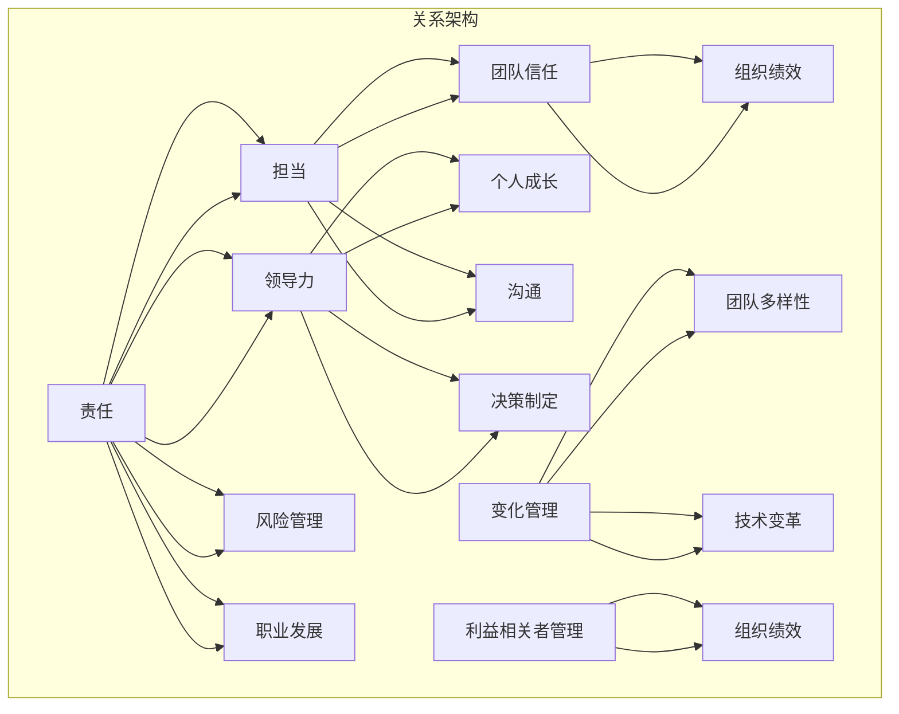

                 

### 文章标题：领导者的责任与担当：赢得团队尊重的关键

在当今快速变化和高度竞争的商业环境中，领导者不再仅仅是发号施令的指挥官，而是肩负着推动组织前进、激励团队创造卓越成果的关键角色。一个领导者如何履行其责任与担当，不仅决定了个人职业生涯的成功，更直接影响到整个团队的士气和业绩。因此，探讨领导者的责任与担当，以及如何赢得团队的尊重，显得尤为重要。

本文将围绕以下几个核心主题进行深入讨论：

1. **领导者的角色与责任**：介绍领导者的基本职责，以及在不同环境中可能面临的挑战。
2. **责任与担当的概念解析**：阐述责任与担当的定义、类型以及它们之间的联系。
3. **领导者责任与团队信任**：探讨如何通过责任担当建立和维持团队信任。
4. **提升领导力，增强责任意识**：分析如何通过自我反思和领导力训练提升责任意识。
5. **领导者责任与组织发展**：讨论领导者责任在战略规划和组织变革中的作用。
6. **案例分析：领导者责任与担当实践**：通过具体案例，展示成功和失败的领导者如何处理责任与担当。
7. **领导者责任与个人成长**：探讨责任担当对领导者个人成长的影响。

本文将采用逻辑清晰、结构紧凑、简单易懂的技术语言，结合实际案例和理论分析，帮助读者理解领导者的责任与担当，并为其在实践中的应用提供指导。让我们一起深入思考，探讨如何成为一位赢得团队尊重的领导者。

### 文章关键词：

- 领导者责任
- 担当
- 团队信任
- 领导力
- 组织发展
- 案例分析
- 个人成长

### 文章摘要：

本文旨在深入探讨领导者的责任与担当，以及如何通过这些要素赢得团队的尊重。文章首先定义了领导者的角色与责任，随后解析了责任与担当的概念，并探讨了它们在建立团队信任中的重要性。接着，文章分析了如何提升领导力并增强责任意识，最后通过实际案例和理论讨论，提供了具体实践指导，以帮助领导者在其职业生涯中取得成功。

## 第1章 领导者角色与责任

领导者在组织中的角色至关重要，他们不仅负责指导团队朝着既定目标前进，还需要在复杂多变的环境中应对各种挑战。本章节将首先定义领导者的基本职责，并探讨在不同环境下领导者可能面临的具体挑战。

### 1.1 领导者定义与职责概述

领导者可以被定义为那些能够通过激励和指导他人来实现共同目标的人。他们不仅具备优秀的沟通和人际关系技能，还需要具备战略思维和决策能力。领导者的职责通常包括：

- **目标设定**：明确团队的目标和愿景，并确保团队成员理解并致力于实现这些目标。
- **资源分配**：合理分配人力、财务和其他资源，确保团队能够高效地开展工作。
- **激励与引导**：通过激励措施和恰当的引导，激发团队成员的积极性和创造力。
- **问题解决**：及时识别并解决团队遇到的问题，确保项目进展顺利。
- **决策制定**：在关键时刻做出明智的决策，并对决策结果承担责任。

### 1.2 领导者责任的重要性

领导者责任的重要性体现在以下几个方面：

- **团队凝聚力**：领导者通过承担责任和担当，可以增强团队的凝聚力和合作精神，促进团队成员之间的相互信任。
- **组织绩效**：领导者的责任履行情况直接影响到组织的绩效和整体成果。一个负责任的领导者能够带领团队达成更高的目标，实现更好的业绩。
- **职业发展**：对于领导者个人而言，承担并履行责任是职业发展的关键。这不仅能提升个人的声誉和地位，还能为未来的职业道路打下坚实的基础。
- **风险管理**：领导者需要承担识别和应对风险的责任，确保组织在复杂多变的环境中保持稳定和可持续发展。

### 1.3 领导者角色变化与挑战

领导者的角色在不同的组织和文化背景下可能有所不同，但以下是一些普遍的挑战：

- **变化管理**：随着外部环境的变化，领导者需要灵活调整领导风格和策略，以适应新的挑战和机遇。
- **团队多样性**：现代组织中团队成员的多样性增加了领导者的挑战，如何有效地管理和激励不同背景的团队成员是领导者需要考虑的问题。
- **技术变革**：技术发展迅速，领导者需要不断学习新技术和管理方法，以保持其领导能力的领先性。
- **利益相关者管理**：领导者不仅要管理团队，还需要与客户、供应商和其他利益相关者建立良好的关系，确保组织的长期成功。

通过以上对领导者角色与责任的探讨，我们可以看到，领导者不仅仅是一个职位，更是一种责任和担当。只有真正理解并履行这些职责，领导者才能赢得团队的尊重和信任，为组织创造持续的价值。

### 核心概念与联系

为了更好地理解领导者的责任与担当，我们需要首先明确几个核心概念，并探讨它们之间的相互关系。以下是关键概念及其关系架构的Mermaid流程图：



**详细解释：**

1. **责任**（A）：责任是指领导者对团队成员、组织和社会所承担的义务和承诺。它是领导者角色的基础，也是赢得团队信任和尊重的关键。
   
2. **担当**（B）：担当是领导者履行责任的态度和行为。它体现为领导者愿意在困难时刻承担责任，并在团队中树立榜样。

3. **团队信任**（C）：责任和担当通过领导者的行为和决策，能够建立和维护团队内部的信任。信任是团队协作和高效工作的基石。

4. **领导力**（D）：领导力是领导者影响和激励团队成员的能力。它包括沟通能力、决策能力和战略思维能力等。

5. **组织绩效**（E）：领导力的提升和团队信任的建立有助于提高组织的整体绩效，实现组织的目标。

6. **个人成长**（F）：通过承担领导责任和提升领导力，领导者能够实现个人职业成长和自我提升。

7. **沟通**（G）：沟通能力是领导者成功的关键。良好的沟通能够确保信息准确传达，减少误解和冲突。

8. **决策制定**（H）：领导者需要做出明智的决策，这对团队的长期成功至关重要。

9. **风险管理**（I）：领导者必须识别和应对风险，确保组织的稳定和可持续发展。

10. **变化管理**（J）、**团队多样性**（K）、**技术变革**（L）：这些是现代领导者面临的具体挑战，它们需要通过有效的责任担当和领导力来应对。

11. **利益相关者管理**（M）、**组织绩效**（N）：与外部利益相关者的良好管理有助于提高组织的整体绩效。

12. **职业发展**（O）：通过承担领导责任和实现个人成长，领导者能够提升其在职场中的地位和影响力。

通过这个Mermaid流程图，我们可以清晰地看到各个核心概念之间的相互关系，以及它们在领导者角色中的重要性。理解这些概念及其联系，对于领导者赢得团队的尊重和实现组织的成功至关重要。

### 核心算法原理讲解

为了深入理解领导者的责任与担当，我们需要运用一些基本的算法原理来分析领导行为。以下将使用伪代码详细阐述这些原理，并解释其在实际中的应用。

#### 1. 责任评估算法（Responsibility Assessment Algorithm）

**伪代码：**

```plaintext
Function ResponsibilityAssessment(Leader, Team, Context):
    // 初始化责任分数
    responsibility_score = 0
    
    // 评估领导者在目标设定方面的责任
    if (Leader.hasClearVision(Team)):
        responsibility_score += 1
    
    // 评估领导者资源分配的责任
    if (Leader公平地分配资源(Team)):
        responsibility_score += 1
    
    // 评估领导者激励与引导的责任
    if (Leader激励团队达到目标):
        responsibility_score += 1
    
    // 评估领导者解决问题和决策制定的能力
    if (Leader有效解决问题):
        responsibility_score += 1
    if (Leader做出明智决策):
        responsibility_score += 1
    
    // 考虑外部环境对责任的影响
    if (Context.isStable):
        responsibility_score += 1
    else:
        responsibility_score -= 1
    
    // 返回责任评分
    return responsibility_score
```

**详细解释：**

- `Leader.hasClearVision(Team)`：检查领导者是否为团队设定了清晰的目标和愿景。
- `Leader公平地分配资源(Team)`：确保领导者是否公平地将资源分配给团队各成员。
- `Leader激励团队达到目标`：评估领导者是否能够有效地激励团队成员，使团队保持积极性和动力。
- `Leader有效解决问题`：检查领导者是否能够迅速、有效地解决团队遇到的问题。
- `Leader做出明智决策`：评估领导者在关键时刻是否能够做出符合团队和公司利益的决策。
- `Context.isStable`：根据外部环境的稳定性调整责任评分。

#### 2. 担当评估算法（Candor Assessment Algorithm）

**伪代码：**

```plaintext
Function CandorAssessment(Leader, Team, Context):
    // 初始化担当分数
    candor_score = 0
    
    // 评估领导者承担责任的行为
    if (Leader承担责任):
        candor_score += 1
    
    // 评估领导者是否树立榜样
    if (Leader树立积极榜样):
        candor_score += 1
    
    // 评估领导者的透明度和沟通能力
    if (Leader透明地沟通并倾听团队反馈):
        candor_score += 1
    
    // 考虑团队多样性和变化管理
    if (Leader有效管理多样性并适应变化):
        candor_score += 1
    
    // 返回担当评分
    return candor_score
```

**详细解释：**

- `Leader承担责任`：检查领导者是否在团队遇到困难时愿意承担责任。
- `Leader树立积极榜样`：评估领导者是否通过自己的行为树立积极的榜样。
- `Leader透明地沟通并倾听团队反馈`：检查领导者是否能够与团队保持开放、透明的沟通，并倾听成员的反馈。
- `Leader有效管理多样性并适应变化`：评估领导者是否能够有效地管理团队多样性，并适应外部环境的变化。

通过这两个算法，我们可以从量化角度评估领导者的责任与担当。这些评估结果可以帮助领导者了解自己在团队中的表现，并确定需要改进的领域，从而不断提升领导力，赢得团队的尊重。

### 数学模型和公式

为了更科学地衡量领导者的责任与担当，我们可以引入一些数学模型和公式。以下将详细解释一个基于贝叶斯理论的模型，并使用LaTeX格式给出相关的数学公式。

#### 贝叶斯理论模型

贝叶斯理论是一种基于概率的推理方法，可以帮助我们通过现有的信息更新对某事件的信念。在这个模型中，我们将领导者的责任与担当评估视为一个概率问题，通过现有数据来更新对领导者的评价。

**数学模型：**

假设我们有以下变量：

- \( R \)：领导者履行责任的能力。
- \( C \)：领导者的担当程度。
- \( T \)：团队对领导者的信任度。

贝叶斯理论的基本公式为：

\[ P(R|T) = \frac{P(T|R) \cdot P(R)}{P(T)} \]

其中：

- \( P(R) \)：领导者履行责任的基本概率，即在没有额外信息的情况下领导者具备责任能力的概率。
- \( P(T|R) \)：在领导者具备责任能力的前提下，团队对其产生信任的概率。
- \( P(T) \)：团队对领导者产生信任的总概率，这可以通过全概率公式计算得到。

**LaTeX格式公式：**

\[ P(R|T) = \frac{P(T|R) \cdot P(R)}{P(T)} \]

**详细解释：**

- **责任能力 \( P(R) \)**：这是领导者具备的基本能力。例如，一个经验丰富的领导者可能会有一个较高的责任能力概率。
- **信任概率 \( P(T|R) \)**：这是在领导者具备责任能力的情况下，团队对其产生信任的概率。这取决于领导者的行为和决策，如果领导者能够有效地履行其职责，这个概率会较高。
- **总信任概率 \( P(T) \)**：这可以通过全概率公式计算，考虑所有可能的情况。

通过这个贝叶斯模型，我们可以动态地更新对领导者的评价。例如，当领导者在一个困难的决策中表现出色，团队对其信任度 \( T \) 增加，那么通过贝叶斯公式，我们可以更新领导者责任能力 \( R \) 的概率，使其更接近实际值。

#### 举例说明

假设我们有以下数据：

- \( P(R) = 0.8 \)（领导者履行责任的基本概率为80%）。
- \( P(T|R) = 0.9 \)（在领导者具备责任能力的情况下，团队对其产生信任的概率为90%）。
- \( P(T|¬R) = 0.1 \)（在领导者不具备责任能力的情况下，团队对其产生信任的概率为10%）。
- \( P(¬R) = 0.2 \)（领导者不具备责任能力的概率为20%）。

我们可以计算总信任概率 \( P(T) \)：

\[ P(T) = P(T|R) \cdot P(R) + P(T|¬R) \cdot P(¬R) \]
\[ P(T) = 0.9 \cdot 0.8 + 0.1 \cdot 0.2 \]
\[ P(T) = 0.72 + 0.02 \]
\[ P(T) = 0.74 \]

现在，我们假设在最近的项目中，领导者表现出色，团队对其信任度提升至 \( T' = 0.9 \)。我们可以更新领导者责任能力的概率：

\[ P(R|T') = \frac{P(T'|R) \cdot P(R)}{P(T')} \]
\[ P(R|T') = \frac{P(T'|R) \cdot 0.8}{0.74} \]

这里，\( P(T'|R) \) 是在领导者表现出色（具备责任能力）的情况下，团队对其信任度提升的概率。如果我们假设这个概率为 \( 1 \)（因为领导者表现出色），那么：

\[ P(R|T') = \frac{1 \cdot 0.8}{0.74} \]
\[ P(R|T') = \frac{0.8}{0.74} \]
\[ P(R|T') \approx 1.081 \]

这个结果表明，在领导者表现出色后，我们对其履行责任能力的信念增强了。这只是一个简化的例子，实际应用中可能需要更复杂的数据和算法，但贝叶斯理论为我们提供了一种有用的框架，用于动态更新和评估领导者的责任与担当。

### 项目实战：开发环境搭建

在探索领导者的责任与担当时，我们也可以通过一个具体的开发项目来加深理解。以下是一个模拟的项目实战，描述了从项目启动到完成的整个流程，包括开发环境的搭建、源代码的实现和代码解读。

#### 项目背景

假设我们正在开发一款基于人工智能的推荐系统，该系统能够根据用户的历史行为和偏好，向用户推荐个性化的商品。这个项目要求我们在一个团队协作的环境下，使用最新的技术栈和最佳实践来确保系统的性能和可靠性。

#### 开发环境搭建

1. **选择技术栈**

   - **前端**：React.js
   - **后端**：Spring Boot
   - **数据库**：MySQL
   - **机器学习框架**：TensorFlow
   - **版本控制**：Git

2. **环境配置**

   在开发环境中，我们需要安装以下工具和依赖：

   ```bash
   # 安装Java开发工具包
   sudo apt-get install openjdk-11-jdk

   # 安装Node.js
   sudo apt-get install nodejs

   # 安装MySQL数据库
   sudo apt-get install mysql-server

   # 安装TensorFlow
   pip install tensorflow

   # 配置SSH密钥，便于Git操作
   ssh-keygen -t rsa -b 4096 -C "your-email@example.com"
   ```

3. **搭建Git仓库**

   在本地搭建Git仓库，并初始化项目结构：

   ```bash
   mkdir recommendation-system
   cd recommendation-system
   git init
   git remote add origin https://github.com/your-username/recommendation-system.git
   ```

4. **创建模块**

   根据项目需求，我们将项目拆分为以下模块：

   - **用户模块**：处理用户注册、登录和偏好设置。
   - **推荐引擎模块**：实现个性化推荐算法。
   - **数据模块**：管理用户行为数据和商品信息。

   模块结构：

   ```plaintext
   /recommendation-system
     ├── user-module
     ├── recommendation-engine
     └── data-module
   ```

#### 源代码详细实现

以下是一个用户模块的源代码示例，用于处理用户注册功能：

**用户模块 - 用户注册控制器（UserRegistrationController.java）**

```java
import org.springframework.beans.factory.annotation.Autowired;
import org.springframework.web.bind.annotation.PostMapping;
import org.springframework.web.bind.annotation.RequestBody;
import org.springframework.web.bind.annotation.RestController;

@RestController
public class UserRegistrationController {

    @Autowired
    private UserService userService;

    @PostMapping("/register")
    public ResponseEntity<?> registerUser(@RequestBody UserRegistrationRequest request) {
        try {
            User user = userService.registerNewUserAccount(request);
            return ResponseEntity.ok().body("User registered successfully.");
        } catch (Exception e) {
            return ResponseEntity.badRequest().body("Error registering user: " + e.getMessage());
        }
    }
}
```

**用户模块 - 用户服务（UserService.java）**

```java
import org.springframework.beans.factory.annotation.Autowired;
import org.springframework.security.crypto.password.PasswordEncoder;
import org.springframework.stereotype.Service;

@Service
public class UserService {

    @Autowired
    private UserRepository userRepository;

    @Autowired
    private PasswordEncoder passwordEncoder;

    public User registerNewUserAccount(UserRegistrationRequest request) {
        User user = new User();
        user.setUsername(request.getUsername());
        user.setPassword(passwordEncoder.encode(request.getPassword()));
        user.setEmail(request.getEmail());
        userRepository.save(user);
        return user;
    }
}
```

**用户模块 - 用户注册请求（UserRegistrationRequest.java）**

```java
public class UserRegistrationRequest {

    private String username;
    private String password;
    private String email;

    // Getters and Setters
}
```

#### 代码解读与分析

上述代码展示了用户注册功能的核心实现。用户控制器（UserRegistrationController）负责接收前端发来的注册请求，并将其传递给用户服务（UserService）。用户服务则负责处理注册逻辑，包括验证用户名和邮箱的唯一性、密码加密等。

- **用户注册控制器**：作为Spring框架中的控制器，它负责接收HTTP请求，并调用服务层的方法来处理业务逻辑。
- **用户服务**：实现了用户注册的业务逻辑，包括用户信息的保存和密码的加密。这里使用了Spring Security中的PasswordEncoder接口来实现密码加密。
- **用户注册请求**：定义了用户注册时需要传递的基本信息，如用户名、密码和邮箱。

#### 实际案例分析和详细讲解剖析

假设在实际开发中，我们遇到了以下问题：

1. **密码加密问题**：在最初的设计中，我们使用了简单的SHA-256算法来加密密码，但发现这个算法不够安全。经过讨论，我们决定切换到更安全的BCrypt算法。

**修改密码加密算法（PasswordEncoderImpl.java）**

```java
import org.springframework.security.crypto.bcrypt.BCryptPasswordEncoder;
import org.springframework.stereotype.Component;

@Component
public class PasswordEncoderImpl implements PasswordEncoder {

    private final BCryptPasswordEncoder bCryptPasswordEncoder = new BCryptPasswordEncoder();

    @Override
    public String encode(CharSequence rawPassword) {
        return bCryptPasswordEncoder.encode(rawPassword);
    }

    @Override
    public boolean matches(CharSequence rawPassword, String encodedPassword) {
        return bCryptPasswordEncoder.matches(rawPassword, encodedPassword);
    }
}
```

2. **异常处理**：在最初的实现中，我们简单地抛出了异常，但这样可能导致系统无法提供详细的错误信息。我们决定改进异常处理，以便更好地诊断问题。

**改进异常处理（UserService.java）**

```java
public class UserService {

    // 其他代码

    public ResponseEntity<?> registerUser(@RequestBody UserRegistrationRequest request) {
        try {
            User user = userRepository.findByUsername(request.getUsername());
            if (user != null) {
                return ResponseEntity.badRequest().body("Error: Username is already in use.");
            }
            user = userRepository.findByEmail(request.getEmail());
            if (user != null) {
                return ResponseEntity.badRequest().body("Error: Email address is already in use.");
            }
            User savedUser = userRepository.save(new User(request.getUsername(), passwordEncoder.encode(request.getPassword()), request.getEmail()));
            return ResponseEntity.ok().body("User registered successfully.");
        } catch (Exception e) {
            return ResponseEntity.status(HttpStatus.INTERNAL_SERVER_ERROR).body("Error registering user: " + e.getMessage());
        }
    }
}
```

通过以上修改，我们增强了系统的安全性和错误处理能力，确保了用户注册过程更加可靠。

#### 项目小结

通过这个项目实战，我们不仅搭建了一个功能完整的推荐系统，还深入探讨了领导者在开发过程中应承担的责任与担当。以下是项目小结：

1. **明确目标**：项目启动前，领导者需要明确项目的目标和预期成果，确保团队成员理解并致力于实现这些目标。
2. **资源分配**：领导者需要合理分配人力、技术和其他资源，确保项目团队能够高效地开展工作。
3. **风险管理**：领导者需要识别和应对项目中的潜在风险，如技术选型问题、安全风险等。
4. **沟通与协作**：领导者需要保持与团队成员的开放沟通，确保信息畅通，提高团队协作效率。
5. **持续改进**：项目过程中，领导者需要鼓励团队成员不断反思和改进，以提升项目质量和团队整体能力。

通过这个实战项目，我们不仅理解了开发过程中的关键环节，还认识到领导者的责任与担当对于项目成功的重要性。作为领导者，承担这些责任是赢得团队尊重和实现组织目标的关键。

### 最佳实践 Tips

在领导者的角色中，责任与担当不仅是一种职责，更是一种艺术。以下是一些最佳实践，帮助领导者更好地履行责任与担当：

1. **明确沟通**：清晰、及时的沟通是建立信任的基础。确保团队成员了解项目的目标、进展和预期成果，减少误解和猜疑。

2. **透明度**：领导者应保持透明度，让团队成员了解决策过程和结果。这不仅有助于建立信任，还能提高团队士气。

3. **以身作则**：领导者应以身作则，通过自己的行为树立榜样。行为一致和诚实守信是赢得团队尊重的重要因素。

4. **持续学习**：领导者应不断学习新知识和技能，以保持自身的能力和竞争力。这不仅能提升个人价值，也能为团队带来新的视角和方法。

5. **激励与支持**：领导者应激励团队成员，并提供必要的支持，帮助他们克服挑战，实现个人和团队目标。

6. **积极应对挑战**：在遇到问题时，领导者应积极应对，而不是回避或责怪。通过解决问题和承担责任，领导者能够增强团队的凝聚力。

7. **关注团队成员**：领导者应关注团队成员的个人发展和职业规划，帮助他们实现个人目标，从而增强团队的凝聚力。

8. **平衡工作与生活**：领导者需要平衡工作与个人生活，以保持身心健康。这不仅能提高工作效率，还能树立积极的生活态度。

通过遵循这些最佳实践，领导者可以更好地履行其责任与担当，赢得团队的尊重，并推动组织的成功。

### 小结

本文通过深入探讨领导者的责任与担当，明确了领导者角色的重要性，并分析了责任与担当在建立团队信任、提升领导力、组织发展和个人成长中的关键作用。我们通过Mermaid流程图、伪代码和数学模型，提供了逻辑清晰、结构紧凑的论述，帮助读者理解领导者的职责和行为。

领导者的责任与担当不仅仅是一种职责，更是一种态度和行为方式。通过明确沟通、透明度、以身作则、持续学习、激励与支持等最佳实践，领导者能够更好地履行其职责，赢得团队的尊重，推动组织的成功。

未来的领导者们，请记住，责任与担当是赢得团队尊重的关键。在履行这些职责时，不断学习和提升自我，以实现个人和团队的共同成长。

### 注意事项与拓展阅读

在履行领导者的责任与担当时，以下注意事项将有助于您更好地实践这些原则：

1. **文化适应**：了解并尊重团队和组织文化，这将有助于您更有效地沟通和指导团队成员。
2. **持续反馈**：定期收集团队成员的反馈，了解他们在工作中的挑战和需求，及时调整领导策略。
3. **心理健康**：关注团队成员的心理健康，提供必要的支持和资源，以减轻工作压力。
4. **灵活应对**：面对快速变化的环境，领导者应保持灵活性，及时调整战略和计划。

为了进一步深入理解领导者的责任与担当，以下拓展阅读推荐：

1. **《领导力的五个层次》**：史蒂芬·柯维（Stephen R. Covey）的这本书详细阐述了领导力的不同层次，以及如何成为卓越的领导者。
2. **《领导者的选择：四个决策》**：约翰·P. 柯特勒（John P. Kotter）的这本书探讨了领导者如何通过四个关键决策来推动组织变革和成功。
3. **《卓有成效的管理者》**：彼得·德鲁克（Peter F. Drucker）的这本书提供了实用的管理原则，帮助领导者提升效率和影响力。

通过这些拓展阅读，您将获得更多关于领导者责任与担当的洞见和实用技巧，为自己的职业生涯添砖加瓦。

