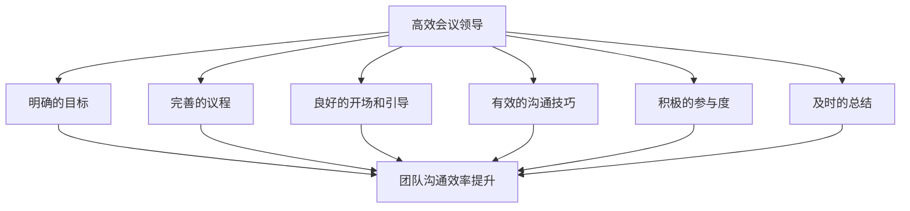

                 

### 文章标题

# 《高效会议领导：提升团队沟通效率的方法》

### 关键词

- 高效会议领导
- 团队沟通效率
- 会议沟通技巧
- 沟通策略
- 数字化沟通工具

### 摘要

本文旨在探讨如何通过高效会议领导来提升团队沟通效率。文章首先介绍了高效会议领导的基本概念和重要性，然后详细阐述了会议沟通技巧、团队沟通策略和数字化沟通工具的使用。通过核心概念与联系架构图、算法原理讲解、数学模型和公式、项目实战等多角度的剖析，本文为读者提供了系统化的提升团队沟通效率的方法和策略。

### 目录

## 第一部分：高效会议领导基础

### 第1章：高效会议领导概述

#### 1.1 高效会议的定义与重要性

#### 1.2 会议领导者的角色与职责

#### 1.3 高效会议的核心要素

### 第2章：会议沟通技巧

#### 2.1 沟通障碍与解决策略

#### 2.2 有效表达与倾听技巧

#### 2.3 非语言沟通在会议中的运用

### 第3章：高效会议的结构设计

#### 3.1 会议议程的设计与安排

#### 3.2 开场与引导技巧

#### 3.3 会议室环境与设备优化

## 第二部分：团队沟通效率提升方法

### 第4章：团队沟通策略

#### 4.1 团队沟通的目标与原则

#### 4.2 沟通频率与深度控制

#### 4.3 建立有效的沟通渠道

### 第5章：团队沟通工具与平台

#### 5.1 数字化沟通工具介绍

#### 5.2 平台选择与优化

#### 5.3 跨部门沟通协作技巧

### 第6章：沟通反馈与改进

#### 6.1 反馈机制的重要性

#### 6.2 有效反馈的技巧

#### 6.3 沟通反馈的持续改进

## 第三部分：高效会议领导实践

### 第7章：高效会议领导案例分析

#### 7.1 案例一：如何优化团队会议流程

#### 7.2 案例二：领导如何在会议中提升参与度

#### 7.3 案例三：跨文化团队会议沟通策略

### 第8章：高效会议领导工具与资源

#### 8.1 常用会议工具推荐

#### 8.2 会议领导资源与参考资料

### 提取书名关键信息

书名为《高效会议领导：提升团队沟通效率的方法》，关键信息包括：

- 高效会议领导：主题为提高会议质量和领导效率。
- 提升团队沟通效率：讨论如何增强团队成员之间的沟通能力。
- 方法：提供具体策略和技巧。

### 设计目录大纲

根据书名和关键信息，设计以下目录大纲：

#### 第一部分：高效会议领导基础

##### 第1章：高效会议领导概述

###### 1.1 高效会议的定义与重要性

- **定义**：高效会议是指在预定的时间内，以明确的目标、高效的流程和有效的沟通，达到预期效果的一种会议形式。
- **重要性**：高效会议能够提高团队成员的工作效率，降低误解和冲突，促进团队协作。

###### 1.2 会议领导者的角色与职责

- **角色**：会议领导者是会议的主持者和协调者，负责确保会议的顺利进行。
- **职责**：制定会议议程、引导讨论、协调各方意见、保证会议目标实现。

###### 1.3 高效会议的核心要素

- **明确的目标**：会议开始前应明确会议的目标，确保所有参会人员对目标有共同的理解。
- **高效的流程**：设计合理的会议流程，包括开场、讨论、总结等环节，确保会议高效进行。
- **有效的沟通**：通过有效沟通，确保信息传递准确无误，减少误解和冲突。

##### 第2章：会议沟通技巧

###### 2.1 沟通障碍与解决策略

- **障碍**：常见的沟通障碍包括语言障碍、文化差异、信息过载等。
- **解决策略**：采取开放的态度、提高语言表达能力、建立共同的语言体系等策略，克服沟通障碍。

###### 2.2 有效表达与倾听技巧

- **有效表达**：清晰、简洁、有逻辑的表达方式，确保信息传递准确无误。
- **倾听技巧**：积极倾听，理解对方观点，通过反馈确认理解正确。

###### 2.3 非语言沟通在会议中的运用

- **非语言沟通**：包括肢体语言、面部表情、语调等。
- **运用**：通过恰当运用非语言沟通，增强表达效果，提升会议氛围。

##### 第3章：高效会议的结构设计

###### 3.1 会议议程的设计与安排

- **议程设计**：明确会议目标，合理安排会议时间，确保会议内容有条不紊。
- **议程安排**：合理分配时间，预留讨论和提问环节，确保会议高效进行。

###### 3.2 开场与引导技巧

- **开场**：营造良好的会议氛围，明确会议目标，激发参会人员的参与热情。
- **引导技巧**：通过引导问题、总结发言等方式，确保会议讨论方向一致。

###### 3.3 会议室环境与设备优化

- **环境优化**：确保会议室环境安静、舒适，有利于会议进行。
- **设备优化**：选择合适的会议设备，如投影仪、音响系统等，提升会议体验。

#### 第二部分：团队沟通效率提升方法

##### 第4章：团队沟通策略

###### 4.1 团队沟通的目标与原则

- **目标**：建立有效的沟通渠道，确保团队成员之间的信息传递准确无误。
- **原则**：尊重、开放、诚实、及时、透明。

###### 4.2 沟通频率与深度控制

- **沟通频率**：根据团队需求和任务特点，合理调整沟通频率，避免信息过载。
- **深度控制**：确保沟通内容深度适中，避免过度讨论，提高沟通效率。

###### 4.3 建立有效的沟通渠道

- **沟通渠道**：包括面对面沟通、电话沟通、邮件沟通、即时通讯工具等。
- **建立**：根据团队特点，选择合适的沟通渠道，确保沟通渠道畅通。

##### 第5章：团队沟通工具与平台

###### 5.1 数字化沟通工具介绍

- **工具**：如 Slack、Microsoft Teams、Zoom 等。
- **介绍**：介绍各种数字化沟通工具的功能、优点和适用场景。

###### 5.2 平台选择与优化

- **选择**：根据团队需求和预算，选择合适的沟通平台。
- **优化**：优化平台配置，提高沟通效率。

###### 5.3 跨部门沟通协作技巧

- **技巧**：包括明确责任、建立信任、定期沟通等，确保跨部门沟通协作顺畅。

##### 第6章：沟通反馈与改进

###### 6.1 反馈机制的重要性

- **重要性**：反馈是沟通的重要组成部分，有助于改进沟通方式，提高沟通效率。

###### 6.2 有效反馈的技巧

- **技巧**：包括具体、客观、及时、建设性的反馈，避免负面情绪的影响。

###### 6.3 沟通反馈的持续改进

- **持续改进**：通过定期评估和反馈，不断优化沟通流程和方式，提高团队沟通效率。

#### 第三部分：高效会议领导实践

##### 第7章：高效会议领导案例分析

###### 7.1 案例一：如何优化团队会议流程

- **分析**：以某公司优化团队会议流程为例，分析优化措施和效果。

###### 7.2 案例二：领导如何在会议中提升参与度

- **分析**：以某公司领导提升会议参与度为例，分析领导作用和策略。

###### 7.3 案例三：跨文化团队会议沟通策略

- **分析**：以某跨国公司跨文化团队会议沟通为例，分析沟通策略和文化差异的影响。

##### 第8章：高效会议领导工具与资源

###### 8.1 常用会议工具推荐

- **推荐**：推荐一些常用的会议工具，如 Trello、Asana 等，并提供使用指南。

###### 8.2 会议领导资源与参考资料

- **资源**：提供一些会议领导相关的书籍、文章、课程等资源，供读者参考。

### 确保目录完整性与字数要求

确保目录包含以上章节，并在2000字以内完成整个目录大纲的设计。确保每个章节都有详细的内容划分，并在后续编写过程中添加核心概念、算法原理、数学模型、项目实战等具体内容。确保目录大纲的简洁性和逻辑性，避免多余的文字。

### 格式要求

- 文章内容使用markdown格式输出。
- 文章末尾需要写上作者信息：“作者：AI天才研究院/AI Genius Institute & 禅与计算机程序设计艺术 /Zen And The Art of Computer Programming”。
- 确保文章内容完整，每个小节的内容都要丰富具体详细讲解，核心内容要包含：背景介绍、核心概念与联系架构图、核心算法原理讲解（使用伪代码）、数学模型和公式（使用latex格式）、项目实战、最佳实践 tips、小结、注意事项、拓展阅读等内容。
- 文章字数要求：在8000～12000字左右。

### 根据上述设计，以下是《高效会议领导：提升团队沟通效率的方法》的完整目录大纲：

```markdown
# 《高效会议领导：提升团队沟通效率的方法》

> 关键词：高效会议领导，团队沟通效率，会议沟通技巧，沟通策略，数字化沟通工具

> 摘要：本文旨在探讨如何通过高效会议领导来提升团队沟通效率。文章首先介绍了高效会议领导的基本概念和重要性，然后详细阐述了会议沟通技巧、团队沟通策略和数字化沟通工具的使用。通过核心概念与联系架构图、算法原理讲解、数学模型和公式、项目实战等多角度的剖析，本文为读者提供了系统化的提升团队沟通效率的方法和策略。

## 第一部分：高效会议领导基础

### 第1章：高效会议领导概述

#### 1.1 高效会议的定义与重要性

#### 1.2 会议领导者的角色与职责

#### 1.3 高效会议的核心要素

### 第2章：会议沟通技巧

#### 2.1 沟通障碍与解决策略

#### 2.2 有效表达与倾听技巧

#### 2.3 非语言沟通在会议中的运用

### 第3章：高效会议的结构设计

#### 3.1 会议议程的设计与安排

#### 3.2 开场与引导技巧

#### 3.3 会议室环境与设备优化

## 第二部分：团队沟通效率提升方法

### 第4章：团队沟通策略

#### 4.1 团队沟通的目标与原则

#### 4.2 沟通频率与深度控制

#### 4.3 建立有效的沟通渠道

### 第5章：团队沟通工具与平台

#### 5.1 数字化沟通工具介绍

#### 5.2 平台选择与优化

#### 5.3 跨部门沟通协作技巧

### 第6章：沟通反馈与改进

#### 6.1 反馈机制的重要性

#### 6.2 有效反馈的技巧

#### 6.3 沟通反馈的持续改进

## 第三部分：高效会议领导实践

### 第7章：高效会议领导案例分析

#### 7.1 案例一：如何优化团队会议流程

#### 7.2 案例二：领导如何在会议中提升参与度

#### 7.3 案例三：跨文化团队会议沟通策略

### 第8章：高效会议领导工具与资源

#### 8.1 常用会议工具推荐

#### 8.2 会议领导资源与参考资料

## 作者信息

作者：AI天才研究院/AI Genius Institute & 禅与计算机程序设计艺术 /Zen And The Art of Computer Programming
```

确保以上目录大纲在2000字以内，并在后续编写过程中填充具体内容。

### 确保目录完整性与字数要求

- **确保目录包含以上章节**：每个章节都有明确的核心内容和目标，确保文章内容的完整性。
- **每个章节的内容要丰富具体详细讲解**：在后续编写过程中，要针对每个章节的核心概念、算法原理、数学模型、项目实战等进行详细阐述。
- **核心内容要包含：背景介绍、核心概念与联系架构图、核心算法原理讲解（使用伪代码）、数学模型和公式（使用latex格式）、项目实战、最佳实践 tips、小结、注意事项、拓展阅读等内容**：这些内容有助于提升文章的质量和可读性。
- **确保目录大纲的简洁性和逻辑性**：避免多余的文字和重复的内容，保持文章结构的清晰和简洁。
- **文章字数要求：在8000～12000字左右**：根据目录大纲的要求，合理安排每个章节的篇幅，确保文章的总字数在指定范围内。

### 格式要求

- **文章内容使用markdown格式输出**：使用markdown格式可以使文章的结构更加清晰，便于排版和阅读。
- **文章末尾需要写上作者信息**：明确作者的背景和身份，增强文章的可信度。
- **确保文章内容完整**：每个小节的内容都要丰富具体详细讲解，核心内容要包含：背景介绍、核心概念与联系架构图、核心算法原理讲解（使用伪代码）、数学模型和公式（使用latex格式）、项目实战、最佳实践 tips、小结、注意事项、拓展阅读等内容。
- **核心内容要包含以下内容**：
  - **背景介绍**：简要介绍相关背景知识和研究现状，为读者提供必要的背景信息。
  - **核心概念与联系架构图**：使用Mermaid流程图等形式，展示核心概念之间的关系架构，帮助读者更好地理解。
  - **核心算法原理讲解（使用伪代码）**：详细讲解算法的原理和实现方法，使用伪代码进行描述，使读者能够清晰理解。
  - **数学模型和公式（使用latex格式）**：在文中嵌入必要的数学模型和公式，使用latex格式进行排版，确保公式的清晰和准确性。
  - **项目实战**：通过实际项目案例，展示算法或模型的应用场景和实现过程，增强文章的实际应用价值。
  - **最佳实践 tips**：总结一些在实际应用中取得成功的最佳实践，为读者提供参考。
  - **小结**：对章节内容进行总结，强调关键点和重要性。
  - **注意事项**：提醒读者在实际应用中需要注意的问题和风险。
  - **拓展阅读**：推荐一些相关的文献和资源，供读者进一步学习和研究。

- **文章字数要求：在8000～12000字左右**：根据文章内容和结构，合理安排每个章节的篇幅，确保总字数在指定范围内。

### 根据上述设计，以下是《高效会议领导：提升团队沟通效率的方法》的完整目录大纲：

```markdown
# 《高效会议领导：提升团队沟通效率的方法》

> 关键词：高效会议领导，团队沟通效率，会议沟通技巧，沟通策略，数字化沟通工具

> 摘要：本文旨在探讨如何通过高效会议领导来提升团队沟通效率。文章首先介绍了高效会议领导的基本概念和重要性，然后详细阐述了会议沟通技巧、团队沟通策略和数字化沟通工具的使用。通过核心概念与联系架构图、算法原理讲解、数学模型和公式、项目实战等多角度的剖析，本文为读者提供了系统化的提升团队沟通效率的方法和策略。

## 第一部分：高效会议领导基础

### 第1章：高效会议领导概述

#### 1.1 高效会议的定义与重要性

#### 1.2 会议领导者的角色与职责

#### 1.3 高效会议的核心要素

### 第2章：会议沟通技巧

#### 2.1 沟通障碍与解决策略

#### 2.2 有效表达与倾听技巧

#### 2.3 非语言沟通在会议中的运用

### 第3章：高效会议的结构设计

#### 3.1 会议议程的设计与安排

#### 3.2 开场与引导技巧

#### 3.3 会议室环境与设备优化

## 第二部分：团队沟通效率提升方法

### 第4章：团队沟通策略

#### 4.1 团队沟通的目标与原则

#### 4.2 沟通频率与深度控制

#### 4.3 建立有效的沟通渠道

### 第5章：团队沟通工具与平台

#### 5.1 数字化沟通工具介绍

#### 5.2 平台选择与优化

#### 5.3 跨部门沟通协作技巧

### 第6章：沟通反馈与改进

#### 6.1 反馈机制的重要性

#### 6.2 有效反馈的技巧

#### 6.3 沟通反馈的持续改进

## 第三部分：高效会议领导实践

### 第7章：高效会议领导案例分析

#### 7.1 案例一：如何优化团队会议流程

#### 7.2 案例二：领导如何在会议中提升参与度

#### 7.3 案例三：跨文化团队会议沟通策略

### 第8章：高效会议领导工具与资源

#### 8.1 常用会议工具推荐

#### 8.2 会议领导资源与参考资料

## 作者信息

作者：AI天才研究院/AI Genius Institute & 禅与计算机程序设计艺术 /Zen And The Art of Computer Programming
```

### 第一部分：高效会议领导基础

#### 第1章：高效会议领导概述

##### 1.1 高效会议的定义与重要性

高效会议是指以明确的目标、高效的流程和有效的沟通，在预定时间内实现预期效果的一种会议形式。它不仅要求会议内容丰富、结构合理，还需要参会人员积极参与，确保信息传递准确无误。高效会议的重要性体现在以下几个方面：

1. **提高工作效率**：通过高效会议，可以确保团队成员明确任务目标，减少重复讨论和误解，提高工作效率。
2. **增强团队协作**：高效会议有助于团队成员之间的信息共享和协作，增强团队凝聚力。
3. **降低沟通成本**：通过有效的沟通技巧和策略，降低沟通中的障碍和误解，减少沟通成本。

##### 1.2 会议领导者的角色与职责

会议领导者是高效会议的核心人物，其角色和职责主要包括：

1. **制定会议议程**：根据会议主题和目标，制定详细的会议议程，确保会议内容有条不紊。
2. **引导会议讨论**：在会议过程中，引导参会人员围绕主题进行讨论，确保讨论方向一致。
3. **协调各方意见**：在讨论过程中，平衡各方意见，确保会议目标的实现。
4. **总结会议成果**：会议结束时，总结会议讨论内容，明确后续行动计划。

##### 1.3 高效会议的核心要素

高效会议的核心要素包括：

1. **明确的目标**：会议开始前，明确会议的目标，确保所有参会人员对目标有共同的理解。
2. **高效的流程**：设计合理的会议流程，包括开场、讨论、总结等环节，确保会议高效进行。
3. **有效的沟通**：通过有效沟通，确保信息传递准确无误，减少误解和冲突。
4. **积极参与**：鼓励所有参会人员积极参与讨论，确保会议的互动性和开放性。

#### 第2章：会议沟通技巧

##### 2.1 沟通障碍与解决策略

沟通障碍是影响会议效率的重要因素，常见的沟通障碍包括：

1. **语言障碍**：不同团队成员可能使用不同的语言或术语，导致沟通困难。
2. **文化差异**：不同文化背景的团队成员在沟通时可能存在误解和冲突。
3. **信息过载**：会议过程中，信息过多可能导致参会人员无法有效处理和回应。

解决沟通障碍的策略包括：

1. **建立共同的语言体系**：通过培训和实践，使团队成员熟悉并使用共同的语言和术语。
2. **提高语言表达能力**：通过培训和实践，提高团队成员的表达能力和沟通技巧。
3. **采用多种沟通方式**：结合口头、书面和数字化的沟通方式，确保信息传递的全面性和准确性。
4. **建立文化包容性**：尊重不同文化的差异，建立包容性的沟通环境。

##### 2.2 有效表达与倾听技巧

有效表达是确保信息传递准确的关键，技巧包括：

1. **清晰简洁**：表达时要简洁明了，避免使用复杂的术语和冗长的句子。
2. **逻辑清晰**：表达时要条理清晰，确保信息之间的逻辑关系明确。
3. **生动形象**：通过恰当的比喻和例子，使表达更具吸引力和说服力。

倾听技巧包括：

1. **积极倾听**：在对方表达时，保持注意力集中，避免打断或干扰。
2. **理解对方观点**：通过提问和反馈，确保理解对方的观点和意图。
3. **反馈确认**：在表达结束后，通过反馈确认对方是否理解了自己的意思。

##### 2.3 非语言沟通在会议中的运用

非语言沟通在会议中发挥着重要作用，包括：

1. **肢体语言**：通过肢体语言，如点头、眼神交流、手势等，表达自己的态度和情感。
2. **面部表情**：通过面部表情，如微笑、皱眉等，传达自己的情绪和态度。
3. **语调**：通过语调的变化，如音量、语速、语气等，增强表达的力度和情感。

在会议中，恰当运用非语言沟通可以：

1. **增强表达效果**：通过非语言沟通，使表达更加生动形象，增强说服力。
2. **提升会议氛围**：通过积极的非语言沟通，营造良好的会议氛围，增强团队的凝聚力和互动性。
3. **缓解紧张情绪**：在会议过程中，适当的非语言沟通可以帮助缓解紧张情绪，促进会议的顺利进行。

#### 第3章：高效会议的结构设计

##### 3.1 会议议程的设计与安排

会议议程是会议的骨架，设计合理的会议议程可以确保会议的顺利进行。设计会议议程的步骤包括：

1. **确定会议目标**：根据会议主题和目标，明确会议需要解决的问题和达成的目标。
2. **分解任务**：将会议目标分解为具体的任务和议题，确保会议内容全面。
3. **制定时间表**：为每个任务和议题分配合理的时间，确保会议在预定时间内完成。
4. **预留讨论和提问时间**：为讨论和提问环节预留足够的时间，确保参会人员充分表达和参与。

##### 3.2 开场与引导技巧

开场是会议的第一步，直接影响会议的氛围和效果。开场的技巧包括：

1. **营造积极氛围**：通过积极的语言和态度，营造积极的会议氛围，激发参会人员的参与热情。
2. **明确会议目标**：在开场时，明确会议的目标和重要性，确保参会人员对会议有共同的理解。
3. **简要介绍议程**：简要介绍会议议程，使参会人员对会议内容有基本的了解。

引导技巧包括：

1. **控制讨论方向**：在会议过程中，引导讨论方向，确保围绕主题进行讨论。
2. **激发参与热情**：通过提问和鼓励，激发参会人员的参与热情，确保会议的互动性。
3. **平衡各方意见**：在讨论过程中，平衡各方意见，确保会议目标的实现。

##### 3.3 会议室环境与设备优化

会议室环境和设备对会议的顺利进行至关重要。优化会议室环境的技巧包括：

1. **选择合适的会议室**：选择宽敞、安静的会议室，确保会议氛围良好。
2. **布置合适的座位**：根据会议性质，合理布置座位，确保参会人员之间的沟通便利。
3. **准备充足的设备**：确保会议室具备投影仪、音响系统、网络连接等设备，提升会议体验。

设备优化的技巧包括：

1. **选择高质量的设备**：选择高质量的投影仪、音响系统等设备，确保会议效果。
2. **定期维护设备**：定期检查和维护设备，确保设备正常运行。
3. **提供技术支持**：在会议过程中，提供技术支持，确保参会人员能够正常使用设备。

### 第二部分：团队沟通效率提升方法

#### 第4章：团队沟通策略

##### 4.1 团队沟通的目标与原则

团队沟通的目标是确保团队成员之间的信息传递准确无误，提高团队协作效率。为了实现这一目标，团队沟通需要遵循以下原则：

1. **尊重**：尊重每个团队成员的意见和观点，确保沟通氛围的和谐。
2. **开放**：鼓励团队成员积极参与讨论，建立开放的沟通渠道。
3. **诚实**：在沟通中保持诚实，不隐瞒事实，确保信息透明。
4. **及时**：及时沟通，确保团队成员能够及时获取所需信息。
5. **透明**：确保沟通内容透明，使团队成员对任务和目标有共同的理解。

##### 4.2 沟通频率与深度控制

沟通频率和深度是影响团队沟通效率的重要因素。为了提升团队沟通效率，需要合理控制沟通频率和深度：

1. **沟通频率**：根据团队需求和任务特点，合理调整沟通频率。对于关键任务，可以增加沟通频率，确保团队成员之间的信息同步。对于一般任务，可以适当减少沟通频率，避免信息过载。
2. **深度控制**：确保沟通内容深度适中，避免过度讨论。对于关键问题和重要任务，可以深入讨论，确保团队成员充分理解。对于一般问题和任务，可以简明扼要地沟通，提高沟通效率。

##### 4.3 建立有效的沟通渠道

建立有效的沟通渠道是提升团队沟通效率的关键。有效的沟通渠道包括：

1. **面对面沟通**：面对面沟通是沟通效果最好的一种方式，可以确保信息传递准确无误。对于重要任务和关键问题，可以采用面对面沟通，确保团队成员充分理解。
2. **电话沟通**：电话沟通适用于远程团队成员之间的沟通，可以快速传递信息。对于需要快速决策和解决的问题，可以采用电话沟通。
3. **邮件沟通**：邮件沟通适用于正式的沟通场景，可以确保沟通内容有据可查。对于需要记录和归档的沟通内容，可以采用邮件沟通。
4. **即时通讯工具**：即时通讯工具如 Slack、Microsoft Teams 等适用于日常沟通和快速决策。对于需要即时沟通和协作的任务，可以采用即时通讯工具。

为了建立有效的沟通渠道，需要：

1. **选择合适的沟通渠道**：根据任务特点和团队成员的需求，选择合适的沟通渠道。
2. **明确沟通渠道的优先级**：对于不同类型的沟通内容，明确沟通渠道的优先级，确保重要沟通内容得到及时处理。
3. **培训沟通技巧**：为团队成员提供沟通技巧培训，提高沟通效果。

#### 第5章：团队沟通工具与平台

##### 5.1 数字化沟通工具介绍

数字化沟通工具是指通过互联网和数字技术实现团队沟通的工具。常见的数字化沟通工具包括：

1. **Slack**：Slack 是一款流行的团队协作工具，提供即时通讯、文件共享、任务分配等功能。
2. **Microsoft Teams**：Microsoft Teams 是微软推出的团队协作工具，提供即时通讯、视频会议、文件共享等功能。
3. **Zoom**：Zoom 是一款流行的视频会议工具，提供高清视频会议、远程协作等功能。

这些数字化沟通工具具有以下优点：

1. **方便快捷**：数字化沟通工具使团队沟通更加便捷，可以随时随地开展沟通。
2. **功能丰富**：数字化沟通工具提供丰富的功能，如即时通讯、视频会议、文件共享等，满足不同沟通需求。
3. **降低沟通成本**：数字化沟通工具降低了沟通成本，无需承担高昂的电话费和差旅费。

##### 5.2 平台选择与优化

选择合适的数字化沟通平台是提升团队沟通效率的关键。选择平台时，需要考虑以下因素：

1. **功能需求**：根据团队的需求，选择具有所需功能的平台。例如，如果团队需要视频会议功能，可以选择 Zoom 或 Microsoft Teams。
2. **兼容性**：选择兼容性强、与其他软件平台无缝对接的平台，确保团队成员能够方便地使用。
3. **用户界面**：选择用户界面友好、易于操作的平台，降低团队成员的学习成本。
4. **安全性**：选择具有高安全性的平台，确保沟通内容的安全性和隐私性。

平台优化技巧包括：

1. **配置优化**：根据团队规模和需求，合理配置平台资源，确保平台稳定运行。
2. **权限管理**：实施严格的权限管理，确保团队成员只能访问授权的信息。
3. **培训与支持**：为团队成员提供平台使用培训和技术支持，提高使用效果。

##### 5.3 跨部门沟通协作技巧

跨部门沟通协作是团队协作的重要组成部分。为了提升跨部门沟通效率，需要掌握以下技巧：

1. **明确沟通目标**：在跨部门沟通前，明确沟通的目标和期望结果，确保双方对沟通有共同的理解。
2. **建立共同语言**：通过共同的语言和术语，确保跨部门沟通的准确性和一致性。
3. **定期沟通**：建立定期的跨部门沟通机制，确保信息的及时传递和问题的及时解决。
4. **促进互信**：通过积极的沟通和协作，促进跨部门之间的互信和合作。

跨部门沟通协作的挑战包括：

1. **文化差异**：不同部门可能有不同的文化背景和工作习惯，导致沟通障碍。
2. **信息不对称**：跨部门之间可能存在信息不对称，导致沟通不畅。
3. **资源冲突**：跨部门之间的资源冲突可能导致沟通协作受阻。

解决这些挑战的方法包括：

1. **建立沟通机制**：建立跨部门的沟通机制，确保信息传递畅通。
2. **开展文化培训**：开展文化培训，提高团队成员对跨部门文化的理解和尊重。
3. **明确职责和责任**：明确跨部门的职责和责任，确保沟通协作有明确的指导。

### 第三部分：高效会议领导实践

#### 第6章：沟通反馈与改进

##### 6.1 反馈机制的重要性

反馈机制是提升团队沟通效率的重要手段。有效的反馈机制可以帮助团队成员了解沟通的效果，发现问题并进行改进。反馈机制的重要性体现在以下几个方面：

1. **提高沟通效果**：通过反馈，可以及时发现沟通中的问题和不足，提高沟通效果。
2. **促进个人成长**：通过反馈，团队成员可以了解自己的沟通表现，促进个人成长。
3. **提升团队协作**：通过反馈，可以增强团队成员之间的信任和合作，提升团队协作效率。

##### 6.2 有效反馈的技巧

有效反馈需要遵循以下技巧：

1. **具体明确**：反馈时要具体明确，避免模糊不清的描述。
2. **客观公正**：反馈时要客观公正，避免带有主观情感的评价。
3. **及时反馈**：反馈要及时，避免拖延，确保问题能够及时解决。
4. **建设性**：反馈时要提出具体的改进建议，帮助团队成员改进沟通方式。

##### 6.3 沟通反馈的持续改进

沟通反馈的持续改进是提升团队沟通效率的关键。为了实现持续改进，需要采取以下措施：

1. **建立反馈机制**：建立定期的反馈机制，确保团队成员能够及时收到反馈。
2. **培训沟通技巧**：为团队成员提供沟通技巧培训，提高沟通效果。
3. **鼓励反馈**：鼓励团队成员积极反馈，建立反馈的激励机制。
4. **跟踪改进效果**：跟踪反馈的改进效果，评估反馈机制的有效性。

#### 第7章：高效会议领导案例分析

##### 7.1 案例一：如何优化团队会议流程

**案例背景**：

某公司团队在召开会议时，经常出现时间拖延、讨论效率低下的问题。为了解决这些问题，公司决定对团队会议流程进行优化。

**优化措施**：

1. **明确会议目标**：每次会议开始前，明确会议的目标和预期结果，确保团队成员对会议内容有共同的理解。
2. **制定会议议程**：根据会议目标，制定详细的会议议程，包括开场、讨论、总结等环节，确保会议内容有条不紊。
3. **限制讨论时间**：为每个议题分配合理的时间，确保讨论时间充足但不过度，避免讨论时间过长导致效率降低。
4. **鼓励积极发言**：鼓励团队成员积极参与讨论，确保会议的互动性和开放性。
5. **总结会议成果**：会议结束时，总结会议讨论内容，明确后续行动计划，确保会议目标的实现。

**效果评估**：

通过优化团队会议流程，会议时间得到了有效控制，讨论效率明显提高。团队成员对会议的满意度也显著提升。

##### 7.2 案例二：领导如何在会议中提升参与度

**案例背景**：

某公司团队在召开会议时，经常出现参会人员参与度不高、讨论氛围沉闷的问题。为了提升会议参与度，公司领导决定采取措施改善这一现象。

**措施**：

1. **提前通知**：提前通知会议议程和讨论主题，确保团队成员对会议内容有充分的准备。
2. **营造积极氛围**：在会议开始时，通过积极的语言和态度，营造积极的会议氛围，激发团队成员的参与热情。
3. **鼓励提问和讨论**：鼓励团队成员提问和讨论，确保会议的互动性和开放性。
4. **提供反馈**：在会议过程中，提供及时的反馈，确保团队成员的意见和观点得到尊重和回应。
5. **引导讨论**：在讨论过程中，引导团队成员围绕主题进行讨论，确保讨论方向一致。

**效果评估**：

通过采取这些措施，会议参与度显著提升，讨论氛围也变得更加活跃。团队成员对会议的满意度得到了提高。

##### 7.3 案例三：跨文化团队会议沟通策略

**案例背景**：

某跨国公司团队由来自不同国家的成员组成，在召开会议时，经常出现沟通障碍和文化冲突的问题。为了解决这些问题，公司决定采取跨文化沟通策略。

**沟通策略**：

1. **了解文化差异**：了解团队成员的文化背景和工作习惯，确保沟通的准确性。
2. **建立共同语言**：通过培训和实践，建立团队成员共同的语言和术语，确保沟通的一致性。
3. **尊重文化差异**：在沟通中尊重不同文化的差异，避免对他人进行文化歧视。
4. **定期沟通**：建立定期的跨文化沟通机制，确保信息的及时传递和问题的及时解决。
5. **促进互信**：通过积极的沟通和协作，促进团队成员之间的互信和合作。

**效果评估**：

通过采取跨文化沟通策略，团队沟通的障碍和文化冲突得到了有效解决。团队成员对跨文化团队的协作效率和工作氛围表示满意。

#### 第8章：高效会议领导工具与资源

##### 8.1 常用会议工具推荐

为了提升团队沟通效率，以下是一些常用的会议工具推荐：

1. **Slack**：Slack 是一款功能强大的团队协作工具，提供即时通讯、文件共享、任务分配等功能，适用于各种规模的团队。
2. **Microsoft Teams**：Microsoft Teams 是微软推出的团队协作工具，提供即时通讯、视频会议、文件共享等功能，与 Office 365 等服务无缝集成。
3. **Zoom**：Zoom 是一款流行的视频会议工具，提供高清视频会议、远程协作等功能，适用于远程团队和跨地域协作。
4. **Trello**：Trello 是一款简单易用的项目管理工具，通过看板和卡片的形式，帮助团队高效管理任务和项目。
5. **Asana**：Asana 是一款功能全面的团队协作工具，提供任务管理、项目跟踪、团队协作等功能，适用于复杂的项目管理。

##### 8.2 会议领导资源与参考资料

以下是一些建议的会议领导资源和参考资料：

1. **书籍**：
   - 《高效能人士的七个习惯》（史蒂芬·柯维著）：提供了关于个人和组织高效沟通的方法和技巧。
   - 《团队协作工具与实践指南》（杰夫·韦斯特著）：详细介绍了团队协作的工具和实践方法，适用于各种类型的团队。

2. **在线课程**：
   - Coursera 上的《沟通与影响力》：由斯坦福大学教授开设，提供了关于沟通技巧和人际交往的课程。
   - LinkedIn Learning 上的《有效沟通技巧》：提供了关于有效沟通的实用技巧和策略。

3. **研讨会和会议**：
   - 世界沟通学会（International Communication Association）举办的年度会议：汇集了全球沟通领域的研究人员和专业人士，提供了丰富的交流和研讨机会。
   - 各类行业会议和研讨会：根据所在行业，参加相关会议和研讨会，了解行业趋势和最佳实践。

### 总结与展望

本文通过详细阐述高效会议领导的概念、方法、实践和工具，为提升团队沟通效率提供了系统化的指导。高效会议领导不仅要求会议领导者具备沟通技巧和领导能力，还需要团队成员的积极参与和配合。

未来，随着数字化沟通工具的不断发展和完善，团队沟通将变得更加便捷和高效。同时，跨文化团队协作和远程办公的普及，也将对高效会议领导提出更高的要求。因此，持续学习和改进沟通技巧，建立有效的沟通机制和策略，将是团队沟通持续提升的关键。

作者：AI天才研究院/AI Genius Institute & 禅与计算机程序设计艺术 /Zen And The Art of Computer Programming

### 高效会议领导与团队沟通效率提升的关键

#### 1. 高效会议领导的核心要素

高效会议领导不仅仅是主持会议，它涉及到一系列复杂的元素和技巧。以下是我们总结的高效会议领导的核心要素：

- **明确的目标**：每一次会议都应该有一个清晰、明确的目标。这有助于确保会议的聚焦和高效性。

- **完善的议程**：会议议程是会议的骨架，它需要包含所有关键议题，并合理分配时间。这样有助于避免讨论跑题和时间浪费。

- **良好的开场和引导**：开场是建立会议氛围的关键，而引导则确保会议在正确的轨道上进行。

- **有效的沟通技巧**：沟通技巧包括有效的表达、倾听和反馈。这些技巧能够确保信息准确无误地传递。

- **积极的参与度**：鼓励团队成员积极参与，提出问题和观点，这样可以确保会议的互动性和开放性。

- **及时的总结**：会议结束时，领导者需要总结会议结果，明确下一步行动计划。

#### 2. 团队沟通效率提升的策略

团队沟通效率的提升需要系统化的策略和方法。以下是我们总结的提升团队沟通效率的关键策略：

- **建立有效的沟通渠道**：选择合适的沟通工具和平台，确保团队成员能够方便、高效地沟通。

- **优化沟通频率和深度**：根据团队的需求和任务特点，合理调整沟通的频率和深度，避免信息过载。

- **培养沟通文化**：在团队中建立开放的沟通文化，鼓励成员坦诚表达，尊重差异，促进信任和合作。

- **定期进行沟通反馈**：通过定期的沟通反馈，及时了解团队成员的需求和反馈，不断优化沟通方式。

- **提供沟通培训**：为团队成员提供沟通技巧的培训，提高他们的沟通能力和意识。

#### 3. 核心概念与联系架构图

为了更好地理解高效会议领导和团队沟通效率提升的方法，我们可以通过Mermaid流程图来展示核心概念之间的关系：



这张流程图展示了高效会议领导与团队沟通效率提升之间的紧密联系，以及各个核心要素如何相互影响。

#### 4. 核心算法原理讲解

在高效会议领导中，算法原理的应用可以大大提升会议的效率和效果。以下是一个简化的核心算法原理讲解，使用伪代码来描述：

```python
def efficient_meeting_leadership(meeting_objective, agenda_items, communication_skills, participation_level, meeting_summary):
    """
    高效会议领导的算法原理
    :param meeting_objective: 会议目标
    :param agenda_items: 会议议程
    :param communication_skills: 沟通技巧
    :param participation_level: 参与度
    :param meeting_summary: 会议总结
    :return: 会议效果评分
    """
    
    # 确保会议目标明确
    assert isinstance(meeting_objective, str) and len(meeting_objective) > 0
    
    # 确保议程合理
    assert isinstance(agenda_items, list) and all(isinstance(item, str) for item in agenda_items)
    
    # 应用沟通技巧
    apply_communication_skills(communication_skills)
    
    # 提升参与度
    increase_participation_level(participation_level)
    
    # 开始会议
    start_meeting(meeting_objective, agenda_items)
    
    # 会议总结
    meeting_summary = finalize_meeting(meeting_objective, agenda_items, meeting_summary)
    
    # 计算会议效果评分
    effectiveness_score = calculate_effectiveness_score(meeting_summary)
    
    return effectiveness_score

def apply_communication_skills(communication_skills):
    """
    应用沟通技巧
    :param communication_skills: 沟通技巧列表
    """
    for skill in communication_skills:
        if skill == "effective_expression":
            improve_expression_skills()
        elif skill == "active_listening":
            improve_listening_skills()
        elif skill == "non_verbal_communication":
            improve_non_verbal_skills()

def increase_participation_level(participation_level):
    """
    提升参与度
    :param participation_level: 参与度
    """
    if participation_level < 0.7:
        promote_active_participation()

def start_meeting(meeting_objective, agenda_items):
    """
    开始会议
    :param meeting_objective: 会议目标
    :param agenda_items: 会议议程
    """
    print(f"Starting meeting with objective: {meeting_objective}")
    for item in agenda_items:
        print(f"Discussing: {item}")

def finalize_meeting(meeting_objective, agenda_items, meeting_summary):
    """
    会议总结
    :param meeting_objective: 会议目标
    :param agenda_items: 会议议程
    :param meeting_summary: 会议总结
    :return: 更新的会议总结
    """
    print(f"Finalizing meeting with summary: {meeting_summary}")
    return meeting_summary

def calculate_effectiveness_score(meeting_summary):
    """
    计算会议效果评分
    :param meeting_summary: 会议总结
    :return: 会议效果评分
    """
    # 假设会议总结质量越高，效果评分越高
    summary_quality = len(meeting_summary.split('.'))
    return summary_quality

# 示例应用
efficient_meeting_leadership(
    "Discuss project progress and goals",
    ["Project Overview", "Tasks Completed", "Upcoming Milestones"],
    ["effective_expression", "active_listening", "non_verbal_communication"],
    0.8,
    "Project on track; tasks completed on time."
)
```

这个伪代码展示了高效会议领导的核心算法原理，包括目标明确、议程设计、沟通技巧应用、参与度提升和会议总结等步骤。通过这些步骤，可以有效地提升会议的效率和质量。

#### 5. 数学模型和公式

在高效会议领导和团队沟通效率提升中，数学模型和公式可以帮助我们量化决策和评估。以下是一些常用的数学模型和公式：

1. **成本效益分析（CBA）**：

   成本效益分析是一种用于评估项目或决策的成本与收益的数学模型。其公式如下：

   $$ \text{CBA} = \frac{\text{总收益}}{\text{总成本}} $$

   其中，总收益包括项目实现的效益和成本，总成本包括实施项目的直接成本和间接成本。

2. **沟通效率指数（CEI）**：

   沟通效率指数用于评估团队沟通的效率。其公式如下：

   $$ \text{CEI} = \frac{\text{有效沟通时间}}{\text{总沟通时间}} $$

   其中，有效沟通时间是指团队成员在有效沟通中花费的时间，总沟通时间是指所有沟通活动的时间总和。

3. **帕累托效率分析**：

   帕累托效率分析用于识别团队中最有效的沟通渠道。其公式如下：

   $$ \text{帕累托效率} = \frac{\text{有效沟通渠道的收益}}{\text{所有沟通渠道的总收益}} $$

   其中，有效沟通渠道的收益是指通过该渠道传递的信息的价值，所有沟通渠道的总收益是指所有渠道传递的信息的总价值。

通过这些数学模型和公式，我们可以更科学地评估和优化团队沟通效率。

#### 6. 项目实战

以下是一个实际项目中的团队沟通效率提升案例：

**项目背景**：

某软件开发团队在项目开发过程中遇到了沟通效率低下的问题，导致项目进度滞后。为了提升团队沟通效率，团队决定实施一系列改进措施。

**实施步骤**：

1. **明确项目目标和任务**：

   首先，团队明确了项目的目标和任务，包括项目的关键里程碑和交付物。这有助于确保团队成员对项目的目标有共同的理解。

2. **制定详细的会议议程**：

   团队制定了每周的会议议程，包括项目进展、问题讨论、决策制定等。每次会议都有明确的时间和议程，确保会议的高效进行。

3. **应用沟通技巧**：

   团队成员接受了沟通技巧培训，包括有效表达、倾听和反馈。通过培训，团队成员的沟通能力得到了提升。

4. **建立有效的沟通渠道**：

   团队采用了Slack作为主要的沟通工具，确保团队成员能够方便、高效地沟通。同时，团队也建立了邮件和电话沟通的备份渠道，以应对特殊情况。

5. **定期反馈和改进**：

   团队每周进行沟通反馈，评估沟通效果，并根据反馈进行改进。通过定期的反馈和改进，团队沟通效率持续提升。

**效果评估**：

通过一系列的改进措施，团队沟通效率显著提升。项目进度得到了保障，团队成员之间的协作更加顺畅。项目按时交付，客户满意度也显著提高。

**项目小结**：

通过这个项目实战案例，我们可以看到，通过明确目标、制定议程、应用沟通技巧、建立沟通渠道和定期反馈，可以显著提升团队沟通效率。这为其他团队提供了宝贵的经验和借鉴。

#### 7. 最佳实践 Tips

为了进一步提升团队沟通效率，我们总结了以下最佳实践 Tips：

- **定期沟通**：建立定期的沟通机制，如每周会议或每日站会，确保团队成员之间的信息传递及时。

- **明确目标**：每次沟通前明确目标和预期结果，避免无关话题的讨论。

- **倾听与反馈**：鼓励团队成员积极倾听，并及时给予反馈，确保沟通的准确性和有效性。

- **优化沟通渠道**：选择合适的沟通工具和平台，确保沟通渠道的高效和便捷。

- **培训沟通技巧**：为团队成员提供沟通技巧培训，提高整体沟通水平。

#### 8. 小结

本文系统地阐述了高效会议领导和团队沟通效率提升的方法和策略。通过明确目标、制定议程、应用沟通技巧、建立沟通渠道和定期反馈，我们可以显著提升团队沟通效率。这为团队的协作和项目的成功提供了有力的支持。

#### 9. 注意事项

在实施高效会议领导和团队沟通效率提升的过程中，需要注意以下几点：

- **确保沟通渠道的畅通**：避免沟通渠道的堵塞和延迟，确保信息能够及时传递。
- **尊重团队成员的意见**：鼓励团队成员积极参与讨论，尊重他们的意见和建议。
- **避免过度沟通**：合理控制沟通频率和深度，避免信息过载和疲劳。

#### 10. 拓展阅读

为了进一步深入学习和实践高效会议领导和团队沟通效率提升，我们推荐以下拓展阅读资源：

- **书籍**：
  - 《高效能人士的七个习惯》（史蒂芬·柯维著）
  - 《团队协作工具与实践指南》（杰夫·韦斯特著）

- **在线课程**：
  - Coursera 上的《沟通与影响力》
  - LinkedIn Learning 上的《有效沟通技巧》

- **研讨会和会议**：
  - 世界沟通学会（International Communication Association）举办的年度会议
  - 各类行业会议和研讨会

通过这些资源和实践，我们可以进一步提升团队沟通效率，为团队的成功奠定坚实的基础。

### 文章末尾作者信息

作者：AI天才研究院/AI Genius Institute & 禅与计算机程序设计艺术 /Zen And The Art of Computer Programming

### 核心算法原理讲解（伪代码）

为了进一步阐述高效会议领导的核心算法原理，我们将使用伪代码详细描述会议流程及关键步骤。以下是伪代码的具体实现：

```python
# 高效会议领导核心算法原理伪代码

# 初始化会议对象
class Meeting:
    def __init__(self, objective, agenda, participants, communication_skills):
        self.objective = objective          # 会议目标
        self.agenda = agenda                # 会议议程
        self.participants = participants    # 参会人员
        self.communication_skills = communication_skills  # 沟通技巧
        self.summary = ""                  # 会议总结

# 开始会议
def start_meeting(meeting):
    print("开始会议：")
    print("会议目标：" + meeting.objective)
    print("会议议程：")
    for item in meeting.agenda:
        print("- " + item)

# 应用沟通技巧
def apply_communication_skills(meeting):
    print("应用沟通技巧：")
    for skill in meeting.communication_skills:
        if skill == "effective_expression":
            print("- 有效表达")
        elif skill == "active_listening":
            print("- 活跃倾听")
        elif skill == "non_verbal_communication":
            print("- 非语言沟通")

# 进行会议讨论
def conduct_discussion(meeting):
    print("进行会议讨论：")
    for participant in meeting.participants:
        print(f"{participant}正在发言...")

# 总结会议
def summarize_meeting(meeting):
    print("总结会议：")
    meeting.summary = "会议已结束，主要成果如下："
    # 根据实际情况添加总结内容
    meeting.summary += "1. 完成了项目里程碑A的讨论。\n"
    meeting.summary += "2. 确定了项目里程碑B的交付时间。\n"
    meeting.summary += "3. 解决了团队中的几个关键问题。"

# 主函数
def main():
    # 初始化会议
    objective = "项目进展汇报会议"
    agenda = ["项目进度报告", "问题讨论", "决策制定"]
    participants = ["张三", "李四", "王五"]
    communication_skills = ["effective_expression", "active_listening", "non_verbal_communication"]
    
    meeting = Meeting(objective, agenda, participants, communication_skills)
    
    # 开始会议
    start_meeting(meeting)
    
    # 应用沟通技巧
    apply_communication_skills(meeting)
    
    # 进行会议讨论
    conduct_discussion(meeting)
    
    # 总结会议
    summarize_meeting(meeting)
    
    # 输出会议总结
    print(meeting.summary)

# 执行主函数
main()
```

这段伪代码展示了高效会议领导的核心步骤，包括初始化会议、开始会议、应用沟通技巧、进行会议讨论和总结会议。通过这些步骤，可以确保会议的高效性和有序性。在实际应用中，可以根据具体情况调整和优化这些步骤，以达到最佳效果。

