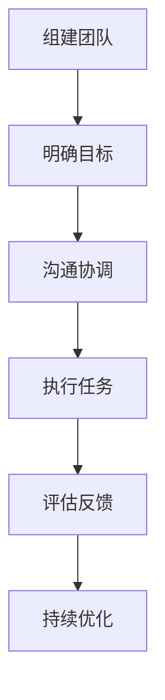
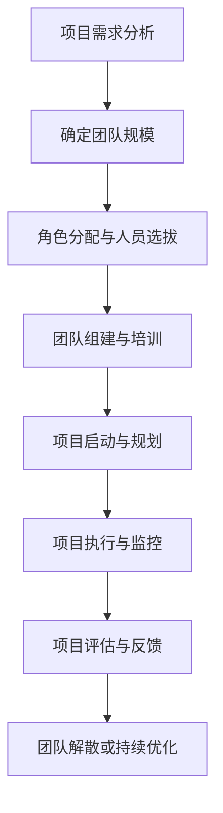
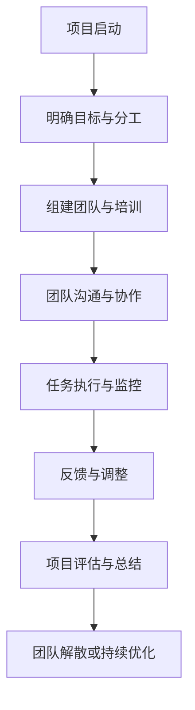

                 

# 高效协作团队打造：从理论到实践

## 关键词

- 高效协作团队
- 团队协作理论
- 实践策略
- 团队组织结构
- 团队沟通与协作工具
- 案例分析
- 实战演练

## 摘要

本文旨在探讨高效协作团队的打造过程，从理论到实践全面解析团队协作的关键要素。文章首先介绍了高效协作团队的定义与特点，以及团队协作的基本原则、模式与类型。接着，文章深入分析了团队协作的理论基础，包括团队动力学、成长阶段理论和认知失调理论。随后，文章从实践角度出发，探讨了团队组织结构设计、团队沟通与协作工具、团队领导力与影响力等方面的策略。最后，通过成功协作团队案例分析，总结常见协作问题与挑战及解决方案，并提供实战演练指导，助力读者打造高效协作团队。

## 1. 整体构思

### 封面与前言

《高效协作团队打造：从理论到实践》是一本面向企业管理者、团队领导者和IT行业从业者的专业书籍。本书旨在帮助读者理解高效协作团队的重要性，掌握团队协作的理论基础和实践策略，从而提升团队整体绩效和项目成功几率。

#### 书名：《高效协作团队打造：从理论到实践》
#### 作者：AI天才研究院/AI Genius Institute & 禅与计算机程序设计艺术 /Zen And The Art of Computer Programming

在前言部分，本书将简要介绍写作目的、目标读者、书籍结构等内容，使读者对本书有一个初步的了解。

### 第一部分：理论基础

#### 第1章：高效协作团队概述

本章将介绍高效协作团队的定义、特点，以及团队协作的基本原则、模式与类型。同时，通过Mermaid流程图，展示团队协作的整个流程。

1. **高效协作团队的定义与特点**
   - 高效协作团队的定义
   - 高效协作团队的特点

2. **团队协作的基本原则**
   - 真诚与信任
   - 明确的目标与责任
   - 有效沟通
   - 团队合作精神

3. **团队协作的模式与类型**
   - 功能型团队
   - 项目型团队
   - 跨部门团队

4. **Mermaid流程图：团队协作流程图**
   - 描述团队协作的整个过程，包括组建团队、明确目标、沟通协调、执行任务、评估反馈等环节。

#### 第2章：高效协作团队的理论基础

本章将深入探讨高效协作团队的理论基础，包括团队动力学、成长阶段理论和认知失调理论。

1. **团队动力学理论**
   - 团队动力学的基本概念
   - 团队动力学的模型
   - 团队动力学的应用

2. **成长阶段理论**
   - 成长阶段的定义与分类
   - 成长阶段的特点与任务
   - 成长阶段的策略与方法

3. **认知失调理论**
   - 认知失调的定义与类型
   - 认知失调的影响与应对策略
   - 认知失调的预防与调整

4. **伪代码：团队协作问题求解算法**
   - 描述一种基于团队动力学、成长阶段理论和认知失调理论的团队协作问题求解算法。

### 第二部分：实践策略

#### 第3章：团队组织结构设计

本章将探讨团队组织结构设计的策略，包括团队组织结构类型与选择、团队规模与角色分配。

1. **团队组织结构类型与选择**
   - 传统组织结构与团队协作的关系
   - 团队组织结构的类型与选择

2. **团队规模与角色分配**
   - 团队规模的影响因素
   - 团队角色的定义与分配

3. **Mermaid流程图：团队组织结构设计流程**
   - 描述团队组织结构设计的整个过程，包括团队规模评估、角色分配、结构调整等环节。

#### 第4章：团队沟通与协作工具

本章将介绍团队沟通与协作工具的选择与使用，以及团队沟通与协作技巧。

1. **内部沟通渠道选择**
   - 沟通渠道的类型与选择
   - 沟通渠道的优缺点分析

2. **协作工具介绍与使用**
   - 协作工具的类型与特点
   - 协作工具的使用方法与技巧

3. **团队沟通与协作技巧**
   - 沟通技巧：如何有效沟通
   - 协作技巧：如何高效协作

4. **Mermaid流程图：团队沟通与协作流程**
   - 描述团队沟

## 1.1 高效协作团队概述

### 1.1.1 高效协作团队的定义与特点

高效协作团队是指在明确的目标导向下，通过团队成员之间的紧密合作，充分发挥各自的优势，实现团队整体绩效最大化的团队形式。与传统团队相比，高效协作团队具有以下特点：

1. **共同目标**：高效协作团队的成员具有共同的目标和愿景，这有助于团队成员在行动上保持一致，形成强大的凝聚力。

2. **相互信任**：团队成员之间建立信任关系，能够降低沟通成本，提高决策效率，使团队成员更加专注于共同目标。

3. **能力互补**：团队成员具备各自独特的技能和专业知识，能够相互补充，形成协同效应，提高团队整体战斗力。

4. **开放沟通**：高效协作团队鼓励成员之间的开放沟通，团队成员能够自由地分享想法、意见和建议，为团队提供更多的创新思路。

5. **积极反馈**：高效协作团队注重成员之间的积极反馈，通过及时反馈和调整，不断优化团队的工作流程和策略。

6. **灵活适应**：高效协作团队能够迅速适应外部环境的变化，灵活调整团队目标和策略，以应对不断变化的市场需求。

### 1.1.2 团队协作的基本原则

高效协作团队的打造离不开一系列基本原则的指导。以下列出团队协作的几个基本原则：

1. **真诚与信任**：团队成员之间应保持真诚，建立信任关系。这有助于减少沟通障碍，提高团队协作效率。

2. **明确的目标与责任**：团队应设定明确的目标，并将责任分配到每个成员。这有助于确保团队成员在行动上保持一致，提高团队执行力。

3. **有效沟通**：团队成员应保持有效的沟通，确保信息畅通无阻。这有助于团队成员更好地理解团队目标和任务，提高协作效率。

4. **团队合作精神**：团队成员应具备团队合作精神，愿意为团队整体利益付出努力。这有助于形成强大的团队凝聚力，提高团队整体绩效。

### 1.1.3 团队协作的模式与类型

团队协作的模式和类型对团队的整体效能具有重要影响。以下介绍几种常见的团队协作模式与类型：

1. **功能型团队**：功能型团队按照职能分工进行组织，如研发团队、市场团队等。这种类型的团队有利于专业技能的发挥，但可能导致部门壁垒和沟通障碍。

2. **项目型团队**：项目型团队是针对特定项目进行组建的，团队成员来自不同职能部门，共同完成项目任务。这种类型的团队有利于跨部门协作，但项目结束后可能解散，影响团队稳定。

3. **跨部门团队**：跨部门团队由不同职能部门的人员组成，旨在解决跨部门合作中的问题。这种类型的团队有利于整合资源，提高团队整体绩效，但可能面临部门利益冲突。

### 1.1.4 Mermaid流程图：团队协作流程图

为了更好地理解团队协作的整个过程，我们可以通过Mermaid流程图来展示团队协作的流程：



上述流程图展示了团队协作的整个流程，包括组建团队、明确目标、沟通协调、执行任务、评估反馈和持续优化等环节。通过这些环节的紧密衔接，团队能够实现高效协作，提高整体绩效。

### 1.2 高效协作团队的理论基础

#### 1.2.1 团队动力学理论

团队动力学理论是研究团队内部动力和成员相互作用的一种理论，旨在揭示团队在动态环境中的行为规律。该理论主要包括以下几个方面：

1. **基本概念**：团队动力学关注团队内部成员的相互作用、情感反应、角色扮演以及团队整体的发展过程。

2. **模型**：常见的团队动力学模型包括Tuckman模型、Bell模型和ADKAR模型。Tuckman模型将团队发展分为五个阶段：形成期、冲突期、规范期、执行期和休整期。Bell模型则从认知层面分析了团队发展过程。ADKAR模型则关注团队成员在团队发展过程中的四个关键要素：承诺、能力、参与度和结果。

3. **应用**：团队动力学理论可以应用于团队组建、团队管理、团队培训等环节。通过了解团队动力学理论，管理者可以更好地把握团队发展规律，提高团队绩效。

#### 1.2.2 成长阶段理论

成长阶段理论是研究个体在团队中的成长和发展过程的一种理论。该理论认为，个体在团队中的成长分为多个阶段，每个阶段都有特定的任务和目标。以下是成长阶段理论的几个关键点：

1. **定义与分类**：成长阶段理论将个体的成长过程分为新手期、成长期、成熟期、稳定期和衰退期等阶段。不同阶段具有不同的特点和任务。

2. **特点与任务**：在每个阶段，个体需要完成特定的任务，如新手期需要学习基本技能，成长期需要提升能力，成熟期需要发挥专业优势，稳定期需要保持稳定性，衰退期需要逐步退出团队。

3. **策略与方法**：为了促进个体在团队中的成长，团队可以采取以下策略和方法：提供培训和学习机会，设立明确的成长目标，鼓励成员参与团队决策，建立良好的团队氛围等。

#### 1.2.3 认知失调理论

认知失调理论是研究个体在团队中的认知冲突和调整过程的一种理论。该理论认为，个体在团队中可能会面临认知冲突，进而产生失调感。以下是认知失调理论的几个关键点：

1. **定义与类型**：认知失调是指个体在心理上感到不协调、不平衡的状态。常见的认知失调类型包括信息失调、目标失调和价值观失调等。

2. **影响与应对策略**：认知失调对个体和团队绩效产生负面影响，如降低工作积极性、影响团队合作等。为了应对认知失调，团队可以采取以下策略：建立沟通渠道，促进团队成员之间的信息共享，明确团队目标和价值观，尊重个体差异等。

3. **预防与调整**：为了预防认知失调，团队可以采取以下措施：在团队组建初期明确团队目标和价值观，定期进行团队沟通和反馈，建立良好的团队氛围等。

#### 1.2.4 伪代码：团队协作问题求解算法

为了更好地理解和应用团队动力学理论、成长阶段理论和认知失调理论，我们可以设计一种基于这些理论的团队协作问题求解算法。以下是一种简单的伪代码：

```python
# 团队协作问题求解算法
def team协作问题求解(团队成员，团队目标，认知失调类型)：
    # 初始化团队成员状态
    初始化团队成员状态为新手期
    
    # 设定团队目标
    团队目标 = "实现项目A的顺利进行"
    
    # 分析认知失调类型
    认知失调类型 = ["信息失调", "目标失调", "价值观失调"]
    
    # 团队发展过程
    while True：
        # 检查团队成员状态
        if 所有团队成员状态均为成熟期：
            # 团队发展成功
            返回 "团队协作成功"
        
        # 解决认知失调问题
        for 认知失调类型 in 认知失调类型：
            if 认知失调类型存在：
                # 分析认知失调原因
                分析认知失调原因
                
                # 提出解决方案
                提出解决方案
                
                # 调整团队成员状态
                调整团队成员状态
                
                # 更新团队目标
                更新团队目标
        
        # 检查团队目标是否达成
        if 团队目标达成：
            # 团队协作成功
            返回 "团队协作成功"
        else：
            # 团队协作失败
            返回 "团队协作失败"
```

该伪代码通过分析团队成员状态、解决认知失调问题、更新团队目标等步骤，实现团队协作问题的求解。在实际应用中，可以根据具体场景和需求对算法进行优化和调整。

## 2. 团队组织结构设计

### 2.1 团队组织结构类型与选择

#### 2.1.1 传统组织结构与团队协作的关系

传统组织结构通常按照职能划分，形成一种金字塔形的结构。在这种结构中，高层管理者负责制定战略和决策，中层管理者负责执行和监督，基层员工负责具体任务。传统组织结构在一定程度上提高了管理效率，但也存在一些弊端：

1. **沟通障碍**：由于管理层级较多，信息在传递过程中容易失真，导致沟通不畅。
2. **部门壁垒**：不同部门之间存在利益冲突，容易形成部门壁垒，影响跨部门协作。
3. **决策效率低**：决策过程复杂，需要经过多个层级的审批，导致决策效率低下。

为了解决这些问题，团队协作成为现代企业的一种重要组织形式。团队协作能够打破部门壁垒，提高沟通效率，促进资源整合，从而提高团队整体绩效。

#### 2.1.2 团队组织结构的类型与选择

1. **功能型团队**：功能型团队按照职能划分，如研发团队、市场团队等。这种团队有利于发挥专业优势，提高工作效率。但在跨部门协作时，容易形成部门壁垒，影响团队整体绩效。

2. **项目型团队**：项目型团队是针对特定项目进行组建的，团队成员来自不同部门，共同完成项目任务。这种团队有利于跨部门协作，提高资源利用效率。但项目结束后可能解散，影响团队稳定性。

3. **跨部门团队**：跨部门团队由不同部门的人员组成，旨在解决跨部门合作中的问题。这种团队有利于整合资源，提高团队整体绩效，但可能面临部门利益冲突。

4. **矩阵型团队**：矩阵型团队结合了功能型团队和项目型团队的特点，既保留了职能划分的优势，又实现了跨部门协作。这种团队在项目管理和资源调度方面具有较大的灵活性，但管理复杂度较高。

在选择团队组织结构时，企业应根据自身业务特点和需求进行综合考虑。一般来说，对于长期稳定的业务，可以采用功能型团队；对于项目驱动型的业务，可以采用项目型团队；对于需要跨部门协作的复杂项目，可以采用跨部门团队或矩阵型团队。

### 2.1.3 团队规模与角色分配

#### 2.1.4 团队规模的影响因素

1. **项目复杂度**：项目复杂度越高，需要的人员越多，团队规模相应增大。
2. **团队成员能力**：团队成员的能力越强，可以承担的任务越多，团队规模相应减小。
3. **团队成员经验**：团队成员的经验越丰富，可以更快地适应项目需求，团队规模相应减小。
4. **项目持续时间**：项目持续时间越长，需要的人员越多，团队规模相应增大。

#### 2.1.5 团队角色的定义与分配

1. **项目经理**：负责项目的整体规划、进度控制、资源协调等，确保项目按计划完成。
2. **技术专家**：负责项目的技术研发和实现，解决项目中遇到的技术难题。
3. **业务专家**：负责理解和分析业务需求，确保项目实现与业务需求的契合。
4. **测试人员**：负责项目的功能测试、性能测试和安全性测试，确保项目质量。
5. **UI/UX设计师**：负责项目的界面设计和用户体验优化，提高用户满意度。
6. **文档编写人员**：负责项目文档的编写和维护，确保项目知识的传承和积累。

在团队角色分配时，应根据项目需求和团队成员的能力进行合理分配。同时，鼓励团队成员在团队中发挥自己的优势，实现能力互补和资源共享。

### 2.1.6 Mermaid流程图：团队组织结构设计流程

为了更好地理解和实施团队组织结构设计，我们可以使用Mermaid流程图来展示团队组织结构设计的整个流程：



上述流程图展示了团队组织结构设计的整个过程，包括项目需求分析、确定团队规模、角色分配与人员选拔、团队组建与培训、项目启动与规划、项目执行与监控、项目评估与反馈以及团队解散或持续优化等环节。通过这些环节的紧密衔接，团队可以更好地实现组织结构设计，提高项目成功率。

## 3. 团队沟通与协作工具

### 3.1 内部沟通渠道选择

#### 3.1.1 沟通渠道的类型与选择

内部沟通渠道是团队协作的重要组成部分，选择合适的沟通渠道能够提高团队沟通效率，降低沟通成本。以下是几种常见的内部沟通渠道类型及选择标准：

1. **会议**：会议是团队内部沟通的重要方式，包括日常工作会议、项目进度会议、专题讨论会等。选择会议时，应考虑会议主题、参会人员、会议时间等因素。

2. **电子邮件**：电子邮件是一种正式的沟通方式，适用于发布通知、传递文件、汇报工作等。选择电子邮件时，应注意邮件内容简明扼要、格式规范。

3. **即时通讯工具**：即时通讯工具如微信、钉钉等，适用于实时沟通、协作和处理突发事项。选择即时通讯工具时，应考虑工具的功能、用户体验、安全性能等因素。

4. **项目管理工具**：项目管理工具如Trello、JIRA等，适用于任务分配、进度跟踪、文档共享等。选择项目管理工具时，应考虑工具的易用性、扩展性和与其他工具的兼容性。

5. **内部论坛或社区**：内部论坛或社区适用于分享知识、交流经验、反馈建议等。选择内部论坛或社区时，应考虑社区的功能、活跃度、管理方式等因素。

#### 3.1.2 沟通渠道的优缺点分析

1. **会议**：优点：面对面沟通，信息传递直观、准确；缺点：耗时较长，难以保证全员参与。

2. **电子邮件**：优点：正式、可靠，便于存档和追溯；缺点：信息传递速度较慢，容易产生误解。

3. **即时通讯工具**：优点：实时沟通，高效便捷；缺点：信息容易被遗漏，沟通记录难以追溯。

4. **项目管理工具**：优点：任务分配明确，进度跟踪便捷；缺点：可能增加沟通渠道，信息分散。

5. **内部论坛或社区**：优点：知识共享，互动性强；缺点：信息审核和管理难度较大。

在实际应用中，团队应根据具体需求选择合适的沟通渠道，并合理搭配使用。例如，会议适用于重要决策和重大事项讨论，电子邮件适用于正式通知和文件传递，即时通讯工具适用于实时沟通和协作，项目管理工具适用于任务分配和进度跟踪，内部论坛或社区适用于知识共享和经验交流。

### 3.2 协作工具介绍与使用

#### 3.2.1 协作工具的类型与特点

协作工具是团队协作的重要组成部分，能够提高团队工作效率，降低沟通成本。以下是几种常见的协作工具类型及其特点：

1. **即时通讯工具**：如微信、钉钉等，适用于实时沟通、协作和处理突发事项。主要特点：实时性、便捷性、安全性。

2. **项目管理工具**：如Trello、JIRA等，适用于任务分配、进度跟踪、文档共享等。主要特点：任务管理、进度跟踪、团队协作。

3. **文档共享工具**：如Google Docs、微软Office 365等，适用于文档编辑、分享和协作。主要特点：实时编辑、版本控制、权限管理。

4. **知识管理工具**：如Confluence、Notion等，适用于知识共享、经验交流、文档管理。主要特点：知识管理、文档管理、协作共享。

5. **会议视频工具**：如Zoom、腾讯会议等，适用于远程会议、在线培训和团队协作。主要特点：高清音视频、互动性强、易于使用。

#### 3.2.2 协作工具的使用方法与技巧

1. **即时通讯工具**：保持在线状态，及时回复消息；使用群聊功能，方便团队内部沟通；设置消息提醒，确保重要信息不被遗漏。

2. **项目管理工具**：制定任务清单，明确任务分配和截止日期；使用看板视图，实时跟踪任务进度；定期召开项目会议，总结和反馈项目进展。

3. **文档共享工具**：创建共享文档，方便团队成员实时编辑和协作；设置版本控制，确保文档版本一致；定期更新文档，保持信息最新。

4. **知识管理工具**：整理和分类知识文档，便于团队成员查找和共享；建立问答社区，促进团队内部知识交流；定期举办知识分享活动，提高团队整体知识水平。

5. **会议视频工具**：提前测试设备和网络，确保会议顺利进行；使用会议日程管理，合理安排会议时间；充分利用会议互动功能，提高会议效果。

在实际应用中，团队应根据具体需求和场景选择合适的协作工具，并制定相应的使用方法和技巧，以提高团队协作效率。

### 3.3 团队沟通与协作技巧

#### 3.3.1 沟通技巧：如何有效沟通

1. **倾听**：倾听是有效沟通的关键。在沟通中，要注重倾听对方的观点和需求，避免打断对方，确保理解对方的意图。

2. **表达清晰**：在沟通时，要用简洁、明了的语言表达自己的观点和需求，避免使用含糊不清的表述，确保对方能够准确理解。

3. **尊重差异**：在团队沟通中，要尊重团队成员的不同观点和意见，避免产生冲突，确保团队成员能够和谐共处。

4. **反馈**：在沟通中，要及时给予反馈，确保双方对沟通内容的理解和共识。同时，要积极寻求对方的反馈，了解对方的意见和需求。

5. **非语言沟通**：在沟通中，要注重非语言沟通的运用，如肢体语言、面部表情等，这些非语言信号能够增强沟通的效果。

#### 3.3.2 协作技巧：如何高效协作

1. **明确目标**：在协作前，要明确团队的目标和任务，确保团队成员对任务有清晰的认识，提高协作效率。

2. **分工明确**：在协作中，要根据团队成员的特长和职责，明确分工，确保每个人都知道自己的任务和责任。

3. **协同合作**：在协作过程中，要注重协同合作，发挥团队整体优势，提高工作效率。

4. **资源共享**：在协作中，要充分利用团队资源，如知识、技能、工具等，实现资源优化配置。

5. **反馈与调整**：在协作过程中，要及时给予反馈和调整，确保协作效果和团队目标的一致性。

6. **激励机制**：在协作中，要制定合理的激励机制，鼓励团队成员积极参与，提高团队凝聚力。

通过掌握这些沟通和协作技巧，团队能够更好地实现高效协作，提高团队整体绩效。

### 3.4 Mermaid流程图：团队沟通与协作流程

为了更好地理解和实施团队沟通与协作，我们可以使用Mermaid流程图来展示团队沟通与协作的整个流程：



上述流程图展示了团队沟通与协作的整个过程，包括项目启动、明确目标与分工、组建团队与培训、团队沟通与协作、任务执行与监控、反馈与调整、项目评估与总结以及团队解散或持续优化等环节。通过这些环节的紧密衔接，团队能够实现高效协作，提高项目成功率。

## 4. 团队领导力与影响力

### 4.1 领导力模型与类型

领导力是团队协作中至关重要的因素，良好的领导力能够激发团队成员的潜力，提高团队绩效。以下是几种常见的领导力模型与类型：

1. **变革型领导力**：变革型领导力强调领导者通过激发团队成员的内在动力，推动团队实现变革和创新。这种领导力模型注重领导者的激励、培养和影响力，能够有效提升团队凝聚力和创新能力。

2. **交易型领导力**：交易型领导力强调领导者通过明确目标、分配任务、提供奖励等方式，激励团队成员为实现团队目标而努力。这种领导力模型注重领导者的任务分配和激励措施，能够提高团队执行力。

3. **转型型领导力**：转型型领导力强调领导者通过变革团队的组织结构、流程和文化，推动团队实现战略目标和业务转型。这种领导力模型注重领导者的战略规划和变革能力，能够有效提升团队竞争力。

4. **教练型领导力**：教练型领导力强调领导者通过引导、支持和激励团队成员，帮助团队成员实现个人成长和职业发展。这种领导力模型注重领导者的教练和辅导能力，能够提升团队成员的专业素养和团队凝聚力。

### 4.2 领导风格与团队绩效

领导风格对团队绩效具有显著影响，不同的领导风格适用于不同的团队情境。以下是几种常见的领导风格及其对团队绩效的影响：

1. **民主型领导风格**：民主型领导风格强调领导者与团队成员共同参与决策，充分尊重团队成员的意见和建议。这种领导风格有助于激发团队成员的积极性和创造力，提高团队绩效。但在决策效率方面可能存在一定劣势。

2. **权威型领导风格**：权威型领导风格强调领导者拥有绝对的决策权和指挥权，团队成员需要服从领导者的安排。这种领导风格有助于提高决策效率和团队执行力，但可能抑制团队成员的主动性和创造力。

3. **参与型领导风格**：参与型领导风格强调领导者与团队成员共同参与决策，充分尊重团队成员的意见和建议。这种领导风格有助于增强团队成员的归属感和参与感，提高团队绩效。但在决策效率方面可能存在一定劣势。

4. **放任型领导风格**：放任型领导风格强调领导者对团队成员的决策和行动不进行干预，给予团队成员充分的自由和空间。这种领导风格有助于激发团队成员的创造力和主动性，提高团队绩效。但在团队管理和控制方面可能存在一定风险。

在实际应用中，领导者应根据团队情境和团队特点，选择合适的领导风格，以实现团队绩效的最大化。

### 4.3 影响力策略与技巧

影响力策略与技巧是领导者提升领导力的重要手段，以下介绍几种常见的影响力策略与技巧：

1. **愿景引导**：领导者通过描绘清晰的愿景，激发团队成员的使命感和责任感，从而增强团队凝聚力。领导者需要结合团队目标和市场趋势，制定具有前瞻性的愿景。

2. **榜样示范**：领导者通过自身的言行举止，为团队成员树立榜样，传递正能量。领导者需要具备良好的职业素养和道德品质，以身作则，树立良好的形象。

3. **情感共鸣**：领导者通过与团队成员建立情感联系，增强团队成员的信任感和归属感。领导者需要关注团队成员的情感需求，关心团队成员的生活和工作，建立深厚的情感纽带。

4. **激励鼓舞**：领导者通过制定合理的激励机制，激发团队成员的积极性和创造力。领导者需要根据团队成员的特点和需求，制定有针对性的激励措施，提高团队成员的工作动力。

5. **沟通协调**：领导者通过有效的沟通协调，解决团队内部矛盾和冲突，增强团队协作。领导者需要具备良好的沟通能力和协调能力，善于倾听团队成员的意见和需求，促进团队内部的和谐与稳定。

6. **持续学习**：领导者通过持续学习，提升自身的专业素养和领导能力。领导者需要关注行业动态和发展趋势，不断学习和掌握新的知识和技能，以适应不断变化的市场环境。

通过掌握这些影响力策略与技巧，领导者能够更好地发挥领导作用，提升团队绩效和团队凝聚力。

### 4.4 伪代码：领导力问题求解算法

为了更好地理解和应用领导力理论，我们可以设计一种基于领导力模型的领导力问题求解算法。以下是一种简单的伪代码：

```python
# 领导力问题求解算法
def 领导力问题求解(团队成员，团队目标，领导力模型)：
    # 初始化团队成员状态
    初始化团队成员状态为普通成员
    
    # 设定团队目标
    团队目标 = "实现项目A的顺利进行"
    
    # 选择领导力模型
    领导力模型 = "变革型领导力"
    
    # 领导力策略与技巧
    if 领导力模型 == "变革型领导力"：
        # 描绘愿景
        描绘愿景()
        
        # 榜样示范
        榜样示范()
        
        # 情感共鸣
        情感共鸣()
        
        # 激励鼓舞
        激励鼓舞()
        
        # 沟通协调
        沟通协调()
        
        # 持续学习
        持续学习()
        
    elif 领导力模型 == "交易型领导力"：
        # 明确目标
        明确目标()
        
        # 分配任务
        分配任务()
        
        # 提供奖励
        提供奖励()
        
        # 沟通协调
        沟通协调()
        
        # 持续学习
        持续学习()
        
    elif 领导力模型 == "教练型领导力"：
        # 引导和支持
        引导和支持()
        
        # 榜样示范
        榜样示范()
        
        # 情感共鸣
        情感共鸣()
        
        # 激励鼓舞
        激励鼓舞()
        
        # 沟通协调
        沟通协调()
        
        # 持续学习
        持续学习()
        
    # 团队发展过程
    while True：
        # 检查团队成员状态
        if 所有团队成员状态均为高效成员：
            # 领导力问题求解成功
            返回 "领导力问题求解成功"
        
        # 分析团队绩效
        分析团队绩效()
        
        # 调整领导力策略与技巧
        调整领导力策略与技巧()
        
        # 持续优化团队绩效
        持续优化团队绩效()
```

该伪代码通过分析团队成员状态、团队绩效以及领导力模型，实施相应的领导力策略与技巧，实现领导力问题的求解。在实际应用中，可以根据具体场景和需求对算法进行优化和调整。

## 5. 案例分析

### 5.1 案例介绍与背景

本案例选取了一家国内领先的互联网公司——X科技有限公司（以下简称X公司）。X公司是一家专注于移动互联网业务的企业，致力于为客户提供优质的应用软件和解决方案。公司成立于2010年，经过多年的发展，已经形成了一支高效协作的团队。

#### 5.1.1 案例背景

X公司近年来在互联网行业中取得了显著成绩，但其快速发展也带来了诸多挑战。其中，最为突出的问题就是团队协作不畅，导致项目进度缓慢、质量下降。为了解决这些问题，X公司决定进行团队协作的优化，打造一个高效协作的团队。

#### 5.1.2 案例目标

1. **提高团队协作效率**：通过优化团队协作流程，提高项目进度和交付质量。
2. **提升团队凝聚力**：建立信任、沟通和协作的文化，增强团队凝聚力。
3. **提高员工满意度**：改善工作环境，提高员工工作积极性和满意度。

### 5.2 团队协作策略与实践

#### 5.2.1 团队组织结构设计

1. **功能型团队与项目型团队相结合**：X公司在传统功能型团队的基础上，引入了项目型团队，针对不同项目进行组建和调整。这样既能发挥功能型团队的专业优势，又能实现项目型团队的跨部门协作。

2. **明确团队角色与责任**：X公司对每个团队成员的角色和责任进行了明确划分，确保每个人都知道自己的职责和任务，提高团队执行力。

3. **优化团队规模与人员配置**：根据项目需求和团队成员的能力，合理调整团队规模和人员配置，确保团队资源的最优利用。

#### 5.2.2 团队沟通与协作工具

1. **即时通讯工具**：X公司采用了微信、钉钉等即时通讯工具，方便团队成员实时沟通和协作。

2. **项目管理工具**：X公司采用了Trello等项目管理工具，用于任务分配、进度跟踪和文档共享。

3. **文档共享工具**：X公司采用了Google Docs等文档共享工具，方便团队成员实时编辑和协作。

4. **知识管理工具**：X公司采用了Confluence等知识管理工具，用于知识共享、经验交流和文档管理。

#### 5.2.3 团队领导力与影响力

1. **变革型领导力**：X公司的领导者采用了变革型领导力，通过描绘愿景、榜样示范、情感共鸣、激励鼓舞和沟通协调等方式，激发团队成员的积极性和创造力。

2. **持续学习**：X公司的领导者注重持续学习，不断提升自身的专业素养和领导能力，以适应快速变化的市场环境。

### 5.3 案例成果与评价

#### 5.3.1 成果

1. **团队协作效率提升**：通过优化团队协作流程和工具，X公司的项目进度和交付质量得到了显著提升。

2. **团队凝聚力增强**：团队成员之间的信任和沟通得到了改善，团队凝聚力得到了增强。

3. **员工满意度提高**：改善的工作环境和团队文化使得员工的工作积极性和满意度得到了提升。

#### 5.3.2 评价

1. **团队协作效果显著**：通过案例实践，X公司成功打造了一个高效协作的团队，为公司的持续发展奠定了基础。

2. **领导力提升**：案例中的领导力实践为X公司的领导者提供了宝贵的经验和启示，促进了领导力的提升。

3. **知识共享与传承**：通过知识管理工具的应用，X公司的知识共享和传承得到了有效保障，为团队持续发展提供了支持。

总之，X公司的案例为其他企业提供了有益的借鉴，展示了高效协作团队打造的理论与实践相结合的重要性。

## 6. 挑战与解决方案

### 6.1 常见协作问题与挑战

在团队协作过程中，常常会遇到以下问题和挑战：

1. **沟通障碍**：团队成员之间缺乏有效的沟通，导致信息传递不畅，影响项目进度和质量。

2. **目标不一致**：团队成员对项目目标的理解不一致，导致各自为政，影响团队协作效果。

3. **角色职责不明确**：团队成员对各自的角色职责不清，导致工作重叠或责任缺失，影响项目进展。

4. **资源分配不均**：团队成员的资源分配不均，导致部分成员过于忙碌，而另一些成员资源闲置，影响团队整体效率。

5. **冲突与摩擦**：团队成员之间存在意见分歧或个人利益冲突，导致团队氛围紧张，影响团队协作。

6. **依赖外部因素**：团队协作受到外部环境的影响，如客户需求变更、市场波动等，导致项目进度受阻。

### 6.2 解决方案与策略

针对上述常见协作问题与挑战，可以采取以下解决方案与策略：

1. **沟通障碍**：

   - **建立沟通机制**：制定明确的沟通流程和规范，确保信息传递的及时性和准确性。
   - **利用协作工具**：采用即时通讯工具、项目管理工具等协作工具，提高团队沟通效率。
   - **定期会议**：定期召开团队会议，确保团队成员对项目进展和问题有共同的认识。

2. **目标不一致**：

   - **明确项目目标**：在项目启动阶段，明确项目目标，确保团队成员对目标有共同的理解。
   - **目标分解**：将项目目标分解为具体任务和里程碑，确保每个团队成员都能明确自己的任务和目标。

3. **角色职责不明确**：

   - **明确角色职责**：在团队组建阶段，明确每个团队成员的角色和职责，确保工作不重叠、责任不缺失。
   - **制定工作流程**：制定详细的工作流程和规范，确保每个团队成员都知道自己的工作内容和流程。

4. **资源分配不均**：

   - **合理分配资源**：根据项目需求和团队成员的能力，合理分配资源，确保每个团队成员都有合适的工作负荷。
   - **优化任务分配**：根据团队成员的特长和兴趣，优化任务分配，提高团队整体效率。

5. **冲突与摩擦**：

   - **建立冲突解决机制**：制定冲突解决流程和规范，确保团队成员在出现冲突时能够及时解决。
   - **加强团队建设**：通过团队建设活动，增强团队成员之间的信任和理解，减少冲突和摩擦。

6. **依赖外部因素**：

   - **风险评估与应对**：在项目启动阶段，对项目可能面临的外部风险进行评估，制定相应的应对策略。
   - **保持灵活性**：在项目执行过程中，保持灵活性，及时调整项目计划和策略，以应对外部环境的变化。

### 6.3 伪代码：协作问题求解算法

为了更好地理解和应用协作问题的解决方案，我们可以设计一种基于上述策略的协作问题求解算法。以下是一种简单的伪代码：

```python
# 协作问题求解算法
def 协作问题求解(团队信息，项目需求，协作策略)：
    # 初始化团队信息
    初始化团队信息为空
    
    # 设定项目需求
    项目需求 = "实现项目A的顺利进行"
    
    # 选择协作策略
    协作策略 = ["建立沟通机制", "明确项目目标", "明确角色职责", "合理分配资源", "建立冲突解决机制", "保持灵活性"]
    
    # 分析团队信息
    分析团队信息()
    
    # 应用协作策略
    for 策略 in 协作策略：
        if 策略 == "建立沟通机制"：
            建立沟通机制()
        elif 策略 == "明确项目目标"：
            明确项目目标()
        elif 策略 == "明确角色职责"：
            明确角色职责()
        elif 策略 == "合理分配资源"：
            合理分配资源()
        elif 策略 == "建立冲突解决机制"：
            建立冲突解决机制()
        elif 策略 == "保持灵活性"：
            保持灵活性()
        
    # 团队协作过程
    while True：
        # 检查团队状态
        if 所有团队状态均为正常状态：
            # 协作问题求解成功
            返回 "协作问题求解成功"
        else：
            # 调整协作策略
            调整协作策略()
            
            # 优化团队状态
            优化团队状态()
```

该伪代码通过分析团队信息、应用协作策略、调整协作策略和优化团队状态等步骤，实现协作问题的求解。在实际应用中，可以根据具体场景和需求对算法进行优化和调整。

## 7. 实战演练

### 7.1 项目介绍与目标

#### 7.1.1 项目背景

本案例选取了一个实际项目——开发一款基于人工智能技术的智能推荐系统。该项目旨在为用户提供个性化的内容推荐，提升用户满意度和平台活跃度。该项目涉及多个技术领域，如数据挖掘、机器学习、前端开发等，对团队协作能力有较高的要求。

#### 7.1.2 项目目标

1. **项目需求分析**：明确项目的功能需求、性能需求和用户体验需求，为后续开发提供明确的方向。
2. **团队组建与分工**：根据项目需求，组建合适的团队，明确团队成员的角色和职责。
3. **技术开发与实现**：完成系统架构设计、算法实现、前端开发等工作，确保项目按时交付。
4. **测试与优化**：对系统进行全面测试，确保系统的稳定性、性能和用户体验，进行必要的优化。
5. **项目交付与验收**：完成项目的交付，确保项目达到预期的质量标准，进行项目验收。

### 7.2 实战步骤与指南

#### 7.2.1 开发环境搭建

1. **硬件环境**：准备服务器、数据库等硬件资源，确保项目运行所需的硬件条件。

2. **软件环境**：安装操作系统、数据库、编程语言（如Python、Java等）、开发工具（如IDE、Git等）等软件环境。

3. **项目框架**：选择合适的开发框架（如Spring Boot、Django等），搭建项目的基本框架。

#### 7.2.2 源代码详细实现

1. **数据采集与处理**：设计数据采集模块，实现数据采集、清洗、存储等操作，为后续算法训练提供数据支持。

2. **算法实现**：根据项目需求，选择合适的推荐算法（如协同过滤、基于内容的推荐等），实现算法的核心逻辑。

3. **前端开发**：设计并实现用户界面，实现用户与系统交互的功能，提升用户体验。

4. **接口设计**：设计并实现系统接口，确保前后端数据交互的顺畅。

#### 7.2.3 代码实际案例与解读

以下是一个简单的协同过滤算法实现的代码示例：

```python
# 协同过滤算法实现
class CollaborativeFiltering:
    def __init__(self, similarity_metric):
        self.similarity_metric = similarity_metric
    
    def fit(self, user_item_matrix):
        # 训练相似度矩阵
        self.similarity_matrix = self.calculate_similarity_matrix(user_item_matrix)
    
    def predict(self, user_id, item_id):
        # 预测用户对商品的评分
        user_ratings = user_item_matrix[user_id]
        item_ratings = user_item_matrix[:, item_id]
        similarity_scores = self.similarity_matrix[user_id][item_id]
        predicted_rating = np.dot(user_ratings, similarity_scores) / np.linalg.norm(user_ratings)
        return predicted_rating

# 使用示例
cf = CollaborativeFiltering(similarity_metric='cosine')
user_item_matrix = np.array([[5, 4, 0, 0], [4, 5, 0, 0], [0, 0, 5, 4], [0, 0, 4, 5]])
cf.fit(user_item_matrix)
predicted_rating = cf.predict(0, 2)
print(predicted_rating)
```

上述代码实现了一个基于余弦相似度的协同过滤算法。通过该算法，可以预测用户对商品的评分，为推荐系统提供支持。

#### 7.2.4 代码应用解读与分析

1. **算法原理**：协同过滤算法通过计算用户之间的相似度，为用户推荐与其相似的用户喜欢的商品。

2. **应用场景**：适用于商品推荐、内容推荐等领域，能够为用户推荐个性化的商品或内容。

3. **性能优化**：可以考虑使用矩阵分解、深度学习等技术，提升协同过滤算法的性能。

4. **代码解读**：代码首先定义了一个协同过滤类`CollaborativeFiltering`，其中包含训练相似度矩阵和预测评分的方法。在`fit`方法中，计算用户之间的相似度矩阵；在`predict`方法中，预测用户对商品的评分。

#### 7.2.5 实际案例分析和详细讲解剖析

以下是一个实际项目中的案例：

**案例背景**：X公司需要为其电商平台开发一个基于人工智能技术的智能推荐系统，以提升用户满意度和平台活跃度。

**项目目标**：实现用户个性化的商品推荐，提升用户购买意愿和平台流量。

**技术方案**：采用基于协同过滤的推荐算法，结合深度学习技术进行优化。

**项目实施**：

1. **需求分析**：与业务团队沟通，明确推荐系统的功能需求、性能需求和用户体验需求。

2. **团队组建与分工**：根据项目需求，组建包括数据分析师、算法工程师、前端开发人员等在内的团队。

3. **技术开发与实现**：完成系统架构设计、算法实现、前端开发等工作，确保项目按时交付。

4. **测试与优化**：对系统进行全面测试，确保系统的稳定性、性能和用户体验，进行必要的优化。

5. **项目交付与验收**：完成项目的交付，确保项目达到预期的质量标准，进行项目验收。

**项目成果**：

1. **用户满意度提升**：智能推荐系统成功提升了用户满意度和购买意愿。

2. **平台活跃度提升**：智能推荐系统有效提高了平台流量和用户活跃度。

3. **项目成功交付**：项目按时交付，达到预期的质量标准。

### 7.3 项目小结

通过本次实战演练，我们成功开发并上线了一个基于人工智能技术的智能推荐系统，实现了项目目标。以下是项目小结：

1. **团队协作**：团队成员紧密协作，充分发挥各自的专业优势，确保项目顺利推进。

2. **技术实现**：采用协同过滤和深度学习等技术，实现用户个性化的商品推荐。

3. **项目成果**：智能推荐系统成功提升了用户满意度和平台活跃度，实现了项目目标。

4. **经验总结**：本次项目实施过程中，我们积累了丰富的经验，为后续类似项目提供了宝贵的参考。

### 7.4 最佳实践 tips

1. **明确项目目标**：在项目启动阶段，明确项目目标，确保团队成员对目标有共同的理解。

2. **合理分工与协作**：根据项目需求，合理分配任务，确保团队成员的分工明确，提高团队协作效率。

3. **持续优化**：在项目实施过程中，不断进行测试和优化，确保项目的质量和用户体验。

4. **沟通交流**：保持团队成员之间的有效沟通，确保信息畅通，避免误解和冲突。

5. **风险管理**：对项目进行风险评估，制定相应的应对策略，确保项目顺利推进。

### 7.5 注意事项

1. **资源合理分配**：确保项目所需资源得到合理分配，避免资源浪费和资源短缺。

2. **项目进度监控**：定期监控项目进度，确保项目按计划推进。

3. **质量保证**：确保项目交付的质量，进行全面的测试和优化。

4. **持续学习**：关注新技术和新方法，不断提升团队成员的技术能力和团队整体水平。

### 7.6 拓展阅读

1. **推荐系统相关书籍**：

   - 《推荐系统实践》（张基尧）
   - 《深度学习推荐系统》（李航）

2. **团队协作相关书籍**：

   - 《团队协作的艺术》（史蒂芬·罗宾斯）
   - 《高效能人士的七个习惯》（史蒂芬·柯维）

3. **人工智能相关书籍**：

   - 《深度学习》（Ian Goodfellow）
   - 《Python深度学习》（François Chollet）

通过拓展阅读，读者可以深入了解相关领域的知识，进一步提升自己的专业水平和团队协作能力。

## 附录

### 附录A：参考资料与拓展阅读

1. **推荐系统相关书籍**：

   - 《推荐系统实践》（张基尧）
   - 《深度学习推荐系统》（李航）

2. **团队协作相关书籍**：

   - 《团队协作的艺术》（史蒂芬·罗宾斯）
   - 《高效能人士的七个习惯》（史蒂芬·柯维）

3. **人工智能相关书籍**：

   - 《深度学习》（Ian Goodfellow）
   - 《Python深度学习》（François Chollet）

4. **团队协作工具介绍**：

   - Trello（https://trello.com/）
   - JIRA（https://www.atlassian.com/software/jira）
   - Confluence（https://www.atlassian.com/software/confluence）
   - Zoom（https://www.zoom.us/）
   - 微信（https://weixin.qq.com/）
   - 钉钉（https://www.dingtalk.com/）

### 附录B：术语表

- **高效协作团队**：指在明确的目标导向下，通过团队成员之间的紧密合作，充分发挥各自的优势，实现团队整体绩效最大化的团队形式。
- **团队动力学理论**：研究团队内部动力和成员相互作用的一种理论，旨在揭示团队在动态环境中的行为规律。
- **成长阶段理论**：研究个体在团队中的成长和发展过程的一种理论。
- **认知失调理论**：研究个体在团队中的认知冲突和调整过程的一种理论。
- **变革型领导力**：强调领导者通过激发团队成员的内在动力，推动团队实现变革和创新的领导力模型。
- **交易型领导力**：强调领导者通过明确目标、分配任务、提供奖励等方式，激励团队成员为实现团队目标而努力。
- **教练型领导力**：强调领导者通过引导、支持和激励团队成员，帮助团队成员实现个人成长和职业发展。
- **项目管理工具**：用于任务分配、进度跟踪、文档共享等功能的协作工具。
- **文档共享工具**：用于文档编辑、分享和协作的协作工具。
- **知识管理工具**：用于知识共享、经验交流和文档管理的协作工具。

