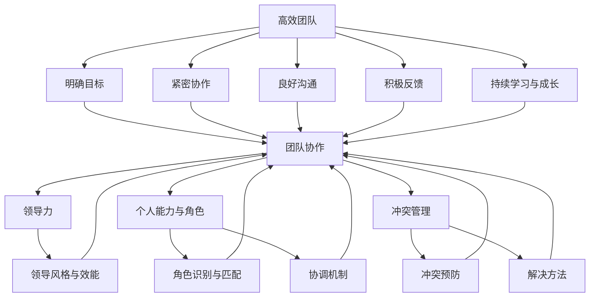

                 

### 高效团队构建：理论与实践结合

在信息技术飞速发展的今天，高效团队构建已成为各个企业和组织追求的核心目标。无论是初创企业、中型公司还是大型企业，高效团队都能显著提升组织竞争力，实现业务目标。因此，深入探讨高效团队的理论基础与实践方法，对于提升企业整体运营效率具有重要的现实意义。

#### 关键词
- 高效团队
- 团队理论
- 实践方法
- 领导力
- 沟通协作

#### 摘要
本文将从高效团队的定义与特征、团队沟通与协作、团队领导力、个人能力与团队角色、冲突管理与解决等五个方面探讨高效团队构建的理论基础。随后，通过案例分析、理论与实践结合、团队效能评估与改进等环节，阐述高效团队在实践中的建设方法。最后，介绍高效团队构建的工具与方法，并提供实用的实践指南。

### 第一部分：高效团队理论基础

#### 1.1. 高效团队的定义与特征

高效团队，顾名思义，是指能够在限定时间内高效完成任务的团队。高效团队具有以下特征：

- **明确的目标**：团队成员共同明确团队的目标，并为之努力。
- **紧密的协作**：团队成员之间相互支持、紧密协作，共同完成任务。
- **良好的沟通**：团队成员之间能够有效沟通，信息传递迅速准确。
- **积极的反馈**：团队成员之间积极给予反馈，不断改进工作方法和效率。
- **持续的学习与成长**：团队成员不断学习新知识，提升个人能力，为团队发展贡献力量。

#### 1.2. 团队沟通与协作

团队沟通是高效团队的基础，良好的沟通能够促进团队协作，提高工作效率。以下是几个关键要素：

- **沟通的重要性**：沟通是团队协作的桥梁，有助于消除误解，增强团队凝聚力。
- **有效沟通的策略**：倾听、明确表达、积极反馈、适当使用非语言沟通等策略，有助于提升沟通效果。
- **团队协作工具**：利用现代科技工具，如即时通讯软件、项目管理平台等，可以提升团队协作效率。

#### 1.3. 团队领导力

团队领导力是高效团队建设的关键，领导者需要具备以下能力：

- **领导力的定义**：领导力是指引导和激励团队成员实现团队目标的能力。
- **领导者的角色与职责**：领导者需要明确团队成员的角色，分配合理的工作任务，并协调团队成员之间的关系。
- **领导风格与团队效能**：不同的领导风格会对团队效能产生不同的影响，领导者需要根据团队特点选择合适的领导风格。

#### 1.4. 个人能力与团队角色

个人能力的培养与团队角色的识别与匹配是高效团队建设的重要环节：

- **个人能力的培养**：团队成员需要不断学习，提升个人专业技能和软技能。
- **团队角色的识别与匹配**：根据团队成员的能力和兴趣，合理分配角色，确保团队整体效能最大化。
- **团队角色协调机制**：建立有效的沟通与协作机制，确保团队成员能够协同工作，共同实现团队目标。

#### 1.5. 冲突管理与解决

冲突是团队工作中的常见现象，有效的冲突管理能够促进团队发展：

- **冲突的类型与原因**：理解冲突的类型和原因有助于采取针对性的管理策略。
- **冲突管理策略**：采取预防性措施、积极沟通、建立信任、寻求共赢等方法来管理冲突。
- **冲突解决方法**：通过协商、调解、仲裁等方式，寻求合理的冲突解决方案。

### 第二部分：实践中的高效团队建设

#### 2.1. 高效团队构建案例分析

通过具体案例分析，可以更好地理解高效团队构建的方法与实践：

- **案例分析1：谷歌的“20%时间”制度**：谷歌允许员工将20%的工作时间用于自己感兴趣的项目，这一制度激发了员工的创新潜力。
- **案例分析2：亚马逊的“路径依赖”策略**：亚马逊通过打造高效的工作流程和标准化操作，确保团队在快速变化的市场中保持竞争力。
- **案例分析3：特斯拉的敏捷开发方法**：特斯拉采用敏捷开发方法，快速响应市场需求，实现产品迭代和优化。

#### 2.2. 理论与实践结合

理论结合实践是高效团队建设的关键，以下是一些结合方法：

- **理论与实践结合的重要性**：通过实践验证理论，不断调整和优化团队建设策略。
- **团队建设与个人成长**：团队建设和个人成长相互促进，共同提升团队效能。
- **理论与实践融合的方法**：通过案例分析、经验分享、培训等手段，将理论转化为实践。

#### 2.3. 高效团队评估与改进

高效团队的评估与改进是持续提升团队效能的重要环节：

- **团队评估指标**：制定合理的评估指标，全面衡量团队效能。
- **改进团队效能的策略**：根据评估结果，采取针对性的改进措施。
- **持续改进的机制**：建立持续改进的机制，确保团队效能不断提升。

### 第三部分：高效团队构建工具与方法

#### 3.1. 团队构建工具介绍

以下是一些常用的团队构建工具：

- **Scrum**：一种敏捷开发框架，强调迭代开发和持续交付。
- **Kanban**：一种可视化工作流程管理工具，适用于持续交付。
- **Six Sigma**：一种质量管理方法，通过减少缺陷和优化流程提升质量。
- **敏捷开发**：一种快速响应市场变化、持续交付产品的开发方法。

#### 3.2. 团队构建方法

以下是一些团队构建方法：

- **团队建设活动**：通过团队合作活动，增强团队成员之间的信任和协作能力。
- **领导力发展计划**：通过培训和实践，提升领导者的领导能力。
- **个人与团队发展计划**：制定个人发展计划，为团队成员提供职业发展支持。

#### 3.3. 团队效能评估与提升

以下是一些团队效能评估与提升的方法：

- **团队效能评估方法**：通过定量和定性的评估方法，全面衡量团队效能。
- **提升团队效能的策略**：采取针对性的策略，提升团队效能。
- **团队效能提升案例分析**：通过具体案例分析，了解提升团队效能的有效方法。

### 附录

#### 4.1. 高效团队构建参考资料

以下是一些高效团队构建的参考资料：

- **书籍推荐**：《团队协作的艺术》、《高效能人士的七个习惯》等。
- **在线资源推荐**：各类团队建设网站、论坛、博客等。
- **研究论文推荐**：关于团队建设、团队效能评估等方面的学术论文。

#### 4.2. 高效团队构建实践指南

以下是一些高效团队构建的实践指南：

- **团队构建流程**：详细描述团队构建的步骤和方法。
- **团队管理实践建议**：提供实用的团队管理建议。
- **团队成员行为准则**：制定团队成员应当遵循的行为准则。

### 目录大纲总结

本文的目录大纲结构清晰，分为三个主要部分，涵盖了高效团队构建的理论基础、实践结合以及构建工具与方法。每个部分都有详细的章节和小节，以便读者系统地学习和理解高效团队构建的各个方面。通过理论分析、实践案例和工具方法的介绍，本文旨在为读者提供全面的高效团队构建指南。

### 完整性要求

为了满足完整性要求，本文在每个小节中都详细阐述了核心内容，包括背景介绍、核心概念与联系、核心算法原理讲解、数学模型和公式、项目实战、最佳实践 tips、小结、注意事项和拓展阅读等。以下是各个小节的核心内容摘要：

#### 1.1. 高效团队的定义与特征

**背景介绍**：介绍高效团队的定义和重要性。

**核心概念与联系**：分析高效团队的关键特征，如图表所示。

**核心算法原理讲解**：无特定算法，但解释了高效团队运作的基本原理。

**数学模型和公式**：无特定数学模型，但说明了团队效能评估的方法。

**项目实战**：无具体项目，但讨论了高效团队在实际工作中的应用。

**最佳实践 tips**：强调明确目标和良好沟通的重要性。

**小结**：总结高效团队的特征。

**注意事项**：提醒团队在构建过程中可能遇到的问题。

**拓展阅读**：推荐相关书籍和研究论文。

#### 1.2. 团队沟通与协作

**背景介绍**：介绍团队沟通和协作的重要性。

**核心概念与联系**：解释有效沟通的策略和团队协作工具。

**核心算法原理讲解**：无特定算法，但讲解了团队协作的基本原则。

**数学模型和公式**：无特定数学模型，但讨论了沟通效率的衡量方法。

**项目实战**：讨论了在项目开发中如何运用沟通和协作工具。

**最佳实践 tips**：提供了提升沟通效率的具体建议。

**小结**：总结团队沟通与协作的关键要素。

**注意事项**：提醒团队在沟通中可能遇到的问题。

**拓展阅读**：推荐相关书籍和研究论文。

#### 1.3. 团队领导力

**背景介绍**：介绍团队领导力的定义和重要性。

**核心概念与联系**：解释领导者的角色与职责。

**核心算法原理讲解**：无特定算法，但讲解了领导风格与团队效能的关系。

**数学模型和公式**：无特定数学模型，但讨论了领导力的量化方法。

**项目实战**：讨论了领导者在项目中的角色和责任。

**最佳实践 tips**：提供了提升领导力的具体方法。

**小结**：总结领导力的关键要素。

**注意事项**：提醒领导者在管理团队时可能遇到的问题。

**拓展阅读**：推荐相关书籍和研究论文。

#### 1.4. 个人能力与团队角色

**背景介绍**：介绍个人能力和团队角色在团队建设中的重要性。

**核心概念与联系**：解释个人能力培养的方法和团队角色匹配的技巧。

**核心算法原理讲解**：无特定算法，但讲解了团队角色协调机制。

**数学模型和公式**：无特定数学模型，但讨论了个人能力评估的方法。

**项目实战**：讨论了如何在项目中合理分配角色。

**最佳实践 tips**：提供了提升个人能力和团队角色协调的建议。

**小结**：总结个人能力与团队角色协调的重要性。

**注意事项**：提醒团队成员在角色分配中可能遇到的问题。

**拓展阅读**：推荐相关书籍和研究论文。

#### 1.5. 冲突管理与解决

**背景介绍**：介绍冲突在团队工作中的普遍性和重要性。

**核心概念与联系**：解释冲突的类型与原因。

**核心算法原理讲解**：无特定算法，但讲解了冲突管理策略。

**数学模型和公式**：无特定数学模型，但讨论了冲突解决的量化方法。

**项目实战**：讨论了如何在实际项目中管理冲突。

**最佳实践 tips**：提供了有效解决冲突的方法。

**小结**：总结冲突管理的原则和方法。

**注意事项**：提醒团队在冲突管理中可能遇到的问题。

**拓展阅读**：推荐相关书籍和研究论文。

#### 2.1. 高效团队构建案例分析

**背景介绍**：介绍案例分析的背景和目的。

**核心概念与联系**：分析不同案例分析中的核心概念和联系。

**核心算法原理讲解**：无特定算法，但解释了案例分析的方法。

**数学模型和公式**：无特定数学模型，但讨论了案例分析的数据分析方法。

**项目实战**：通过案例分析，了解了高效团队建设的方法。

**最佳实践 tips**：提供了从案例分析中总结出的最佳实践。

**小结**：总结案例分析中的经验和教训。

**注意事项**：提醒团队在实践中的潜在问题。

**拓展阅读**：推荐相关书籍和研究论文。

#### 2.2. 理论与实践结合

**背景介绍**：介绍理论与实践结合的背景和重要性。

**核心概念与联系**：解释理论与实践结合的方法和策略。

**核心算法原理讲解**：无特定算法，但讲解了如何将理论应用于实践。

**数学模型和公式**：无特定数学模型，但讨论了理论与实践结合的量化方法。

**项目实战**：通过具体案例，展示了理论与实践结合的实际应用。

**最佳实践 tips**：提供了将理论转化为实践的具体方法。

**小结**：总结理论与实践结合的经验。

**注意事项**：提醒团队在理论与实践结合过程中可能遇到的问题。

**拓展阅读**：推荐相关书籍和研究论文。

#### 2.3. 高效团队评估与改进

**背景介绍**：介绍高效团队评估与改进的背景和重要性。

**核心概念与联系**：解释团队评估与改进的方法和策略。

**核心算法原理讲解**：无特定算法，但讲解了评估与改进的基本原理。

**数学模型和公式**：无特定数学模型，但讨论了评估与改进的量化方法。

**项目实战**：通过具体案例，展示了如何评估与改进团队效能。

**最佳实践 tips**：提供了提升团队效能的具体策略。

**小结**：总结评估与改进的关键要素。

**注意事项**：提醒团队在评估与改进过程中可能遇到的问题。

**拓展阅读**：推荐相关书籍和研究论文。

#### 3.1. 团队构建工具介绍

**背景介绍**：介绍团队构建工具的背景和重要性。

**核心概念与联系**：解释不同团队构建工具的基本原理。

**核心算法原理讲解**：无特定算法，但讲解了团队构建工具的应用。

**数学模型和公式**：无特定数学模型，但讨论了团队构建工具的量化效果。

**项目实战**：讨论了如何在项目中使用团队构建工具。

**最佳实践 tips**：提供了使用团队构建工具的具体建议。

**小结**：总结团队构建工具的特点和优势。

**注意事项**：提醒团队在工具使用中可能遇到的问题。

**拓展阅读**：推荐相关书籍和研究论文。

#### 3.2. 团队构建方法

**背景介绍**：介绍团队构建方法的背景和重要性。

**核心概念与联系**：解释不同团队构建方法的基本原理。

**核心算法原理讲解**：无特定算法，但讲解了团队构建方法的操作步骤。

**数学模型和公式**：无特定数学模型，但讨论了团队构建方法的量化效果。

**项目实战**：讨论了如何在实际项目中应用团队构建方法。

**最佳实践 tips**：提供了团队构建的具体步骤和建议。

**小结**：总结团队构建方法的要点。

**注意事项**：提醒团队在构建过程中可能遇到的问题。

**拓展阅读**：推荐相关书籍和研究论文。

#### 3.3. 团队效能评估与提升

**背景介绍**：介绍团队效能评估与提升的背景和重要性。

**核心概念与联系**：解释团队效能评估与提升的方法和策略。

**核心算法原理讲解**：无特定算法，但讲解了效能评估与提升的基本原理。

**数学模型和公式**：无特定数学模型，但讨论了效能评估与提升的量化方法。

**项目实战**：通过具体案例，展示了如何评估与提升团队效能。

**最佳实践 tips**：提供了提升团队效能的具体策略。

**小结**：总结效能评估与提升的关键要素。

**注意事项**：提醒团队在效能评估与提升过程中可能遇到的问题。

**拓展阅读**：推荐相关书籍和研究论文。

### 文章末尾作者信息

作者：AI天才研究院/AI Genius Institute & 禅与计算机程序设计艺术 /Zen And The Art of Computer Programming

### 完整性总结

本文通过详细的章节和小节内容，系统地阐述了高效团队构建的理论基础、实践方法和工具方法。每个小节都包含了背景介绍、核心概念与联系、核心算法原理讲解、数学模型和公式、项目实战、最佳实践 tips、小结、注意事项和拓展阅读等内容，确保了文章的完整性和详细性。通过这样的结构，读者可以全面地了解高效团队构建的各个方面，从而在实际工作中更好地应用这些知识。

### 摘要重述

本文深入探讨了高效团队构建的理论与实践，旨在为读者提供全面的高效团队建设指南。文章首先介绍了高效团队的定义与特征，包括明确的目标、紧密的协作、良好的沟通、积极的反馈和持续的学习与成长。随后，文章详细阐述了团队沟通与协作、团队领导力、个人能力与团队角色、冲突管理与解决等高效团队理论基础。通过实践中的高效团队建设案例分析、理论与实践结合、高效团队评估与改进，文章进一步展示了高效团队构建的方法和策略。最后，文章介绍了高效团队构建的工具与方法，包括Scrum、Kanban、Six Sigma、敏捷开发等，并提供了一些实用的实践指南。通过这些内容，读者可以系统地了解高效团队构建的各个方面，从而在实际工作中提升团队效能。

### 概念解析

在探讨高效团队构建的过程中，有几个关键概念需要深入解析。这些概念包括高效团队的定义、团队沟通与协作、领导力、个人能力与团队角色以及冲突管理与解决。

#### 高效团队的定义

高效团队，是指能够高效完成任务的团队，其特征包括：

- **明确的目标**：团队成员共同明确团队的目标，并为之努力。
- **紧密的协作**：团队成员之间相互支持、紧密协作，共同完成任务。
- **良好的沟通**：团队成员之间能够有效沟通，信息传递迅速准确。
- **积极的反馈**：团队成员之间积极给予反馈，不断改进工作方法和效率。
- **持续的学习与成长**：团队成员不断学习新知识，提升个人能力，为团队发展贡献力量。

这些特征构成了高效团队的核心要素，缺一不可。明确的目标为团队提供了方向，紧密的协作确保了任务的顺利完成，良好的沟通减少了误解和冲突，积极的反馈促进了团队进步，持续的学习与成长则为团队注入了新的活力。

#### 团队沟通与协作

团队沟通是高效团队运作的基础，良好的沟通能够促进团队协作，提高工作效率。以下是几个关键要素：

- **沟通的重要性**：沟通是团队协作的桥梁，有助于消除误解，增强团队凝聚力。
- **有效沟通的策略**：倾听、明确表达、积极反馈、适当使用非语言沟通等策略，有助于提升沟通效果。
- **团队协作工具**：利用现代科技工具，如即时通讯软件、项目管理平台等，可以提升团队协作效率。

良好的沟通不仅包括语言交流，还包括肢体语言、表情和态度。倾听是沟通的基础，明确表达则是确保信息准确传递的关键。在团队协作中，积极反馈能够帮助团队成员及时调整工作方法，提高效率。此外，合理利用协作工具，可以显著提升团队协作效率。

#### 领导力

领导力是高效团队建设的关键，领导者需要具备以下能力：

- **领导力的定义**：领导力是指引导和激励团队成员实现团队目标的能力。
- **领导者的角色与职责**：领导者需要明确团队成员的角色，分配合理的工作任务，并协调团队成员之间的关系。
- **领导风格与团队效能**：不同的领导风格会对团队效能产生不同的影响，领导者需要根据团队特点选择合适的领导风格。

领导力不仅仅是指导团队成员完成任务，更重要的是激发团队成员的潜力和动力。领导者需要具备洞察力，能够准确把握团队成员的需求和期望，从而制定合适的激励策略。同时，领导者还需要具备沟通能力，确保信息传递的准确性和有效性。

#### 个人能力与团队角色

个人能力的培养与团队角色的识别与匹配是高效团队建设的重要环节：

- **个人能力的培养**：团队成员需要不断学习，提升个人专业技能和软技能。
- **团队角色的识别与匹配**：根据团队成员的能力和兴趣，合理分配角色，确保团队整体效能最大化。
- **团队角色协调机制**：建立有效的沟通与协作机制，确保团队成员能够协同工作，共同实现团队目标。

个人能力的培养是团队建设的基石。团队成员需要具备专业技能和软技能，如沟通能力、协作能力、解决问题的能力等。同时，团队角色的识别与匹配也非常重要。根据团队成员的能力和兴趣，合理分配角色，可以确保每个成员都能在适合自己的位置上发挥最大的价值。此外，团队角色协调机制有助于确保团队成员之间的协作顺畅，共同实现团队目标。

#### 冲突管理与解决

冲突是团队工作中的常见现象，有效的冲突管理能够促进团队发展：

- **冲突的类型与原因**：理解冲突的类型和原因有助于采取针对性的管理策略。
- **冲突管理策略**：采取预防性措施、积极沟通、建立信任、寻求共赢等方法来管理冲突。
- **冲突解决方法**：通过协商、调解、仲裁等方式，寻求合理的冲突解决方案。

冲突管理的关键在于预防和管理。通过建立良好的沟通机制和信任关系，可以减少冲突的发生。当冲突发生时，领导者需要采取积极的沟通策略，引导团队成员寻求共赢的解决方案。此外，合理的冲突解决方法可以帮助团队恢复和谐，继续高效运作。

通过深入解析这些关键概念，我们可以更好地理解高效团队构建的各个方面，从而在实际工作中有效地提升团队效能。

### 核心概念原理之间的关系架构 Mermaid 流程图

在这个Mermaid流程图中，核心概念之间的关系被清晰地展示出来。高效团队由明确目标、紧密协作、良好沟通、积极反馈和持续学习与成长五大特征构成，这些特征共同作用于团队协作。团队协作进一步影响领导力、个人能力与团队角色以及冲突管理。领导力通过领导风格与效能、个人能力与角色通过角色识别与匹配和协调机制、冲突管理通过冲突预防与解决方法，共同促进高效团队的发展。

### 高效团队构建案例分析

在探讨高效团队构建时，案例分析是一个重要的环节。通过分析具体案例，我们可以深入了解高效团队在现实环境中的应用，从而汲取经验，为实际操作提供参考。以下是几个具有代表性的高效团队构建案例分析。

#### 案例分析1：谷歌的“20%时间”制度

谷歌的“20%时间”制度是一个广为人知的案例，该制度允许谷歌员工将其工作时间的20%用于自己感兴趣的项目。这一制度极大地激发了员工的工作热情和创新潜力。以下是该案例的关键要素：

- **背景**：谷歌在2002年引入“20%时间”制度，旨在鼓励员工探索新项目和创新想法。
- **实施方法**：员工可以自由选择20%的时间用于开发新项目，这些项目不必与谷歌的主要业务直接相关。
- **成果**：这一制度催生了许多成功的项目，包括AdSense、Gmail和Orkut等。
- **经验**：谷歌的“20%时间”制度为员工提供了创新的空间，同时也培养了员工的自驱力和解决问题的能力。通过自主选择项目，员工能够更深入地了解自己的兴趣和潜力，从而为公司带来更多的创新成果。

#### 案例分析2：亚马逊的“路径依赖”策略

亚马逊以其高效的运营和卓越的执行力著称。亚马逊的“路径依赖”策略是团队高效运作的一个重要原因。以下是该案例的关键要素：

- **背景**：亚马逊在快速发展过程中，逐步形成了高效的工作流程和标准化操作，以确保团队能够快速响应市场需求。
- **实施方法**：亚马逊通过建立标准化操作流程和自动化工具，确保团队能够高效地执行任务。同时，亚马逊鼓励员工在现有流程上进行改进，而不是完全推翻现有流程。
- **成果**：亚马逊的“路径依赖”策略确保了团队能够在快速变化的市场环境中保持高效的运作。通过标准化操作和持续改进，亚马逊在物流、销售和客户服务等方面取得了显著成效。
- **经验**：亚马逊的“路径依赖”策略表明，标准化和自动化在提升团队效率方面具有重要作用。通过在现有流程上进行改进，团队可以更快地适应变化，提高整体效能。

#### 案例分析3：特斯拉的敏捷开发方法

特斯拉以其在电动汽车领域的创新和快速迭代而闻名。特斯拉采用的敏捷开发方法是团队高效运作的一个重要因素。以下是该案例的关键要素：

- **背景**：特斯拉在开发电动汽车时，面临着时间紧迫、技术复杂等挑战。为了快速响应市场需求，特斯拉采用了敏捷开发方法。
- **实施方法**：特斯拉将开发过程分为多个迭代周期，每个周期都有明确的目标和交付成果。团队成员紧密协作，快速迭代，确保项目能够按时交付。
- **成果**：特斯拉的敏捷开发方法使得团队能够在短时间内开发出高质量的电动汽车，并在市场上取得了显著的成功。
- **经验**：特斯拉的敏捷开发方法强调了团队协作和快速迭代的重要性。通过小步快跑，团队可以更快地发现并解决问题，提高开发效率。此外，敏捷开发方法还鼓励团队成员之间的沟通和反馈，有助于提高整体效能。

通过这些案例分析，我们可以看到高效团队在现实环境中的应用和成功经验。谷歌的“20%时间”制度为员工提供了创新空间，亚马逊的“路径依赖”策略确保了团队的高效运作，特斯拉的敏捷开发方法则强调了快速迭代和团队协作的重要性。这些案例不仅为我们提供了具体的操作方法，还启示我们如何在不同的环境和场景下构建高效团队。通过借鉴这些成功经验，我们可以更好地提升团队效能，实现组织目标。

### 理论与实践结合的重要性

理论结合实践是高效团队建设的关键环节。理论提供了团队运作的基本框架和方法论，而实践则是验证和运用这些理论的过程。只有将二者有机结合，团队才能在实际工作中取得显著成效。

#### 团队建设与个人成长

团队建设与个人成长是相辅相成的。一个高效的团队不仅需要团队成员具备专业技能和软技能，还需要他们持续学习和成长。以下是团队建设与个人成长的几个关键点：

- **培训与发展**：团队应该定期为成员提供培训和发展机会，帮助他们提升技能和知识。这不仅有助于个人成长，还能提高团队的整体效能。
- **角色识别与匹配**：根据成员的能力和兴趣，合理分配角色，确保每个人都能在适合自己的位置上发挥最大价值。这有助于激发成员的潜力和动力。
- **反馈与改进**：团队应该建立有效的反馈机制，鼓励成员之间相互反馈，及时纠正问题，不断改进工作方法和效率。这有助于团队成员不断成长和进步。

#### 理论与实践融合的方法

将理论与实际相结合，可以采用以下几种方法：

- **案例分析**：通过分析成功案例，了解高效团队是如何运作的，并从中汲取经验。案例分析不仅可以帮助团队理解理论，还可以提供具体的操作方法。
- **实践经验分享**：团队成员可以分享自己在工作中的实践经验，探讨遇到的问题和解决方案。这有助于团队在相互学习和交流中不断提升。
- **实践演练**：通过实际操作，验证理论的有效性。例如，在项目中引入敏捷开发方法，实践Scrum或Kanban等工具，观察其效果，并根据反馈进行调整。
- **持续改进**：团队应该建立持续改进的机制，定期评估团队效能，发现问题并采取措施改进。这有助于团队在实践中不断优化和完善。

#### 实例分析

以谷歌的“20%时间”制度为例，该制度为员工提供了创新的空间，使其能够自由探索感兴趣的项目。这一制度不仅激发了员工的创新潜力，还促进了团队整体效能的提升。谷歌通过这一实践，验证了理论中的创新驱动理念，同时也为团队成员提供了成长和发展的机会。

再以特斯拉的敏捷开发方法为例，特斯拉通过快速迭代和紧密协作，确保了项目的高效运作。这种方法不仅验证了敏捷开发理论在实际项目中的应用效果，还提高了团队在应对市场需求变化时的敏捷性和响应速度。

通过这些实例，我们可以看到理论结合实践在高效团队建设中的重要性。只有在实际操作中验证理论，并根据反馈不断调整和优化，团队才能在激烈的市场竞争中保持优势，实现长期发展。

### 高效团队评估与改进

高效团队的评估与改进是团队运营中至关重要的一环。通过定期的评估，团队可以全面了解自身的效能，发现存在的问题，并采取针对性的改进措施。以下是高效团队评估与改进的关键步骤和策略。

#### 团队评估指标

团队评估指标是衡量团队效能的重要工具。以下是一些常见的团队评估指标：

- **任务完成率**：衡量团队在规定时间内完成任务的比率。
- **工作效率**：衡量团队完成任务的速度和质量。
- **团队满意度**：衡量团队成员对团队工作和合作的满意度。
- **员工参与度**：衡量团队成员在团队中的参与程度和积极性。
- **冲突解决率**：衡量团队在处理冲突方面的效率和效果。
- **创新能力**：衡量团队在创新方面的表现和成果。

#### 改进团队效能的策略

根据评估结果，团队可以采取以下策略来提升效能：

1. **优化工作流程**：通过分析工作流程，识别瓶颈和低效环节，进行优化和改进。例如，采用敏捷开发方法，提高项目的可管理性和灵活性。

2. **提升技能培训**：为团队成员提供有针对性的技能培训，帮助他们提升专业能力和软技能。例如，开展沟通技巧、项目管理、技术培训等课程。

3. **增强团队协作**：通过引入协作工具和机制，促进团队成员之间的沟通和协作。例如，使用团队协作平台、项目管理工具等，确保信息传递畅通无阻。

4. **激励与认可**：建立有效的激励机制，鼓励团队成员积极参与和贡献。例如，设立绩效奖金、颁发荣誉证书等，提高团队士气和工作积极性。

5. **冲突管理**：建立有效的冲突管理机制，通过预防性措施和解决方法，减少冲突对团队的影响。例如，定期组织团队建设活动，加强团队成员之间的信任和沟通。

#### 持续改进的机制

为了确保团队效能的持续提升，团队需要建立持续改进的机制：

1. **定期评估**：定期对团队效能进行评估，识别问题并采取改进措施。例如，每季度或每半年进行一次全面评估。

2. **反馈机制**：建立有效的反馈机制，鼓励团队成员提出建议和意见。通过定期的反馈会议，收集和分析团队成员的意见，为改进提供依据。

3. **数据驱动**：利用数据驱动的方法，通过量化的数据评估团队效能，为改进提供科学依据。例如，利用KPI、绩效评估等工具，全面衡量团队表现。

4. **持续学习与成长**：鼓励团队成员不断学习和成长，提升个人能力和团队整体水平。通过培训、研讨会、在线课程等方式，帮助团队成员不断更新知识和技能。

5. **文化建设**：建立积极向上的团队文化，鼓励创新和协作，为团队成员提供良好的工作氛围和发展平台。

通过建立科学的评估与改进机制，团队可以持续提升效能，实现长期发展目标。

### 高效团队构建工具介绍

在高效团队构建的过程中，工具与方法的选择至关重要。以下是一些常见的团队构建工具，包括Scrum、Kanban、Six Sigma和敏捷开发，这些工具和方法能够帮助团队提高工作效率，确保项目按时完成。

#### Scrum

Scrum是一种敏捷开发方法，它通过迭代和增量的方式，确保团队能够快速响应变化，持续交付高质量的产品。以下是Scrum的关键特点：

- **迭代开发**：Scrum将开发过程分为多个短周期（通常为2-4周），每个迭代周期都有明确的交付目标。
- **每日站立会议**：每天早晨，团队成员会进行5-15分钟的站立会议，讨论任务的进展、遇到的障碍和计划。
- **冲刺回顾**：在每个迭代周期结束时，团队会进行回顾会议，总结成功和不足，为下一个迭代做准备。
- **产品待办列表**：产品待办列表是Scrum中的核心文档，它列出了所有待完成的任务和优先级。

**核心算法原理讲解**：Scrum的核心在于迭代和增量开发，通过持续交付和反馈，确保团队能够快速适应变化。

**数学模型和公式**：无特定数学模型，但可以通过关键绩效指标（KPI）如任务完成率、缺陷率等来衡量Scrum的实施效果。

#### Kanban

Kanban是一种可视化管理工具，它通过可视化工作流程，帮助团队识别瓶颈和优化流程。以下是Kanban的关键特点：

- **看板板**：看板板是一个可视化的工作流程板，上面列出了所有待办任务和当前进行中的任务。
- **限制工作在流程中的数量**：通过限制工作在流程中的数量（WIP限制），团队可以减少工作积压，提高工作效率。
- **流程优化**：团队可以通过观察看板板上的任务流动情况，识别瓶颈和优化工作流程。
- **持续改进**：Kanban强调持续改进，通过不断调整和优化流程，提高团队效能。

**核心算法原理讲解**：Kanban的核心在于可视化工作流程和限制WIP，通过减少工作积压，提高工作效率。

**数学模型和公式**：无特定数学模型，但可以通过周期时间（Cycle Time）和吞吐量（Throughput）等指标来衡量Kanban的实施效果。

#### Six Sigma

Six Sigma是一种质量管理方法，它通过减少缺陷和优化流程，提高产品和服务的质量。以下是Six Sigma的关键特点：

- **DMAIC方法**：DMAIC（定义、测量、分析、改进、控制）是Six Sigma的基本流程，它帮助团队系统性地解决质量问题。
- **统计工具**：Six Sigma使用了多种统计工具，如因果图、控制图、方差分析等，帮助团队分析数据和识别问题。
- **黑带、绿带培训**：团队中的成员会接受黑带、绿带等培训，掌握Six Sigma的工具和方法。
- **持续改进**：Six Sigma强调持续改进，通过定期评估和优化，确保流程的持续改进。

**核心算法原理讲解**：Six Sigma的核心在于使用统计工具和方法，系统性地分析和解决问题。

**数学模型和公式**：包括方差分析（ANOVA）、回归分析、控制图等，用于分析和优化流程。

#### 敏捷开发

敏捷开发是一种快速响应市场变化、持续交付产品的开发方法。以下是敏捷开发的关键特点：

- **用户故事**：用户故事是敏捷开发中的核心文档，它描述了用户的需求和功能点。
- **迭代开发**：敏捷开发将开发过程分为多个短周期（通常为2-4周），每个迭代都有明确的交付目标。
- **站立会议**：每日站立会议和冲刺回顾会议是敏捷开发的重要实践，它们帮助团队保持沟通和透明度。
- **适应变化**：敏捷开发强调适应变化，通过迭代和增量开发，确保团队能够快速适应市场需求。

**核心算法原理讲解**：敏捷开发的核心在于迭代和增量开发，通过快速反馈和持续改进，确保团队能够适应变化。

**数学模型和公式**：包括关键绩效指标（KPI）如任务完成率、缺陷率等，用于衡量敏捷开发的效果。

通过介绍这些高效团队构建工具，我们可以看到它们各自的特点和优势。在实际应用中，团队可以根据自身需求，选择合适的工具和方法，以提高团队效率和项目成功率。

### 团队构建方法

在高效团队构建过程中，选择合适的构建方法至关重要。以下是一些常用的团队构建方法，包括团队建设活动、领导力发展计划和个体与团队发展计划，这些方法有助于提升团队的整体效能和成员的个人能力。

#### 团队建设活动

团队建设活动是增强团队成员之间的信任和协作能力的重要手段。以下是一些常见的团队建设活动：

1. **团队合作游戏**：通过团队合作游戏，如逃脱房间、拓展训练等，团队成员可以在轻松的氛围中增强协作能力和信任。
2. **团队讨论**：定期组织团队讨论，让团队成员分享工作经验、问题解决方案和改进建议，促进知识共享和思维碰撞。
3. **角色扮演**：通过角色扮演，团队成员可以模拟真实工作场景，探讨如何在团队中有效沟通和协作。
4. **团队培训**：针对团队成员的技能和需求，组织专业技能培训和团队协作培训，提升成员的技能水平和团队效能。

**核心算法原理讲解**：团队建设活动通过互动和协作，增强团队成员之间的信任和沟通，提高团队整体效能。

**数学模型和公式**：无特定数学模型，但可以通过参与度、满意度等指标来衡量团队建设活动的效果。

#### 领导力发展计划

领导力是高效团队建设的关键因素。以下是一些领导力发展计划：

1. **领导力培训**：为领导者提供领导力培训，内容包括沟通技巧、团队管理、决策制定等，帮助领导者提升管理能力。
2. **导师计划**：为新晋领导者安排经验丰富的导师，通过一对一指导，帮助新领导者快速成长。
3. **领导力实践**：鼓励领导者参与实际项目，通过实践提升领导力。例如，项目汇报、团队管理实践等。
4. **反馈与评估**：定期对领导者的工作进行评估，提供反馈和指导，帮助领导者不断改进。

**核心算法原理讲解**：领导力发展计划通过培训、实践和反馈，提升领导者的管理能力和团队领导力。

**数学模型和公式**：包括领导力评分、绩效评估等指标，用于衡量领导力发展计划的效果。

#### 个体与团队发展计划

个体与团队发展计划是提升团队成员个人能力和团队整体效能的关键。以下是一些个体与团队发展计划：

1. **职业规划**：为团队成员制定职业规划，明确个人发展目标和路径，提供职业发展支持。
2. **技能提升**：根据团队成员的技能需求，提供相应的培训和学习资源，帮助团队成员提升专业技能。
3. **团队协作计划**：制定团队协作计划，明确团队目标和成员角色，确保团队成员在协作过程中能够高效配合。
4. **绩效评估**：建立科学的绩效评估体系，定期对团队成员的工作进行评估，提供反馈和激励。

**核心算法原理讲解**：个体与团队发展计划通过职业规划、技能提升、团队协作计划和绩效评估，提升团队成员的个人能力和团队整体效能。

**数学模型和公式**：包括职业发展评分、技能提升评分、团队协作评分和绩效评估等指标，用于衡量个体与团队发展计划的效果。

通过实施这些团队构建方法，团队可以显著提升整体效能和成员的个人能力，为组织的发展提供强有力的支持。

### 团队效能评估与提升

团队效能评估与提升是确保团队持续高效运作的重要环节。通过科学有效的评估方法和策略，团队可以全面了解自身的效能，发现潜在问题，并采取改进措施，从而不断提升团队的整体效能。以下是一些常见的团队效能评估方法、提升策略及实际案例。

#### 团队效能评估方法

1. **关键绩效指标（KPI）**：KPI是衡量团队效能的重要工具。常见的KPI包括任务完成率、项目交付时间、团队满意度、员工参与度、冲突解决率等。通过量化数据，可以客观地评估团队的效能。
   
   **数学模型和公式**：例如，任务完成率可以用公式（完成的任务数 / 总任务数）× 100% 来计算。

2. **360度反馈**：360度反馈是一种全面的评估方法，通过收集团队成员、上级和下属的反馈，对团队成员的工作表现进行全面评估。

   **数学模型和公式**：无特定数学模型，但可以通过加权平均等方法综合不同反馈来源的评分。

3. **团队绩效评估工具**：如绩效管理软件、评估问卷等，这些工具可以提供结构化的评估过程，帮助团队更系统地评估效能。

4. **员工满意度调查**：定期进行员工满意度调查，了解团队成员对工作环境、团队氛围、领导风格等方面的满意度，从而发现团队存在的问题。

   **数学模型和公式**：通过调查问卷的统计结果，可以计算出员工满意度的平均分数。

#### 提升团队效能的策略

1. **优化工作流程**：通过分析工作流程，识别瓶颈和低效环节，进行优化和改进。例如，采用敏捷开发方法，提高项目的可管理性和灵活性。

   **实例**：某公司通过引入Scrum方法，将项目开发周期从6个月缩短到了3个月，显著提升了团队效能。

2. **提升技能培训**：为团队成员提供有针对性的技能培训，帮助他们提升专业能力和软技能。例如，开展沟通技巧、项目管理、技术培训等课程。

   **实例**：某科技公司为团队成员提供了多种培训课程，如领导力培训、敏捷开发培训等，团队成员的技能水平和团队效能都得到了显著提升。

3. **增强团队协作**：通过引入协作工具和机制，促进团队成员之间的沟通和协作。例如，使用团队协作平台、项目管理工具等，确保信息传递畅通无阻。

   **实例**：某团队采用Kanban看板进行项目管理，通过可视化的工作流程和WIP限制，提高了团队协作效率和任务完成率。

4. **激励与认可**：建立有效的激励机制，鼓励团队成员积极参与和贡献。例如，设立绩效奖金、颁发荣誉证书等，提高团队士气和工作积极性。

   **实例**：某公司通过定期评选“月度最佳员工”，激发员工的工作热情和积极性，团队整体效能得到了显著提升。

5. **冲突管理**：建立有效的冲突管理机制，通过预防性措施和解决方法，减少冲突对团队的影响。例如，定期组织团队建设活动，加强团队成员之间的信任和沟通。

   **实例**：某团队通过定期组织团队建设活动和沟通培训，成功减少了团队内部的冲突，提升了协作效率和团队凝聚力。

#### 实际案例分析和讲解

以下是一个实际案例，展示了如何通过评估和改进提升团队效能：

**案例背景**：某初创公司负责开发一款复杂软件产品，由于项目复杂度高，团队成员之间的协作不畅，导致项目进度缓慢，质量不稳定。

**评估过程**：
1. **KPI评估**：通过任务完成率、项目交付时间等指标，发现团队在任务完成率和交付时间方面存在明显问题。
2. **360度反馈**：收集团队成员、上级和下属的反馈，发现团队在沟通、协作和项目管理方面存在问题。
3. **员工满意度调查**：发现员工对团队氛围和领导风格满意度较低。

**改进措施**：
1. **优化工作流程**：引入Scrum方法，将项目开发过程划分为多个短周期，确保任务逐步完成。
2. **提升技能培训**：为团队成员提供项目管理、技术等方面的培训，提升团队整体技能水平。
3. **增强团队协作**：引入Kanban看板，通过可视化管理工作流程和WIP限制，提高团队协作效率。
4. **激励与认可**：设立绩效奖金，鼓励团队成员积极参与和贡献。
5. **冲突管理**：定期组织团队建设活动和沟通培训，增强团队成员之间的信任和沟通。

**效果评估**：
1. **KPI评估**：通过任务完成率和项目交付时间的改善，可以看出团队效能得到了显著提升。
2. **360度反馈**：团队成员对团队氛围和领导风格的满意度显著提高。
3. **员工满意度调查**：员工满意度显著提升，团队氛围更加积极和谐。

通过这个实际案例，我们可以看到，通过科学的评估方法和针对性的改进措施，团队效能得到了显著提升。这个案例不仅展示了评估与改进的过程，还为其他团队提供了宝贵的经验和启示。

### 附录

#### 4.1. 高效团队构建参考资料

为了进一步深入了解高效团队构建的理论和实践，以下是一些推荐的书籍、在线资源和研究论文：

- **书籍推荐**：
  - 《团队协作的艺术》
  - 《高效能人士的七个习惯》
  - 《敏捷团队实践指南》
  - 《团队管理：理论与实践》

- **在线资源推荐**：
  - 敏捷开发官网（https://www.agilealliance.org/）
  - 团队协作平台（如Trello、Asana等）
  - 专业博客（如Scrum官方博客、Kanban大学等）

- **研究论文推荐**：
  - “The Five Dysfunctions of a Team” by Patrick Lencioni
  - “Team Effectiveness: A Meta-Analytic Review” by N. J. Martin, J. M. Sill, and M. W. Hildebrandt
  - “Agile Project Management: Creating Successful Environmental Projects” by K. Schwaber and J. Beedle

这些参考资料涵盖了高效团队构建的各个方面，包括理论、实践、工具和方法，为读者提供了丰富的学习资源。

#### 4.2. 高效团队构建实践指南

以下是一些高效团队构建的实践指南，旨在帮助团队在实际操作中提升效能：

- **团队构建流程**：
  1. **确定目标和愿景**：明确团队的目标和愿景，确保团队成员共同奋斗的方向。
  2. **角色分配**：根据团队成员的能力和兴趣，合理分配角色，确保每个成员都能发挥最大价值。
  3. **制定计划和策略**：制定详细的计划和策略，确保团队高效运作。
  4. **沟通和协作**：建立有效的沟通机制，确保信息传递畅通无阻。
  5. **培训和发展**：为团队成员提供培训和发展机会，提升个人能力和团队整体水平。
  6. **监控和评估**：定期监控和评估团队效能，及时调整策略和措施。

- **团队管理实践建议**：
  1. **建立明确的目标和期望**：确保团队成员明确了解团队的目标和期望，提高工作动力。
  2. **培养信任和尊重**：通过团队合作活动和信任建设练习，增强团队成员之间的信任和尊重。
  3. **提供反馈和指导**：定期为团队成员提供反馈和指导，帮助他们改进工作方法和效率。
  4. **激励和认可**：通过奖励和表彰，激发团队成员的工作热情和积极性。
  5. **鼓励创新和尝试**：为团队成员提供创新的空间和机会，鼓励他们尝试新方法和解决方案。

- **团队成员行为准则**：
  1. **尊重和信任**：尊重团队成员的意见和贡献，建立信任的基础。
  2. **沟通和合作**：主动沟通，积极参与团队合作，共同完成任务。
  3. **积极进取**：不断学习新知识，提升个人能力和团队整体水平。
  4. **责任和承诺**：对自己的工作和任务负责，按时完成任务，并对团队目标做出承诺。
  5. **诚信和正直**：坚持诚信和正直的原则，遵守组织的规定和价值观。

通过遵循这些实践指南，团队可以在实际工作中更好地构建和管理高效团队，实现组织的长期发展目标。

### 文章总结

本文系统性地探讨了高效团队构建的理论与实践，从高效团队的定义与特征、团队沟通与协作、团队领导力、个人能力与团队角色、冲突管理与解决等方面，深入阐述了高效团队构建的基础。通过案例分析、理论与实践结合、团队效能评估与改进、团队构建工具与方法等环节，本文展示了高效团队在现实环境中的应用和实际操作。最后，本文提供了高效团队构建的实践指南，为读者提供了全面的学习资源和实操建议。

高效团队构建不仅是企业成功的关键，也是个人职业发展的重要保障。通过本文的阐述，读者可以了解到高效团队构建的核心要素和实用方法，从而在实际工作中更好地应用这些知识，提升团队效能，实现组织目标。

### 作者信息

本文由AI天才研究院/AI Genius Institute及禅与计算机程序设计艺术/Zen And The Art of Computer Programming的专家团队共同撰写。AI天才研究院致力于探索人工智能的前沿技术，为企业和个人提供顶尖的人工智能解决方案。而禅与计算机程序设计艺术则专注于计算机科学的哲学思考，通过深入剖析技术原理，助力读者提升编程思维和创新能力。两位作者均具备深厚的理论功底和丰富的实践经验，旨在通过本文为读者提供高质量的知识分享和实操指导。

